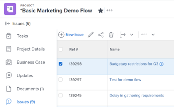

# 문제 만들기

<!--

The highlighted information on this page refers to functionality not yet generally available. It is available only in the Preview environment for all customers. After the monthly releases to Production, the same features are also available in the Production environment for customers who enabled fast releases. 

For information about fast releases, see [Enable or disable fast releases for your organization](../../../administration-and-setup/set-up-workfront/configure-system-defaults/enable-fast-release-process.md).  

For information about the current release, see [Fourth Quarter 2023 release overview](../../../product-announcements/product-releases/23-q4-release-activity/23-q4-release-overview.md).  

-->

프로젝트를 작업하는 동안 예기치 않은 이벤트가 발생할 수 있습니다. 이러한 예기치 않은 이벤트를 특정 프로젝트 또는 작업에 대한 문제로 기록할 수 있습니다. 적절한 액세스 권한이 있는 사용자는 프로젝트 또는 작업이 완료될 때까지 문제 상태를 보고 모니터링할 수 있으므로 긴 이메일 체인 또는 상태 미팅이 필요하지 않습니다. 계획된 이벤트인 작업과 달리 문제는 Adobe Workfront에서 계획되지 않은 작업 항목을 나타냅니다.

프로젝트에 문제를 요청으로 추가할 수도 있습니다. 자세한 내용은 [Adobe Workfront 요청 만들기 및 제출](../../../manage-work/requests/create-requests/create-submit-requests.md).

>[!TIP]
>
>문제와 요청은 Workfront에서 서로 교환하여 사용됩니다. 프로젝트와 작업 모두에 문제를 기록하여 해결해야 하는 예기치 않은 작업을 표시할 수 있습니다. 요청 대기열로 지정된 프로젝트에 문제로 기록된 요청을 제출할 수도 있습니다.

## 액세스 요구 사항

이 문서의 단계를 수행하려면 다음 액세스 권한이 있어야 합니다.

<table style="table-layout:auto"> 
 <col> 
 <col> 
 <tbody> 
  <tr> 
   <td role="rowheader">Adobe Workfront 플랜*</td> 
   <td> 
모든
 </td> 
  </tr> 
  <tr> 
   <td role="rowheader">Adobe Workfront 라이센스*</td> 
   <td> 
프로젝트 또는 작업에 문제를 추가하려면 검토 이상
 
요청 대기열을 사용하여 문제를 요청으로 추가하려면 요청 이상
 </td> 
  </tr> 
  <tr> 
   <td role="rowheader">액세스 수준 구성*</td> 
   <td> 
문제에 대한 액세스 편집
 
프로젝트 및 작업에 대한 보기 또는 상위 액세스 권한
 
참고: 여전히 액세스 권한이 없는 경우 Workfront 관리자에게 액세스 수준에서 추가 제한을 설정하는지 문의하십시오. 액세스 수준의 문제에 대한 액세스와 관련된 자세한 내용은 <a href="../../../administration-and-setup/add-users/configure-and-grant-access/grant-access-issues.md" class="MCXref xref">문제에 대한 액세스 권한 부여</a>. Workfront 관리자가 액세스 수준을 변경하는 방법에 대한 자세한 내용은 <a href="../../../administration-and-setup/add-users/configure-and-grant-access/create-modify-access-levels.md" class="MCXref xref">사용자 정의 액세스 수준 만들기 또는 수정</a>. 
 </td> 
  </tr> 
  <tr> 
   <td role="rowheader">개체 권한</td> 
   <td> 
문제를 만드는 작업 또는 프로젝트에 문제를 추가할 수 있는 기능을 가진 참여자 이상의 권한
 
 문제에 대한 권한 부여에 대한 자세한 내용은 <a href="../../../workfront-basics/grant-and-request-access-to-objects/share-an-issue.md" class="MCXref xref">문제 공유 </a>
 
추가 권한 요청에 대한 자세한 내용은 <a href="../../../workfront-basics/grant-and-request-access-to-objects/request-access.md" class="MCXref xref">오브젝트에 대한 액세스 요청 </a>.
 </td> 
  </tr> 
 </tbody> 
</table>

&#42;보유 중인 플랜, 라이선스 유형 또는 액세스 권한을 확인하려면 Workfront 관리자에게 문의하십시오.

<!--
(NOTE: in NWE Requestors CAN see the Issues tab on a project but in classic they cannot! However, even when they DO see it, they cannot enter the issues - logged this issue for it but they might decide not to fix it: https://hub.workfront.com/issue/60181e28000058980cce29597185b2d6/updates?email-source=comm)

-->

## 문제 생성 제한 사항

올바른 액세스 및 권한이 있으면 프로젝트 또는 작업에 문제를 만들 수 있습니다. 그러나 문제를 만들지 못할 수 있는 경우는 다음과 같습니다.

* Workfront 관리자 또는 그룹 관리자는 프로젝트 환경 설정 영역에서 완료 또는 중단 상태인 프로젝트에 문제를 추가할 수 있도록 설정해야 합니다. 프로젝트 환경 설정 지정에 대한 자세한 내용은 [시스템 전체 프로젝트 환경 설정 구성](../../../administration-and-setup/set-up-workfront/configure-system-defaults/set-project-preferences.md).
* 승인 보류 중인 프로젝트에 문제를 추가할 수 없습니다.

## 새 문제 양식 준비

문제를 기록하는 시기와 방법에 대해 조직이 잘 정의된 프로세스를 갖추고 있어야 합니다. 이 프로세스를 구성할 때 첫 번째 단계는 문제 제출에 필요한 양식을 만드는 것입니다. 문제를 작업 및 프로젝트에 직접 추가하도록 허용할지 또는 문제가 제출된 요청 대기열이 있는 경우 사용자가 새 문제를 제출하고 완료해야 할 때 사용할 수 있는 사용자 정의 필드 및 Workfront 필드를 정의할 수 있습니다. 새 문제 양식에는 문제를 신속하게 해결하는 데 도움이 되는 중요한 정보가 포함될 수 있습니다.

프로젝트의 새 문제에 대한 필드는 문제가 기록될 프로젝트의 대기열 세부 정보 섹션에 정의됩니다. 프로젝트의 대기열 세부 정보 섹션 구성에 대한 자세한 내용은 [요청 대기열 만들기](../../../manage-work/requests/create-and-manage-request-queues/create-request-queue.md).

문제를 요청 대기열로 제출하여 문제를 만드는 방법에 대한 자세한 내용은 다음을 참조하십시오. [새 요청을 입력하여 문제 만들기](#create-issues-by-entering-a-new-request) 이 문서의 섹션.

## 새 문제 버튼을 사용하여 작업 또는 프로젝트에 문제 생성

프로젝트에서 새 문제 양식의 필드를 정의한 후 문제 만들기를 시작할 수 있습니다.

<!-- OLD UI: redesigned on Oct 26, 2023:

Creating issues differs depending on which environment you choose to create the issue. 

### Create issues on a task or project using the New Issue button in the Production environment

To create an issue on a task or a project:

1. Go to a project where you want to create the issue. 
1. (Optional) If you want to log the issue for a task, go to the **Tasks** area, then click the name of a task. 
1. Click the **Issues** section.

   

1. Click **New Issue**.

   

1. (Conditional) If the project creator created Queue Topics or Topic Groups on the project they are added to the new issue form. Specify the **Topic Group** or the **Queue Topic** of your new issue. Topic Groups and Queue Topics have names customized to your environment.  
   For more information about creating Topic Groups, see [Create Topic Groups](../../../manage-work/requests/create-and-manage-request-queues/create-topic-groups.md). For more information about creating Queue Topics, see [Create Queue Topics](../../../manage-work/requests/create-and-manage-request-queues/create-queue-topics.md).

   

   * If there is only one Queue Topic set on the project, it is displayed automatically.
   * If the Topic Group does not have any Queue Topics or Topic Groups under it, nothing is available in the Topic Group drop-down.

1. (Conditional) If the project creator allowed for the **Request Type** field to display on the New Issue form, select the type of your issue from the following options:

   * Bug Report
   * Change Order
   * Issue
   * Request  
     Depending on how your Workfront administrator has configured your Project Preferences, the names of the issue types might be different for you. 

   >[!TIP]
   >
   >The Request Types must be enabled in the Queue Details and as well as when creating the Queue Topic to display as a selection in the New Issue form. For information, see the following articles: 
   >* [Create a Request Queue](../../requests/create-and-manage-request-queues/create-request-queue.md)
   >  * [Create Queue Topics](../../requests/create-and-manage-request-queues/create-queue-topics.md)

1. Add a name for the new issue in the **Issue Name** field. 
1. Continue specifying the fields available in the **New Issue** form. For more information about the fields available as you enter a new issue, see [Edit issues](../../../manage-work/issues/manage-issues/edit-issues.md).

   >[!IMPORTANT]
   >
   >Not all the issue-related fields are available in the New Issue form. The project creator enables the fields available when creating an issue when they define the Queue Details area of the project. For more information, see [Create a Requests Queue](../../requests/create-and-manage-request-queues/create-request-queue.md). 

1. (Conditional) If the Queue Topics are associated with a custom form, that custom form will display in the **New Issue** form.  
   Or  
   If the project is associated with an issue custom form through the Queue Details area, the form displays in the **New Issue** form, after the default Workfront fields.

   For information, see [Create a Request Queue](../../../manage-work/requests/create-and-manage-request-queues/create-request-queue.md).

1. Click **Save New Issue.**

Issues can be assigned to multiple users, job roles or to a team. For more information about assigning and managing requests, see [Manage work and team requests](../../../people-teams-and-groups/work-with-team-requests/manage-work-and-team-requests.md).

<!--When this is coming to Production, remove the "Production" section above and replace it with the following content:
-->

작업 또는 프로젝트에 문제를 만들려면 다음 작업을 수행하십시오.

1. 문제를 만들려는 프로젝트로 이동합니다.
1. (선택 사항) 작업에 대한 문제를 기록하려면 **작업** 영역을 클릭한 다음 작업 이름을 클릭합니다.
1. 다음을 클릭합니다. **문제** 섹션.

   

1. 클릭 **새 문제**.
새 문제 상자가 표시됩니다.

   

1. (조건부) 프로젝트 생성자가 프로젝트에서 대기열 주제 또는 주제 그룹을 생성하면 새 문제 양식에 추가됩니다. 다음을 지정합니다. **주제 그룹** 또는 **대기열 주제** 을 참조하십시오. 주제 그룹 및 대기열 주제의 이름이 사용자 환경에 맞게 사용자 정의되었습니다.\
   주제 그룹 만들기에 대한 자세한 내용은 [주제 그룹 만들기](../../../manage-work/requests/create-and-manage-request-queues/create-topic-groups.md). 대기열 주제 만들기에 대한 자세한 내용은 [대기열 주제 만들기](../../../manage-work/requests/create-and-manage-request-queues/create-queue-topics.md).

   * 프로젝트에 설정된 대기열 주제가 하나뿐인 경우 자동으로 표시됩니다.
   * 주제 그룹에 대기열 주제 또는 주제 그룹이 없으면 주제 그룹 드롭다운에서 사용할 수 없습니다.

1. 에 문제 이름 추가 **제목** 필드, 추가 **설명**.

1. (조건부) 프로젝트 생성자가 **요청 유형** 새 문제 양식에 표시할 필드에서 다음 선택 사항 중에서 문제 유형을 선택합니다.

   * 버그 신고
   * 순서 변경
   * 문제
   * 요청\
     Workfront 관리자가 프로젝트 환경 설정을 구성한 방법에 따라 문제 유형의 이름이 다를 수 있습니다.

   >[!TIP]
   >
   >요청 유형은 대기열 세부 정보 및 대기열 주제를 만들 때뿐만 아니라 새 문제 양식에 선택 항목으로 표시할 때에도 활성화되어야 합니다. 자세한 내용은 다음 문서를 참조하십시오.
   >* [요청 대기열 만들기](../../requests/create-and-manage-request-queues/create-request-queue.md)
   >  * [대기열 주제 만들기](../../requests/create-and-manage-request-queues/create-queue-topics.md)

1. 에서 사용할 수 있는 필드를 계속 지정합니다. **새 문제** 양식. 새 문제를 입력할 때 사용할 수 있는 필드에 대한 자세한 내용은 [문제 편집](../../../manage-work/issues/manage-issues/edit-issues.md).

   >[!IMPORTANT]
   >
   >새 문제 양식에서 모든 문제 관련 필드를 사용할 수 있는 것은 아닙니다. 프로젝트 생성자는 프로젝트의 대기열 세부 정보 영역을 정의할 때 문제를 생성할 때 사용할 수 있는 필드를 활성화합니다. 자세한 내용은 [요청 대기열 만들기](../../requests/create-and-manage-request-queues/create-request-queue.md).

1. (조건부) 대기열 주제가 사용자 정의 양식과 연관되어 있으면 해당 사용자 정의 양식이 **새 문제** 양식.\
   또는\
   프로젝트가 대기열 세부 정보 영역을 통해 문제 사용자 정의 양식과 연결된 경우 양식에 **새 문제** 양식, 기본 Workfront 필드 뒤

   자세한 내용은 [요청 대기열 만들기](../../../manage-work/requests/create-and-manage-request-queues/create-request-queue.md).

1. 클릭 **제출**.

   여러 사용자, 작업 역할 또는 팀에 문제를 할당할 수 있습니다. 요청 할당 및 관리에 대한 자세한 내용은 [작업 및 팀 요청 관리](../../../people-teams-and-groups/work-with-team-requests/manage-work-and-team-requests.md).

## 작업 또는 프로젝트에 대한 문제 인라인 만들기

>[!IMPORTANT]
>
>프로젝트 소유자는 **사용자가 문제를 인라인으로 추가하도록 허용** 프로젝트 문제 설정을 정의할 때 프로젝트 또는 작업에 인라인으로 문제를 추가할 수 있습니다. 프로젝트에 대한 문제 설정 구성에 대한 자세한 내용은 [프로젝트 편집](../../../manage-work/projects/manage-projects/edit-projects.md).
>

여러 문제를 빠르게 추가하려면 문제 목록에 작업 또는 프로젝트를 추가하여 인라인 문제를 만들 수 있습니다.

>[!NOTE]
>
>인라인으로 문제를 추가할 때 Workfront은 새 문제에 새 문제 양식을 적용하지 않습니다. 사용자가 문제를 입력할 때 특정 정보를 제공하기를 원하는 경우 인라인 문제를 추가하지 않는 것이 좋습니다. 이렇게 하면 문제 보고 및 나중에 문제에 할당된 사용자가 문제 해결에 필요한 모든 정보를 보유하는 기능에 부정적인 영향을 미칠 수 있습니다.

인라인으로 문제를 생성하려면 다음을 수행합니다.

1. 문제를 만들려는 프로젝트로 이동합니다.
1. (선택 사항) 작업에 대한 문제를 기록하려면 **작업** 섹션을 클릭한 다음 작업 이름을 클릭합니다.
1. 다음을 클릭합니다. **문제** 섹션.
1. 클릭 **더 많은 문제 추가**.

   문제 섹션의 문제 목록에 새 줄이 만들어집니다.

   >[!TIP]
   >
   >프로젝트 편집 상자에서 사용자 문제 추가 허용 인라인 설정이 선택 취소되면 이 옵션이 흐리게 표시됩니다. 자세한 내용은 [프로젝트 편집](../../../manage-work/projects/manage-projects/edit-projects.md).

   

1. 이름 필드에 문제 이름을 입력한 다음 인라인으로 문제에 대한 추가 정보를 계속 추가합니다.

   >[!TIP]
   >
   >인라인 편집에 사용할 수 있는 필드는 문제 목록에 적용하는 보기에서 사용할 수 있습니다. 다음 유형의 필드를 인라인 편집하지 못할 수 있습니다.
   >   
   >* 다른 오브젝트에 속한 필드
   >* 편집할 수 있는 액세스 권한이 없는 필드
   >* 계산이며 Workfront에 의해 자동으로 업데이트되는 필드

1. Enter 키를 클릭하여 인라인 편집을 완료하고 문제를 프로젝트 또는 작업에 추가합니다.

## 새 요청을 입력하여 문제 만들기 {#create-issues-by-entering-a-new-request}

프로젝트를 문제 수신을 위한 콘센트로 지정할 수 있습니다. 이러한 유형의 프로젝트를 Workfront의 요청 대기열이라고 합니다. 메인 메뉴의 요청 영역을 통해 요청 대기열에 액세스할 수 있습니다.

>[!TIP]
>
>&quot;문제&quot; 및 &quot;요청&quot;이라는 용어는 Workfront에서 상호 교환 가능합니다.

프로젝트를 요청 대기열로 설정하여 문제를 수신하는 방법에 대한 자세한 내용은 [요청 대기열 만들기](../../../manage-work/requests/create-and-manage-request-queues/create-request-queue.md). 요청 제출에 대한 자세한 내용은 [Adobe Workfront 요청 만들기 및 제출](../../../manage-work/requests/create-requests/create-submit-requests.md).
