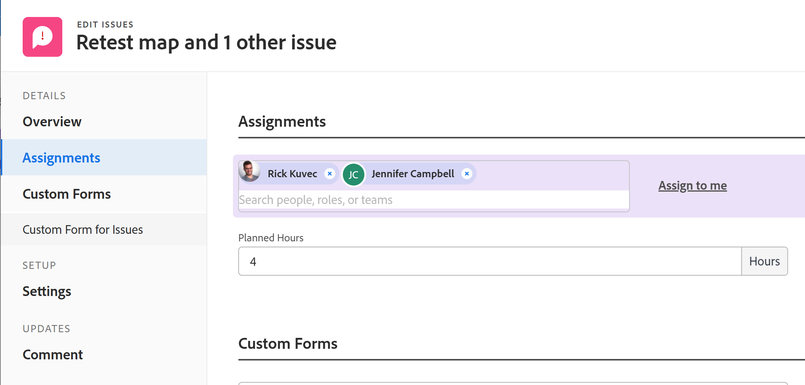

# 목록의 여러 문제에 대한 사용자 할당 수정

<!--Audited: 07/2024-->
<!--

(NOTE: similar article exists for tasks)

-->

<!--
 

The highlighted information on this page refers to functionality not yet generally available. It is available only in the Preview environment for all customers. The same features will also be available in the Production environment for all customers starting with a week from the Preview release.      

For more information, see [Interface modernization](/help/quicksilver/product-announcements/product-releases/interface-modernization/interface-modernization.md).  

 -->

사용자 할당을 여러 문제로 동시에 수정할 수 있습니다. 문제를 편집하거나 한 번에 하나씩 할당하는 방법에 대한 자세한 내용은 다음 문서를 참조하십시오.

* [문제 편집](../../../manage-work/issues/manage-issues/edit-issues.md)
* [문제 할당](../../../manage-work/issues/manage-issues/assign-issues.md)

문제 할당에 대한 일반적인 정보는 [문제 할당 수정 개요](../../../manage-work/issues/manage-issues/modify-issue-assignments-overview.md)를 참조하십시오.

>[!NOTE]
>
>문제에 할당하려면 문제에 대해 적어도 기여자 권한이 있어야 합니다.

## 액세스 요구 사항

+++ 을 확장하여 이 문서의 기능에 대한 액세스 요구 사항을 봅니다. 

<table style="table-layout:auto"> 
 <col> 
 <col> 
 <tbody> 
  <tr> 
   <td>Adobe Workfront 패키지</td> 
   <td> 
임의
 </td> 
  </tr> 
  <tr> 
   <td>Adobe Workfront 라이선스</td> 
   <td> 
표준

   
요청 이상
 </td> 
  </tr> 
  <tr> 
   <td>액세스 수준 구성</td> 
   <td> 
문제에 대한 액세스 편집
 
프로젝트 및 작업에 대한 보기 이상의 액세스 권한으로 하나의 문제 할당
 </td> 
  </tr> 
  <tr> 
   <td>개체 권한</td> 
   <td> 
문제에 대한 권한 관리
 
여러 문제를 할당할 때 문제가 있는 프로젝트 또는 작업에 권한 이상을 부여하십시오.
  </td> 
  </tr> 
 </tbody> 
</table>

자세한 내용은 [Workfront 설명서의 액세스 요구 사항](/help/quicksilver/administration-and-setup/add-users/access-levels-and-object-permissions/access-level-requirements-in-documentation.md)을 참조하십시오.

+++

<!--

<h2>When to modify user assignments on issues</h2>

(NOTE:  drafted and moved to the overview article: Modify issue assignments overview)

You might want to modify the user assignments for multiple issues for a variety of  reasons, including the following:

<ul>
<li>Users join or leave  your team</li>
<li>A user takes a vacation that extends beyond the issue  due dates</li>
<li>A specific role or user is set as the assignee for multiple issues and you want to quickly modify all items to be assigned to a different user or role</li>
</ul>

-->

## 여러 문제에 대한 할당 수정

1. 할당을 수정하려는 문제가 포함된 문제 목록으로 이동합니다.
1. (선택 사항) 필터를 만들어 수정하려는 할당자에게 할당된 문제만 표시합니다.

   예를 들어 피할당자로서 특정 역할이 있는 문제만 표시하도록 필터를 만들 수 있습니다.  그런 다음 역할을 특정 사용자로 바꿀 수 있습니다. 다음을 수행합니다.

   1. **필터** 드롭다운 목록을 클릭한 다음 **새 필터**&#x200B;을 클릭합니다.

   1. 첫 번째 필드에 **할당 역할**&#x200B;을(를) 입력하고 목록에서 **할당 역할: 이름**&#x200B;을(를) 선택하십시오.
   1. 수정자 드롭다운 메뉴에서 **다음 중 하나임**&#x200B;을(를) 선택한 다음 역할 이름을 입력하고 목록에 표시될 때 선택합니다. 여러 역할을 입력할 수 있습니다.

      >[!TIP]
      >
      >이 필드는 문제 소유자만 참조하고 모든 피할당자는 참조하지 않으므로 **할당 대상**&#x200B;을 사용하지 마십시오.

      문제 목록은 필터 조건에 맞게 자동으로 필터링합니다.
   1. (선택 사항) **새 이름으로 저장**&#x200B;을 클릭한 다음 **저장**&#x200B;을 클릭합니다.

1. 할당을 수정할 문제를 선택한 다음 **편집** 아이콘 을 클릭합니다.

   **문제 편집**&#x200B;이 표시됩니다. 선택한 항목의 수가 페이지의 왼쪽 위 모서리에 표시됩니다.

1. 왼쪽 패널에서 **할당**&#x200B;을 클릭한 다음 제거할 할당자 옆에 있는 **x** 아이콘을 클릭합니다.

   >[!TIP]
   >
   >선택한 모든 문제에 할당된 할당자만 **할당** 영역에 표시됩니다.

   

1. 선택한 모든 문제에 피할당자를 추가하려면 사용자, 역할 또는 팀의 이름을 입력하십시오.

   >[!TIP]
   >
   >여러 사용자, 작업 역할 또는 팀을 할당할 수 있습니다. 활성 사용자, 작업 역할 및 팀만 할당할 수 있습니다.
   >
   >비활성화되기 전에 사용자, 작업 역할 또는 팀이 할당된 경우 작업 항목에 할당된 상태로 유지됩니다. 이 경우 다음 사항을 권장합니다.
   >
   >* 작업 항목을 활성 리소스에 재할당합니다.
   >* 비활성화된 팀의 사용자를 활성 팀과 연결하고 작업 항목을 활성 팀에 재할당합니다.

   추가된 할당자는 기존 할당자에 추가됩니다. 선택한 각 문제에 대해 기존 항목을 대체하지 않습니다.

1. (선택 사항) 모든 문제를 자신에게 할당하려면 **나에게 할당**&#x200B;을 클릭합니다.
1. **저장**&#x200B;을 클릭합니다.

   <!--Old functionality for assignments for issues - before November 2025:
   1. (Conditional) In the Production environment, do the following: 
   1. Go to the **Assignments** section, then select **Assignee**.
      
   1. Do one of the following:
      1. To add a new assignee:
         1. Start typing the name of a user, role, or team, then select it when it displays in the list. The assignment is added and does not replace the current assignments on the selected issues.
         >[!TIP]
         >
         >You can assign multiple users, job roles, or teams. You can assign only active users, job roles, and teams.
         >
         >If a user, job role, or a team was assigned before they were deactivated, they remain assigned to the work item. In this case, we recommend the following:
         >
         >* Reassign the work item to active resources.
         >* Associate the users in a deactivated team with an active team and reassign the work item to the active team.
          Information that is common across all issues selected displays. For example, if the same user is assigned to all issues, that user displays in the **Assignee**  column. If information is not common across the issues selected, no information displays.
      1. To remove individual assignees:
         1. Click the **X icon** next to the name of the assignee that you want to remove if the assignee displays in the Assignments list.
            Or
            If the assignee that you want to remove does not display in the Assignments section because the assignee is assigned to only some of the issues that you have selected, click **Remove Assignee** and start typing the name of the assignee that you want to remove, then click the name when it appears in the drop-down list.
         1. Click  **Remove Assignee** again to add another assignee to remove.
      1. To remove all existing assignees:
         1. Click **Remove All Existing Assignees**, then click **Yes, Delete All Assignees**.
            This removes not only common assignees (assignees that are displayed in the edit  dialog box), but also all assignees on all the selected issues.
         1. (Optional) Modify any of the following options for the assignees you selected to associate with the issues:
          * **Issue Owner:**  Select the radio button to indicate which assignee is designated as the Issues Owner. If left unselected, Adobe Workfront designates the first assignee as the Issue Owner. This is not available for team assignments. 
            * **Assignee's Role**: Select a role from the drop-down list. If left unselected, Workfront automatically selects the Primary Role of the user.
      1. Click **Save Changes**.-->

