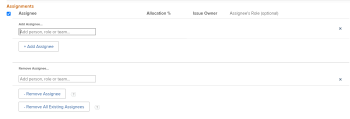

# 목록의 여러 문제에 대한 사용자 할당 수정

<!--Audited: 07/2024-->
<!--

(NOTE: similar article exists for tasks)

-->

사용자 할당을 여러 문제로 동시에 수정할 수 있습니다. 문제를 편집하거나 한 번에 하나씩 할당하는 방법에 대한 자세한 내용은 다음 문서를 참조하십시오.

* [문제 편집](../../../manage-work/issues/manage-issues/edit-issues.md)
* [문제 할당](../../../manage-work/issues/manage-issues/assign-issues.md)

문제 할당에 대한 일반적인 정보는 [문제 할당 수정 개요](../../../manage-work/issues/manage-issues/modify-issue-assignments-overview.md)를 참조하십시오.

>[!NOTE]
>
>문제에 할당하려면 문제에 대한 Contribute 이상의 권한이 있어야 합니다.

## 액세스 요구 사항

+++ 을 확장하여 이 문서의 기능에 대한 액세스 요구 사항을 봅니다.

<table style="table-layout:auto"> 
 <col> 
 <col> 
 <tbody> 
  <tr> 
   <td role="rowheader">Adobe Workfront 플랜</td> 
   <td> 
임의 
 </td> 
  </tr> 
  <tr> 
   <td role="rowheader">Adobe Workfront 라이센스*</td> 
   <td> 
새로운 기능: 표준 

   
현재: 요청 이상
 </td> 
  </tr> 
  <tr> 
   <td role="rowheader">액세스 수준 구성</td> 
   <td> 
문제에 대한 액세스 편집
 
프로젝트 및 작업에 대한 보기 이상의 액세스 권한으로 하나의 문제 할당
 </td> 
  </tr> 
  <tr> 
   <td role="rowheader">개체 권한</td> 
   <td> 
문제에 대한 권한 관리
 
여러 문제를 할당할 때 문제가 있는 프로젝트 또는 작업에 대한 Contribute 권한 이상
  </td> 
  </tr> 
 </tbody> 
</table>

*자세한 내용은 [Workfront 설명서의 액세스 요구 사항](/help/quicksilver/administration-and-setup/add-users/access-levels-and-object-permissions/access-level-requirements-in-documentation.md)을 참조하십시오.

+++

<!--

<h2>When to modify user assignments on issues</h2>

(NOTE:&nbsp;drafted and moved to the overview article: Modify issue assignments overview)

You might want to modify the user assignments for multiple issues for a variety of&nbsp;reasons, including the following:

<ul>
<li>Users join or leave&nbsp;your team</li>
<li>A user takes a vacation that extends beyond the issue&nbsp;due dates</li>
<li>A specific role or user is set as the assignee for multiple issues and you want to quickly modify all items to be assigned to a different user or role</li>
</ul>

-->

## 여러 문제에 대한 할당 수정

1. 할당을 수정하려는 문제가 포함된 문제 목록으로 이동합니다.
1. (선택 사항) 필터를 만들어 수정하려는 할당자에게 할당된 문제만 표시합니다.

   예를 들어 피할당자로서 특정 역할이 있는 문제만 표시하도록 필터를 만들 수 있습니다. 그런 다음 역할을 특정 사용자로 바꿀 수 있습니다. 다음을 수행합니다.

   1. **필터** 드롭다운 목록을 클릭한 다음 **새 필터**&#x200B;을 클릭합니다.

      새 필터 대화 상자가 표시됩니다.

   1. **필터 규칙 추가**&#x200B;를 클릭합니다.
   1. 특정 역할을 필터링하려면 **할당 역할,**&#x200B;을 확장한 다음 **ID.**&#x200B;를 클릭하십시오.

      또는

      특정 사용자를 필터링하려면 **할당 사용자,**&#x200B;를 확장한 다음 **ID.**&#x200B;를 클릭하십시오.

      >[!TIP]
      >
      >이 필드는 문제 소유자만 참조하고 모든 피할당자는 참조하지 않으므로 **할당 대상**&#x200B;을 사용하지 마십시오.

   1. 드롭다운 목록에서 **같음**&#x200B;을 필터 한정자로 선택합니다.
   1. 필터링할 사용자 또는 역할의 이름을 입력한 다음 드롭다운 목록에 표시될 때 이름을 클릭합니다.
   1. **필터 저장**&#x200B;을 클릭합니다.

1. 할당을 수정할 문제를 선택한 다음 **편집** 아이콘 을(를) 클릭합니다.

   **문제 편집**&#x200B;이 표시됩니다. 편집된 항목은 페이지의 왼쪽 위 모서리에 표시됩니다.

1. **할당** 섹션으로 이동한 다음 **피할당자**&#x200B;를 선택합니다.

   

1. 다음 중 하나를 수행하십시오.

   1. 새 피할당자를 추가하려면:

      1. 사용자, 역할 또는 팀의 이름을 입력한 다음 목록에 표시될 때 선택합니다. 할당이 추가되고 선택한 문제에 대한 현재 할당이 대체되지 않습니다.

         >[!TIP]
         >
         >여러 사용자, 작업 역할 또는 팀을 할당할 수 있습니다. 활성 사용자, 작업 역할 및 팀만 할당할 수 있습니다.
         >
         >비활성화되기 전에 사용자, 작업 역할 또는 팀이 할당된 경우 작업 항목에 할당된 상태로 유지됩니다. 이 경우 다음 사항을 권장합니다.
         >
         >* 작업 항목을 활성 리소스에 재할당합니다.
         >* 비활성화된 팀의 사용자를 활성 팀과 연결하고 작업 항목을 활성 팀에 재할당합니다.

         선택한 모든 문제에서 공통되는 정보가 표시됩니다. 예를 들어, 모든 문제에 동일한 사용자가 할당되면 해당 사용자는 **피할당자** 열에 표시됩니다. 선택한 문제에서 정보가 일반적이지 않으면 정보가 표시되지 않습니다.

   1. 개별 피할당자를 제거하려면 다음 작업을 수행하십시오.

      1. 피할당자가 할당 목록에 표시되면 제거할 피할당자의 이름 옆에 있는 **X 아이콘**&#x200B;을 클릭합니다.

         또는

         (조건부) 선택한 문제 중 일부에만 할당되어 제거할 할당자가 할당 섹션에 표시되지 않는 경우 **할당자 제거**&#x200B;를 클릭하고 제거할 할당자의 이름을 입력한 다음 드롭다운 목록에 표시될 때 이름을 클릭합니다.

      1. 제거할 다른 피할당자를 추가하려면 **피할당자 제거**&#x200B;를 다시 클릭하십시오.

   1. 기존 피할당자를 모두 제거하려면 다음 작업을 수행하십시오.

      1. **기존 피할당자 모두 제거**&#x200B;를 클릭한 다음 **예, 모든 피할당자 삭제**&#x200B;를 클릭합니다.

         이렇게 하면 공통 할당자(편집 대화 상자에 표시된 할당자)뿐만 아니라 선택한 모든 문제에 대한 모든 할당자가 제거됩니다.

1. (선택 사항) 문제와 연관시키기 위해 선택한 피할당자에 대해 다음 옵션 중 하나를 수정합니다.

   * **문제 소유자:** 라디오 단추를 선택하여 문제 소유자로 지정된 피할당자를 나타냅니다. 선택하지 않은 경우 Adobe Workfront은 첫 번째 할당자를 문제 소유자로 지정합니다. 팀 할당에는 사용할 수 없습니다.
   * **피할당자의 역할**: 드롭다운 목록에서 역할을 선택합니다. 선택하지 않으면 Workfront이 자동으로 사용자의 기본 역할을 선택합니다.

1. **변경 내용 저장**&#x200B;을 클릭합니다.
