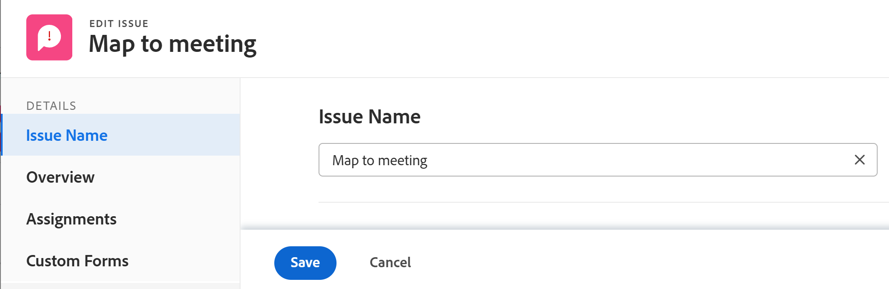

# 문제 편집

<!--Audited: 03/2025-->

사용자가 귀하와 문제를 공유한 경우 귀하가 만든 문제 또는 다른 사용자가 만든 문제에 대한 정보를 편집할 수 있습니다.

단일 문제를 편집하거나 목록에서 문제를 편집할 수 있습니다. 목록에서 문제를 편집하는 방법에 대한 자세한 내용은 [목록에서 문제 편집](../../../manage-work/issues/manage-issues/edit-issues-in-a-list.md)을 참조하십시오.

## 액세스 요구 사항

+++ 을 확장하여 이 문서의 기능에 대한 액세스 요구 사항을 봅니다.

이 문서의 단계를 수행하려면 다음 액세스 권한이 있어야 합니다.

<table style="table-layout:auto"> 
 <col> 
 <col> 
 <tbody> 
  <tr> 
   <td role="rowheader">Adobe Workfront 플랜</td> 
   <td> 
임의 
 </td> 
  </tr> 
  <tr> 
   <td role="rowheader">Adobe Workfront 라이센스*</td> 
   <td> 
새 라이선스:

   <ul><li>기여자 이상</li>
   <li>가볍게 또는 더 높이 - 작업 또는 프로젝트의 문제 섹션에서 문제 편집</li></ul>
   
현재 라이선스:

  <ul><li>요청 이상</li> <li>검토 이상: 작업 또는 프로젝트의 문제 섹션에서 문제 편집</li></ul> </td> 
  </tr> 
  <tr> 
   <td role="rowheader">액세스 수준</td> 
   <td> 
문제에 대한 액세스 편집
  </td> 
  </tr> 
  <tr> 
   <td role="rowheader">개체 권한</td> 
   <td> 
세부 정보 영역에서 다음 필드를 편집할 수 있는 권한을 문제에 기여합니다. 

   <ul>
   <li>설명</li>
   <li>상태</li>
   <li>심각도</li>
   </ul>
   
세부 정보 영역 또는 문제 편집 상자의 모든 필드를 편집할 수 있는 문제에 대한 권한 관리
 
 문제에 대한 권한 부여에 대한 자세한 내용은 <a href="../../../workfront-basics/grant-and-request-access-to-objects/share-an-issue.md" class="MCXref xref">문제 공유 </a>를 참조하십시오.
 
추가 권한 요청에 대한 자세한 내용은 <a href="../../../workfront-basics/grant-and-request-access-to-objects/request-access.md" class="MCXref xref">개체 </a>에 대한 액세스 권한 요청을 참조하십시오.
 </td> 
  </tr> 
 </tbody> 
</table>

*자세한 내용은 [Workfront 설명서의 액세스 요구 사항](/help/quicksilver/administration-and-setup/add-users/access-levels-and-object-permissions/access-level-requirements-in-documentation.md)을 참조하십시오.

+++

## 문제 편집 시 제한 사항

일부 제한 사항으로 인해 문제를 편집할 수 없습니다.

* 승인 진행 중인 문제는 편집할 수 없습니다. 승인 보류 중인 문제에 대해서만 시간을 기록하거나 상태를 업데이트할 수 있습니다.
* Workfront 관리자 또는 그룹 관리자가 프로젝트 환경 설정 영역에서 이 기능을 활성화한 경우에만 완료, 중단 또는 승인 보류 중 상태인 프로젝트의 문제에 문서를 편집하고 추가할 수 있습니다. 프로젝트 환경 설정 지정에 대한 자세한 내용은 [시스템 전체 프로젝트 환경 설정 구성](../../../administration-and-setup/set-up-workfront/configure-system-defaults/set-project-preferences.md)을 참조하십시오.

## 단일 문제 편집

문제 편집 또는 문제 세부 정보 영역을 사용하여 문제를 편집할 수 있습니다. 다음 단계에서는 문제 편집 상자에서 문제를 편집하는 방법에 대해 설명합니다.

1. **기본 메뉴**(으)로 이동합니다.
1. **프로젝트**&#x200B;를 클릭한 다음 프로젝트 이름을 클릭하여 프로젝트를 엽니다.
1. (선택 사항) **작업** 을 클릭한 다음 작업 이름을 클릭하여 작업을 엽니다.
1. 왼쪽 패널에서 **문제**&#x200B;를 클릭합니다.

   

1. (선택 사항) 문제에 대한 제한된 정보를 편집하려면 왼쪽 패널에서 **문제 세부 정보**&#x200B;를 클릭하십시오.

   >[!NOTE]
   >
   >Workfront 관리자 또는 그룹 관리자가 레이아웃 템플릿을 수정한 방법에 따라 문제 세부 정보 영역의 필드가 재배열되거나 표시되지 않을 수 있습니다. 자세한 내용은 [레이아웃 템플릿을 사용하여 세부 정보 보기 사용자 지정](../../../administration-and-setup/customize-workfront/use-layout-templates/customize-details-view-layout-template.md)을 참조하십시오.

   세부 정보 섹션에서 정보를 편집하려면 다음 작업을 수행하십시오.

   1. (선택 사항) 오른쪽 상단의 **모두 축소** 아이콘을 클릭하여 모든 영역을 축소합니다.
   1. (선택 사항 및 조건부) 영역이 축소되면 각 영역 옆의 **오른쪽 방향 화살표** 를 클릭하여 편집할 영역을 확장합니다.
   1. (선택 사항) 사용자 정의 양식을 첨부하려면 **사용자 정의 양식 추가** 필드에 양식 이름을 입력한 다음 목록에 표시될 때 선택하고 **변경 내용 저장**&#x200B;을 클릭합니다.
   1. (선택 사항) **내보내기** 아이콘 을 클릭하여 개요 및 사용자 정의 양식 정보를 PDF 파일로 내보낸 다음 **내보내기**&#x200B;를 클릭합니다. 다음 중에서 선택합니다.

      * 모두 선택(사용자 정의 양식이 하나 이상 첨부된 경우에만 표시됨)
      * 개요
      * 하나 이상의 사용자 정의 양식 이름

      PDF 파일이 컴퓨터로 다운로드됩니다.

      

      자세한 내용은 [사용자 정의 양식 및 개체 세부 정보 내보내기](../../../workfront-basics/work-with-custom-forms/export-custom-forms-details.md)를 참조하십시오.

   문제 세부 정보 섹션에 표시되는 필드에 대한 자세한 내용은 아래에 설명된 대로 문제 편집 상자에서 문제를 계속 편집합니다.

1. 문제에 대한 모든 정보를 편집하려면 목록에서 문제를 선택한 다음 목록의 맨 위에서 **편집**&#x200B;을 클릭하십시오

   또는

   목록에서 문제 이름을 클릭한 다음 문제 이름 옆에 있는 **자세히** 메뉴를 클릭한 다음 **편집**&#x200B;을 클릭합니다.

   **문제 편집** 대화 상자가 표시됩니다.

   >[!IMPORTANT]
   >
   >편집 링크를 보려면 문제에 대한 관리 권한이 있어야 합니다.

   모든 문제 필드는 문제 편집 상자에서 사용할 수 있으며 왼쪽 패널에 나열된 영역별로 그룹화됩니다.

1. 다음 섹션 중 하나에서 정보를 지정하는 것이 좋습니다.

   * [문제 이름](#issue-name)
   * [개요](#overview)
   * [할당](#assignments)
   * [사용자 정의 양식](#Custom%C2%A0F)
   * [설정](#settings)

   >[!NOTE]
   >
   >Workfront 관리자가 레이아웃 템플릿을 설정하는 방법에 따라 문제 편집 상자의 필드가 사용자 환경에서 다를 수 있습니다. 자세한 내용은 [레이아웃 템플릿을 사용하여 세부 정보 보기 사용자 지정](../../../administration-and-setup/customize-workfront/use-layout-templates/customize-details-view-layout-template.md)을 참조하십시오.
   >
   >문제를 만들면 아래 섹션에 나열된 대부분의 필드를 새 문제 상자도 액세스할 수 있습니다. 필드가 있는 섹션이 새 문제 상자와 일치하지 않습니다. 문제 만들기에 대한 자세한 내용은 [문제 만들기](../../issues/manage-issues/create-issues.md)를 참조하십시오.

### 문제 이름 {#issue-name}

1. 위에 설명된 대로 문제 편집을 시작합니다.
1. **문제 이름**&#x200B;을 클릭하세요.

   

1. **문제 이름** 필드를 업데이트합니다.
1. **저장**&#x200B;을 클릭하거나 다음 섹션을 계속 편집하십시오.

### 개요 {#overview}

1. 위에 설명된 대로 문제 편집을 시작합니다.
1. **개요**&#x200B;를 클릭합니다.

   

1. 다음 표의 필드를 업데이트하거나 검토합니다.

   <table style="table-layout:auto"> 
    <col> 
    <col> 
    <tbody> 
     <tr> 
      <td role="rowheader">설명</td> 
      <td> 
문제에 대한 추가 정보를 추가합니다.
 </td> 
     </tr> 
     <tr> 
      <td colspan="2" role="rowheader">기본 정보 섹션</td> 
     </tr> 
     <tr> 
      <td role="rowheader">상태</td> 
      <td> 
문제의 상태를 선택합니다. 문제 상태에 대한 자세한 내용은 <a href="../../../administration-and-setup/customize-workfront/creating-custom-status-and-priority-labels/issue-statuses.md" class="MCXref xref">시스템 문제 상태 목록에 액세스</a>를 참조하십시오. 
 </td> 
     </tr> 
     <tr> 
      <td role="rowheader">우선순위</td> 
      <td> 
문제의 우선 순위를 지정할 수 있는 시각적 플래그입니다.
 
다음 옵션 중에서 선택합니다.
 
       <ul> 
        <li> 
<strong>없음</strong> 
 </li> 
        <li> 
<strong>낮음</strong> 
 </li> 
        <li> 
<strong>보통</strong> 
 </li> 
        <li> 
<strong>높음</strong> 
 </li> 
        <li> 
<strong>긴급</strong> 
 </li> 
       </ul> 
Workfront 관리자가 선택한 프로젝트 환경 설정에 따라 우선순위 이름이 다를 수 있습니다. 우선 순위 편집에 대한 자세한 내용은 <a href="../../../administration-and-setup/customize-workfront/creating-custom-status-and-priority-labels/create-customize-priorities.md" class="MCXref xref">우선 순위 만들기 및 사용자 지정</a>을 참조하십시오.
 </td> 
     </tr> 
     <tr> 
      <td role="rowheader">심각도</td> 
      <td> 
문제에 설명된 문제가 얼마나 심각한지 나타내는 시각적 플래그입니다. 심각도는 문제에 따라 다릅니다. 다음 옵션 중에서 선택합니다.
 
       <ul> 
        <li> 
표시용
 </li> 
        <li> 
혼란 야기
 </li> 
        <li> 
해결 방법이 있는 버그
 </li> 
        <li> 
해결 방법이 없는 버그
 </li> 
        <li> 
치명적인 오류
 </li> 
       </ul> 
Workfront 관리자가 선택한 프로젝트 환경 설정에 따라 심각도 이름이 다를 수 있습니다. 심각도 편집에 대한 자세한 내용은 <a href="../../../administration-and-setup/customize-workfront/creating-custom-status-and-priority-labels/create-customize-issue-severities.md" class="MCXref xref">문제 심각도 만들기 또는 사용자 지정</a>을 참조하세요.
 </td> 
     </tr> 
     <tr> 
      <td role="rowheader">URL</td> 
      <td> 
문제에 대한 정보와 관련된 웹 링크를 입력합니다.
 </td> 
     </tr> 
     <tr> 
      <td role="rowheader">유형</td> 
      <td> 
프로젝트 관리자가 프로젝트의 대기열 세부 정보 영역에서 선택한 대기열 속성에 따라 문제의 유형을 지정할 수 있습니다. <b>유형</b> 드롭다운 메뉴의 다음 옵션 중에서 선택하십시오. 
 
       <ul> 
        <li> 
<strong>버그 신고</strong> 
 </li> 
        <li> 
<strong>순서 변경</strong> 
 </li> 
        <li> 
<strong>문제</strong> 
 </li> 
        <li> 
<strong>요청</strong> 
 </li> 
       </ul> 
Workfront 관리자가 선택한 프로젝트 환경 설정에 따라 문제 유형의 이름이 다를 수 있습니다.
 </td> 
     </tr> 
     <tr> 
      <td role="rowheader">기본 담당자</td> 
      <td>기본적으로 기본 담당자는 문제의 작성자입니다. 이를 수정하려면 Workfront에서 활성 사용자의 이름을 입력한 다음 목록에서 선택합니다. 문제에는 기본 담당자가 하나만 있을 수 있습니다.  기본 연락처를 변경한 경우에도 원래 기본 연락처에 문제에 대한 관리 액세스 권한이 남아 있습니다. 문제를 공유할 때 문제 액세스 상자에서 이 액세스를 수동으로 제거해야 합니다.

   <b>팁</b>

   
기본 담당자 사용자를 추가할 때 아바타, 사용자의 기본 역할 및 이메일 주소에 따라 이름이 동일한 사용자를 구별할 수 있습니다. 사용자를 추가할 때 이를 보려면 사용자를 하나 이상의 작업 역할과 연결해야 합니다.

      
 사용자의 이메일을 보려면 사용자의 액세스 수준에서 연락처 정보 보기 설정을 활성화해야 합니다. 자세한 내용은 <a href="../../../administration-and-setup/add-users/configure-and-grant-access/grant-access-other-users.md">사용자에게 액세스 권한 부여</a>를 참조하십시오.

   </td> 
     </tr> 
     <tr> 
      <td role="rowheader">커밋 일자 및 시간</td> 
      <td> 
문제의 할당자가 문제가 완료될 것으로 예상하는 날짜입니다. 할당된 사람만 이 필드를 편집할 수 있습니다.
 </td> 
     </tr> 
     <tr> 
      <td role="rowheader">계획된 시작 일자</td> 
      <td>기본적으로 계획된 시작 일자는 문제가 생성된 일자 및 시간입니다. 문제의 <strong>계획된 시작 일자</strong>를 업데이트할 수 있습니다. </td> 
     </tr> 
     <tr> 
      <td role="rowheader">계획된 완료 일자 및 시간</td> 
      <td> 기본적으로 계획된 완료 일자는 기본 계획된 시작 일자에서 24시간입니다. 기본적으로 문제에는 1일의 기간이 있습니다. 문제의 <strong>계획된 완료 일자</strong>를 업데이트할 수 있습니다.</td> 
     </tr> 
     <tr> 
      <td role="rowheader">실제 시작 일자 및 시간</td> 
      <td>문제의 상태를 <strong>진행 중</strong>(으)로 변경하면 실제 시작 날짜가 자동으로 채워집니다. 문제의 <strong>실제 시작 일자</strong>를 업데이트할 수 있습니다. 필요한 경우 날짜를 수동으로 업데이트할 수 있습니다. </td> 
     </tr> 
     <tr> 
      <td role="rowheader">실제 완료 일자 및 시간</td> 
      <td>문제의 상태를 <strong>마감됨</strong> 또는<strong>해결됨</strong>(으)로 변경하면 실제 완료 날짜가 자동으로 채워집니다. 문제에 대한 <strong>실제 완료 일자</strong>를 업데이트할 수 있습니다. 필요한 경우 날짜를 수동으로 업데이트할 수 있습니다.</td> 
     </tr> 
     <tr> 
      <td role="rowheader">해결한 사람</td> 
      <td> 
다른 오브젝트로 문제를 해결했는지 여부를 보여 줍니다. 드롭다운 메뉴에서 이 문제가 작업, 프로젝트 또는 다른 문제로 해결되었는지 선택한 다음 문제를 해결할 작업, 프로젝트 또는 문제의 이름을 입력할 수 있습니다. 목록에 나타나면 선택합니다.

   <b>메모</b>

   <ul><li>문제를 해결할 오브젝트를 선택하면 문제 상태가 해결 오브젝트의 상태에 연결되고 해당 문제에서 변경할 수 없습니다. 개체 확인에 대한 자세한 내용은 <a href="../../../manage-work/issues/convert-issues/resolving-and-resolvable-objects.md" class="MCXref xref">해결 및 해결 가능한 개체 개요 </a>을(를) 참조하십시오.</li>

   <li>다른 작업, 문제 또는 프로젝트에 의해 해결될 문제를 연결할 때 해결된 사람 필드에 나열된 문제, 문제 또는 프로젝트 등의 해결 오브젝트에 문제의 정보가 전송되지 않습니다. </li>

   <li>시스템 또는 그룹 관리자가 문제 사용자 정의 헤더에 "해결된 사람" 필드를 추가하면 문제와 연결된 해결 오브젝트가 있는 경우 필드가 "문제 해결", "작업 해결" 또는 "프로젝트 해결"로 변경됩니다.

   이 필드가 문제 헤더에 표시되면 편집할 수 없습니다. 문제 헤더 사용자 지정에 대한 자세한 내용은 <a href="../../../administration-and-setup/customize-workfront/use-layout-templates/customize-object-headers.md">레이아웃 템플릿을 사용하여 개체 헤더 사용자 지정 </a>을(를) 참조하십시오.</li></ul>
   </td> 
     </tr>

   <tr> 
      <td role="rowheader">문제 해결, 작업 해결 또는 프로젝트 해결</td> 
      <td>문제를 해결하는 문제, 작업 또는 문제의 연결된 이름.  </td> 
     </tr> 
      <tr> 
      <td role="rowheader">해결됩니다</td> 
      <td>액세스하는 문제가 해결되면 완료되는 문제의 연결된 이름.  </td> 
     </tr> 
    </tbody> 
   </table>

1. **저장**&#x200B;을 클릭하거나 다음 섹션을 계속 편집하십시오.

#### 할당 {#assignments}

1. 위에 설명된 대로 문제 편집을 시작합니다.
1. 왼쪽 패널에서 **할당**&#x200B;을 클릭합니다.

   

1. **사람, 역할 및 팀 검색**&#x200B;을 클릭하고 작업에 할당할 사용자, 역할 또는 팀의 이름을 입력한 다음 해당 작업을 클릭하거나 목록에 표시될 때 Enter 키를 누릅니다.

   <!--
   
(NOTE: ensure this is still called this; asked Anna to change it to "roles" and add a comma)

   -->

   >[!NOTE]
   >
   >사용자 이름에 특수 문자가 포함되어 있으면 검색 필드에 특수 문자를 포함해야 합니다.

   >[!TIP]
   >
   >여러 사용자, 작업 역할 또는 팀을 할당할 수 있습니다. 활성 사용자, 작업 역할 및 팀만 할당할 수 있습니다.
   >
   >
   >비활성화되기 전에 사용자, 작업 역할 또는 팀이 할당된 경우 작업 항목에 할당된 상태로 유지됩니다. 이 경우 다음 사항을 권장합니다.
   >
   >* 작업 항목을 활성 리소스에 재할당합니다.
   >* 비활성화된 팀의 사용자를 활성 팀과 연결하고 작업 항목을 활성 팀에 재할당합니다.

1. (선택 사항) 피할당자의 이름 위로 마우스를 이동하고 **기본 피할당자로 설정**&#x200B;을 클릭하여 피할당자가 문제에 대한 기본 피할당자인지 여부를 나타냅니다. 팀은 문제의 기본 피할당자가 될 수 없습니다.
1. 다음 필드를 업데이트합니다.

   <table style="table-layout:auto"> 
    <col> 
    </col> 
    <col> 
    </col> 
    <tbody> 
     <tr> 
      <td role="rowheader">계획된 시간</td> 
      <td> 
문제의 할당자가 완료하는 데 걸리는 실제 시간입니다. 문제에 대한 계획된 시간 수를 입력합니다. 
 
참고: 문제의 계획된 시간을 변경해도 문제 계획된 완료 일자는 변경되지 않습니다. 
 </td> 
     </tr> 
     <tr data-mc-conditions=""> 
      <td role="rowheader">할당자의 역할</td> 
      <td> 
사용자를 피할당자로 선택한 경우 <strong>피할당자의 역할</strong> 드롭다운 메뉴에서 역할을 선택합니다. 이 문제에 대해 피할당자가 수행할 수 있는 역할입니다. 
 
<b>팁</b>

   프로필의 각 피할당자와 연결된 작업 역할만 드롭다운 메뉴에 나타납니다.
 </td>
   </tr> 
    </tbody> 
   </table>

1. **저장**&#x200B;을 클릭하거나 다음 섹션을 계속 편집하십시오.

### 사용자 지정 Forms

1. 위에 설명된 대로 문제 편집을 시작합니다.
1. **사용자 지정 Forms**&#x200B;을 클릭합니다.

   

1. **사용자 정의 양식 추가** 필드에서 문제와 연결할 사용자 정의 양식을 선택합니다. 이 필드에서 사용자 정의 양식을 선택하려면 먼저 사용자 정의 양식을 작성해야 합니다. 활성 사용자 정의 양식만 목록에 표시됩니다. 사용자 정의 양식 작성에 대한 자세한 내용은 [사용자 정의 양식 만들기](/help/quicksilver/administration-and-setup/customize-workfront/create-manage-custom-forms/form-designer/design-a-form/design-a-form.md)를 참조하십시오. 문제에 최대 10개의 사용자 정의 양식을 추가할 수 있습니다.

1. (조건부) 사용자 정의 양식을 문제에 첨부한 경우 양식의 모든 필드를 편집합니다. 문제를 저장하려면 모든 필수 필드를 지정해야 합니다.

   >[!NOTE]
   >
   >Workfront 관리자가 사용자 정의 양식의 섹션에 대한 권한을 설정하는 방법에 따라 모든 사용자가 지정된 사용자 정의 양식에서 동일한 필드를 보거나 편집할 수 있는 것은 아닙니다. 사용자 정의 양식의 섹션 내에서 필드를 편집할 수 있는 권한은 문제 자체에 대한 권한에 따라 다릅니다. 사용자 정의 양식의 섹션에 대한 사용 권한 설정에 대한 자세한 내용은 [사용자 정의 양식 만들기](/help/quicksilver/administration-and-setup/customize-workfront/create-manage-custom-forms/form-designer/design-a-form/design-a-form.md)를 참조하십시오. 문제 권한 설정에 대한 자세한 내용은 [문제 공유](../../../workfront-basics/grant-and-request-access-to-objects/share-an-issue.md)를 참조하십시오.

1. **저장**&#x200B;을 클릭하거나 다음 섹션을 계속 편집하십시오.

### 설정 {#settings}

1. 위에 설명된 대로 문제 편집을 시작합니다.
1. **설정**&#x200B;을 클릭합니다.

   

   다음 정보를 업데이트합니다.

   <table style="table-layout:auto"> 
    <col> 
    </col> 
    <col> 
    </col> 
    <tbody> 
     <tr> 
      <td role="rowheader">승인 진행</td> 
      <td> 
       
 
       
문제와 연결할 승인 프로세스를 선택합니다. 문제와 연결하려면 먼저 Workfront 관리자가 시스템 수준 승인 프로세스를 정의해야 합니다. 승인 프로세스 에 대한 관리자 액세스 권한이 있는 사용자는 그룹별 승인 프로세스를 만들 수도 있습니다.승인 프로세스 만들기에 대한 자세한 내용은 <a href="../../../administration-and-setup/customize-workfront/configure-approval-milestone-processes/create-approval-processes.md" class="MCXref xref">작업 항목에 대한 승인 프로세스 만들기</a>를 참조하십시오. 
 
       
승인 프로세스를 추가할 때는 다음 사항을 고려하십시오. 
 
       <ul> 
       <li>활성 승인 프로세스만 목록에 표시됩니다. </li> 
       <li> 
시스템 전체 및 그룹별 승인 프로세스가 목록에 표시됩니다. 프로젝트 그룹 이외의 그룹과 연결된 승인 프로세스가 목록에 표시되지 않습니다.
 
중요: 프로젝트 그룹이 변경되면 그룹별 승인 프로세스가 일회용 승인 프로세스가 됩니다. 프로젝트 그룹 변경 또는 승인 프로세스 변경 내용이 승인 설정에 미치는 영향에 대한 자세한 내용은 <a href="../../../administration-and-setup/customize-workfront/configure-approval-milestone-processes/how-changes-affect-group-approvals.md" class="MCXref xref">그룹 및 승인 프로세스 변경 내용이 할당된 승인 프로세스에 미치는 영향</a>을 참조하십시오. 
 </li> 
       <li> 
요청 대기열이나 대기열 주제를 만들 때 문제에 자동으로 첨부되도록 기본 승인 프로세스를 정의할 수 있습니다. 큐 세부 정보 업데이트에 대한 자세한 내용은 <a href="../../../manage-work/requests/create-and-manage-request-queues/create-request-queue.md" class="MCXref xref">요청 큐 만들기</a>를 참조하십시오. 대기열 주제 만들기에 대한 자세한 내용은 <a href="../../../manage-work/requests/create-and-manage-request-queues/create-queue-topics.md" class="MCXref xref">대기열 주제 만들기</a>를 참조하십시오. 
 </li> 
       <li>벌크 편집 문제가 발생하면 다음 시나리오가 발생합니다. 
       <ul> 
       <li>
동일한 그룹에서 여러 문제를 선택하면 시스템 수준 및 그룹별 승인 프로세스가 모두 이 필드에 표시됩니다.
</li> 
       <li>
다른 그룹에서 여러 문제를 선택하면 이 필드에는 시스템 수준 승인 프로세스만 표시됩니다.
</li> 
       <li>
문제 중 단일 사용 승인 프로세스가 첨부된 경우 선택한 시스템 수준 또는 그룹 수준 승인 프로세스로 대체됩니다. 
</li> 
       </ul></li> 
       </ul> 
       
 </td> 
     </tr> 
     <tr> 
      <td role="rowheader">미리 알림</td> 
      <td> 
이 문제에 첨부할 미리 알림에 대한 확인란을 선택합니다. 문제에 대한 모든 미리 알림이 표시됩니다. 문제에 대해 미리 알림을 선택하려면 Workfront 관리자가 미리 알림을 구성해야 합니다. 미리 알림 구성에 대한 자세한 내용은 <a href="../../../administration-and-setup/manage-workfront/emails/set-up-reminder-notifications.md" class="MCXref xref">미리 알림 설정</a>을 참조하세요.
 </td> 
     </tr> 
    </tbody> 
   </table>

1. **저장**&#x200B;을 클릭합니다.

## 문제 헤더에서 문제 편집(제한적)

문제 헤더에서 제한된 양의 정보를 편집할 수 있습니다.

시스템 또는 그룹 관리자는 문제 헤더에 표시되는 필드를 사용자 정의할 수 있습니다. 자세한 내용은 [레이아웃 템플릿을 사용하여 개체 머리글 사용자 지정](../../../administration-and-setup/customize-workfront/use-layout-templates/customize-object-headers.md)을 참조하십시오.

기본적으로 다음 필드가 문제 헤더에 포함됩니다.

* 문제 이름
* 완료율

  자세한 내용은 [작업에 대한 완료율 보기 및 업데이트](/help/quicksilver/manage-work/projects/updating-work-in-a-project/view-update-percent-complete-for-tasks.md)를 참조하십시오.
* 할당
* 계획된 완료 일자 및 시간
* 상태
* 현재 승인 프로세스에서 승인자로 설정된 경우 승인 결정을 내립니다
