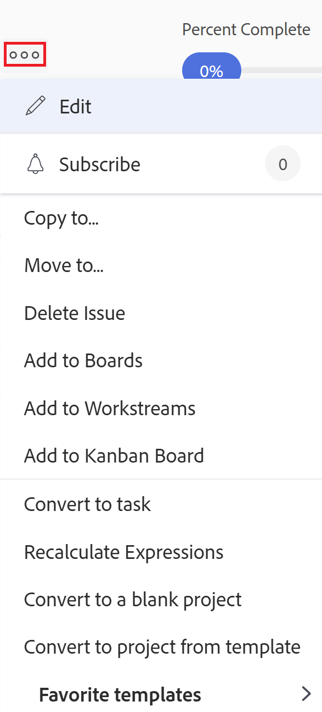

# 문제 이동

<!--Audited: 12/2024-->

<!--The highlighted information on this page refers to functionality not yet generally available. It is available only in the Preview environment for all customers. After the monthly releases to Production, the same features are also available in the Production environment for customers who enabled fast releases.    

For information about fast releases, see [Enable or disable fast releases for your organization](/help/quicksilver/administration-and-setup/set-up-workfront/configure-system-defaults/enable-fast-release-process.md). -->

다음 개체 간에 문제를 이동할 수 있습니다.

* 프로젝트에서 다른 프로젝트로
* 동일한 프로젝트 또는 다른 프로젝트의 작업에서 다른 작업으로
* 작업에서 프로젝트 또는 다른 프로젝트로
* 프로젝트에서 동일한 프로젝트의 작업 또는 다른 프로젝트의 작업으로

## 액세스 요구 사항

+++ 을 확장하여 이 문서의 기능에 대한 액세스 요구 사항을 봅니다. 

<table style="table-layout:auto"> 
 <col> 
 <col> 
 <tbody> 
  <tr> 
   <td role="rowheader">Adobe Workfront 패키지</td> 
   <td> 
임의
 </td> 
  </tr> 
  <tr> 
   <td role="rowheader">Adobe Workfront 라이선스</td> 
   <td> 
   <ul><li>기여자 이상</li>
   <li>프로젝트의 문제 섹션에서 문제를 이동하려면 가볍게 이상을 사용하십시오</li></ul>
   또는:
   <ul>   <li>
요청 이상
</li>
   <li>
프로젝트의 문제 섹션에서 문제를 이동하려면 라이선스 이상을 검토하십시오.
</li></ul>   
     </td> 
  </tr> 
  <tr> 
   <td role="rowheader">액세스 수준 구성</td> 
   <td> 
문제에 대한 액세스 편집
 
프로젝트 및 작업에 대한 보기 또는 상위 액세스 권한
 </td> 
  </tr> 
  <tr> 
   <td role="rowheader">개체 권한</td> 
   <td> 
문제에 대한 권한 관리
 
문제를 추가할 수 있는 권한과 함께 문제를 이동할 항목에 권한을 부여합니다.</td> 
  </tr> 
 </tbody> 
</table>

*자세한 내용은 [Workfront 설명서의 액세스 요구 사항](/help/quicksilver/administration-and-setup/add-users/access-levels-and-object-permissions/access-level-requirements-in-documentation.md)을 참조하십시오.

+++

<!--Old:

<table style="table-layout:auto"> 
 <col> 
 <col> 
 <tbody> 
  <tr> 
   <td role="rowheader">Adobe Workfront plan</td> 
   <td> 
Any
 </td> 
  </tr> 
  <tr> 
   <td role="rowheader">Adobe Workfront license*</td> 
   <td> 
New:
 
   <ul><li>Contributor or higher</li>
   <li>Light or higher to move issues in the Issues section of a project</li></ul>
   
Current:

   <ul>
   <li>
Request or higher
</li>
   <li>
Review or higher license to move issues in the Issues section of a project.
</li></ul>   
     </td> 
  </tr> 
  <tr> 
   <td role="rowheader">Access level configurations</td> 
   <td> 
Edit access to Issues
 
View or higher access to Projects and Tasks
 </td> 
  </tr> 
  <tr> 
   <td role="rowheader">Object permissions</td> 
   <td> 
Manage permissions to the issue
 
Contribute permissions to the item where you are moving the issue with the ability to Add Issues.</td> 
  </tr> 
 </tbody> 
</table>-->

## 문제 이동에 대한 고려 사항

문서가 포함되어 있거나 요청 대기열과 연관된 문제를 이동할 때 다음 사항을 고려하십시오.

* 시스템 또는 그룹 관리자는 설정 영역에서 사용자가 작업 및 기록된 시간 문제를 이동할 수 있도록 허용 기본 설정을 구성하는 방법에 따라 기록된 시간이 있는 문제를 이동하지 못하도록 할 수 있습니다. 자세한 내용은 [시스템 전체 작업 및 문제 환경 설정 구성](/help/quicksilver/administration-and-setup/set-up-workfront/configure-system-defaults/set-task-issue-preferences.md)을 참조하십시오.

* **문제가 요청 대기열과 연결되어 있는 경우:** 문제를 다른 개체로 이동했을 때 문제가 요청 대기열과 연결되어 있으면 이동된 문제는 첫 번째 문제가 발생한 원래 대기열과 더 이상 연결되지 않습니다.
* **문서가 문제에 첨부되어 있을 때:** 문제를 다른 개체로 옮기면 문제에 문서가 첨부되어 있을 때 문서, 해당 버전 및 증명도 새 문제로 이동합니다. 문서와 연결된 모든 승인이 이동되지 않습니다.
* **문제가 문서 또는 폴더에 연결되어 있는 경우:** 문서 또는 폴더가 Google Drive와 같은 서드파티 서비스에 연결되어 있는 문제를 이동하면 문서에 대한 링크가 문제와 함께 이동합니다.

## 목록에서 문제 이동

문제 목록 또는 문제 보고서에서 하나 이상의 문제를 이동할 수 있습니다.

1. 이동할 문제가 포함된 프로젝트로 이동합니다.

   또는

   문제 보고서로 이동합니다.

1. 프로젝트로 이동하기로 선택한 경우 왼쪽 패널에서 **문제**&#x200B;를 클릭합니다.
1. 이동할 문제를 선택하고 문제 목록의 맨 위에서 **추가 메뉴**&#x200B;를 클릭한 다음 **이동**&#x200B;을 클릭합니다.

   

1. 2단계부터 [단일 문제 이동](#move-a-single-issue) 섹션에 설명된 대로 문제를 계속 이동합니다.

## 단일 문제 이동 {#move-a-single-issue}

문제를 볼 때 한 가지 문제를 이동할 수 있습니다.

### 단일 문제 이동

1. 이동할 문제로 이동하여 문제 이름 오른쪽에 있는 **기타** 메뉴 를 클릭한 다음 **이동**&#x200B;을 클릭합니다.

   

   **문제 이동** 상자가 표시됩니다.

   

1. **대상 프로젝트 선택** 섹션에서 문제를 이동할 프로젝트의 이름을 지정합니다. 현재 프로젝트의 이름이 기본적으로 표시됩니다.

   >[!TIP]
   >
   >100개의 프로젝트만 목록에 표시됩니다.

1. (조건부) 프로젝트로 문제를 이동할 수 있는 액세스 권한이 없는 경우 **액세스 요청**&#x200B;을 클릭합니다.
1. (조건부) 대상 프로젝트의 작업 중 하나에 문제를 추가할 수 있는 액세스 권한이 있는 경우 액세스 요청 없이 선택한 대상 프로젝트에서 문제를 계속 이동합니다.

   

   >[!TIP]
   >
   >Workfront 관리자가 이러한 프로젝트에 문제를 추가할 수 없도록 방지하면 선택한 프로젝트가 승인 보류 중, 완료 또는 정지된 경우에도 유사한 메시지가 표시됩니다. 자세한 내용은 [시스템 전체 프로젝트 환경 설정 구성](../../../administration-and-setup/set-up-workfront/configure-system-defaults/set-project-preferences.md)을 참조하십시오.

1. (선택 사항) **옵션** 섹션에서 아래 표에 나열된 항목 중 하나를 선택 해제하여 이동된 문제에서 해당 항목을 제거합니다. 기본적으로 모든 옵션이 선택되어 있습니다.

   >[!IMPORTANT]
   >
   >옵션 목록에서 항목을 선택 해제하면 데이터가 손실됩니다. 기존 문제의 정보는 제거되며 복구할 수 없습니다.

   <table style="table-layout:auto"> 
    <col> 
    <col> 
    <tbody> 
     <tr> 
      <td role="rowheader">모두 선택</td> 
      <td>새 위치로 이동할 때 문제에서 모든 정보를 제거하려면 이 옵션을 선택 취소합니다. </td> 
     </tr> 
     <tr> 
      <td role="rowheader">할당</td> 
      <td>문제에 할당된 사용자, 작업 역할 또는 팀을 제거합니다.</td> 
     </tr> 
     <tr> 
      <td role="rowheader">진행</td> 
      <td>문제가 있는 경우 완료율을 제거합니다. </td> 
     </tr> 
     <tr> 
      <td role="rowheader">
문서
</td> 
      <td> 
문서 버전, 연결된 문서 및 폴더를 포함하여 문서 탭의 모든 항목을 제거합니다.

   <b>참고</b>

   문제와 함께 문서를 이동하지 않도록 선택하면 문서가 삭제되고 30일 동안 휴지통에 보관됩니다. 관리자는 이를 복원할 수 있으며 이동된 문제에 대해 복원됩니다.

   문제를 이동한 후 삭제하면 복원된 문서가 복원한 관리자의 사용자 페이지에 있는 문서 영역에 배치됩니다.
     
 </td>
   </tr> 
     <tr> 
      <td role="rowheader">권한</td> 
      <td>문제가 공유되는 엔티티를 제거합니다. </td> 
     </tr> 
     <tr> 
      <td role="rowheader">업데이트</td> 
      <td>문제의 업데이트 섹션에서 주석을 제거합니다.</td> 
     </tr> 
    </tbody> 
   </table>

1. (선택 사항) **작업 선택** 섹션에서 문제를 이동할 작업을 선택합니다.
1. 목록에서 여러 문제를 선택한 경우 **문제 이동** 또는 **문제 이동**&#x200B;을 클릭합니다.

   이동된 문제가 지정된 프로젝트에 추가됩니다.

