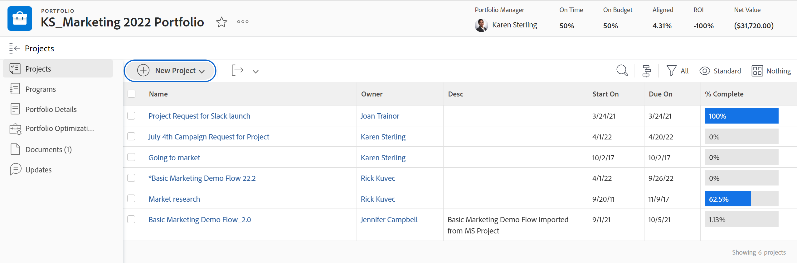

# 포트폴리오에 프로젝트 추가

<!--Audited: 7/2024-->

프로젝트를 시작할 때 포트폴리오에 프로젝트를 추가하는 것이 좋습니다. 그러나 라이프타임 동안 언제든지 포트폴리오에 추가할 수 있습니다.

포트폴리오에 프로젝트를 추가할 때 다음 사항을 고려하십시오.

* 포트폴리오에는 무제한의 프로젝트가 포함될 수 있지만 하나의 포트폴리오만 프로젝트에 연결할 수 있습니다.
* 프로젝트는 삭제되거나 다른 포트폴리오와 연결될 때까지 포트폴리오에 남아 있습니다.

## 액세스 요구 사항

+++ 을 확장하여 이 문서의 기능에 대한 액세스 요구 사항을 봅니다.

<table style="table-layout:auto"> 
 <col> 
 <col> 
 <tbody> 
  <tr> 
   <td role="rowheader">[!DNL Adobe Workfront] 플랜</td> 
   <td> 
임의
 </td> 
  </tr> 
  <tr> 
   <td role="rowheader">[!DNL Adobe Workfront] 라이센스*</td> 
   <td>
새로운 기능: 표준
 
   
현재:[!UICONTROL 계획] 
 </td> 
  </tr> 
  <tr> 
   <td role="rowheader">액세스 수준 구성</td> 
   <td> 
Portfolio 이상에 대한 [!UICONTROL 보기] 액세스
 
프로젝트에 대한 [!UICONTROL 편집] 액세스 권한
 </td> 
  </tr> 
  <tr> 
   <td role="rowheader">개체 권한</td> 
   <td> 
포트폴리오에 대한 [!UICONTROL 보기] 권한
 
프로젝트에 대한 [!UICONTROL 관리] 권한
  </td> 
  </tr> 
 </tbody> 
</table>

*자세한 내용은 [Workfront 설명서의 액세스 요구 사항](/help/quicksilver/administration-and-setup/add-users/access-levels-and-object-permissions/access-level-requirements-in-documentation.md)을 참조하십시오.

+++

## 포트폴리오에 프로젝트 추가

1. 포트폴리오로 이동한 다음 왼쪽 패널에서 **[!UICONTROL 프로젝트]**&#x200B;를 클릭합니다.

   

1. **[!UICONTROL 새 프로젝트]**&#x200B;를 클릭하고 프로젝트를 추가할 방법을 선택하십시오.

   >[!TIP]
   >
   >[!UICONTROL 마일스톤] 보기에서 프로젝트 목록을 볼 때는 프로젝트를 추가할 수 없습니다.

   다음 옵션 중에서 선택합니다.

   <table style="table-layout:auto"> 
    <col> 
    <col> 
    <tbody> 
     <tr> 
      <td role="rowheader">[!UICONTROL 기존 프로젝트]</td> 
      <td> 
이미 생성된 프로젝트를 추가합니다.
 </td> 
     </tr> 
     <tr> 
      <td role="rowheader">[!UICONTROL 새 프로젝트]</td> 
      <td> 
새 프로젝트를 추가합니다. 
 
새 프로젝트 만들기에 대한 자세한 내용은 <a href="../../../manage-work/projects/create-projects/create-project.md" class="MCXref xref">프로젝트 만들기</a>를 참조하십시오. 
 </td> 
     </tr> 
     <tr> 
      <td role="rowheader">[!UICONTROL [!DNL MS Project]에서 프로젝트 가져오기] </td> 
      <td> 
이전에 [!DNL MS Project]에서 내보내고 컴퓨터에 저장한 프로젝트를 추가합니다. 
 
[!DNL Microsoft Project]에서 가져와 새 프로젝트를 만드는 방법에 대한 자세한 내용은 <a href="../../../manage-work/projects/create-projects/import-project-from-ms-project.md" class="MCXref xref">[!DNL Microsoft Project]</a>에서 프로젝트 가져오기를 참조하십시오.
 </td> 
     </tr> 
     <tr> 
      <td role="rowheader">[!UICONTROL 요청 프로젝트]</td> 
      <td> 
프로젝트가 승인되도록 요청합니다.
 
프로젝트 요청에 대한 자세한 내용은 <a href="../../../manage-work/projects/create-projects/request-project.md">프로젝트 요청</a>을 참조하십시오. 
 </td> 
     </tr> 
     <tr> 
      <td role="rowheader">[!UICONTROL 템플릿의 새로운 기능]</td> 
      <td> 
기존 템플릿을 사용하여 새 프로젝트를 추가합니다. 
 
템플릿으로 프로젝트를 만드는 방법에 대한 자세한 내용은 <a href="../../../manage-work/projects/create-projects/create-project-from-template.md" class="MCXref xref">템플릿을 사용하여 프로젝트 만들기</a>를 참조하십시오.
 </td> 
     </tr> 
    </tbody> 
   </table>

   

1. (조건부) 기존 프로젝트를 추가하도록 선택한 경우 **[!UICONTROL 프로젝트 추가]** 상자에 프로젝트 이름을 입력한 다음 목록에 나타나면 클릭합니다. 한 번에 여러 프로젝트를 추가할 수 있습니다.

   

1. **[!UICONTROL 프로젝트 추가]**&#x200B;를 클릭합니다.

   선택한 프로젝트가 이제 포트폴리오와 연결됩니다.
