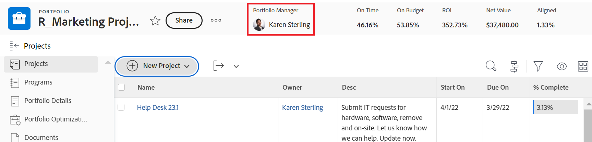

# 포트폴리오 만들기

<!--Audited: 08/2025-->

Portfolio은 동일한 리소스, 예산 및 일정에 대해 경쟁하는 프로젝트의 컬렉션입니다. Portfolio의 프로젝트는 동일한 리소스 풀을 사용하고 동일한 스코어카드에 대해 측정될 만큼 유사합니다.

포트폴리오를 사용하여 동일한 제품 라인, 부서, 부서, 회사 또는 기타 비즈니스 단위에 속하는 프로젝트를 그룹화할 수 있습니다.

## 액세스 요구 사항

+++ 이 문서의 기능에 대한 액세스 요구 사항을 보려면 확장하십시오. 

<table style="table-layout:auto"> 
 <col> 
 <col> 
 <tbody> 
  <tr> 
   <td role="rowheader">[!DNL Adobe Workfront] 패키지</td> 
   <td> 
Any
</td> 
  </tr> 
  <tr> 
   <td role="rowheader">[!DNL Adobe Workfront] 라이센스</td> 
   <td> 
[!UICONTROL Standard]

   
[!UICONTROL 계획] 
 </td> 
  </tr> 
  <tr> 
   <td role="rowheader">액세스 수준 구성</td> 
   <td> 
포트폴리오에 대한 [!UICONTROL 편집] 액세스
  </td> 
  </tr> 
  <tr> 
   <td role="rowheader">개체 권한</td> 
   <td> 
포트폴리오를 만들면 이에 대한 관리 권한이 있습니다
  </td> 
  </tr> 
 </tbody> 
</table>

*자세한 내용은 [Workfront 설명서의 액세스 요구 사항](/help/quicksilver/administration-and-setup/add-users/access-levels-and-object-permissions/access-level-requirements-in-documentation.md)을 참조하십시오.

+++

<!--
Old:

<table style="table-layout:auto"> 
 <col> 
 <col> 
 <tbody> 
  <tr> 
   <td role="rowheader">[!DNL Adobe Workfront] plan*</td> 
   <td> 
Any
</td> 
  </tr> 
  <tr> 
   <td role="rowheader">[!DNL Adobe Workfront] license*</td> 
   <td> 
New: [!UICONTROL Standard]

   
Current:[!UICONTROL Plan] 
 </td> 
  </tr> 
  <tr> 
   <td role="rowheader">Access level configurations</td> 
   <td> 
[!UICONTROL Edit] access to Portfolios
  </td> 
  </tr> 
  <tr> 
   <td role="rowheader">Object permissions</td> 
   <td> 
After you create a portfolio, you have Manage permissions to it, by default
  </td> 
  </tr> 
 </tbody> 
</table>

*For information, see [Access requirements in Workfront documentation](/help/quicksilver/administration-and-setup/add-users/access-levels-and-object-permissions/access-level-requirements-in-documentation.md).
-->

## 포트폴리오를 만드는 방법

다음 방법 중 하나를 사용하여 Workfront에서 포트폴리오를 만들 수 있습니다.

* 메인 메뉴의 포트폴리오 영역에서 시작하여 처음부터 포트폴리오를 만듭니다. 이 문서에서는 처음부터 포트폴리오를 만드는 방법에 대해 설명합니다.

* 킥스타트를 사용하여 포트폴리오를 가져옵니다.

  Workfront 관리자는 킥스타트를 사용하여 포트폴리오를 가져올 수 있습니다.

  Workfront에서 킥스타트를 사용하여 데이터를 가져오는 방법에 대한 자세한 내용은 [킥스타트 템플릿을 사용하여 Adobe Workfront으로 데이터 가져오기](/help/quicksilver/administration-and-setup/manage-workfront/using-kick-starts/import-data-via-kickstarts.md)를 참조하십시오.

* 다음과 같은 방법으로 Workfront Planning에서 포트폴리오를 추가합니다.

   * Workfront Planning의 레코드 유형에서 연결할 때

  포트폴리오를 레코드에 추가하여 만드는 방법에 대한 자세한 내용은 문서 [레코드 만들기](/help/quicksilver/planning/records/create-records.md)의 &quot;연결할 때 레코드 만들기&quot; 섹션을 참조하십시오.
   * Workfront Planning 자동화 사용.

  자세한 내용은 [Adobe Workfront Planning 레코드 자동화를 사용하여 개체 만들기](/help/quicksilver/planning/records/create-wf-objects-using-planning-automations.md)를 참조하십시오.

  Workfront Planning에 대한 새 Workfront 라이선스 및 추가 Workfront Planning 패키지가 있어야 합니다.

  Workfront Planning에 액세스하는 방법에 대한 자세한 내용은 [액세스 개요](/help/quicksilver/planning/access/access-overview.md)를 참조하십시오.

## 포트폴리오 만들기

{{step1-click-main-menu}}

1. **[!UICONTROL 포트폴리오]**&#x200B;를 클릭합니다.

1. (조건부) 조직에서 사용 중인 문서 저장소에 따라 다음 중 하나를 클릭합니다.

   * **새 포트폴리오**. Workfront 관리자가 **Adobe 클라우드 저장소** 또는 **기존 Workfront**&#x200B;를 선택하고 **사용자가 저장소 공급자를 선택할 수 있도록 허용** 설정을 선택하거나 선택하지 않은 경우.
   * **새 포트폴리오(기존 저장소)**. Workfront 관리자가 **Adobe 클라우드 저장소** 또는 **기존 Workfront**&#x200B;를 선택하고 **사용자가 저장소 공급자를 선택할 수 있도록 허용** 설정도 선택했습니다.

     이 옵션은 [설정] 영역에서 **사용자가 저장소 공급자를 선택할 수 있도록 허용** 설정을 선택한 경우에만 표시됩니다.

     자세한 내용은 [조직에 Adobe 클라우드 저장소 사용](/help/quicksilver/administration-and-setup/set-up-workfront/configure-system-defaults/enable-esm.md)을 참조하세요.

     >[!NOTE]
     >
     >Workfront 인스턴스에 두 가지 유형의 문서 저장소가 모두 없을 수 있습니다.

     포트폴리오가 만들어지고 기본 이름은 Workfront이 문서에 사용하는 스토리지에 따라 다음과 같은 패턴을 따릅니다.

      * 기존 Workfront 저장소 포트폴리오의 `Untitled Portfolio`.

        기존 Workfront 저장소 포트폴리오는 이름 옆에 **기존 Workfront 저장소** 아이콘 을 표시합니다.

      * Adobe 클라우드 스토리지 포트폴리오용 `Untitled Portfolio - < Month day, year hour.minute.second >`

        >[!IMPORTANT]
        >
        >Adobe 클라우드 스토리지를 사용하는 포트폴리오의 이름은 고유해야 합니다.

     Adobe 클라우드 스토리지 포트폴리오의 경우 포트폴리오와 동일한 이름의 새 문서 폴더가 문서 영역에 자동으로 만들어집니다.

1. 포트폴리오 헤더에서 포트폴리오의 이름을 새 이름으로 바꿉니다.

   이름에는 최대 255자를 사용할 수 있습니다.

1. (선택 사항) 페이지 상단의 헤더에 있는 **[!UICONTROL Portfolio 관리자]** 아래의 이름을 클릭하여 포트폴리오에 다른 관리자를 할당합니다.

   

   포트폴리오의 작성자는 기본적으로 포트폴리오 관리자로 할당됩니다.

1. 왼쪽 패널에서 **[!UICONTROL Portfolio 세부 정보]**&#x200B;를 클릭합니다.
1. **[!UICONTROL 개요]** 영역에서 다음 정보를 변경합니다.

   <table style="table-layout:auto"> 
    <col> 
    <col> 
    <tbody> 
     <tr> 
      <td role="rowheader">[!UICONTROL 설명]</td> 
      <td> 
Portfolio에 대한 고유한 사항을 나타내도록 설명에 정보를 입력합니다. 
 </td> 
     </tr> 
     <tr> 
      <td role="rowheader">[!UICONTROL Portfolio Manager]</td> 
      <td> 
포트폴리오 관리자로 지정할 사용자의 이름을 입력한 다음 목록에 표시될 때 선택합니다. 이는 [!UICONTROL Portfolio Owner]와 동일합니다. 포트폴리오의 프로젝트에 정의된 작업을 감독하고 비즈니스 사례를 승인할 수 있는 사람입니다.
 
중요: 사용자를 [!UICONTROL Portfolio 관리자]로 지정하면 포트폴리오, 프로그램 및 포트폴리오의 프로젝트에 대한 [!UICONTROL 관리] 권한이 자동으로 부여됩니다. 
 
팁: 페이지 상단의 헤더에서 [!UICONTROL Portfolio Manager]를 업데이트할 수도 있습니다.
 </td> 
     </tr> 
     <tr data-mc-conditions=""> 
      <td role="rowheader">그룹 </td> 
      <td> 
그룹이 포트폴리오를 소유하거나 포트폴리오 완료에 대한 책임이 있는 경우 단일 그룹의 이름을 추가합니다. 
 
마우스로 가리키고 그 옆에 표시되는 [!UICONTROL 정보] 아이콘 을(를) 클릭하여 올바른 그룹을 선택하는지 확인할 수 있습니다. 그룹 및 해당 관리자의 상위 그룹 계층과 같은 그룹에 대한 정보를 나열하는 도구 설명이 표시됩니다.
 
  
 </td> 
     </tr> 
    </tbody> 
   </table>

1. (선택 사항) [!UICONTROL Portfolio 세부 정보] 페이지의 오른쪽 위 모서리에 있는 **[!UICONTROL 사용자 정의 양식 추가]** 상자 내부를 클릭하여 포트폴리오에 대한 사용자 정의 양식을 선택하고 사용자 정의 필드를 업데이트합니다.

   >[!TIP]
   >
   >포트폴리오에 첨부하려면 먼저 포트폴리오 사용자 정의 양식이 이미 만들어져 있어야 합니다.

1. **[!UICONTROL 변경 내용 저장]**&#x200B;을 클릭합니다.
1. (선택 사항) 왼쪽 패널에서 **[!UICONTROL 프로그램]**&#x200B;을 클릭한 다음 **[!UICONTROL 프로그램 추가]**&#x200B;를 클릭하여 포트폴리오에 프로그램을 추가합니다.

   프로그램 만들기에 대한 자세한 내용은 [프로그램 만들기](../../../manage-work/portfolios/create-and-manage-programs/create-program.md)를 참조하십시오.

1. (선택 사항) 왼쪽 패널에서 **[!UICONTROL 프로젝트]**&#x200B;를 클릭한 다음 **[!UICONTROL 프로젝트 추가]**&#x200B;를 클릭하여 포트폴리오에 프로젝트를 추가합니다.

   Portfolio에 프로젝트를 추가하는 방법에 대한 자세한 내용은 [포트폴리오에 프로젝트 추가](../../../manage-work/portfolios/create-and-manage-portfolios/add-projects-to-portfolios.md)를 참조하십시오.

<!--

<h2>Deactivate a portfolio</h2>

(NOTE: drafted this and moved it to their own article: delete-deactivate-portfolios)

When you deactivate a portfolio, you can still access it from the Portfolios area, but it no longer displays in the list of portfolios when users try to add it to a project.

<ol>
<li value="1">Click the <strong>Main Menu</strong> icon  in the upper-right corner of Adobe Workfront.</li>
<li value="2">Click <strong>Portfolios</strong> .</li>
<li value="3"> 
Click the name of the portfolio.
 </li>
<li value="4" data-mc-conditions="QuicksilverOrClassic.Quicksilver">Click the More menu  to the right of the portfolio name, then click <strong>Deactivate Portfolio</strong>.</li>
</ol>
<h2>Delete a portfolio</h2>
<ol>
<li value="1">Click the <strong>Main Menu</strong> icon  in the upper-right corner of Adobe Workfront.</li>
<li value="2"> 
Click <strong>Portfolios</strong> .
 </li>
<li value="3"> 
Select the portfolio, then click the Delete icon .
 </li>
<li value="4"> 
In the box that appears, click <strong>Yes, Delete It</strong> to confirm.
 </li>
</ol>

-->
