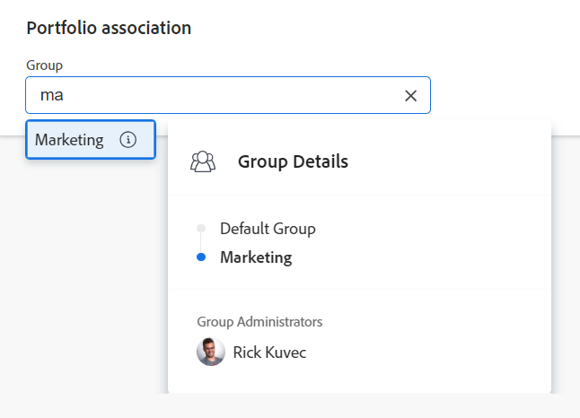

# 포트폴리오 편집

<!--

 

The highlighted information on this page refers to functionality not yet generally available. It is available only in the Preview environment for all customers. The same features will also be available in the Production environment for all customers after a week from the Preview release.      

For more information, see [Interface modernization](/help/quicksilver/product-announcements/product-releases/interface-modernization/interface-modernization.md).  

-->

생성한 포트폴리오나 다른 사용자가 생성한 포트폴리오를 사용자와 공유한 경우 해당 포트폴리오에 대한 정보를 편집할 수 있습니다.

포트폴리오 페이지에서 포트폴리오를 편집하거나 목록에서 포트폴리오를 편집할 수 있습니다.

## 액세스 요구 사항

+++ 을 확장하여 이 문서의 기능에 대한 액세스 요구 사항을 봅니다. 

<table style="table-layout:auto"> 
 <col> 
 <col> 
 <tbody> 
  <tr> 
   <td role="rowheader">[!DNL Adobe Workfront] 플랜</td> 
   <td> 
임의
</td> 
  </tr> 
  <tr> 
   <td role="rowheader">Adobe [!DNL Workfront] 라이선스*</td> 
   <td> 
새로운 기능: 표준

   
현재: [!UICONTROL Plan] 
 </td> 
  </tr> 
  <tr> 
   <td role="rowheader">액세스 수준</td> 
   <td> 
포트폴리오에 대한 [!UICONTROL 편집] 액세스
  </td> 
  </tr> 
  <tr> 
   <td role="rowheader">개체 권한</td> 
   <td> 
포트폴리오에 대한 [!UICONTROL 관리] 권한

   
 포트폴리오의 프로젝트에 대한 권한을 관리하여 포트폴리오에서 추가하거나 제거합니다.
  </td> 
  </tr> 
 </tbody> 
</table>

*자세한 내용은 [Workfront 설명서의 액세스 요구 사항](/help/quicksilver/administration-and-setup/add-users/access-levels-and-object-permissions/access-level-requirements-in-documentation.md)을 참조하십시오.

+++ 

## 포트폴리오 편집

{{step1-to-portfolios}}

1. (선택 사항) 포트폴리오에 대한 제한된 정보를 편집하려면 다음을 수행하십시오.

   1. 포트폴리오 이름을 클릭하여 연 다음 왼쪽 패널에서 **[!UICONTROL Portfolio 세부 정보]**&#x200B;를 클릭합니다.

      

      <!--
      
(NOTE: the note below will also be true for Edit Portfolio box)

      -->

      >[!NOTE]
      >
      >[!DNL Workfront] 관리자 또는 그룹 관리자가 레이아웃 템플릿을 수정한 방법에 따라 [!UICONTROL Portfolio 세부 정보] 영역의 필드가 재배열되거나 표시되지 않을 수 있습니다. 자세한 내용은 [레이아웃 템플릿을 사용하여 [!UICONTROL 세부 정보] 보기 사용자 지정](../../../administration-and-setup/customize-workfront/use-layout-templates/customize-details-view-layout-template.md)을 참조하세요.

      [!UICONTROL **세부 정보**] 섹션의 정보를 편집하려면 다음을 수행하십시오.

   1. (선택 사항) 모든 영역을 축소하려면 오른쪽 상단의 **[!UICONTROL 모두 축소]** 아이콘 을 클릭합니다.
   1. (선택 사항 및 조건부) 영역이 축소되면 각 영역 옆에 있는 **확장** 아이콘 을 클릭하여 편집할 영역을 확장합니다.

      >[!TIP]
      >
      >모든 영역이 축소되면 세부 정보 섹션의 오른쪽 상단에 있는 **모두 확장** 아이콘 을 클릭할 수 있습니다.

      [!UICONTROL **Portfolio 세부 정보**] 섹션에 표시되는 필드에 대한 자세한 내용은 아래 설명된 대로 [!UICONTROL **Portfolio 편집**] 상자에서 포트폴리오 편집을 계속하십시오.
   1. (선택 사항) 포트폴리오에 첨부된 사용자 정의 양식이 없는 경우 **[!UICONTROL 세부 정보]** 페이지의 오른쪽 상단에 있는 **사용자 정의 양식 추가** 필드에 양식 이름을 입력한 다음 목록에 표시될 때 선택합니다.
   1. [!UICONTROL **개요**] 및 [!UICONTROL **사용자 지정 Forms**] 영역의 필드에 정보를 추가한 다음 [!UICONTROL **변경 내용 저장**]&#x200B;을 클릭합니다.
   1. (선택 사항) **[!UICONTROL 내보내기]** 아이콘 을 클릭하여 [!UICONTROL 개요] 및 사용자 정의 양식 정보를 PDF 파일로 내보낸 다음 **[!UICONTROL 내보내기]**&#x200B;를 클릭합니다. 다음 중에서 선택합니다.

      * 모두 선택(사용자 정의 양식이 하나 이상 첨부된 경우에만 표시됨)
      * 개요
      * 하나 이상의 사용자 정의 양식 이름

        PDF 파일이 컴퓨터로 다운로드됩니다.

        

        자세한 내용은 [사용자 정의 양식 및 개체 세부 정보 내보내기](../../../workfront-basics/work-with-custom-forms/export-custom-forms-details.md)를 참조하십시오.

1. (선택 사항) 하나 이상의 포트폴리오에 대한 모든 정보를 편집하려면 포트폴리오 목록에서 편집할 포트폴리오를 하나 이상 선택한 다음 목록 맨 위에 있는 **[!UICONTROL 편집]** 아이콘 을 클릭합니다.

   <!--
   
(NOTE: this might have to be split in two sections if the single edit and the bulk edit won't come at the same time for portfolios)

   -->
   **[!UICONTROL Portfolio 편집]** 대화 상자가 표시됩니다. <!--update screen shot at preview release-->

   

   모든 포트폴리오 필드는 [!UICONTROL Portfolio 편집] 상자에서 사용할 수 있으며 왼쪽 패널에 나열된 영역별로 그룹화됩니다.

1. 다음 섹션 중 하나에서 정보를 지정하는 것이 좋습니다.

   * [[!UICONTROL 개요]](#overview)
   * [사용자 정의 양식](#custom-forms)
   * [댓글](#comment)

### [!UICONTROL 개요] {#overview}

1. 위에서 설명한 대로 포트폴리오 편집을 시작합니다.
1. **[!UICONTROL 개요]**&#x200B;를 클릭하고 다음 필드를 지정합니다.

   <!--
   
(NOTE: note below is drafted: drafted till they release new Edit Portfolio boxes)

   -->

   <!--
   <note type="note">
   Depending on how your Workfront administrator or Group administrator sets up our Layout Template, the fields in the Edit Portfolio box might be rearranged or not display. For information, see
   <a href="../../../administration-and-setup/customize-workfront/use-layout-templates/customize-details-view-layout-template.md" class="MCXref xref">Customize the Details view using a layout template</a>.
   </note>
   -->

   <table style="table-layout:auto"> 
    <col> 
    <col> 
    <tbody> 
     <tr> 
      <td role="rowheader">[!UICONTROL **Name**]</td> 
      <td> 
포트폴리오의 이름을 업데이트합니다. 
 
<b>팁</b>
 
      
두 개 이상의 포트폴리오를 선택하면 **이름** 필드를 사용할 수 없습니다. 
 </td> 
     </tr> 
     <tr> 
      <td role="rowheader">[!UICONTROL **설명**]</td> 
      <td> 
Portfolio에 대한 고유한 사항을 나타내도록 설명에 정보를 입력합니다. 
 </td> 
     </tr> 
     <tr> 
      <td role="rowheader">[!UICONTROL **Portfolio 관리자**]</td> 
      <td> 
포트폴리오 관리자로 지정할 사용자의 이름을 입력한 다음 목록에 표시될 때 선택합니다. 이는 [!UICONTROL Portfolio Owner]와 동일합니다. 포트폴리오의 프로젝트에 정의된 작업을 감독하고 비즈니스 사례를 승인할 수 있는 사람입니다.
 
중요: 사용자를 Portfolio 관리자로 지정하면 포트폴리오, 프로그램 및 포트폴리오의 프로젝트에 대한 [!UICONTROL 관리] 권한이 자동으로 부여됩니다. 
 
팁: 포트폴리오 헤더에서 포트폴리오 관리자를 빠르게 업데이트할 수 있습니다. 
 </td> 
     </tr> 
     <tr> 
      <td role="rowheader">[!UICONTROL **Group**]</td> 
      <td> 
그룹이 포트폴리오와 연결되어 있거나 그룹 완료를 위한 권한이 있는 경우 단일 그룹의 이름을 추가합니다. 
 
팁:  
[!UICONTROL Portfolio Details] 페이지에서 [!UICONTROL Group] 필드에 액세스할 때 다음을 수행합니다. 
 
마우스로 가리키고 그 옆에 표시되는 [!UICONTROL 정보] 아이콘 을(를) 클릭하여 올바른 그룹을 선택하는지 확인할 수 있습니다. 그룹 및 해당 관리자의 상위 그룹 계층과 같은 그룹에 대한 정보를 나열하는 도구 설명이 표시됩니다.
 
  
 
[!UICONTROL Portfolio 편집] 상자에서는 이 옵션을 사용할 수 없습니다. 
 
 </td> 
     </tr> 
     <tr> 
      <td role="rowheader"> 
[!UICONTROL **Alignment Scorecard**]
 </td> 
      <td> 
드롭다운 목록에서 사용할 정렬 스코어카드를 선택합니다. 스코어카드는 프로젝트가 Portfolio의 정해진 기준에 얼마나 잘 부합하는지 측정하는 데 사용되며, 이때 조직의 임무, 값 및 전략적 목표가 반영됩니다. 자세한 내용은 <a href="../../../manage-work/projects/define-a-business-case/apply-scorecard-to-project-to-generate-alignment-score.md" class="MCXref xref">프로젝트에 스코어카드 적용 및 맞춤 점수 생성</a> 및 <a href="../../../administration-and-setup/set-up-workfront/configure-system-defaults/create-scorecard.md" class="MCXref xref">스코어카드 만들기</a>를 참조하십시오.
 </td> 
     </tr> 
     <tr> 
      <td role="rowheader">[!UICONTROL **활성 상태임**]</td> 
      <td> 
 포트폴리오를 활성화하려면 이 확인란을 선택하십시오. 다른 사용자는 프로젝트를 만들거나 편집할 때 활성 포트폴리오를 찾아 프로젝트에 첨부할 수 있습니다. 비활성 포트폴리오를 프로젝트에 첨부할 수 없습니다. 이 기능은 기본적으로 활성화되어 있습니다.
 </td> 
     </tr> 
    </tbody> 
   </table>

1. **[!UICONTROL 변경 내용 저장]**&#x200B;을 클릭하거나 다음 섹션을 계속 편집하십시오.

   <!--Replace the last point with this at preview release: Click **[!UICONTROL Save Changes]** or [!UICONTROL **Save**] and continue editing the following sections.-->

### 사용자 정의 양식

1. 위에서 설명한 대로 포트폴리오 편집을 시작합니다.
1. **[!UICONTROL Forms 추가]** 드롭다운 메뉴를 클릭하여 사용자 정의 양식을 선택하고 포트폴리오에 추가하십시오.

   <!--Or 
   Start typing the name of a form in the [!UICONTROL **Add custom form**] field.-->

   포트폴리오 사용자 정의 양식을 추가하려면 먼저 만들어야 합니다.

   >[!NOTE]
   >
   >[!DNL Workfront] 관리자가 사용자 정의 양식의 섹션에 대한 권한을 설정하는 방법에 따라 모든 사용자가 지정된 사용자 정의 양식의 동일한 필드를 보거나 편집할 수 있는 것은 아닙니다. 사용자 정의 양식의 섹션 내에서 필드를 편집할 수 있는 권한은 포트폴리오 자체에 대한 권한에 따라 다릅니다. 사용자 정의 양식의 섹션에 대한 사용 권한 설정에 대한 자세한 내용은 [사용자 정의 양식 만들기](/help/quicksilver/administration-and-setup/customize-workfront/create-manage-custom-forms/form-designer/design-a-form/design-a-form.md)를 참조하십시오.

1. 사용자 정의 양식의 모든 필드를 업데이트한 다음 **[!UICONTROL 변경 내용 저장]**&#x200B;을 클릭하거나 다음 섹션을 계속하십시오.

   <!--Replace the last point with this at preview release: Click **[!UICONTROL Save Changes]** or [!UICONTROL **Save**] and continue editing the following sections.-->

### 댓글 {#comment}

1. 위에서 설명한 대로 포트폴리오 편집을 시작합니다.
1. **[!UICONTROL 댓글]**&#x200B;을 클릭합니다. <!--replace screen shot at preview-->

   

1. **[!UICONTROL 포트폴리오 업데이트 게시]** 필드에 댓글을 추가합니다.
1. (선택 사항) 댓글에 사용자 또는 팀을 추가하려면 **[!UICONTROL 사람]** 아이콘을 클릭합니다.
1. (선택 사항) **[!UICONTROL 잠금]** 아이콘을 클릭하여 댓글을 잠근 후 회사의 사용자에게만 비공개로 설정합니다.
1. **[!UICONTROL 변경 내용 저장]**&#x200B;을 클릭합니다.

   <!--Replace the last point with this at preview release: Click **[!UICONTROL Save Changes]** or [!UICONTROL **Save**].-->
