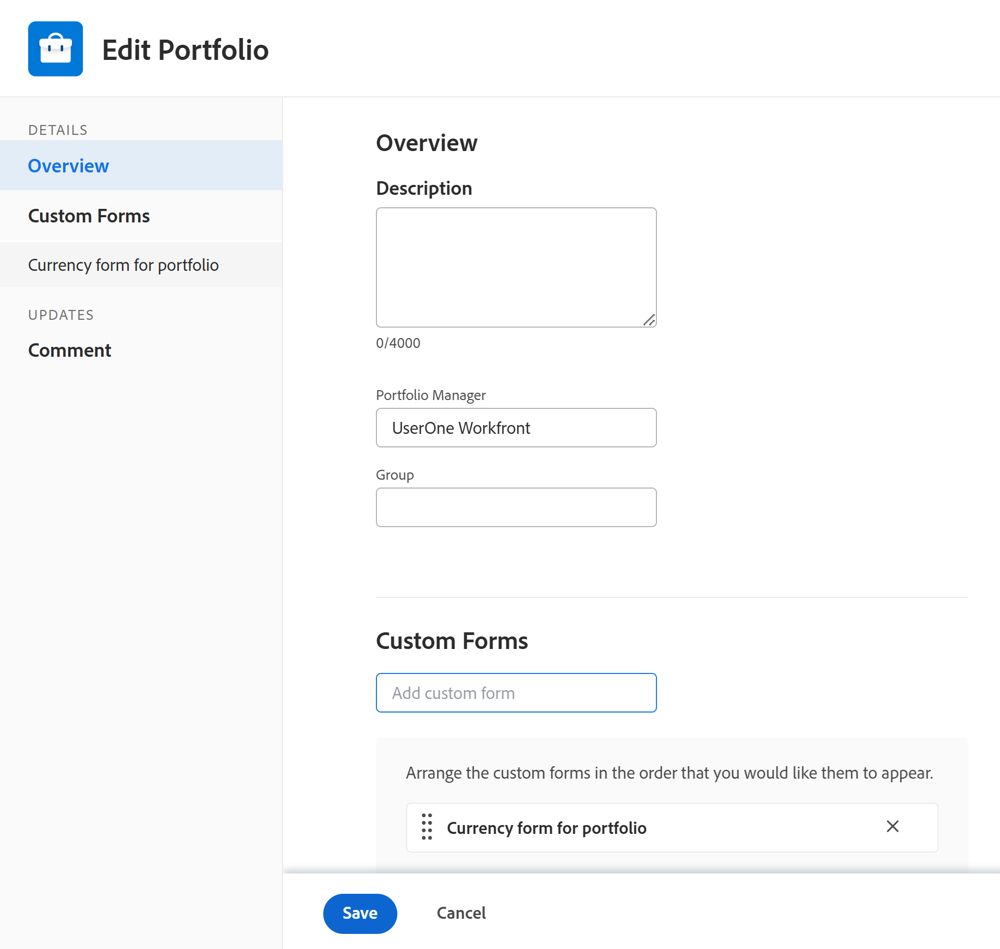
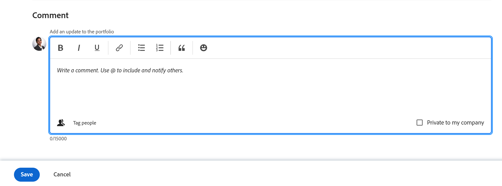

# 포트폴리오 편집

만든 포트폴리오에 대한 정보를 편집하거나 다른 사용자가 사용자와 공유하면 만들 정보를 편집할 수 있습니다.

을(를) 편집할 수 있습니다 [!UICONTROL 포트폴리오] 포트폴리오 페이지에서 또는 목록의 포트폴리오를 편집할 수 있습니다.

## 액세스 요구 사항

이 문서의 절차를 수행하려면 다음 액세스 권한이 있어야 합니다.

<table style="table-layout:auto"> 
 <col> 
 <col> 
 <tbody> 
  <tr> 
   <td role="rowheader">[!DNL Adobe Workfront] 플랜*</td> 
   <td> 
모든
 </td> 
  </tr> 
  <tr> 
   <td role="rowheader">Adobe [!DNL Workfront] 라이선스 개요*</td> 
   <td> 
[!UICONTROL 계획] 
 </td> 
  </tr> 
  <tr> 
   <td role="rowheader">액세스 수준*</td> 
   <td> 
[!UICONTROL Edit] Portfolio 액세스
 
참고: 여전히 액세스할 수 없는 경우 [!DNL Workfront] 관리자가 액세스 수준에서 추가 제한을 설정한 경우 액세스 수준에서 포트폴리오에 액세스하는 방법에 대한 자세한 내용은 <a href="../../../administration-and-setup/add-users/configure-and-grant-access/grant-access-portfolios.md" class="MCXref xref">포트폴리오 액세스 권한 부여</a>. 자세한 내용은 [!DNL Workfront] 관리자는 액세스 수준을 변경할 수 있습니다. <a href="../../../administration-and-setup/add-users/configure-and-grant-access/create-modify-access-levels.md" class="MCXref xref">사용자 정의 액세스 수준 만들기 또는 수정</a>. 
 </td> 
  </tr> 
  <tr> 
   <td role="rowheader">개체 권한</td> 
   <td> 
포트폴리오에 대한 [!UICONTROL Manage] 권한
 
 포트폴리오에 대한 권한 부여에 대한 자세한 내용은 <a href="../../../workfront-basics/grant-and-request-access-to-objects/share-a-portfolio..md" class="MCXref xref">포트폴리오 공유 </a>. 
 
추가 권한 요청에 대한 자세한 내용은 <a href="../../../workfront-basics/grant-and-request-access-to-objects/request-access.md" class="MCXref xref">개체에 대한 액세스 요청 </a>.
 </td> 
  </tr> 
 </tbody> 
</table>

어떤 계획, 라이센스 유형 또는 액세스 권한을 보유하고 있는지 확인하려면 [!DNL Workfront] 관리자

## 포트폴리오 편집

1. 로 이동합니다. **[!UICONTROL 기본 메뉴]**.
1. 클릭 **[!UICONTROL Portfolio]**&#x200B;를 클릭한 다음 포트폴리오 이름을 클릭하여 엽니다.
1. (선택 사항) 포트폴리오에 대한 제한된 정보를 편집하려면 **[!UICONTROL Portfolio 세부 사항]** 왼쪽 패널에 표시됩니다.

   

   <!--
   
(NOTE: the note below will also be true for Edit Portfolio box)

   -->

   >[!NOTE]
   >
   >사용자의 [!DNL Workfront] 관리자 또는 그룹 관리자가 레이아웃 템플릿을 수정한 후 [!UICONTROL Portfolio 세부 사항] 영역이 재배열되거나 표시되지 않을 수 있습니다. 자세한 내용은 [사용자 지정 [!UICONTROL 세부 사항] 레이아웃 템플릿을 사용하여 보기](../../../administration-and-setup/customize-workfront/use-layout-templates/customize-details-view-layout-template.md).

   에서 정보를 편집하려면 [!UICONTROL 세부 사항] 섹션에서 다음을 수행합니다.

   1. (선택 사항) **[!UICONTROL 모두 축소]** 오른쪽 위 모서리의 아이콘을 클릭하여 모든 영역을 축소합니다.
   1. (선택 사항 및 조건부) 영역이 축소되면 **오른쪽 화살표**  각 영역 옆에 있으면 편집할 영역을 확장합니다.
   1. 에 표시되는 필드에 대한 자세한 내용은 [!UICONTROL Portfolio 세부 사항] 섹션에서 포트폴리오 편집을 계속합니다. [!UICONTROL Portfolio 편집] 상자에 나열된 상태로 남아 있습니다.
   1. (선택 사항) 포트폴리오에 첨부된 사용자 지정 양식이 없는 경우 **[!UICONTROL 사용자 지정 양식 추가]** 필드를 선택한 다음 목록에 표시될 때 선택한 다음 **[!UICONTROL 변경 내용 저장]**.
   1. (선택 사항) **[!UICONTROL 내보내기]** 아이콘  내보내려면 [!UICONTROL 개요] 및 사용자 지정 양식 정보를 PDF 파일로 만든 다음 **[!UICONTROL 내보내기]**. 다음 중에서 선택합니다.

      * 모두 선택(하나 이상의 사용자 지정 양식이 첨부된 경우에만 표시)
      * 개요
      * 하나 이상의 사용자 지정 양식의 이름

      PDF 파일이 컴퓨터에 다운로드됩니다.

      

      자세한 내용은 [사용자 지정 양식 및 개체 세부 정보 내보내기](../../../workfront-basics/work-with-custom-forms/export-custom-forms-details.md).

1. 하나 이상의 포트폴리오에 대한 모든 정보를 편집하려면 다음 중 하나를 수행합니다.

   <!--
   
(NOTE: this might have to be split in two sections if the single edit and the bulk edit won't come at the same time for portfolios)

   -->

   * 을(를) 클릭합니다. **[!UICONTROL 자세히]** 포트폴리오 이름 옆에 있는 메뉴를 **[!UICONTROL 편집].**

      <!--   
     
(NOTE: this will change in NWE with a new Edit Portfolio UI)
   
     -->

   * 포트폴리오 목록으로 이동하여 편집할 포트폴리오를 한 개 이상 선택한 다음 **[!UICONTROL 편집]** 아이콘  를 클릭합니다.

      <!--   
     
(NOTE: this will need to split into another section when they release the new [!UICONTROL Edit Portfolio] UI)
   
     -->
   다음 **[!UICONTROL Portfolio 편집]** 대화 상자가 표시됩니다.

   

   모든 포트폴리오 필드는 [!UICONTROL Portfolio 편집] 상자를 열고 왼쪽 패널에 나열된 영역으로 그룹화됩니다.

1. 다음 섹션에서 정보를 지정하는 것이 좋습니다.

   * [[!UICONTROL 개요]](#overview)
   * [사용자 정의 양식](#Custom%C2%A0F)
   * [댓글](#comment)

### [!UICONTROL 개요] {#overview}

1. 위에 설명된 대로 포트폴리오 편집을 시작합니다.
1. 클릭 **[!UICONTROL 개요]** 및 다음 필드를 지정합니다.

   <!--
   
(NOTE: note below is drafted: drafted till they release new Edit Portfolio boxes)

   -->

   <!--
   <note type="note">
   Depending on how your Workfront administrator or Group administrator sets up our Layout Template, the fields in the Edit Portfolio box might be rearranged or not display. For information, see
   <a href="../../../administration-and-setup/customize-workfront/use-layout-templates/customize-details-view-layout-template.md" class="MCXref xref">Customize the Details view using a layout template</a>.
   </note>
   -->

   <table style="table-layout:auto"> 
    <col> 
    <col> 
    <tbody> 
     <tr> 
      <td role="rowheader">[!UICONTROL Name]</td> 
      <td> 
포트폴리오의 이름을 업데이트합니다. 
 
팁: 둘 이상의 포트폴리오를 선택한 경우에는 사용할 수 없습니다. 
 </td> 
     </tr> 
     <tr> 
      <td role="rowheader">[!UICONTROL Description]</td> 
      <td> 
Portfolio에 대한 설명을 입력하여 고유한 사항을 나타냅니다. 
 </td> 
     </tr> 
     <tr> 
      <td role="rowheader">[!UICONTROL Portfolio 관리자]</td> 
      <td> 
포트폴리오 관리자로 나타낼 사용자 이름을 입력하고 목록에 표시될 때 선택합니다. [!UICONTROL Portfolio 소유자]와 동일합니다. 포트폴리오 프로젝트에 정의된 작업을 감독하고 비즈니스 사례를 승인할 수 있는 사람입니다.
 
중요 사항: 사용자를 Portfolio 관리자로 지정하면 포트폴리오, 프로그램 및 포트폴리오의 프로젝트에 대한 [!UICONTROL 관리] 권한을 자동으로 가져옵니다. 
 
팁: 포트폴리오 헤더에서 포트폴리오 관리자를 빠르게 업데이트할 수 있습니다. 
 </td> 
     </tr> 
     <tr> 
      <td role="rowheader">[!UICONTROL Group]</td> 
      <td> 
해당 그룹이 포트폴리오와 연결되어 있거나 그룹을 완료할 책임이 있는 경우 단일 그룹의 이름을 추가합니다. 
 
팁:  
[!UICONTROL Portfolio 세부 사항] 페이지에서 [!UICONTROL 그룹] 필드에 액세스할 때 다음을 수행하십시오. 
 
마우스로 가리키고 [!UICONTROL 정보] 아이콘을 클릭하여 올바른 그룹을 선택할 수 있습니다  옆에 표시됩니다. 그룹 위에 있는 그룹 계층 및 해당 관리자와 같은 그룹에 대한 정보를 나열하는 도구 설명이 표시됩니다.
 
  
 
이 옵션은 [!UICONTROL Portfolio 편집] 상자에서 사용할 수 없습니다. 
 
 </td> 
     </tr> 
     <tr> 
      <td role="rowheader"> 
[!UICONTROL Alignment Scorecard]
 </td> 
      <td> 
드롭다운 목록에서 사용할 정렬 스코어카드를 선택합니다. 스코어카드는 프로젝트가 조직의 미션, 가치 및 전략적 목표를 자주 반영하는 Portfolio의 설정된 기준에 얼마나 잘 부합하는지를 측정하는 데 사용됩니다. 자세한 내용은 <a href="../../../manage-work/projects/define-a-business-case/apply-scorecard-to-project-to-generate-alignment-score.md" class="MCXref xref">프로젝트에 스코어카드를 적용하고 정렬 점수를 생성합니다</a> 및 <a href="../../../administration-and-setup/set-up-workfront/configure-system-defaults/create-scorecard.md" class="MCXref xref">스코어카드 만들기</a>.
 </td> 
     </tr> 
     <tr> 
      <td role="rowheader">[!UICONTROL이 활성화되어 있음]</td> 
      <td> 
 포트폴리오를 활성화하려면 이 확인란을 선택하십시오. 다른 사용자는 프로젝트를 만들거나 편집할 때 활성 포트폴리오를 찾아 프로젝트에 첨부할 수 있습니다. 비활성 포트폴리오는 프로젝트에 연결할 수 없습니다. 기본적으로 활성화되어 있습니다.
 </td> 
     </tr> 
    </tbody> 
   </table>

1. 클릭 **[!UICONTROL 변경 내용 저장]** 또는 다음 섹션을 계속 편집합니다.

### 사용자 정의 양식

1. 위에 설명된 대로 포트폴리오 편집을 시작합니다.
1. 을(를) 클릭합니다. **[!UICONTROL Forms 추가]** 드롭다운 메뉴를 사용하여 사용자 지정 양식을 선택하고 포트폴리오에 추가합니다.

   포트폴리오 사용자 정의 양식을 추가하려면 먼저 해당 양식을 만들어야 합니다.

   >[!NOTE]
   >
   >사용자의 [!DNL Workfront] 관리자는 사용자 지정 양식의 섹션에 대한 권한을 설정하지만 모든 사람이 주어진 사용자 지정 양식에서 동일한 필드를 보거나 편집할 수는 없습니다. 사용자 지정 양식의 섹션 내에서 필드를 편집할 수 있는 권한은 포트폴리오 자체에 대한 사용 권한에 따라 다릅니다. 사용자 지정 양식의 섹션에 대한 권한 설정에 대한 자세한 내용은 [사용자 지정 양식 만들기 또는 편집](../../../administration-and-setup/customize-workfront/create-manage-custom-forms/create-or-edit-a-custom-form.md).

1. 사용자 지정 양식의 필드를 업데이트한 다음 를 클릭합니다 **[!UICONTROL 변경 내용 저장]** 또는 다음 섹션을 계속 진행합니다.

### 댓글 {#comment}

1. 위에 설명된 대로 포트폴리오 편집을 시작합니다.
1. 클릭 **[!UICONTROL 댓글]**.

   

1. 에 댓글 추가 **[!UICONTROL 포트폴리오에 업데이트 게시]** 필드.
1. (선택 사항) **[!UICONTROL 사람]** 사용자 또는 팀을 주석에 추가하는 아이콘.
1. (선택 사항) **[!UICONTROL 잠금]** 아이콘 사용 시 주석을 잠그고 회사 사용자만 비공개로 지정할 수 있습니다.
1. 클릭 **[!UICONTROL 변경 내용 저장]**.
