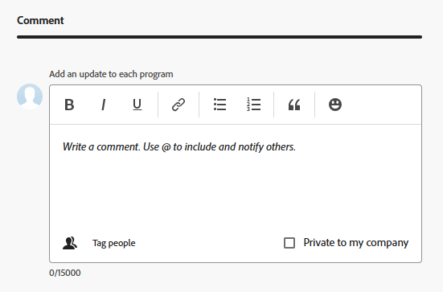

# 프로그램 편집

사용자가 만든 프로그램이나 다른 사용자가 사용자와 공유한 경우 만든 프로그램에 대한 정보를 편집할 수 있습니다.

프로그램 페이지에서 프로그램을 편집하거나 목록에서 하나 이상의 프로그램을 일괄적으로 편집할 수 있습니다.

## 액세스 요구 사항

+++ 이 문서의 기능에 대한 액세스 요구 사항을 보려면 확장하십시오.

<table style="table-layout:auto"> 
 <col> 
 <col> 
 <tbody> 
  <tr> 
   <td role="rowheader">[!DNL Adobe Workfront] 패키지</td> 
   <td> 
임의
 </td> 
  </tr> 
  <tr> 
   <td role="rowheader">[!DNL Adobe Workfront] 라이센스</td> 
   <td> 
[!UICONTROL Standard]

   
[!UICONTROL 계획]
 </td> 
  </tr> 
  <tr> 
   <td role="rowheader">액세스 수준 구성</td> 
   <td> 
프로그램에 대한 [!UICONTROL 편집] 액세스
  </td> 
  </tr> 
  <tr> 
   <td role="rowheader">개체 권한</td> 
   <td> 
프로그램에 대한 [!UICONTROL 관리] 권한
  </td> 
  </tr> 
 </tbody> 
</table>

자세한 내용은 [Workfront 설명서의 액세스 요구 사항](/help/quicksilver/administration-and-setup/add-users/access-levels-and-object-permissions/access-level-requirements-in-documentation.md)을 참조하십시오.

+++

## 프로그램 편집

1. **[!UICONTROL 기본 메뉴]**(으)로 이동합니다.
1. **[!UICONTROL 프로그램]**&#x200B;을 클릭한 다음 프로그램 이름을 클릭하여 엽니다.

   >[!TIP]
   >
   >먼저 포트폴리오로 이동한 다음 왼쪽 패널에서 **[!UICONTROL 프로그램]**&#x200B;을 클릭하여 연결된 포트폴리오에서 프로그램에 액세스할 수 있습니다. 자세한 내용은 [프로그램 만들기](../../../manage-work/portfolios/create-and-manage-programs/create-program.md)를 참조하세요.

1. (선택 사항) 프로그램에 대한 제한된 정보를 편집하려면 왼쪽 패널에서 **[!UICONTROL 프로그램 세부 정보]**&#x200B;를 클릭합니다.

   >[!TIP]
   >
   >프로그램에 대한 모든 정보를 편집하려면 4단계로 이동하십시오.

   

   >[!NOTE]
   >
   >[!DNL Workfront] 관리자 또는 그룹 관리자가 레이아웃 템플릿을 수정한 방법에 따라 [!UICONTROL 프로그램 세부 정보] 영역의 필드가 재배열되거나 표시되지 않을 수 있습니다. 자세한 내용은 [레이아웃 템플릿을 사용하여 [!UICONTROL 세부 정보] 보기 사용자 지정](../../../administration-and-setup/customize-workfront/use-layout-templates/customize-details-view-layout-template.md)을 참조하세요.

   <!--
   
(NOTE: the above note will also come to the Edit Program box)

   -->

   [!UICONTROL 세부 정보] 섹션의 정보를 편집하려면 다음을 수행하십시오.

   1. (선택 사항) 오른쪽 상단의 **[!UICONTROL 모두 축소]** 아이콘을 클릭하여 모든 영역을 축소합니다.
   1. (선택 사항 및 조건부) 영역이 축소되면 각 영역 옆에 있는 **오른쪽 방향 화살표** 를 클릭하여 편집할 영역을 확장합니다.
   1. [!UICONTROL 프로그램 세부 정보] 섹션에 표시되는 필드에 대한 자세한 내용을 보려면 아래 설명된 대로 [!UICONTROL 프로그램 편집] 상자에서 프로그램을 계속 편집하십시오.
   1. (선택 사항) 프로그램에 첨부된 사용자 정의 양식이 없는 경우 **[!UICONTROL 사용자 정의 양식 추가]** 필드에 양식 이름을 입력하고 목록에 표시될 때 선택한 다음 **[!UICONTROL 변경 내용 저장]**&#x200B;을 클릭합니다.
   1. (선택 사항) **[!UICONTROL 내보내기]** 아이콘 을 클릭하여 [!UICONTROL 개요] 및 사용자 정의 양식 정보를 PDF 파일로 내보낸 다음 **[!UICONTROL 내보내기]**&#x200B;를 클릭합니다. 다음 중에서 선택합니다.

      * 모두 선택(사용자 정의 양식이 하나 이상 첨부된 경우에만 표시됨)
      * [!UICONTROL 개요]
      * 하나 이상의 사용자 정의 양식 이름

      PDF 파일이 컴퓨터로 다운로드됩니다.

      

      자세한 내용은 [사용자 정의 양식 및 개체 세부 정보 내보내기](../../../workfront-basics/work-with-custom-forms/export-custom-forms-details.md)를 참조하십시오.

1. 하나 이상의 프로그램에 대한 모든 정보를 편집하려면 다음 중 하나를 수행하십시오.

   * 프로그램 이름 옆에 있는 **[!UICONTROL 자세히]** 메뉴 를 클릭한 다음 **[!UICONTROL 편집].**&#x200B;을 클릭합니다.
   * 프로그램 목록으로 이동하여 편집할 프로그램을 하나 이상 선택한 다음 목록 맨 위에 있는 **[!UICONTROL 편집]** 아이콘 을 클릭합니다.

     **[!UICONTROL 프로그램 편집]** 상자가 표시됩니다.

     

     모든 프로그램 필드는 [!UICONTROL 프로그램 편집] 상자에서 사용할 수 있으며 왼쪽 패널에 나열된 영역별로 그룹화됩니다.

1. 다음 섹션 중 하나에서 정보를 지정하는 것이 좋습니다.

   * [[!UICONTROL 개요]](#overview)
   * [[!UICONTROL 사용자 정의 양식]](#Custom%C2%A0F)
   * [[!UICONTROL 댓글]](#comment)

   >[!TIP]
   >
   >한 번에 여러 프로그램에 대한 사용자 정의 필드를 다시 계산하려면 목록에서 여러 프로그램을 선택하고 목록 맨 위에 있는 **자세히** 메뉴 를 클릭한 다음 **식을 다시 계산**&#x200B;합니다.

### [!UICONTROL 개요] {#overview}

1. 위에서 설명한 대로 프로그램 편집을 시작합니다.
1. **[!UICONTROL 개요]**&#x200B;를 클릭하고 다음 필드를 지정합니다.

   <!--
   
(NOTE: note below drafted for now)

   -->

   <!--
   <note type="note">
   Depending on how your Workfront administrator or Group administrator sets up our Layout Template, the fields in the Edit Program box might be rearranged or not display. For information, see
   <a href="../../../administration-and-setup/customize-workfront/use-layout-templates/customize-details-view-layout-template.md" class="MCXref xref">Customize the Details view using a layout template</a>.
   </note>
   -->

   <table style="table-layout:auto"> 
    <col> 
    <col> 
    <tbody> 
     <tr> 
      <td role="rowheader">[!UICONTROL 이름]</td> 
      <td> 
프로그램 이름을 업데이트합니다. 
 
<b>팁</b>

두 개 이상의 프로그램을 선택한 경우에는 사용할 수 없습니다.
 </td> 
     </tr> 
     <tr> 
      <td role="rowheader">[!UICONTROL 설명]</td> 
      <td> 
포트폴리오에 대한 고유한 사항을 나타내도록 포트폴리오에 대한 설명을 입력합니다. 
 </td> 
     </tr> 
     <tr> 
      <td role="rowheader">[!UICONTROL 프로그램 관리자]</td> 
      <td> 
프로그램 관리자로 표시할 사용자 이름을 입력한 다음 목록에 표시될 때 선택합니다. 프로그램의 프로젝트에 정의된 작업을 감독할 수 있는 사람입니다. 
 
<b>
중요</b>
 
사용자를 프로그램 관리자로 지정하면 프로그램 및 프로그램의 프로젝트에 대한 [!UICONTROL 관리] 권한이 자동으로 부여됩니다. 
 
<b>팁</b>
 
프로그램 헤더에서 프로그램 관리자를 빠르게 업데이트할 수 있습니다. 
 </td> 
     </tr> 
     <tr> 
      <td role="rowheader">[!UICONTROL Group]</td> 
      <td> 
그룹이 프로그램과 연결되어 있거나 프로그램 완료를 위한 권한이 있는 경우 단일 그룹의 이름을 추가합니다. 
 
<b>팁</b>
  
[!UICONTROL 프로그램 세부 정보] 페이지에서 [!UICONTROL 그룹] 필드에 액세스할 때 다음 작업을 수행하여 올바른 그룹을 선택했는지 확인합니다. 
 
그룹 이름을 마우스로 가리킨 다음 그 옆에 있는 [!UICONTROL 정보] 아이콘 을(를) 클릭합니다. 그룹 및 해당 관리자의 상위 그룹 계층과 같은 그룹에 대한 정보를 나열하는 도구 설명이 표시됩니다.
 
  
 
[!UICONTROL 프로그램 편집] 상자에서는 이 옵션을 사용할 수 없습니다. 
 
 </td> 
     </tr> 
    </tbody> 
   </table>

   <!--this was removed from the unshimmed version - asking on the epic:
   <tr> 
      <td role="rowheader">[!UICONTROL Is Active]</td> 
      <td> 
 Select this checkbox if you want the program to be active. Other users can find active programs and attach them to projects or add them to portfolios. Inactive programs cannot be attached to projects or portfolios. This is enabled by default.
 </td> 
     </tr> -->

1. **[!UICONTROL 저장]**&#x200B;을 클릭하거나 다음 섹션을 계속 편집하십시오.

### [!UICONTROL 사용자 정의 양식]

1. 위에서 설명한 대로 프로그램 편집을 시작합니다.
1. **[!UICONTROL Forms 추가]** 드롭다운 메뉴를 클릭하여 사용자 정의 양식을 선택하고 프로그램에 추가합니다.

   프로그램 사용자 정의 양식을 추가하려면 먼저 해당 양식을 만들어야 합니다.

   >[!NOTE]
   >
   >[!DNL Workfront] 관리자가 사용자 정의 양식의 섹션에 대한 권한을 설정하는 방법에 따라 모든 사용자가 지정된 사용자 정의 양식의 동일한 필드를 보거나 편집할 수 있는 것은 아닙니다. 사용자 정의 양식의 섹션 내에서 필드를 편집할 수 있는 권한은 프로그램 자체에 대한 권한에 따라 다릅니다. 사용자 정의 양식의 섹션에 대한 사용 권한 설정에 대한 자세한 내용은 [사용자 정의 양식 만들기](/help/quicksilver/administration-and-setup/customize-workfront/create-manage-custom-forms/form-designer/design-a-form/design-a-form.md)를 참조하십시오.

1. 사용자 정의 양식의 모든 필드를 업데이트한 다음 **[!UICONTROL 저장]**&#x200B;을 클릭하거나 다음 섹션을 계속하십시오.

### [!UICONTROL 댓글] {#comment}

1. 위에서 설명한 대로 프로그램 편집을 시작합니다.
1. **[!UICONTROL 댓글]**&#x200B;을 클릭하세요.

   

1. **[!UICONTROL 각 프로그램에 업데이트를 추가]** 필드에 댓글을 추가합니다.
1. (선택 사항) 댓글에 사용자 또는 팀을 추가하려면 **[!UICONTROL 사람]** 아이콘을 클릭합니다.
1. (선택 사항) [!UICONTROL **내 회사에 비공개**]&#x200B;를 선택하여 댓글을 잠그고 회사의 사용자에게만 비공개로 설정합니다.

   >[!TIP]
   >
   >**회사에 비공개** 설정은 Workfront 프로필이 회사와 연결되어 있을 때만 사용할 수 있습니다.

   변경 내용을 저장하면 추가한 댓글이 프로그램의 [!UICONTROL 업데이트] 탭에 표시되고 이에 포함된 사용자에게 전자 메일을 보냅니다.
1. **[!UICONTROL 저장]**&#x200B;을 클릭합니다

## 프로그램 일괄 편집

프로그램을 일괄 편집할 때 업데이트한 모든 정보가 각 프로그램의 원래 정보보다 우선하여 선택한 모든 프로그램에 적용됩니다.

1. 프로그램 목록으로 이동한 후 여러 프로그램을 선택합니다.
1. 목록 맨 위에 있는 **편집** 아이콘 을 클릭합니다.

   **프로그램 편집** 상자가 열립니다.
1. 다음 섹션의 정보를 업데이트합니다.

   * 개요
   * 사용자 정의 양식
   * 댓글

   자세한 내용은 이 문서에서 4단계부터 [프로그램 편집](#edit-programs-1) 섹션을 참조하십시오. <!--ensure this stays accurate-->

