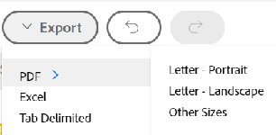

# [!UICONTROL Portfolio 최적화 도구] 개요

<!-- Audited: 01/2024 -->

[!UICONTROL Portfolio 최적화 도구]는 프로젝트 평가 및 비교에 사용되는 도구입니다. 포트폴리오에 할당된 프로젝트의 [!UICONTROL 비즈니스 사례] 값을 검토하고 비교하는 프로세스는 포트폴리오 관리자가 프로젝트의 우선 순위를 정하고 조직에 가장 많은 가치를 생성할 수 있는 방법입니다.

[!UICONTROL 포트폴리오 최적화 도구]의 목적은 포트폴리오 관리자, 운영 위원회 또는 제품 관리 사무실에서 각 프로젝트의 비즈니스 사례에 대한 요약 정보를 볼 수 있는 인터페이스를 제공하는 것입니다. 그런 다음 전략적 가치와 목표에 따라 또는 전체 점수에 따라 프로젝트의 우선 순위를 지정할 수 있습니다.

다음 필수 구성 요소를 완료한 경우에만 [!UICONTROL Portfolio 최적화 도구]에서 도움을 줄 수 있습니다.

* 프로젝트에서 [!UICONTROL 비즈니스 사례]이(가) 완료되었습니다. 자세한 내용은 [비즈니스 사례 정의: 문서 색인](../../projects/define-a-business-case/define-business-case.md)의 문서를 참조하십시오.
* 포트폴리오는 검토하려는 프로젝트에 대한 프로젝트 세부 정보 섹션의 프로젝트 개요 영역에 정의되어 있습니다.
* 검토할 프로젝트에 대한 프로젝트 예산 및 계획된 혜택을 표시했습니다. 고정 비용 및 고정 수익은 선택 사항이지만 추가 가치를 제공합니다. 자세한 내용은 [프로젝트 재무 필드](../../projects/project-finances/project-finances-overview-1.md)를 참조하십시오.

[!UICONTROL Portfolio 최적화 도구]를 찾는 방법에 대한 자세한 내용은 [Portfolio 최적화 도구 찾기]](../../../manage-work/portfolios/portfolio-optimizer/locate-portfolio-optimizer.md)를 참조하십시오.[!UICONTROL 

## [!UICONTROL Portfolio 최적화 도구]의 재무

[!UICONTROL Portfolio 최적화 도구]를 사용할 때 프로젝트 수명 동안 언제든지 포트폴리오의 재무 상태를 확인할 수 있습니다.

[!UICONTROL Portfolio 최적화 도구]에서 재무 작업을 수행할 때 다음 사항을 고려하십시오.

* [!UICONTROL Portfolio 최적화 도구]에서 일치하는 조건에 따라 [!UICONTROL 비즈니스 사례]이(가) 완료되면 프로젝트에 각각 점수가 부여됩니다. 예를 들어 비용이 저렴하거나 정렬 수준이 높은 프로젝트일수록 높은 점수를 받습니다.

  프로젝트의 포트폴리오 최적화 프로그램 점수를 계산하는 방법에 대한 자세한 내용은 [Portfolio 최적화 프로그램 개요] 점수](../../../manage-work/portfolios/portfolio-optimizer/portfolio-optimizer-score.md)를 참조하십시오.[!UICONTROL 

* [!UICONTROL Portfolio 최적화 도구]에 대한 재무 계산은 프로젝트의 [!UICONTROL 비즈니스 사례]에서 [!UICONTROL 예산 비용]을 사용합니다.
* [!UICONTROL Portfolio 최적화 도구]에서 프로젝트에 대한 모든 정보를 고려하여 프로젝트의 우선 순위를 수동으로 지정할 수 있습니다. 재무 데이터, 스코어카드에 대한 정렬 및 ROI 등이 여기에 포함됩니다.

### [!UICONTROL Portfolio 최적화 도구]의 재무 영역 {#the-financial-areas-in-the-portfolio-optimizer}

[!UICONTROL Portfolio 최적화 도구]의 다음 영역에서 재무 정보를 볼 수 있습니다.

* **[!UICONTROL Portfolio 머리글]**: 이 영역에는 포트폴리오의 모든 프로젝트에서 수집한 재무 정보가 표시됩니다. Portfolio 개체의 모든 탭에 표시됩니다.
* **[!UICONTROL 선택한 프로젝트에 대한 재무 Portfolio]**: 이 영역에는 [!UICONTROL Portfolio 최적화 도구]에서 선택한 프로젝트에서 수집한 재무 정보가 표시됩니다. 프로젝트를 추가하거나 제거하고 이 영역의 정보를 보고 포트폴리오의 재정에 어떤 영향을 미치는지 이해할 수 있습니다.
* **[!UICONTROL 프로젝트 재무]**: 이 영역에는 [!UICONTROL Portfolio 최적화 도구]에 나열된 각 프로젝트의 재무 정보가 표시됩니다.

### [!UICONTROL Portfolio 최적화 도구]의 재무 필드 {#the-financial-fields-in-the-portfolio-optimizer}

[!UICONTROL Portfolio 최적화 도구]에 다음 재무 필드가 표시됩니다.

* [Portfolio 헤더](#portfolio-header)
* [선택한 프로젝트에 대한 재무 Portfolio](#portfolio-finances-for-selected-projects)

#### Portfolio 헤더 {#portfolio-header}

[!DNL Adobe Workfront]은(는) [!UICONTROL 승인됨] 또는 [!UICONTROL 현재]와(과) 동일한 상태의 프로젝트 정보를 사용하여 포트폴리오 헤더의 재무 필드를 계산합니다.

<table style="table-layout:auto"> 
 <col> 
 <col> 
 <thead> 
  <tr> 
   <th><strong>필드 이름</strong> </th> 
   <th><strong>설명</strong> </th> 
  </tr> 
 </thead> 
 <tbody> 
  <tr> 
   <td>[!UICONTROL 설정 시간]</td> 
   <td> 
포트폴리오에서 [!UICONTROL On Time]으로 간주되는 프로젝트의 백분율입니다. 포트폴리오 내의 모든 탭에서 볼 수 있습니다.
 
프로젝트 <strong>[!UICONTROL Condition]</strong>이(가) Target의 <strong>[!UICONTROL]</strong>인 경우 프로젝트는 [!UICONTROL On Time]으로 간주됩니다.  [!UICONTROL 프로젝트 상태]에 대한 자세한 내용은 문서 <a href="../../../manage-work/projects/manage-projects/project-condition-and-condition-type.md" class="MCXref xref">프로젝트 상태 및 상태 형식 개요</a>를 참조하십시오.
 
<strong>[!UICONTROL On Time]</strong> 백분율은 다음 공식을 사용하여 계산됩니다.
 
<em>[!UICONTROL On Time Portfolio 백분율] = [!UICONTROL Current] 또는 [!UICONTROL Approved] 상태의 총 프로젝트 수 </em> 
 </td> 
  </tr> 
  <tr> 
   <td>[!UICONTROL On Budget]</td> 
   <td> 
포트폴리오에서 [!UICONTROL On Budget]으로 간주되는 프로젝트의 백분율입니다. [!UICONTROL portfolio] 내의 모든 탭에서 볼 수 있습니다.
 
프로젝트가 사전 정의된 예산을 초과하지 않은 경우 <strong>[!UICONTROL On Budget]</strong>입니다.  프로젝트 예산에 대한 자세한 내용은 프로젝트 재무 영역의 문서 <a href="../../../manage-work/projects/project-finances/manage-project-finance-area.md" class="MCXref xref">[!UICONTROL 관리] 정보를 참조하십시오</a>.
 
[!UICONTROL On Budget] 백분율은 다음 공식을 사용하여 계산됩니다.
 
<em>[!UICONTROL On Budget Portfolio 백분율] = [!UICONTROL Current] 또는 [!UICONTROL Approved] 상태에서 [!UICONTROL On Budget] 프로젝트 수/ 총 프로젝트 수 </em><em></em> 
 </td> 
  </tr> 
  <tr> 
   <td>ROI(포트폴리오용)</td> 
   <td> 
포트폴리오에 대한 [!UICONTROL 투자 수익률](ROI)은 [!UICONTROL Portfolio]의 총 [!UICONTROL 이익]과 프로젝트의 총 [!UICONTROL 예산 비용]을 고려하여 계산됩니다. 포트폴리오 내의 모든 탭에서 볼 수 있습니다.
 
Portfolio ROI 값은 다음 공식을 사용하여 계산됩니다.
 
<em>Portfolio ROI = ([!UICONTROL 총 이익] - [!UICONTROL 총 예산 비용])/ [!UICONTROL 총 비용] * 100</em> 
 
프로젝트에 대한 ROI 계산 방법에 대한 자세한 내용은 <a href="../../../manage-work/projects/project-finances/calculate-roi.md" class="MCXref xref">투자 수익률 계산</a> 문서를 참조하십시오.
 </td> 
  </tr> 
  <tr> 
   <td>[!UICONTROL Aligned] 또는 [!UICONTROL Alignment Score] </td> 
   <td> 
프로젝트의 [!UICONTROL 비즈니스 사례]에서 [!UICONTROL 스코어카드]를 완료한 후 계산되는 모든 [!UICONTROL 프로젝트 정렬 점수] 값의 평균입니다. 각 프로젝트의 정렬 점수는 [!UICONTROL Portfolio Optimizer]의 [!UICONTROL Alignment] 열에 나열됩니다. 포트폴리오 내의 모든 탭에서 볼 수 있습니다.
 
프로젝트에 대한 정렬 점수 생성에 대한 자세한 내용은 <a href="../../../manage-work/projects/define-a-business-case/apply-scorecard-to-project-to-generate-alignment-score.md" class="MCXref xref">프로젝트에 스코어카드 적용 및 정렬 점수 생성</a> 문서를 참조하십시오.
 </td> 
  </tr> 
  <tr> 
   <td>[!UICONTROL Net Value]</td> 
   <td> 
포트폴리오에 있는 모든 프로젝트의 모든 [!UICONTROL Net Values]의 합계입니다. 포트폴리오 내의 모든 탭에서 볼 수 있습니다.
 
프로젝트에 대한 [!UICONTROL Net Value]를 계산하는 방법에 대한 자세한 내용은 <a href="../../../manage-work/projects/project-finances/calculate-net-value.md" class="MCXref xref">Net Value 계산</a> 문서를 참조하십시오.
 </td> 
  </tr> 
 </tbody> 
</table>

#### 선택한 프로젝트에 대한 재무 Portfolio {#portfolio-finances-for-selected-projects}

<table style="table-layout:auto"> 
 <col> 
 <col> 
 <thead> 
  <tr> 
   <th><strong>필드 이름</strong> </th> 
   <th><strong>설명</strong></th> 
  </tr> 
 </thead> 
 <tbody> 
  <tr> 
   <td>[!UICONTROL 프로젝트 수]</td> 
   <td> 
포트폴리오의 총 활성 프로젝트 수입니다. 포트폴리오에서 활성으로 간주되는 프로젝트는 다음 상태 중 하나일 수 있습니다.
 
    <ul> 
     <li>[!UICONTROL Current]</li> 
     <li>[!UICONTROL Planning]</li> 
     <li>[!UICONTROL Approved]</li> 
    </ul> </td> 
  </tr> 
  <tr> 
   <td>[!UICONTROL Budget]</td> 
   <td>이 필드를 수동으로 업데이트하여 전체 포트폴리오에 대한 총 예산을 나타낼 수 있습니다. 이 예산은 포트폴리오 내의 모든 프로젝트에 사용됩니다. </td> 
  </tr> 
  <tr> 
   <td>[!UICONTROL 남음]</td> 
   <td> 
포트폴리오 내의 모든 프로젝트에 대한 [!UICONTROL 예산 비용] 이후의 나머지 예산을 포트폴리오의 예산에서 뺍니다.
 
[!UICONTROL 남은 Portfolio 예산]은 다음 공식을 사용하여 계산됩니다.
 
<em>[!UICONTROL 남은 Portfolio 예산] = [!UICONTROL 총 Portfolio 예산] - 모든 Portfolio 프로젝트의 총 [!UICONTROL 예산 비용]</em> 
 
포트폴리오에 있는 모든 프로젝트의 전체 [!UICONTROL 예산 비용]은 예산 필드 아래의 표시기 막대에 표시됩니다. 
 
프로젝트의 비용 추적에 대한 자세한 내용은 <a href="../../../manage-work/projects/project-finances/track-costs.md" class="MCXref xref">비용 추적</a>을 참조하세요.
 </td> 
  </tr> 
  <tr> 
   <td>[!UICONTROL 총 비용]</td> 
   <td> 
[!UICONTROL Portfolio 최적화 도구]에 표시된 모든 프로젝트의 비용 합계입니다. 각 프로젝트의 비용은 [!UICONTROL 비즈니스 사례 요약]에 표시되는 프로젝트의 [!UICONTROL 예산 비용]과 동일합니다. 
 
[!UICONTROL 비즈니스 사례]에 있는 프로젝트의 재무 필드에 대한 자세한 내용은 문서 <a href="../../../manage-work/projects/define-a-business-case/create-business-case.md" class="MCXref xref">프로젝트에 대한 비즈니스 사례 만들기</a>의 "비즈니스 사례의 재무 필드 이해" 섹션을 참조하십시오.
 </td> 
  </tr> 
  <tr> 
   <td>[!UICONTROL 위험] </td> 
   <td> 
포트폴리오에 있는 모든 프로젝트의 모든 [!UICONTROL 잠재적 위험 비용]의 합계입니다. 각 프로젝트의 [!UICONTROL 잠재적 위험 비용]은 [!UICONTROL Portfolio Optimizer]의 [!UICONTROL 위험] 열에 나열됩니다. 
 
프로젝트의 위험 계산에 대한 자세한 내용은 <a href="../../../manage-work/projects/project-finances/potential-risk-cost.md" class="MCXref xref">잠재적 위험 비용 계산</a> 문서를 참조하십시오.
 </td> 
  </tr> 
  <tr> 
   <td>[!UICONTROL 이익]</td> 
   <td> 
포트폴리오에 있는 모든 프로젝트의 모든 [!UICONTROL 계획된 이익] 값의 합계입니다. 각 프로젝트의 계획된 이익 값은 [!UICONTROL Portfolio 최적화 도구]의 [!UICONTROL 이익] 열에 나열됩니다. 
 
프로젝트의 [!UICONTROL 계획된 이익]에 대한 자세한 내용은 문서 <a href="../../../manage-work/projects/project-finances/project-planned-benefit.md" class="MCXref xref">프로젝트 계획된 이익 개요</a>를 참조하십시오.
 </td> 
  </tr> 
  <tr> 
   <td>[!UICONTROL 순 가치 위험] 표시기</td> 
   <td> 
포트폴리오의 모든 프로젝트에서 제공하는 [!UICONTROL Net Value]를 고려하여 [!UICONTROL 잠재적 위험] 값을 측정합니다. 포트폴리오 내에서 가장 효율성을 높이기 위해 [!UICONTROL Risk] 지표는 낮고 [!UICONTROL Net Value] 지표는 높습니다. 
 
[!UICONTROL 순 가치]에 대한 위험 계산에 대한 자세한 내용은 <a href="../../../manage-work/portfolios/portfolio-optimizer/calculate-risk-to-net-value-in-portfolio.md" class="MCXref xref">포트폴리오의 순 가치 대비 위험 계산</a> 문서를 참조하십시오.
 </td> 
  </tr> 
 </tbody> 
</table>

## [!UICONTROL Portfolio 최적화 도구] 사용자 지정

설정에서 목록의 정보를 변경하여 [!UICONTROL Portfolio 최적화 도구]의 프로젝트 목록 영역만 사용자 지정할 수 있습니다.

[!UICONTROL Portfolio 최적화 도구]에서 다음 아이콘과 옵션을 사용할 수 있습니다.

<table style="table-layout:auto"> 
 <col> 
 <col> 
 <col> 
 <tbody> 
  <tr> 
   <td><strong>Portfolio 최적기의 아이콘</strong></td> 
   <td><strong>이름</strong></td> 
   <td><strong>함수</strong></td> 
  </tr> 
  <tr> 
   <td>  </td> 
   <td>[!UICONTROL 프로젝트 우선 순위 설정]</td> 
   <td>우선 순위에 따라 프로젝트 순서를 저장하려면 이 아이콘을 사용합니다. </td> 
  </tr> 
  <tr> 
   <td>  </td> 
   <td>[!UICONTROL Optimize portfolio]</td> 
   <td>이 아이콘을 사용하여 프로젝트의 다음 재무 값을 기반으로 포트폴리오를 최적화할 수 있습니다.
    <ul>
     <li>[!UICONTROL 비용]</li>
     <li>[!UICONTROL Alignment]</li>
     <li>[!UICONTROL 값]</li>
     <li>[!UICONTROL 이익 위험]</li>
     <li>[!UICONTROL ROI]</li>
    </ul>
포트폴리오 최적화에 대한 자세한 내용은 문서 <a href="../../../manage-work/portfolios/portfolio-optimizer/optimize-projects-in-portfolio-optimizer.md" class="MCXref xref">[!UICONTROL Portfolio 최적화 도구에서 프로젝트 최적화]</a>를 참조하십시오.
</td> 
  </tr> 
  <tr> 
   <td>  </td> 
   <td>[!UICONTROL Undo]/ [!UICONTROL Redo] 아이콘</td> 
   <td>이러한 아이콘을 사용하여 저장하기 전에 [!UICONTROL Portfolio 최적기]에 적용한 변경 사항을 취소하거나 다시 실행합니다.</td> 
  </tr> 
  <tr> 
   <td>  </td> 
   <td>[!UICONTROL Show]/[!UICONTROL Hide] 선택되지 않은 프로젝트</td> 
   <td>이 아이콘을 사용하여 선택하지 않은 포트폴리오의 프로젝트를 표시하거나 숨길 수 있습니다.</td> 
  </tr> 
  <tr> 
   <td>  </td> 
   <td>[!UICONTROL 내보내기] </td> 
   <td> 
이 아이콘을 사용하여 [!UICONTROL Portfolio 최적화 도구]의 [!UICONTROL 프로젝트 우선 순위] 영역에서 데이터를 내보냅니다. 다음 형식으로 내보낼 수 있습니다.
 
    <ul> 
     <li>PDF</li> 
     <li>[!DNL Excel]</li> 
     <li>[!UICONTROL Tab] 구분</li> 
    </ul> </td> 
  </tr> 
  <tr> 
   <td>  </td> 
   <td>[!UICONTROL 환경 설정]</td> 
   <td> 
이 아이콘을 사용하여 [!UICONTROL Portfolio 최적화 도구]의 열에 표시되는 프로젝트 필드를 수정하거나, 해당 상태에 따라 [!UICONTROL Optimizer]에 표시하는 프로젝트를 수정하십시오. 
 
팁:  
     <ul> 
      <li> 
일부 [!DNL Workfront] 표준 필드를 열에 추가할 수 없습니다. 
 </li> 
     </ul> 
     <ul> 
      <li> 
포트폴리오의 프로젝트에서 0이 아닌 값이 있는 사용자 지정 필드만 추가할 수 있습니다.
 </li> 
     </ul> 
 </td> 
  </tr> 
 </tbody> 
</table>
