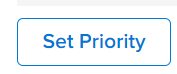

# [!UICONTROL Portfolio 최적화 프로그램] 개요

다음 [!UICONTROL Portfolio 최적화 프로그램] 는 프로젝트 평가 및 비교에 사용되는 도구입니다. 검토 및 비교 프로세스 [!UICONTROL 비즈니스 사례] 포트폴리오에 할당된 프로젝트에 대한 값은 포트폴리오 관리자가 프로젝트에 우선순위를 매기고 조직에 대해 가장 많은 값을 생성할 수 있는 방법입니다.

의 목적 [!UICONTROL 포트폴리오 최적화 프로그램] 포트폴리오 관리자, 운영 위원회 또는 제품 관리 부서가 각 프로젝트의 비즈니스 사례에 대한 요약 정보를 볼 수 있는 인터페이스를 제공하는 것입니다. 그런 다음 전략 값 및 목표에 따라 또는 전체 점수에 따라 프로젝트의 우선 순위가 매겨질 수 있습니다.

다음 [!UICONTROL Portfolio 최적화 프로그램] 다음 전제 조건을 완료한 경우에만 지원을 받을 수 있습니다.

* 다음 [!UICONTROL 비즈니스 사례] 이(가) 프로젝트에서 완료되었습니다. 자세한 내용은 섹션의 문서를 참조하십시오 [비즈니스 사례 정의](../../projects/define-a-business-case/define-business-case.md).
* 포트폴리오는 검토할 프로젝트의 프로젝트 세부 사항 섹션의 프로젝트 개요 영역에 정의됩니다
* 검토하려는 프로젝트에 대해 프로젝트 예산 및 계획 복리후생 을 표시했습니다. 고정 비용 및 고정 수익은 선택 사항이지만 추가 값을 추가합니다. 자세한 내용은 [프로젝트 재무 분야](../../projects/project-finances/project-finances-overview-1.md).

찾기 관련 정보 [!UICONTROL Portfolio 최적화 프로그램]를 참조하십시오. [을(를) 찾습니다 [!UICONTROL Portfolio 최적화 프로그램]](../../../manage-work/portfolios/portfolio-optimizer/locate-portfolio-optimizer.md).

## 재정 [!UICONTROL Portfolio 최적화 프로그램]

* [재정 부문 [!UICONTROL Portfolio 최적화 프로그램]](#the-financial-areas-in-the-portfolio-optimizer)
* [의 금융 분야 [!UICONTROL Portfolio 최적화 프로그램]](#the-financial-fields-in-the-portfolio-optimizer)

을 사용할 때 프로젝트 수명 동안 언제든지 포트폴리오의 재무 상태를 볼 수 있습니다 [!UICONTROL Portfolio 최적화 프로그램].

에서 재무 작업 시 다음 사항을 고려하십시오 [!UICONTROL Portfolio 최적화 프로그램]:

* 프로젝트 마다 점수가 지정됩니다 [!UICONTROL 비즈니스 사례] 에서는 일치하는 기준에 따라 완료됩니다 [!UICONTROL Portfolio 최적화 프로그램]. 예를 들어, 낮은 비용이나 높은 정렬 프로젝트의 점수가 높아집니다.

   프로젝트의 portfolio optimizer 점수 계산에 대한 자세한 내용은 문서를 참조하십시오 [개요 [!UICONTROL Portfolio 최적화 프로그램] 점수](../../../manage-work/portfolios/portfolio-optimizer/portfolio-optimizer-score.md).

* Analytics의 [!UICONTROL Portfolio 최적화 프로그램] 사용 [!UICONTROL 예산책정된 비용] 에서 [!UICONTROL 비즈니스 사례] 프로젝트 구성
* 에서는 프로젝트의 우선 순위를 수동으로 지정할 수 있습니다 [!UICONTROL Portfolio 최적화 프로그램]이러한 모든 정보를 고려하여, 여기에는 재무 데이터, 스코어카드에 대한 정렬, ROI가 포함됩니다.

### 재정 부문 [!UICONTROL Portfolio 최적화 프로그램] {#the-financial-areas-in-the-portfolio-optimizer}

다음 영역에서 재무 정보를 볼 수 있습니다 [!UICONTROL Portfolio 최적화 프로그램]:

* **[!UICONTROL Portfolio 헤더]**: 이 영역은 포트폴리오의 모든 프로젝트에서 수집한 재무 정보를 표시합니다. Portfolio 개체의 모든 탭에 표시됩니다.
* **[!UICONTROL 선택한 프로젝트의 Portfolio 재무]**: 이 영역에는 [!UICONTROL Portfolio 최적화 프로그램]. 프로젝트를 추가하거나 제거하고 이 영역의 정보를 보고 이 프로젝트가 포트폴리오의 재무에 미치는 영향을 이해할 수 있습니다.
* **[!UICONTROL 프로젝트 재무]**: 이 영역에는 [!UICONTROL Portfolio 최적화 프로그램].

### 의 금융 분야 [!UICONTROL Portfolio 최적화 프로그램] {#the-financial-fields-in-the-portfolio-optimizer}

다음 재무 필드가 [!UICONTROL Portfolio 최적화 프로그램]:

* [Portfolio 헤더](#portfolio-header)
* [선택한 프로젝트에 대한 재무 Portfolio](#portfolio-finances-for-selected-projects)

#### Portfolio 헤더 {#portfolio-header}

[!DNL Adobe Workfront] 와 같은 상태인 프로젝트의 정보를 사용하여 포트폴리오 헤더의 재무 필드를 계산합니다. [!UICONTROL 승인됨] 또는 [!UICONTROL 현재].

<table style="table-layout:auto"> 
 <col> 
 <col> 
 <thead> 
  <tr> 
   <th><strong>필드 이름</strong> </th> 
   <th><strong>설명</strong> </th> 
  </tr> 
 </thead> 
 <tbody> 
  <tr> 
   <td>[!UICONTROL On Time]</td> 
   <td> 
포트폴리오에서 [!UICONTROL On Time]으로 간주되는 프로젝트의 백분율입니다. 이는 Portfolio 내의 모든 탭에서 볼 수 있습니다.
 
프로젝트는 프로젝트 시 [!UICONTROL On Time]으로 간주됩니다 <strong>[!UICONTROL Condition]</strong> is <strong>[!UICONTROL On Target]</strong>.  [!UICONTROL 프로젝트 조건]에 대한 자세한 내용은 문서를 참조하십시오 <a href="../../../manage-work/projects/manage-projects/project-condition-and-condition-type.md" class="MCXref xref">프로젝트 조건 및 조건 유형 개요</a>.
 
다음 <strong>[!UICONTROL On Time]</strong> 백분율은 다음 공식을 사용하여 계산됩니다.
 
<em>[!UICONTROL On Time Portfolio Percentage] = [!UICONTROL On Time] 프로젝트 수/[!UICONTROL Current] 또는 [!UICONTROL Approved] 상태의 총 프로젝트 수</em> 
 </td> 
  </tr> 
  <tr> 
   <td>[!UICONTROL On Budget]</td> 
   <td> 
포트폴리오에서 [!UICONTROL On Budget]으로 간주되는 프로젝트의 백분율입니다. 이는 [!UICONTROL Portfolio] 내의 모든 탭에서 볼 수 있습니다.
 
프로젝트는 다음과 같습니다 <strong>[!UICONTROL On Budget]</strong> 사전 정의된 예산을 초과하지 않은 경우.  프로젝트 예산에 대한 자세한 내용은 문서를 참조하십시오 <a href="../../../manage-work/projects/project-finances/manage-project-finance-area.md" class="MCXref xref">프로젝트 재무 영역의 [!UICONTROL 관리] 정보</a>.
 
[!UICONTROL On Budget] 백분율은 다음 공식을 사용하여 계산됩니다.
 
<em>[!Uicontrol On Budget Portfolio Percentage] = [!UICONTROL On Budget] 프로젝트 수/ 총 프로젝트 수 </em><em>( [!UICONTROL Current] 또는 [!UICONTROL Approved] 상태)</em> 
 </td> 
  </tr> 
  <tr> 
   <td>ROI(포트폴리오의 경우)</td> 
   <td> 
포트폴리오의 [!UICONTROL Return on Investment](ROI)는 [!UICONTROL Portfolio]의 총 [!UICONTROL Entrance] 및 프로젝트의 [!UICONTROL Established Cost] 합계를 고려하여 계산됩니다. 이는 Portfolio 내의 모든 탭에서 볼 수 있습니다.
 
Portfolio ROI 값은 다음 공식을 사용하여 계산됩니다.
 
<em>Portfolio ROI = ([!UICONTROL 총 이익] - [!UICONTROL 총 예산 비용])/ [!UICONTROL 총 비용] * 100</em> 
 
프로젝트에 대한 ROI를 계산하는 방법에 대한 자세한 내용은 문서를 참조하십시오 <a href="../../../manage-work/projects/project-finances/calculate-roi.md" class="MCXref xref">투자 수익률 계산(ROI)</a> .
 </td> 
  </tr> 
  <tr> 
   <td>[!UICONTROL Alignment] 또는 [!UICONTROL Alignment Score] </td> 
   <td> 
프로젝트의 [!UICONTROL Business Case]에서 [!UICONTROL Scorecard]를 완료한 후 계산된 모든 [!UICONTROL 프로젝트 정렬 점수] 값의 평균입니다. 각 프로젝트의 정렬 점수가 [!UICONTROL Portfolio 최적화 프로그램]의 [!UICONTROL 정렬] 열에 나열됩니다. 이는 포트폴리오 내의 모든 탭에서 볼 수 있습니다.
 
프로젝트에 대한 정렬 점수 생성에 대한 자세한 내용은 문서를 참조하십시오 <a href="../../../manage-work/projects/define-a-business-case/apply-scorecard-to-project-to-generate-alignment-score.md" class="MCXref xref">프로젝트에 스코어카드를 적용하고 정렬 점수를 생성합니다</a>.
 </td> 
  </tr> 
  <tr> 
   <td>[!UICONTROL Net Value]</td> 
   <td> 
포트폴리오에 있는 모든 프로젝트의 모든 [!UICONTROL 네트 값]의 합계입니다. 이는 포트폴리오 내의 모든 탭에서 볼 수 있습니다.
 
프로젝트에 대해 [!UICONTROL Net Value]를 계산하는 방법에 대한 자세한 내용은 문서를 참조하십시오 <a href="../../../manage-work/projects/project-finances/calculate-net-value.md" class="MCXref xref">순 값 계산</a>.
 </td> 
  </tr> 
 </tbody> 
</table>

#### 선택한 프로젝트에 대한 재무 Portfolio {#portfolio-finances-for-selected-projects}

<table style="table-layout:auto"> 
 <col> 
 <col> 
 <thead> 
  <tr> 
   <th><strong>필드 이름</strong> </th> 
   <th> 
<strong>설명</strong> 
 
 
 </th> 
  </tr> 
 </thead> 
 <tbody> 
  <tr> 
   <td>[!UICONTROL 프로젝트 수]</td> 
   <td> 
포트폴리오의 총 활성 프로젝트 수입니다. 포트폴리오에서 활성으로 간주되는 프로젝트는 다음 상태 중 하나일 수 있습니다.
 
    <ul> 
     <li>[!UICONTROL Current]</li> 
     <li>[!UICONTROL Planning]</li> 
     <li>[!UICONTROL Approved]</li> 
    </ul> </td> 
  </tr> 
  <tr> 
   <td>[!UICONTROL Budget]</td> 
   <td>이 필드를 수동으로 업데이트하여 전체 포트폴리오의 총 예산을 표시할 수 있습니다. 이 예산은 포트폴리오 내의 모든 프로젝트에 사용됩니다. </td> 
  </tr> 
  <tr> 
   <td>[!UICONTROL Remaining]</td> 
   <td> 
포트폴리오 내의 모든 프로젝트에 대한 [!UICONTROL 예산책정된 비용] 이후의 나머지 예산이 포트폴리오 예산에서 빼졌습니다.
 
[!UICONTROL 나머지 Portfolio 예산]은 다음 공식을 사용하여 계산됩니다.
 
<em>[!UICONTROL 나머지 Portfolio 예산] = [!UICONTROL 총 Portfolio 예산] - 모든 Portfolio 프로젝트의 총 [!UICONTROL 예산 비용]</em> 
 
포트폴리오의 모든 프로젝트에 대한 전체 [!UICONTROL 예산책정된 비용]은 [예산] 필드 아래에 있는 지표 표시줄에 표시됩니다. 
 
프로젝트의 비용 추적에 대한 자세한 내용은 문서를 참조하십시오<a href="../../../manage-work/projects/project-finances/track-costs.md" class="MCXref xref">비용 추적</a>.
 </td> 
  </tr> 
  <tr> 
   <td>[!UICONTROL 총 비용]</td> 
   <td> 
[!UICONTROL Portfolio 최적기]에 표시되는 모든 프로젝트의 비용의 합계입니다. 각 프로젝트의 비용은 [!UICONTROL Business Case Summary]에 표시된 프로젝트의 [!UICONTROL Budget Cost]와 동일합니다. 
 
[!UICONTROL Business Case]에서 프로젝트의 재무 필드에 대한 자세한 내용은 문서의 "비즈니스 사례의 재무 필드 이해" 섹션을 참조하십시오 <a href="../../../manage-work/projects/define-a-business-case/create-business-case.md" class="MCXref xref">프로젝트에 대한 비즈니스 사례 생성 </a>.
 </td> 
  </tr> 
  <tr> 
   <td>[!UICONTROL Risk] </td> 
   <td> 
포트폴리오에 있는 모든 프로젝트의 [!UICONTROL 잠재적 위험 비용]의 합계입니다. 각 프로젝트의 [!UICONTROL 잠재적 위험 비용]이 [!UICONTROL Portfolio 최적화 프로그램]의 [!UICONTROL Risk] 열에 나열됩니다. 
 
프로젝트의 위험 계산에 대한 자세한 내용은 문서를 참조하십시오 <a href="../../../manage-work/projects/project-finances/potential-risk-cost.md" class="MCXref xref">잠재적 위험 비용 계산 </a>.
 </td> 
  </tr> 
  <tr> 
   <td>[!UICONTROL Benefits]</td> 
   <td> 
포트폴리오의 모든 프로젝트에 대한 모든 [!UICONTROL Planning Benefits] 값의 합계. 각 프로젝트의 Planning 혜택 값은 [!UICONTROL Portfolio 최적화 프로그램]의 [!UICONTROL 혜택] 열에 나열됩니다. 
 
프로젝트의 [!UICONTROL Planning Benefits]에 대한 자세한 내용은 문서를 참조하십시오 <a href="../../../manage-work/projects/project-finances/project-planned-benefit.md" class="MCXref xref">프로젝트 계획 이익 개요</a>.
 </td> 
  </tr> 
  <tr> 
   <td>[!UICONTROL Risk to Net Value] 지표</td> 
   <td> 
포트폴리오의 모든 프로젝트에서 제공하는 [!UICONTROL Net Value]를 고려하여 [!UICONTROL 잠재적 위험] 값을 측정합니다. 포트폴리오 내에서 가장 높은 효율성을 얻으려면 [!UICONTROL Risk] 표시기가 낮고 [!UICONTROL Net Value] 표시기가 높음을 확인해야 합니다. 
 
[!UICONTROL Net Value]에 대한 위험 계산에 대한 자세한 내용은 문서를 참조하십시오 <a href="../../../manage-work/portfolios/portfolio-optimizer/calculate-risk-to-net-value-in-portfolio.md" class="MCXref xref">포트폴리오의 순 가치 평가</a>.
 </td> 
  </tr> 
 </tbody> 
</table>

## 사용자 지정 [!UICONTROL Portfolio 최적화 프로그램]

의 프로젝트 목록 영역만 사용자 지정할 수 있습니다 [!UICONTROL Portfolio 최적화 프로그램] 설정을 사용하여 목록의 정보를 변경합니다.

다음 아이콘 및 옵션을 [!UICONTROL Portfolio 최적화 프로그램]:

<table style="table-layout:auto"> 
 <col> 
 <col> 
 <col> 
 <tbody> 
  <tr> 
   <td>Portfolio 최적기의 아이콘</td> 
   <td>이름</td> 
   <td>함수</td> 
  </tr> 
  <tr> 
   <td>  </td> 
   <td>[!UICONTROL 프로젝트 우선 순위 설정]</td> 
   <td>프로젝트 순서를 우선순위를 기준으로 저장하려면 이 아이콘을 사용합니다. </td> 
  </tr> 
  <tr> 
   <td>  </td> 
   <td>[!UICONTROL Optimize portfolio]</td> 
   <td>이 아이콘을 사용하여 프로젝트의 다음 재무 값을 기반으로 포트폴리오를 최적화합니다.
    <ul>
     <li>[!UICONTROL Cost]</li>
     <li>[!UICONTROL Alignment]</li>
     <li>[!UICONTROL Value]</li>
     <li>[!UICONTROL Risk to Benefits]</li>
     <li>[!UICONTROL ROI]</li>
    </ul>
포트폴리오 최적화에 대한 자세한 내용은 문서를 참조하십시오 <a href="../../../manage-work/portfolios/portfolio-optimizer/optimize-projects-in-portfolio-optimizer.md" class="MCXref xref">[!UICONTROL Portfolio 최적화]에서 프로젝트 최적화 </a>.
</td> 
  </tr> 
  <tr> 
   <td>  </td> 
   <td>[!UICONTROL 실행 취소]/ [!UICONTROL 다시 실행] 아이콘</td> 
   <td>저장하기 전에 이러한 아이콘을 사용하여 [!UICONTROL Portfolio 최적화 프로그램]에 수행한 변경 사항을 취소하거나 재실행합니다.</td> 
  </tr> 
  <tr> 
   <td>  </td> 
   <td>[!UICONTROL Show]/ [!UICONTROL Hide unchecked] 프로젝트</td> 
   <td>이러한 아이콘을 사용하여 선택 취소한 포트폴리오의 프로젝트를 표시하거나 숨깁니다.</td> 
  </tr> 
  <tr> 
   <td>  </td> 
   <td>[!UICONTROL Export] </td> 
   <td> 
이 아이콘을 사용하여 [!UICONTROL Portfolio 최적화]]의 [!UICONTROL 프로젝트 우선 순위 지정] 영역에서 데이터를 내보냅니다. 다음 형식으로 내보낼 수 있습니다.
 
    <ul> 
     <li>PDF</li> 
     <li>[!DNL Excel]</li> 
     <li>[!UICONTROL Tab]으로 구분됨</li> 
    </ul> </td> 
  </tr> 
  <tr> 
   <td>  </td> 
   <td>[!UICONTROL Preferences]</td> 
   <td> 
이 아이콘을 사용하여 [!UICONTROL Portfolio 최적화 프로그램] 열에 표시되는 프로젝트 필드를 수정하거나, 상태에 따라 [!UICONTROL Optimizer]에 표시하는 프로젝트를 수정합니다. 
 
팁:  
     <ul> 
      <li> 
전부는 아닙니다 [!DNL Workfront] 열에 표준 필드를 추가할 수 있습니다. 
 </li> 
     </ul> 
     <ul> 
      <li> 
포트폴리오의 프로젝트에서 0이 아닌 값이 있는 사용자 지정 필드만 추가할 수 있습니다.
 </li> 
     </ul> 
 </td> 
  </tr> 
 </tbody> 
</table>
