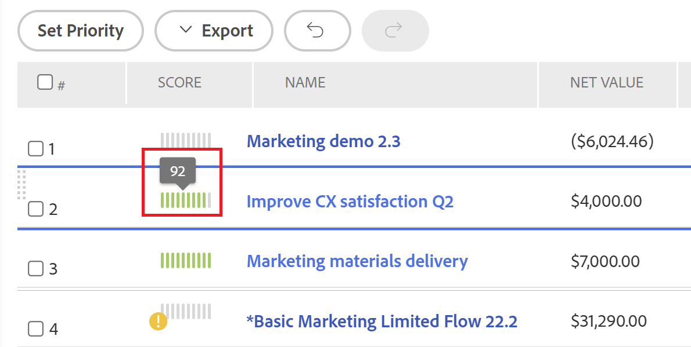

# [!UICONTROL Portfolio 최적화 도구] 점수 개요

<!--Audited: 01/2025-->

[!UICONTROL Portfolio Optimizer]에서 [!UICONTROL Portfolio Optimizer] 점수를 찾을 수 있습니다. 모든 프로젝트에 대해 **[!UICONTROL 점수]** 열에 표시됩니다. 포트폴리오의 모든 프로젝트에 대한 점수를 나타냅니다.

[!UICONTROL Portfolio Optimizer]을(를) 찾는 방법에 대한 자세한 내용은 문서 [[!UICONTROL Portfolio Optimizer] 개요](../../../manage-work/portfolios/portfolio-optimizer/portfolio-optimizer-overview.md)를 참조하십시오.

[!DNL Adobe Workfront]이(가) 프로젝트 점수 및 기타 프로젝트 정보를 사용하여 [!UICONTROL Portfolio Optimizer]에서 프로젝트를 최적화하는 방법에 대한 자세한 내용은 [Portfolio Optimizer에서 프로젝트 최적화](../../../manage-work/portfolios/portfolio-optimizer/optimize-projects-in-portfolio-optimizer.md)를 참조하십시오.

## [!UICONTROL 정렬 점수]와(과) [!UICONTROL Portfolio 최적화 프로그램 점수] 간의 차이

프로젝트의 정렬 점수와 포트폴리오 최적화 도구 점수 사이에는 차이가 있습니다.

프로젝트의 정렬 점수는 스코어카드를 완료한 후 얻은 점을 기반으로 계산됩니다. 그런 다음 이 점수를 사용하여 포트폴리오 정렬 점수를 결정합니다. 정렬 점수는 백분율로 표시됩니다.

프로젝트의 정렬 점수가 [!UICONTROL Portfolio Optimizer]의 **[!UICONTROL 정렬]** 열 또는 [!UICONTROL 비즈니스 사례 요약]의 [!UICONTROL 정렬] 필드에 표시됩니다.


프로젝트의 정렬 점수 생성에 대한 자세한 내용은 [프로젝트에 스코어카드 적용 및 정렬 점수 생성](../../../manage-work/projects/define-a-business-case/apply-scorecard-to-project-to-generate-alignment-score.md) 문서를 참조하십시오.

[!UICONTROL 포트폴리오 최적화 도구] 점수는 프로젝트 우선 순위를 지정할 수 있는 [!UICONTROL Portfolio 최적화 도구]에서 자동으로 계산된 순위입니다. 포트폴리오 최적화 도구 점수는 숫자와 함께 표시기 아이콘으로 표시되며 [!UICONTROL Portfolio 최적화 도구]의 **[!UICONTROL 점수]** 열에 표시됩니다.

>[!NOTE]
>
>비즈니스 사례가 완료된 경우에만 [!UICONTROL Portfolio Optimizer]에서 프로젝트에 점수를 매길 수 있습니다. 비즈니스 사례를 완료하는 방법에 대한 자세한 내용은 [[!UICONTROL 프로젝트 비즈니스 사례 만들기]](../../../manage-work/projects/define-a-business-case/create-business-case.md) 문서를 참조하십시오.


각 프로젝트에 대한 점수는 다음 카테고리의 중요도를 기반으로 계산됩니다.

* [!UICONTROL 비용]
* [!UICONTROL 정렬]
* [!UICONTROL 순 값]
* [!UICONTROL 혜택 위험]
* [!UICONTROL ROI]

## [!UICONTROL Portfolio 최적화 도구] 점수 계산

<!--
<p data-mc-conditions="QuicksilverOrClassic.Draft mode">(NOTE: This was edited based on this issue, per Anna: https://hub.workfront.com/issue/603d0c58000095ea0bc00ce5e2110693/overview)</p>
-->

[!DNL Workfront]은(는) 프로젝트 우선 순위 지정에 도움이 되는 순위인 [!UICONTROL Portfolio 최적화 도구]를 사용하여 점수를 생성합니다. 포트폴리오의 값은 프로젝트의 비즈니스 사례에 입력된 값을 기반으로 하며 프로젝트의 점수를 계산하는 데 사용됩니다. 점수가 높은 프로젝트는 더 중요한 것으로 간주될 수 있으며 먼저 완료되는 우선순위가 정해질 수 있다.

프로젝트의 순위를 확인하려면 다음을 수행합니다.

1. [!UICONTROL Portfolio 최적화 도구] (으)로 이동합니다.
1. 등급 아이콘 위로 마우스를 가져가면 프로젝트에 대한 포트폴리오 최적화 도구 점수를 볼 수 있습니다.



점수 계산 알고리즘은 프로젝트의 비즈니스 사례에 요약된 값과 프로젝트의 가중치를 고려합니다. 최적기의 모든 프로젝트에 점수를 부여하고 해당 점수를 정규화하여 항상 점수가 100인 프로젝트가 있습니다. 이것은 최고의 프로젝트에 높은 점수를 줍니다.

>[!BEGINSHADEBOX]

**예**

예를 들어 [!UICONTROL 높은 정렬]을 고려해야 하는 유일한 요소로 설정하는 경우 가장 높은 정렬의 프로젝트가 100점을 받습니다.

>[!ENDSHADEBOX]

다음은 프로젝트별로 점수를 매길 수 있는 기준입니다.

* [!UICONTROL 비용]
* [!UICONTROL 정렬]
* [!UICONTROL 값]
* [!UICONTROL 혜택 위험]
* [!UICONTROL ROI]


포트폴리오에서 프로젝트를 최적화하는 방법에 대한 자세한 내용은 [[!UICONTROL Portfolio Optimizer에서 프로젝트 최적화]](../../../manage-work/portfolios/portfolio-optimizer/optimize-projects-in-portfolio-optimizer.md)를 참조하십시오.

구성 패널의 각 기준([!UICONTROL 비용], [!UICONTROL 정렬], [!UICONTROL ROI], [!UICONTROL 순 가치], [!UICONTROL 이익 대비 위험])에는 선택한 항목에 따라 0~100 범위의 가중치가 부여됩니다.

전체 비즈니스 사례가 있는 각 프로젝트에 대해 다음 공식을 사용하여 기준당 점수가 생성됩니다.

```
Score Per Criteria = (Project Value For The Criteria - AVG(all the project values for this criteria)) / Standard Deviation of that value for that project
```

**예:** 프로젝트 A의 [!UICONTROL 정렬 점수]에 대해 다음과 같은 결과가 나타납니다.

```
Alignment Score = (Project A Alignment Score - AVG (of all the project Alignments)) / Standard Deviation of alignment score for that project
```

[!UICONTROL 기준당 점수]를 모두 계산했으면 가중치를 고려하여 기준당 점수를 추가하여 프로젝트당 만점을 얻을 수 있습니다. 프로젝트의 점수는 다음 공식을 사용하여 계산됩니다.

```
Score = Cost Score * Cost Weight + Alignment Score * Alignment Weight + ROI Score * ROI Weight + Net Value Score * Net Value Weight + Risk Score * Risk Weight
```

프로젝트 비용과 [!UICONTROL 위험]의 경우 논리가 다른 기준의 작동 방식과 반대로 작동합니다. [!UICONTROL 낮은 비용]을 중요시하려면 프로젝트의 전체 점수가 `Cost Score * Cost Weight`까지 증가하지 않고 감소합니다.

각 프로젝트에 대해 점수가 계산되면 다음과 같은 방법으로 프로젝트에 대해 [!UICONTROL 최적화 점수]가 정의됩니다.

1. [!UICONTROL 최소] 및 [!UICONTROL 최대] 점수가 정의되어 있습니다.
1. 해당 값 사이의 범위가 계산됩니다.
1. 각 프로젝트에 대해 [!UICONTROL 최적화 점수]는 다음 공식을 사용하여 계산됩니다.

   ```
   Optimization Score = Rounded ((Score - Minimum / Range)*100)
   ```
