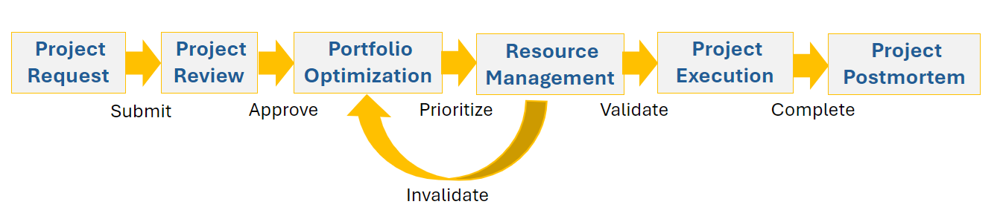

# Portfolio 관리 개요

<!--Audited: 09/2024-->

## 프로젝트 PPM(Portfolio Management) 개요

Portfolio 또는 Project PPM(Portfolio Management)은 특정 비즈니스 목표를 달성하기 위해 프로젝트 목록을 우선 순위 지정하고 관리하는 프로세스입니다.

이 문서에서는 포트폴리오 관리에 대한 일반적인 개념을 설명합니다. Adobe Workfront의 포트폴리오 관리에 대한 일반적인 정보는 [Adobe Workfront의 Portfolio 개요](/help/quicksilver/manage-work/portfolios/portfolios-overview/portfolio-overview.md)를 참조하십시오.

포트폴리오는 일반적인 비즈니스 목표를 가진 프로젝트 모음입니다. 효과적인 PPM 방법론의 결과로 경영진은 다음과 같은 이점을 얻을 수 있습니다.

* 포트폴리오의 모든 프로젝트를 식별합니다.
* 각 프로젝트가 리소스, 비용 및 매출에 미치는 영향을 이해합니다.
* 포트폴리오에서 프로젝트를 우선 순위 지정, 선택 또는 제거할 때 지능적이고 전략적인 결정을 내릴 수 있습니다.

일반적으로 PPM 실무자는 다음 단계를 통해 PPM을 수행합니다.

1. 프로젝트 선택 및 우선 순위를 위한 평가 기준을 만듭니다.
1. 프로젝트 요청을 수집합니다.
1. 생성된 기준에 따라 요청된 여러 프로젝트를 포트폴리오 프로젝트로 선택합니다.
1. 동일한 기준을 사용하여 선택한 프로젝트의 우선 순위를 지정합니다.
1. 선택한 프로젝트를 수행하기 위한 리소스 가용성을 평가합니다.
1. 포트폴리오의 프로젝트 진행 상황을 검토하고 평가한 후 필요한 경우 조정합니다.

## [!DNL Adobe Workfront]PPM 프로세스 개요

[!DNL Workfront]의 Portfolio 관리 도구를 사용하여 프로젝트의 우선 순위를 지정하고 프로젝트가 비즈니스 목표 및 요구 사항과 일치하도록 할 수 있습니다.

다음 다이어그램은 [!DNL Workfront]의 PPM 프로세스에 대한 높은 수준의 개요를 보여 줍니다.

* [프로젝트 요청](#project-request)
* [프로젝트 검토](#project-review)
* [포트폴리오 최적화](#portfolio-optimization)
* [리소스 관리](#resource-management)
* [프로젝트 실행](#project-execution)
* [사후에 프로젝트](#project-postmortem)

### 프로젝트 요청 {#project-request}

프로젝트 Portfolio 관리는 프로젝트 요청으로 시작합니다. 이 단계에서 프로젝트 소유자는 프로젝트 요청을 만들고 검토를 위해 실행 위원회 또는 Portfolio Manager에 제출합니다. 이 때 프로젝트의 비즈니스 사례를 완료한 다음 승인을 위해 제출합니다.

비즈니스 사례 및 프로젝트 요청 만들기에 대한 자세한 내용은 [프로젝트에 대한 비즈니스 사례 만들기](../../../manage-work/projects/define-a-business-case/create-business-case.md)를 참조하세요.

### 프로젝트 검토 {#project-review}

프로젝트 요청을 제출하면 Portfolio 관리자 또는 경영진 팀이 이를 검토하고 프로젝트 승인 여부를 결정합니다. 사용자가 프로젝트를 승인하면 프로젝트가 회사 프로젝트 Portfolio에 대해 선택됩니다.

포트폴리오에 대한 자세한 내용은 [Portfolio 개요 [!DNL Adobe Workfront]](../../../manage-work/portfolios/portfolios-overview/portfolio-overview.md)를 참조하십시오. 비즈니스 사례 승인에 대한 자세한 내용은 [비즈니스 사례 승인](../../../manage-work/projects/define-a-business-case/approve-business-case.md)을 참조하세요.

### 포트폴리오 최적화 {#portfolio-optimization}

Portfolio 관리자는 모든 프로젝트를 포트폴리오에 추가한 후 그 가치, 정렬 및 조직에 대한 이익에 따라 최적화하고 우선 순위를 지정합니다.

포트폴리오 최적화에 대한 자세한 내용은 [Portfolio Optimizer에서 프로젝트 최적화](../../../manage-work/portfolios/portfolio-optimizer/optimize-projects-in-portfolio-optimizer.md)를 참조하십시오.

### 리소스 관리 {#resource-management}

리소스 관리자는 포트폴리오의 성과를 최적화하고 프로젝트의 우선 순위를 지정할 뿐만 아니라 적절한 리소스가 프로젝트에 할당되도록 합니다. [!DNL Workfront]에서 사용할 수 있는 리소스 관리 도구를 사용하여 리소스의 사용 가능 여부 및 할당을 평가합니다.

리소스의 가용성에 따라 Portfolio Manager에서 프로젝트의 우선 순위를 다시 지정해야 할 수 있습니다.

리소스 관리에 대한 자세한 내용은 [리소스 관리](../../../resource-mgmt/manage-resources.md) 섹션을 참조하십시오.

### 프로젝트 실행 {#project-execution}

Portfolio 관리자의 프로젝트 승인과 리소스 관리자의 리소스 유효성 검사를 받은 후 프로젝트 소유자로서 프로젝트를 [!UICONTROL 현재] 상태로 만들 수 있으며 사용자가 작업을 시작하여 프로젝트를 완료할 수 있습니다. 이 단계에서 프로젝트의 기준선을 캡처하여 프로젝트에 대한 참조점을 원래 상태로 유지하는 것이 좋습니다.

[!DNL Workfront]에서 프로젝트를 관리하는 방법에 대한 자세한 내용은 [프로젝트 관리: 문서 인덱스](../../../manage-work/projects/manage-projects/manage-projects-overview.md)를 참조하십시오.

프로젝트에서 기준선을 만드는 방법에 대한 자세한 내용은 [프로젝트 기준선 만들기](../../../manage-work/projects/create-projects/create-baselines.md)를 참조하십시오.

### 사후에 프로젝트 {#project-postmortem}

포트폴리오에서 프로젝트가 완료되면 기준선을 만들고 원래 기준선과 비교하여 각 프로젝트의 성공을 검토할 수 있습니다.

프로젝트에서 기준선을 만드는 방법에 대한 자세한 내용은 [프로젝트 기준선 만들기](../../../manage-work/projects/create-projects/create-baselines.md)를 참조하십시오.
