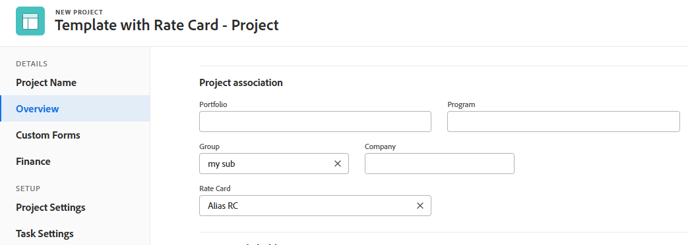

# 템플릿에 요금 카드 첨부

{{highlighted-preview-article-level}}

템플릿에 요금 카드를 할당하면 요금 카드가 템플릿에서 만든 모든 프로젝트에 첨부됩니다. 비율 카드가 프로젝트의 기본값이 되지만 필요한 경우 재정의할 수 있습니다.

요율 카드에 대한 자세한 내용은 [요율 카드 관리](/help/quicksilver/administration-and-setup/manage-enterprise-operations/manage-rate-cards.md)를 참조하십시오.

프로젝트 템플릿에 대한 자세한 내용은 [프로젝트 템플릿 개요](/help/quicksilver/manage-work/projects/create-and-manage-templates/project-template-overview.md)를 참조하십시오.

## 액세스 요구 사항

+++ 이 문서의 기능에 대한 액세스 요구 사항을 보려면 확장하십시오.

<table style="table-layout:auto"> 
 <col> 
 <col> 
 <tbody> 
  <tr> 
   <td>Adobe Workfront 패키지</td> 
   <td>워크플로 얼티밋</td> 
  </tr> 
  <tr> 
   <td>Adobe Workfront 라이선스</td> 
   <td>표준</td> 
  </tr> 
  <tr> 
   <td>액세스 수준 구성</td> 
   <td>템플릿에 대한 액세스 편집</td> 
  </tr> 
  <tr> 
   <td>개체 권한</td> 
   <td>청구 요금 편집 권한으로 요금 카드에 대한 권한 관리</td> 
  </tr> 
 </tbody> 
</table>

자세한 내용은 [Workfront 설명서의 액세스 요구 사항](/help/quicksilver/administration-and-setup/add-users/access-levels-and-object-permissions/access-level-requirements-in-documentation.md)을 참조하십시오.

+++

## 전제 조건

템플릿에 할당하려는 요금 카드는 Workfront에서 만들어야 합니다. 자세한 내용은 [등급 카드 관리](/help/quicksilver/administration-and-setup/manage-enterprise-operations/manage-rate-cards.md)를 참조하십시오.

레이아웃 템플릿의 템플릿에 대해 **등급 카드** 필드를 사용하도록 설정해야 합니다.

1. 레이아웃 템플릿에서 **사용자에게 표시되는 항목 사용자 지정** 아래의 아래쪽 화살표를 클릭한 다음 **템플릿**&#x200B;을 클릭합니다.
1. **세부 정보** 섹션에서 **개요** 영역의 **등급 카드** 필드를 선택합니다.

   자세한 내용은 [레이아웃 템플릿을 사용하여 세부 정보 보기 사용자 지정](/help/quicksilver/administration-and-setup/customize-workfront/use-layout-templates/customize-details-view-layout-template.md)을 참조하십시오.

## 템플릿에 요금 카드 첨부

{{step1-to-templates}}

1. 새 템플릿을 만들거나 기존 템플릿을 편집합니다.
1. 템플릿 세부 정보 > 개요 > 템플릿 연결 섹션에서 **등급 카드** 필드에서 등급 카드를 선택합니다.

   사용 권한이 있는 등급 카드만 선택할 수 있습니다.
속도 카드의 이름을 입력하여 결과 목록의 범위를 좁힐 수 있습니다.

   

1. 편집을 마치면 템플릿을 저장합니다.

   템플릿 만들기에 대한 자세한 내용은 [프로젝트 템플릿 만들기](/help/quicksilver/manage-work/projects/create-and-manage-templates/create-template.md)를 참조하십시오.

   템플릿 편집에 대한 자세한 내용은 [프로젝트 템플릿 편집](/help/quicksilver/manage-work/projects/create-and-manage-templates/edit-templates.md)을 참조하십시오.

## 프로젝트에 템플릿 적용

1. 템플릿을 사용하여 프로젝트를 만듭니다.

   템플릿에서 프로젝트를 만드는 방법에는 여러 가지가 있습니다. 자세한 내용은 다음 문서를 참조하십시오.

   * [템플릿을 사용하여 프로젝트 만들기](/help/quicksilver/manage-work/projects/create-projects/create-project-from-template.md)
   * [작업을 프로젝트로 전환](/help/quicksilver/manage-work/tasks/manage-tasks/convert-task-to-project.md)
   * [문제를 프로젝트로 전환](/help/quicksilver/manage-work/issues/convert-issues/convert-issue-to-project.md)

   요금 카드가 프로젝트에 자동으로 저장됩니다. 새 프로젝트 상자의 개요 > 프로젝트 연결 섹션에서 요율 카드를 제거하거나 **요율 카드** 필드에서 다른 요율 카드를 선택할 수 있습니다.

   

   요금 카드 및 관련 요금이 프로젝트 요금 영역에 표시됩니다.

   프로젝트에서 비율 카드를 제거하거나 비율 영역에 다른 비율 카드를 첨부할 수도 있습니다. 자세한 내용은 [프로젝트에 요금 카드 첨부](/help/quicksilver/manage-work/projects/project-finances/attach-rate-card-to-project.md)를 참조하십시오.

   

   >[!NOTE]
   >
   >템플릿에 개별 요금이 있고 요금 카드도 템플릿에 첨부되어 있는 경우 템플릿에서 프로젝트를 만들 때 개별 요금과 요금 카드가 모두 요금 목록에 나타납니다.

1. (선택 사항) 요금 카드를 기존 프로젝트에 적용하려면 템플릿을 프로젝트에 첨부합니다.

   템플릿 미리 보기에서 **사용자 지정 및 첨부** 옵션을 사용하는 경우 [템플릿 첨부] > [옵션] 섹션에서 **등급 카드** 항목을 선택하여 등급 카드를 프로젝트에 추가할 수 있습니다. 비율 카드가 프로젝트로 전송되지 않도록 하려면 이 확인란을 선택 취소합니다.

   자세한 내용은 [프로젝트에 템플릿 첨부](/help/quicksilver/manage-work/projects/create-and-manage-templates/attach-template-to-project.md)를 참조하십시오.

1. (선택 사항) 특정 프로젝트의 요율 카드를 템플릿에 저장하려면 프로젝트를 템플릿으로 저장합니다.

   템플릿으로 저장 상자의 옵션 섹션에서 **요금 카드** 항목을 선택하여 요금 카드를 템플릿에 추가할 수 있습니다. 비율 카드를 템플릿으로 전송할 수 없도록 하려면 확인란 선택을 취소합니다.

   자세한 내용은 [프로젝트를 템플릿으로 저장](/help/quicksilver/manage-work/projects/manage-projects/save-project-as-template.md)을 참조하십시오.

