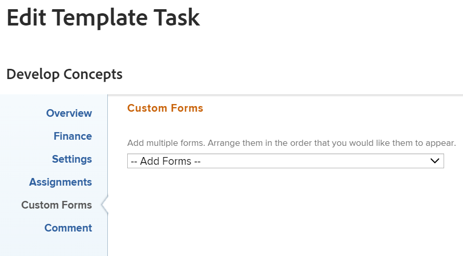

# 템플릿 작업 편집

<!--Audited: 09/2024-->

템플릿을 만든 후 템플릿 작업의 정보를 편집할 수 있습니다. 템플릿을 사용하여 프로젝트를 만들거나 템플릿을 프로젝트에 첨부한 후에는 템플릿 작업에 대해 업데이트하는 정보가 프로젝트 작업과 연결됩니다.

템플릿 만들기에 대한 자세한 내용은 [프로젝트 템플릿 만들기](../../../manage-work/projects/create-and-manage-templates/create-template.md)를 참조하십시오.

템플릿 작업을 편집하거나 템플릿 작업을 일괄적으로 편집할 수 있습니다.

>[!NOTE]
>
>다른 템플릿에 속하는 템플릿 작업은 일괄적으로 편집할 수 없습니다. 동일한 템플릿에 속하는 템플릿 작업만 편집할 수 있습니다.

## 액세스 요구 사항

+++ 를 확장하여 액세스 요구 사항을 확인합니다.

<table style="table-layout:auto"> 
 <col> 
 <col> 
 <tbody> 
  <tr> 
   <td role="rowheader">Adobe Workfront 플랜</td> 
   <td> 
임의
 </td> 
  </tr> 
  <tr> 
   <td role="rowheader">Adobe Workfront 라이센스*</td> 
   <td> 
표준 

   
플랜 
 </td> 
  </tr> 
  <tr> 
   <td role="rowheader">액세스 수준</td> 
   <td> 
템플릿에 대한 액세스 편집
  </td> 
  </tr> 
  <tr> 
   <td role="rowheader">개체 권한 </td> 
   <td> 
템플릿에 대한 권한을 관리합니다. 
 
템플릿 작업에 대한 기여 이상의 권한.
 </td> 
  </tr> 
 </tbody> 
</table>

*자세한 내용은 [Workfront 설명서의 액세스 요구 사항](/help/quicksilver/administration-and-setup/add-users/access-levels-and-object-permissions/access-level-requirements-in-documentation.md)을 참조하십시오.

+++

## 전제 조건

시작하기 전에 다음을 수행해야 합니다

* 템플릿을 만듭니다.

  템플릿 만들기에 대한 자세한 내용은 [프로젝트 템플릿 만들기](../../../manage-work/projects/create-and-manage-templates/create-template.md)를 참조하십시오.

## 템플릿 작업 편집

템플릿 작업 편집 또는 템플릿 작업 세부 정보 영역을 사용하여 템플릿 작업을 편집할 수 있습니다. 다음 단계에서는 템플릿 작업 편집 상자에서 작업을 편집하는 방법에 대해 설명합니다.

{{step1-to-templates}}

1. 템플릿 이름을 클릭하여 엽니다.
1. 왼쪽 패널에서 **템플릿 작업**&#x200B;을 클릭합니다.
1. 목록에서 템플릿 작업의 이름을 클릭하여 템플릿 작업을 엽니다.
1. (선택 사항) 템플릿 작업의 전임 작업을 추가하려면 왼쪽 패널의 **전임 작업** 섹션을 클릭합니다. 템플릿 작업 전임 작업을 추가하는 것은 프로젝트 작업 전임 작업을 추가하는 것과 비슷합니다. 자세한 내용은 [전임 작업 영역을 사용하여 전임 작업 관계 만들기](/help/quicksilver/manage-work/tasks/use-prdcssrs/create-predecessors-in-predecessors-area.md)를 참조하십시오.
1. (선택 사항) 템플릿 작업의 하위 항목을 추가하려면 왼쪽 패널의 **하위 작업** 섹션을 클릭합니다. 템플릿 작업에 대한 하위 작업을 추가하는 것은 프로젝트 작업 하위 작업을 추가하는 것과 비슷합니다. 자세한 내용은 문서 [하위 작업 만들기](/help/quicksilver/manage-work/tasks/create-tasks/create-subtasks.md)의 &quot;작업 하위 작업 섹션에서 하위 작업 만들기&quot; 섹션을 참조하십시오.

1. (조건부) 템플릿 작업에 대한 제한된 정보를 편집하려면 왼쪽 패널에서 **템플릿 작업 세부 정보**&#x200B;를 클릭한 다음 세부 정보 섹션의 영역으로 이동하여 각 영역에 대한 정보를 편집하십시오.
1. (선택 사항) 모든 영역을 축소하려면 **모두 축소** 아이콘 을 클릭합니다.
1. 세부 정보 섹션의 정보를 편집하려면 **편집** 아이콘 을 클릭한 다음 아래 영역에서 선택하거나 **모두 편집**&#x200B;을 클릭하여 모든 영역의 정보를 편집하십시오.

   * 개요
   * 사용자 정의 양식

     세관 양식의 이름은 객체에 첨부된 사용자 정의 양식이 있는 경우에만 표시됩니다.

   * 재무

   >[!TIP]
   >
   >세부 정보 영역에 표시되는 모든 필드에 대한 자세한 내용은 아래 설명된 대로 템플릿 작업 편집 상자를 사용하여 모든 필드를 계속 편집합니다.
1. (선택 사항) 여러 템플릿 작업을 일괄적으로 편집하려면 여러 템플릿 작업을 선택한 다음 템플릿 목록 맨 위에서 **편집**&#x200B;을 클릭합니다.
1. (조건부) 템플릿 작업 또는 여러 작업에 대한 모든 정보를 동시에 편집하려면 목록에서 클릭하여 선택한 다음 목록 맨 위에 있는 **편집** 아이콘 을 클릭합니다.

   **템플릿 작업 편집** 상자가 표시됩니다.

   >[!TIP]
   >
   >목록에서 템플릿 작업을 선택한 다음 편집 을 클릭하여 템플릿 작업 편집 상자를 열 수도 있습니다.

   

1. 다음 섹션 중 하나에서 정보를 지정하는 것이 좋습니다.

   * [개요](#overview)
   * [재무](#finance)
   * [설정](#settings)
   * [할당](#assignments)
   * [사용자 정의 양식](#custom-forms)
   * [댓글](#comment)

### 개요 {#overview}

1. 위에서 설명한 대로 템플릿 작업 편집을 시작합니다.
1. **개요**&#x200B;를 클릭합니다.

   

1. 다음 중 하나를 업데이트합니다.

   <table style="table-layout:auto"> 
    <col> 
    <col> 
    <tbody> 
     <tr> 
      <td role="rowheader"><strong>이름</strong> </td> 
      <td>템플릿 작업의 이름을 지정합니다. 템플릿 작업을 일괄적으로 편집할 때 이 필드가 표시되지 않습니다.</td> 
     </tr> 
     <tr> 
      <td role="rowheader"><strong>설명</strong> </td> 
      <td>템플릿 작업에 대한 추가 정보를 추가합니다.</td> 
     </tr> 
     <tr> 
      <td role="rowheader"><strong>URL</strong> </td> 
      <td>템플릿 작업에 대한 정보와 관련된 웹 링크를 지정합니다.</td> 
     </tr> 
     <tr> 
      <td role="rowheader"><strong>우선 순위</strong> </td> 
      <td> 
템플릿 작업의 우선 순위를 지정할 수 있는 시각적 플래그입니다. 
 
다음 옵션 중에서 선택합니다.
 
       <ul> 
        <li> 
<strong>없음</strong> 
 </li> 
        <li> 
<strong>낮음</strong> 
 </li> 
        <li> 
 <b>보통</b>
 </li> 
        <li> 
<b>높음</b> 
 </li> 
        <li> 
<b>긴급</b> 
 </li> 
       </ul> 
Workfront 관리자가 선택한 프로젝트 환경 설정에 따라 우선순위 이름이 다를 수 있습니다. 우선 순위 편집에 대한 자세한 내용은 <a href="../../../administration-and-setup/customize-workfront/creating-custom-status-and-priority-labels/create-customize-priorities.md" class="MCXref xref">우선 순위 만들기 및 사용자 지정</a>을 참조하십시오.
 </td> 
     </tr> 
     <tr> 
      <td role="rowheader"><strong>기간 유형</strong> </td> 
      <td> 
이 템플릿에서 만드는 향후 작업은 이 기간 유형을 갖게 됩니다.  기간 유형은 다음 간의 관계를 식별합니다.
 
- 작업에 할당된 리소스 수
 
- 작업을 완료하는 데 필요한 총 작업량
 
- 작업의 총 기간. 
 
기간 유형을 사용하면 작업의 요구 사항에 따라 일관된 자원 할당을 설정할 수 있습니다. 작업의 기간 유형에 대한 자세한 내용은 <a href="../../../manage-work/tasks/taskdurtn/task-duration-and-duration-type.md" class="MCXref xref">작업 기간 및 기간 유형 개요</a>를 참조하십시오.
 
다음 옵션 중에서 선택합니다.
 
       <ul> 
        <li> 
계산된 할당 
 </li> 
        <li> 
계산된 작업 
 </li> 
        <li> 
작업량 고정 
 </li> 
        <li> 
단순   
 </li> 
       </ul> </td> 
     </tr> 
     <tr> 
      <td role="rowheader"><strong>기간</strong> </td> 
      <td> 
이후 작업의 기간(분, 시간, 일, 주 또는 개월)을 지정합니다. 이 템플릿에서 만드는 향후 작업은 여기에 지정된 기간을 갖습니다.
 
기본적으로 Workfront은 기간(일)을 측정합니다. 작업을 완료하기 전에 작업이 완료되지 않은 상태로 남아 있도록 허용하는 시간입니다. 작업의 <strong>기간 유형</strong>이(가) <strong>단순</strong>이거나 <strong>작업 제한 조건</strong>이(가) <strong>고정 날짜</strong>인 경우 작업의 기간을 지정할 수 없습니다.
 
<b>중요 사항</b>
 
기간은 일반적으로 템플릿 작업의 계획된 시작 일자와 계획된 완료 일자 사이의 시간이며 이러한 이유로 템플릿의 타임라인에 영향을 줍니다. 이를 통해 템플릿으로 만드는 향후 프로젝트의 타임라인이 결정됩니다. 
 </td> 
     </tr> 
     <tr> 
      <td role="rowheader"><strong>계획된 시간</strong> </td> 
      <td> 
이 템플릿으로 만든 프로젝트에 대한 향후 작업의 계획된 시간 수를 지정합니다. 작업의 할당자가 작업을 완료하는 데 걸리는 실제 시간입니다. <strong>기간 유형</strong>이 <strong>계산된 할당</strong>(으)로 설정된 경우 작업의 계획된 시간 수만 지정할 수 있습니다. 
 </td> 
     </tr>

   <tr> 
      <td role="rowheader"><strong>작업 제한 사항</strong> </td> 
      <td> 
이 템플릿으로 만든 프로젝트의 작업에는 이 제한 사항이 있습니다. 작업 제한은 작업이 완료되어야 하는 시기를 식별합니다. 
 
다음 옵션 중에서 선택합니다.
 
       <ul> 
        <li><strong>고정 날짜</strong>. <strong>계획된 시작</strong> 및 <strong>계획된 완료 일자를 지정하십시오.</strong></li> 
        <li><strong>은(는) </strong>에 시작해야 합니다. <strong>계획된 시작 날짜를 지정하십시오.</strong></li> 
        <li><strong>은(는)</strong>에 완료해야 합니다. <strong>계획된 완료 일자</strong>를 지정하십시오.</li> 
        <li><strong>가능한 빨리</strong> </li> 
        <li><strong>가능한 한 늦게</strong> </li> 
        <li style="font-weight: bold;"><strong>가능한 가장 빠른 시간</strong> </li> 
        <li style="font-weight: bold;"><strong>최근 사용 가능한 시간</strong> </li> 
        <li>다음 이후에 시작: <strong>계획된 시작 일자</strong>를 지정하십시오.</li> 
        <li><strong>다음 이후에 시작</strong>. <strong>계획된 시작 일자</strong>를 지정하십시오.</li> 
        <li><strong>적어도 </strong>까지 완료 <strong>계획된 완료 일자</strong>를 지정하십시오.</li> 
        <li><strong>다음 이후에 완료</strong>. <strong>계획된 완료 일자</strong>를 지정하십시오.</li> 
       </ul> 
작업 제한에 대한 자세한 내용은 <a href="../../../manage-work/tasks/task-constraints/task-constraint-overview.md" class="MCXref xref">작업 제한 개요</a>를 참조하십시오.
 </td> 
     </tr> 
     <tr> 
      <td role="rowheader">시작 일자(선택 사항 및 조건부) </td> 
      <td> 
 작업 제한 사항이 다음 중 하나인 경우에만 템플릿 작업의 시작 일을 지정할 수 있습니다.
 
       <ul> 
        <li>일자에 시작</li> 
        <li>다음 이후에 시작</li> 
        <li>다음 이전에 시작</li> 
        <li>고정 일자</li> 
       </ul> 
이는 작업이 시작될 향후 프로젝트의 타임라인 내 날짜에 해당합니다. 다른 모든 제한의 경우, Workfront은 작업 간의 전임 작업 종속성에 따라 시작 일자를 계산합니다. 
 </td> 
     </tr> 
     <tr> 
      <td role="rowheader"><strong>완료 일자</strong>(선택 사항 및 조건부) </td> 
      <td> 
 작업 제한 사항이 다음 중 하나인 경우에만 템플릿 작업의 완료 일자를 지정할 수 있습니다.
 
       <ul style="list-style-type: circle;"> 
        <li>다음까지 완료</li> 
        <li>다음 이후에 완료</li> 
        <li>다음보다 늦지 않게 완료</li> 
        <li>고정 일자</li> 
       </ul> 
이는 작업이 완료될 향후 프로젝트의 타임라인 내 날짜에 해당합니다. 다른 모든 제약 조건의 경우 Workfront은 기간 및 전임 작업 종속성을 기준으로 완료 일자를 계산합니다. 
 </td> 
     </tr> 
    </tbody> 
   </table>

1. (선택 사항) 수정할 정보에 따라 다음 섹션을 계속 편집합니다.

   또는

   **변경 내용 저장**&#x200B;을 클릭합니다.

### 재무 {#finance}

1. 위에서 설명한 대로 템플릿 작업 편집을 시작합니다.
1. **재무**&#x200B;을 클릭합니다.

   

1. 다음 중 하나를 업데이트합니다.

   <table style="table-layout:auto"> 
    <col> 
    <col> 
    <tbody> 
     <tr> 
      <td role="rowheader"><strong>비용 유형</strong> </td> 
      <td> 
이후 태스크에 대한 원가 유형을 지정합니다. 작업의 시간 수에 따라 작업의 비용이 계산되는 방식이 결정됩니다. 
 
다음 옵션 중에서 선택합니다.
 
       <ul> 
        <li> 
비용 없음 
 </li> 
        <li> 
시간별 고정 
 </li> 
        <li> 
시간별 사용자 
 </li> 
        <li> 
시간별 역할 
 </li> 
       </ul> 
비용 추적에 대한 자세한 내용은 <a href="../../../manage-work/projects/project-finances/track-costs.md" class="MCXref xref">비용 추적</a>을 참조하세요.
 </td> 
     </tr> 
     <tr> 
      <td role="rowheader"><strong>수익 유형</strong> </td> 
      <td> 
이후 작업에 대한 수익 유형을 지정합니다. 작업의 시간 수를 기반으로 작업의 매출 계산 방법을 결정합니다.
 
다음 옵션 중에서 선택합니다. 
 
       <ul> 
        <li> 
과금 불가
 </li> 
        <li> 
시간별 사용자
 </li> 
        <li> 
시간별 역할
 </li> 
        <li> 
고정 시간별
 </li> 
        <li> 
시간별 사용자(상한 포함)
 </li> 
        <li> 
시간별 역할(수용작업량 포함)
 </li> 
        <li> 
시간별 + 고정 사용자
 </li> 
        <li> 
시간별 + 고정 역할
 </li> 
        <li> 
고정 수입
 </li> 
       </ul> 
수익 추적에 대한 자세한 내용은 <a href="../../../manage-work/projects/project-finances/billing-and-revenue-overview.md" class="MCXref xref">청구 및 수익 개요</a>를 참조하십시오.
 </td> 
     </tr> 
    </tbody> 
   </table>

1. (선택 사항) 수정할 정보에 따라 다음 섹션을 계속 편집합니다.

   또는

   **변경 내용 저장**&#x200B;을 클릭합니다.

### 설정 {#settings}

1. 위에서 설명한 대로 템플릿 작업 편집을 시작합니다.
1. **설정**&#x200B;을 클릭합니다.

   

1. 다음 중 하나를 업데이트합니다.

   <table style="table-layout:auto"> 
    <col> 
    <col> 
    <tbody> 
   <tr> 
      <td role="rowheader">
<b>마일스톤</b>
</strong> </td> 
      <td> 
선택한 템플릿 작업과 연결할 마일스톤을 선택하십시오.

   
<b>중요 사항</b>

   
이 필드를 표시하려면 마일스톤 경로를 템플릿과 연결해야 합니다. 자세한 내용은 <a href="../create-and-manage-templates/edit-templates.md">프로젝트 템플릿 편집</a>을 참조하세요.
 
   </td> 
     </tr>
     <tr> 
      <td role="rowheader"><strong>추적 모드</strong> </td> 
      <td> 
이후 작업의 진행 상태를 추적하는 방법을 지정합니다. 
 
다음 옵션 중에서 선택합니다.
 
       <ul> 
        <li> 
<strong>사용자가 업데이트해야 함</strong> 
 </li> 
        <li> 
<strong>정시 가정</strong> 
 </li> 
        <li> 
<strong>지연 경고 무시</strong> 
 </li> 
        <li> 
<strong>자동 완성</strong> 
 </li> 
        <li> 
<strong>전임 작업</strong> 
 </li> 
       </ul> 
작업의 추적 모드에 대한 자세한 내용은 <a href="../../../manage-work/tasks/task-information/task-tracking-mode.md" class="MCXref xref">작업 추적 모드 개요</a>를 참조하세요.
 </td> 
     </tr> 
     <tr> 
      <td role="rowheader"><strong>승인 프로세스</strong> </td> 
      <td> 
템플릿 작업과 연결할 승인 프로세스를 선택합니다. 템플릿 작업과 연결하려면 먼저 Workfront 관리자가 시스템 수준 작업 승인 프로세스를 정의해야 합니다. 승인 프로세스에 대한 관리자 액세스 권한이 있는 사용자는 그룹별 승인 프로세스를 만들 수도 있습니다. 승인 프로세스 만들기에 대한 자세한 내용은 <a href="../../../administration-and-setup/customize-workfront/configure-approval-milestone-processes/create-approval-processes.md" class="MCXref xref">작업 항목에 대한 승인 프로세스 만들기</a>를 참조하십시오.
 
승인 프로세스를 추가할 때는 다음 사항을 고려하십시오. 
 
       <ul> 
       <li>활성 승인 프로세스만 목록에 표시됩니다. </li> 
       <li> 
시스템 전체 및 그룹별 승인 프로세스가 목록에 표시됩니다. 템플릿 이외의 그룹과 연결된 승인 프로세스는 목록에 표시되지 않습니다.
 
중요: 템플리트와 연관된 그룹이 변경되면 그룹별 승인 프로세스는 단일 사용 승인 프로세스가 됩니다. 프로젝트 그룹 변경 또는 승인 프로세스 변경 내용이 승인 설정에 미치는 영향에 대한 자세한 내용은 <a href="../../../administration-and-setup/customize-workfront/configure-approval-milestone-processes/how-changes-affect-group-approvals.md" class="MCXref xref">그룹 및 승인 프로세스 변경 내용이 할당된 승인 프로세스에 미치는 영향</a>을 참조하십시오. 
 </li> 
       <li> 
일회용 승인 프로세스를 추가한 경우 이 필드에 "&lt;Custom&gt;"으로 표시됩니다. 자세한 내용은 <a href="../../../review-and-approve-work/manage-approvals/associate-approval-with-work.md" class="MCXref xref">새 승인 프로세스나 기존 승인 프로세스를 작업과 연결</a>을 참조하십시오. 
 <!--
(NOTE: this will be valid only for Classic when they edit the Edit Template box in NWE)
--> </li> 
       <li> 
템플릿 작업을 일괄 편집할 때 다음과 같은 시나리오가 있습니다.
 
       <ul> 
       <li> 
동일한 템플릿 그룹에서 템플릿 작업을 선택하면 시스템 레벨 및 그룹 레벨 승인 프로세스가 모두 이 필드에 표시됩니다.
 </li> 
       <li> 
다른 템플릿 그룹에서 템플릿 작업을 선택하면 이 필드에는 시스템 수준 승인 프로세스만 표시됩니다.
 </li> 
       <li> 
템플릿 작업 중 일회용 승인 프로세스가 첨부되어 있으면 선택한 시스템 수준  또는 그룹 수준 승인 프로세스(으)로 바뀝니다. 
 </li> 
       </ul> </li> 
       </ul> </td> 
     </tr> 
     <tr> 
      <td role="rowheader"><strong>미리 알림</strong> </td> 
      <td> 
템플릿 작업에 첨부할 미리 알림을 선택합니다. 이 템플릿으로 만든 프로젝트의 향후 작업에 첨부됩니다. 작업에서 미리 알림을 선택하려면 먼저 시스템 관리자가 미리 알림을 구성해야 합니다. 미리 알림 구성에 대한 자세한 내용은 <a href="../../../administration-and-setup/manage-workfront/emails/set-up-reminder-notifications.md" class="MCXref xref">미리 알림 설정</a>을 참조하세요.
 </td> 
     </tr> 
    </tbody> 
   </table>

1. (선택 사항) 수정할 정보에 따라 다음 섹션을 계속 편집합니다.

   또는

   **변경 내용 저장**&#x200B;을 클릭합니다.

### 할당 {#assignments}

1. 위에서 설명한 대로 템플릿 작업 편집을 시작합니다.
1. **할당**&#x200B;을 클릭합니다.

   

1. 템플릿 작업에 새 피할당자를 추가하려면 **피할당자 추가**&#x200B;를 클릭하십시오. 작업에 사용자, 역할 또는 팀을 할당할 수 있습니다. 작업에 여러 명의 할당자가 있을 수 있습니다. 이후 작업에는 이 템플릿 작업에서 생성할 때 할당된 동일한 리소스가 있습니다.
1. (선택 사항) 피할당자가 여러 명인 경우 **소유자** 라디오 단추를 선택하여 작업 소유자 또는 기본 피할당자로 간주되는 사용자 또는 역할을 나타냅니다. Workfront은 템플릿 작업에 할당한 첫 번째 사용자 또는 작업 역할을 소유자 또는 기본 할당자로 표시합니다.
1. (조건부 및 선택 사항) 작업 제한 사항이 계산된 작업 또는 노력 기반 작업인 경우 각 할당자에 대해 **할당 %**(할당 백분율)을 지정하십시오. 피할당자의 일정에서 이 작업에 소비할 수 있는 시간입니다. 피할당자에 대한 할당 백분율을 변경하면 작업의 계획된 시간이 변경됩니다.
1. (조건부 및 선택 사항) 작업 제한 사항이 단순인 경우 각 피할당자의 **시간**&#x200B;을(를) 지정합니다

   또는

   템플릿 작업의 총 **계획된 시간** 수를 지정하십시오. 이렇게 하면 모든 할당자 간에 총 시간이 균등하게 분산됩니다.

1. (조건부 및 선택 사항) 작업 제한 사항이 단순인 경우 템플릿 작업의 **기간**&#x200B;을(를) 일 단위로 지정하십시오. 이 기간이 이 템플릿에서 만든 작업의 기간이 됩니다.
1. (선택 사항) **피할당자의 역할** 드롭다운 메뉴에서 역할을 선택합니다. 이 역할은 할당자가 향후 작업에서 수행할 수 있는 역할입니다. 프로필의 각 피할당자와 연결된 작업 역할만 드롭다운 메뉴에 나타납니다.
1. (선택 사항) 수정할 정보에 따라 다음 섹션을 계속 편집합니다.

   또는

   **변경 내용 저장**&#x200B;을 클릭합니다.

### 사용자 정의 양식 {#custom-forms}

작업이 프로젝트에 추가될 때 기본적으로 작업에 자동으로 첨부될 사용자 정의 양식을 정의할 수 있습니다. 기본 작업 사용자 정의 양식을 포함하도록 프로젝트를 설정하는 방법에 대한 자세한 내용은 문서 [프로젝트 편집](../../../manage-work/projects/manage-projects/edit-projects.md)의 &quot;작업&quot; 섹션을 참조하십시오.

템플릿 작업에 사용자 정의 양식을 추가하여 템플릿에서 프로젝트를 만들 때 프로젝트의 향후 작업에 사용자 정의 양식을 추가할 수도 있습니다.

1. 위에서 설명한 대로 템플릿 작업 편집을 시작합니다.
1. **사용자 지정 Forms**&#x200B;을 클릭합니다.

   

1. 템플릿 작업과 연결할 사용자 정의 양식을 선택합니다.

   이 필드에서 사용자 정의 양식을 선택하려면 먼저 사용자 정의 양식을 작성해야 합니다.
활성 사용자 정의 양식만 목록에 표시됩니다.
사용자 정의 양식 작성에 대한 자세한 내용은 [사용자 정의 양식 만들기](/help/quicksilver/administration-and-setup/customize-workfront/create-manage-custom-forms/form-designer/design-a-form/design-a-form.md)를 참조하십시오.
템플릿 작업에 최대 10개의 사용자 정의 양식을 추가할 수 있습니다.
양식은 템플릿에서 만든 작업에 자동으로 추가됩니다.
1. (조건부 및 선택 사항) 사용자 정의 양식을 템플릿 작업에 첨부한 경우 양식의 모든 필드를 편집합니다. 템플릿 작업을 저장하려면 모든 필수 필드를 지정해야 합니다.

   >[!NOTE]
   >
   >Workfront 관리자가 사용자 정의 양식의 섹션에 대한 권한을 설정하는 방법에 따라 모든 사용자가 지정된 사용자 정의 양식에서 동일한 필드를 보거나 편집할 수 있는 것은 아닙니다. 사용자 정의 양식의 섹션 내에서 필드를 편집할 수 있는 권한은 템플릿 작업 또는 이후 작업에 대한 권한에 따라 다릅니다.\
   >사용자 정의 양식의 섹션에서 권한을 설정하는 방법에 대한 자세한 내용은 [사용자 정의 양식 공유](../../../administration-and-setup/customize-workfront/create-manage-custom-forms/share-access-to-a-custom-form.md)를 참조하십시오.\
   >작업 권한 설정에 대한 자세한 내용은 [작업 공유](../../../workfront-basics/grant-and-request-access-to-objects/share-a-task.md)를 참조하십시오.\
   >템플릿 권한 설정에 대한 자세한 내용은 [템플릿 공유](../../../workfront-basics/grant-and-request-access-to-objects/share-a-template.md)를 참조하십시오.

1. (선택 사항) 수정할 정보에 따라 다음 섹션을 계속 편집합니다.

   또는

   **변경 내용 저장**&#x200B;을 클릭합니다.

### 댓글 {#comment}

1. 위에서 설명한 대로 템플릿 작업 편집을 시작합니다.
1. **댓글**&#x200B;을 클릭하세요.

   

1. 사용 가능한 필드에 템플릿 작업의 업데이트 스트림에 표시할 주석을 지정합니다. 이 주석은 템플릿 및 템플릿 작업에 대한 보기 액세스 권한이 있고 메모를 볼 수 있는 액세스 권한이 있는 모든 사용자가 볼 수 있습니다.
1. **변경 내용 저장**&#x200B;을 클릭합니다.

   사용자 또는 다른 사용자가 이 템플릿에서 프로젝트를 만들 때 템플릿 작업에 적용한 모든 설정이 프로젝트 작업의 설정이 됩니다.
