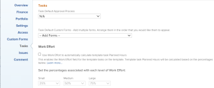

# 프로젝트 템플릿 편집

<!-- Audited: 7/2025 -->

<!--The Resource Pools part also duplicates in the "Working with Resource Pools" article-->

<!--

 

The highlighted information on this page refers to functionality not yet generally available. It is available only in the Preview environment for all customers. The same features will also be available in the Production environment for all customers after a week from the Preview release.      

For more information, see [Interface modernization](/help/quicksilver/product-announcements/product-releases/interface-modernization/interface-modernization.md).  

 

-->

프로젝트 템플릿을 편집하여 향후 프로젝트의 프로세스 및 설정 변경 사항을 반영할 수 있습니다.

템플릿에 변경 사항을 업데이트하고 저장한 후 템플릿을 사용하여 프로젝트를 만들 때 새 프로젝트에 새 변경 사항이 표시됩니다.

템플릿에서 변경한 내용은 현재 해당 템플릿을 사용하고 있는 프로젝트에 반영되지 않습니다.

한 번에 한 개의 템플릿을 편집하거나, 템플릿을 일괄적으로 편집할 수 있습니다.

## 액세스 요구 사항

+++ 를 확장하여 액세스 요구 사항을 확인합니다.

<table style="table-layout:auto"> 
 <col> 
 <col> 
 <tbody> 
  <tr> 
   <td role="rowheader">Adobe Workfront 플랜</td> 
   <td> 
임의 
 </td> 
  </tr> 
  <tr> 
   <td role="rowheader">Adobe Workfront 라이센스*</td> 
   <td>
      
새로운 기능: 표준

      
또는

      
현재: 플랜

   </td> 
  </tr> 
  <tr> 
   <td role="rowheader">액세스 수준</td> 
   <td> 
템플릿에 대한 액세스 편집
 </td> 
  </tr> 
  <tr> 
   <td role="rowheader">개체 권한</td> 
   <td> 
    <ul> 
     <li> 
템플릿 세부 정보 탭에서 템플릿을 편집할 수 있는 권한을 템플릿에 제공
 </li> 
     <li> 
템플릿 편집 상자에서 편집할 템플릿에 대한 권한을 관리합니다.
 </li> 
   </td> 
  </tr> 
 </tbody> 
</table>

*이 표의 정보에 대한 자세한 내용은 [Workfront 설명서의 액세스 요구 사항](/help/quicksilver/administration-and-setup/add-users/access-levels-and-object-permissions/access-level-requirements-in-documentation.md)을 참조하십시오.

+++

## 템플릿 편집 {#edit-a-template}

1. 편집할 템플릿으로 이동합니다.
1. (조건부) 템플릿에 대한 제한된 정보를 편집하려면 왼쪽 패널에서 **템플릿 세부 정보**&#x200B;를 클릭한 다음 왼쪽 패널에 나열된 영역으로 이동하여 각 영역에 대한 정보를 편집합니다.
1. 세부 정보 섹션의 정보를 편집하려면 **편집** 아이콘 을 클릭한 다음 아래 영역에서 선택하거나 **모두 편집**&#x200B;을 클릭하여 모든 영역의 정보를 편집하십시오.

   * 개요
   * 사용자 정의 양식

   세관 양식의 이름은 객체에 첨부된 사용자 정의 양식이 있는 경우에만 표시됩니다.

   * 재무

   >[!TIP]
   >
   >세부 정보 영역에 표시되는 모든 필드에 대한 자세한 내용은 아래의 템플릿 편집 상자를 사용하여 모든 필드 편집을 계속하십시오.

1. (조건부) 템플릿에 대한 모든 정보를 편집하려면 템플릿 이름 옆에 있는 **자세히** 메뉴 을 클릭한 다음 **편집**&#x200B;을 클릭합니다.

   **템플릿 편집** 상자가 열립니다. 이 상자의 섹션에는 템플릿 세부 정보 섹션에서 사용할 수 있는 필드와 추가 필드가 포함되어 있습니다.

1. 다음 섹션에서 정보 편집을 고려하십시오.

   * [템플릿 이름](#template-name)
   * [개요](#overview-preview)
   * [재무](#finance-preview)
   * [사용자 정의 양식](#custom-forms-preview)
   * [템플릿 설정](#template-settings)
   * [작업 설정](#task-settings)
   * [문제 설정](#issue-settings)
   * [액세스](#access-preview)
   * [댓글](#comment)
   <!--* [Linked folders](#linked-folders-conditional-availability) -->

### 템플릿 이름{#template-name}

1. 위에서 설명한 대로 템플릿 편집을 시작합니다.
1. **템플릿 편집** 상자에서 **템플릿 이름**&#x200B;을 클릭합니다.
1. 템플릿 이름을 업데이트하거나 바꿉니다.
1. (선택 사항) 수정할 정보에 따라 다음 섹션을 계속 편집합니다

   또는

   **저장**&#x200B;을 클릭합니다.

### 개요 {#overview-preview}

1. 위에서 설명한 대로 템플릿 편집을 시작합니다.
1. **템플릿 편집** 상자에서 **개요**&#x200B;를 클릭합니다.

   

1. 다음 필드를 업데이트합니다.

   <table style="table-layout:auto"> 
       <col> 
       <col> 
       <tbody> 
         <tr> 
         <td role="rowheader"><strong>설명</strong></td> 
         <td>템플릿에 대한 추가 정보를 추가합니다.</td> 
       </tr> 
         <tr> 
         <td role="rowheader"><strong>우선순위</strong></td> 
         <td>
이는 향후 프로젝트에 우선 순위를 지정할 수 있도록 해 주는 시각적 플래그일 뿐입니다. 다음 옵션 중에서 선택합니다.
 
         <ul> 
         <li>
<strong>없음</strong>
</li> 
         <li>
<strong>낮음</strong>
</li> 
         <li>
<strong>일반</strong>
</li> 
         <li>
<strong>높음</strong>
</li> 
         <li>
<strong>긴급</strong>
</li> 
         </ul>

Workfront 관리자가 선택한 프로젝트 환경 설정에 따라 우선순위 이름이 다를 수 있습니다. 우선 순위 편집에 대한 자세한 내용은 <a href="../../../administration-and-setup/customize-workfront/creating-custom-status-and-priority-labels/create-customize-priorities.md" class="MCXref xref">우선 순위 만들기 및 사용자 지정</a>을 참조하십시오.

</td> 
       </tr> 
       <tr> 
       <td role="rowheader"><strong>URL</strong></td> 
         <td>이 템플릿에 대한 정보와 관련된 웹 링크를 지정합니다.</td> 
       </tr>
<tr> 
      <td role="rowheader"><strong>활성화됨</strong></td> 
      <td>
템플릿을 활성화하려면 이 옵션을 설정합니다. 다른 사용자는 프로젝트를 만들 때 이 템플릿을 찾아 프로젝트에 첨부할 수 있습니다. 더 이상 사용되지 않는 템플릿을 비활성화하려면 옵션을 끕니다. 비활성화된 템플릿은 프로젝트에 첨부할 수 없습니다. 이 기능은 기본적으로 활성화되어 있습니다. 

<b>팁</b>

이 문서의 "템플릿 활성화 또는 비활성화" 섹션에 설명된 대로 템플릿 헤더에서 템플릿을 비활성화할 수 있습니다.
</td> 
     </tr>

<tr> 
<td role="rowheader"><strong>상태 유형</strong></td> 
   <td>
다음 조건 유형 중에서 선택합니다.
 
   <ul> 
   <li><strong>수동:</strong> 프로젝트 소유자가 프로젝트의 상태를 수동으로 설정합니다. <strong></strong></li> 
   <li><strong>진행 상태:</strong> Workfront은 중요 경로에 있는 작업의 진행 상태를 기반으로 향후 프로젝트의 상태를 자동으로 설정합니다. 진행 상태를 이해하는 방법에 대한 자세한 내용은 <a href="../../../manage-work/tasks/task-information/task-progress-status.md" class="MCXref xref">작업 진행 상태 개요</a>를 참조하십시오.</li> 
   </ul>
   </td> 
   </tr> 
   <tr> 
   <td role="rowheader"><strong>일정 모드</strong></td> 
   <td>
이 템플릿을 사용하는 프로젝트를 <strong>시작 날짜</strong>부터 예약할지 또는 <strong>완료 날짜</strong>부터 예약할지 여부를 지정하십시오. 이 옵션을 선택하면 이 템플릿을 사용하여 프로젝트에 대한 향후 작업의 계획된 일자가 결정됩니다. 

다음 중에서 선택합니다. 
 
   <ul> 
   <li>
<strong>시작 날짜부터 예약</strong>: 템플릿의 시작 날짜가 실제로 시작 날짜입니다. 시작 날짜부터 템플릿을 예약하면 Adobe Workfront은 모든 템플릿 작업의 기간을 기반으로 템플릿의 완료 날짜를 계산합니다. 템플릿의 시작 날짜가 미래 프로젝트의 계획된 시작 날짜가 됩니다.
</li> 
   <li>
<strong>완료 날짜부터 일정</strong>: 템플릿의 완료 날짜는 실제로 완료 날짜입니다. 완료 날짜부터 템플릿을 예약하면 Workfront은 모든 템플릿 작업의 기간을 기반으로 템플릿의 시작 날짜를 계산합니다. 템플릿의 완료 일자가 미래 프로젝트의 계획된 완료 일자가 됩니다. 
</li> 
   </ul>
템플릿 작업의 시작 및 완료 일수에 대한 자세한 내용은 <a href="../../../manage-work/projects/create-and-manage-templates/overview-of-start-completion-day-on-template.md" class="MCXref xref">템플릿의 시작 및 완료 일수 개요</a>를 참조하십시오. 

템플릿에 대한 일정 시작 설정은 프로젝트의 일정과 유사합니다. Workfront 관리자는 시스템의 프로젝트에 대해 기본 일정 출처 설정을 선택합니다. 프로젝트 기본값 설정에 대한 자세한 내용은 <a href="../../../administration-and-setup/set-up-workfront/configure-system-defaults/set-project-preferences.md" class="MCXref xref">시스템 차원의 프로젝트 환경 설정 구성</a>을 참조하십시오.
</td> 
   </tr>

<tr> 
   <td role="rowheader"><strong>포트폴리오</strong></td> 
   <td>
이 템플릿에서 만드는 프로젝트에 대한 Portfolio을 지정하십시오. 드롭다운 목록에 표시되기 전에 먼저 Portfolio을 만들어야 합니다. 

활성 포트폴리오만 목록에 표시됩니다. 포트폴리오 만들기에 대한 자세한 내용은 <a href="../../../manage-work/portfolios/create-and-manage-portfolios/create-portfolios.md" class="MCXref xref">포트폴리오 만들기 </a>를 참조하십시오.
</td> 
   </tr> 
   <tr> 
   <td role="rowheader"><strong>프로그램</strong></td> 
   <td>
템플릿에 대해 Portfolio을 선택한 경우 향후 프로젝트에 대해 <strong>프로그램</strong>을(를) 지정하십시오. 일부 포트폴리오에는 프로그램이 없을 수 있습니다. 이 드롭다운 목록에 표시되기 전에 먼저 프로그램을 만들어야 합니다. 활성 프로그램만 목록에 표시됩니다.

프로그램 만들기에 대한 자세한 내용은 <a href="../../../manage-work/portfolios/create-and-manage-programs/create-program.md" class="MCXref xref">프로그램 만들기</a>를 참조하십시오.
</td> 
   </tr>  
   <tr data-mc-conditions="QuicksilverOrClassic.Quicksilver"> 
   <td role="rowheader"><strong>그룹</strong></td> 
   <td>
드롭다운 목록에서 템플릿에서 만든 프로젝트와 연결할 그룹을 선택합니다. 모든 수준의 그룹일 수 있습니다. 

마우스로 가리키고 그 옆에 표시되는 정보 아이콘 을(를) 클릭하여 올바른 그룹을 선택하고 있는지 확인할 수 있습니다. 그룹 및 해당 관리자의 상위 그룹 계층과 같은 그룹에 대한 정보를 나열하는 도구 설명이 표시됩니다.
 
<b>참고</b>

<ul> 
   <li>
그룹의 페이지에 있는 프로젝트 영역에서, 그룹이 선택되지 않은 템플릿을 사용하여 프로젝트를 만들 경우, 시스템은 현재 열려 있는 그룹을 프로젝트와 연결합니다.

이는 사용자가 그룹을 선택하지 않은 템플릿을 사용하여 프로젝트를 만들 때 사용자의 홈 그룹을 프로젝트와 연결하는 다른 영역과는 다릅니다.
</li> 
   <li>
프로젝트를 생성하거나 작업 또는 문제를 프로젝트로 전환하는 동안 그룹이 선택된 템플릿을 선택하면 프로젝트에 대해 다른 그룹을 선택할 수 있습니다.
</li> 
   <li>이 필드는 새로운 Adobe Workfront 환경의 템플릿에서만 사용할 수 있지만, 목록과 보고서 모두에서 볼 수 있습니다(Adobe Workfront Classic). </li> 
   </ul> 
</td> 
   </tr> 
   <tr> 
   <td role="rowheader"><strong>회사</strong></td> 
   <td>
템플릿에 연결할 회사를 지정합니다. 활성 회사만 목록에 표시됩니다.
</td> 
   </tr> 
   <tr> 
   <td role="rowheader"><strong>템플릿 소유자</strong></td> 
   <td>
템플릿 소유자로 지정된 사용자는 Workfront 활성 사용자여야 합니다. 

템플릿 소유자로 지정된 사용자에 대해 다음 사항을 고려하십시오. 
 
   <ul> 
   <li>이 사용자에게는 템플릿에 대한 관리 권한이 자동으로 부여됩니다. </li> 
   <li>프로젝트 팀에 추가되고 템플릿에서 만든 프로젝트에 대한 관리 권한이 자동으로 부여됩니다. </li> 
   <li>이 템플릿에서 프로젝트를 만들 때 프로젝트 소유자가 됩니다. </li> 
   <li> 템플릿 소유자로 지정된 사용자의 액세스 수준에서 템플릿 또는 프로젝트에 대한 액세스가 제한된 경우 템플릿 및 프로젝트에 대한 관리 권한이 제한됩니다. 예를 들어, 액세스 수준의 템플릿 또는 프로젝트에 대한 보기 액세스만 있는 경우 템플릿 소유자로 지정되면 템플릿 및 프로젝트에 대한 보기 권한을 자동으로 수신하게 됩니다.</li>
   </ul></td> 
   </tr> 
   <tr> 
   <td role="rowheader"><strong>템플릿 스폰서</strong></td> 
   <td>
템플릿을 프로젝트에 추가하면 이 필드에 지정된 사용자가 프로젝트 스폰서가 됩니다. 이 사용자는 프로젝트 팀에 추가되고 프로젝트에 대한 보기 권한이 자동으로 부여됩니다. 템플릿 스폰서로 지정된 사용자는 Workfront 활성 사용자여야 합니다. 
</td> 
   </tr> 
   <tr> 
   <td role="rowheader"><strong>리소스 관리자</strong></td> 
   <td>
지정된 사용자에게는 향후 프로젝트에 대한 관리 권한이 자동으로 부여되고 프로젝트의 작업 및 문제에 리소스를 할당할 수 있습니다. 리소스 관리자를 두 개 이상 지정할 수 있습니다. 
</td> 
   </tr> 
</table>

1. (선택 사항) 수정할 정보에 따라 다음 섹션을 계속 편집합니다.

   또는

   **저장**&#x200B;을 클릭합니다.

### 재무 {#finance-preview}

1. 위에서 설명한 대로 템플릿 편집을 시작합니다.
1. **템플릿 편집** 상자에서 **재무**&#x200B;을 클릭합니다.

   

1. 다음 필드를 업데이트합니다.

   <table style="table-layout:auto"> 
       <col> 
       <col> 
       <tbody>
       <tr> 
         <td role="rowheader"><strong> 통화</strong></td> 
         <td>
향후 프로젝트의 통화가 시스템의 기본 통화와 다른 경우 통화를 지정합니다. 시스템에 기본 통화만 있는 경우에는 이 필드가 표시되지 않습니다. 통화에 대한 자세한 내용은 <a href="../../../administration-and-setup/manage-workfront/exchange-rates/set-up-exchange-rates.md" class="MCXref xref">환율 설정</a>을 참조하세요.
</td> 
       </tr>
       <tr> 
       <td role="rowheader"><strong>예산</strong></td> 
       <td>
이 템플릿에서 생성된 프로젝트에 대한 예산을 지정합니다.
</td> 
       </tr>  
       <tr> 
         <td role="rowheader"><strong>성과 지수 방법</strong></td> 
         <td>
Workfront에서 향후 프로젝트의 획득가치 지표를 계산하는 방법을 선택합니다. 다음 중에서 선택하십시오.
         <ul>
         <li>시간 기반</li>
         <li>비용 기반</li>
         </ul>

   성능 인덱스 메서드에 대한 자세한 내용은 <a href="../../../manage-work/projects/project-finances/set-pim.md" class="MCXref xref">PIM(성능 인덱스 메서드) 설정</a>을 참조하십시오. 
</td>
   </tr> 
         <tr> 
         <td role="rowheader"><strong>계획된 이익</strong></td> 
         <td>
이 템플릿에서 만든 프로젝트의 계획된 이점을 지정하십시오. 계획된 혜택은 프로젝트 및 Portfolio Optimizer의 비즈니스 사례에 사용됩니다. 

프로젝트의 계획된 편익에 대한 자세한 내용은 <a href="../../../manage-work/projects/project-finances/project-planned-benefit.md" class="MCXref xref">프로젝트 계획된 편익 개요</a>를 참조하십시오. 프로젝트의 순 가치 계산 시 프로젝트의 계획된 이익이 고려됩니다. 

Portfolio Optimizer 사용에 대한 자세한 내용은 <a href="../../../manage-work/portfolios/portfolio-optimizer/manage-projects-in-portfolio-optimizer.md" class="MCXref xref">Portfolio Optimizer에서 프로젝트 관리</a>를 참조하세요. 
</td> 
       </tr> 
       <tr> 
         <td role="rowheader"><strong>고정 비용</strong></td> 
         <td>
이 템플릿에서 만드는 프로젝트의 고정 비용을 지정합니다. 이는 프로젝트의 시간에 따라 발생하는 인건비와 프로젝트의 경비 금액에 따라 발생하는 경비가 다릅니다. 프로젝트의 고정 비용은 프로젝트의 순 가치를 계산할 때 고려되며 예산 비용의 일부입니다.
</td> 
       </tr> 
       <tr> 
       <td role="rowheader"><strong>고정 수입</strong></td> 
       <td>
이 템플릿에서 만드는 프로젝트의 고정 수익을 지정합니다.
</td> 
       </tr> 
       <tr> 
       <td role="rowheader"><strong>이 프로젝트를 승인할 시간 필요</strong></td> 
       <td>
이 템플릿에서 만든 향후 프로젝트의 프로젝트 소유자가 프로젝트에 로그온한 시간을 승인하도록 하려면 이 옵션을 선택하십시오. 청구 기록을 사용하고 이 옵션을 선택하는 경우 프로젝트의 승인된 시간만 청구 기록의 사용 가능한 청구 가능 시간으로 표시됩니다. 프로젝트 시간 승인은 타임시트 승인과 독립적입니다. 프로젝트 승인 시간 요구에 대한 자세한 내용은 <a href="../../../manage-work/projects/manage-projects/require-time-approval-for-projects.md" class="MCXref xref">프로젝트 승인 시간 필요</a>를 참조하십시오.
</td> 
       </tr> 
       </tbody> 
      </table>

1. (선택 사항) 수정할 정보에 따라 다음 섹션을 계속 편집합니다.

   또는

   **저장**&#x200B;을 클릭합니다.

### 사용자 정의 양식 {#custom-forms-preview}

1. 위에서 설명한 대로 템플릿 편집을 시작합니다.
1. **템플릿 편집** 상자에서 **사용자 지정 Forms**&#x200B;을 클릭합니다.

   

   템플릿에 이미 첨부된 사용자 정의 양식의 이름이 왼쪽 패널에 표시됩니다.

1. **사용자 정의 양식 추가** 필드 내부를 클릭하고 템플릿과 연결할 사용자 정의 양식을 선택합니다. 이 필드에서 사용자 정의 양식을 선택하려면 먼저 사용자 정의 양식을 작성해야 합니다.

   활성 사용자 정의 양식만 목록에 표시됩니다. 사용자 정의 양식 작성에 대한 자세한 내용은 [사용자 정의 양식 만들기](/help/quicksilver/administration-and-setup/customize-workfront/create-manage-custom-forms/form-designer/design-a-form/design-a-form.md)를 참조하십시오.

   템플릿에 최대 10개의 사용자 정의 양식을 추가할 수 있습니다.

   양식이 이 템플릿에서 만든 프로젝트에 추가됩니다.

1. (선택 사항) 사용자 정의 양식의 모든 필드에서 정보를 업데이트합니다. 정보는 템플릿에서 만들 프로젝트로 전송됩니다.

1. (선택 사항) 사용자 정의 양식 이름의 오른쪽에 있는 **x** 아이콘을 클릭한 다음 **제거**&#x200B;를 클릭하여 템플릿에서 제거합니다.

1. (선택 사항) 수정할 정보에 따라 다음 섹션을 계속 편집합니다.

   또는

   **저장**&#x200B;을 클릭합니다.

### 템플릿 설정 {#template-settings}

1. 위에서 설명한 대로 템플릿 편집을 시작합니다.
1. **템플릿 편집** 상자에서 **프로젝트 설정**&#x200B;을 클릭합니다.

   

1. 다음 필드를 업데이트합니다.

   <table style="table-layout:auto"> 
       <col> 
       <col> 
       <tbody> 
       <tr> 
       <td role="rowheader"><strong>마일스톤 경로</strong> </td> 
       <td> 
템플릿에 대한 마일스톤 경로를 선택합니다. 활성 마일스톤 경로만 목록에 표시됩니다. 마일스톤 경로에 대한 자세한 내용은 <a href="../../../administration-and-setup/customize-workfront/configure-approval-milestone-processes/create-milestone-path.md" class="MCXref xref">마일스톤 경로 만들기</a>를 참조하세요.
 </td> 
       </tr> 
       <tr> 
         <td role="rowheader"><strong>완료 모드</strong> </td> 
         <td> 
향후 프로젝트가 완료로 표시되는 방식을 제어합니다.  다음 옵션 중에서 선택합니다.
 
         <ul> 
         <li> 
<strong>자동</strong>: 모든 작업 및 문제가 완료되면 프로젝트가 완료됨으로 표시됩니다.
 </li> 
         <li> 
<strong>수동</strong>: 모든 작업 및 문제가 완료되면 프로젝트의 완료 상태를 수동으로 선택해야 합니다. 
 </li> 
         </ul> </td> 
       </tr> 
       <tr> 
       <td role="rowheader"><strong>요약 완료 모드</strong> </td> 
       <td> 
향후 프로젝트의 상위 작업이 완료로 표시되는 방식을 제어합니다.  다음 옵션 중에서 선택합니다.
 
       <ul> 
       <li> 
<strong>자동</strong>: 하위 작업이 완료되고 하위 작업의 완료율이 업데이트됨에 따라 상위 작업이 완료됨으로 표시되고 완료율이 자동으로 업데이트됩니다. 
 </li> 
       <li> 
<strong>수동</strong>: 하위 작업의 변경 내용과 관계없이 완료율 및 상위 작업의 상태를 수동으로 업데이트해야 합니다. 
 </li> 
       </ul> </td> 
       </tr> 
       <tr> 
         <td role="rowheader"><strong>업데이트 형식</strong> </td> 
         <td> 
향후 프로젝트의 타임라인에 대한 변경 사항이 프로젝트에 저장되는 시점을 제어합니다. 
 
         <b>예 </b> 
         
프로젝트에 대한 다음 변경 사항은 프로젝트의 타임라인에 대한 업데이트를 트리거합니다.
 
         <ul> 
         <li> 
작업 날짜 업데이트
 </li> 
         <li> 
전임 작업 관계 변경 
 </li> 
         <li> 
상위-하위 관계 변경
 </li> 
         <li> 
작업 제한 또는 기간 유형을 변경하는 것 외에 할당을 추가하거나 제거합니다.
 </li> 
         </ul> 
         
 
다음 옵션 중에서 선택합니다. 
 
         <ul> 
         <li> 
<strong>자동 및 변경 시</strong>(기본 설정): 프로젝트 또는 타임라인이 종속된 다른 프로젝트에서 변경(변경 시)이 발생할 때마다 향후 프로젝트 타임라인이 업데이트됩니다. 프로젝트 타임라인은 매일 밤 자동 업데이트됩니다. 이 설정은 프로젝트 타임라인이 항상 최신 상태이므로 이 필드에 권장되는 설정입니다. 타임라인 재계산을 트리거하는 작업 또는 프로젝트에 작업을 수행하면 사용 가능한 모든 날짜가 즉시 표시되어 작업을 계속할 수 있습니다. 작업이 100개를 초과하는 프로젝트의 경우 더 긴 재계산이 필요한 날짜가 물음표로 짧게 표시됩니다(1초에서 5초 사이 또는 큰 프로젝트의 경우 최대 1분). 이는 재계산이 아직 완료되지 않았으며, 날짜가 변경될 수 있음을 나타냅니다. 
 </li> 
         </ul> 
         <ul> 
         <li> 
<strong>변경 전용</strong>: 프로젝트 또는 타임라인이 종속된 다른 프로젝트에서 변경 사항이 발생할 때마다 프로젝트 타임라인이 업데이트됩니다. 프로젝트 또는 타임라인이 종속된 다른 프로젝트에서 변경 사항이 거의 발생하지 않는 경우 이 옵션을 선택할 수 있습니다. 
 </li> 
         </ul> 
         <ul> 
         <li> 
<strong>자동만</strong>: 프로젝트 타임라인은 매일 밤 업데이트되며 변경 후 바로 업데이트되지 않습니다. 프로젝트 또는 타임라인이 종속되어 있는 다른 프로젝트에서 매일 많은 변경 내용이 발생하는 경우 이 옵션을 선택할 수 있습니다. 그러나 프로젝트가 변경과 동시에 업데이트되지 않으므로 이 설정을 선택했다는 점에 유의하십시오. 
 </li> 
         </ul> 
         <ul> 
         <li> 
<strong>수동 전용</strong>: <a href="../../../manage-work/projects/manage-projects/recalculate-project-timeline.md" class="MCXref xref">프로젝트 타임라인 다시 계산</a>에 설명된 대로 타임라인을 다시 계산하는 옵션을 선택하는 경우에만 프로젝트 타임라인이 업데이트됩니다. 
 </li> 
         </ul> 
한 번에 프로젝트를 여러 번 변경하고, 각 개별 변경 내용이 아닌 모든 변경 내용이 적용된 후에 타임라인 재계산을 수행하려는 경우 이 옵션을 선택할 수 있습니다.
 </td> 
       </tr> 
       <tr> 
         <td role="rowheader"><strong>예약</strong> </td> 
         <td> 
템플릿에 대한 일정을 선택합니다. 이 일정이 이 템플릿에서 만드는 프로젝트의 일정이 됩니다. 프로젝트에서 작업 중인 대부분의 사람에게 할당된 일정과 동일해야 합니다. 일정을 템플릿에 할당하려면 먼저 일정을 만들어야 합니다. 일정 만들기에 대한 자세한 내용은 <a href="../../../administration-and-setup/set-up-workfront/configure-timesheets-schedules/create-schedules.md" class="MCXref xref">일정 만들기</a>를 참조하세요.  시스템에서 사용자 지정 일정을 만들지 않은 경우 [기본 일정]이 선택됩니다. 
 </td> 
       </tr> 
       <tr> 
         <td role="rowheader"><strong>사용자 휴무</strong> </td> 
         <td> 
작업의 기본 피할당자의 휴무 시간이 작업 계획 날짜를 조정하는지 여부를 결정합니다. 기존 프로젝트에 템플릿을 첨부할 때 템플릿에 프로젝트와 다른 이 필드 설정이 있는 경우 프로젝트의 설정이 변경되지 않습니다. 새 템플릿에 대한 이 설정의 기본 옵션은 시스템 수준 프로젝트 환경 설정과 동일합니다. 
 
시스템 수준의 프로젝트 환경 설정에 대한 자세한 내용은 <a href="../../../administration-and-setup/set-up-workfront/configure-system-defaults/set-project-preferences.md" class="MCXref xref">시스템 차원의 프로젝트 환경 설정 구성</a>을 참조하십시오. 
 
이 설정이 프로젝트의 작업 날짜에 미치는 영향에 대한 자세한 내용은 <a href="../../../manage-work/projects/manage-projects/edit-projects.md" class="MCXref xref">프로젝트 편집</a>을 참조하세요. 다음 옵션 중에서 선택합니다. 
 
         <ul> 
         <li> 
<strong>작업 기간에서 사용자 휴무를 고려하십시오</strong>: 이 옵션을 선택할 때 작업 기간 동안 휴무가 발생할 경우 이 템플릿에서 만든 프로젝트의 작업의 계획된 날짜가 작업의 기본 피할당자의 휴무에 따라 조정됩니다. 
 </li> 
         <li> 
<strong>작업 기간에서 사용자 휴무 무시</strong>: 이 옵션을 선택하면 작업의 기본 피할당자가 작업 기간 동안 휴무하더라도 이 템플릿에서 만든 프로젝트의 작업의 계획된 날짜가 원래 계획대로 유지됩니다. 
 </li> 
         </ul> </td> 
       </tr> 
       <tr> 
         <td role="rowheader"><strong>리소스 레벨링 모드</strong> </td> 
         <td> 
다음 옵션 중에서 선택합니다. 
 
         <ul> 
         <li> 
<strong>수동</strong>: 이 템플릿으로 만든 프로젝트에서 리소스를 수동으로 레벨링해야 합니다(기본 설정임).
 </li> 
         <li> 
<strong>자동:</strong> Workfront은 향후 프로젝트에서 리소스를 레벨링합니다.  리소스 레벨링에 대한 자세한 내용은 간트 차트 <a href="../../../manage-work/gantt-chart/use-the-gantt-chart/level-resources-in-gantt.md" class="MCXref xref">에서 </a>리소스 레벨링을 참조하십시오. 
 </li> 
         </ul> </td> 
       </tr> 
       <tr> 
         <td role="rowheader"><strong>위험</strong> </td> 
         <td> 
이 템플릿으로 만든 프로젝트의 위험 수준을 정의합니다. 위험은 프로젝트가 얼마나 위험할 수 있는지를 나타내는 지표일 뿐이다. 위험 수준에 따라 프로젝트 실행의 우선 순위를 지정할 수 있습니다. 다음 위험 수준 중에서 선택하는 것이 좋습니다. 
 
         <ul> 
         <li> 
<strong>매우 낮음</strong> 
 </li> 
         <li> 
<strong>낮음</strong> 
 </li> 
         <li> 
<strong>Medium</strong> 
 </li> 
         <li> 
<strong>높음</strong> 
 </li> 
         <li> 
<strong>매우 높음</strong> 
 </li> 
         </ul> </td> 
       </tr> 
       <tr> 
         <td role="rowheader"><strong>리소스 풀</strong> </td> 
         <td> 
템플릿과 연결된 리소스 풀을 지정합니다. 리소스 풀은 프로젝트 완료에 동시에 필요한 사용자 컬렉션입니다. 리소스 풀에 대한 자세한 내용은 <a href="../../../resource-mgmt/resource-planning/resource-pools/work-with-resource-pools.md" class="MCXref xref"> 리소스 풀 개요 </a>을(를) 참조하십시오.
 
 
<b>메모</b>

   템플릿을 일괄 편집할 때 선택한 모든 템플릿에 공통되는 리소스 풀만 이 필드에 나타납니다. 선택한 템플릿에 공유 리소스 풀이 없는 경우 이 필드는 비어 있습니다. 여기에서 지정한 리소스 풀은 템플릿의 개별 리소스 풀을 덮어씁니다.
 
 </td>
   </tr>

   <tr> 
      <td role="rowheader"><strong>이 프로젝트를 승인할 시간 필요</strong></td>

<td>
이 템플릿에서 만든 프로젝트의 미래 프로젝트 소유자가 프로젝트에 로그온한 시간을 승인하도록 하려면 이 옵션을 선택하십시오.
 
   
청구 기록을 사용하고 이 옵션을 선택하는 경우 프로젝트의 승인된 시간만 청구 기록의 사용 가능한 청구 가능 시간으로 표시됩니다. 

   
프로젝트 시간 승인은 타임시트 승인과 독립적입니다. 프로젝트 승인 시간 요구에 대한 자세한 내용은 <a href="../../../manage-work/projects/manage-projects/require-time-approval-for-projects.md" class="MCXref xref">프로젝트 승인 시간 필요</a>를 참조하십시오.

   </td> 
   </tr> 
   <tr> 
   <td role="rowheader"><strong>시간 유형 필터링</strong> </td> 
   <td> 
다음 사항을 고려하십시오.
 
향후 프로젝트에서 모든 프로젝트별 시간 유형을 사용할 수 있도록 하려면 <strong>아니요</strong>를 선택하십시오. (기본 선택 사항입니다.)
 
또는
 
<strong>예</strong>를 선택하여 향후 프로젝트에서 프로젝트별 시간 형식의 하위 집합만 사용할 수 있도록 한 다음 사용할 시간 형식을 선택하십시오. (Shift 키를 누른 상태로 여러 시간 유형을 선택합니다.)
 
이 옵션을 선택하면 프로젝트(또는 프로젝트 내의 작업 및 문제)에 시간을 기록할 때 선택한 시간 유형만 선택할 수 있습니다. 최소 1개의 시간 유형을 선택해야 합니다. 이 옵션을 선택하고 시간 유형을 선택하지 않으면 프로젝트에서 모든 시간 유형을 사용할 수 있습니다.
 
사용자가 프로젝트에서 이러한 시간 유형 옵션을 보려면 개별 사용자 수준에서 동일한 시간 유형을 선택해야 합니다. 
 
사용자 수준에서 시간 유형을 정의하는 방법에 대한 자세한 내용은 <a href="../../../timesheets/create-and-manage-timesheets/log-time.md#understa" class="MCXref xref">로그 시간</a>의 <a href="../../../timesheets/create-and-manage-timesheets/log-time.md" class="MCXref xref">로그 시간</a> 섹션을 참조하십시오.
 </td> 
   </tr> 
   <tr> 
   <td role="rowheader"><strong>미리 알림</strong> </td> 
   <td>향후 프로젝트와 연계해야 하는 미리 알림 을 선택합니다. 템플릿을 편집하는 동안 이 필드에 대한 프로젝트가 표시되도록 미리 알림을 구성해야 합니다.  미리 알림 구성에 대한 자세한 내용은 <a href="../../../administration-and-setup/manage-workfront/emails/set-up-reminder-notifications.md" class="MCXref xref">미리 알림 설정</a>을 참조하세요.</td> 
   </tr>
   <tr> 
   <td role="rowheader"><strong>승인 프로세스</strong> </td> 
   <td> 
템플릿에 연결할 승인 프로세스를 선택합니다. Workfront 관리자 또는 승인 프로세스에 대한 관리 액세스 권한이 있는 사용자는 시스템 수준 또는 그룹 수준 프로젝트 승인 프로세스를 정의해야 템플릿과 연결할 수 있습니다. 승인 프로세스 만들기에 대한 자세한 내용은 <a href="../../../administration-and-setup/customize-workfront/configure-approval-milestone-processes/create-approval-processes.md" class="MCXref xref">작업 항목에 대한 승인 프로세스 만들기</a>를 참조하십시오.
 
승인 프로세스를 추가할 때는 다음 사항을 고려하십시오. 
 
   <ul> 
   <li>활성 승인 프로세스만 목록에 표시됩니다. </li> 
   <li> 
시스템 전체 및 그룹별 승인 프로세스가 목록에 표시됩니다. 템플릿 그룹 이외의 그룹과 연결된 승인 프로세스가 목록에 표시되지 않습니다.
 
<b>중요 사항</b>

템플릿에 연결된 그룹이 변경되면 그룹별 승인 프로세스가 일회용 승인 프로세스가 됩니다. 프로젝트 그룹 변경 또는 승인 프로세스 변경 내용이 승인 설정에 미치는 영향에 대한 자세한 내용은 <a href="../../../administration-and-setup/customize-workfront/configure-approval-milestone-processes/how-changes-affect-group-approvals.md">그룹 및 승인 프로세스 변경 내용이 할당된 승인 프로세스에 미치는 영향</a>을 참조하십시오. 
 </li>
<li> 
일회용 승인 프로세스를 추가한 경우 이 필드에 "사용자 지정"으로 표시됩니다. 자세한 내용은 <a href="../../../review-and-approve-work/manage-approvals/associate-approval-with-work.md" class="MCXref xref">새 승인 프로세스나 기존 승인 프로세스를 작업과 연결</a>을 참조하십시오. 
 
      </li> 
      <li> 
템플릿을 벌크 편집할 때 다음과 같은 시나리오가 있습니다.
 
      <ul> 
         <li> 
동일한 그룹에서 템플릿을 선택하면 시스템 레벨 및 그룹 레벨 승인 프로세스가 모두 이 필드에 표시됩니다.
 </li> 
         <li> 
다른 그룹에서 템플릿을 선택하면 이 필드에는 시스템 수준 승인 프로세스만 표시됩니다.
 </li> 
         <li> 
템플릿에 일회용 승인 프로세스가 첨부되어 있으면 선택한 시스템 수준으로 대체됩니다. 
 </li> 
      </ul> </li> 
      </ul> </td> 
       </tr>  
       </tbody> 
      </table>

1. (선택 사항) 수정할 정보에 따라 다음 섹션을 계속 편집합니다.\
   또는
1. **저장**&#x200B;을 클릭합니다.

### 작업 설정 {#task-settings}

템플릿에서 만든 프로젝트에 새 작업을 추가할 때 모든 새 작업과 연결할 기본값을 정의할 수 있습니다.

이러한 설정이 새 작업 만들기에 미치는 영향에 대한 자세한 내용은 [작업 만들기 개요](../../../manage-work/tasks/create-tasks/create-tasks-overview.md)를 참조하십시오.

1. 위에서 설명한 대로 템플릿 편집을 시작합니다.
1. **템플릿 편집** 상자에서 **작업 설정**&#x200B;을 클릭합니다.

   

1. **작업 기본 승인 프로세스** 상자에서 이 템플릿으로 만든 프로젝트에 새 작업을 추가할 때 모든 새 작업과 연결할 승인 프로세스를 선택합니다. 작업과 연결하려면 먼저 작업에 대한 승인 프로세스를 만들어야 합니다. 활성 승인 프로세스만 목록에 표시됩니다. 승인 프로세스 만들기에 대한 자세한 내용은 [승인 프로세스 만들기](../../../administration-and-setup/customize-workfront/configure-approval-milestone-processes/create-approval-processes.md)를 참조하십시오.
1. **작업 기본 사용자 지정 Forms** 상자에서 이 템플릿으로 만든 프로젝트에 새 작업을 추가할 때 모든 새 작업과 연결할 사용자 지정 양식을 선택합니다. 이 필드에서 사용자 정의 양식을 선택하려면 먼저 사용자 정의 양식을 작성해야 합니다. 활성 사용자 정의 양식만 목록에 표시됩니다. 사용자 정의 양식 작성에 대한 자세한 내용은 [사용자 정의 양식 만들기](/help/quicksilver/administration-and-setup/customize-workfront/create-manage-custom-forms/form-designer/design-a-form/design-a-form.md)를 참조하십시오. 작업에 최대 10개의 사용자 정의 양식을 연결할 수 있습니다.
1. (선택 사항) 템플릿에서 만든 프로젝트에서 계획된 시간 대신 작업 노력을 사용하여 작업 노력을 관리하려면 **작업 노력 사용을 선택하여 작업 계획된 시간을 자동으로 계산합니다**.
1. (조건부 및 선택 사항) 작업 노력 사용을 선택하여 작업 계획 시간을 자동으로 계산하는 경우 드롭다운 메뉴를 눌러 각 작업 노력 레벨에 대한 백분율을 갱신합니다. 다음 백분율 값이 기본값입니다.

   | 작업 노력 수준 | 백분율 값 |
   |---|---|
   | 소형 | 25% |
   | 보통 | 50% |
   | 대형 | 75% |

   프로젝트에서 작업 노력을 관리하는 데 작업 노력을 사용하는 방법에 대한 자세한 내용은 [작업 노력 개요](../../../manage-work/tasks/task-information/work-effort.md)를 참조하십시오.

1. (선택 사항) 수정할 정보에 따라 다음 섹션을 계속 편집합니다.

   또는

   **저장**&#x200B;을 클릭합니다.

### 문제 설정 {#issue-settings}

문제 설정을 편집하면 사용자가 템플릿으로 만든 향후 프로젝트에서 인라인으로 문제를 추가하지 못하도록 할 수 있습니다.

1. 위에서 설명한 대로 템플릿 편집을 시작합니다.
1. **템플릿 편집** 상자에서 **문제 설정**&#x200B;을 클릭합니다.

   

1. (선택 사항) **사용자가 문제를 인라인으로 추가할 수 있도록 허용** 옵션을 선택 취소합니다. 기본적으로 활성화되어 있습니다.

   이 옵션을 비활성화하면 프로젝트를 템플릿에서 만들 때 사용자가 프로젝트 또는 문제 섹션의 작업에 인라인으로 문제를 추가할 수 없습니다.

   >[!TIP]
   >
   >사용자가 새 문제 필드 또는 새 문제와 관련된 사용자 정의 양식을 완료하도록 하려면 이 옵션을 비활성화하십시오.

   이 옵션을 비활성화하면 템플릿에서 만든 프로젝트에 문제를 추가할 수 있는 권한이 있는 사용자는 프로젝트와 연결된 새 문제 버튼 또는 요청 대기열을 사용하여 추가할 수 있습니다.

   프로젝트에서 문제 설정을 구성하는 방법에 대한 자세한 내용은 [프로젝트 편집](../../../manage-work/projects/manage-projects/edit-projects.md#issue) 문서의 [문제 설정](../../../manage-work/projects/manage-projects/edit-projects.md) 섹션을 참조하십시오.

   프로젝트에서 문제를 만드는 방법에 대한 자세한 내용은 [문제 만들기](../../../manage-work/issues/manage-issues/create-issues.md)를 참조하십시오.

1. (선택 사항) 수정할 정보에 따라 다음 섹션을 계속 편집합니다.

   또는

   **저장**&#x200B;을 클릭합니다.

### 액세스 {#access-preview}

1. 위에서 설명한 대로 템플릿 편집을 시작합니다.
1. **템플릿 편집** 상자에서 **액세스**&#x200B;를 클릭합니다.

   

   템플릿에 지정한 액세스 권한은 템플릿을 사용하여 프로젝트를 만들 때 프로젝트와 연결된 사용자의 액세스 권한이 됩니다.

   템플릿에 대해 다음 **액세스** 정보를 지정하십시오.

   <table style="table-layout:auto"> 
       <col> 
       <col> 
       <tbody> 
       <tr> 
         <td role="rowheader"><strong>누군가가 작업에 할당되었을 때</strong> </td> 
         <td> 
작업에 대한 <strong>보기</strong>, <strong>참여,</strong> 또는 <strong>관리</strong> 액세스 권한 중에서 선택하십시오. 작업에 할당된 사용자에게는 작업에 대한 이 액세스 권한이 자동으로 부여됩니다. 
 </td> 
       </tr> 
       <tr> 
         <td role="rowheader"><strong>프로젝트에 대한 액세스 권한도 부여</strong> </td> 
         <td> 
 프로젝트에 대한 <strong>보기</strong>, <strong>기여</strong> 또는 <strong>관리</strong> 액세스 권한 중에서 선택하십시오. 작업에 할당된 사용자에게는 프로젝트에 대한 이 액세스 권한도 자동으로 부여됩니다. 
 </td> 
       </tr> 
       <tr> 
         <td role="rowheader"><strong>누군가 문제에 할당되었을 때</strong> </td> 
         <td> 
문제에 대한 <strong>보기</strong>, <strong>참여,</strong> 또는 <strong>관리</strong> 액세스에서 선택하십시오. 문제에 할당된 사용자에게 문제에 대한 이 액세스 권한이 자동으로 부여됩니다. 
 </td> 
       </tr> 
       <tr> 
         <td role="rowheader"><strong>프로젝트에 대한 액세스 권한도 부여</strong> </td> 
         <td> 
 프로젝트에 대한 <strong>보기</strong>, <strong>기여</strong> 또는 <strong>관리</strong> 액세스 권한 중에서 선택하십시오. 문제에 할당된 사용자에게는 프로젝트에 대한 이 액세스 권한도 자동으로 부여됩니다. 
 </td> 
       </tr> 
       <tr> 
         <td role="rowheader"><strong>누군가 요청을 제출하면 액세스 권한 부여</strong> </td> 
         <td> 
 요청에 대한 <strong>보기</strong>, <strong>기여</strong> 또는 <strong>관리</strong> 액세스 권한 중에서 선택하십시오. 프로젝트에 요청을 제출하면 제출한 요청에 대한 이 액세스 권한이 부여됩니다. 자세한 내용은 <a href="../../../workfront-basics/grant-and-request-access-to-objects/share-an-issue.md" class="MCXref xref">문제 공유 </a>를 참조하십시오.
 </td> 
       </tr> 
       <tr> 
         <td role="rowheader"><strong>같은 회사의 직원들이 모든 요청에 대해 동일한 권한을 상속합니다</strong> </td> 
         <td> 
제출했는지에 관계없이 동일한 회사의 직원들이 프로젝트의 모든 요청에 대해 동일한 액세스 권한을 갖도록 하려면 이 필드를 선택합니다.
 </td> 
       </tr> 
       <tr> 
         <td role="rowheader"><strong>이 프로젝트에 대한 액세스 권한을 다른 사용자에게 부여한 경우: 액세스 권한 부여..</strong> </td> 
         <td> 
프로젝트가 사용자와 공유되는 경우 사용자가 프로젝트에 보유할 액세스 옵션을 선택합니다. 프로젝트를 공유할 때 <strong>뷰어</strong>, <strong>기여자</strong> 또는 <strong>관리자</strong>(으)로 지정된 경우 액세스 옵션을 선택하십시오. 
 </td> 
       </tr> 
       </tbody> 
      </table>

1. (선택 사항) 수정할 정보에 따라 다음 섹션을 계속 편집합니다.

   또는

   **저장**&#x200B;을 클릭합니다.

   이 템플릿에 대한 변경 사항이 제출됩니다.

   이제 이 템플릿을 사용하여 프로젝트를 만들면 이러한 모든 설정이 새 프로젝트로 전송됩니다.

<!--I don't think this note is valid anymore - this note was on Edit project when the section below was in that article, by mistake: 
>[!NOTE]
>
>Because linked folders are created when the project is created, editing the linked folder workflow on an existing project is ineffective. Editing these values when creating a project functions as expected.-->

<!-- This section is here by mistake - it should be maybe in layout templates?? 

### Linked folders (conditional availability) {#linked-folders}

Linked folder functionality automatically creates folders in Adobe Experience Manager Assets, and connects these folders to Workfront. 

This section appears only if all of the following apply:

* Your organization has been migrated to the Adobe Admin Console
* Your organization has enabled and configured an integration with Adobe Experience Manager
* The template has enabled and configured linked folders.

For instructions on editing Linked folders, see [Edit workflow values in a project](/help/quicksilver/documents/adobe-workfront-for-experience-manager-assets-essentials/use-aem-workflows.md#edit-workflow-values-in-a-project) in the article [Use workflows in the Experience Manager Assets integration](/help/quicksilver/documents/adobe-workfront-for-experience-manager-assets-essentials/use-aem-workflows.md).

-->

### 댓글

1. 위에서 설명한 대로 템플릿 편집을 시작합니다.
1. **템플릿 편집** 상자에서 **설명**&#x200B;을 클릭합니다.

   
1. 만들고 있는 업데이트에 대한 댓글을 추가하거나, 추가 사용자에 태그를 지정하거나, **내 회사에 비공개** 상자를 선택하여 회사 내 사용자에 대한 업데이트를 비공개로 유지한 다음 **저장**&#x200B;을 클릭합니다.

## 일괄 템플릿 편집

템플릿을 일괄 편집하고 모든 정보를 동시에 업데이트할 수 있습니다.

<!--
Editing templates in bulk differs depending on which environment you are using. 

### Edit templates in bulk in the Production environment 

*****************and hide the first line below************ -->

템플릿을 일괄적으로 편집하려면 다음을 수행합니다.

{{step1-to-templates}}

1. 목록에서 템플릿을 여러 개 선택합니다.
1. **편집** 아이콘 을 클릭합니다.

   **템플릿 편집** 대화 상자가 열립니다.

   

1. 선택한 모든 템플릿을 편집하려면 왼쪽의 섹션을 클릭합니다.

   템플릿에 대한 정보를 편집하는 방법에 대한 자세한 내용은 이 문서의 [템플릿 편집](#edit-a-template) 섹션을 참조하십시오.

1. 선택한 템플릿의 다음 섹션을 업데이트합니다.

   * 개요
   * 재무
   * 포트폴리오
   * 설정
   * 액세스
   * 사용자 정의 양식
   * 작업
   * 문제
   * 댓글

1. **변경 내용 저장**&#x200B;을 클릭합니다.

   이제 선택한 모든 템플릿에 변경 사항이 모두 표시됩니다.

<!--

### Edit templates in bulk in the Preview environment 

*****************and hide/delete the first line below************

To edit templates in bulk:

{{step1-to-templates}}

1. Select several templates in the list.
1. Click the **Edit** icon .

   The **Edit Templates** dialog box opens.

   

1. Click the sections on the left to edit all selected templates.

   For more information about editing information on templates, see the [Edit a template](#edit-a-template) section in this article.

1. Update the following sections of the selected templates:

   * Overview
   * Custom Forms
   * Finance
   * Template Settings
   * Task Settings
   * Issue Settings
   * Access
   * Comment

1. Click **Save**.

   All changes you made are now visible on all the selected templates.

-->

## 템플릿에 작업 추가

템플릿을 만들고 템플릿 정보를 편집한 후 작업을 추가할 수 있습니다.

템플릿에 작업을 추가하는 것은 프로젝트에 작업을 추가하는 것과 비슷합니다.

프로젝트에 작업을 추가하는 방법에 대한 자세한 내용은 [프로젝트에서 작업 만들기](../../../manage-work/tasks/create-tasks/create-tasks-in-project.md)를 참조하십시오.

템플릿에 작업을 추가하면 템플릿 기간, 템플릿의 시작 및 완료 일수가 그에 따라 변경됩니다. 템플릿 작업의 시작 및 완료 일수에 대한 자세한 내용은 [템플릿의 시작 및 완료 일수 개요](../../../manage-work/projects/create-and-manage-templates/overview-of-start-completion-day-on-template.md)를 참조하십시오.

## 템플릿에 더 많은 항목 추가

템플릿을 만들고 템플릿 정보를 편집한 후 더 많은 항목을 추가할 수 있습니다. 추가한 항목은 템플릿에서 프로젝트를 만들 때 프로젝트에 사용할 수 있습니다.

다음 항목을 템플릿에 추가하는 것은 프로젝트에 추가하는 것과 동일합니다.

* 문서
* 위험

  위험 만들기에 대한 자세한 내용은 [프로젝트에 대한 위험 만들기 및 편집](/help/quicksilver/manage-work/projects/define-a-business-case/create-edit-risks-on-projects.md)을 참조하세요.

* 승인 프로세스

  승인 프로세스를 작업과 연결하는 방법에 대한 자세한 내용은 [새 승인 프로세스 또는 기존 승인 프로세스를 작업과 연결](../../../review-and-approve-work/manage-approvals/associate-approval-with-work.md)을 참조하십시오.

* 결제 요율

  템플릿에 대한 청구 요율을 추가하는 것은 프로젝트에 청구 요율을 추가하는 것과 비슷합니다. 자세한 내용은 [프로젝트 수준에서 작업 역할 청구 요금 재정의](/help/quicksilver/manage-work/projects/project-finances/override-job-role-billing-rates-at-the-project-level.md)를 참조하십시오.

* 경비

  경비 추가에 대한 자세한 내용은 [프로젝트 경비 관리](../../../manage-work/projects/project-finances/manage-project-expenses.md)를 참조하십시오.

* 대기열 세부 정보

  프로젝트 또는 템플릿에 큐 세부 정보를 추가하는 방법에 대한 자세한 내용은 [요청 큐 만들기](/help/quicksilver/manage-work/requests/create-and-manage-request-queues/create-request-queue.md)를 참조하십시오.

* 주제 그룹 및 대기열 주제

  프로젝트 또는 템플릿에 주제 그룹 및 대기열 주제를 추가하는 방법에 대한 자세한 내용은 다음 문서를 참조하십시오.

   * [주제 그룹 만들기](/help/quicksilver/manage-work/requests/create-and-manage-request-queues/create-topic-groups.md)
   * [대기열 주제 만들기](/help/quicksilver/manage-work/requests/create-and-manage-request-queues/create-queue-topics.md)

템플릿의 작업에 다음 항목을 추가할 수 있습니다.

* 문서
* 경비

  경비 추가에 대한 자세한 내용은 [프로젝트 경비 관리](../../../manage-work/projects/project-finances/manage-project-expenses.md)를 참조하십시오.

* 승인

  승인을 작업과 연결하는 방법에 대한 자세한 내용은 [새 승인 프로세스나 기존 승인 프로세스를 작업과 연결](../../../review-and-approve-work/manage-approvals/associate-approval-with-work.md)을 참조하십시오.

## 템플릿 활성화 또는 비활성화

사용자가 템플릿을 찾을 수 없도록 하고 템플릿에서 프로젝트를 만들 수 있습니다. 비활성화된 템플릿을 프로젝트에 첨부하거나 프로젝트를 만드는 데 사용할 수 없습니다.

비활성화된 템플릿은 템플릿으로 만든 기존 프로젝트에 영향을 주지 않습니다.

템플릿을 비활성화하려면 다음 작업을 수행하십시오.

1. 활성 템플릿으로 이동한 다음 템플릿 이름 옆에 있는 **자세히**  메뉴를 클릭한 다음 **비활성화**&#x200B;를 클릭합니다.

   

   템플릿이 더 이상 활성 상태가 아니며 사용자는 더 이상 템플릿을 찾아 템플릿에서 프로젝트를 만들 수 없습니다.
1. (선택 사항) 템플릿을 활성화하려면 템플릿 이름 옆에 있는 **자세히**  메뉴를 클릭한 다음 **활성화**&#x200B;를 클릭합니다.

   이제 템플릿이 활성화되었으며 프로젝트에 첨부하거나 프로젝트를 만드는 데 사용할 수 있습니다.

<!--
Editing a template differs depending on what environment you choose. 

### Edit a template in the Production environment {#edit-a-template-in-the-production-environment} 

1. Go to the template you want to edit.
1. (Conditional) To edit limited information about the template,  click **Template Details** in the left panel, then go to the areas listed in the left panel to edit information for each area. 
1. To edit information in the Details section, click the **Edit** icon , then select from any of the areas below, or click **Edit all** to edit information in all areas:

   * Overview
   * Custom Forms

     Names of customs forms display only if there are custom forms attached to the object.
   
   * Finance

   >[!TIP]
   >
   >For information about all fields that display in the Details area, continue with editing all fields using the Edit Template box below.

1. (Conditional) To edit all information about the template, click the **More** menu  next to the name of the template, then click **Edit**.

   The **Edit Template** box opens. The sections in this box contain the same fields available in  the Template Details section .

1. Consider editing information in any of the following sections:

   * [Overview](#overview) 
   * [Finance](#finance) 
   * [Portfolio](#portfolio) 
   * [Settings](#settings) 
   * [Access](#access) 
   * [Custom Forms](#custom-forms) 
   * [Tasks](#tasks) 
   * [Issues](#issues) 
   * [Comment](#comment)

### Overview {#overview}

1. Begin editing your template as described above.
1. In the **Edit Template** box, click **Overview**.

   

1. Update the following fields:

   <table style="table-layout:auto"> 
    <col> 
    <col> 
    <tbody> 
     <tr> 
      <td role="rowheader"><strong>Name</strong></td> 
      <td>Specify a name for the template.</td> 
     </tr> 
     <tr> 
      <td role="rowheader"><strong>Description</strong></td> 
      <td>Add additional information about the template.</td> 
     </tr> 
     <tr> 
      <td role="rowheader"><strong>Is Active</strong></td> 
      <td>
Select this checkbox if you want the template to be active. Other users can find this template and attach it to projects when creating projects. Deselect this checkbox if you want to deactivate templates that are no longer used. Deactivated templates cannot be attached to projects. This is enabled by default. 

<b>TIP</b>
      
      You can deactivate a template from the template header as described in the [Activate or deactivate a template](#activate-or-deactivate-a-template) section in this article.
</td> 
     </tr> 
     <tr> 
      <td role="rowheader"><strong>URL</strong></td> 
      <td>Specify a web link that relates to information about this template.</td> 
     </tr> 
     <tr> 
      <td role="rowheader"><strong>Schedule From</strong></td> 
      <td>
Specify whether the project using this template is scheduled from the <strong>Start Date</strong>, or from the <strong>Completion Date</strong>. This selection determines the planned dates of the future tasks on the project using this template. 

Select from the following: 
 
       <ul> 
        <li>
<strong>Schedule From Start Date</strong>: The Start Date of the template is actually the Start Day. When you schedule a template from Start Date, Adobe Workfront calculates the Completion Day of the template based on the Duration of all the template tasks. The Start Day of the template becomes the Planned Start Date of the future project.
</li> 
        <li>
<strong>Schedule from Completion Date</strong>: The Completion Date of the template is actually the Completion Day. When you schedule a template from Completion Date, Workfront calculates the Start Day of the template based on the Duration of all the template tasks. The Completion Day of the template becomes the Planned Completion Date of the future project. 
</li> 
       </ul>
For more information about the Start and Completion Days of template tasks, see <a href="../../../manage-work/projects/create-and-manage-templates/overview-of-start-completion-day-on-template.md" class="MCXref xref">Overview of Start and Completion Days in a template</a>. 

The Schedule From setting for templates is similar to that of projects. Your Workfront administrator selects the default Schedule From setting for the projects in your system. For information about setting project defaults, see <a href="../../../administration-and-setup/set-up-workfront/configure-system-defaults/set-project-preferences.md" class="MCXref xref">Configure system-wide project preferences</a>.
</td> 
     </tr> 
     <tr> 
      <td role="rowheader"><strong>Condition Type</strong></td> 
      <td>
Select between the following Condition Types:
 
       <ul> 
        <li><strong>Manual:</strong> The project owner sets the Condition of the project on the project manually. <strong></strong></li> 
        <li><strong>Progress Status:</strong> Workfront automatically sets the Condition of the future project based on the Progress Status of tasks on the Critical Path. For more information about understanding Progress Status, see <a href="../../../manage-work/tasks/task-information/task-progress-status.md" class="MCXref xref">Task Progress Status overview</a>.</li> 
       </ul></td> 
     </tr> 
     <tr> 
      <td role="rowheader"><strong>Priority</strong></td> 
      <td>
This is just a visual flag for you which allows you to prioritize your future projects. Select from the following options:
 
       <ul> 
        <li>
<strong>None</strong>
</li> 
        <li>
<strong>Low</strong>
</li> 
        <li>
<strong>Normal</strong>
</li> 
        <li>
<strong>High</strong>
</li> 
        <li>
<strong>Urgent</strong>
</li> 
       </ul>

Depending on the Project Preferences selected by your Workfront administrator, the names of priorities might be different for you. For more information about editing priorities, see <a href="../../../administration-and-setup/customize-workfront/creating-custom-status-and-priority-labels/create-customize-priorities.md" class="MCXref xref">Create and customize priorities</a>.

</td> 
     </tr> 
     <tr> 
      <td role="rowheader"><strong>Template Owner</strong></td> 
      <td>
The user who is designated as the Template Owner must be a Workfront active user. 

Consider the following about the user designated as the Template Owner: 
 
       <ul> 
        <li>They are automatically given Manage permissions to the template. </li> 
        <li>They are added to the project team and are automatically given Manage permissions to the project created from the template. </li> 
        <li>They become the Project Owner, when the project is created from this template. </li> 
       </ul></td> 
     </tr> 
     <tr> 
      <td role="rowheader"><strong>Template Sponsor</strong></td> 
      <td>
The user specified in this field becomes the Project Sponsor, when the template is added to the project. This user is added to the project team and is automatically given view permissions to the project. The user who is designated as the Template Sponsor must be a Workfront active user. 
</td> 
     </tr> 
     <tr> 
      <td role="rowheader"><strong>Resource Manager</strong></td> 
      <td>
The specified users are automatically given manage permissions to the future projects and can assign resources to the tasks and issues of the projects. You can specify more than one Resource Manager. 
</td> 
     </tr> 
     <tr data-mc-conditions="QuicksilverOrClassic.Quicksilver"> 
      <td role="rowheader"><strong>Group</strong></td> 
      <td>
In the drop-down list, select the group that you want to be associated with projects created from the template. It can be a group of any level. 

You can make sure you are selecting the right group by hovering over it and clicking the information icon  that displays next to it. This displays a tooltip listing information about the group, such as the hierarchy of groups above it and its administrators.
 
<b>NOTES</b>
      
    <ul> 
    <li>
In the Projects area on a group's page, when someone creates a project using a template that doesn't have a group selected, the system associates the currently open group with the project.

This is different from other areas where the system associates a user's Home Group with the project when the user creates the project using a template that doesn't have a group selected.

    </li> 
      <li>
If a user selects a template that has a group selected while creating a project—or while converting a task or issue to a project—the user can choose a different group for the project.
</li> 
      <li>Though this field is available in templates only in the new Adobe Workfront experience, you can see it in lists and reports both there and in Adobe Workfront Classic. </li> 
      </ul> 
</td> 
     </tr> 
     <tr> 
      <td role="rowheader"><strong>Company</strong></td> 
      <td>
Specify the Company that you want to associate with the template. Only active companies display in the list.
</td> 
     </tr> 
    </tbody> 
   </table>

1. (Optional) Continue editing the following sections, depending on the information you want to modify.

   Or

   Click **Save Changes**.

### Finance {#finance}

1. Begin editing your template as described above.
1. In the **Edit Template** box, click **Finance**.

   

1. Update the following fields:

   <table style="table-layout:auto"> 
    <col> 
    <col> 
    <tbody> 
     <tr> 
      <td role="rowheader"><strong>Performance Index Method</strong></td> 
      <td>
Specify whether the Earned Value metrics of the future project are calculated using hours or costs. For more information about the Performance Index Method, see <a href="../../../manage-work/projects/project-finances/set-pim.md" class="MCXref xref">Set the Performance Index Method (PIM)</a>. 
</td> 
     </tr> 
     <tr> 
      <td role="rowheader"><strong>Budget</strong></td> 
      <td>
Specify a Budget for the projects that are created from this template.
</td> 
     </tr> 
     <tr> 
      <td role="rowheader"><strong>Fixed Cost</strong></td> 
      <td>
Specify the Fixed Cost for the projects that are created from this template. This is different than the Labor Cost which comes from the hours on the project and the Expense Cost which comes from the amount of expenses on the project. The Fixed Cost of a project is taken into account when calculating the Net Value of a project and it is part of the Budgeted Cost.
</td> 
     </tr> 
     <tr> 
      <td role="rowheader"><strong>Fixed Revenue</strong></td> 
      <td>
Specify the Fixed Revenue for the projects that are created from this template.
</td> 
     </tr> 
     <tr> 
      <td role="rowheader"><strong>Template Currency</strong></td> 
      <td>
Specify the currency for the future project, if it is different than the default currency of your system. This field is not visible if you have only the default currency in the system. For more information about currency, see <a href="../../../administration-and-setup/manage-workfront/exchange-rates/set-up-exchange-rates.md" class="MCXref xref">Set up exchange rates</a>.
</td> 
     </tr> 
     <tr> 
      <td role="rowheader"><strong>Require time to be approved for this project</strong></td> 
      <td>
Select this option to require the Project Owner of the future project created from this template to approve time logged on the project. If you are using Billing Records and you select this option, only the approved hours on the project appear as available billable hours for the Billing Records. Approving time on the project is independent of approving timesheets. For more information about requiring time to be approved on a project, see <a href="../../../manage-work/projects/manage-projects/require-time-approval-for-projects.md" class="MCXref xref">Require time to be approved for a project</a>.
</td> 
     </tr> 
    </tbody> 
   </table>

1. (Optional) Continue editing the following sections, depending on the information you want to modify.

   Or

   Click **Save Changes**.

### Portfolio {#portfolio}

1. Begin editing your template as described above.
1. In the **Edit Template** box, click **Portfolio**.

   

1. Update the following fields:

   <table style="table-layout:auto">
    <col> 
    <tbody> 
     <tr> 
      <td role="rowheader"><strong>Portfolio</strong></td> 
      <td>
Specify a Portfolio for the projects that are created from this template. You must create a Portfolio first, before it appears in the drop-down list. 

Only active portfolios display in the list. For more information about creating portfolios, see <a href="../../../manage-work/portfolios/create-and-manage-portfolios/create-portfolios.md" class="MCXref xref">Create a portfolio </a>.
</td> 
     </tr> 
     <tr> 
      <td role="rowheader"><strong>Program</strong></td> 
      <td>
If you selected a Portfolio for the template, specify a <strong>Program</strong> for the future project. Some Portfolios might not have Programs. You must create a Program first, before it appears in this drop-down list. Only active programs display in the list.

For more information about creating programs, see <a href="../../../manage-work/portfolios/create-and-manage-programs/create-program.md" class="MCXref xref">Create a program</a>.
</td> 
     </tr> 
     <tr> 
      <td role="rowheader"><strong>Planned Benefit</strong></td> 
      <td>
Specify the Planned Benefit of the projects that are created from this template. The Planned Benefit is used in the Business Case of the project and the Portfolio Optimizer. 

For more information about the Planned Benefit of a project, see <a href="../../../manage-work/projects/project-finances/project-planned-benefit.md" class="MCXref xref">Overview of project Planned Benefit</a>. The Planned Benefit of a project is taken into account when the Net Value of a project is calculated. 

For more information about using the Portfolio Optimizer, see <a href="../../../manage-work/portfolios/portfolio-optimizer/manage-projects-in-portfolio-optimizer.md" class="MCXref xref">Manage projects in the Portfolio Optimizer</a> 
</td> 
     </tr> 
    </tbody> 
   </table>

1. (Optional) Continue editing the following sections, depending on the information you want to modify.

   Or

   Click **Save Changes**.

### Settings {#settings}

1. Begin editing your template as described above.
1. In the **Edit Template** box, click **Settings**.

   

1. Update the following fields: 

   <table style="table-layout:auto"> 
    <col> 
    <col> 
    <tbody> 
     <tr> 
      <td role="rowheader"><strong>Milestone Path</strong> </td> 
      <td> 
Select a Milestone Path for the template. Only active milestone paths display in the list. For more information about Milestone Paths, see <a href="../../../administration-and-setup/customize-workfront/configure-approval-milestone-processes/create-milestone-path.md" class="MCXref xref">Create a milestone path</a>.
 </td> 
     </tr> 
     <tr> 
      <td role="rowheader"><strong>Completion Mode</strong> </td> 
      <td> 
Controls how the future project will be marked as Complete.  Select from the following options:
 
       <ul> 
        <li> 
<strong>Automatic</strong>: The project is marked Complete when all the tasks and issues are completed.
 </li> 
        <li> 
<strong>Manual</strong>: You have to manually select the Complete status for the project, when all the tasks and issues are completed. 
 </li> 
       </ul> </td> 
     </tr> 
     <tr> 
      <td role="rowheader"><strong>Summary Completion Mode</strong> </td> 
      <td> 
Controls how the parent tasks on the future project are marked as Complete.  Select from the following options:
 
       <ul> 
        <li> 
<strong>Automatic</strong>: The parent tasks are marked Complete and they update their percent complete automatically, as the children tasks are completed and the percent complete of the children is updated. 
 </li> 
        <li> 
<strong>Manual</strong>: You have to manually update the percent complete and the status of the parent tasks, independently of what changes are made to the children tasks. 
 </li> 
       </ul> </td> 
     </tr> 
     <tr> 
      <td role="rowheader"><strong>Update Type</strong> </td> 
      <td> 
Controls when the changes you make to the timeline of the future project are saved on the project. 
 
       <b>EXAMPLE </b> 
        
The following changes to the project trigger an update to the timeline of the project:
 
        <ul> 
         <li> 
update the dates of tasks
 </li> 
         <li> 
change predecessor relationships 
 </li> 
         <li> 
change parent-child relationships
 </li> 
         <li> 
add or remove assignments in addition to changing the task constraint or duration type.
 </li> 
        </ul> 
       
 
Select from the following options: 
 
       <ul> 
        <li> 
<strong>Automatic and On Change</strong> (Default setting): The future project timeline is updated each time a change occurs in the project or in another project that the timeline is dependent on (On Change). The project timeline is also updated each night (Automatic). This is the recommended setting for this field because it ensures that the project timeline is always up to date. When you perform an action on a task or project that triggers a timeline recalculation, all available dates are immediately displayed, allowing you to continue working. On projects with more than 100 tasks, dates that require longer recalculations display briefly as a question mark (between 1 and 5 seconds, or up to a minute for large projects). This indicates that the recalculation is not yet finished, and the dates are subject to change. 
 </li> 
       </ul> 
       <ul> 
        <li> 
<strong>Change Only</strong>: The project timeline is updated each time a change occurs in the project or in another project that the timeline is dependent on. You might want to select this option if changes rarely occur in the project or in other projects that the timeline is dependent on. 
 </li> 
       </ul> 
       <ul> 
        <li> 
<strong>Automatic Only</strong>: The project timeline is updated each night; it is not updated immediately after changes are made. You might want to select this option if many changes occur each day in the project or in other projects that the timeline is dependent on. However, be aware that you chose this setting, as the project will not update at the same time that the changes are made. 
 </li> 
       </ul> 
       <ul> 
        <li> 
<strong>Manual Only</strong>: The project timeline is updated only when you select the option to Recalculate Timelines, as described in <a href="../../../manage-work/projects/manage-projects/recalculate-project-timeline.md" class="MCXref xref">Recalculate project timelines</a>. 
 </li> 
       </ul> 
You might want to select this option if you are making many changes to the project at one time, and you want the timeline recalculation to occur after all of the changes have been made (rather than after each individual change).
 </td> 
     </tr> 
     <tr> 
      <td role="rowheader"><strong>Schedule</strong> </td> 
      <td> 
Select a schedule for your template. This will become the schedule of the project that is created from this template. This should be the same schedule assigned to most people that are working on the project. You must create a schedule before you can assign it to a template. For more information about creating schedules, see <a href="../../../administration-and-setup/set-up-workfront/configure-timesheets-schedules/create-schedules.md" class="MCXref xref">Create a schedule</a>.  If you have not created custom schedules in your system, the Default Schedule is selected. 
 </td> 
     </tr> 
     <tr> 
      <td role="rowheader"><strong>User Time Off</strong> </td> 
      <td> 
Determines whether the time off of the Primary Assignee of a task adjusts the task planned dates. When you attach the template to an existing project, and the template has a different setting for this field than the project, the setting on the project remains unchanged. The default option for this setting for a new template is the same as the system-level project preference. 
 
For information about the project preferences at the System level, see <a href="../../../administration-and-setup/set-up-workfront/configure-system-defaults/set-project-preferences.md" class="MCXref xref">Configure system-wide project preferences</a>. 
 
For information about how this setting affects the task dates on a project, see <a href="../../../manage-work/projects/manage-projects/edit-projects.md" class="MCXref xref">Edit projects</a>. Select from the following options: 
 
       <ul> 
        <li> 
<strong>Consider user time off in task durations</strong>: When selecting this option, the planned dates of the tasks on the project created from this template adjust according to the time off of the Primary Assignee of the task, if the time off occurs during the duration of the task. 
 </li> 
        <li> 
<strong>Ignore user time off in task durations</strong>: When selecting this option, the planned dates of the tasks on the project created from this template remain as originally planned, even if the Primary Assignee of the task has time off during the duration of the task. 
 </li> 
       </ul> </td> 
     </tr> 
     <tr> 
      <td role="rowheader"><strong>Resource Leveling Mode</strong> </td> 
      <td> 
Select from the following options: 
 
       <ul> 
        <li> 
<strong>Manual</strong>: you must manually level your resources on the project created from this template (this is the default setting)
 </li> 
        <li> 
<strong>Automatic:</strong> Workfront levels the resources on the future project.  For more information about Resource Leveling, see <a href="../../../manage-work/gantt-chart/use-the-gantt-chart/level-resources-in-gantt.md" class="MCXref xref">Level Resources in the Gantt Chart </a>. 
 </li> 
       </ul> </td> 
     </tr> 
     <tr> 
      <td role="rowheader"><strong>Risk</strong> </td> 
      <td> 
Define the level of risk of the projects created from this template. The risk is just an indicator of how risky a project can be. You can prioritize the execution of your projects based on the level of risk. Consider selecting from the following levels of risk: 
 
       <ul> 
        <li> 
<strong>Very Low</strong> 
 </li> 
        <li> 
<strong>Low</strong> 
 </li> 
        <li> 
<strong>Medium</strong> 
 </li> 
        <li> 
<strong>High</strong> 
 </li> 
        <li> 
<strong>Very High</strong> 
 </li> 
       </ul> </td> 
     </tr> 
     <tr> 
      <td role="rowheader"><strong>Resource Pools</strong> </td> 
      <td> 
Specify the resource pools associated with the template. Resource pools are collections of users that are needed at the same time for the completion of a project. For more information about resource pools, see <a href="../../../resource-mgmt/resource-planning/resource-pools/work-with-resource-pools.md" class="MCXref xref"> Resource pools overview </a>.
 
 
<b>NOTE</b> 
      
      When you edit templates in bulk, only the resource pools that are common to all the templates selected appear in this field. If the templates selected have no shared resource pools, this field will be empty. The resource pools you specify here will overwrite the templates' individual resource pools.
 
 </td> 
     </tr> 
     <tr> 
      <td role="rowheader"><strong>Approval Process</strong> </td> 
      <td> 
Select the approval process you want to associate with the template. Your Workfront administrator or a user with administrative access to Approval Processes must define system-level or group-level project approval processes before you can associate them with a template. For more information about creating approval processes, see <a href="../../../administration-and-setup/customize-workfront/configure-approval-milestone-processes/create-approval-processes.md" class="MCXref xref">Create an approval process for work items</a>.
 
Consider the following when adding approval processes: 
 
      <ul> 
      <li>Only active approval processes display in the list. </li> 
      <li> 
System-wide and group-specific approval processes display in the list. An approval process associated with a group other than that of the template does not display in the list.
 
<b>IMPORTANT</b> 
      
      If the group associated with the template changes, the group-specific approval process becomes a single-use approval process. For more information about how changes to the group of the project or changes in the approval process affect approval settings, see <a href="../../../administration-and-setup/customize-workfront/configure-approval-milestone-processes/how-changes-affect-group-approvals.md">How group and approval process changes affect assigned approval processes</a>. 
 </li> 
      <li> 
If you added a single-use approval process, it displays as "Custom" in this field. For information, see <a href="../../../review-and-approve-work/manage-approvals/associate-approval-with-work.md" class="MCXref xref">Associate a new or existing approval process with work</a>. 
 
      </li> 
      <li> 
When bulk-editing templates, the following scenarios exist:
 
      <ul> 
         <li> 
When you select templates from the same group, both system-level and group-level approval processes display in this field.
 </li> 
         <li> 
When you select templates from different groups, only system-level approval processes display in this field.
 </li> 
         <li> 
When any of the templates has a single-use approval process attached, it is replaced by the system-level you select. 
 </li> 
      </ul> </li> 
      </ul> </td> 
     </tr> 
     <tr> 
      <td role="rowheader"><strong>Filter Hour Types</strong> </td> 
      <td> 
Consider the following:
 
Select <strong>No</strong> to make all project-specific hour types available on the future project. (This is the default selection)
 
Or
 
Select <strong>Yes</strong> to make only a subset of the project-specific hour types available on the future project, then select the hour types you want to make available. (Hold the Shift key to select multiple hour types.)
 
If you select this option, only the hour types you select are made available to select when logging hours on the project (or on tasks and issues within the project). You must select at least one hour type; if you select this option and you do not select any hour types, all hour types are made available on the project.
 
The same hour type selections must be made at the individual user level in order for the user to see these hour type options on the project. 
 
For more information about defining hour types at the user level, see the section <a href="../../../timesheets/create-and-manage-timesheets/log-time.md#understa" class="MCXref xref">Log time</a> in <a href="../../../timesheets/create-and-manage-timesheets/log-time.md" class="MCXref xref">Log time</a>.
 </td> 
     </tr> 
     <tr> 
      <td role="rowheader"><strong>Reminder Notification</strong> </td> 
      <td>Select the Reminder Notification that should be associated with the future project. You must configure Reminder Notifications for projects for this field to appear during editing a template.  For more information about configuring Reminder Notifications, see <a href="../../../administration-and-setup/manage-workfront/emails/set-up-reminder-notifications.md" class="MCXref xref">Set up reminder notifications</a>.</td> 
     </tr> 
    </tbody> 
   </table>

1. (Optional) Continue editing the following sections, depending on the information you want to modify.  
   Or
1. Click **Save Changes**.

### Access {#access}

1. Begin editing your template as described above.
1. In the **Edit Template** box, click **Access**.

   

   The Access you specify for your template will become the Access of users associated with the project when the template is used to create a project.

   Specify the following **Access** information for the template:

   <table style="table-layout:auto"> 
    <col> 
    <col> 
    <tbody> 
     <tr> 
      <td role="rowheader"><strong>When someone is assigned to a task</strong> </td> 
      <td> 
Select from <strong>View</strong>, <strong>Contribute,</strong> or <strong>Manage</strong> access to a task. The user assigned to a task is automatically granted this access to the task. 
 </td> 
     </tr> 
     <tr> 
      <td role="rowheader"><strong>Also grant access to the project</strong> </td> 
      <td> 
 Select from <strong>View</strong>, <strong>Contribute</strong>, or <strong>Manage</strong> access to the project. The user assigned to a task is automatically granted this access to the project, as well. 
 </td> 
     </tr> 
     <tr> 
      <td role="rowheader"><strong>When someone is assigned to an issue</strong> </td> 
      <td> 
Select from <strong>View</strong>, <strong>Contribute,</strong> or <strong>Manage</strong> access to an issue. The user assigned to an issue is automatically granted this access to the issue. 
 </td> 
     </tr> 
     <tr> 
      <td role="rowheader"><strong>Also grant access to the project</strong> </td> 
      <td> 
 Select from <strong>View</strong>, <strong>Contribute</strong>, or <strong>Manage</strong> access to the project. The user assigned to an issue is automatically granted this access to the project, as well. 
 </td> 
     </tr> 
     <tr> 
      <td role="rowheader"><strong>When someone submits a request: Give them access</strong> </td> 
      <td> 
 Select from <strong>View</strong>, <strong>Contribute</strong>, or <strong>Manage</strong> access to the request. When they submit a request to the project, they are granted this access to the request they submitted. For more information, see <a href="../../../workfront-basics/grant-and-request-access-to-objects/share-an-issue.md" class="MCXref xref">Share an issue </a>.
 </td> 
     </tr> 
     <tr> 
      <td role="rowheader"><strong>People from the same company will inherit the same permissions for all requests</strong> </td> 
      <td> 
Select this field if you want people from the same company to have the same access to all the requests on the project, whether they submitted them or not.
 </td> 
     </tr> 
     <tr> 
      <td role="rowheader"><strong>When someone is given access to this project: Give them access to ...</strong> </td> 
      <td> 
Select the access options that you want users to have on the project, if the project is shared with them. Select the specific options for their access, if they are designated as <strong>Viewers</strong>, <strong>Contributors</strong>, or <strong>Managers</strong> when sharing the project with them. 
 </td> 
     </tr> 
    </tbody> 
   </table>

1. (Optional) Continue editing the following sections, depending on the information you want to modify.

   Or

   Click **Save Changes**.

### Custom Forms {#custom-forms}

1. Begin editing your template as described above.
1. In the **Edit Template** box, click **Custom Forms**.

   

1. Select the custom form or forms that you want to associate with the template. You must build the custom forms before they are available to select in this field.

   Only active custom forms display in the list. s

   You can add up to ten custom forms to a template.

   The forms will be added to the project that is created from this template. 

1. (Optional) Continue editing the following section, depending on the information you want to modify.

   Or

   Click **Save Changes**.

### Tasks {#tasks}

You can define the defaults that will be associated with all the new tasks when you add them to a project that is created from the template.

For information about how these settings affect creating new tasks, see [Create tasks overview](../../../manage-work/tasks/create-tasks/create-tasks-overview.md).

1. Begin editing your template as described above.
1. In the **Edit Template** box, click **Tasks**.

   

1. In the **Task Default Approval Process** box, select the Approval Process you want to associate with all new tasks when you add them to a project created from this template. You must create an Approval Process for tasks before you can associate it with tasks. Only active approval processes display in the list. For more information about creating Approval Processes, see [Creating Approval Processes](../../../administration-and-setup/customize-workfront/configure-approval-milestone-processes/create-approval-processes.md).
1. In the **Task Default Custom Forms** box, select the custom form or forms that you want to associate with all new tasks when you add them to a project created from this template. You must build the custom forms before they are available to select in this field. Only active custom forms display in the list. You can associate up to ten custom forms with a task.
1. (Optional) **Select Use Work Effort to automatically calculate task Planned Hours** if you want to enable managing task effort by using&nbsp;Work Effort instead of Planned Hours in the project created from the template.
1. (Conditional and optional) If you selected Use Work Effort to automatically calculate task Planned Hours, click the drop-down menu to update the percentage for each level of Work Effort. The following percentage values are the defaults:
 
   | Work Effort level |Percentage value|
   |---|---|
   | Small |25% |
   | Medium |50% |
   | Large |75% |

  For information about using Work Effort to manage the effort on tasks on projects, see [Work Effort overview](../../../manage-work/tasks/task-information/work-effort.md).

1. (Optional) Continue editing the following section, depending on the information you want to modify.

   Or

   Click **Save Changes**.

### Issues {#issues}

By editing issue settings, you can prevent users from adding issues inline in the future project created from the template.

1. Begin editing your template as described above.
1. In the **Edit Template** box, click **Issues**.

   

1. (Optional) Deselect the **Allow users to add issues inline** option. It is enabled by default.

   When disabling this option users cannot add issues inline to the project or the tasks in the Issues section, when the project is created from the template.

   >[!TIP]
   >
   >Disable this option if you want to enforce users to complete the New Issue Fields or the custom forms associated with new issues.

   When disabling this option, users with permissions to add issues to the project created from the template can do so by using the New Issue button or a request queue associated with the project.

   For more information about configuring issue settings on projects, see the [Issue Settings](../../../manage-work/projects/manage-projects/edit-projects.md#issue) section in the article [Edit projects](../../../manage-work/projects/manage-projects/edit-projects.md).

   For information about creating issues on projects, see [Create issues](../../../manage-work/issues/manage-issues/create-issues.md). 

1. (Optional) Continue editing the following section, depending on the information you want to modify.

   Or

   Click **Save Changes**.

### Comment {#comment}

1. Begin editing your template as described above.
1. In the **Edit Template** box, click **Comment**.

   

1. Specify a comment that you want to display in the updates stream of the template in the available field.

   This comment is visible for everyone with View access to the template and with access to view Notes.

1. Click **Save Changes**.

   Your changes will be submitted for this template.

   Now, when you use this template to create a project all these settings will transfer to the new project.

   <!--drafted section below for the edit template story: 
   remove this tag and add the Preview blurb at the top of this article in yellow, if it's not already there. Keep the "div class" tags below until 23.1 production: 

### Edit a template in the Preview environment {#edit-a-template-in-the-preview-environment}
-->