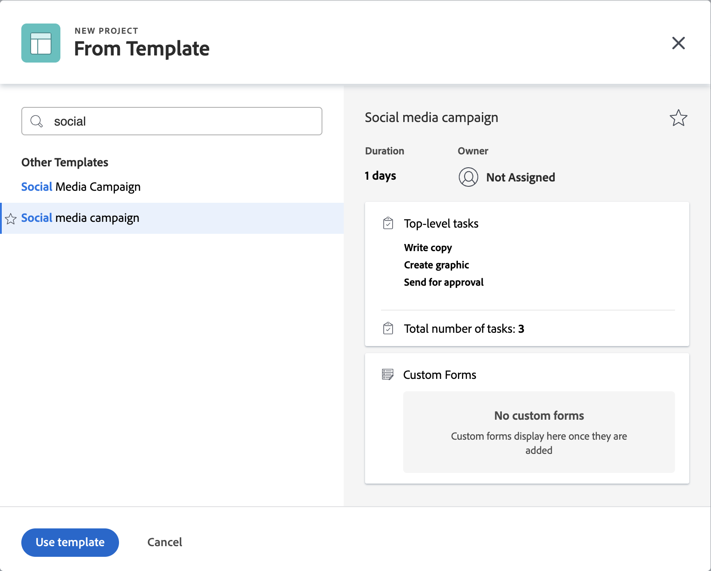

# Frame.io와 연결된 프로젝트 만들기

Workfront 및 Frame.io 통합을 사용하면 Frame.io에서 미러링된 Workfront의 프로젝트를 만들 수 있으므로 원활한 검토 및 승인 경험을 제공할 수 있습니다.

Workfront 프로젝트가 Frame.io와 연결되면 다음과 같은 작업을 수행할 수 있습니다

* **Frame.io 사용자를 작업에 할당**: Frame.io 사용 사용자는 Workfront 작업에 할당되면 전자 메일로 알림이 전송되며 완료할 작업이 있음을 나타냅니다.
* **Frame.io 사용자와 프로젝트 공유**: 프로젝트를 Frame.io 사용 사용자와 공유할 경우 Workfront 및 Frame.io 내의 프로젝트에 액세스할 수 있습니다.
* **Frame.io와 크리에이티브 자료 공유**: 프로젝트 코디네이터는 단방향 동기화 프로젝트 폴더를 사용하여 Workfront의 지침과 자료를 Frame.io의 크리에이티브 사용자에게 직접 보낼 수 있습니다. [!BADGE 준비 중]{type=Informative}
* **작업 진행 상황을 추적**: Creative는 Frame.io를 종료하지 않고 완료된 에셋을 보내고 작업을 완료로 표시할 수 있습니다.

## 액세스 요구 사항

+++ 을 확장하여 이 문서의 기능에 대한 액세스 요구 사항을 봅니다. 

다음 항목이 있어야 합니다.

<table style="table-layout:auto"> 
 <col> 
 <col> 
 <tbody> 
  <tr> 
   <td role="rowheader">Adobe Workfront 플랜</td> 
   <td> 
임의
 </td> 
  </tr> 
  <tr> 
   <td role="rowheader">Adobe Workfront 라이선스</td> 
   <td> 
표준
 </td> 
  </tr> 
  <tr> 
   <td role="rowheader">액세스 수준 구성</td> 
   <td> 
프로젝트에 대한 액세스 편집
 </td> 
  </tr> 
  <tr> 
   <td role="rowheader">개체 권한</td> 
   <td> 
프로젝트를 만들 때 프로젝트에 대한 관리 권한을 자동으로 받습니다.
 </td> 
  </tr> 
 </tbody> 
</table>

이 표의 정보에 대한 자세한 내용은 [Workfront 설명서의 액세스 요구 사항](/help/quicksilver/administration-and-setup/add-users/access-levels-and-object-permissions/access-level-requirements-in-documentation.md)을 참조하십시오.

+++

## 전제 조건

* Workfront 설정 영역에서 기본 Frame.io 계정 설정
* Workfront 사용자 프로필에서 Frame.io 사용자 활성화

위의 필수 구성 요소에 대한 자세한 내용은 [구성 [!DNL Workfront] 및 [!DNL Frame.io] 통합](/help/quicksilver/administration-and-setup/configure-integrations/configure-wf-and-frame.md)을 참조하세요.

## 새 프로젝트 템플릿 만들기

새 템플릿을 작성할 때 모든 작업 및 향후 프로젝트 설정에 대한 정보를 입력할 수 있습니다. 그런 다음 이 정보는 템플릿에서 만드는 모든 프로젝트로 전송됩니다.

Frame.io의 프로젝트는 Workfront 그룹에 연결된 팀별로 구성됩니다. 이전에 프로젝트 그룹을 설정할 수 있으므로 프로젝트 템플릿을 사용하여 연결된 프로젝트를 만드는 것이 좋습니다.

프로젝트를 처음부터 새로 만들도록 선택하면 Workfront이 기본 프로젝트 그룹을 자동으로 추가하고 Frame.io의 해당 기본 팀 아래에 미러 Frame.io 프로젝트가 만들어집니다.

>[!NOTE]
>
>프로젝트를 만든 후 그룹을 업데이트해도 Frame.io 팀은 변경되지 않습니다.

### 템플릿을 만들고 프로젝트 그룹 지정

{{step1-to-templates}}

1. **새 템플릿**&#x200B;을 클릭합니다.
1. 템플릿의 이름을 입력한 다음 **Enter**&#x200B;를 눌러 이름을 저장합니다.
1. 왼쪽 패널에서 **템플릿 세부 정보**&#x200B;를 클릭합니다.
1. **템플릿 연결** 섹션에서 그룹을 지정하십시오. 그룹을 추가하지 않으면 기본 프로젝트 그룹이 추가되고 Frame.io의 프로젝트가 Frame.io의 해당 기본 팀 아래에 만들어집니다.

다음 섹션으로 이동합니다.

### 작업 추가 및 Frame.io 사용 사용자 할당

1. 왼쪽 패널에서 **템플릿 작업**&#x200B;을 클릭합니다.
1. 템플릿에 작업을 빠르게 추가하려면 **템플릿 작업 추가 시작**&#x200B;을 클릭하세요. 나중에 추가 설정을 구성할 수 있습니다.

   또는

   한 번에 하나씩 작업을 추가하고 추가 설정을 구성하려면 **새 템플릿 작업**&#x200B;을 클릭하십시오.
   
1. 작업 이름을 추가합니다.
1. **할당** 영역에서 사용자 또는 팀을 할당합니다. 개별적으로 또는 팀에서 Frame.io 사용 사용자를 할당하면 Frame.io 프로젝트에 대한 공동 작업자 액세스 권한이 부여되고 이메일을 통해 Frame.io 프로젝트의 작업에 대한 알림이 전송됩니다. 해당 이메일에서 Frame.io 프로젝트에 참여하고 작업을 시작할 수 있습니다.
1. 필요에 따라 1단계와 2단계를 반복합니다.

다음 섹션으로 이동합니다.

### 추가 템플릿 세부 정보 구성

Workfront은 강력한 프로젝트 관리 기능을 제공합니다. [프로젝트 템플릿 편집](/help/quicksilver/manage-work/projects/create-and-manage-templates/edit-templates.md) 문서를 사용하여 템플릿의 다음 영역을 구성하는 것이 좋습니다.

* 개요
* 재무
* 사용자 정의 양식
* 프로젝트 설정
* 작업 설정
* 문제 설정
* 액세스

### 템플릿에서 프로젝트 만들기

템플릿을 만들면 이를 사용하여 프로젝트를 만들 수 있습니다.

{{step1-to-projects}}

1. **템플릿의 새 프로젝트**&#x200B;를 클릭합니다.
1. 검색 상자를 사용하여 필요한 템플릿의 이름을 입력하십시오.
1. 템플릿 이름을 선택한 다음 **템플릿 사용**&#x200B;을 클릭합니다.
   
1. 필요에 따라 프로젝트 설정을 조정한 다음 **프로젝트 만들기**&#x200B;를 클릭합니다.
1. 왼쪽 패널에서 **문서**&#x200B;를 클릭합니다.
1. 단방향 동기화 폴더를 사용하여 크리에이티브 자료를 Frame.io와 자동으로 공유할 수 있습니다. [!BADGE 준비 중]{type=Informative}

   >[!NOTE]
   >
   >이 기능은 현재 개발 중입니다. Frame.io에서 사용자와 정보를 공유하려면 파일을 문서 탭에 업로드하십시오. 프로젝트의 상태를 현재로 설정하면 해당 파일이 자동으로 Frame.io로 푸시됩니다.

1. 프로젝트 헤더에서 프로젝트를 **계획**&#x200B;에서 **현재**(으)로 변경합니다.

프로젝트를 만들고 크리에이티브가 완성된 에셋을 업로드하면 Workfront에서 에셋에 검토 및 승인 워크플로를 할당할 수 있습니다. 자세한 내용은 [문서 검토 또는 승인 요청 만들기](/help/quicksilver/review-and-approve-work/document-reviews-and-approvals/manage-document-approvals/create-a-document-approval.md)를 참조하십시오. <!-- name may need to change -->

## 처음부터 새 프로젝트 만들기

필요에 따라 처음부터 새 프로젝트를 만들 수 있습니다.

>[!IMPORTANT]
>
>* Frame.io의 프로젝트는 Workfront 그룹에 연결된 팀별로 구성됩니다. 이전에 프로젝트 그룹을 설정할 수 있으므로 프로젝트 템플릿을 사용하여 연결된 프로젝트를 만드는 것이 좋습니다.
>
>
>* 프로젝트를 처음부터 새로 만들도록 선택하면 Workfront이 기본 프로젝트 그룹을 자동으로 추가하고 Frame.io의 해당 기본 팀 아래에 미러 Frame.io 프로젝트가 만들어집니다.
>
>프로젝트를 만든 후 그룹을 업데이트해도 Frame.io 팀은 변경되지 않습니다.

### 프로젝트 만들기

{{step1-to-projects}}

1. **새 프로젝트**&#x200B;를 클릭합니다.
1. 프로젝트의 이름을 입력한 다음 **Enter**&#x200B;를 눌러 이름을 저장합니다.

다음 섹션으로 이동합니다.

### 작업 추가 및 Frame.io 사용 사용자 할당

1. 왼쪽 패널에서 **작업**&#x200B;을 클릭합니다.
1. 프로젝트에 작업을 빠르게 추가하려면 **작업 추가 시작**&#x200B;을 클릭하세요. 나중에 추가 설정을 구성할 수 있습니다.

   또는

   한 번에 하나의 작업을 추가하고 추가 설정을 구성하려면 **새 작업**&#x200B;을 클릭하십시오.
   
1. 작업 이름을 추가합니다.
1. **할당** 영역에서 사용자 또는 팀을 할당합니다. 개별적으로 또는 팀에서 Frame.io 사용 사용자를 할당하면 Frame.io 프로젝트에 대한 공동 작업자 액세스 권한이 부여되고 이메일을 통해 Frame.io 프로젝트의 작업에 대한 알림이 전송됩니다. 해당 이메일에서 Frame.io 프로젝트에 참여하고 작업을 시작할 수 있습니다.
1. 필요에 따라 1단계와 2단계를 반복합니다.

다음 섹션으로 이동합니다.

### 크리에이티브 자료 업로드

1. 왼쪽 패널에서 **문서**&#x200B;를 클릭합니다.
1. 단방향 동기화 폴더를 사용하여 크리에이티브 자료를 Frame.io와 자동으로 공유할 수 있습니다. [!BADGE 준비 중]{type=Informative}

   >[!NOTE]
   >
   >이 기능은 현재 개발 중입니다. Frame.io에서 사용자와 정보를 공유하려면 파일을 문서 탭에 업로드하십시오. 프로젝트의 상태를 현재로 설정하면 해당 파일이 자동으로 Frame.io로 푸시됩니다.

다음 섹션으로 이동합니다.

### 추가 프로젝트 세부 정보 구성

Workfront은 강력한 프로젝트 관리 기능을 제공합니다. [프로젝트 편집](/help/quicksilver/manage-work/projects/manage-projects/edit-projects.md) 문서를 사용하여 프로젝트의 다음 영역을 구성하는 것이 좋습니다.

* 개요
* 재무
* 사용자 정의 양식
* 프로젝트 설정
* 작업 설정
* 문제 설정
* 액세스

### 프로젝트를 현재 (으)로 설정

1. 프로젝트 헤더에서 프로젝트를 계획에서 현재로 변경합니다.
프로젝트를 만들고 크리에이티브가 완성된 에셋을 업로드하면 Workfront에서 에셋에 검토 및 승인 워크플로를 할당할 수 있습니다.

프로젝트를 만들고 크리에이티브가 완성된 에셋을 업로드하면 Workfront에서 에셋에 검토 및 승인 워크플로를 할당할 수 있습니다.

자세한 내용은 [문서 검토 또는 승인 요청 만들기](/help/quicksilver/review-and-approve-work/document-reviews-and-approvals/manage-document-approvals/create-a-document-approval.md)를 참조하십시오. <!-- name may need to change -->
