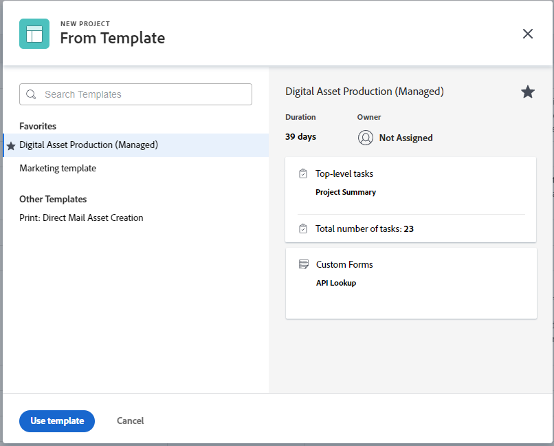

# 템플릿을 사용하여 프로젝트 만들기

<!-- Audited: 01/2024 -->

템플릿을 프레임워크로 사용하여 Adobe Workfront에서 프로젝트를 만들 수 있습니다. 자주 반복되는 프로젝트가 있는 경우 새 프로젝트의 일반 타임라인에 템플릿을 사용하면 동일한 프로젝트를 반복적으로 작성할 필요가 없습니다.

템플릿은 프로젝트와 관련된 반복 가능한 프로세스, 정보 및 설정을 캡처하는 방법을 제공합니다. 템플릿에 연결된 정보가 프로젝트로 전송됩니다. 여기에는 작업, 할당, 기간, 문서, 재무 세부 정보, 위험 및 사용자 정의 양식이 포함됩니다.

>[!TIP]
>
>Workfront은 새 프로젝트의 그룹 및 상태를 다음과 같이 정의합니다.
>
>* 템플릿에서 생성된 새 프로젝트의 기본 상태는 기본 프로젝트 환경 설정 영역에서 Workfront 관리자 또는 그룹의 프로젝트 환경 설정 영역에서 그룹 관리자(또는 Workfront 관리자)가 정의한 상태에 해당합니다. 프로젝트 환경 설정 구성에 대한 자세한 내용은 [시스템 전체 프로젝트 환경 설정 구성](../../../administration-and-setup/set-up-workfront/configure-system-defaults/set-project-preferences.md) 또는 [그룹에 대한 프로젝트 환경 설정 구성](../../../administration-and-setup/manage-groups/create-and-manage-groups/configure-project-preferences-group.md).
>
>* 새 프로젝트의 그룹은 템플릿의 그룹입니다. 템플릿이 그룹과 연결되어 있지 않으면 프로젝트의 그룹은 프로젝트를 만드는 사용자의 홈 그룹입니다.
>
>* 새 프로젝트에 사용할 수 있는 상태는 템플릿의 그룹인 프로젝트 그룹 또는 프로젝트를 만든 사용자의 홈 그룹 상태와 일치합니다.

템플릿에서 프로젝트를 만드는 다음과 같은 옵션이 있습니다.

* 프로젝트 영역의 템플릿에서 프로젝트 만들기
* 템플릿 수준의 템플릿에서 프로젝트 만들기
* 기존 프로젝트에 템플릿 첨부

  자세한 내용은 [프로젝트에 템플릿 첨부](../../../manage-work/projects/create-and-manage-templates/attach-template-to-project.md).

* 그룹 영역의 템플릿에서 프로젝트 만들기

## 액세스 요구 사항

<!--drafted for P&P:

<table style="table-layout:auto"> 
 <col> 
 <col> 
 <tbody> 
  <tr> 
   <td role="rowheader">Adobe Workfront plan*</td> 
   <td> 
Any 
 </td> 
  </tr> 
  <tr> 
   <td role="rowheader">Workfront license*</td> 
   <td> 
Current license: Standard 

   Or
   
Legacy license: Plan 

    </td> 
  </tr> 
  <tr> 
   <td role="rowheader">Access level configurations*</td> 
   <td> 
Edit access to Projects and to Templates
 
<b>NOTE</b>
   
   If you still don't have access, ask your Workfront administrator if they set additional restrictions in your access level. For information about access to projects, see <a href="../../../administration-and-setup/add-users/configure-and-grant-access/grant-access-projects.md" class="MCXref xref">Grant access to projects</a>. For information on how a Workfront administrator can change your access level, see <a href="../../../administration-and-setup/add-users/configure-and-grant-access/create-modify-access-levels.md" class="MCXref xref">Create or modify custom access levels</a>. 
 </td> 
  </tr> 
  <tr> 
   <td role="rowheader">Object permissions</td> 
   <td> 
View permissions to a template
 
When you create a project you automatically receive Manage permissions to the project 
 
 For information about project permissions, see <a href="../../../workfront-basics/grant-and-request-access-to-objects/share-a-project.md" class="MCXref xref">Share a project in Adobe Workfront</a>.
 
For information on requesting additional access, see <a href="../../../workfront-basics/grant-and-request-access-to-objects/request-access.md" class="MCXref xref">Request access to objects </a>.
 </td> 
  </tr> 
 </tbody> 
</table>
-->

이 문서의 단계를 수행하려면 다음 액세스 권한이 있어야 합니다.

<table style="table-layout:auto"> 
 <col> 
 <col> 
 <tbody> 
  <tr> 
   <td role="rowheader">Adobe Workfront 플랜</td> 
   <td> 
임의 
 </td> 
  </tr> 
  <tr> 
   <td role="rowheader">Workfront 라이선스</td> 
   <td> 
새로운 기능: 표준

        
또는

        
현재: 플랜 
 </td> 
  </tr> 
  <tr> 
   <td role="rowheader">액세스 수준 구성</td> 
   <td> 
프로젝트 및 템플릿에 대한 액세스 편집
 </td> 
  </tr> 
  <tr> 
   <td role="rowheader">개체 권한</td> 
   <td> 
템플릿에 대한 권한 보기
 
프로젝트를 만들 때 프로젝트에 대한 관리 권한을 자동으로 받습니다.
</td> 
  </tr> 
 </tbody> 
</table>

이 표의 정보에 대한 자세한 내용은 [Workfront 설명서의 액세스 요구 사항](/help/quicksilver/administration-and-setup/add-users/access-levels-and-object-permissions/access-level-requirements-in-documentation.md).

## 프로젝트 영역의 템플릿에서 프로젝트 만들기

주 메뉴의 프로젝트 영역이나 포트폴리오 또는 프로그램의 프로젝트 영역에서 프로젝트를 만들 수 있습니다.

>[!NOTE]
>
>시스템 또는 그룹 관리자가 레이아웃 템플릿을 사용하여 인터페이스를 수정할 수 있습니다. 이 경우 다음 단계에서 참조하는 섹션 및 영역의 이름 중 일부는 Workfront 인스턴스에서 다를 수 있습니다.

1. 다음 중 하나를 수행하십시오.

   * 다음을 클릭합니다. **[!UICONTROL 메인 메뉴]** 아이콘  Adobe Workfront의 오른쪽 위 모서리에서 또는 (사용 가능한 경우) **[!UICONTROL 메인 메뉴]** 아이콘  왼쪽 상단 모서리입니다. 클릭 **프로젝트**, 다음 확장 **새 프로젝트**.
   * 포트폴리오로 이동한 다음 를 확장합니다. **새 프로젝트**.

     >[!TIP]
     >
     >포트폴리오의 템플릿을 사용하여 프로젝트를 만들면 새 프로젝트의 Portfolio 필드가 업데이트되어 프로젝트를 만들도록 선택한 포트폴리오가 표시됩니다. 지정된 경우 템플릿의 Portfolio 필드를 덮어씁니다.

   * 프로그램으로 이동한 다음 를 확장합니다 **새 프로젝트**.

     >[!TIP]
     >
     >프로그램의 템플릿을 사용하여 프로젝트를 만들 때 새 프로젝트의 프로그램 필드가 업데이트되어 프로젝트를 만들도록 선택한 프로그램이 표시됩니다. 템플릿의 Portfolio 필드가 업데이트되어 프로젝트를 만들도록 선택한 프로그램의 포트폴리오가 표시됩니다. 지정된 경우 템플릿의 프로그램 및 Portfolio 필드를 덮어씁니다.

   * 그룹 관리자는 관리하는 그룹의 프로젝트 섹션에서 프로젝트를 만들 수도 있습니다. 자세한 내용은 [그룹의 프로젝트 만들기 및 수정](../../../administration-and-setup/manage-groups/work-with-group-objects/create-and-modify-a-groups-projects.md).

     >[!TIP]
     >
     >그룹의 템플릿을 사용하여 프로젝트를 만들 때 템플릿의 그룹 필드가 지정되지 않은 경우에만 새 프로젝트의 그룹 필드에 프로젝트를 만들 그룹이 표시됩니다. 템플릿 그룹 필드를 지정하면 새 프로젝트의 그룹 필드가 템플릿의 그룹 필드가 됩니다.

   <!--
   
(this, above, is hyperlinked to the classic version of this article; the Milestone View steps are similar to creating a project in Classic than to the way you do it in NWE)

   -->

   

1. 에서 템플릿 이름을 클릭합니다. **즐겨 찾는 템플릿** 목록을 표시합니다.

   

   또는

   다음을 수행합니다.

   1. 선택 **템플릿의 새 프로젝트**.
   1. 다음에서 **템플릿 검색** 필드에서 템플릿 이름을 입력하고 목록에 표시되면 클릭합니다.
   1. 오른쪽의 템플릿 세부 사항을 검토합니다.

      템플릿 세부 정보에는 다음 항목이 포함됩니다.

      * 템플릿 기간
      * 템플릿 소유자
      * 상위 3개 작업의 이름을 포함하는 최상위 작업 수
      * 템플릿의 모든 작업 수
      * 템플릿 사용자 정의 양식의 이름

   1. (선택 사항) 왼쪽 창의 템플릿 이름 위에 마우스를 놓고 **즐겨찾기** **아이콘**  나중에 사용할 수 있도록 즐겨찾기에 표시하기 위해

      또는

      확장 **즐겨 찾는 템플릿** 을(를) 나열하고 드롭다운 목록에서 템플릿을 선택합니다.

      >[!TIP]
      >
      >최대 40개의 Workfront 항목을 즐겨찾기로 표시할 수 있습니다. 여기에는 템플릿 및 기타 항목이 포함됩니다.

   1. 클릭 **템플릿 사용** 템플릿을 선택한 경우.

      

      >[!NOTE]
      >
      >프로젝트 목록에 마일스톤 보기가 적용된 경우 **템플릿의 새 섹션**.
      >
      >
      >
      >

   다음 **새 프로젝트** 상자가 열립니다.

   

1. 템플릿에서 필드가 이미 채워져 있는 경우 **새 프로젝트** 상자. 프로젝트와 더 잘 일치하도록 미리 채워진 값을 편집할 수 있습니다. 자세한 내용은 [프로젝트 편집](../../../manage-work/projects/manage-projects/edit-projects.md).
1. 클릭 **프로젝트 만들기**.

   이전 단계에서 변경하지 않은 경우 템플릿에 정의된 모든 세부 정보가 새로 생성된 프로젝트와 자동으로 연결됩니다.

## 템플릿 영역의 템플릿에서 프로젝트 만들기

프로젝트 영역에서 시작하는 대신 템플릿으로 시작하여 템플릿에서 프로젝트를 만들 수 있습니다.

{{step1-to-templates}}

1. 사용할 템플릿의 이름을 클릭합니다.
1. 다음을 클릭합니다. **자세히** 메뉴 을 클릭한 다음 을 클릭합니다 **프로젝트 만들기**.

   

   다음 **새 프로젝트** 상자가 열립니다.

1. 프로젝트의 이름을 입력한 다음 각 섹션을 검토하고 필요에 따라 변경합니다.

   

   템플릿에서 필드가 이미 채워져 있는 경우 **새 프로젝트** 상자. 프로젝트와 더 잘 일치하도록 미리 채워진 값을 편집할 수 있습니다. 자세한 내용은 [프로젝트 편집](../../../manage-work/projects/manage-projects/edit-projects.md).

1. 클릭 **프로젝트 만들기**.

   이전 단계에서 변경하지 않은 경우 템플릿에 정의된 모든 세부 정보가 새로 생성된 프로젝트와 자동으로 연결됩니다.
