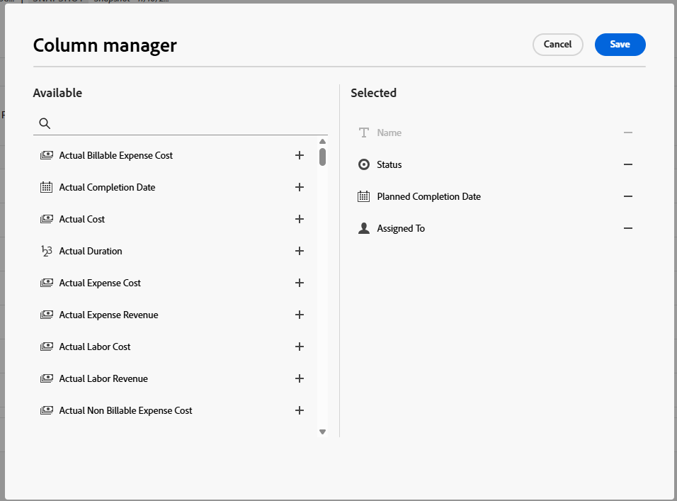

# 프로젝트 스냅샷 생성 및 보기

{{highlighted-preview-article-level}}

프로젝트 관리자는 종종 정보에 입각한 결정을 내리고 시간이 지남에 따라 프로젝트가 어떻게 변경되었는지 확인하기 위해 프로젝트의 과거 데이터를 현재 상태와 비교해야 합니다.

Adobe Workfront의 스냅샷을 사용하면 스냅샷(특정 날짜 및 시간에 촬영)과 프로젝트의 현재 데이터 간의 이러한 차이를 빠르고 정확하게 확인할 수 있으므로 프로젝트를 보다 효과적으로 관리하고 더 나은 결정을 내릴 수 있습니다. 스냅샷 비교는 프로젝트가 어떻게 발전했는지 나란히 보여 줍니다.

## 액세스 요구 사항

+++ 이 문서의 기능에 대한 액세스 요구 사항을 보려면 확장하십시오.

<table style="table-layout:auto"> 
 <col> 
 <col> 
 <tbody> 
  <tr> 
   <td>Adobe Workfront 패키지</td> 
   <td> 
워크플로 얼티밋
 </td> 
  </tr> 
  <tr> 
   <td>Adobe Workfront 라이선스</td> 
    <td>표준</td> 
  </tr> 
  <tr> 
   <td>액세스 수준 구성</td> 
   <td>프로젝트에 대한 액세스 편집</td> 
  </tr> 
  <tr> 
   <td>개체 권한</td> 
   <td>스냅샷을 볼 때는 원래 프로젝트에서 볼 수 있는 권한이 있는 모든 필드를 볼 수 있습니다 </td> 
  </tr> 
 </tbody> 
</table>

자세한 내용은 [Workfront 설명서의 액세스 요구 사항](/help/quicksilver/administration-and-setup/add-users/access-levels-and-object-permissions/access-level-requirements-in-documentation.md)을 참조하십시오.

+++

## 스냅샷 만들기

1. 프로젝트로 이동합니다.
1. 왼쪽 패널에서 **스냅샷**&#x200B;을 클릭합니다.

   

1. **새 스냅숏**&#x200B;을 클릭하세요.
1. **새 스냅숏** 대화 상자에 스냅숏 이름을 입력하고 **저장**&#x200B;을 클릭합니다.

   스냅샷 이름이 목록에 나타납니다.

   >[!NOTE]
   >
   >스냅샷을 생성하면 즉시 볼 수 없습니다. 백그라운드에서 실행 중인 데이터를 기준으로 준비하는 데 최대 4시간이 소요될 수 있습니다. 스냅숏을 아직 사용할 수 없는 경우 만들기 상태가 **보류 중**&#x200B;이고 볼 수 있는 경우 **준비**&#x200B;입니다.

## 단일 스냅샷 보기

1. 프로젝트로 이동한 다음 왼쪽 패널에서 **스냅샷**&#x200B;을 클릭합니다.
1. 목록에서 스냅샷 이름을 클릭하여 엽니다. 상태를 열려면 **준비**&#x200B;여야 합니다.

   >[!TIP]
   >
   >화면 맨 위에 있는 탐색 표시를 프로젝트로 다시 연결하여 스냅샷을 보고 있는지 확인할 수 있습니다.

   스냅샷은 스냅샷을 생성할 때 존재했던 대로 다음 항목을 표시합니다.

   * 프로젝트의 작업 및 하위 작업 계층
   * 프로젝트 세부 정보 및 세부 정보에 첨부된 모든 사용자 정의 양식
   * 연결된 프로젝트 및 해당 계층
   * 문제
   * 비율
   * 과금 기록
   * 경비 <!--* Bookings (on its own line of course when they get released)-->
   * 프로젝트 팀(사람 탭)

   열을 필터링, 정렬, 추가 및 제거하거나 보기를 적용하여 스냅샷의 모든 목록을 사용자 지정할 수 있습니다. 시간 단계별 KPI를 사용하여 스냅샷 보기에 추가할 수 있습니다. 자세한 내용은 이 문서에서 [스냅숏 목록 사용자 지정](#customize-snapshot-lists)을 참조하십시오.

## 스냅샷 비교

1. 프로젝트로 이동한 다음 왼쪽 패널에서 **스냅샷**&#x200B;을 클릭합니다.
1. 스냅샷 비교 옵션 선택:

   * 둘 이상의 스냅숏을 서로 비교하려면 목록에서 스냅숏 옆에 있는 확인란을 선택하고 화면 하단의 작업 표시줄에서 **비교**&#x200B;를 클릭합니다.
   * 스냅숏을 현재 프로젝트와 비교하려면 목록에서 스냅숏 옆에 있는 확인란을 선택하고 화면 하단의 작업 표시줄에서 **현재 항목과 비교**&#x200B;를 클릭합니다.

     >[!NOTE]
     >
     >비교하려는 각 스냅숏의 상태는 **준비**&#x200B;여야 합니다.

1. 비교 화면에서 각 스냅샷과 현재 프로젝트를 확장하여 그 아래의 계층 구조를 확인합니다.

   

1. 열을 정렬, 추가 및 제거하거나 보기를 적용하여 비교를 사용자 지정할 수 있습니다. 자세한 내용은 이 문서에서 [스냅숏 목록 사용자 지정](#customize-snapshot-lists)을 참조하십시오.

## 스냅샷 내보내기

모든 스냅샷 목록을 내보내거나 스냅샷 비교를 .xlsx 또는 .csv 형식으로 내보낼 수 있습니다. 표시된 모든 열이 내보낸 파일에 포함됩니다.

1. 스냅숏 목록 또는 스냅숏 비교에서 **내보내기** 아이콘 을 클릭합니다.
1. 내보내기 파일의 형식을 선택합니다.

   파일이 컴퓨터에 저장됩니다. 위치를 선택하라는 메시지가 표시될 수 있습니다.

1. (선택 사항) 적절한 응용 프로그램을 사용하여 내보낸 목록을 엽니다.

## 스냅숏 목록 사용자 지정

열을 필터링, 정렬, 추가 및 제거하거나 보기를 적용하여 모든 스냅샷 목록과 스냅샷 또는 비교 내의 목록을 사용자 정의할 수 있습니다.

목록 사용자 지정에 대한 자세한 내용은 [고급 목록 사용](/help/quicksilver/workfront-basics/navigate-workfront/use-lists/enhanced-lists.md)을 참조하세요.

### 목록의 항목 필터링

필터는 목록에 표시되는 정보의 양을 줄이는 데 도움이 됩니다.

1. 목록 위에 있는 **필터**&#x200B;를 클릭합니다.
1. 필터 상자에서 **조건 추가**&#x200B;를 클릭합니다.
1. 필터링 기준으로 사용할 필드를 선택합니다.
1. &quot;다음 중 하나 이상의 항목 있음&quot;, &quot;다음 중 하나 이상의 항목 없음&quot;, &quot;다음 이전&quot; 또는 &quot;다음 이후&quot;와 같은 필터 수정자를 선택합니다. 수정자 옵션은 필터링 기준으로 사용하는 필드 유형에 따라 다릅니다.
1. 필드 값 또는 값을 선택합니다. 필터링 기준으로 사용하는 필드 유형에 따라 목록에서 항목을 선택하거나 검색하거나 달력을 사용하여 날짜 범위를 선택하라는 메시지가 표시될 수 있습니다.

   

   필터가 목록에 자동으로 적용됩니다.

1. 필터에 다른 조건을 추가하려면 **조건 추가**&#x200B;를 클릭하십시오.

   AND 또는 OR 커넥터로 여러 필터를 연결할 수 있습니다.

1. 필터가 적용되면 **필터** 옵션을 다시 열어 필터 옵션을 변경하거나 모든 필터를 지울 수 있습니다.

   목록에 필터를 적용하면 **필터** 단추에 표시기가 나타납니다.

   

### 목록에서 정렬

개별 열을 정렬하려면 다음을 수행합니다.

1. 열 위로 마우스를 가져간 다음 아래쪽 화살표를 클릭하고 **정렬**&#x200B;을 선택합니다.

   열 이름 옆에 있는 아이콘은 해당 열의 값과 정렬 방향을 기준으로 목록이 정렬되었음을 나타냅니다.

   

### 목록의 열 사용자 지정

목록에서 열을 숨기고, 표시하고, 순서를 변경할 수 있습니다.

1. 목록 위에 있는 **열**&#x200B;을 클릭합니다.

   스냅숏 목록의 

1. 토글을 사용하여 목록에 열을 표시하거나 숨깁니다.
1. 열 순서를 바꾸려면 **끌기** 아이콘 을 클릭하고 열을 원하는 위치로 이동합니다. 열을 이동하면 목록이 자동으로 변경됩니다.

   >[!NOTE]
   >
   >기본 필드는 목록의 첫 번째 열입니다. 첫 번째 위치에서 고정되어 있으며 열을 변경할 수 없습니다. 열의 수가 많으면 기본 필드가 왼쪽으로 동결되고 가로로 스크롤하면 항상 표시됩니다.
   >
   >필드 이름 옆의 아이콘에는 텍스트 또는 날짜 필드와 같은 필드 유형이 표시됩니다.

   열을 숨길 때 **열** 단추에 표시기가 나타납니다. 열 순서를 변경할 때 표시기가 나타나지 않습니다.

   

### 열 관리자를 사용하여 열 추가 및 제거

일부 향상된 목록의 열 관리자를 사용하여 목록의 열을 쉽게 추가하거나 제거할 수 있습니다. Workfront에 열로 이미 존재하는 시스템 필드와 사용자 정의 필드를 모두 추가하거나 제거할 수 있습니다.

1. 표의 오른쪽 위 모서리에 있는 **+** 아이콘을 클릭하여 **열 관리자** 상자를 엽니다.

   

1. **사용 가능** 열에서 기존 개체 필드를 검색한 다음 필드 이름 오른쪽의 **+**&#x200B;을(를) 클릭하여 **선택됨** 열에 추가합니다.
1. 목록에서 제거하려면 **선택됨** 열의 필드 오른쪽에 있는 **-**&#x200B;을(를) 클릭하십시오.
1. **저장**&#x200B;을 클릭합니다.

   이 목록은 선택한 항목에 따라 열을 업데이트합니다.

### 목록에 보기 적용

뷰를 적용하거나 생성하려면 다음을 수행합니다.

1. **보기** 드롭다운을 클릭하고 목록에 적용할 기존 보기를 선택하십시오.

   또는

   새 보기를 만들려면 **새 보기**&#x200B;를 클릭합니다.

   

1. (조건부) 새 보기를 추가하려면 보기 이름을 입력한 다음 **만들기**&#x200B;를 클릭합니다.
1. (선택 사항) 열을 숨기거나 표시하거나 다시 정렬합니다. 자세한 내용은 [목록의 열 사용자 지정](#customize-columns-in-a-list)을 참조하십시오.
1. (선택 사항) 목록을 필터링합니다. 자세한 내용은 [목록의 항목 필터링](#filter-items-in-a-list)을 참조하십시오.

보기에 대한 변경 사항은 자동으로 저장됩니다. 다음에 이 보기를 적용하면 열 및 필터 설정이 설정된 방식으로 유지됩니다. 보기에 대한 자세한 내용은 [고급 목록 사용](/help/quicksilver/workfront-basics/navigate-workfront/use-lists/enhanced-lists.md)을 참조하세요.

