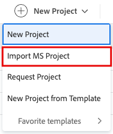

# Microsoft 프로젝트에서 프로젝트 가져오기

<!-- Audited: 4/2025 -->

Microsoft Project에서 Adobe Workfront으로 프로젝트를 가져오고 하나의 애플리케이션에서 모든 프로젝트를 관리할 수 있습니다. Microsoft 프로젝트에서 프로젝트를 가져올 때마다 Workfront에 새 프로젝트가 만들어집니다.

>[!IMPORTANT]
>
>일부 Microsoft 프로젝트 필드는 Workfront으로 전송되지 않습니다.
>
>Workfront과 Microsoft 프로젝트 간의 필드 호환성에 대한 자세한 내용은 [Microsoft 프로젝트 필드를 Adobe Workfront 프로젝트에 매핑](../../../manage-work/projects/manage-projects/map-ms-project-fields-to-workfront.md)을 참조하십시오.

## 액세스 요구 사항

+++ 을 확장하여 이 문서의 기능에 대한 액세스 요구 사항을 봅니다. 

<table style="table-layout:auto"> 
 <col> 
 <col> 
 <tbody> 
  <tr> 
   <td role="rowheader">Adobe Workfront 패키지</td> 
   <td> 
임의
 </td> 
  </tr> 
  <tr> 
   <td role="rowheader">Adobe Workfront 라이선스</td> 
   <td> 
표준
 
    
플랜

   </td> 
  </tr> 
  <tr> 
   <td role="rowheader">액세스 수준 구성</td> 
   <td> 
프로젝트에 대한 액세스 편집
 
   
포트폴리오 또는 프로그램에 프로젝트를 추가하는 경우 포트폴리오 및 프로그램에 대한 편집 액세스 권한이 있어야 합니다.

   </td> 
  </tr> 
  <tr> 
   <td role="rowheader">개체 권한</td> 
   <td> 
프로젝트를 만들 때 프로젝트에 대한 관리 권한을 자동으로 받습니다

   
포트폴리오 또는 프로그램에 프로젝트를 추가하는 경우 포트폴리오 및 프로그램에 대한 관리 권한이 있어야 합니다.

   </td> 
    </td> 
  </tr> 
 </tbody> 
</table>

이 표의 정보에 대한 자세한 내용은 [Workfront 설명서의 액세스 요구 사항](/help/quicksilver/administration-and-setup/add-users/access-levels-and-object-permissions/access-level-requirements-in-documentation.md)을 참조하십시오.

+++

<!--old permissions model: 

<table style="table-layout:auto"> 
 <col> 
 <col> 
 <tbody> 
  <tr> 
   <td role="rowheader">Adobe Workfront plan</td> 
   <td> 
Any
 </td> 
  </tr> 
  <tr> 
   <td role="rowheader">Adobe Workfront license</td> 
   <td> 
New: Standard 
 
   Or
   
Current: Plan 

   </td> 
  </tr> 
  <tr> 
   <td role="rowheader">Access level</td> 
   <td> 
Edit access to Projects
 </td> 
  </tr> 
  <tr> 
   <td role="rowheader">Object permissions</td> 
   <td> 
When you create a project you automatically receive Manage permissions to the project 
 </td> 
  </tr> 
 </tbody> 
</table>

-->

## MS 프로젝트에서 프로젝트 만들기

**기본 메뉴**&#x200B;의 **프로젝트** 영역이나 포트폴리오 또는 프로그램의 **프로젝트** 영역에서 프로젝트를 만들 수 있습니다.

1. Microsoft Project에 로그인하고 Workfront에서 가져올 프로젝트를 엽니다.
1. 프로젝트를 .xml 파일로 저장하려면 **파일**&#x200B;을 클릭한 다음 **다른 이름으로 저장**&#x200B;을 클릭합니다.

1. Workfront에 로그인.
1. 다음 중 하나를 수행하십시오.

   * Workfront의 오른쪽 위 모서리에 있는 **기본 메뉴** 을 클릭하거나 왼쪽 위 모서리에 있는 **기본 메뉴** 을 클릭합니다(가능한 경우). **프로젝트**&#x200B;를 클릭한 다음 **새 프로젝트**&#x200B;를 확장합니다.
   * 포트폴리오로 이동한 다음 **새 프로젝트**&#x200B;를 확장합니다.
   * 프로그램으로 이동한 다음 **새 프로젝트**&#x200B;를 확장합니다.
   * 그룹 관리자인 경우 관리하는 그룹의 **프로젝트** 섹션에서 프로젝트를 만들 수 있습니다. 자세한 내용은 [그룹의 프로젝트 만들기 및 수정](../../../administration-and-setup/manage-groups/work-with-group-objects/create-and-modify-a-groups-projects.md)을 참조하세요.

1. **MS 프로젝트 가져오기**&#x200B;를 클릭합니다. **MS 파일 가져오기** 대화 상자가 나타납니다.

   

1. **파일 선택**&#x200B;을 클릭한 다음 Microsoft 프로젝트에서 내보낸 .xml 파일을 컴퓨터에서 찾습니다.
1. 선택한 파일을 가져옵니다. Workfront은 가져오기 프로세스를 시작하고 Microsoft 프로젝트에서 내보낸 파일을 기반으로 새 프로젝트를 만듭니다.

   가져오기 프로세스가 완료되면 가져오기가 성공적으로 완료되었음을 확인하는 메시지가 표시되는 새 프로젝트 페이지로 이동합니다.

   >[!NOTE]
   >
   >Workfront의 파일 업로드 시간은 15분으로 제한됩니다. 파일 업로드가 이보다 오래 걸리는 경우 프로젝트를 더 작은 프로젝트로 분류하여 별도로 가져오는 것이 좋습니다. 작업을 Workfront으로 가져온 다음에는 작업을 한 프로젝트에서 다른 프로젝트로 이동하여 한 프로젝트로 결합합니다. 작업 이동에 대한 자세한 내용은 [작업 이동](../../../manage-work/tasks/manage-tasks/move-tasks.md)을 참조하십시오.

1. (선택 사항) Workfront에서 프로젝트를 계속 편집합니다. 프로젝트 편집에 대한 자세한 내용은 [프로젝트 편집](../../../manage-work/projects/manage-projects/edit-projects.md)을 참조하세요.

   >[!NOTE]
   >
   >템플릿에서 만든 새 프로젝트의 상태는 **프로젝트 환경 설정** 영역에서 Workfront 관리자 또는 **그룹 프로젝트 환경 설정** 영역에서 그룹 관리자가 정의한 상태와 같습니다. 프로젝트 환경 설정 구성에 대한 자세한 내용은 [시스템 전체 프로젝트 환경 설정 구성](../../../administration-and-setup/set-up-workfront/configure-system-defaults/set-project-preferences.md)을 참조하십시오.
