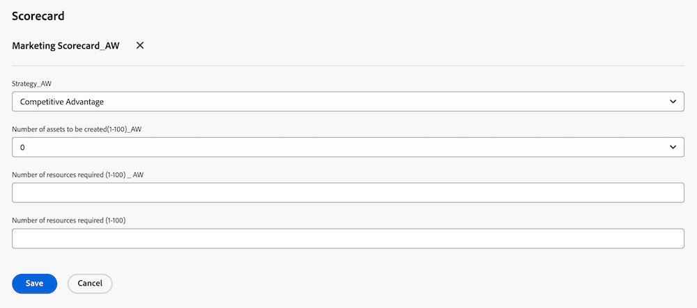
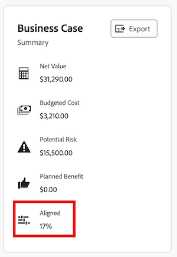

# 프로젝트에 스코어카드를 적용하고 정렬 점수 생성

<!-- Audited: 06/2025 -->

스코어카드를 사용하여 프로젝트가 이전에 설정한 포트폴리오 기준에 얼마나 잘 부합하는지 측정할 수 있습니다. 스코어카드는 조직의 미션, 가치 및 전략적 목표를 반영하는 경우가 많습니다.

스코어카드 및 스코어카드를 만드는 방법에 대한 자세한 내용은 [스코어카드 만들기](../../../administration-and-setup/set-up-workfront/configure-system-defaults/create-scorecard.md)를 참조하십시오.

## 액세스 요구 사항

+++ 을 확장하여 이 문서의 기능에 대한 액세스 요구 사항을 봅니다.

<table style="table-layout:auto"> 
 <col> 
 <col> 
 <tbody> 
  <tr> 
   <td role="rowheader">Adobe Workfront 패키지</td> 
   <td>
   
Prime 이상

  </tr> 
  <tr> 
   <td role="rowheader">Adobe Workfront 라이선스</td> 
   <td>
   
표준

   
플랜
</td>  
  </tr> 
  <tr> 
   <td role="rowheader">액세스 수준 구성</td> 
   <td> 
프로젝트에 대한 액세스 편집
 
포트폴리오에 대한 보기 또는 상위 액세스
 </td> 
  </tr> 
  <tr> 
   <td role="rowheader">개체 권한</td> 
   <td>
프로젝트에 대한 권한 관리
 
포트폴리오에 대한 권한 보기 이상
 </td> 
  </tr> 
 </tbody> 
</table>

자세한 내용은 [Workfront 설명서의 액세스 요구 사항](/help/quicksilver/administration-and-setup/add-users/access-levels-and-object-permissions/access-level-requirements-in-documentation.md)을 참조하십시오.

+++

## 프로젝트 스코어카드 {#project-scorecards}

* [스코어카드 개요](#scorecards-overview)
* [프로젝트에 스코어카드 적용](#apply-a-scorecard-to-a-project)

### 스코어카드 개요 {#scorecards-overview}

일반적으로 프로젝트 관리자는 스코어카드 정보를 완료하여 프로젝트에 대한 0과 100 사이의 정렬 값을 생성합니다. 생성된 값은 나중에 포트폴리오 관리자가 포트폴리오 최적화 도구에서 프로젝트를 검토하여 비교할 때 사용됩니다.

포트폴리오 최적화에 대한 자세한 내용은 [Portfolio 최적화 도구 개요](../../../manage-work/portfolios/portfolio-optimizer/portfolio-optimizer-overview.md)를 참조하십시오.

### 프로젝트에 스코어카드 적용

프로젝트에 대한 Standard 또는 Plan 라이선스 및 Manage 권한이 있는 사용자는 프로젝트에 스코어카드를 첨부할 수 있습니다.

프로젝트 권한에 대한 자세한 내용은 [Adobe Workfront에서 프로젝트 공유](../../../workfront-basics/grant-and-request-access-to-objects/share-a-project.md)를 참조하십시오.

프로젝트에 대한 비즈니스 사례를 작성하는 과정의 일부로 프로젝트에 스코어카드를 추가할 수 있습니다.

비즈니스 사례 만들기에 대한 자세한 내용은 [프로젝트에 대한 비즈니스 사례 만들기](../../../manage-work/projects/define-a-business-case/create-business-case.md)를 참조하세요.

비즈니스 사례에서 스코어카드에 액세스하려면 Adobe Workfront 관리자 또는 그룹 관리자가 프로젝트의 비즈니스 사례 영역에서 스코어카드 섹션을 활성화해야 합니다. 프로젝트 환경 설정 및 비즈니스 사례 영역 활성화에 대한 자세한 내용은 [시스템 차원의 프로젝트 환경 설정 구성](../../../administration-and-setup/set-up-workfront/configure-system-defaults/set-project-preferences.md)을 참조하십시오.

프로젝트에 스코어카드를 적용하려면:

1. 스코어카드를 적용할 프로젝트로 이동합니다.
1. 왼쪽 패널에서 **비즈니스 사례**&#x200B;를 클릭합니다.
1. 비즈니스 사례의 **스코어카드** 섹션을 찾습니다.\
   비즈니스 사례에 **스코어카드** 섹션이 표시되기 전에 스코어카드를 만들어야 합니다.

   스코어카드 만들기에 대한 자세한 내용은 [스코어카드 만들기](../../../administration-and-setup/set-up-workfront/configure-system-defaults/create-scorecard.md)를 참조하십시오.

1. 드롭다운 메뉴에서 스코어카드를 선택합니다.

   

1. 스코어카드의 모든 질문에 대한 답변을 입력합니다.

   Workfront은 답변된 각 질문에 점수를 적용하고 모든 질문의 개별 점수를 기반으로 전체 프로젝트 점수를 계산합니다.

   프로젝트 전체 맞춤 점수 생성에 대한 자세한 내용은 [프로젝트에 대한 맞춤 점수 생성](#generate-an-alignment-score-for-a-project)을 참조하십시오.

1. 스코어카드를 저장하고 프로젝트에 점수를 매기려면 **저장**&#x200B;을 클릭하십시오.

   이제 스코어카드가 프로젝트와 연결되고 프로젝트에 점수가 매겨집니다.

<!--This functionality was removed when we redesigned bulk editing projects with 23.2: 

1. (Conditional) When changes occur in the values of scorecard questions, you must recalculate the scorecard to reflect the new values for the project score. To recaulate the scorecard, do the following: 

   1. Go to a list of projects and select all projects in the list. 
   1. Click the **Edit** icon at the top of the list. 
   1. Click **Settings** in the left panel, then check the **Recalculate Scorecards** option at the end of the Settings area. 
   1. Click Save. This recalculates the score value based on the scorecards attached for all the selected projects.  

      >[!NOTE]
      >
      >   The option to recalculate scorecards has been removed from the Preview environment, when editing projects in bulk. 

-->

## 정렬 점수 생성

* [프로젝트에 대한 정렬 점수 생성](#generate-an-alignment-score-for-a-project)
* [포트폴리오에 대한 정렬 점수 생성](#generate-an-alignment-score-for-a-portfolio)

### 프로젝트에 대한 정렬 점수 생성 {#generate-an-alignment-score-for-a-project}

정렬 점수는 스코어카드를 완료한 후 생성된 값입니다.

스코어카드에는 정렬 포인트라고 하는 숫자 값이 할당된 응답 선택 사항이 있는 질문이 포함되어 있습니다. 이러한 포인트는 프로젝트가 조직에 얼마나 잘 부합하는지 결정하는 데 사용됩니다. 각 질문의 정렬 점에는 0과 100 사이의 숫자가 들어 있습니다.

스코어카드가 완료되면 Workfront은 다음 공식을 사용하여 프로젝트의 정렬 점수를 백분율로 계산합니다.

`Project Alignment Score = The sum of the question points from the scorecard met at a given time / The sum of the possible points on the scorecard`

자세한 내용은 [스코어카드 만들기](../../../administration-and-setup/set-up-workfront/configure-system-defaults/create-scorecard.md)를 참조하십시오.

### 포트폴리오에 대한 정렬 점수 생성 {#generate-an-alignment-score-for-a-portfolio}

포트폴리오의 정렬 점수는 포트폴리오에 있는 모든 프로젝트의 정렬 점수의 평균입니다.

프로젝트의 스코어카드가 완료되면 Workfront은 다음 공식을 사용하여 해당 값을 사용하여 포트폴리오의 정렬 점수를 백분율로 계산합니다.

`Portfolio Alignment Score = The sum of the percentages of the project alignment scores / Number of projects in the portfolio`

>[!NOTE]
>
>프로젝트에 연결된 스코어카드가 없어 정렬 점수가 없는 경우 포트폴리오에서 정렬이 0%로 간주됩니다. 프로젝트는 포트폴리오의 프로젝트 수에서 고려됩니다.

## 정렬 점수 보기

프로젝트 수준 또는 Portfolio Optimizer에서 프로젝트의 정렬 점수를 볼 수 있습니다.

* [프로젝트에 대한 정렬 점수 보기](#view-the-alignment-score-on-a-project)
* [Portfolio Optimizer에서 프로젝트 및 포트폴리오의 정렬 점수 보기](#view-the-alignment-scores-of-the-project-and-of-the-portfolio-in-the-portfolio-optimizer)

### 프로젝트에 대한 정렬 점수 보기

프로젝트에 대한 기여 권한이 있는 경우 프로젝트 수준에서 프로젝트의 정렬 점수를 볼 수 있습니다.

1. 정렬 점수를 보려는 프로젝트로 이동합니다.
1. 왼쪽 패널에서 **비즈니스 사례**&#x200B;를 클릭합니다.
1. 화면 오른쪽의 **비즈니스 사례 요약**(으)로 이동합니다. 정렬 점수는 비즈니스 사례 요약의 **정렬됨** 값에 있습니다.

   

### Portfolio Optimizer에서 프로젝트 및 포트폴리오의 정렬 점수 보기

포트폴리오에 대한 관리 액세스 권한이 있는 경우 Portfolio Optimizer에서 프로젝트 또는 포트폴리오의 정렬 점수를 볼 수 있습니다.

Portfolio Optimizer에 표시된 정보에 대한 자세한 내용은 [Portfolio Optimizer 개요](../../../manage-work/portfolios/portfolio-optimizer/portfolio-optimizer-overview.md)를 참조하세요.

* [Portfolio Optimizer에서 프로젝트의 정렬 점수를 찾습니다](#locate-the-alignment-score-of-the-project-in-the-portfolio-optimizer)
* [Portfolio Optimizer에서 포트폴리오의 정렬 점수 찾기](#locate-the-alignment-score-of-the-portfolio-in-the-portfolio-optimizer)

  

#### Portfolio Optimizer에서 프로젝트의 정렬 점수 찾기 {#locate-the-alignment-score-of-the-project-in-the-portfolio-optimizer}

{{step1-to-portfolios}}

1. 포트폴리오의 이름을 클릭합니다.
1. 왼쪽 패널에서 **Portfolio 최적화**&#x200B;를 클릭합니다. Portfolio Optimizer 가 표시됩니다.

   프로젝트의 정렬 점수는 Portfolio Optimizer의 **정렬** 열에 백분율로 표시됩니다.

   프로젝트와 연결된 스코어카드를 기반으로 한 프로젝트의 정렬 점수입니다.

#### Portfolio Optimizer에서 포트폴리오의 정렬 점수 찾기  {#locate-the-alignment-score-of-the-portfolio-in-the-portfolio-optimizer}

{{step1-to-portfolios}}

1. 포트폴리오의 이름을 클릭합니다.
1. 왼쪽 패널에서 **Portfolio 최적화**&#x200B;를 클릭합니다.
1. Portfolio Optimizer의 맨 위에서 포트폴리오의 정렬 점수를 나타내는 **Alignment** 게이지와 **Aligned** 값을 찾습니다.

   포트폴리오의 정렬 점수입니다.

   포트폴리오의 정렬 점수를 생성하는 방법에 대한 자세한 내용은 [포트폴리오에 대한 정렬 점수 생성](#generate-an-alignment-score-for-a-portfolio)을 참조하십시오.

## Portfolio Optimizer 점수 개요

프로젝트의 정렬 점수와 포트폴리오 최적화 도구 점수 사이에는 차이가 있습니다.

프로젝트의 정렬 점수는 스코어카드를 완료한 후 얻은 점을 기반으로 계산됩니다. 그런 다음 이 점수를 사용하여 포트폴리오 정렬 점수를 결정합니다. 정렬 점수는 백분율로 표시됩니다.

프로젝트의 정렬 점수가 Portfolio Optimizer의 **정렬** 열에 표시됩니다.

포트폴리오 최적화 도구 점수는 프로젝트 우선 순위를 지정할 수 있는 Portfolio 최적화 도구에서 자동으로 계산된 순위입니다. 포트폴리오 최적화 도구 점수는 숫자와 함께 표시기 아이콘으로 표시되며 Portfolio 최적화 도구의 **점수** 열에 표시됩니다. Portfolio Optimizer 점수는 목표를 제외한 비즈니스 사례의 모든 섹션이 완료될 때만 생성됩니다.

프로젝트의 비즈니스 사례를 만드는 방법에 대한 자세한 내용은 [프로젝트의 비즈니스 사례 만들기](../../../manage-work/projects/define-a-business-case/create-business-case.md)를 참조하십시오.

프로젝트의 포트폴리오 최적화 프로그램 점수를 계산하는 방법에 대한 자세한 내용은 [Portfolio 최적화 프로그램 점수 개요](../../../manage-work/portfolios/portfolio-optimizer/portfolio-optimizer-score.md)를 참조하십시오.
