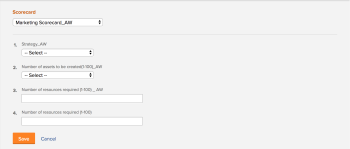

# 프로젝트에 스코어카드를 적용하고 정렬 점수를 생성합니다

스코어카드를 사용하여 프로젝트가 이전에 설정한 포트폴리오 기준에 얼마나 잘 정렬되는지 측정할 수 있습니다. 스코어카드는 종종 조직의 임무, 가치 및 전략적 목표를 반영합니다.

스코어카드 및 스코어카드를 만드는 방법에 대한 자세한 내용은 [스코어카드 만들기](../../../administration-and-setup/set-up-workfront/configure-system-defaults/create-scorecard.md).

## 액세스 요구 사항

이 문서의 절차를 수행하려면 다음 액세스 권한이 있어야 합니다.

<table style="table-layout:auto"> 
 <col> 
 <col> 
 <tbody> 
  <tr> 
   <td role="rowheader">Adobe Workfront 플랜*</td> 
   <td> <p>비즈니스 이상</p> </td> 
  </tr> 
  <tr> 
   <td role="rowheader">Adobe Workfront 라이선스*</td> 
   <td> <p>플랜 </p> </td> 
  </tr> 
  <tr> 
   <td role="rowheader">액세스 수준 구성*</td> 
   <td> <p>프로젝트에 대한 액세스 편집</p> <p>Portfolio에 대한 보기 이상 액세스</p> <p>참고: 여전히 액세스 권한이 없는 경우 Workfront 관리자에게 액세스 수준에서 추가 제한 사항을 설정하는지 문의하십시오. Workfront 관리자가 액세스 수준을 수정하는 방법에 대한 자세한 내용은 <a href="../../../administration-and-setup/add-users/configure-and-grant-access/create-modify-access-levels.md" class="MCXref xref">사용자 정의 액세스 수준 만들기 또는 수정</a>.</p> </td> 
  </tr> 
  <tr> 
   <td role="rowheader">개체 권한</td> 
   <td> <p>프로젝트에 대한 권한 관리</p> <p>포트폴리오에 대한 권한 보기 이상 </p> <p>추가 액세스 요청에 대한 자세한 내용은 <a href="../../../workfront-basics/grant-and-request-access-to-objects/request-access.md" class="MCXref xref">개체에 대한 액세스 요청 </a>.</p> </td> 
  </tr> 
 </tbody> 
</table>

&#42;어떤 계획, 라이선스 유형 또는 액세스 권한을 보유하고 있는지 알아보려면 Workfront 관리자에게 문의하십시오.

## 프로젝트 스코어카드 {#project-scorecards}

* [스코어카드 개요](#scorecards-overview)
* [프로젝트 스코어카드](#project-scorecards)

### 스코어카드 개요 {#scorecards-overview}

일반적으로 프로젝트 관리자는 스코어카드 정보를 완료하여 프로젝트에 대한 0에서 100 사이의 정렬 값을 생성합니다. 생성된 값은 나중에 포트폴리오 관리자가 포트폴리오 최적기의 프로젝트를 검토하여 비교할 때 사용됩니다.

포트폴리오 최적화에 대한 자세한 내용은 문서를 참조하십시오 [Portfolio 최적화 프로그램 개요](../../../manage-work/portfolios/portfolio-optimizer/portfolio-optimizer-overview.md).

### 프로젝트에 스코어카드 적용

프로젝트에 대한 계획 라이선스 및 관리 권한이 있는 사용자로 스코어카드를 프로젝트에 첨부할 수 있습니다.

프로젝트 권한에 대한 자세한 내용은 [Adobe Workfront에서 프로젝트 공유](../../../workfront-basics/grant-and-request-access-to-objects/share-a-project.md).

프로젝트에 대한 비즈니스 사례를 작성하는 과정의 일부로 프로젝트에 스코어카드를 추가할 수 있습니다.

비즈니스 사례 빌드에 대한 자세한 내용은 [프로젝트에 대한 비즈니스 사례 생성](../../../manage-work/projects/define-a-business-case/create-business-case.md).

비즈니스 사례에서 스코어카드에 액세스하려면 프로젝트의 비즈니스 사례 영역에서 Adobe Workfront 관리자 또는 그룹 관리자가 스코어카드 섹션을 활성화해야 합니다. 프로젝트 환경 설정 및 비즈니스 사례 영역 활성화에 대한 자세한 내용은 [시스템 전체 프로젝트 환경 설정 구성](../../../administration-and-setup/set-up-workfront/configure-system-defaults/set-project-preferences.md).

프로젝트에 스코어카드를 적용하려면:

1. 스코어카드를 적용할 프로젝트로 이동합니다.
1. 클릭 **비즈니스 사례** 왼쪽 패널에 표시됩니다.
1. 를 찾습니다. **스코어카드** 비즈니스 사례 섹션\
   스코어카드를 **스코어카드** 섹션에 비즈니스 케이스에 표시됩니다.

   스코어카드 만들기에 대한 내용은 [스코어카드 만들기](../../../administration-and-setup/set-up-workfront/configure-system-defaults/create-scorecard.md).

1. 드롭다운 메뉴에서 스코어카드를 선택합니다.

   

1. 스코어카드의 모든 질문에 대한 답변을 지정합니다.

   Workfront은 응답한 각 질문에 점수를 적용하고 모든 질문의 개별 점수를 기반으로 전체 프로젝트 점수를 계산합니다.

   프로젝트 전체 정렬 점수 생성에 대한 자세한 내용은 [프로젝트에 대한 정렬 점수 생성](#generate-an-alignment-score-for-a-project).

1. 클릭 **저장** 스코어카드를 저장하고 프로젝트에 점수를 매깁니다.

   이제 스코어카드가 프로젝트와 연결되고 프로젝트가 점수가 지정됩니다.

<!--This functionality was removed when we redesigned bulk editing projects with 23.2: 

1. (Conditional) When changes occur in the values of scorecard questions, you must recalculate the scorecard to reflect the new values for the project score. To recaulate the scorecard, do the following: 

   1. Go to a list of projects and select all projects in the list. 
   1. Click the **Edit** icon at the top of the list. 
   1. Click **Settings** in the left panel, then check the **Recalculate Scorecards** option at the end of the Settings area. 
   1. Click Save. This recalculates the score value based on the scorecards attached for all the selected projects.  

      >[!NOTE]
      >
      >   The option to recalculate scorecards has been removed from the Preview environment, when editing projects in bulk. 

-->

## 정렬 점수 생성

* [프로젝트에 대한 정렬 점수 생성](#generate-an-alignment-score-for-a-project)
* [포트폴리오의 정렬 점수 생성](#generate-an-alignment-score-for-a-portfolio)

### 프로젝트에 대한 정렬 점수 생성 {#generate-an-alignment-score-for-a-project}

정렬 점수는 스코어카드를 완료한 후 생성된 값입니다.

스코어카드는 정렬 포인트라고 하는 숫자 값이 할당된 응답 선택 사항이 있는 질문을 포함합니다. 이러한 사항은 프로젝트가 조직에 얼마나 잘 정렬되는지 결정하는 데 사용됩니다. 각 질문에 대한 정렬 포인트는 0에서 100 사이의 숫자를 포함합니다.

스코어카드가 완료되면 Workfront은 다음 공식을 사용하여 프로젝트의 정렬 점수를 백분율로 계산합니다.

```
Project Alignment Score = The sum of the question points from the scorecard met at a given time/ The sum of the possible points on the scorecard
```

자세한 내용은 [스코어카드 만들기](../../../administration-and-setup/set-up-workfront/configure-system-defaults/create-scorecard.md).

### 포트폴리오의 정렬 점수 생성 {#generate-an-alignment-score-for-a-portfolio}

포트폴리오의 정렬 점수는 포트폴리오의 모든 프로젝트의 정렬 점수의 평균입니다.

프로젝트의 스코어카드가 완료되면 Workfront은 다음 공식을 사용하여 해당 값을 사용하여 포트폴리오의 정렬 점수를 백분율로 계산합니다.

Portfolio 정렬 점수 = 포트폴리오의 프로젝트 정렬 점수/프로젝트 수의 합입니다

>[!NOTE]
>
>프로젝트에 연관된 스코어카드가 없으므로 정렬 점수가 없는 경우 포트폴리오에서 0% 정렬이 있는 것으로 간주됩니다. 그 프로젝트는 포트폴리오의 프로젝트 수를 고려한다.

## 정렬 점수 보기

프로젝트 수준이나 Portfolio 최적기에서 프로젝트의 정렬 점수를 볼 수 있습니다.

* [프로젝트에 대한 정렬 점수 보기](#View%20the)
* [Portfolio 최적기에서 프로젝트 및 포트폴리오의 정렬 점수를 봅니다](#View%20the2)

### 프로젝트에 대한 정렬 점수 보기

프로젝트에 Contribute 권한이 있는 경우 프로젝트 수준에서 프로젝트의 정렬 점수를 볼 수 있습니다.

1. 정렬 점수를 보려는 프로젝트로 이동합니다.
1. 클릭 **비즈니스 사례** 왼쪽 패널에 표시됩니다.
1. 로 이동합니다. **비즈니스 사례 요약** 화면 오른쪽에 있습니다.

   정렬 점수는 비즈니스 사례 요약에서 **정렬** 값.

   

### Portfolio 최적기에서 프로젝트 및 포트폴리오의 정렬 점수를 봅니다

포트폴리오에 대한 관리 액세스 권한이 있는 경우 Portfolio 최적기에서 프로젝트 또는 포트폴리오의 정렬 점수를 볼 수 있습니다.

Portfolio 최적기에 표시되는 정보에 대한 자세한 내용은 다음을 참조하십시오 [Portfolio 최적화 프로그램 개요](../../../manage-work/portfolios/portfolio-optimizer/portfolio-optimizer-overview.md).

* [Portfolio 최적기에서 프로젝트의 정렬 점수를 찾습니다](#locate-the-alignment-score-of-the-project-in-the-portfolio-optimizer)
* [Portfolio 최적기에서 포트폴리오의 정렬 점수를 찾습니다](#locate-the-alignment-score-of-the-portfolio-in-the-portfolio-optimizer)

   

#### Portfolio 최적기에서 프로젝트의 정렬 점수를 찾습니다 {#locate-the-alignment-score-of-the-project-in-the-portfolio-optimizer}

1. 을(를) 클릭합니다. **기본 메뉴** 아이콘 , 그런 다음 **Portfolio**.

1. Portfolio 이름을 클릭합니다.
1. 클릭 **Portfolio 최적화** 왼쪽 패널에 표시됩니다.

   Portfolio 최적기가 표시됩니다.

1. 프로젝트의 정렬 점수가 **정렬** Portfolio 최적기의 열.

   프로젝트와 연결된 스코어카드를 기반으로 프로젝트의 정렬 점수입니다.

#### Portfolio 최적기에서 포트폴리오의 정렬 점수를 찾습니다  {#locate-the-alignment-score-of-the-portfolio-in-the-portfolio-optimizer}

1. 로 이동합니다. **프로젝트** 전역 탐색 막대의 영역.
1. 을(를) 선택합니다 **Portfolio** 탭.
1. Portfolio 이름을 클릭합니다.
1. 을(를) 선택합니다 **Portfolio 최적화** 탭.
1. Portfolio 최적화 프로그램 상단에서 **정렬** 값과 **정렬** 포트폴리오의 정렬 점수를 나타내는 게이지입니다.

   포트폴리오의 정렬 점수입니다.

   포트폴리오의 정렬 점수가 생성되는 방법에 대한 자세한 내용은 [포트폴리오의 정렬 점수 생성](#generate-an-alignment-score-for-a-portfolio).

## Portfolio 최적기 점수 개요

프로젝트의 정렬 점수와 포트폴리오 최적기 점수 간에 차이가 있습니다.

프로젝트의 정렬 점수는 스코어카드를 완료한 후 얻은 점수를 기반으로 계산됩니다. 그런 다음 이 점수를 사용하여 포트폴리오 정렬 점수를 결정합니다. 정렬 점수가 백분율로 표시됩니다.

프로젝트의 정렬 점수가 **정렬** Portfolio 최적기의 열.

portfolio optimizer 점수는 프로젝트의 우선 순위를 지정할 수 있는 Portfolio 최적기에서 자동으로 계산된 등급입니다. portfolio optimizer 점수가 숫자와 함께 표시기 아이콘으로 표시되고 **점수** Portfolio 최적기의 열. Portfolio 최적화 프로그램 점수는 목표를 제외한 비즈니스 사례의 모든 섹션이 완료된 경우에만 생성됩니다.

프로젝트에 대한 비즈니스 사례 생성에 대한 자세한 내용은 [프로젝트에 대한 비즈니스 사례 생성](../../../manage-work/projects/define-a-business-case/create-business-case.md).

프로젝트의 portfolio optimizer 점수 계산에 대한 자세한 내용은 다음을 참조하십시오 [Portfolio 최적기 점수 개요](../../../manage-work/portfolios/portfolio-optimizer/portfolio-optimizer-score.md).
