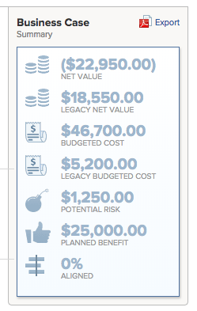

# 비즈니스 사례 승인

프로젝트 요청에 대한 비즈니스 사례를 완료하고 제출한 후 비즈니스 사례를 승인해야 합니다. 이는 조직의 워크플로에 따라 다릅니다. 비즈니스 사례를 승인하지 않아도 프로젝트를 시작할 수 있지만, Adobe Workfront 관리자 및 프로젝트 소유자는 그렇게 하는 것이 이상적이라고 생각하지 않을 수 있습니다. 

비즈니스 사례를 완료하고 제출하는 방법에 대한 자세한 내용은 [프로젝트에 대한 비즈니스 사례 만들기](../../../manage-work/projects/define-a-business-case/create-business-case.md) 문서를 참조하십시오.

## 액세스 요구 사항

이 문서의 단계를 수행하려면 다음 액세스 권한이 있어야 합니다.

<table style="table-layout:auto"> 
 <col> 
 <col> 
 <tbody> 
  <tr> 
   <td role="rowheader">Adobe Workfront 플랜*</td> 
   <td> <p>Pro 이상</p> </td> 
  </tr> 
  <tr> 
   <td role="rowheader">Adobe Workfront 라이센스*</td> 
   <td> <p>플랜 </p> </td> 
  </tr> 
  <tr> 
   <td role="rowheader">액세스 수준 구성*</td> 
   <td> <p>프로젝트에 대한 액세스 편집</p> <p>참고: 여전히 액세스 권한이 없는 경우 Workfront 관리자에게 액세스 수준에서 추가 제한을 설정하는지 문의하십시오. Workfront 관리자가 액세스 수준을 수정하는 방법에 대한 자세한 내용은 <a href="../../../administration-and-setup/add-users/configure-and-grant-access/create-modify-access-levels.md" class="MCXref xref">사용자 지정 액세스 수준 만들기 또는 수정</a>을 참조하십시오.</p> </td> 
  </tr> 
  <tr> 
   <td role="rowheader">개체 권한</td> 
   <td> <p>프로젝트에 대한 권한 관리</p> <p>추가 액세스 요청에 대한 자세한 내용은 <a href="../../../workfront-basics/grant-and-request-access-to-objects/request-access.md" class="MCXref xref">개체 </a>에 대한 액세스 요청 을 참조하십시오.</p> </td> 
  </tr> 
 </tbody> 
</table>

&#42;보유 중인 플랜, 라이선스 유형 또는 액세스 권한을 확인하려면 Workfront 관리자에게 문의하십시오.

## 비즈니스 사례 승인 개요

프로젝트의 비즈니스 사례를 승인할 때는 다음 사항을 고려하십시오.

* 비즈니스 사례를 승인하려면 프로젝트에 대한 관리 권한이 있어야 합니다. 
* 홈에서 승인을 통해 비즈니스 사례가 승인되기를 기다리고 있는 프로젝트를 볼 수 없습니다.
* 비즈니스 사례 승인이 필요한 개별 프로젝트로 직접 이동해야 승인 보류 중인지 확인할 수 있습니다. 프로젝트의 비즈니스 사례를 승인해야 한다고 경고하는 Workfront 알림 메커니즘이 없습니다.
* 프로젝트 보고서를 작성하거나 프로젝트 보고서와 연결된 포트폴리오에 액세스하여 비즈니스 사례 승인을 기다리고 있는 프로젝트를 찾을 수 있습니다. 

  Portfolio에 대한 자세한 내용은 문서 [Adobe Workfront의 Portfolio 개요](../../../manage-work/portfolios/portfolios-overview/portfolio-overview.md)를 참조하십시오.

## 프로젝트 보고서를 작성하여 비즈니스 사례 승인

프로젝트에 대한 보고서를 작성하여 비즈니스 사례 승인이 필요한 프로젝트를 확인할 수 있습니다. 

비즈니스 사례의 승인을 보류 중인 프로젝트에 대한 보고서를 작성하려면

1. 프로젝트에 대한 보고서를 만듭니다.

   보고서 만들기에 대한 자세한 내용은 문서 [사용자 지정 보고서 만들기](../../../reports-and-dashboards/reports/creating-and-managing-reports/create-custom-report.md)를 참조하세요.

1. 보고서의 **보기** 탭을 선택한 다음 **열 추가**&#x200B;를 클릭합니다.

1. **이 열에 표시** 필드에 &quot;상태&quot;를 입력하고 목록에 나타나면 이 필드를 선택하십시오.

    이 열에는 프로젝트의 상태가 표시됩니다.

1. 보고서의 **필터** 탭을 선택한 다음 **필터 규칙 추가**&#x200B;를 클릭합니다.

1. **다음 필드가 있는 프로젝트만 표시**&#x200B;에 &quot;상태&quot;를 입력하고 목록에 표시될 때 선택합니다.
1. 필터 수정자에 대해 **같음**&#x200B;을 선택하십시오.
1. 사용 가능한 필드에 &quot;요청됨&quot;을 입력하십시오. 

   이렇게 하면 요청됨 상태인 프로젝트만 보고서에 포함됩니다.

     

1. (선택 사항) **다른 필터 규칙 추가**&#x200B;를 클릭합니다.

   필터를 추가하여 자신이 프로젝트 소유자, 프로젝트 스폰서 또는 Portfolio 소유자인 프로젝트만 표시할 수 있습니다.

   예를 들어 다음 필터 문을 사용할 수 있습니다. 

   ```
   Project Sponsor ID Equals $$USER.ID
   ```

   프로젝트 스폰서로 지정된 프로젝트를 표시하려면

   ```
   Project Owner ID Equals $$USER.ID
   ```

   프로젝트 소유자로 지정된 프로젝트를 표시하려면

   ```
   Project Portfolio Owner ID Equals $$USER. ID
   ```

   Portfolio 관리자로 지정된 위치를 표시합니다. 

1. **저장+닫기**&#x200B;를 클릭합니다.

   보고서의 모든 프로젝트가 **요청됨** 상태입니다.

1. 보고서에서 프로젝트 이름을 클릭하여 엽니다.
1. 왼쪽 패널에서 **비즈니스 사례**&#x200B;를 클릭합니다.
1. 비즈니스 사례 요약 영역에서 **승인** 또는 **거부**&#x200B;를 클릭하여 비즈니스 사례를 승인하거나 거부합니다.

   

   비즈니스 사례가 승인되면 프로젝트 상태가 **승인됨**(으)로 변경됩니다.

   비즈니스 사례가 거부되면 프로젝트 상태가 **거부됨**(으)로 변경됩니다.

   >[!NOTE]
   >
   >비즈니스 사례의 승인을 제출한 사용자에게 프로젝트 요청이 승인되었는지 또는 거부되었는지 알려주는 알림이 없습니다.

## 포트폴리오의 요청된 프로젝트에 액세스하여 비즈니스 사례 승인

요청된 프로젝트 검토에 대한 자세한 내용은 문서 [요청된 프로젝트 검토](../../../manage-work/portfolios/create-and-manage-portfolios/review-requested-projects.md)를 참조하십시오.
