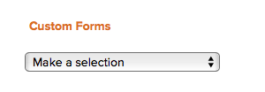

# 비즈니스 사례에 사용자 정의 양식 첨부

사용자 지정 Forms은 기존 Adobe Workfront 필드에 표시되지 않는 정보를 수집하는 데 사용됩니다. 

사용자 지정 Forms 만들기에 대한 자세한 내용은 문서 [사용자 지정 양식 만들기](/help/quicksilver/administration-and-setup/customize-workfront/create-manage-custom-forms/form-designer/design-a-form/design-a-form.md)를 참조하십시오.

## 액세스 요구 사항

<!--Audit: 06/2025-->

+++ 을 확장하여 이 문서의 기능에 대한 액세스 요구 사항을 봅니다.

<table style="table-layout:auto"> 
 <col> 
 <col> 
 <tbody> 
  <tr> 
   <td role="rowheader">
Adobe Workfront 플랜*
</td> 
   <td> 
현재: Prime 이상

   
레거시: Pro 이상
 </td> 
  </tr> 
  <tr> 
   <td role="rowheader">
Adobe Workfront 라이센스*
</td> 
   <td> 
   
현재: 표준 
 
   
레거시: 플랜 
 </td> 
  </tr> 
  <tr> 
   <td role="rowheader">액세스 수준 구성</td> 
   <td> 
프로젝트에 대한 액세스 편집
  </td> 
  </tr> 
  <tr> 
   <td role="rowheader">
개체 권한
</td> 
   <td> 
프로젝트에 대한 권한 이상 관리
  </td> 
  </tr> 
 </tbody> 
</table>

*자세한 내용은 [Workfront 설명서의 액세스 요구 사항](/help/quicksilver/administration-and-setup/add-users/access-levels-and-object-permissions/access-level-requirements-in-documentation.md)을 참조하십시오.

+++

## 프로젝트에 사용자 지정 Forms 첨부

다음 영역의 프로젝트에 사용자 지정 Forms을 첨부할 수 있습니다.

* 프로젝트를 편집할 때 프로젝트 세부 사항 섹션에서 확인할 수 있습니다.
* 프로젝트를 편집할 때 프로젝트 편집 상자에서 선택합니다.
* 여러 프로젝트를 일괄적으로 편집할 때 프로젝트 목록에서 가져옵니다.

  하나 이상의 프로젝트를 편집하는 동안 사용자 정의 양식을 프로젝트에 첨부하는 방법에 대한 자세한 내용은 문서 [프로젝트 편집](../../../manage-work/projects/manage-projects/edit-projects.md)을 참조하십시오.

* 프로젝트의 비즈니스 사례를 작성할 때 이 글에서 설명하는 비즈니스 사례에 해당합니다.

개체에 사용자 정의 양식을 첨부하는 방법은 [개체에 사용자 정의 양식 추가](../../../workfront-basics/work-with-custom-forms/add-a-custom-form-to-an-object.md)를 참조하십시오.

## 비즈니스 사례에 사용자 정의 Forms 첨부

에서 비즈니스 사례에 사용자 지정을 추가하려면 Workfront 관리자가 설정에서 이 옵션을 선택해야 합니다. 설정에서 사용자 정의 양식을 사용하는 방법에 대한 자세한 내용은 문서 [시스템 전체 프로젝트 환경 설정 구성](../../../administration-and-setup/set-up-workfront/configure-system-defaults/set-project-preferences.md)의 [시스템 전체 프로젝트 환경 설정 구성](../../../administration-and-setup/set-up-workfront/configure-system-defaults/set-project-preferences.md) 섹션을 참조하십시오.

사용자 정의 양식을 첨부하려면

1. 양식을 첨부할 프로젝트로 이동한 다음 왼쪽 패널에서 **비즈니스 사례**&#x200B;를 클릭합니다.

   비즈니스 사례가 표시됩니다.

1. **사용자 정의 양식** 섹션의 드롭다운 메뉴에서 첨부할 사용자 정의 양식을 선택합니다.

   <!---->

1. (선택 사항) **사용자 정의 양식 편집**&#x200B;을 선택합니다.\
   <!---->

1. (선택 사항) 사용자 정의 양식의 필드에 정보를 지정한 다음 **저장** 을 클릭합니다.
