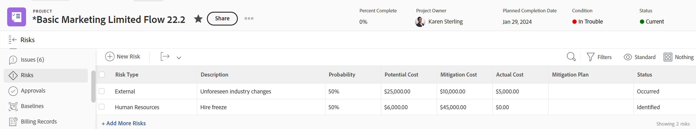

# 프로젝트에 대한 위험 만들기 및 편집

<!--Audited: 06/2025-->

<!--The highlighted information on this page refers to functionality not yet generally available. It is available only in the Preview environment for all customers. The same features will also be available in the Production environment for all customers after a week from the Preview release.    

For more information, see [Interface modernization](/help/quicksilver/product-announcements/product-releases/interface-modernization/interface-modernization.md). -->

위험은 프로젝트가 정시 또는 예산 내에서 완료되지 못하게 하는 가능한 이벤트 또는 요인입니다. 프로젝트의 비즈니스 사례를 만들 때 또는 위험 탭을 사용하여 위험을 기록할 수 있습니다.

프로젝트 또는 템플릿에 대해서만 위험을 만들 수 있습니다. 위험을 작업 또는 문제와 연결할 수 없습니다.

위험은 비용과 연관될 수 있지만 실제 위험 비용은 프로젝트의 실제 비용에 영향을 주지 않습니다.

>[!NOTE]
>
>이 문서에서는 프로젝트의 비즈니스 사례에서 정의하거나 프로젝트의 위험 탭에서 추가할 때 프로젝트와 관련된 위험을 정의합니다.
>
>프로젝트를 편집할 때 사용할 수 있는 위험 필드에 대한 자세한 내용은 [프로젝트 편집](../../../manage-work/projects/manage-projects/edit-projects.md)을 참조하십시오.

## 액세스 요구 사항

이 문서의 단계를 수행하려면 다음 액세스 권한이 있어야 합니다.

+++ 을 확장하여 이 문서의 기능에 대한 액세스 요구 사항을 봅니다.

<table style="table-layout:auto"> 
 <col> 
 <col> 
 <tbody> 
  <tr> 
   <td role="rowheader">
Adobe Workfront 플랜*
</td> 
   <td> 
현재 플랜:

   <ul><li>프로젝트의 위험 영역에 위험을 추가하는 모든 계획
</li>
   <li>
Prime 이상: 프로젝트의 비즈니스 사례에 위험 추가
</li></ul>
   
레거시 플랜: 모든 플랜

   </td> 
  </tr> 
  <tr> 
   <td role="rowheader">
Adobe Workfront 라이센스*
</td> 
   <td> 
현재: 표준 

   
레거시: 플랜 
 </td> 
  </tr> 
  <tr> 
   <td role="rowheader">
액세스 수준 구성
</td> 
   <td> 
프로젝트 및 재무 데이터에 대한 액세스 편집
 </td> 
  </tr> 
  <tr> 
   <td role="rowheader">
개체 권한
</td> 
   <td> 
 위험을 만들거나 편집할 프로젝트에 대한 재무 관리를 포함하는 권한을 관리합니다. 
 </td> 
  </tr> 
 </tbody> 
</table>

*자세한 내용은 [Workfront 설명서의 액세스 요구 사항](/help/quicksilver/administration-and-setup/add-users/access-levels-and-object-permissions/access-level-requirements-in-documentation.md)을 참조하십시오.

+++

## 비즈니스 사례에서 위험 생성 및 편집

프로젝트의 비즈니스 사례를 계획하는 과정의 일부로 위험을 생성할 수 있습니다. 예를 들어 가능성, 완화 계획 또는 비용이 변경되면 나중에 비즈니스 사례에서 편집할 수 있습니다. 비즈니스 사례 만들기에 대한 자세한 내용은 [프로젝트에 대한 비즈니스 사례 만들기](../../../manage-work/projects/define-a-business-case/create-business-case.md)를 참조하세요.

Workfront 관리자 또는 그룹 관리자는 프로젝트 환경 설정 영역에서 비즈니스 사례의 **위험** 섹션을 활성화해야 비즈니스 사례 섹션의 프로젝트 수준에서 볼 수 있습니다. 프로젝트 환경 설정 지정에 대한 자세한 내용은 [시스템 전체 프로젝트 환경 설정 구성](../../../administration-and-setup/set-up-workfront/configure-system-defaults/set-project-preferences.md)을 참조하십시오.

비즈니스 사례에서 위험을 생성하고 편집하는 것은 동일합니다.

비즈니스 사례에서 위험을 만들거나 편집하려면 다음을 수행하십시오.

1. 위험을 생성할 프로젝트로 이동합니다.
1. 왼쪽 패널에서 **비즈니스 사례**&#x200B;를 클릭합니다.
1. **위험** 섹션에서 **위험 편집**&#x200B;을 클릭하세요.
1. 다음 정보를 입력하거나 편집합니다.

   * **설명:**&#x200B;에서 위험을 설명합니다.

   * **잠재적 비용**: 위험이 발생할 경우 예상 비용을 나타냅니다.

   * **가능성**: 위험 발생 가능성을 백분율 값으로 나타냅니다.

   * **유형:**&#x200B;은(는) 위험이 속하는 범주를 나타냅니다.
   * **완화 계획**: 위험을 완화하기 위해 계획의 설명을 업데이트합니다.

   * **완화 비용**: 위험이 발생하지 않도록 하기 위해 사용해야 하는 완화 계획의 비용을 나타냅니다.

   

1. (선택 사항) 위험을 추가하려면 **다른 위험 추가**&#x200B;를 클릭합니다.
1. **저장**&#x200B;을 클릭합니다.

## 위험 영역에서 위험 만들기 및 편집

비즈니스 사례에서 위험을 만들고 편집하는 것 외에도 프로젝트의 **위험** 섹션을 사용하여 그렇게 할 수 있습니다.

프로젝트 또는 템플릿의 위험 섹션에서 위험을 만들고 편집할 수 있습니다. 템플릿에 대한 위험을 생성하는 것은 프로젝트에 대한 위험을 생성하는 것과 동일합니다.

### 위험 영역에서 위험 만들기 {#create-risks-in-the-risks-area}

1. 위험을 만들 프로젝트로 이동합니다.
1. 왼쪽 패널에서 **위험**&#x200B;을 클릭합니다.

   

1. **위험 추가 시작**&#x200B;을 클릭하고 정보를 인라인 편집하여 위험을 만드십시오. **설명**&#x200B;은(는) 필수 필드입니다

   또는

   **새 위험**&#x200B;을 클릭하세요.

   **새 위험** 상자가 열립니다.

   

1. (조건부) **새 위험** 상자에 위험을 추가하는 경우 다음 정보를 입력하십시오.

   * **설명**: 위험을 설명합니다. 필수 필드입니다.
   * **위험 유형**: 위험이 속하는 범주를 나타냅니다.\
     Workfront 관리자는 사용자 환경에서 사용할 수 있는 위험 유형을 정의합니다. 위험 유형 정의에 대한 자세한 내용은 문서 [위험 유형 편집 및 만들기](../../../administration-and-setup/set-up-workfront/configure-system-defaults/edit-create-risk-types.md)를 참조하십시오.

   * **가능성**: 위험 발생 가능성을 백분율 값으로 나타냅니다.
   * **잠재적 비용**: 위험이 발생할 경우 예상 비용을 나타냅니다.
   * **완화 비용**: 위험이 발생하지 않도록 하기 위해 사용해야 하는 완화 계획의 비용을 나타냅니다.
   * **실제 비용**: 위험이 발생한 경우 위험의 실제 비용을 나타냅니다.
   * **완화 계획**: 위험을 완화하기 위해 계획의 설명을 업데이트합니다.

1. (조건부) 인라인 위험을 만들려면 **Enter**&#x200B;를 클릭합니다.

   또는

   **새 위험** 상자에서 정보를 편집하는 경우 **저장**&#x200B;을 클릭합니다.

1. (선택 사항) 위험 목록에 대해 **표준** 보기를 적용할 때 **상태** 드롭다운 메뉴에서 다른 **상태**&#x200B;를 선택합니다.

   기본적으로 위험의 **상태**&#x200B;는 **식별됨**&#x200B;입니다.

### 위험 영역에서 위험 편집 {#edit-risks-in-the-risks-area}

예를 들어, 프로젝트 수명 중 확률, 잠재적 비용 또는 상태 등이 변경될 때 위험을 편집할 수 있습니다.

한 번에 하나의 위험을 편집할 수도 있고 여러 위험을 일괄적으로 편집할 수도 있습니다.

위험을 편집하려면:

1. 기존 위험을 편집할 프로젝트로 이동합니다.
1. 왼쪽 패널에서 **위험**&#x200B;을 클릭합니다.
1. 목록에 표시되는 위험의 필드를 인라인 편집을 시작하여 한 번에 하나의 위험을 편집합니다.

   또는

   하나 이상의 위험을 선택한 다음 **편집**&#x200B;을 클릭하여 여러 위험을 동시에 편집합니다.

   >[!NOTE]
   >
   >여러 위험을 동시에 편집할 때 선택한 모든 위험에 동일한 정보를 적용합니다. 변경 전 각 위험과 관련된 정보는 일괄 편집으로 덮어쓰여집니다.

1. **편집**&#x200B;을 클릭한 경우 **위험 편집** 또는 **위험 편집** 상자가 열립니다.

   다음 필드를 편집하는 것이 좋습니다.

   * **설명**: 위험에 대한 설명을 편집합니다.
   * **위험 유형**: 위험이 속하는 범주를 나타냅니다.
   * **가능성**: 위험 발생 가능성을 백분율 값으로 나타냅니다.
   * **잠재적 비용**: 위험이 발생할 경우 예상 비용을 나타냅니다.
   * **완화 비용**: 위험이 발생하지 않도록 하기 위해 사용해야 하는 완화 계획의 비용을 나타냅니다.
   * **실제 비용**: 위험이 발생한 경우 위험의 실제 비용을 나타냅니다.
   * **완화 계획**: 위험을 완화하기 위해 계획의 설명을 업데이트합니다.

1. **저장**&#x200B;을 클릭합니다.
1. (선택 사항) 위험 목록에 대한 **표준** 보기를 적용할 때 **상태** 드롭다운 메뉴에서 위험에 대한 **상태**&#x200B;를 편집합니다.

   >[!NOTE]
   >
   >**위험 편집** 대화 상자에서 **위험 상태**&#x200B;를 편집할 수 없습니다. 인라인 편집에서만 이 작업을 수행할 수 있습니다.
