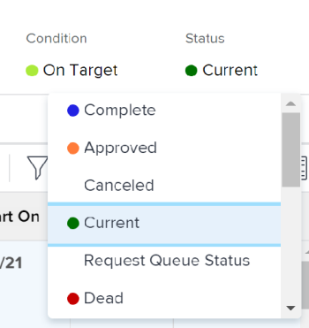

# 프로젝트 상태 변경

프로젝트의 상태를 수동으로 변경할 수 있습니다.

## 액세스 요구 사항

<!--drafted for P&P:

<table style="table-layout:auto"> 
 <col> 
 <col> 
 <tbody> 
  <tr> 
   <td role="rowheader">Adobe Workfront plan*</td> 
   <td> 
Any
 </td> 
  </tr> 
  <tr> 
   <td role="rowheader">Adobe Workfront license*</td> 
   <td> 
Current license: Standard 
 
   Or
   
Legacy license: Plan 

   </td> 
  </tr> 
  <tr> 
   <td role="rowheader">Access level configurations*</td> 
   <td> 
Edit access to Projects
 
<b>NOTE</b> If you still don't have access, ask your Workfront administrator if they set additional restrictions in your access level. For information on how a Workfront administrator can modify your access level, see <a href="../../../administration-and-setup/add-users/configure-and-grant-access/create-modify-access-levels.md" class="MCXref xref">Create or modify custom access levels</a>.
 </td> 
  </tr> 
  <tr> 
   <td role="rowheader">Object permissions</td> 
   <td> 
Manage permissions on the project
 
For information on requesting additional access, see <a href="../../../workfront-basics/grant-and-request-access-to-objects/request-access.md" class="MCXref xref">Request access to objects </a>.
 </td> 
  </tr> 
 </tbody> 
</table>
-->

이 문서의 절차를 수행하려면 다음 액세스 권한이 있어야 합니다.

<table style="table-layout:auto"> 
 <col> 
 <col> 
 <tbody> 
  <tr> 
   <td role="rowheader">Adobe Workfront 플랜*</td> 
   <td> 
모든
 </td> 
  </tr> 
  <tr> 
   <td role="rowheader">Adobe Workfront 라이선스*</td> 
   <td> 
플랜 
 </td> 
  </tr> 
  <tr> 
   <td role="rowheader">액세스 수준 구성*</td> 
   <td> 
프로젝트에 대한 액세스 편집
 
<b>참고</b> 여전히 액세스 권한이 없는 경우 Workfront 관리자에게 액세스 수준에서 추가 제한 사항을 설정하는지 문의하십시오. Workfront 관리자가 액세스 수준을 수정하는 방법에 대한 자세한 내용은 <a href="../../../administration-and-setup/add-users/configure-and-grant-access/create-modify-access-levels.md" class="MCXref xref">사용자 정의 액세스 수준 만들기 또는 수정</a>.
 </td> 
  </tr> 
  <tr> 
   <td role="rowheader">개체 권한</td> 
   <td> 
프로젝트에 대한 권한 관리
 
추가 액세스 요청에 대한 자세한 내용은 <a href="../../../workfront-basics/grant-and-request-access-to-objects/request-access.md" class="MCXref xref">개체에 대한 액세스 요청 </a>.
 </td> 
  </tr> 
 </tbody> 
</table>

&#42;어떤 계획, 라이선스 유형 또는 액세스 권한을 보유하고 있는지 알아보려면 Workfront 관리자에게 문의하십시오.

## 특정 상태로 업데이트할 때의 고려 사항

* **프로젝트를 완료하도록 업데이트할 때:** 프로젝트에서 모든 작업 및 문제가 완료되었는지 확인합니다. 프로젝트에 대해 완료되지 않은 작업이나 문제가 있는 경우, 프로젝트에 대한 완료 상태나 완료와 동일한 다른 상태는 선택할 수 없습니다. 여기에는 완료 대기 중인 승인 상태에 있는 작업 또는 문제 승인이 포함됩니다.
* **프로젝트를 완료(Complete)에서 현재(Current)로 업데이트할 때:** 프로젝트의 모든 작업과 문제가 완료되면 프로젝트의 완료 모드가 수동으로 설정되어 있는지 확인합니다. 프로젝트의 완료 모드가 자동이면 프로젝트의 상태는 완료로 유지됩니다.

## 프로젝트 상태 변경

1. 상태를 업데이트할 프로젝트로 이동합니다.
1. 프로젝트 헤더에서 **상태** 필드를 선택한 다음 새 상태를 선택합니다.

   

   또는

   을(를) 클릭합니다. **자세히** 메뉴  프로젝트 이름 옆에 있는 를 클릭하고 **편집** 에서 새 상태를 선택하고 **상태** 필드를 클릭한 다음 **저장**.

   프로젝트 상태가 선택한 상태로 업데이트됩니다.
