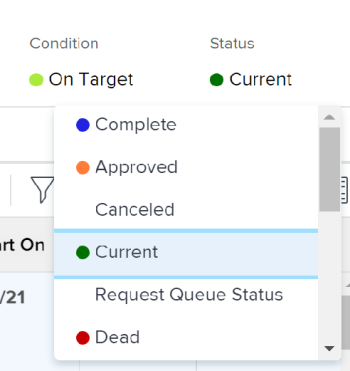

# 프로젝트 상태 변경

<!--Audited: 02/2024-->

필요한 경우 프로젝트의 상태를 다른 상태로 수동으로 업데이트할 수 있습니다.

프로젝트의 완료 모드가 수동으로 설정된 경우에만 프로젝트 상태를 완료와 동일한 상태로 수동으로 업데이트할 수 있습니다.

그렇지 않으면 프로젝트의 모든 작업과 문제가 완료되고 승인되면 Adobe Workfront에서 프로젝트를 자동으로 완료됨으로 표시합니다.

프로젝트의 완료 모드에 대한 자세한 내용은 [프로젝트 편집](/help/quicksilver/manage-work/projects/manage-projects/edit-projects.md)을 참조하세요.

## 액세스 요구 사항

+++ 이 문서의 기능에 대한 액세스 요구 사항을 보려면 확장하십시오.

<table style="table-layout:auto"> 
 <col> 
 <col> 
 <tbody> 
  <tr> 
   <td role="rowheader">Adobe Workfront 패키지</td> 
   <td> 
Any
 </td> 
  </tr> 
  <tr> 
   <td role="rowheader">Adobe Workfront 라이선스</td> 
   <td> 
표준
 
   
플랜

   </td> 
  </tr> 
  <tr> 
   <td role="rowheader">액세스 수준 구성</td> 
   <td> 
프로젝트에 대한 액세스 편집
 </td> 
  </tr> 
  <tr> 
   <td role="rowheader">개체 권한</td> 
   <td> 
프로젝트에 대한 권한 관리
 </td> 
  </tr> 
 </tbody> 
</table>

자세한 내용은 [Workfront 설명서의 액세스 요구 사항](/help/quicksilver/administration-and-setup/add-users/access-levels-and-object-permissions/access-level-requirements-in-documentation.md)을 참조하십시오.

+++

<!--
Old:

<table style="table-layout:auto"> 
 <col> 
 <col> 
 <tbody> 
  <tr> 
   <td role="rowheader">Adobe Workfront plan</td> 
   <td> 
Any
 </td> 
  </tr> 
  <tr> 
   <td role="rowheader">Adobe Workfront license*</td> 
   <td> 
New: Standard 
 
   Or
   
Current: Plan 

   </td> 
  </tr> 
  <tr> 
   <td role="rowheader">Access level configurations</td> 
   <td> 
Edit access to Projects
 </td> 
  </tr> 
  <tr> 
   <td role="rowheader">Object permissions</td> 
   <td> 
Manage permissions on the project
 </td> 
  </tr> 
 </tbody> 
</table>
-->

## 특정 상태로 업데이트에 대한 고려 사항

* **프로젝트를 완료로 업데이트할 때:** 프로젝트에서 모든 작업과 문제가 완료되었는지 확인하십시오. 프로젝트에 완료되지 않은 작업 또는 문제가 있는 경우 프로젝트에 대한 완료 상태 또는 완료와 동일한 다른 상태를 선택할 수 없습니다. 여기에는 완료 보류 중인 승인 상태에 있는 작업 또는 문제 승인이 포함됩니다.
* **프로젝트를 완료에서 현재 상태로 업데이트할 때:** 프로젝트의 모든 작업과 문제가 완료되면 프로젝트의 완료 모드가 수동으로 설정되어 있는지 확인하십시오. 프로젝트의 완료 모드가 자동이면 프로젝트의 상태는 완료 상태로 유지됩니다.

## 프로젝트 상태 변경

1. 상태를 업데이트할 프로젝트로 이동합니다.
1. 프로젝트 헤더에서 **상태** 필드의 상태 이름을 클릭한 다음 새 상태를 선택합니다.

   

   또는

   프로젝트 이름 옆에 있는 **자세히** 메뉴 를 클릭하고 **편집**&#x200B;을 클릭한 다음 **상태** 필드에서 새 상태를 선택한 다음 **저장**&#x200B;을 클릭합니다.

   프로젝트 상태가 선택한 상태로 업데이트됩니다.
