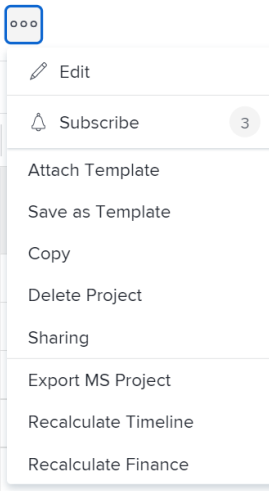

# 프로젝트 복사

<!--
<(LINKED TO THE PRODUCT IN THE COPY PROJECT BOX)

-->

프로젝트를 처음부터 만들지 않고 복사할 수 있습니다. 한 번에 하나의 프로젝트만 복사할 수 있습니다. 프로젝트를 일괄적으로 복사할 수 없습니다.

>[!IMPORTANT]
>
>다음 항목은 기존 프로젝트에서 새 프로젝트로 복사되지 않습니다.
>
>* 문제
>* 청구 요금
>* 청구 기록
>* 메모
>* 시간
>* 프로젝트 간 이전
>* 예산 시간
>
>다음 항목은 항상 기존 프로젝트에서 새 프로젝트로 복사됩니다.
>
>* 작업
>* 템플릿
>* 위험
>* 큐 설정 정보
>* Portfolio 및 프로그램
>* 스코어카드
>* 작업 기본 정보(작업 기본 승인 프로세스, 작업 기본 사용자 지정 Forms)
>

## 액세스 요구 사항

<!-- drafted for P&P:
<table style="table-layout:auto"> 
 <col> 
 <col> 
 <tbody> 
  <tr> 
   <td> 
Adobe Workfront plan*
 </td> 
   <td>Any</td> 
  </tr> 
  <tr> 
   <td> 
Adobe Workfront license*
 </td> 
   <td> 
Current license: Standard 
 
   Or
   
Legacy license: Plan 

   </td> 
  </tr> 
  <tr data-mc-conditions=""> 
   <td><strong>Access level configurations*</strong> </td> 
   <td> 
Edit access to Projects with ability to Create and Copy projects
 
<b>NOTE</b>
   
   If you still don't have access, ask your Workfront administrator if they set additional restrictions in your access level. For information on how a Workfront administrator can change your access level, see <a href="../../../administration-and-setup/add-users/configure-and-grant-access/create-modify-access-levels.md" class="MCXref xref">Create or modify custom access levels</a>.
 </td> 
  </tr> 
  <tr data-mc-conditions=""> 
   <td> 
<strong>Object permissions</strong> 
 </td> 
   <td> 
View permissions or higher to the project
 
For information on requesting additional access, see <a href="../../../workfront-basics/grant-and-request-access-to-objects/request-access.md" class="MCXref xref">Request access to objects </a>.
 </td> 
  </tr> 
 </tbody> 
</table>
-->
다음 항목이 있어야 합니다.

<table style="table-layout:auto"> 
 <col> 
 <col> 
 <tbody> 
  <tr> 
   <td> 
Adobe Workfront 플랜*
 </td> 
   <td>모든</td> 
  </tr> 
  <tr> 
   <td> 
Adobe Workfront 라이선스*
 </td> 
   <td> 
플랜 
 </td> 
  </tr> 
  <tr data-mc-conditions=""> 
   <td><strong>액세스 수준 구성*</strong> </td> 
   <td> 
생성 기능을 사용하여 프로젝트에 대한 액세스 편집 및 복사 프로젝트
 
<b>메모</b>

여전히 액세스 권한이 없는 경우 Workfront 관리자에게 액세스 수준에서 추가 제한 사항을 설정하는지 문의하십시오. Workfront 관리자가 액세스 수준을 변경하는 방법에 대한 자세한 내용은 <a href="../../../administration-and-setup/add-users/configure-and-grant-access/create-modify-access-levels.md" class="MCXref xref">사용자 정의 액세스 수준 만들기 또는 수정</a>.
 </td>
</tr> 
  <tr data-mc-conditions=""> 
   <td> 
<strong>개체 권한</strong> 
 </td> 
   <td> 
프로젝트에 대한 권한 보기 이상
 
추가 액세스 요청에 대한 자세한 내용은 <a href="../../../workfront-basics/grant-and-request-access-to-objects/request-access.md" class="MCXref xref">개체에 대한 액세스 요청 </a>.
 </td> 
  </tr> 
 </tbody> 
</table>

&#42;어떤 계획, 라이선스 유형 또는 액세스 권한을 보유하고 있는지 알아보려면 Workfront 관리자에게 문의하십시오.

## 단일 프로젝트 복사

프로젝트를 복사하면 원래 프로젝트의 일부 정보가 새 프로젝트에 복사됩니다. 복사 프로세스 중에 새 프로젝트에 복사하지 않아야 하는 항목을 지정할 수도 있습니다.

프로젝트를 복사하려면

1. 복사할 프로젝트로 이동하고 **자세히** 아이콘  프로젝트 이름의 오른쪽에 있습니다.

   

   또는

   프로젝트 목록 또는 보고서로 이동하고 프로젝트를 선택한 다음 **자세히** 아이콘  를 클릭합니다.

   

1. 클릭 **복사**.

1. 새 프로젝트의 이름을 업데이트합니다.

   기본적으로 새 이름은 입니다 **의 사본 `<Original project name>`.**

   

1. 을(를) 선택합니다 **상태** 새 프로젝트에 대해 설명합니다.

   기본적으로 **상태** 원래 프로젝트의 값과 일치합니다.

1. (선택 사항) 새 프로젝트에 복사하지 않으려는 항목을 선택 취소합니다. 다음 표에서는 항목을 선택 취소할 때 발생하는 내용을 설명합니다.

   <table style="table-layout:auto"> 
    <col> 
    <col> 
    <tbody> 
     <tr> 
      <td role="rowheader">모두 선택</td> 
      <td> 
모든 옵션을 선택하고 새 프로젝트에서 나열된 모든 필드와 개체를 지웁니다.
 
<b>팁</b>

   선택 취소 <strong>모두 선택</strong> 모든 항목을 선택 취소합니다. 
 </td>
   </tr> 
     <tr> 
      <td role="rowheader">할당</td> 
      <td>모든 프로젝트 및 작업 할당 제거</td> 
     </tr> 
     <tr> 
      <td role="rowheader">진행</td> 
      <td>모든 작업의 진행 상태를 제거하고 새 작업으로 표시합니다. </td> 
     </tr> 
     <tr> 
      <td role="rowheader">사용자 정의 데이터</td> 
      <td> 
프로젝트의 사용자 지정 양식에서 정보를 제거하고 다음 항목과 연결된 사용자 지정 양식에 대한 정보를 제거합니다.
 
       <ul> 
        <li>작업</li> 
        <li>경비</li> 
        <li> 문서</li> 
       </ul> 
<b>메모</b>

   사용자 지정 양식은 작업, 비용, 문서 및 프로젝트에 첨부되어 있지만 양식의 사용자 지정 필드에 있는 정보는 새 프로젝트에 복사되지 않습니다. 
 </td>
   </tr> 
     <tr> 
      <td role="rowheader">문서</td> 
      <td> 
문서 버전, 링크된 문서 및 폴더를 포함하여 문서 탭의 모든 항목을 제거합니다.
 
기본적으로 문서 증명 및 승인을 다른 프로젝트에 복사할 수 없습니다. 
 </td> 
     </tr> 
     <tr> 
      <td role="rowheader">모든 선행 작업</td> 
      <td> 
프로젝트의 작업 간에 모든 이전 관계를 제거합니다. 
 
<b>팁</b>

   프로젝트 간 선행 작업자는 이 옵션이 선택되어 있는지 여부에 관계없이 새 프로젝트로 전송되지 않습니다. 
 </td>
   </tr>

<tr> 
      <td role="rowheader">예산 시간</td> 
      <td> 
복사된 프로젝트에서 프로젝트 업무 사례의 Resource Planning 영역에 예산 책정된 시간을 제거합니다.

<b>메모</b>

시나리오 계획자를 사용하여 설정한 시간은 새 프로젝트가 시나리오 계획자의 이니셔티브에 연결되지 않으므로 새 프로젝트에 복사되지 않습니다. 자세한 내용은 <a href="../../../manage-work/projects/define-a-business-case/budget-resources-in-business-case-use-scenario-planner.md">시나리오 계획자를 사용하여 비즈니스 사례의 예산 자원</a>
</tr></td>
    <tr> 
      <td role="rowheader">재무 정보</td> 
      <td> 
다음 영역에서 정보를 제거합니다. 
 
       <ul> 
        <li>프로젝트의 재무 하위 탭</li> 
        <li> 비즈니스 사례의 계획된 이익</li> 
        <li>모든 작업의 재무 정보 </li> 
       </ul> 
프로젝트 재무 하위 탭에 대한 자세한 내용은 <a href="../../../manage-work/projects/project-finances/manage-project-finance-area.md" class="MCXref xref">프로젝트 재무 영역의 정보 관리</a>.
 </td> 
     </tr> 
     <tr> 
      <td role="rowheader">승인 진행</td> 
      <td>작업 또는 프로젝트와 관련된 모든 승인을 제거합니다. </td> 
     </tr> 
     <tr> 
      <td role="rowheader">미리 알림</td> 
      <td> 작업 또는 프로젝트와 관련된 미리 알림 을 제거합니다. </td> 
     </tr> 
     <tr> 
      <td role="rowheader">경비</td> 
      <td>작업 또는 프로젝트와 관련된 비용을 제거합니다. </td> 
     </tr> 
     <tr> 
      <td role="rowheader">권한</td> 
      <td> 작업 또는 프로젝트의 모든 사용자에 대한 권한을 제거합니다.</td> 
     </tr> 
    </tbody> 
   </table>

1. 클릭 **복사** 프로젝트 사본을 만들려면

   이렇게 하면 복사한 프로젝트와 유사한 새 프로젝트가 만들어집니다.

   검토 작업 지정 또는 타임라인 조정과 같이 복사한 새 프로젝트를 변경할 수 있습니다.
