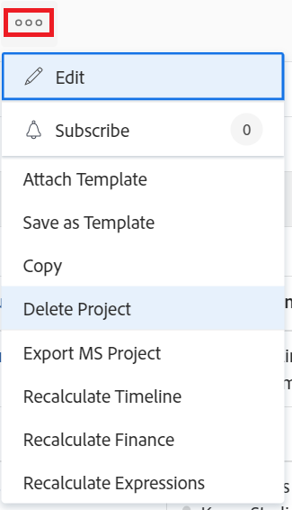

# 프로젝트 삭제

<!--Audited: 07/2024-->

프로젝트 및 해당 데이터가 더 이상 필요하지 않은 경우 프로젝트를 삭제할 수 있습니다.

프로젝트를 삭제하는 대신 프로젝트를 편집하고 상태를 완료 또는 중단으로 변경하는 것이 좋습니다. 이렇게 하면 사용자의 작업 목록에서 프로젝트와 관련된 현재 작업이 모두 제거되지만 프로젝트와 관련된 데이터가 모두 저장됩니다.

프로젝트 목록 또는 프로젝트 수준에서 프로젝트를 삭제할 수 있습니다.

## 액세스 요구 사항

+++ 이 문서의 기능에 대한 액세스 요구 사항을 보려면 확장하십시오.

<table style="table-layout:auto"> 
 <col> 
 <col> 
 <tbody> 
  <tr> 
   <td> 
Adobe Workfront 패키지
 </td> 
   <td>임의</td> 
  </tr> 
  <tr> 
   <td> 
Adobe Workfront 라이선스
 </td> 
   <td> 
표준

   
플랜
 
   </td> 
  </tr> 
    <td>액세스 수준 구성</td> 
   <td> 
프로젝트를 생성 및 삭제할 수 있는 프로젝트 액세스 편집
 </td> 
  </tr> 
    <td> 
개체 권한
 </td> 
   <td> 
프로젝트, 작업 및 문제 삭제 기능으로 프로젝트, 작업 및 문제에 대한 액세스 편집
 </td> 
  </tr> 
 </tbody> 
</table>

자세한 내용은 [Workfront 설명서의 액세스 요구 사항](/help/quicksilver/administration-and-setup/add-users/access-levels-and-object-permissions/access-level-requirements-in-documentation.md)을 참조하십시오.

+++

<!--Old:

<table style="table-layout:auto"> 
 <col> 
 <col> 
 <tbody> 
  <tr> 
   <td> 
Adobe Workfront plan
 </td> 
   <td>Any</td> 
  </tr> 
  <tr> 
   <td> 
Adobe Workfront license*
 </td> 
   <td> 
New license: Standard 

   
Current license: Plan 
 
   </td> 
  </tr> 
  <tr data-mc-conditions=""> 
   <td>Access level configuration</td> 
   <td> 
Edit access to Projects with ability to Create and Delete projects
 </td> 
  </tr> 
  <tr data-mc-conditions=""> 
   <td> 
Object permissions 
 </td> 
   <td> 
Edit access to Projects, Tasks, Issues with ability to Delete projects, tasks, and issues
 </td> 
  </tr> 
 </tbody> 
</table>-->

## 프로젝트 삭제 프로세스 이해

* [프로젝트 삭제 제한](#limitations-for-deleting-projects)
* [프로젝트 삭제의 영향](#the-impact-of-deleting-projects)

### 프로젝트 삭제 제한 사항  {#limitations-for-deleting-projects}

* 삭제된 항목은 30일 동안 휴지통으로 이동되며 Workfront 관리자만 복구할 수 있습니다.

  개체 복원에 대한 자세한 내용은 문서 [삭제된 항목 복원](../../../administration-and-setup/manage-workfront/manage-deleted-items/restore-deleted-items.md)을 참조하세요.

* 프로젝트에 기록된 시간이 있는 작업 또는 문제가 있는 경우 Workfront 또는 그룹 관리자는 사용자가 작업이 포함된 프로젝트를 삭제할 수 있도록 Workfront 인스턴스에서 작업 및 문제 환경 설정을 구성하여 이러한 작업을 삭제할 수 있도록 허용해야 합니다.

  시간이 기록된 작업, 문제 또는 프로젝트의 삭제를 활성화하는 방법에 대한 자세한 내용은 [시스템 전체 작업 및 문제 환경 설정 구성](../../../administration-and-setup/set-up-workfront/configure-system-defaults/set-task-issue-preferences.md)의 &quot;삭제&quot; 섹션을 참조하십시오.

  <!--
  
(NOTE: this bullet stays in NWE only forever)

  -->

### 프로젝트 삭제의 영향 {#the-impact-of-deleting-projects}

* 프로젝트를 삭제하면 프로젝트에 연결된 다른 오브젝트에 영향을 줍니다.

  프로젝트를 삭제하면 프로젝트에 첨부된 다음 개체도 삭제됩니다.

   * 문서

     첨부된 문서가 체크 아웃된 프로젝트는 삭제할 수 없습니다. 문서 체크 아웃에 대한 자세한 내용은 [문서 체크 아웃](../../../documents/managing-documents/check-out-documents.md)을 참조하십시오.

   * 작업
   * 하위 작업
   * 문제
   * 업데이트
   * 승인
   * 경비
   * 위험
   * 기준선
   * 비즈니스 사례 정보
   * 대기열 세부 정보
   * 청구 요율
   * 청구 기록

     청구됨 상태의 청구 기록이 있는 프로젝트는 삭제할 수 없습니다. 자세한 내용은 [청구 기록 만들기](../../projects/project-finances/create-billing-records.md)를 참조하십시오.

* Workfront 관리자가 Workfront 인스턴스의 타임시트 및 시간 환경 설정에서 프로젝트, 작업 또는 문제 삭제 환경 설정을 구성하는 방법에 따라, 작업, 문제 또는 프로젝트에 기록된 시간은 프로젝트를 삭제할 때 다음 방법 중 하나로 처리됩니다.

   * 시간은 타임시트에 일반 시간으로 유지됩니다.
   * 프로젝트가 복원되면 시간이 삭제되고 복원됩니다.

  문제에 기록된 시간에 대한 삭제 환경 설정을 구성하는 방법에 대한 자세한 내용은 [타임시트 및 시간 환경 설정 구성](../../../administration-and-setup/set-up-workfront/configure-timesheets-schedules/timesheet-and-hour-preferences.md)을 참조하십시오.

* 삭제한 프로젝트가 Workfront 시나리오 플래너의 이니셔티브에 연결되어 있는 경우:

   * 이니셔티브는 플랜에 남아 있지만 프로젝트에 대한 링크가 제거됩니다.
   * 삭제한 프로젝트가 플랜에서 게시된 유일한 이니셔티브에 연결되어 있는 경우 플랜이 게시되었다는 표시도 제거됩니다.
   * 삭제된 프로젝트를 복구하면 프로젝트가 복구되지만 이니셔티브에 대한 해당 링크가 복원되지 않고 시나리오 플래너 영역이 더 이상 프로젝트 세부 정보에 표시되지 않습니다.

     시나리오 플래너에는 추가 라이센스가 필요합니다. Workfront 시나리오 플래너에 대한 자세한 내용은 [시나리오 플래너 개요](../../../scenario-planner/scenario-planner-overview.md)를 참조하십시오.

     시나리오 플래너에서 이니셔티브에 연결된 프로젝트에 대한 자세한 내용은 [시나리오 플래너에서 이니셔티브를 게시하여 프로젝트 업데이트 또는 만들기](../../../scenario-planner/publish-scenarios-update-projects.md)를 참조하십시오.

* 프로젝트가 Workfront 목표의 목표에 대한 활동이기도 한 경우:

   * 프로젝트가 목표에서 삭제됩니다. 프로젝트에 의해 목표에 표시된 진행 상황도 제거됩니다.

   * 삭제된 프로젝트를 복구하면 프로젝트도 목표의 활동으로 복원됩니다.

     이를 위해서는 추가 라이센스가 필요합니다. Workfront 목표에 대한 자세한 내용은 [Adobe Workfront 목표 개요](../../../workfront-goals/goal-management/wf-goals-overview.md)를 참조하십시오.

     프로젝트를 목표와 연결하는 방법에 대한 자세한 내용은 [Adobe Workfront 목표의 목표에 프로젝트 추가](../../../workfront-goals/results-and-activities/connect-projects-to-goals-overview.md)를 참조하십시오.

## 목록에서 프로젝트 삭제

프로젝트 목록에서 프로젝트를 삭제할 수 있습니다.

1. 프로젝트 목록 또는 프로젝트 보고서로 이동합니다.
1. 삭제할 프로젝트를 선택한 다음 목록 맨 위에 있는 **삭제** 아이콘 을 클릭합니다.

1. **예, 삭제**&#x200B;를 클릭하여 삭제를 확인합니다.

   프로젝트는 삭제되고 30일 동안 휴지통에 저장됩니다. Workfront 관리자는 이 시간 동안 휴지통에서 삭제된 프로젝트를 복원할 수 있습니다.

## 프로젝트 수준에서 프로젝트 삭제

1. 삭제할 프로젝트로 이동합니다.
1. 프로젝트 이름의 오른쪽에 있는 **자세히** 아이콘 를 클릭한 다음 **프로젝트 삭제**&#x200B;를 클릭합니다.

   

1. **예, 삭제**&#x200B;를 클릭합니다.

   프로젝트가 삭제되고 30일 동안 휴지통에 저장됩니다. Workfront 관리자는 이 시간 동안 휴지통에서 복원할 수 있습니다.

## Workfront Planning 레코드의 연결된 레코드 페이지에서 프로젝트 삭제

>[!NOTE]
>
>이 섹션의 정보는 Adobe Workfront의 추가 기능인 Adobe Workfront Planning에 나와 있습니다.
>
>Workfront Planning에 액세스하기 위한 요구 사항 목록은 [Adobe Workfront Planning 액세스 개요](/help/quicksilver/planning/access/access-overview.md)를 참조하십시오.
> 
>Workfront Planning에 대한 일반적인 정보는 [Adobe Workfront Planning 시작](/help/quicksilver/planning/general/planning-overview.md)을 참조하십시오.

Workfront Planning 연결된 레코드 페이지에서 프로젝트에 액세스하고 삭제하려면 먼저 다음 사항이 있어야 합니다.

* Workfront 프로젝트에 연결된 레코드 유형 계획 자세한 내용은 [레코드 종류 연결](/help/quicksilver/planning/architecture/connect-record-types.md)을 참조하세요.
* 계획 레코드. 자세한 내용은 [레코드 만들기](/help/quicksilver/planning/records/create-records.md)를 참조하세요.
* Planning 레코드에 연결된 프로젝트를 표시하는 연결된 레코드 페이지입니다. 자세한 내용은 [레코드에 연결된 레코드 페이지 추가](/help/quicksilver/planning/records/add-a-connected-records-page-to-a-record.md)를 참조하십시오.

연결된 레코드 페이지에서 레코드를 삭제하려면 다음을 수행하십시오.

1. 레코드에 연결된 프로젝트를 표시하는 연결된 레코드 페이지에서 프로젝트 이름을 마우스로 가리킨 다음 **자세히** 아이콘 을 클릭합니다

   또는

   목록에서 프로젝트를 한 개 또는 여러 개 선택합니다. 프로젝트 목록 하단의 파란색 막대를 확인합니다.

1. **삭제**&#x200B;를 클릭한 다음 **삭제**&#x200B;를 클릭하여 확인합니다.

   프로젝트가 삭제되고 Workfront 휴지통에 보관됩니다.

## 삭제된 프로젝트 복원

시스템 또는 그룹 관리자는 [삭제된 항목 복원](../../../administration-and-setup/manage-workfront/manage-deleted-items/restore-deleted-items.md) 문서에 설명된 대로 프로젝트를 삭제한 후 30일 이내에 복원할 수 있습니다.
