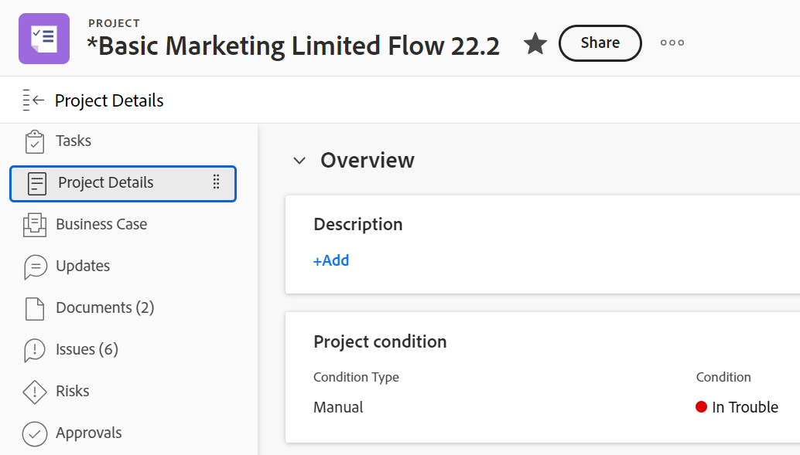
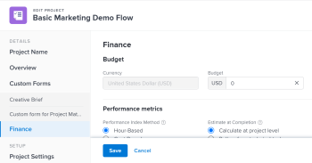
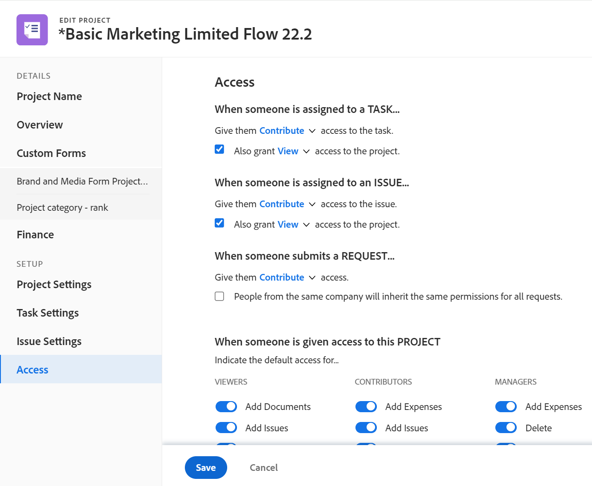

# 프로젝트 편집

이 페이지에서 강조 표시된 정보는 아직 일반적으로 사용할 수 없는 기능을 참조합니다. 미리보기 환경에서만 사용할 수 있습니다.

<!--

***Linked to many articles,

The Resource Pools part also duplicates in the "Working with Resource Pools" article 

The Update Type section is also documented in Selecting the Project Update Type article

Keep the reference link to the other article that also documents the Update Type) 

(NOTE 2: information described here also exists in these articles:

** Project Overview area

**Manage project Finance area

If you need to update just one field, check to see if that field is also listed there and update in both places.)

-->

Adobe Workfront에서 프로젝트를 필요한 만큼 자주 편집할 수 있습니다. 전체 프로젝트 팀에 변경 사항에 대한 알림을 보내 혼동을 피하기 위해 프로젝트를 현재 로 변경한 후 최소한의 편집으로 편집하는 것이 좋습니다. 프로젝트가 계획 수립 상태일 때 프로젝트를 편집하는 것이 가장 좋습니다. 프로젝트 팀에 대한 자세한 내용은 [프로젝트 팀 개요](../../../manage-work/projects/planning-a-project/project-team-overview.md).

## 액세스 요구 사항

<!--drafted - replace table at P&P:

<table style="table-layout:auto"> 
 <col> 
 <col> 
 <tbody> 
  <tr> 
   <td role="rowheader">Adobe Workfront plan*</td> 
   <td> 
Any
 </td> 
  </tr> 
  <tr> 
   <td role="rowheader">Adobe Workfront license*</td> 
   <td>
Current license: Standard 
 
   Or
   
Legacy license: Plan 
 </td> 
  </tr> 
  <tr> 
   <td role="rowheader">Access level configurations*</td> 
   <td> 
Edit access to Projects
 
If you still don't have access, ask your Workfront administrator if they set additional restrictions in your access level. For information about access to projects, see <a href="../../../administration-and-setup/add-users/configure-and-grant-access/grant-access-projects.md" class="MCXref xref">Grant access to projects</a>. For information on how a Workfront administrator can change your access level, see <a href="../../../administration-and-setup/add-users/configure-and-grant-access/create-modify-access-levels.md" class="MCXref xref">Create or modify custom access levels</a>. 
 </td> 
  </tr> 
  <tr> 
   <td role="rowheader">Object permissions</td> 
   <td> 
    <ul> 
     <li> 
Contribute permissions to a project to edit it in the Project Details area 
 </li> 
     <li> 
Manage permissions to a project to edit it in the Edit Project box
 </li> 
    </ul> 
 For information about project permissions, see <a href="../../../workfront-basics/grant-and-request-access-to-objects/share-a-project.md" class="MCXref xref">Share a project in Adobe Workfront</a>.
 
For information on requesting additional access, see <a href="../../../workfront-basics/grant-and-request-access-to-objects/request-access.md" class="MCXref xref">Request access to objects </a>.
 </td> 
  </tr> 
 </tbody> 
</table>
-->

이 문서의 단계를 수행하려면 다음 액세스 권한이 있어야 합니다.

<table style="table-layout:auto"> 
 <col> 
 <col> 
 <tbody> 
  <tr> 
   <td role="rowheader">Adobe Workfront 플랜*</td> 
   <td> 
모든
 </td> 
  </tr> 
  <tr> 
   <td role="rowheader">Adobe Workfront 라이센스*</td> 
   <td> 
플랜 
 </td> 
  </tr> 
  <tr> 
   <td role="rowheader">액세스 수준 구성*</td> 
   <td> 
프로젝트에 대한 액세스 편집
 
여전히 액세스 권한이 없는 경우 Workfront 관리자에게 액세스 수준에 추가 제한을 설정하는지 문의하십시오. 프로젝트 액세스에 대한 자세한 내용은 <a href="../../../administration-and-setup/add-users/configure-and-grant-access/grant-access-projects.md" class="MCXref xref">프로젝트에 대한 액세스 권한 부여</a>. Workfront 관리자가 액세스 수준을 변경하는 방법에 대한 자세한 내용은 <a href="../../../administration-and-setup/add-users/configure-and-grant-access/create-modify-access-levels.md" class="MCXref xref">사용자 정의 액세스 수준 만들기 또는 수정</a>. 
 </td> 
  </tr> 
  <tr> 
   <td role="rowheader">개체 권한</td> 
   <td> 
    <ul> 
     <li> 
프로젝트 세부 정보 영역에서 편집할 수 있는 권한을 프로젝트에 제공 
 </li> 
     <li> 
프로젝트 편집 상자에서 편집할 프로젝트에 대한 권한을 관리합니다.
 </li> 
    </ul> 
 프로젝트 권한에 대한 자세한 내용은 <a href="../../../workfront-basics/grant-and-request-access-to-objects/share-a-project.md" class="MCXref xref">Adobe Workfront에서 프로젝트 공유</a>.
 
추가 액세스 요청에 대한 자세한 내용은 <a href="../../../workfront-basics/grant-and-request-access-to-objects/request-access.md" class="MCXref xref">오브젝트에 대한 액세스 요청 </a>.
 </td> 
  </tr> 
 </tbody> 
</table>

*보유 중인 플랜, 라이선스 유형 또는 액세스 권한을 확인하려면 Workfront 관리자에게 문의하십시오.

## 프로젝트 편집 제한 사항

일부 제한 사항으로 인해 프로젝트를 편집할 수 없습니다.

프로젝트를 편집할 때 다음 사항을 고려하십시오.

* 승인 프로세스에 있는 프로젝트는 로깅 시간 외에는 편집할 수 없습니다.
* Workfront 관리자 또는 그룹 관리자가 프로젝트 환경 설정 영역에서 이 기능을 활성화한 경우에만 완료, 중단 또는 승인 보류 상태인 프로젝트에 문서 또는 템플릿을 첨부할 수 있습니다. 프로젝트 환경 설정 지정에 대한 자세한 내용은 [시스템 전체 프로젝트 환경 설정 구성](../../../administration-and-setup/set-up-workfront/configure-system-defaults/set-project-preferences.md).
* 중단 또는 완료 상태의 프로젝트에 대한 다음 정보만 편집할 수 있습니다.

   * 기존 경비를 수정합니다.
   * 사용자 정의 양식을 추가, 제거 또는 편집합니다.

## 프로젝트 편집

프로젝트를 편집하여 프로젝트에 대한 정보 및 설정뿐만 아니라 프로젝트의 작업 및 문제를 수정할 수 있습니다.

이 문서에 언급된 일부 설정은 프로젝트를 만든 템플릿의 상태에 따라 기본 상태에서 수정될 수 있습니다. 템플릿 편집에 대한 자세한 내용은 [프로젝트 템플릿 편집](../../../manage-work/projects/create-and-manage-templates/edit-templates.md).

1. 다음을 클릭합니다. **메인 메뉴** 아이콘  Adobe Workfront의 오른쪽 상단에서 을(를) 클릭한 다음 **프로젝트**.
1. (선택 사항) **내가 진행 중인 프로젝트** 또는 **내가 소유한 프로젝트** 오른쪽 상단 모서리에서 자신이 소유자인 프로젝트 또는 자신이 프로젝트 팀에 속해 있는 프로젝트를 표시할 수 있습니다.

   

1. 편집할 프로젝트의 이름을 클릭하여 프로젝트 페이지를 엽니다.

   >[!NOTE]
   >
   >그룹 관리자인 경우 그룹 영역과 프로젝트 영역에서 그룹의 프로젝트를 보고 편집할 수 있습니다. 자세한 내용은 [그룹의 프로젝트 만들기 및 수정](../../../administration-and-setup/manage-groups/work-with-group-objects/create-and-modify-a-groups-projects.md).

1. (선택 사항) 프로젝트에 대한 제한된 정보를 편집하려면 **프로젝트 세부 정보** 왼쪽 패널에서

   

   >[!NOTE]
   >
   >Workfront 관리자 또는 그룹 관리자가 레이아웃 템플릿을 수정한 방법에 따라 프로젝트 세부 정보 영역의 필드가 재배열되거나 표시되지 않을 수 있습니다. 자세한 내용은 [레이아웃 템플릿을 사용하여 세부 정보 보기 사용자 지정](../../../administration-and-setup/customize-workfront/use-layout-templates/customize-details-view-layout-template.md).

   세부 정보 섹션에서 정보를 편집하려면 다음 작업을 수행하십시오.

   1. (선택 사항) **모두 축소** 아이콘을 클릭하여 모든 영역을 축소할 수 있습니다.
   1. (선택 사항 및 조건부) 영역이 축소되면 **오른쪽 방향 화살표**  각 영역 옆에 있는 을 클릭하여 편집할 영역을 확장합니다.
   1. 프로젝트 세부 정보 탭에서 정보를 편집하는 방법에 대한 자세한 내용은 다음 문서를 참조하십시오.

      * [프로젝트 개요 영역에서 정보 관리](../../../manage-work/projects/manage-projects/understand-project-overview-area.md)
      * [프로젝트 재무 영역에서 정보 관리](../../../manage-work/projects/project-finances/manage-project-finance-area.md)
   1. (선택 사항) 사용자 정의 양식을 첨부하려면 **사용자 정의 양식 추가** 필드를 선택한 다음 목록에 표시될 때 선택하고 **변경 내용 저장**.
   1. (선택 사항) **내보내기** 아이콘  개요 및 사용자 정의 양식 정보를 PDF 파일로 내보내려면 **내보내기**. 다음 중에서 선택합니다.

      * 모두 선택(사용자 정의 양식이 하나 이상 첨부된 경우에만 표시됨)
      * 개요
      * 하나 이상의 사용자 정의 양식 이름

      PDF 파일이 컴퓨터로 다운로드됩니다.

      

      자세한 내용은 [사용자 정의 양식 및 개체 세부 정보 내보내기](../../../workfront-basics/work-with-custom-forms/export-custom-forms-details.md).
   프로젝트 세부 정보 섹션에 표시되는 필드에 대한 자세한 내용은 아래 설명된 대로 프로젝트 편집 상자에서 프로젝트를 계속 편집합니다.
1. 프로젝트에 대한 모든 정보를 편집하려면 **자세히** 메뉴  프로젝트 이름 옆에 있는 을(를) 클릭한 다음 **편집**.

   또는

   프로젝트 목록에서 프로젝트를 선택한 다음 **편집** 아이콘  목록의 맨 위에 있습니다.

   다음 **프로젝트 편집** 상자가 열립니다.

   >[!IMPORTANT]
   >
   >편집 옵션을 보려면 프로젝트에 대한 관리 권한이 있어야 합니다.

   모든 프로젝트 필드는 프로젝트 편집 상자에서 사용할 수 있으며 왼쪽 패널에 나열된 영역별로 그룹화됩니다.

   >[!NOTE]
   >
   >Workfront 관리자 또는 그룹 관리자가 레이아웃 템플릿을 수정한 방법에 따라 프로젝트 편집 상자의 왼쪽 패널에 있는 영역이나 이러한 영역에 나열된 필드가 재배열되거나 표시되지 않을 수 있습니다. 자세한 내용은 [레이아웃 템플릿을 사용하여 세부 정보 보기 사용자 지정](../../../administration-and-setup/customize-workfront/use-layout-templates/customize-details-view-layout-template.md).

1. (조건부) **자세히** 메뉴 및 다음 **편집**&#x200B;왼쪽 패널에 나열된 다음 영역 중 하나에서 정보를 업데이트하는 것이 좋습니다.

   * [프로젝트 이름](#project-name)
   * [개요](#overview)
   * [사용자 정의 양식](#custom-forms)
   * [재무](#finance)
   * [프로젝트 설정](#project-settings)
   * [작업 설정](#task-settings)
   * [문제 설정](#issue-settings)
   * [액세스](#access)

   >[!NOTE]
   >
   >Workfront 관리자가 프로젝트의 세부 정보 영역에 대해 레이아웃 템플릿을 설정하는 방법에 따라 프로젝트 편집 상자의 섹션 및 필드가 사용자 환경에서 다를 수 있습니다. 자세한 내용은 [레이아웃 템플릿을 사용하여 세부 정보 보기 사용자 지정](../../../administration-and-setup/customize-workfront/use-layout-templates/customize-details-view-layout-template.md).

### 프로젝트 이름 {#project-name}

1. 위에 설명된 대로 프로젝트 편집을 시작합니다.
1. 클릭 **프로젝트 이름** 왼쪽 패널에서

   

1. 프로젝트의 이름을 업데이트합니다.

   프로젝트를 일괄적으로 편집할 때는 프로젝트 이름을 편집할 수 없습니다.

### 개요 {#overview}

1. 위에 설명된 대로 프로젝트 편집을 시작합니다.
1. 클릭 **개요** 왼쪽 패널에서

   

1. 프로젝트에 대한 다음 정보를 업데이트합니다.

   <table style="table-layout:auto"> 
    <col> 
    <col> 
    <tbody> 
     <tr> 
      <td role="rowheader"><strong>설명</strong> </td> 
      <td> 
프로젝트에 대한 추가 정보를 추가합니다.
 </td> 
     </tr> 
     <tr> 
      <td role="rowheader"><strong>상태</strong> </td> 
      <td> 
프로젝트의 상태를 선택합니다. 모든 작업 및 문제가 완료되기 전에 프로젝트를 완료로 표시할 수 없습니다. 프로젝트 상태에 대한 자세한 내용은 <a href="../../../administration-and-setup/customize-workfront/creating-custom-status-and-priority-labels/project-statuses.md" class="MCXref xref">시스템 프로젝트 상태 목록 액세스</a>
 </td> 
     </tr> 
     <tr> 
      <td role="rowheader"><strong>우선 순위</strong> </td> 
      <td> 
 
이는 프로젝트의 우선 순위를 지정할 수 있도록 해 주는 시각적 플래그일 뿐입니다.
 
Workfront 관리자가 선택한 프로젝트 환경 설정에 따라 우선순위 이름이 다를 수 있습니다. 우선 순위 편집에 대한 자세한 내용은 <a href="../../../administration-and-setup/customize-workfront/creating-custom-status-and-priority-labels/create-customize-priorities.md" class="MCXref xref">우선 순위 만들기 및 사용자 지정</a>
 
 </td> 
     </tr> 
     <tr> 
      <td role="rowheader"><strong>URL</strong> </td> 
      <td> 
이 프로젝트에 대한 정보와 관련된 웹 링크를 지정하십시오.
 </td> 
     </tr> 
     <tr> 
      <td role="rowheader"><strong>상태 유형</strong> </td> 
      <td> 
다음 조건 유형 중에서 선택합니다. 
       <ul> 
       <li><strong>수동:</strong> 프로젝트 소유자는 프로젝트에 대한 조건을 수동으로 설정합니다.</li> 
       <li><strong>진행 상태:</strong> Workfront은 중요 경로에 있는 작업의 진행 상태를 기반으로 조건을 자동으로 설정합니다. 진행 상태 파악에 대한 자세한 내용은 <a href="../../../manage-work/tasks/task-information/task-progress-status.md" class="MCXref xref">작업 진행 상태 개요</a>.</li> 
       </ul>
Workfront 관리자 또는 그룹 관리자 시스템의 프로젝트 상태를 계산하는 방법에 대한 기본값을 선택합니다. 또는 내 그룹. 프로젝트 기본값 설정에 대한 자세한 내용은 <a href="../../../administration-and-setup/set-up-workfront/configure-system-defaults/set-project-preferences.md" class="MCXref xref">시스템 전체 프로젝트 환경 설정 구성</a>. 

 </td> 
     </tr> 
     <tr> 
      <td role="rowheader"><strong>상황</strong> </td> 
      <td> 
 
(를 선택한 후에만 표시됩니다. <strong>수동</strong> 대상: <strong>조건 유형</strong>): 프로젝트의 진행 방식을 나타내는 조건 을 선택합니다. 
 
프로젝트 상태를 자동 또는 수동으로 설정하는 방법에 대한 자세한 내용은 <a href="../../../manage-work/projects/manage-projects/project-condition-and-condition-type.md" class="MCXref xref">프로젝트 상태 및 상태 유형 개요</a>
 
 </td> 
     </tr> 
     <tr> 
      <td role="rowheader"><strong>일정 모드</strong> </td> 
      <td> 
프로젝트를 시작 일자에서 예약할지 또는 완료 일자에서 예약할지 지정합니다. 이 선택은 프로젝트에 대한 작업의 계획된 일자를 결정합니다. 
       <ul> 
       <li><strong>시작일</strong>: 프로젝트의 첫 번째 작업에 기본적으로 프로젝트와 계획된 시작 일자가 동일합니다. 작업 계획 시작 일자에 대한 자세한 내용은 <a href="../../../manage-work/tasks/task-information/task-planned-start-date.md" class="MCXref xref">작업 계획 시작 일자 개요</a>. 프로젝트 타임라인은 모든 작업의 기간을 기반으로 프로젝트의 시작 일자와 완료 일자에서 계산됩니다. </li> 
       <li><strong>완료 일자</strong>: 프로젝트의 마지막 작업이 프로젝트와 동일한 계획된 완료 일자를 갖습니다. 프로젝트 타임라인은 완료 일자에서 계산되며 프로젝트 시작 일자는 시스템이 프로젝트의 완료 일자에서 모든 작업의 기간을 빼서 계산합니다. </li> 
       </ul>
Workfront 관리자 또는 그룹 관리자 시스템 또는 그룹에 대한 기본 예약 모드 설정을 선택합니다. 프로젝트 기본값 설정에 대한 자세한 내용은 <a href="../../../administration-and-setup/set-up-workfront/configure-system-defaults/set-project-preferences.md" class="MCXref xref">시스템 전체 프로젝트 환경 설정 구성</a>.

 </td> 
     </tr> 
     <tr> 
      <td role="rowheader"><strong>계획된 시작 일자 및 시간</strong> </td> 
      <td> 
 
선택 시 날짜 지정 <strong>시작 날짜부터 예약</strong>.  
 
을(를) 선택하는 경우 읽기 전용 필드입니다 <strong>완료 일자부터 예약</strong>. 
 
 </td> 
     </tr> 
     <tr> 
      <td role="rowheader"><strong>계획된 완료 일자 및 시간</strong> </td> 
      <td> 
선택 시 날짜 지정 <strong>완료 일자부터 예약</strong>. 
 
을(를) 선택하는 경우 읽기 전용 필드입니다 <strong>시작 날짜부터 예약</strong>. 
 </td> 
     </tr> 
     <tr> 
      <td role="rowheader"><strong>포트폴리오</strong></td> 
      <td>프로젝트가 속한 Portfolio을 나타냅니다. 드롭다운 목록에 표시되기 전에 먼저 Portfolio을 만들어야 합니다. 활성 포트폴리오만 프로젝트와 연결할 수 있습니다. 포트폴리오 만들기에 대한 자세한 내용은 <a href="../../../manage-work/portfolios/create-and-manage-portfolios/create-portfolios.md" class="MCXref xref">포트폴리오 만들기 </a>.</td> 
     </tr> 
     <tr> 
      <td role="rowheader"><strong>프로그램</strong></td> 
      <td> 
프로젝트에 대한 Portfolio을 선택한 경우 프로젝트에 대한 프로그램을 지정합니다. 일부 Portfolio은 프로그램이 없을 수 있습니다. 이 드롭다운 목록에 표시되기 전에 먼저 프로그램을 만들어야 합니다. 활성 프로그램만 프로젝트와 연결할 수 있습니다. 
 
프로그램 만들기에 대한 자세한 내용은 <a href="../../../manage-work/portfolios/create-and-manage-programs/create-program.md" class="MCXref xref">프로그램 만들기</a>.
 </td> 
     </tr> 
     <tr> 
      <td role="rowheader"><strong>그룹</strong></td> 
      <td> 
 
프로젝트와 연계된 그룹의 이름을 지정합니다. 
필수 필드입니다. 그룹과 연결되지 않은 프로젝트는 가질 수 없습니다. 
 
마우스로 가리키고 정보 아이콘을 클릭하여 올바른 그룹을 선택하는지 확인할 수 있습니다  옆에 표시됩니다. 그룹 및 해당 관리자의 상위 그룹 계층과 같은 그룹에 대한 정보를 나열하는 도구 설명이 표시됩니다.
 기본적으로 다음 그룹 중 하나는 다른 그룹을 지정하지 않는 한 프로젝트를 만들 때 자동으로 연결됩니다.
 
       <ul> 
       <li> 
프로젝트 영역에서 프로젝트를 만들면 프로젝트 작성자의 홈 그룹이 프로젝트와 연결됩니다. 
 
이는 포트폴리오 또는 프로그램의 프로젝트 섹션에서 프로젝트를 만드는 경우에도 마찬가지입니다.
 </li> 
       <li> 
프로젝트를 설정 영역의 그룹 기본 페이지에서 만들면 해당 그룹이 프로젝트와 연결됩니다.
 </li> 
       </ul> 
 
  
 
프로젝트 또는 프로젝트 작업 또는 문제가 그룹 수준의 사용자 정의 상태를 사용하여 그룹 수준의 승인 프로세스와 이미 연결되어 있는 경우 그룹을 변경하면 이전 그룹의 승인 상태와 시스템 수준의 기존 승인 상태가 충돌할 수 있습니다. 그룹을 업데이트하기 전에 프로젝트에서 그룹 수준 승인 프로세스, 작업 또는 문제를 제거하는 것이 좋습니다. 그룹 수준 승인 프로세스를 만드는 방법에 대한 자세한 내용은 <a href="../../../administration-and-setup/manage-groups/work-with-group-objects/create-and-modify-groups-approval-processes.md" class="MCXref xref">그룹 수준 승인 프로세스</a>. 그룹 수준 사용자 지정 상태 만들기에 대한 자세한 내용은 <a href="../../../administration-and-setup/manage-groups/manage-group-statuses/create-or-edit-a-group-status.md" class="MCXref xref">그룹 상태 만들기 또는 편집</a>
 </td> 
     </tr> 
     <tr> 
      <td role="rowheader"><strong>회사</strong> </td> 
      <td> 
프로젝트와 연계된 회사를 지정합니다. 회사를 프로젝트와 연결하려면 먼저 회사를 만들어야 합니다. 활성 회사만 프로젝트와 연결할 수 있습니다. 회사 만들기에 대한 자세한 내용은 <a href="../../../administration-and-setup/set-up-workfront/organizational-setup/create-and-edit-companies.md" class="MCXref xref">회사 만들기 및 편집</a>.
 </td> 
     </tr> 
     <tr> 
      <td role="rowheader"><strong>프로젝트 소유자</strong> </td> 
      <td> 
프로젝트에 추가할 사용자 이름을 입력한 다음 목록에 표시될 때 선택합니다. 사용자는 프로젝트 팀에 추가되고 프로젝트에 대한 관리 권한이 자동으로 부여됩니다. 프로젝트 소유자로 지정된 사용자는 Workfront 활성 사용자여야 합니다.

      </td> 
     </tr> 
     <tr> 
      <td role="rowheader"><strong>프로젝트 스폰서</strong> </td> 
      <td> 
프로젝트에 추가할 사용자 이름을 입력한 다음 목록에 표시될 때 선택합니다. 사용자는 프로젝트 팀에 추가되고 프로젝트에 대한 보기 권한이 자동으로 부여됩니다. 프로젝트 스폰서로 지정된 사용자는 Workfront 활성 사용자여야 합니다. 
 </td> 
     </tr> 
     <tr> 
      <td role="rowheader"><strong>리소스 관리자</strong> </td> 
      <td> 
 프로젝트에 추가할 사용자 이름을 입력한 다음 목록에 표시될 때 선택합니다. 사용자는 프로젝트 팀에 추가되고 프로젝트에 대한 관리 권한이 자동으로 부여되며 프로젝트의 작업 및 문제에 리소스를 할당할 수 있습니다. 사용자는 리소스 관리자 필드에서 제거되더라도 프로젝트에 대한 관리 권한을 유지 관리합니다. 리소스 관리자를 두 개 이상 지정할 수 있습니다. 
 </td> 
     </tr> 
    </tbody> 
   </table>

   >[!TIP]
   >
   >프로젝트 소유자, 프로젝트 스폰서 및 리소스 관리자 필드를 업데이트할 때 아바타, 사용자의 기본 역할 또는 이메일 주소에 따라 이름이 동일한 사용자를 구별하십시오. 사용자를 추가할 때 이를 보려면 사용자를 하나 이상의 작업 역할과 연결해야 합니다.

1. (선택 사항) 수정할 정보에 따라 다음 섹션을 계속 편집합니다.

   또는

   **저장**&#x200B;을 클릭합니다.

### 사용자 정의 양식 {#custom-forms}

액세스 수준 및 프로젝트에 대한 권한에 따라 다음 시나리오가 존재합니다.

* 프로젝트에 대한 사용자 정의 양식 편집 권한이 없는 경우 첨부된 사용자 정의 양식의 필드를 편집할 수 없습니다. 프로젝트에 첨부된 사용자 정의 양식의 필드만 볼 수 있습니다.
* 사용자 정의 양식의 섹션에 대한 보기(편집 아님) 액세스 권한이 있는 경우 해당 섹션의 필드를 편집할 수 없습니다.
* 프로젝트에 첨부된 사용자 정의 양식 중 하나에 대한 섹션에 대한 액세스 권한이 없는 경우 섹션이 프로젝트 편집 상자에 표시되지 않습니다.

두 개 이상의 프로젝트를 선택하여 일괄적으로 편집하는 경우 다음과 같은 시나리오가 있습니다.

* 선택한 프로젝트 중 하나 이상에 대해 사용자 정의 양식 편집 권한이 없는 경우 첨부된 사용자 정의 양식의 필드를 편집할 수 없습니다. 첨부된 사용자 정의 양식의 필드만 볼 수 있습니다.
* 사용자 정의 양식의 섹션에 대한 보기(편집 아님) 액세스 권한이 있는 경우 해당 섹션의 필드를 편집할 수 없습니다. 해당 섹션의 필드만 볼 수 있습니다.
* 하나 이상의 프로젝트에 첨부된 사용자 정의 양식 중 하나의 섹션에 대한 액세스 권한이 없는 경우 섹션이 프로젝트 편집 상자에 표시되지 않습니다.

사용자 정의 양식 액세스에 대한 자세한 내용은 다음 문서를 참조하십시오.

* [사용자 정의 양식 공유](../../../administration-and-setup/customize-workfront/create-manage-custom-forms/share-access-to-a-custom-form.md)
* [사용자 정의 양식에 섹션 구분 추가](../../../administration-and-setup/customize-workfront/create-manage-custom-forms/add-a-section-break-to-a-custom-form.md)

사용자 정의 양식에 대한 정보를 편집하려면:

1. 위에 설명된 대로 프로젝트 편집을 시작합니다.
1. 클릭 **사용자 지정 Forms** 왼쪽 패널에서

   

1. 다음을 클릭합니다. **사용자 정의 양식 추가** 을 클릭하고 목록에서 프로젝트에 첨부할 양식을 선택합니다. 기본적으로 처음 40개 양식은 알파벳 순서로 표시됩니다. 목록에 양식이 표시되지 않으면 해당 이름을 입력한 다음 목록에 표시될 때 선택합니다.

   >[!NOTE]
   >
   >이 필드에서 사용자 정의 양식을 선택하려면 먼저 사용자 정의 양식을 작성해야 합니다. 활성 사용자 정의 양식만 목록에 표시됩니다. 사용자 정의 양식 작성에 대한 자세한 내용은 [사용자 정의 양식 만들기 또는 편집](../../../administration-and-setup/customize-workfront/create-manage-custom-forms/create-or-edit-a-custom-form.md). 프로젝트에 최대 10개의 사용자 정의 양식을 추가할 수 있습니다.

1. (조건부) 사용자 정의 양식을 프로젝트에 첨부한 경우 양식의 모든 필드를 편집합니다. 프로젝트를 저장하려면 모든 필수 필드를 지정해야 합니다.
1. (선택 사항) **X 아이콘** 사용자 정의 양식 이름 오른쪽에 있는 을 클릭하여 제거한 다음 **제거**.
1. (선택 사항) 수정할 정보에 따라 다음 섹션을 계속 편집합니다

   또는

   **저장**&#x200B;을 클릭합니다.

### 재무 {#finance}

액세스 수준 및 프로젝트에 대한 권한에 따라 다음 시나리오가 존재합니다.

* 프로젝트에 대한 재무 데이터 보기 액세스 권한 및 재무 보기 권한이 있는 경우 재무 섹션의 필드만 볼 수 있습니다. 이 섹션의 필드는 편집할 수 없습니다.
* 프로젝트에 대한 재무 데이터 편집 액세스 권한 및 재무 관리 권한이 있는 경우 이 섹션의 필드를 업데이트할 수 있습니다.

두 개 이상의 프로젝트를 선택하여 일괄적으로 편집할 때 다음과 같은 시나리오가 있습니다.

* 재무 보기 권한이 있는 프로젝트를 하나 이상 선택한 경우(재무 관리 대신) 선택한 모든 프로젝트에 대해 이 섹션의 필드만 볼 수 있습니다. 재무 섹션의 필드는 벌크 편집할 수 없습니다.
* 재무 권한이 없는 프로젝트를 하나 이상 선택하면 이 섹션이 전혀 표시되지 않습니다.

재무 영역의 필드를 편집하려면:

1. 위에 설명된 대로 프로젝트 편집을 시작합니다.
1. 클릭 **재무** 왼쪽 패널에서

   

1. 프로젝트에 대한 다음 재무 정보를 갱신합니다.

   <table style="table-layout:auto"> 
    <col> 
    <col> 
    <tbody> 
     <tr data-mc-conditions=""> 
      <td role="rowheader"><strong>통화</strong> </td> 
      <td> 
 
프로젝트의 통화가 시스템의 기본 통화와 다른 경우 통화를 지정합니다. 프로젝트에 대한 재무 정보가 이미 있는 경우 프로젝트의 통화를 변경할 수 없습니다. 시스템에 기본 통화만 있는 경우에는 이 필드가 표시되지 않습니다. 
 
통화에 대한 자세한 내용은 <a href="../../../administration-and-setup/manage-workfront/exchange-rates/set-up-exchange-rates.md" class="MCXref xref">환율 설정</a>. 
 
 </td> 
     </tr> 
     <tr> 
      <td role="rowheader"><strong>예산</strong> </td> 
      <td> 
프로젝트에 대한 예산을 지정합니다. 
 </td> 
     </tr> 
     <tr> 
      <td role="rowheader"><strong>성과 지수 방법</strong> </td> 
      <td> 
선택 <b>시간 기반</b>, 또는 <b>비용 기반</b> 프로젝트의 성과 지표(예: 비용 성과 지표 또는 예상 실제 비용)가 시간 또는 비용을 사용하여 계산되는지 여부를 나타냅니다. 
 
성과 지수 방법에 대한 자세한 내용은 <a href="../../../manage-work/projects/project-finances/set-pim.md" class="MCXref xref">PIM(성과 지표 메서드) 설정</a>. 
 
Workfront 관리자 또는 그룹 관리자 시스템 또는 그룹에 대한 기본 성과 지수 방법 설정을 선택합니다. 프로젝트 기본값 설정에 대한 자세한 내용은 <a href="../../../administration-and-setup/set-up-workfront/configure-system-defaults/set-project-preferences.md" class="MCXref xref">시스템 전체 프로젝트 환경 설정 구성</a>.
 </td> 
     </tr> 
     <tr> 
      <td role="rowheader"><strong>완료 시점 예측</strong> </td> 
      <td> 
 
Workfront에서 EAC(완료 시 추정 비용)를 계산하는 방법을 지정합니다. 

      다음 옵션 중에서 선택합니다. 
      <ul><li><b>프로젝트 수준에서 계산</b></li>
      <li><b>작업/하위 작업에서 롤업</b></li> </ul>
      
완료 시 추정 값이 계산되는 방법에 대한 자세한 내용은 <a href="../../../manage-work/projects/project-finances/calculate-eac.md" class="MCXref xref">EAC(완료 시 추정 비용) 계산</a>.
 
Workfront 또는 그룹 관리자는 시스템 또는 그룹에 대해 기본 완료 시 예상 설정을 선택합니다. 프로젝트 기본값 설정에 대한 자세한 내용은 <a href="../../../administration-and-setup/set-up-workfront/configure-system-defaults/set-project-preferences.md" class="MCXref xref">시스템 전체 프로젝트 환경 설정 구성</a>.
 
 </td> 
     </tr> 
     <tr> 
      <td role="rowheader"><strong>계획된 이익</strong> </td> 
      <td> 
프로젝트의 계획된 이익을 예측합니다. 프로젝트 및 Portfolio 최적기의 비즈니스 사례에서 사용됩니다. 프로젝트의 계획된 편익에 대한 자세한 내용은 <a href="../../../manage-work/projects/project-finances/project-planned-benefit.md" class="MCXref xref">프로젝트 계획 이익 개요</a>. 프로젝트의 순 가치 계산 시 프로젝트의 계획된 이익이 고려됩니다. 
 
자세한 내용은 <a href="../../../manage-work/portfolios/portfolio-optimizer/manage-projects-in-portfolio-optimizer.md" class="MCXref xref">Portfolio 최적화 도구에서 프로젝트 관리</a> . 
 </td> 
     </tr> 
     <tr> 
      <td role="rowheader"><strong>실제 이익</strong> </td> 
      <td> 
프로젝트의 실제 이익 예측. 이 프로젝트가 완료된 후 회사 또는 부서에서 얻을 수 있는 혜택을 나타내는 통화 금액입니다. 
 </td> 
     </tr> 
      <tr> 
      <td role="rowheader"><strong>고정 비용</strong> </td> 
      <td> 
프로젝트에 대한 고정 비용을 지정합니다. 이는 프로젝트의 시간에 따라 발생하는 인건비와 프로젝트의 경비 금액에 따라 발생하는 경비가 다릅니다. 프로젝트의 고정 비용은 프로젝트의 순 가치를 계산할 때 고려되며 예산 비용의 일부입니다. 
 </td> 
     </tr> 
     <tr> 
      <td role="rowheader"><strong>고정 수입</strong> </td> 
      <td> 
프로젝트에 대한 고정 수익을 지정합니다. 
 </td> 
     </tr> 
    </tbody> 
   </table>

1. (선택 사항) 수정할 정보에 따라 다음 섹션을 계속 편집합니다.

   또는

   **저장**&#x200B;을 클릭합니다.

### 프로젝트 설정 {#project-settings}

1. 위에 설명된 대로 프로젝트 편집을 시작합니다.
1. 클릭 **프로젝트 설정** 왼쪽 패널에서

   

1. 다음 정보를 업데이트합니다.

   <table style="table-layout:auto"> 
      <col> 
      <col> 
      <tbody> 
      <tr> 
      <td role="rowheader"><strong>마일스톤 경로</strong> </td> 
       <td> 
프로젝트에 대한 마일스톤 경로를 선택합니다. 활성 마일스톤 경로만 목록에 표시됩니다.
 
마일스톤 경로에 대한 자세한 내용은 <a href="../../../administration-and-setup/customize-workfront/configure-approval-milestone-processes/create-milestone-path.md" class="MCXref xref">마일스톤 경로 만들기</a>.
 </td> 
      </tr> 
      <tr> 
      <td role="rowheader"><strong>완료 모드</strong> </td> 
      <td> 
프로젝트가 완료로 표시되는 방식을 제어합니다. 다음 옵션 중에서 선택합니다. 
       <ul> 
       <li>
<strong>자동</strong>: 모든 작업 및 문제가 완료되면 프로젝트가 완료 로 표시됩니다.

작업이 완료될 때 프로젝트 상태가 현재인 경우에만 프로젝트 상태가 완료로 자동 변경됩니다. 
</li> 
       <li><strong>수동</strong>: 모든 작업 및 문제가 완료되면 프로젝트에 대한 완료 상태를 수동으로 선택해야 합니다.</li> 
       </ul>
 </td> 
       </tr> 
       <tr> 
       <td role="rowheader"><strong>요약 완료 모드</strong></td> 
       <td> 
상위 작업이 완료로 표시되는 방식을 제어합니다. 다음 옵션 중에서 선택합니다. 
       <ul> 
       <li><strong>자동</strong>: 하위 작업이 완료되고 하위 작업의 완료율이 업데이트됨에 따라 상위 작업이 완료로 표시되고 완료율이 자동으로 업데이트됩니다. </li> 
       <li><strong>수동</strong>: 하위 작업의 변경 사항과 관계없이 완료율 및 상위 작업의 상태를 수동으로 업데이트해야 합니다.</li> 
       </ul>
 </td> 
       </tr> 
       <tr> 
       <td role="rowheader"><strong>업데이트 유형</strong></td> 
       <td> 
프로젝트 타임라인에 적용한 변경 내용이 프로젝트 또는 상위 작업에 저장되는 시점을 제어합니다. 예를 들어 프로젝트에 대한 다음 변경 사항은 프로젝트의 타임라인에 대한 업데이트를 트리거합니다. 
       <ul> 
       <li>작업 날짜 업데이트</li> 
       <li>작업의 전임 작업 관계 변경</li> 
       <li>
작업 제한이나 기간 유형을 변경하는 것 외에 할당을 추가 또는 제거하는 상위-하위 관계를 변경합니다.

작업이 업데이트되면 해당 상위 개체(상위 작업 또는 프로젝트)가 업데이트 유형에 표시된 시점에 업데이트됩니다. 

"자동 및 변경 시" 또는 "변경만" 업데이트 유형을 선택할 때 상위 객체가 변경 직후 업데이트되지 않으면 페이지를 새로 고칩니다.

다음 옵션 중에서 선택합니다. 

- <strong>자동 및 변경 시</strong> (기본 설정): 프로젝트 또는 프로젝트가 종속된 다른 프로젝트에서 변경 사항이 발생할 때마다(변경 시) 프로젝트 타임라인이 업데이트됩니다. 프로젝트 타임라인은 매일 밤 자동 업데이트됩니다.

이 설정은 프로젝트가 항상 최신 상태로 유지되도록 하기 때문에 이 필드에 권장되는 설정입니다.

타임라인 재계산을 트리거하는 작업 또는 프로젝트에 작업을 수행하면 사용 가능한 모든 날짜가 즉시 표시되어 작업을 계속할 수 있습니다. 작업이 100개를 초과하는 프로젝트의 경우 더 긴 재계산이 필요한 날짜가 물음표로 짧게 표시됩니다(1초에서 5초 사이 또는 큰 프로젝트의 경우 최대 1분). 이는 재계산이 아직 완료되지 않았으며, 날짜가 변경될 수 있음을 나타냅니다.

- <strong>변경만</strong>: 프로젝트 또는 프로젝트가 종속된 다른 프로젝트에서 변경 사항이 발생할 때마다 프로젝트 타임라인이 업데이트됩니다. 프로젝트 또는 타임라인이 종속된 다른 프로젝트에서 변경 사항이 거의 발생하지 않는 경우 이 옵션을 선택할 수 있습니다.

- <strong>자동만</strong>: 프로젝트 타임라인은 매일 밤 업데이트되며, 변경 후 타임라인은 즉시 업데이트되지 않습니다.

프로젝트 또는 타임라인이 종속된 다른 프로젝트에서 매일 많은 변경 사항이 발생하는 경우 이 옵션을 선택할 수 있습니다. 그러나 프로젝트가 변경과 동시에 업데이트되지 않으므로 이 설정을 선택했다는 점에 유의하십시오.

- <strong>수동만</strong>: 타임라인을 다시 계산하는 옵션을 선택하는 경우에만 프로젝트 타임라인이 업데이트됩니다. 프로젝트 타임라인을 수동으로 다시 계산하는 방법에 대한 자세한 내용은 <a href="../../../manage-work/projects/manage-projects/recalculate-project-timeline.md" class="MCXref xref">프로젝트 타임라인 다시 계산</a>. 

한 번에 프로젝트를 여러 번 변경하고, 각 개별 변경 내용이 아닌 모든 변경 내용이 적용된 후에 타임라인 재계산을 수행하려는 경우 이 옵션을 선택할 수 있습니다.
</li> 
       </ul>
 </td> 
       </tr> 
       <tr> 
       <td role="rowheader"><strong>일정</strong> </td> 
       <td> 
프로젝트의 일정을 선택합니다. 프로젝트에서 작업 중인 대부분의 사람에게 할당된 일정과 동일해야 합니다. 일정을 프로젝트 또는 사용자에게 할당하려면 먼저 일정을 만들어야 합니다. 시스템에서 사용자 정의 일정을 작성하지 않은 경우 기본 일정이 선택됩니다.
 
일정 만들기에 대한 자세한 내용은 <a href="../../../administration-and-setup/set-up-workfront/configure-timesheets-schedules/create-schedules.md" class="MCXref xref">일정 만들기</a>. 
 </td> 
       </tr> 
       <tr> 
       <td role="rowheader"><strong>사용자 휴무</strong> </td> 
       <td> 
작업의 기본 피할당자의 휴무 시간이 프로젝트의 작업 계획 날짜를 조정하는지 여부를 결정합니다. 

Workfront 관리자 또는 그룹 관리자 시스템의 이 설정에 대한 기본값을 선택합니다. 또는 내 그룹. 프로젝트 기본값 설정에 대한 자세한 내용은 <a href="../../../administration-and-setup/set-up-workfront/configure-system-defaults/set-project-preferences.md" class="MCXref xref">시스템 전체 프로젝트 환경 설정 구성</a>. 

다음 옵션 중에서 선택합니다. - <strong>작업 기간에서 사용자 휴가 고려</strong>: 이 옵션을 선택하면 작업 기간 동안 휴무가 발생하는 경우 작업의 계획된 일자가 작업의 기본 할당자의 휴무 시간에 따라 조정됩니다. 

예를 들어, 제한이 있는 작업이 가능한 한 빨리 6월 1일에 시작하여 6월 3일에 완료되도록 예약되어 있고 기본 피할당자가 6월 2일에 휴무로 표시된 경우, 이 선택이 활성화되면 작업 계획 일자는 6월 1일부터 6월 4일까지입니다. Task Constraint에 따라 다음과 같은 시나리오가 있습니다. 
 
       <ul> 
       <li>시작 일자(가능한 한 빨리, 가능한 가장 빠른 가용 시간, 다음 일자 이전에 시작, 다음 일자 이후에 시작, 다음 일자에 시작 필수)로부터의 계획과 관련된 작업 제한의 경우 계획된 시작 일자는 변경되지 않지만 계획된 완료 일자는 변경됩니다.</li> 
       <li>완료 일자(가능한 한 늦게, 가장 최근 가용 시간, 다음 이전에 완료, 다음 이후에 완료, 다음 일자에 완료)로부터의 계획과 관련된 작업 제한의 경우 계획된 완료 일자는 변경되지 않지만 계획된 시작 일자는 변경됩니다.</li> 
       <li>고정 일자 제한이 있는 작업의 경우 계획된 시작 일자와 완료 일자 모두 변경되지 않습니다. </li> 
       </ul>
이 설정을 선택해도 작업 기간은 변경되지 않습니다. 계획된 일자만 작업 제한에 따라 변경됩니다. 작업 제한 사항에 대한 자세한 내용은 <a href="../../../manage-work/tasks/task-constraints/task-constraint-overview.md" class="MCXref xref">작업 제한 개요</a>. 

- <strong>작업 기간에서 사용자 휴무 무시</strong>: 이 옵션을 선택하면 작업 기간 동안 작업의 기본 할당자가 휴가를 갖는 경우에도 프로젝트의 작업 계획된 일자가 원래 계획된 대로 유지됩니다. 

이 설정에 대한 옵션을 선택할 때는 다음 사항을 고려하십시오.
 
       <ul> 
       <li>
새 프로젝트에 대한 이 설정의 기본 옵션은 시스템 수준 프로젝트 환경 설정과 동일합니다. 

시스템 수준의 프로젝트 환경 설정에 대한 자세한 내용은 <a href="../../../administration-and-setup/set-up-workfront/configure-system-defaults/set-project-preferences.md" class="MCXref xref">시스템 전체 프로젝트 환경 설정 구성</a>. 
</li> 
       <li>기존 프로젝트에 템플릿을 첨부하면 프로젝트의 설정이 템플릿 중 하나와 일치하도록 업데이트됩니다. </li> 
       <li>
Workfront은 작업의 작업 제한 값에 따라 조정할 계획된 작업 날짜를 결정합니다. 내용에 따라 계획된 시작 일자 또는 계획된 완료 일자 중 하나 또는 둘 다가 영향을 받거나 그대로 유지될 수 있습니다. 예를 들어 작업에 고정 날짜 제한이 있는 경우 기본 할당자가 휴가를 갖는 경우에도 날짜가 조정되지 않습니다. <strong>작업 기간에서 사용자 휴가 고려</strong> 이(가) 선택되어 있습니다. 
</li> 
       </ul></td> 
      </tr> 
      <tr> 
       <td role="rowheader"><strong>리소스 레벨링 모드</strong> </td> 
       <td> 
 
다음 옵션 중에서 선택합니다.
 
- <strong>수동</strong>: 리소스 레벨을 수동으로 조정해야 합니다(기본 설정임).
 
- <strong>자동</strong>: Workfront은 리소스를 레벨링합니다.
 
리소스 레벨링에 대한 자세한 내용은 <a href="../../../manage-work/gantt-chart/use-the-gantt-chart/level-resources-in-gantt.md" class="MCXref xref">간트 차트에서 리소스 레벨링 </a>.
 
 </td> 
      </tr> 
      <tr> 
       <td role="rowheader"><strong>위험</strong> </td> 
       <td> 
 
프로젝트의 위험 수준을 정의합니다. 위험은 프로젝트가 얼마나 위험할 수 있는지를 나타내는 지표일 뿐이다. 위험 수준에 따라 프로젝트 실행의 우선 순위를 지정할 수 있습니다.
 
 
다음 위험 수준 중에서 선택하는 것이 좋습니다.
 
- 매우 낮음
 
- 낮음
 
- 중간
 
- 높음
 
- 매우 높음
 
여기서 표시하는 위험 수준은 사용자 지정할 수 없습니다.
 
이는 프로젝트 수명 중에 발생할 수 있는 잠재적 위험과 관련이 없으며 프로젝트의 위험 탭 또는 비즈니스 사례에 기록해야 합니다. 잠재적 프로젝트 위험에 대한 자세한 내용은 <a href="../../../administration-and-setup/set-up-workfront/configure-system-defaults/edit-create-risk-types.md" class="MCXref xref">위험 유형 편집 및 만들기</a>. 
 
 
 </td> 
      </tr> 
      <tr> 
       <td role="rowheader"><strong>리소스 풀</strong> </td> 
       <td> 
 
프로젝트와 연결된 리소스 풀을 지정합니다. 리소스 풀은 프로젝트 완료에 동시에 필요하고 리소스 플래너에서 프로젝트 예산 책정을 허용하는 사용자 컬렉션입니다. 리소스 풀에 대한 자세한 내용은 <a href="../../../resource-mgmt/resource-planning/resource-pools/work-with-resource-pools.md" class="MCXref xref"> 리소스 풀 개요 </a>. 
 
프로젝트를 일괄 편집할 때 선택한 모든 프로젝트에 공통되는 리소스 풀만 이 필드에 나타납니다. 선택한 프로젝트에 공유 리소스 풀이 없는 경우 이 필드는 비어 있습니다. 여기에서 지정한 리소스 풀은 프로젝트의 개별 리소스 풀을 덮어씁니다.
 
 </td> 
      </tr> 
      <tr> 
       <td role="rowheader"> <strong>회사 수준의 청구 요금이 프로젝트 수준의 청구 요금을 재정의할 수 있도록 허용</strong></td> 
       <td>회사 수준의 청구 요금이 청구됨으로 표시되지 않는 한 과거 작업 역할 요금을 재정의할 수 있도록 하려면 이 옵션을 선택합니다. 청구됨으로 표시되지 않는 한 이 옵션을 활성화하면 이전 작업 역할 요금이 무시됩니다.  자세한 내용은 <a href="../../../manage-work/projects/project-finances/override-project-level-with-company-level-billing-rates.md" class="MCXref xref">프로젝트 수준 청구 요율을 회사 수준 청구 요율로 재정의</a>.</td> 
      </tr> 
      <tr> 
       <td role="rowheader"><strong>이 프로젝트를 승인할 시간 필요</strong></td> 
       <td> 
 프로젝트 소유자가 프로젝트에 기록된 시간을 승인하도록 하려면 이 옵션을 선택합니다. 청구 기록을 사용하고 이 옵션을 선택하는 경우 프로젝트의 승인된 시간만 청구 기록의 사용 가능한 청구 가능 시간으로 표시됩니다. 프로젝트 시간 승인은 타임시트 승인과 독립적입니다. 
 
프로젝트 승인 시간 요구에 대한 자세한 내용은 <a href="../../../manage-work/projects/manage-projects/require-time-approval-for-projects.md" class="MCXref xref">프로젝트 승인 시간 필요</a>.
 </td> 
      </tr> 
      <tr> 
       <td role="rowheader"><strong>시간 유형 필터링</strong> 및 <strong>시간 유형</strong></td> 
       <td> 
 
다음 옵션 중에서 선택합니다.
 
       <ul> 
       <li> 
선택 <strong>아니요</strong> 모든 프로젝트별 시간 유형을 프로젝트에서 사용할 수 있도록 합니다. (기본 선택 사항입니다.)
 
또는
 </li> 
       <li>선택 <strong>예</strong> 프로젝트에서 프로젝트별 시간 유형의 하위 집합만 사용할 수 있도록 하려면 사용할 시간 유형을 선택합니다. (Shift 키를 누른 상태로 여러 시간 유형을 선택합니다.)</li> 
       
이 옵션을 선택하면 프로젝트(또는 프로젝트 내의 작업 및 문제)에 시간을 기록할 때 선택한 시간 유형만 선택할 수 있습니다. 최소 1개의 시간 유형을 선택해야 합니다. 이 옵션을 선택하고 시간 유형을 선택하지 않으면 프로젝트에서 모든 시간 유형을 사용할 수 있습니다.
 </ul>

   
사용자가 프로젝트에서 이러한 시간 유형 옵션을 보려면 개별 사용자 수준에서 동일한 시간 유형을 선택해야 합니다. 사용자 수준에서 시간 유형을 정의하는 방법에 대한 자세한 내용은 <a href="../../../timesheets/create-and-manage-timesheets/log-time.md" class="MCXref xref">로그 시간</a>. 
 
 </td> 
      </tr> 
      <tr data-mc-conditions=""> 
       <td role="rowheader"><strong>미리 알림</strong> </td> 
       <td> 
 
프로젝트와 연계해야 하는 미리 알림 을 선택합니다. 프로젝트를 편집하는 동안 이 필드가 표시되도록 하려면 프로젝트에 대한 미리 알림을 구성해야 합니다. 미리 알림 구성에 대한 자세한 내용은 <a href="../../../administration-and-setup/manage-workfront/emails/set-up-reminder-notifications.md"><a href="../../../administration-and-setup/manage-workfront/emails/set-up-reminder-notifications.md" class="MCXref xref">미리 알림 설정</a> .</a>
 
 </td> 
      </tr> 
      <tr data-mc-conditions=""> 
       <td role="rowheader"><strong>승인 진행</strong></td> 
       <td> 
프로젝트와 연계하려는 승인 프로세스를 선택합니다. 프로젝트와 연결하려면 먼저 Workfront 관리자가 시스템 수준 승인 프로세스를 정의해야 합니다. 승인 프로세스에 대한 관리 액세스 권한이 있는 사용자는 그룹별 승인 프로세스를 만들 수도 있습니다. 승인 프로세스 만들기에 대한 자세한 내용은 <a href="../../../administration-and-setup/customize-workfront/configure-approval-milestone-processes/create-approval-processes.md" class="MCXref xref">작업 항목에 대한 승인 프로세스 만들기</a>.
 
승인 프로세스를 추가할 때는 다음 사항을 고려하십시오. 
 
       <ul> 
       <li>활성 승인 프로세스만 목록에 표시됩니다. </li> 
       <li> 
시스템 전체 및 그룹별 승인 프로세스가 목록에 표시됩니다. 프로젝트 그룹 이외의 그룹과 연결된 승인 프로세스가 목록에 표시되지 않습니다.
 
프로젝트와 연계된 그룹이 변경되면 그룹별 승인 프로세스가 일회용 승인 프로세스가 됩니다. 프로젝트 그룹 또는 승인 프로세스 변경 사항이 승인 설정에 미치는 영향에 대한 자세한 내용은 <a href="../../../administration-and-setup/customize-workfront/configure-approval-milestone-processes/how-changes-affect-group-approvals.md" class="MCXref xref">그룹 및 승인 프로세스 변경이 할당된 승인 프로세스에 미치는 영향</a>. 
 </li> <!--(NOTE: this bullet stays here although the sections it might appear in are QS only, so we can use the snippet for both Qs and classic)-->
       
프로젝트를 대량 편집할 때 다음과 같은 시나리오가 있습니다.
 
       <ul> 
       <li> 
동일한 그룹에서 프로젝트를 선택하면 시스템 수준 및 그룹 수준 승인 프로세스가 모두 이 필드에 표시됩니다.
 </li> 
       <li> 
다른 그룹에서 프로젝트를 선택하면 이 필드에는 시스템 수준 승인 프로세스만 표시됩니다.
 </li> 
       <li> 
프로젝트에 일회용 승인 프로세스가 첨부되어 있으면 사용자가 선택한 시스템 수준 또는 그룹 수준 승인 프로세스로 바뀝니다. 
 </li> 
      </ul> </td> 
      </tr> 
      <tr> 
      </tr> 
      </tbody> 
      </table>

1. (선택 사항) 수정할 정보에 따라 다음 섹션을 계속 편집합니다.

   또는

   **저장**&#x200B;을 클릭합니다.

### 작업 설정 {#task-settings}

프로젝트에 새 작업을 추가할 때 모든 새 작업과 연결할 기본값을 정의할 수 있습니다.

이러한 설정이 새 작업 만들기에 미치는 영향에 대한 자세한 내용은 섹션을 참조하십시오 [프로젝트에 작업을 추가할 때 작업 기본값](../../../manage-work/tasks/create-tasks/create-tasks-overview.md#understa) 이 문서에서 [작업 만들기 개요](../../../manage-work/tasks/create-tasks/create-tasks-overview.md).

1. 위에 설명된 대로 프로젝트 편집을 시작합니다.
1. 클릭 **작업 설정** 왼쪽 패널에서

   

1. 다음에서 **작업 기본 승인 프로세스** 상자에 신규 태스크를 프로젝트에 추가할 때 모든 신규 태스크와 연관시킬 태스크 승인 프로세스를 선택합니다.

   Workfront 관리자(또는 승인 프로세스에 대한 관리 액세스 권한이 있는 사용자)는 작업을 프로젝트와 연결하기 전에 해당 작업에 대한 시스템 수준의 승인 프로세스를 만들어야 합니다. 활성 승인 프로세스만 목록에 표시됩니다. 승인 프로세스 생성에 대한 자세한 내용은 [작업 항목에 대한 승인 프로세스 만들기](../../../administration-and-setup/customize-workfront/configure-approval-milestone-processes/create-approval-processes.md). 프로젝트 그룹 또는 승인 프로세스 변경 사항이 승인 설정에 미치는 영향에 대한 자세한 내용은 [그룹 및 승인 프로세스 변경이 할당된 승인 프로세스에 미치는 영향](../../../administration-and-setup/customize-workfront/configure-approval-milestone-processes/how-changes-affect-group-approvals.md).

   프로젝트를 대량 편집할 때 다음과 같은 시나리오가 있습니다.

   * 동일한 그룹에서 여러 프로젝트를 선택하면 시스템 수준 및 그룹별 작업 승인 프로세스가 모두 이 필드에 표시됩니다.
   * 다른 그룹에서 여러 프로젝트를 선택하면 이 필드에는 시스템 수준 작업 승인 프로세스만 표시됩니다.

1. 다음에서 **작업 기본 사용자 지정 Forms** 상자에 프로젝트에 새 작업을 추가할 때 모든 새 작업과 연결할 사용자 정의 양식을 선택합니다. 이 필드에서 사용자 정의 양식을 선택하려면 먼저 사용자 정의 양식을 작성해야 합니다. 활성 사용자 정의 양식만 목록에 표시됩니다. 사용자 정의 양식 작성에 대한 자세한 내용은 [사용자 정의 양식 만들기 또는 편집](../../../administration-and-setup/customize-workfront/create-manage-custom-forms/create-or-edit-a-custom-form.md). 작업에 최대 10개의 사용자 정의 양식을 연결할 수 있습니다.
1. (선택 사항) 선택 **작업 노력을 사용하여 작업 계획 시간을 자동으로 계산** 계획된 시간 대신 작업 노력을 사용하여 작업 노력 관리를 활성화하려는 경우.

   

1. (조건부 및 선택 사항) 작업 노력 사용을 선택하여 작업 계획 시간을 자동으로 계산하는 경우 각 노력 레벨에 대한 드롭다운 메뉴를 누르고 각 레벨에 대한 백분율을 선택합니다. 다음 백분율 값은 기본값입니다.

   | 크기 | 백분율 |
   |---|---|
   | 소형 | 25% |
   | 중간 | 50% |
   | 대형 | 75% |

   >[!TIP]
   >
   >프로젝트 업데이트 유형을 자동으로 설정하고 이 설정을 선택하면 작업 기간 및 작업 노력 비율에 따라 작업의 계획된 시간이 업데이트됩니다. 0으로 설정된 경우 작업 노력을 사용하여 작업에 대한 노력을 계획하는 방법에 대한 자세한 내용은 다음을 참조하십시오. [작업 노력 개요](../../../manage-work/tasks/task-information/work-effort.md).

1. (선택 사항) 수정할 정보에 따라 다음 섹션을 계속 편집합니다.

   또는

   **저장**&#x200B;을 클릭합니다.

### 문제 설정 {#issue-settings}

1. 위에 설명된 대로 프로젝트 편집을 시작합니다.
1. 클릭 **문제 설정** 왼쪽 패널에서

   

1. (선택 사항) **사용자가 문제를 인라인으로 추가하도록 허용** 옵션을 선택합니다. 기본적으로 선택되어 있습니다.

   이 옵션을 선택 해제할 때 사용자는 프로젝트 또는 문제 섹션의 작업에 인라인으로 문제를 추가할 수 없습니다.

   >[!TIP]
   >
   >사용자가 새 문제 필드 또는 새 문제와 관련된 사용자 정의 양식을 완료하도록 강제하려면 이 옵션을 선택 취소합니다. 사용자가 문제를 인라인으로 입력할 수 있게 하면 문제를 만들 때 새 문제 필드 및 사용자 정의 양식을 무시할 수 있습니다. 새 문제에 대한 필드 및 사용자 정의 양식 설정에 대한 자세한 내용은 [요청 대기열 만들기](../../../manage-work/requests/create-and-manage-request-queues/create-request-queue.md).

   이 옵션을 선택 해제할 때 프로젝트 또는 작업에 문제를 추가할 수 있는 권한이 있는 사용자는 다음과 같은 방법으로 작업을 수행할 수 있습니다.

   * 프로젝트 또는 작업의 문제 섹션에 있는 문제 목록 맨 위에서 새 문제 를 클릭합니다.
   * 프로젝트가 요청 대기열로 구성된 경우 요청 영역에 새 요청을 입력할 수 있습니다.

   >[!NOTE]
   >
   >프로젝트를 일괄적으로 편집할 때 이 설정은 하나 이상의 프로젝트에 활성화된 경우 활성화되며, 선택한 모든 프로젝트에 비활성화된 경우 비활성화됩니다.

   <!--drafted for bulk edit projects: the statement above needs to be corrected when the new UI for bulk edit projects is updated; not sure if we'll need to describe this at all or we can cover this in  a "Considerations" mini section inside the Editing in bulk section below- ??? -->

1. (선택 사항) 수정할 정보에 따라 다음 섹션을 계속 편집합니다.

   또는

   **저장**&#x200B;을 클릭합니다.

### 액세스 {#access}

1. 위에 설명된 대로 프로젝트 편집을 시작합니다.
1. 클릭 **액세스** 왼쪽 패널에서

   

1. 다음을 지정하십시오. **액세스** 프로젝트 정보:

   <table style="table-layout:auto"> 
    <col> 
    <col> 
    <tbody> 
     <tr data-mc-conditions=""> 
      <td role="rowheader"><strong>누군가가 작업에 할당되었을 때</strong></td> 
      <td>
다음에서 선택 <strong>보기</strong>, <strong>참여,</strong> 또는 <strong>관리</strong> 작업에 대한 액세스 권한. 작업에 할당된 사용자에게는 작업에 대한 이 액세스 권한이 자동으로 부여됩니다.
</td> 
     </tr> 
     <tr data-mc-conditions=""> 
      <td role="rowheader"><strong>프로젝트에 대한 액세스 권한 부여</strong></td> 
      <td>
다음에서 선택 <strong>보기</strong>, <strong>참여</strong>, 또는 <strong>관리</strong> 프로젝트에 대한 액세스 권한. 작업에 할당된 사용자에게는 프로젝트에 대한 이 액세스 권한도 자동으로 부여됩니다. 
</td> 
     </tr> 
     <tr data-mc-conditions=""> 
      <td role="rowheader"><strong>누군가가 문제에 할당되었을 때</strong></td> 
      <td>
다음에서 선택 <strong>보기</strong>, <strong>참여,</strong> 또는 <strong>관리</strong> 문제에 대한 액세스. 문제에 할당된 사용자에게 문제에 대한 이 액세스 권한이 자동으로 부여됩니다. 자세한 내용은 <a href="../../../workfront-basics/grant-and-request-access-to-objects/share-an-issue.md" class="MCXref xref">문제 공유 </a>. 
</td> 
     </tr> 
     <tr data-mc-conditions=""> 
      <td role="rowheader"><strong>프로젝트에 대한 액세스 권한 부여</strong></td> 
      <td>
다음에서 선택 <strong>보기</strong>, <strong>참여</strong>, 또는 <strong>관리</strong> 프로젝트에 대한 액세스 권한. 문제에 할당된 사용자에게는 프로젝트에 대한 이 액세스 권한도 자동으로 부여됩니다. 
</td> 
     </tr> 
     <tr data-mc-conditions=""> 
      <td role="rowheader"><strong>누군가가 요청을 제출했을 때: 액세스 권한 부여</strong></td> 
      <td>
다음에서 선택 <strong>보기</strong>, <strong>참여</strong>, 또는 <strong>관리</strong> 요청에 대한 액세스 권한. 프로젝트가 요청 대기열이기도 하고 사용자가 프로젝트에 요청을 제출하면 제출한 요청에 대한 이 액세스 권한이 부여됩니다. 프로젝트를 요청 대기열로 설정하는 방법에 대한 자세한 내용은 <a href="../../../manage-work/requests/create-and-manage-request-queues/create-request-queue.md" class="MCXref xref">요청 대기열 만들기</a>. 
</td> 
     </tr> 
     <tr data-mc-conditions=""> 
      <td role="rowheader"><strong>같은 회사의 직원들은 모든 요청에 대해 동일한 권한을 상속합니다</strong></td> 
      <td>
제출했는지에 관계없이 동일한 회사의 직원들이 프로젝트의 모든 요청에 대해 동일한 액세스 권한을 갖도록 하려면 이 필드를 선택합니다. 
</td> 
     </tr> 
     <tr> 
      <td role="rowheader"><strong>누군가 이 프로젝트에 대한 액세스 권한을 부여 받은 경우: 액세스 권한 부여...</strong></td> 
      <td>
프로젝트가 사용자와 공유되는 경우 사용자가 프로젝트에 보유할 액세스 옵션을 선택합니다. 액세스가 다음과 같이 지정된 경우 해당 액세스에 대한 특정 옵션을 선택합니다. <strong>뷰어</strong>, <strong>참가자</strong>, 또는 <strong>관리자</strong> 프로젝트를 해당 사용자와 공유할 때. 

다음 <strong>삭제</strong> 액세스 권한: <strong>관리</strong> 권한 수준은 사용자가 프로젝트 자체를 삭제할 수 있는지 여부를 결정합니다. 을 사용하는 사용자 <strong>관리</strong> 프로젝트 액세스 권한은 이 옵션의 선택 여부에 관계없이 프로젝트 내의 작업 및 문제(있는 경우)를 삭제할 수 있습니다. <strong>관리</strong> 작업 및 문제에 대한 권한. 
</td> 
     </tr> 
    </tbody> 
   </table>

1. **저장**&#x200B;을 클릭합니다.

## 프로젝트 헤더에서 프로젝트 편집(제한적)

프로젝트 헤더에서 제한된 양의 정보를 편집할 수 있습니다.

시스템 또는 그룹 관리자는 프로젝트 헤더에 표시되는 필드를 사용자 정의할 수 있습니다.

기본적으로 다음 필드가 프로젝트 헤더에 포함됩니다.

* 프로젝트 이름
* 프로젝트 소유자
* 계획된 완료 일자 및 시간

   >[!NOTE]
   >
   >프로젝트가 완료 일자부터 예약된 경우에만 이 필드를 편집할 수 있습니다. 프로젝트가 시작 날짜부터 예약되면 Workfront은 작업 기간을 기반으로 계획된 완료 날짜 및 시간을 계산합니다.

* 상황

   >[!NOTE]
   >
   >프로젝트의 상태 유형이 수동인 경우에만 이 필드를 편집할 수 있습니다. 조건 유형이 진행 상태로 설정되면 Workfront에서 작업 진행 상황을 기반으로 조건을 계산합니다. 자세한 내용은 [프로젝트 상태 및 상태 유형 개요](../../../manage-work/projects/manage-projects/project-condition-and-condition-type.md).

* 상태
* 현재 승인 프로세스에서 승인자로 설정된 경우 승인 결정을 내립니다

## 일괄 프로젝트 편집

프로젝트를 일괄적으로 편집하고 선택한 모든 프로젝트에 대한 정보를 동시에 업데이트할 수 있습니다.

선택한 모든 프로젝트에서 변경하는 정보는 리소스 관리자 필드를 제외하고 개별 프로젝트에 대한 기존 정보를 덮어씁니다.

프로젝트를 일괄적으로 편집할 때 새 리소스 관리자를 추가하면 해당 관리자가 선택한 모든 프로젝트에 추가됩니다. 다른 리소스 관리자가 선택한 프로젝트와 연결된 경우 일괄 편집을 통해 추가된 리소스 관리자뿐만 아니라 프로젝트에도 유지됩니다.

프로젝트를 일괄적으로 편집하는 것은 업데이트하기로 선택한 환경에 따라 다릅니다.

### 프로덕션 환경에서 프로젝트를 일괄적으로 편집

프로젝트를 일괄적으로 편집하려면 다음 작업을 수행하십시오.

1. 다음을 클릭합니다. **메인 메뉴** 아이콘  Adobe Workfront 오른쪽 상단에 있습니다.

1. 클릭 **프로젝트**.
1. 목록에서 여러 프로젝트를 선택합니다.
1. 클릭 **편집**.

   다음 **프로젝트 편집** 대화 상자가 열립니다.

   

1. 다음 섹션에서 선택한 모든 프로젝트에 대한 정보를 지정합니다.

   * **개요**

      자세한 내용은 [개요](#overview) 이 문서의 섹션.

   * **재무**

      자세한 내용은 [재무](#finance) 이 문서의 섹션.

   * **포트폴리오**

      자세한 내용은 의 &quot;프로젝트 연결&quot; 섹션을 참조하십시오. [개요](#overview) 이 문서의 섹션.

   * **설정**

      자세한 내용은 [프로젝트 설정](#project-settings) 이 문서의 섹션.

   * **액세스**

      자세한 내용은 [액세스](#access) 이 문서의 섹션.

   * **사용자 정의 양식**

      자세한 내용을 보려면 아래 7단계를 계속 진행하십시오.

      <!--   
     
(NOTE:&nbsp;make sure this stays accurate)
   
     -->

   * **작업**

      자세한 내용은 [작업 설정](#task-settings) 이 문서의 섹션.

   * **문제**

      자세한 내용은   [문제 설정](#issue-settings) 이 문서의 섹션.

   * **댓글**

      자세한 내용을 보려면 아래 9단계를 계속 진행하십시오.

      <!--   
     
(NOTE: ensure this step stays accurate)
   
     -->

1. (선택 사항) 설정 영역에서 다음 옵션 중 하나를 선택합니다.

   * **비용 및 수익 재계산**: 선택한 모든 프로젝트의 비용 및 수익을 다시 계산하려면 이 옵션을 선택합니다.
   * **타임라인 다시 계산**: 선택한 모든 프로젝트의 타임라인을 다시 계산하려면 이 옵션을 선택합니다.
   * **스코어카드 다시 계산**: 선택한 모든 프로젝트에 대한 스코어카드 값을 다시 계산하려면 이 옵션을 선택합니다.

   

1. 클릭 **사용자 지정 Forms** 을 눌러 선택한 모든 프로젝트에 첨부된 사용자 정의 양식을 편집합니다.

   선택한 프로젝트에 일반적인 사용자 정의 양식이 없는 경우 이 섹션에 양식이 나열되지 않습니다.

   선택한 모든 프로젝트에 첨부되고 편집 권한이 있는 양식의 필드만 편집할 수 있습니다.

1. (선택 사항) 사용자 지정 Forms 섹션에서 **사용자 정의 표현식 다시 계산** 옵션을 사용하여 선택한 프로젝트에 첨부된 사용자 지정 Forms에 있는 모든 계산된 사용자 지정 필드가 최신 상태인지 확인합니다.

   >[!IMPORTANT]
   >
   >사용자 정의 표현식을 다시 계산할 때 한 번에 500개 이상의 프로젝트를 선택하지 않는 것이 좋습니다.

1. (선택 사항) **댓글**&#x200B;그런 다음 각 프로젝트에 대한 업데이트 게시 상자를 선택하고 사용 가능한 필드의 프로젝트 업데이트 스트림에 표시할 주석을 지정하고 다음 중 하나를 수행합니다.

   * 다음을 클릭합니다. **사람** 아이콘  댓글에 대한 알림을 받을 사용자를 태깅합니다.
   * 다음을 클릭합니다. **잠금** 아이콘  주석을 회사 내 사람으로만 제한합니다.

   이 설명은 프로젝트에 대한 보기 액세스 권한이 있고 메모를 볼 수 있는 액세스 권한이 있는 모든 사용자에게 표시됩니다.

1. 클릭 **변경 내용 저장**.

   이제 선택한 모든 프로젝트에 변경 사항이 모두 표시됩니다.

### 미리보기 환경에서 프로젝트 편집

미리보기 환경에서 프로젝트를 일괄적으로 편집할 때 다음 사항을 고려하십시오.

* 동일한 필드에 대해 다른 값이 있는 프로젝트를 선택하면 필드에 프로젝트 편집 상자에 &quot;여러 값&quot; 표시기가 표시됩니다. 확인란, 라디오 버튼 및 토글 필드의 옆에 &quot;여러 값&quot; 표시기가 있습니다.

   

* &quot;복수 값&quot; 표시기 외에도 선택한 프로젝트 중 적어도 하나에서 선택한 옵션이 다른 경우 다음 방법 중 하나로 여러 옵션이 있는 필드가 표시됩니다.

   * 확인란 필드에는 선택한 모든 프로젝트가 아닌 일부에 대해 선택된 옵션의 확인란 대신 줄이 표시됩니다.

      

   * 선택한 모든 프로젝트에 대해 활성화되지 않은 일부 옵션에 대해 토글이 중간에 표시되고 토글 유형 필드가 흐리게 표시됩니다.

   

   * 일부 옵션이 선택되었지만 전체가 아닌 라디오 단추 유형 필드에는 모든 라디오 단추가 비어 있습니다.

      

* 다중 옵션 필드(예: 전환 또는 확인란 세트로 표시되는 필드)의 한 옵션을 업데이트할 경우 선택한 프로젝트 간에 다른 모든 옵션이 일치해야 합니다.

   >[!IMPORTANT]
   >
   >예를 들어 확인란 필드에 세 개의 확인란(옵션1, 옵션2, 옵션3)이 있고 옵션1은 모든 프로젝트에 대해 선택 취소되어 있을 수 있으며 옵션2와 옵션3은 일부 프로젝트에 대해 선택되어 있고 선택한 다른 프로젝트에 대해 선택 취소되어 있을 수 있습니다. 모든 프로젝트에 대해 옵션 1을 선택하려면 변경 사항을 저장하기 전에 선택한 모든 프로젝트에 대해 옵션 2와 3을 일치시켜야 하므로 선택한 모든 프로젝트에서 일치되도록 선택하거나 선택을 취소해야 합니다. 옵션을 변경하지 않으면 필드를 그대로 저장할 수 있으며 프로젝트는 모든 옵션에 대한 현재 선택을 유지합니다.

* 다른 그룹에 속하는 여러 프로젝트를 선택할 경우 상태 필드에 표시되는 상태는 그룹 수준 상태가 아니라 시스템 수준 상태입니다.

미리보기 환경에서 프로젝트를 편집하려면 다음을 수행하십시오.

1. 다음을 클릭합니다. **메인 메뉴** 아이콘  Adobe Workfront 오른쪽 상단에 있습니다.
1. 클릭 **프로젝트**.
1. 목록에서 여러 프로젝트를 선택합니다.
1. 다음을 클릭합니다. **편집** 아이콘  목록의 맨 위에 있습니다.
다음 **프로젝트 편집** 대화 상자가 열립니다.

   

Workfront 관리자 또는 그룹 관리자가 레이아웃 템플릿을 수정한 방법에 따라 프로젝트 편집 상자의 왼쪽 패널에 있는 영역이나 이러한 영역에 나열된 필드가 재배열되거나 표시되지 않을 수 있습니다. 자세한 내용은 [레이아웃 템플릿을 사용하여 세부 정보 보기 사용자 지정](../../../administration-and-setup/customize-workfront/use-layout-templates/customize-details-view-layout-template.md).

1. 클릭 **개요** 을 눌러 선택한 프로젝트에 대한 일반 정보를 편집합니다.  개요 영역 편집에 대한 자세한 내용은 섹션을 참조하십시오 [개요](#overview) 이 문서에서.

   >[!TIP]
   >
   >편집한 필드는 밝은 자주색 배경과 함께 표시됩니다.

1. 클릭 **사용자 지정 Forms** 을 클릭하여 선택한 프로젝트와 관련된 사용자 정의 양식을 편집, 추가 또는 대체합니다.

   선택한 모든 프로젝트에 첨부된 사용자 정의 양식은 **공통 사용자 정의 양식** 의 하위 섹션 **사용자 지정 Forms** 영역입니다.

   

   >[!TIP]
   >
   >   선택한 모든 프로젝트에 공통되는 양식 이름은 프로젝트 편집 상자의 왼쪽 패널에 표시됩니다.

1. 에 사용자 정의 양식 이름을 입력하십시오. **사용자 정의 양식 추가** 필드.

   

   선택한 프로젝트에 이미 첨부된 사용자 정의 양식은 **첨부된 양식** 의 하위 섹션 **사용자 정의 양식 추가** 필드.

   프로젝트와 연결할 수 있지만 선택한 프로젝트에 첨부되지 않은 추가 사용자 정의 양식이 **추가할 Forms** 의 하위 섹션 **사용자 정의 양식 추가** 필드.

1. 에서 추가 사용자 정의 양식을 선택하려면 클릭하십시오. **사용자 정의 양식 추가** 또는 **추가할 Forms** 하위 섹션(목록에 표시되는 경우)

   사용자 정의 양식이 선택한 프로젝트 중 일부에 이미 첨부되어 있는 경우 양식을 추가할 때 양식 이름 옆에 이미 양식이 선택된 프로젝트의 수가 표시됩니다.

1. (선택 사항) **x** 사용자 정의 양식 이름 오른쪽에 있는 아이콘을 클릭하고 **제거** 을 눌러 선택한 모든 프로젝트에서 제거합니다.

   >[!CAUTION]
   >
   >사용자 정의 양식을 제거하면 양식에 있는 기존의 모든 사용자 정의 필드 정보가 손실됩니다. 복구할 수 없습니다.

   사용자 정의 양식 편집에 대한 자세한 내용은 섹션을 참조하십시오 [사용자 지정 Forms](#custom-forms) 이 문서에서.

1. 클릭 **재무** 을 눌러 선택한 모든 프로젝트의 재무 정보를 편집합니다.
재무 영역 편집에 대한 자세한 내용은 섹션을 참조하십시오 [재무](#finance) 이 문서에서.
1. 클릭 **프로젝트 설정** 을 클릭하여 선택한 모든 프로젝트의 설정을 편집합니다.
프로젝트 설정 영역 편집에 대한 자세한 내용은 섹션을 참조하십시오 [프로젝트 설정](#project-settings) 이 문서에서.
1. 클릭 **작업 설정** 을 눌러 선택한 모든 프로젝트에 대한 작업 설정을 편집합니다.
작업 설정 영역 편집에 대한 자세한 내용은 섹션을 참조하십시오 [작업 설정](#task-settings) 이 문서에서.
1. 클릭 **문제 설정** 을 클릭하여 선택한 모든 프로젝트에 대한 문제 설정을 편집합니다.
문제 설정 영역 편집에 대한 자세한 내용은 섹션을 참조하십시오 [문제 설정](#issue-settings) 이 문서에서.
1. 클릭 **액세스** 을 눌러 선택한 모든 프로젝트에 대한 액세스 설정을 편집합니다.
액세스 영역 편집에 대한 자세한 내용은 섹션을 참조하십시오 [액세스](#access) 이 문서에서.
1. (선택 사항) 프로젝트 편집 상자에서 추가한 정보를 제거하려면 편집된 필드를 마우스로 가리킨 다음 **x** 필드의 오른쪽 위에 있는 무시 아이콘

   

1. (선택 사항) **취소** 의 맨 아래에 **프로젝트 편집** 모든 프로젝트에 대한 모든 변경 사항을 제거하는 페이지입니다.
1. **저장**&#x200B;을 클릭합니다.

