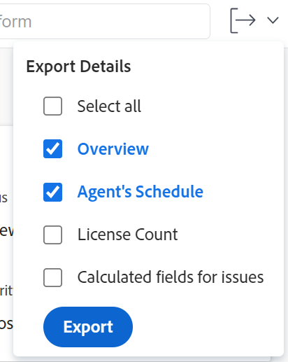
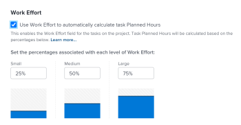

# 프로젝트 편집

<!--Audited: 07/2024-->

<!--The highlighted information on this page refers to functionality not yet generally available. It is available only in the Preview environment for all customers. After the monthly releases to Production, the same features are also available in the Production environment for customers who enabled fast releases.    

For information about fast releases, see [Enable or disable fast releases for your organization](/help/quicksilver/administration-and-setup/set-up-workfront/configure-system-defaults/enable-fast-release-process.md). -->

<!--

***Linked to many articles,

The Resource Pools part also duplicates in the "Working with Resource Pools" article 

The Update Type section is also documented in Selecting the Project Update Type article

Keep the reference link to the other article that also documents the Update Type) 

(NOTE 2: information described here also exists in these articles:

** Project Overview area

**Manage project Finance area

If you need to update just one field, check to see if that field is also listed there and update in both places.)

-->

Adobe Workfront에서 프로젝트를 필요한 만큼 자주 편집할 수 있습니다. 전체 프로젝트 팀에 변경 사항에 대한 알림을 보내 혼동을 피하기 위해 프로젝트를 현재 로 변경한 후 최소한의 편집으로 편집하는 것이 좋습니다.

프로젝트가 계획 수립 상태일 때 프로젝트를 편집하는 것이 가장 좋습니다. 프로젝트 팀에 대한 자세한 내용은 [프로젝트 팀 개요](../../../manage-work/projects/planning-a-project/project-team-overview.md)를 참조하십시오.

## 액세스 요구 사항

+++ 을 확장하여 이 문서의 기능에 대한 액세스 요구 사항을 봅니다.

<table style="table-layout:auto"> 
 <col> 
 <col> 
 <tbody> 
  <tr> 
   <td role="rowheader">Adobe Workfront 플랜</td> 
   <td> 
임의
 </td> 
  </tr> 
  <tr> 
   <td role="rowheader">Adobe Workfront 라이센스*</td> 
   <td>
새로운 기능: 표준 
 
   또는
   
현재: 플랜 
 </td> 
  </tr> 
  <tr> 
   <td role="rowheader">액세스 수준 구성</td> 
   <td> 
프로젝트에 대한 액세스 편집
 </td> 
  </tr> 
  <tr> 
   <td role="rowheader">개체 권한</td> 
   <td> 
     
프로젝트에 대한 권한 관리 
 
     </td> 
  </tr> 
 </tbody> 
</table>

*이 표의 정보에 대한 자세한 내용은 [Workfront 설명서의 액세스 요구 사항](/help/quicksilver/administration-and-setup/add-users/access-levels-and-object-permissions/access-level-requirements-in-documentation.md)을 참조하십시오.

+++

## 프로젝트 편집 제한 사항

일부 제한 사항으로 인해 프로젝트를 편집할 수 없습니다.

프로젝트를 편집할 때 다음 사항을 고려하십시오.

* 승인 프로세스에 있는 프로젝트는 로깅 시간 및 상태 변경을 제외하고 편집할 수 없습니다.
* Workfront 관리자 또는 그룹 관리자가 프로젝트 환경 설정 영역에서 이 기능을 활성화한 경우에만 완료, 중단 또는 승인 보류 상태인 프로젝트에 문서 또는 템플릿을 첨부할 수 있습니다. 프로젝트 환경 설정 지정에 대한 자세한 내용은 [시스템 전체 프로젝트 환경 설정 구성](../../../administration-and-setup/set-up-workfront/configure-system-defaults/set-project-preferences.md)을 참조하십시오.
* 중단 또는 완료 상태의 프로젝트에 대한 다음 정보만 편집할 수 있습니다.

   * 기존 경비를 수정합니다.
   * 사용자 정의 양식을 추가, 제거 또는 편집합니다.

## 프로젝트 편집

프로젝트를 편집하여 프로젝트에 대한 정보 및 설정뿐만 아니라 프로젝트의 작업 및 문제를 수정할 수 있습니다.

이 문서에 언급된 일부 설정은 프로젝트를 만든 템플릿의 상태에 따라 기본 상태에서 수정될 수 있습니다.

템플릿 편집에 대한 자세한 내용은 [프로젝트 템플릿 편집](../../../manage-work/projects/create-and-manage-templates/edit-templates.md)을 참조하십시오.

템플릿으로 프로젝트를 만드는 방법에 대한 자세한 내용은 [템플릿을 사용하여 프로젝트 만들기](/help/quicksilver/manage-work/projects/create-projects/create-project-from-template.md)를 참조하십시오.

{{step1-to-projects}}

1. (선택 사항) 오른쪽 상단의 **내가 진행 중인 프로젝트** 또는 **내가 소유한 프로젝트**&#x200B;를 클릭하여 자신이 소유자인 프로젝트 또는 자신이 프로젝트 팀에 속한 프로젝트를 표시합니다.

   

   >[!NOTE]
   >
   >그룹 관리자인 경우 그룹 영역과 프로젝트 영역에서 그룹의 프로젝트를 보고 편집할 수 있습니다. 자세한 내용은 [그룹의 프로젝트 만들기 및 수정](../../../administration-and-setup/manage-groups/work-with-group-objects/create-and-modify-a-groups-projects.md)을 참조하세요.

1. 편집할 프로젝트의 이름을 클릭하여 프로젝트 페이지를 엽니다.

1. (선택 사항) 프로젝트에 대한 제한된 정보를 편집하려면 왼쪽 패널에서 **프로젝트 세부 정보**&#x200B;를 클릭하십시오. 프로젝트에 대한 모든 정보를 편집하려면 5단계를 진행하십시오. <!--accurate?!-->

   

   >[!NOTE]
   >
   >Workfront 관리자 또는 그룹 관리자가 레이아웃 템플릿을 수정한 방법에 따라 프로젝트 세부 정보 영역의 필드가 재배열되거나 표시되지 않을 수 있습니다. 자세한 내용은 [레이아웃 템플릿을 사용하여 세부 정보 보기 사용자 지정](../../../administration-and-setup/customize-workfront/use-layout-templates/customize-details-view-layout-template.md)을 참조하십시오.

   세부 정보 섹션에서 정보를 편집하려면 다음 작업을 수행하십시오.

   1. (선택 사항) 모든 영역을 축소하려면 오른쪽 상단의 **모두 축소** 아이콘 을 클릭합니다.
   1. (선택 사항 및 조건부) 영역이 축소되면 각 영역 옆에 있는 **오른쪽 방향 화살표** 를 클릭하여 편집할 영역을 확장합니다.
   1. 프로젝트 세부 정보 탭에서 정보를 편집하는 방법에 대한 자세한 내용은 다음 문서를 참조하십시오.

      * [프로젝트 개요 영역의 정보를 관리합니다](../../../manage-work/projects/manage-projects/understand-project-overview-area.md)
      * [프로젝트 재무 영역에서 정보 관리](../../../manage-work/projects/project-finances/manage-project-finance-area.md)

   1. (선택 사항) 사용자 정의 양식을 첨부하려면 **사용자 정의 양식 추가** 필드에 양식 이름을 입력한 다음 목록에 표시될 때 선택하고 **변경 내용 저장**&#x200B;을 클릭합니다.
   1. (선택 사항) **내보내기** 아이콘 을 클릭하여 개요 및 사용자 정의 양식 정보를 PDF 파일로 내보낸 다음 **내보내기**&#x200B;를 클릭합니다. 다음 중에서 선택합니다.

      * 모두 선택(사용자 정의 양식이 하나 이상 첨부된 경우에만 표시됨)
      * 개요
      * 하나 이상의 사용자 정의 양식 이름

      PDF 파일이 컴퓨터로 다운로드됩니다.

      

      자세한 내용은 [사용자 정의 양식 및 개체 세부 정보 내보내기](../../../workfront-basics/work-with-custom-forms/export-custom-forms-details.md)를 참조하십시오.

   프로젝트 세부 정보 섹션에 표시되는 필드에 대한 자세한 내용은 아래 설명된 대로 프로젝트 편집 상자에서 프로젝트를 계속 편집합니다.
1. 프로젝트에 대한 모든 정보를 편집하려면 프로젝트 이름 옆에 있는 **기타** 메뉴 를 클릭한 다음 **편집**&#x200B;을 클릭합니다.

   또는

   프로젝트 목록에서 하나 이상의 프로젝트를 선택한 다음 목록 맨 위에 있는 **편집** 아이콘 을 클릭합니다.

   일괄 프로젝트 편집에 대한 자세한 내용은 이 문서의 [일괄 프로젝트 편집](#edit-projects-in-bulk) 섹션을 참조하십시오.

   **프로젝트 편집** 상자가 열립니다.

   >[!IMPORTANT]
   >
   >편집 옵션을 보려면 프로젝트에 대한 관리 권한이 있어야 합니다.

   모든 프로젝트 필드는 프로젝트 편집 상자에서 사용할 수 있으며 왼쪽 패널에 나열된 영역별로 그룹화됩니다.

   >[!NOTE]
   >
   >Workfront 관리자 또는 그룹 관리자가 레이아웃 템플릿을 수정한 방법에 따라 프로젝트 편집 상자의 왼쪽 패널에 있는 영역이나 이러한 영역에 나열된 필드가 재배열되거나 표시되지 않을 수 있습니다. 자세한 내용은 [레이아웃 템플릿을 사용하여 세부 정보 보기 사용자 지정](../../../administration-and-setup/customize-workfront/use-layout-templates/customize-details-view-layout-template.md)을 참조하십시오.

1. (조건부) **기타** 메뉴를 클릭한 다음 **편집**&#x200B;을 클릭한 경우 왼쪽 패널에 나열된 다음 영역의 정보를 업데이트하십시오.

   * [프로젝트 이름](#project-name)
   * [개요](#overview)
   * [사용자 정의 양식](#custom-forms)
   * [재무](#finance)
   * [프로젝트 설정](#project-settings)
   * [작업 설정](#task-settings)
   * [문제 설정](#issue-settings)
   * [액세스](#access)
   * [댓글](#comment)

   >[!NOTE]
   >
   >Workfront 관리자가 프로젝트의 세부 정보 영역에 대해 레이아웃 템플릿을 설정하는 방법에 따라 프로젝트 편집 상자의 섹션 및 필드가 사용자 환경에서 다를 수 있습니다. 자세한 내용은 [레이아웃 템플릿을 사용하여 세부 정보 보기 사용자 지정](../../../administration-and-setup/customize-workfront/use-layout-templates/customize-details-view-layout-template.md)을 참조하십시오.

### 프로젝트 이름 {#project-name}

1. 위에 설명된 대로 프로젝트 편집을 시작합니다.
1. 왼쪽 패널에서 **프로젝트 이름**&#x200B;을 클릭합니다.

   

1. 프로젝트의 이름을 업데이트합니다.

   프로젝트를 일괄적으로 편집할 때는 프로젝트 이름을 편집할 수 없습니다.

### 개요 {#overview}

1. 위에 설명된 대로 프로젝트 편집을 시작합니다.
1. 왼쪽 패널에서 **개요**&#x200B;를 클릭합니다.

   

1. 프로젝트에 대한 다음 정보를 업데이트합니다.

   <table style="table-layout:auto"> 
      <col> 
      <col> 
      <tbody> 
      <tr> 
         <td role="rowheader"><strong>설명</strong> </td> 
         <td> 
프로젝트에 대한 추가 정보를 추가합니다.
 </td> 
      </tr> 
      <tr> 
         <td role="rowheader"><strong>상태</strong> </td> 
         <td> 
프로젝트의 상태를 선택합니다. 모든 작업 및 문제가 완료되기 전에 프로젝트를 완료로 표시할 수 없습니다. 프로젝트 상태에 대한 자세한 내용은 <a href="../../../administration-and-setup/customize-workfront/creating-custom-status-and-priority-labels/project-statuses.md" class="MCXref xref">시스템 프로젝트 상태 목록 액세스</a>를 참조하십시오.
 </td> 
      </tr> 
      <tr> 
         <td role="rowheader"><strong>우선 순위</strong> </td> 
         <td> 
 
이는 프로젝트의 우선 순위를 지정할 수 있도록 해 주는 시각적 플래그일 뿐입니다.
 
Workfront 관리자가 선택한 프로젝트 환경 설정에 따라 우선순위 이름이 다를 수 있습니다. 우선 순위 편집에 대한 자세한 내용은 <a href="../../../administration-and-setup/customize-workfront/creating-custom-status-and-priority-labels/create-customize-priorities.md" class="MCXref xref">우선 순위 만들기 및 사용자 지정</a>을 참조하세요.
 
 </td> 
      </tr> 
      <tr> 
         <td role="rowheader"><strong>URL</strong> </td> 
         <td> 
이 프로젝트에 대한 정보와 관련된 웹 링크를 지정하십시오.
 </td> 
      </tr> 
      <tr> 
         <td role="rowheader"><strong>조건 유형</strong> </td> 
         <td> 
다음 조건 유형 중에서 선택합니다. 
         <ul> 
         <li><strong>수동:</strong> 프로젝트 소유자가 프로젝트의 조건을 수동으로 설정합니다.</li> 
         <li><strong>진행 상태:</strong> Workfront은 중요 경로에 있는 작업의 진행 상태를 기반으로 조건을 자동으로 설정합니다. 진행 상태를 이해하는 방법에 대한 자세한 내용은 <a href="../../../manage-work/tasks/task-information/task-progress-status.md" class="MCXref xref">작업 진행 상태 개요</a>를 참조하십시오.</li> 
         </ul>
Workfront 관리자 또는 그룹 관리자가 시스템  또는 그룹에 대해 프로젝트의 상태를 계산하는 방법에 대한 기본값을 선택합니다. 프로젝트 기본값 설정에 대한 자세한 내용은 <a href="../../../administration-and-setup/set-up-workfront/configure-system-defaults/set-project-preferences.md" class="MCXref xref">시스템 차원의 프로젝트 환경 설정 구성</a>을 참조하십시오. 

 </td> 
      </tr> 
      <tr> 
         <td role="rowheader"><strong>조건</strong> </td> 
         <td> 
 
(<strong>조건 유형</strong>에 대해 <strong>수동</strong>을 선택한 후에만 표시됩니다.): 프로젝트의 진행 방식을 나타내는 조건을 선택하십시오. 
 
프로젝트 상태를 자동 또는 수동으로 설정하는 방법에 대한 자세한 내용은 <a href="../../../manage-work/projects/manage-projects/project-condition-and-condition-type.md" class="MCXref xref">프로젝트 상태 및 상태 유형 개요</a>를 참조하십시오.
 
 </td> 
      </tr> 
      <tr> 
         <td role="rowheader"><strong>일정 모드</strong> </td> 
         <td> 
프로젝트를 시작 일자에서 예약할지 또는 완료 일자에서 예약할지 지정합니다. 이 선택은 프로젝트에 대한 작업의 계획된 일자를 결정합니다. 
         <ul> 
         <li><strong>시작 날짜</strong>: 프로젝트의 첫 번째 작업에 기본적으로 프로젝트와 계획된 시작 날짜가 동일합니다. 작업 계획 시작 날짜에 대한 자세한 내용은 <a href="../../../manage-work/tasks/task-information/task-planned-start-date.md" class="MCXref xref">작업 계획 시작 날짜의 개요</a>를 참조하십시오. 프로젝트 타임라인은 모든 작업의 기간을 기반으로 프로젝트의 시작 일자와 완료 일자에서 계산됩니다. </li> 
         <li><strong>완료 날짜</strong>: 프로젝트의 마지막 작업에 프로젝트와 동일한 계획된 완료 날짜가 있습니다. 프로젝트 타임라인은 완료 일자에서 계산되며 프로젝트 시작 일자는 시스템이 프로젝트의 완료 일자에서 모든 작업의 기간을 빼서 계산합니다. </li> 
         </ul>
Workfront 관리자 또는 그룹 관리자이(가) 시스템 또는 그룹의 기본 예약 모드 설정을 선택합니다. 프로젝트 기본값 설정에 대한 자세한 내용은 <a href="../../../administration-and-setup/set-up-workfront/configure-system-defaults/set-project-preferences.md" class="MCXref xref">시스템 차원의 프로젝트 환경 설정 구성</a>을 참조하십시오.

 </td> 
      </tr> 
      <tr> 
         <td role="rowheader"><strong>계획된 시작 날짜 및 시간</strong> </td> 
         <td> 
 
<strong>시작 날짜부터 예약</strong>을 선택하는 날짜를 지정하십시오.  
 
<strong>완료 날짜부터 일정</strong>을 선택하는 경우 이 필드는 읽기 전용입니다. 
 
 </td> 
      </tr> 
      <tr> 
         <td role="rowheader"><strong>계획된 완료 일자 및 시간</strong> </td> 
         <td> 
<strong>완료 날짜부터 예약</strong>을 선택하는 날짜를 지정하십시오. 
 
<strong>시작 날짜부터 일정</strong>을 선택하는 경우 이 필드는 읽기 전용입니다. 
 </td> 
      </tr> 
      <tr> 
         <td role="rowheader"><strong>포트폴리오</strong></td> 
         <td>프로젝트가 속한 Portfolio을 나타냅니다. 드롭다운 목록에 표시되기 전에 먼저 Portfolio을 만들어야 합니다. 활성 포트폴리오만 프로젝트와 연결할 수 있습니다. 포트폴리오 만들기에 대한 자세한 내용은 <a href="../../../manage-work/portfolios/create-and-manage-portfolios/create-portfolios.md" class="MCXref xref">포트폴리오 만들기 </a>를 참조하십시오.
         
<b>메모</b>

         
프로젝트에 포트폴리오를 추가하거나 제거하려면 관리 권한이 있어야 합니다.

      </td> 
      </tr> 
      <tr> 
         <td role="rowheader"><strong>프로그램</strong></td> 
         <td> 
프로젝트에 대해 Portfolio을 선택한 경우 프로젝트에 대한 프로그램을 지정합니다. 일부 포트폴리오에는 프로그램이 없을 수 있습니다. 이 드롭다운 목록에 표시되기 전에 먼저 프로그램을 만들어야 합니다. 활성 프로그램만 프로젝트와 연결할 수 있습니다. 
 
프로그램 만들기에 대한 자세한 내용은 <a href="../../../manage-work/portfolios/create-and-manage-programs/create-program.md" class="MCXref xref">프로그램 만들기</a>를 참조하십시오.
 
      
<b>메모</b>

         
프로젝트에 추가하거나 제거하려면 프로그램에 대한 관리 권한이 있어야 합니다.
   
      </td> 
      </tr> 
      <tr> 
         <td role="rowheader"><strong>그룹</strong></td> 
         <td> 
 
프로젝트와 연계된 그룹의 이름을 지정합니다. 
필수 필드입니다. 그룹과 연결되지 않은 프로젝트는 가질 수 없습니다. 
 
마우스로 가리키고 그 옆에 표시되는 정보 아이콘 을(를) 클릭하여 올바른 그룹을 선택하고 있는지 확인할 수 있습니다. 그룹 및 해당 관리자의 상위 그룹 계층과 같은 그룹에 대한 정보를 나열하는 도구 설명이 표시됩니다.
 기본적으로 다음 그룹 중 하나는 다른 그룹을 지정하지 않는 한 프로젝트를 만들 때 자동으로 연결됩니다.
 
         <ul> 
         <li> 
프로젝트 영역에서 프로젝트를 만들 때 프로젝트 작성자의 홈 그룹이 프로젝트와 연결됩니다. 
 
이는 포트폴리오 또는 프로그램의 프로젝트 섹션에서 프로젝트를 만드는 경우에도 마찬가지입니다.
 </li> 
         <li> 
프로젝트를 설정 영역의 그룹 기본 페이지에서 만들면 해당 그룹이 프로젝트와 연결됩니다.
 </li> 
         </ul> 
 
  
 
         
<b>참고</b>

         <ul>
         <li>
프로젝트, 프로젝트 작업 또는 문제가 그룹 수준의 사용자 지정 상태와 연결되어 있는 경우 프로젝트 그룹을 변경하면 프로젝트, 작업 또는 문제의 상태가 새 그룹과 일치하도록 변경될 수 있습니다.
</li>
         <li>
프로젝트 또는 프로젝트 작업 또는 문제가 그룹 수준의 사용자 정의 상태를 사용하여 그룹 수준의 승인 프로세스와 이미 연결되어 있는 경우 그룹을 변경하면 이전 그룹의 승인 상태와 시스템 수준의 기존 승인 상태가 충돌할 수 있습니다.

         
그룹을 업데이트하기 전에 프로젝트에서 그룹 수준 승인 프로세스, 작업 또는 문제를 제거하는 것이 좋습니다.

         
그룹 수준 승인 프로세스를 만드는 방법에 대한 자세한 내용은 <a href="../../../administration-and-setup/manage-groups/work-with-group-objects/create-and-modify-groups-approval-processes.md" class="MCXref xref">그룹 수준 승인 프로세스</a>를 참조하십시오.

         
그룹 수준의 사용자 지정 상태를 만드는 방법에 대한 자세한 내용은 <a href="../../../administration-and-setup/manage-groups/manage-group-statuses/create-or-edit-a-group-status.md" class="MCXref xref">그룹 상태 만들기 또는 편집</a>을 참조하세요.
</li></ul> </td> 
      </tr> 
      <tr> 
         <td role="rowheader"><strong>회사</strong> </td> 
         <td> 
프로젝트와 연계된 회사를 지정합니다. 회사를 프로젝트와 연결하려면 먼저 회사를 만들어야 합니다. 활성 회사만 프로젝트와 연결할 수 있습니다. 회사 만들기에 대한 자세한 내용은 <a href="../../../administration-and-setup/set-up-workfront/organizational-setup/create-and-edit-companies.md" class="MCXref xref">회사 만들기 및 편집</a>을 참조하세요.
 </td> 
      </tr> 
      <tr> 
         <td role="rowheader"><strong>프로젝트 소유자</strong> </td> 
         <td> 
프로젝트에 추가할 사용자 이름을 입력한 다음 목록에 표시될 때 선택합니다. 사용자는 프로젝트 팀에 추가되고 프로젝트에 대한 관리 권한이 자동으로 부여됩니다. 프로젝트 소유자로 지정된 사용자는 Workfront 활성 사용자여야 합니다.

         </td> 
      </tr> 
      <tr> 
         <td role="rowheader"><strong>프로젝트 스폰서</strong> </td> 
         <td> 
프로젝트에 추가할 사용자 이름을 입력한 다음 목록에 표시될 때 선택합니다. 사용자는 프로젝트 팀에 추가되고 프로젝트에 대한 보기 권한이 자동으로 부여됩니다. 프로젝트 스폰서로 지정된 사용자는 Workfront 활성 사용자여야 합니다. 
 </td> 
      </tr> 
      <tr> 
         <td role="rowheader"><strong>리소스 관리자</strong> </td> 
         <td> 
 프로젝트에 추가할 사용자 이름을 입력한 다음 목록에 표시될 때 선택합니다. 사용자는 프로젝트 팀에 추가되고 프로젝트에 대한 관리 권한이 자동으로 부여되며 프로젝트의 작업 및 문제에 리소스를 할당할 수 있습니다. 사용자는 리소스 관리자 필드에서 제거되더라도 프로젝트에 대한 관리 권한을 유지 관리합니다. 리소스 관리자를 두 개 이상 지정할 수 있습니다. 
 </td> 
      </tr>

   <tr> 
         <td role="rowheader"><strong>전환된 문제 작성자</strong> </td> 
         <td> 
 기본적으로 이 필드는 프로젝트가 전환된 문제를 만든 사용자의 이름으로 자동 채워집니다. Workfront에서 다른 사용자의 이름으로 이 이름을 업데이트할 수 있습니다.  
 </td> 
      </tr>

   </tbody> 
      </table>

   >[!TIP]
   >
   >프로젝트 소유자, 프로젝트 스폰서 및 리소스 관리자 필드를 업데이트할 때 아바타, 사용자의 기본 역할 또는 이메일 주소에 따라 이름이 동일한 사용자를 구별하십시오.
   >
   >사용자를 추가할 때 이를 보려면 사용자를 하나 이상의 작업 역할과 연결해야 합니다.
   >
   >사용자의 이메일을 보려면 사용자의 액세스 수준에서 연락처 정보 보기 설정을 활성화해야 합니다. 자세한 내용은 [사용자에게 액세스 권한 부여](../../../administration-and-setup/add-users/configure-and-grant-access/grant-access-other-users.md)를 참조하십시오.

1. (선택 사항) 수정할 정보에 따라 다음 섹션을 계속 편집합니다

   또는

   **저장**&#x200B;을 클릭합니다.

### 사용자 정의 양식 {#custom-forms}

액세스 수준 및 프로젝트에 대한 권한에 따라 다음 시나리오가 존재합니다.

* 프로젝트에 대한 사용자 정의 양식 편집 권한이 없는 경우 첨부된 사용자 정의 양식의 필드를 편집할 수 없습니다. 프로젝트에 첨부된 사용자 정의 양식의 필드만 볼 수 있습니다.
* 사용자 정의 양식의 섹션에 대한 보기(편집 아님) 액세스 권한이 있는 경우 해당 섹션의 필드를 편집할 수 없습니다.
* 프로젝트에 첨부된 사용자 정의 양식 중 하나에 대한 섹션에 대한 액세스 권한이 없는 경우 섹션이 프로젝트 편집 상자에 표시되지 않습니다.

두 개 이상의 프로젝트를 선택하여 일괄적으로 편집하는 경우 다음과 같은 시나리오가 있습니다.

* 선택한 프로젝트 중 하나 이상에 대해 사용자 정의 양식 편집 권한이 없는 경우 첨부된 사용자 정의 양식의 필드를 편집할 수 없습니다. 첨부된 사용자 정의 양식의 필드만 볼 수 있습니다.
* 사용자 정의 양식의 섹션에 대한 보기(편집 아님) 액세스 권한이 있는 경우 해당 섹션의 필드를 편집할 수 없습니다. 해당 섹션의 필드만 볼 수 있습니다.
* 하나 이상의 프로젝트에 첨부된 사용자 정의 양식 중 하나의 섹션에 대한 액세스 권한이 없는 경우 섹션이 프로젝트 편집 상자에 표시되지 않습니다.
* 모든 프로젝트에 첨부된 사용자 정의 양식에 필수 필드가 있고, 실제로 편집하지 않고 하나의 필드를 선택하는 경우, 선택한 프로젝트를 저장하려면 먼저 해당 필드의 변경 사항을 취소하거나 정보를 추가해야 합니다. 필수 필드를 전혀 선택하지 않으면 필수 필드가 비어 있더라도 선택한 프로젝트를 저장할 수 있습니다.

사용자 정의 양식 액세스에 대한 자세한 내용은 다음 문서를 참조하십시오.

* [사용자 정의 양식 공유](../../../administration-and-setup/customize-workfront/create-manage-custom-forms/share-access-to-a-custom-form.md)
* [양식 구성 및 미리 보기](/help/quicksilver/administration-and-setup/customize-workfront/create-manage-custom-forms/form-designer/design-a-form/organize-a-form.md)

프로젝트를 편집할 때 사용자 정의 양식에 대한 정보를 편집하려면 다음 작업을 수행하십시오.

1. 위에 설명된 대로 프로젝트 편집을 시작합니다.
1. 왼쪽 패널에서 **사용자 지정 Forms**&#x200B;을 클릭합니다.

   

1. **사용자 정의 양식 추가** 상자를 클릭하고 목록에서 프로젝트에 첨부할 양식을 선택합니다. 기본적으로 처음 40개 양식은 알파벳 순서로 표시됩니다. 목록에 양식이 표시되지 않으면 해당 이름을 입력한 다음 목록에 표시될 때 선택합니다.

   >[!NOTE]
   >
   >이 필드에서 사용자 정의 양식을 선택하려면 먼저 사용자 정의 양식을 작성해야 합니다. 활성 사용자 정의 양식만 목록에 표시됩니다. 사용자 정의 양식 작성에 대한 자세한 내용은 [사용자 정의 양식 만들기](/help/quicksilver/administration-and-setup/customize-workfront/create-manage-custom-forms/form-designer/design-a-form/design-a-form.md)를 참조하십시오. 프로젝트에 최대 10개의 사용자 정의 양식을 추가할 수 있습니다.

1. (조건부) 사용자 정의 양식을 프로젝트에 첨부한 경우 양식의 모든 필드를 편집합니다. 프로젝트를 저장하려면 모든 필수 필드를 지정해야 합니다.
1. (선택 사항) 사용자 정의 양식 이름 오른쪽에 있는 **X 아이콘**&#x200B;을 클릭하여 제거한 다음 **제거**&#x200B;를 클릭합니다.
1. (선택 사항) 수정할 정보에 따라 다음 섹션을 계속 편집합니다

   또는

   **저장**&#x200B;을 클릭합니다.

### 재무 {#finance}

액세스 수준 및 프로젝트에 대한 권한에 따라 다음 시나리오가 존재합니다.

* 프로젝트에 대한 재무 데이터 보기 액세스 권한 및 재무 보기 권한이 있는 경우 재무 섹션의 필드만 볼 수 있습니다. 이 섹션의 필드는 편집할 수 없습니다.
* 프로젝트에 대한 재무 데이터 편집 액세스 권한 및 재무 관리 권한이 있는 경우 이 섹션의 필드를 업데이트할 수 있습니다.

두 개 이상의 프로젝트를 선택하여 일괄적으로 편집할 때 다음과 같은 시나리오가 있습니다.

* 재무 보기 권한이 있는 프로젝트를 하나 이상 선택한 경우(재무 관리 대신) 선택한 모든 프로젝트에 대해 이 섹션의 필드만 볼 수 있습니다. 재무 섹션의 필드는 벌크 편집할 수 없습니다.
* 재무 권한이 없는 프로젝트를 하나 이상 선택하면 이 섹션이 전혀 표시되지 않습니다.

재무 영역의 필드를 편집하려면:

1. 위에 설명된 대로 프로젝트 편집을 시작합니다.
1. 왼쪽 패널에서 **재무**&#x200B;을 클릭합니다.

   

1. 프로젝트에 대한 다음 재무 정보를 갱신합니다.

   <table style="table-layout:auto"> 
    <col> 
    <col> 
    <tbody> 
     <tr data-mc-conditions=""> 
      <td role="rowheader"><strong>통화</strong> </td> 
      <td> 
 
프로젝트의 통화가 시스템의 기본 통화와 다른 경우 통화를 지정합니다. 프로젝트에 대한 재무 정보가 이미 있는 경우 프로젝트의 통화를 변경할 수 없습니다. 시스템에 기본 통화만 있는 경우에는 이 필드가 표시되지 않습니다. 
 
통화에 대한 자세한 내용은 <a href="../../../administration-and-setup/manage-workfront/exchange-rates/set-up-exchange-rates.md" class="MCXref xref">환율 설정</a>을 참조하세요. 
 
 </td> 
     </tr> 
     <tr> 
      <td role="rowheader"><strong>예산</strong> </td> 
      <td> 프로젝트에 대한 예산을 지정합니다. </td> 
     </tr> 
     <tr> 
      <td role="rowheader"><strong>성능 인덱스 메서드</strong> </td> 
      <td> 
<b>시간 기반</b> 또는 <b>비용 기반</b>을 선택하여 프로젝트의 성과 값 지표(예: 비용 성과 지표 또는 예상 실제 비용)가 시간 또는 비용을 사용하여 계산되는지 여부를 나타냅니다. 
 
성능 인덱스 메서드에 대한 자세한 내용은 <a href="../../../manage-work/projects/project-finances/set-pim.md" class="MCXref xref">PIM(성능 인덱스 메서드) 설정</a>을 참조하십시오. 
 
Workfront 관리자 또는 그룹 관리자이(가) 시스템 또는 그룹의 기본 성능 인덱스 메서드 설정을 선택합니다. 프로젝트 기본값 설정에 대한 자세한 내용은 <a href="../../../administration-and-setup/set-up-workfront/configure-system-defaults/set-project-preferences.md" class="MCXref xref">시스템 차원의 프로젝트 환경 설정 구성</a>을 참조하십시오.
 </td> 
     </tr> 
     <tr> 
      <td role="rowheader"><strong>완료 시 예상</strong> </td> 
      <td> 
 
Workfront에서 EAC(완료 시 추정 비용)를 계산하는 방법을 지정합니다. 

      다음 옵션 중에서 선택합니다. 
      <ul><li><b>프로젝트 수준에서 계산</b></li>
      <li><b>작업/하위 작업에서 롤업</b></li> </ul>
      
완료 시 예상 계산 방법에 대한 자세한 내용은 <a href="../../../manage-work/projects/project-finances/calculate-eac.md" class="MCXref xref">EAC(완료 시 예상 계산)</a>을 참조하십시오.
 
Workfront 또는 그룹 관리자는 시스템 또는 그룹에 대해 기본 완료 시 예상 설정을 선택합니다. 프로젝트 기본값 설정에 대한 자세한 내용은 <a href="../../../administration-and-setup/set-up-workfront/configure-system-defaults/set-project-preferences.md" class="MCXref xref">시스템 차원의 프로젝트 환경 설정 구성</a>을 참조하십시오.
 
 </td> 
     </tr> 
     <tr> 
      <td role="rowheader"><strong>계획된 혜택</strong> </td> 
      <td> 
프로젝트의 계획된 이익을 예측합니다. 프로젝트 및 Portfolio Optimizer의 비즈니스 사례에 사용됩니다. 프로젝트의 계획된 편익에 대한 자세한 내용은 <a href="../../../manage-work/projects/project-finances/project-planned-benefit.md" class="MCXref xref">프로젝트 계획된 편익 개요</a>를 참조하십시오. 프로젝트의 순 가치 계산 시 프로젝트의 계획된 이익이 고려됩니다. 
 
자세한 내용은 <a href="../../../manage-work/portfolios/portfolio-optimizer/manage-projects-in-portfolio-optimizer.md" class="MCXref xref">Portfolio Optimizer에서 프로젝트 관리</a> 를 참조하십시오. 
 </td> 
     </tr> 
     <tr> 
      <td role="rowheader"><strong>실제 이익</strong> </td> 
      <td> 
프로젝트의 실제 이익 예측. 이 프로젝트가 완료된 후 회사 또는 부서에서 얻을 수 있는 혜택을 나타내는 통화 금액입니다. 
 </td> 
     </tr> 
      <tr> 
      <td role="rowheader"><strong>고정 비용</strong> </td> 
      <td> 
프로젝트에 대한 고정 비용을 지정합니다. 이는 프로젝트의 시간에 따라 발생하는 인건비와 프로젝트의 경비 금액에 따라 발생하는 경비가 다릅니다. 프로젝트의 고정 비용은 프로젝트의 순 가치를 계산할 때 고려되며 예산 비용의 일부입니다. 
 </td> 
     </tr> 
     <tr> 
      <td role="rowheader"><strong>고정 수입</strong> </td> 
      <td> 
프로젝트에 대한 고정 수익을 지정합니다. 
 </td> 
     </tr> 
    </tbody> 
   </table>

1. (선택 사항) 수정할 정보에 따라 다음 섹션을 계속 편집합니다.

   또는

   **저장**&#x200B;을 클릭합니다.

### 프로젝트 설정 {#project-settings}

1. 위에 설명된 대로 프로젝트 편집을 시작합니다.
1. 왼쪽 패널에서 **프로젝트 설정**&#x200B;을 클릭합니다.

   

1. 다음 정보를 업데이트합니다.

   <table style="table-layout:auto"> 
      <col> 
      <col> 
      <tbody> 
      <tr> 
      <td role="rowheader"><strong>마일스톤 경로</strong> </td> 
       <td> 
프로젝트에 대한 마일스톤 경로를 선택합니다. 활성 마일스톤 경로만 목록에 표시됩니다.
 
마일스톤 경로에 대한 자세한 내용은 <a href="../../../administration-and-setup/customize-workfront/configure-approval-milestone-processes/create-milestone-path.md" class="MCXref xref">마일스톤 경로 만들기</a>를 참조하세요.
 </td> 
      </tr> 
      <tr> 
      <td role="rowheader"><strong>완료 모드</strong> </td> 
      <td> 
프로젝트가 완료로 표시되는 방식을 제어합니다. 다음 옵션 중에서 선택합니다. 
       <ul> 
       <li>
<strong>자동</strong>: 모든 작업 및 문제가 완료되면 프로젝트가 완료됨으로 표시됩니다.

작업이 완료될 때 프로젝트 상태가 현재인 경우에만 프로젝트 상태가 완료로 자동 변경됩니다. 
</li> 
       <li><strong>수동</strong>: 모든 작업 및 문제가 완료되면 프로젝트의 완료 상태를 수동으로 선택해야 합니다.</li> 
       </ul>
 </td> 
       </tr> 
       <tr> 
       <td role="rowheader"><strong>요약 완료 모드</strong></td> 
       <td> 
상위 작업이 완료로 표시되는 방식을 제어합니다. 다음 옵션 중에서 선택합니다. 
       <ul> 
       <li><strong>자동</strong>: 하위 작업이 완료되고 하위 작업의 완료율이 업데이트됨에 따라 상위 작업이 완료됨으로 표시되고 완료율이 자동으로 업데이트됩니다. </li> 
       <li><strong>수동</strong>: 하위 작업의 변경 내용과 관계없이 완료율 및 상위 작업의 상태를 수동으로 업데이트해야 합니다. 이를 통해 하위 작업이 완료되지 않은 경우에도 상위 작업을 완료됨으로 표시할 수 있습니다. </li> 
       </ul>
 </td> 
       </tr> 
       <tr> 
       <td role="rowheader"><strong>업데이트 유형</strong></td> 
       <td> 
프로젝트 타임라인에 적용한 변경 내용이 프로젝트 또는 상위 작업에 저장되는 시점을 제어합니다. 예를 들어 프로젝트에 대한 다음 변경 사항은 프로젝트의 타임라인에 대한 업데이트를 트리거합니다. 
       <ul> 
       <li>작업 날짜 업데이트</li> 
       <li>작업의 전임 작업 관계 변경</li> 
       <li>
작업 제한이나 기간 유형을 변경하는 것 외에 할당을 추가 또는 제거하는 상위-하위 관계를 변경합니다.

작업이 업데이트되면 해당 상위 개체(상위 작업 또는 프로젝트)가 업데이트 유형에 표시된 시점에 업데이트됩니다. 

"자동 및 변경 시" 또는 "변경만" 업데이트 유형을 선택할 때 상위 객체가 변경 직후 업데이트되지 않으면 페이지를 새로 고칩니다.

다음 옵션 중에서 선택합니다. 

- <strong>자동 및 변경 시</strong>(기본 설정): 프로젝트 또는 프로젝트가 종속된 다른 프로젝트에서 변경(변경 시)이 발생할 때마다 프로젝트 타임라인이 업데이트됩니다. 프로젝트 타임라인은 매일 밤 자동 업데이트됩니다.

이 설정은 프로젝트가 항상 최신 상태로 유지되도록 하기 때문에 이 필드에 권장되는 설정입니다.

타임라인 재계산을 트리거하는 작업 또는 프로젝트에 작업을 수행하면 사용 가능한 모든 날짜가 즉시 표시되어 작업을 계속할 수 있습니다. 작업이 100개를 초과하는 프로젝트의 경우 더 긴 재계산이 필요한 날짜가 물음표로 짧게 표시됩니다(1초에서 5초 사이 또는 큰 프로젝트의 경우 최대 1분). 이는 재계산이 아직 완료되지 않았으며, 날짜가 변경될 수 있음을 나타냅니다.

- <strong>변경 전용</strong>: 프로젝트 또는 프로젝트가 종속된 다른 프로젝트에서 변경 사항이 발생할 때마다 프로젝트 타임라인이 업데이트됩니다. 프로젝트 또는 타임라인이 종속된 다른 프로젝트에서 변경 사항이 거의 발생하지 않는 경우 이 옵션을 선택할 수 있습니다.

- <strong>자동만</strong>: 프로젝트 타임라인은 매일 밤 업데이트되며, 변경 후 타임라인은 즉시 업데이트되지 않습니다.

프로젝트 또는 타임라인이 종속된 다른 프로젝트에서 매일 많은 변경 사항이 발생하는 경우 이 옵션을 선택할 수 있습니다. 그러나 프로젝트가 변경과 동시에 업데이트되지 않으므로 이 설정을 선택했다는 점에 유의하십시오.

- <strong>수동만</strong>: 타임라인을 다시 계산하는 옵션을 선택하는 경우에만 프로젝트 타임라인이 업데이트됩니다. 프로젝트 타임라인을 수동으로 다시 계산하는 방법에 대한 자세한 내용은 <a href="../../../manage-work/projects/manage-projects/recalculate-project-timeline.md" class="MCXref xref">프로젝트 타임라인 다시 계산</a>을 참조하십시오. 

한 번에 프로젝트를 여러 번 변경하고, 각 개별 변경 내용이 아닌 모든 변경 내용이 적용된 후에 타임라인 재계산을 수행하려는 경우 이 옵션을 선택할 수 있습니다.
</li> 
       </ul>
 </td> 
       </tr> 
       <tr> 
       <td role="rowheader"><strong>예약</strong> </td> 
       <td> 
프로젝트의 일정을 선택합니다. 프로젝트에서 작업 중인 대부분의 사람에게 할당된 일정과 동일해야 합니다. 일정을 프로젝트 또는 사용자에게 할당하려면 먼저 일정을 만들어야 합니다. 시스템에서 사용자 정의 일정을 작성하지 않은 경우 기본 일정이 선택됩니다.
 
일정 만들기에 대한 자세한 내용은 <a href="../../../administration-and-setup/set-up-workfront/configure-timesheets-schedules/create-schedules.md" class="MCXref xref">일정 만들기</a>를 참조하세요. 
 </td> 
       </tr> 
       <tr> 
       <td role="rowheader"><strong>사용자 휴무</strong> </td> 
       <td> 
작업의 기본 피할당자의 휴무 시간이 프로젝트의 작업 계획 날짜를 조정하는지 여부를 결정합니다. 

Workfront 관리자 또는 그룹 관리자가 시스템  또는 그룹에 대해 이 설정의 기본값을 선택합니다. 프로젝트 기본값 설정에 대한 자세한 내용은 <a href="../../../administration-and-setup/set-up-workfront/configure-system-defaults/set-project-preferences.md" class="MCXref xref">시스템 차원의 프로젝트 환경 설정 구성</a>을 참조하십시오. 

다음 옵션 중에서 선택하십시오. - <strong>작업 기간에서 사용자 휴무 고려</strong>: 이 옵션을 선택할 때 작업 기간 동안 휴무가 발생할 경우 작업의 계획된 날짜가 작업의 기본 피할당자의 휴무 시간에 따라 조정됩니다. 

예를 들어, 제한이 있는 작업이 가능한 한 빨리 6월 1일에 시작하여 6월 3일에 완료되도록 예약되어 있고 기본 피할당자가 6월 2일에 휴무로 표시된 경우, 이 선택이 활성화되면 작업 계획 일자는 6월 1일부터 6월 4일까지입니다. Task Constraint에 따라 다음과 같은 시나리오가 있습니다. 
 
       <ul> 
       <li>시작 일자(가능한 한 빨리, 가능한 가장 빠른 가용 시간, 다음 일자 이전에 시작, 다음 일자 이후에 시작, 다음 일자에 시작 필수)로부터의 계획과 관련된 작업 제한의 경우 계획된 시작 일자는 변경되지 않지만 계획된 완료 일자는 변경됩니다.</li> 
       <li>완료 일자(가능한 한 늦게, 가장 최근 가용 시간, 다음 이전에 완료, 다음 이후에 완료, 다음 일자에 완료)로부터의 계획과 관련된 작업 제한의 경우 계획된 완료 일자는 변경되지 않지만 계획된 시작 일자는 변경됩니다.</li> 
       <li>고정 일자 제한이 있는 작업의 경우 계획된 시작 일자와 완료 일자 모두 변경되지 않습니다. </li> 
       </ul>
이 설정을 선택해도 작업 기간은 변경되지 않습니다. 계획된 일자만 작업 제한에 따라 변경됩니다. 작업 제한에 대한 자세한 내용은 <a href="../../../manage-work/tasks/task-constraints/task-constraint-overview.md" class="MCXref xref">작업 제한 개요</a>를 참조하십시오. 

- <strong>작업 기간에서 사용자 휴가 무시</strong>: 이 옵션을 선택하면 작업의 기본 피할당자가 작업 기간 동안 휴가를 갖는 경우에도 프로젝트의 작업 계획된 날짜가 원래 계획된 대로 유지됩니다. 

이 설정에 대한 옵션을 선택할 때는 다음 사항을 고려하십시오.
 
       <ul> 
       <li>
새 프로젝트에 대한 이 설정의 기본 옵션은 시스템 수준 프로젝트 환경 설정과 동일합니다. 

시스템 수준의 프로젝트 환경 설정에 대한 자세한 내용은 <a href="../../../administration-and-setup/set-up-workfront/configure-system-defaults/set-project-preferences.md" class="MCXref xref">시스템 차원의 프로젝트 환경 설정 구성</a>을 참조하십시오. 
</li> 
       <li>기존 프로젝트에 템플릿을 첨부하면 프로젝트의 설정이 템플릿 중 하나와 일치하도록 업데이트됩니다. </li> 
       <li>
Workfront은 작업의 작업 제한 값에 따라 조정할 계획된 작업 날짜를 결정합니다. 내용에 따라 계획된 시작 일자 또는 계획된 완료 일자 중 하나 또는 둘 다가 영향을 받거나 그대로 유지될 수 있습니다. 예를 들어, 작업에 고정 날짜 제한이 있는 경우 <strong>작업 기간에서 사용자 휴무 고려</strong>를 선택하더라도 기본 피할당자가 휴무를 가질 때 날짜가 조정되지 않습니다. 
</li> 
       </ul></td> 
      </tr> 
      <tr> 
       <td role="rowheader"><strong>리소스 레벨링 모드</strong> </td> 
       <td> 
 
다음 옵션 중에서 선택합니다.
 
- <strong>수동</strong>: 리소스를 수동으로 레벨링해야 합니다(기본 설정임).
 
- <strong>자동</strong>: Workfront에서 리소스를 레벨링합니다.
 
리소스 레벨링에 대한 자세한 내용은 간트 차트 </a>에서 <a href="../../../manage-work/gantt-chart/use-the-gantt-chart/level-resources-in-gantt.md" class="MCXref xref">리소스 레벨링을 참조하십시오.
 
 </td> 
      </tr> 
      <tr> 
       <td role="rowheader"><strong>위험</strong> </td> 
       <td> 
 
프로젝트의 위험 수준을 정의합니다. 위험은 프로젝트가 얼마나 위험할 수 있는지를 나타내는 지표일 뿐이다. 위험 수준에 따라 프로젝트 실행의 우선 순위를 지정할 수 있습니다.
 
 
다음 위험 수준 중에서 선택하는 것이 좋습니다.
 
- 매우 낮음
 
- 낮음
 
- MEDIUM
 
- 높음
 
- 매우 높음
 
여기서 표시하는 위험 수준은 사용자 지정할 수 없습니다.
 
이는 프로젝트 수명 중에 발생할 수 있는 잠재적 위험과 관련이 없으며 프로젝트의 위험 탭 또는 비즈니스 사례에 기록해야 합니다. 잠재적인 프로젝트 위험에 대한 자세한 내용은 <a href="../../../administration-and-setup/set-up-workfront/configure-system-defaults/edit-create-risk-types.md" class="MCXref xref">위험 유형 편집 및 만들기</a>를 참조하십시오. 
 
 
 </td> 
      </tr> 
      <tr> 
       <td role="rowheader"><strong>리소스 풀</strong> </td> 
       <td> 
 
프로젝트와 연결된 리소스 풀을 지정합니다. 리소스 풀은 프로젝트 완료에 동시에 필요하고 리소스 플래너에서 프로젝트 예산 책정을 허용하는 사용자 컬렉션입니다. 리소스 풀에 대한 자세한 내용은 <a href="../../../resource-mgmt/resource-planning/resource-pools/work-with-resource-pools.md" class="MCXref xref"> 리소스 풀 개요 </a>을(를) 참조하십시오. 
 
프로젝트를 일괄 편집할 때 선택한 모든 프로젝트에 공통되는 리소스 풀만 이 필드에 나타납니다. 선택한 프로젝트에 공유 리소스 풀이 없는 경우 이 필드는 비어 있습니다. 여기에서 지정한 리소스 풀은 프로젝트의 개별 리소스 풀을 덮어씁니다.
 
 </td> 
      </tr> 
      <tr> 
       <td role="rowheader"> <strong>회사 수준의 청구 요금이 프로젝트 수준의 청구 요금을 재정의할 수 있도록 허용</strong></td> 
       <td>회사 수준의 청구 요금이 청구됨으로 표시되지 않는 한 과거 작업 역할 요금을 재정의할 수 있도록 하려면 이 옵션을 선택합니다. 청구됨으로 표시되지 않는 한 이 옵션을 활성화하면 이전 작업 역할 요금이 무시됩니다.  자세한 내용은 <a href="../../../manage-work/projects/project-finances/override-project-level-with-company-level-billing-rates.md" class="MCXref xref">회사 수준의 청구 요율로 프로젝트 수준의 청구 요율 재정의</a>를 참조하십시오.</td> 
      </tr> 
      <tr> 
       <td role="rowheader"><strong>이 프로젝트를 승인할 시간 필요</strong></td> 
       <td> 
 프로젝트 소유자가 프로젝트에 기록된 시간을 승인하도록 하려면 이 옵션을 선택합니다. 청구 기록을 사용하고 이 옵션을 선택하는 경우 프로젝트의 승인된 시간만 청구 기록의 사용 가능한 청구 가능 시간으로 표시됩니다. 프로젝트 시간 승인은 타임시트 승인과 독립적입니다. 
 
프로젝트 승인 시간 요구에 대한 자세한 내용은 <a href="../../../manage-work/projects/manage-projects/require-time-approval-for-projects.md" class="MCXref xref">프로젝트 승인 시간 필요</a>를 참조하십시오.
 </td> 
      </tr> 
      <tr> 
       <td role="rowheader"><strong>시간 유형 필터링</strong> 및 <strong>시간 유형</strong></td> 
       <td> 
 
다음 옵션 중에서 선택합니다.
 
       <ul> 
       <li> 
모든 프로젝트별 시간 유형을 프로젝트에서 사용할 수 있도록 하려면 <strong>아니요</strong>를 선택하십시오. (기본 선택 사항입니다.)
 
또는
 </li> 
       <li>프로젝트에서 프로젝트별 시간 형식의 하위 집합만 사용할 수 있도록 하려면 <strong>예</strong>를 선택한 다음 <b>시간 형식</b> 필드에서 사용할 수 있도록 하려는 시간 형식을 선택하십시오.</li> 
       
<b>팁</b>

       
<b>아니요</b>를 선택하면 <b>시간 유형</b> 필드를 편집할 수 없습니다.
 
       
이 옵션을 선택하면 프로젝트(또는 프로젝트 내의 작업 및 문제)에 시간을 기록할 때 선택한 시간 유형만 선택할 수 있습니다. 최소 1개의 시간 유형을 선택해야 합니다. 이 옵션을 선택하고 시간 유형을 선택하지 않으면 프로젝트에서 모든 시간 유형을 사용할 수 있습니다.
 </ul>

   
사용자가 프로젝트에서 이러한 시간 유형 옵션을 보려면 개별 사용자 수준에서 동일한 시간 유형을 선택해야 합니다. 사용자 수준에서 시간 유형을 정의하는 방법에 대한 자세한 내용은 <a href="../../../timesheets/create-and-manage-timesheets/log-time.md" class="MCXref xref">로그 시간</a>을 참조하십시오. 
 
 </td> 
      </tr> 
      <tr data-mc-conditions=""> 
       <td role="rowheader"><strong>미리 알림</strong> </td> 
       <td> 
 
프로젝트와 연계해야 하는 미리 알림 을 선택합니다. 프로젝트를 편집하는 동안 이 필드가 표시되도록 하려면 프로젝트에 대한 미리 알림을 구성해야 합니다. 미리 알림 구성에 대한 자세한 내용은 <a href="../../../administration-and-setup/manage-workfront/emails/set-up-reminder-notifications.md"><a href="../../../administration-and-setup/manage-workfront/emails/set-up-reminder-notifications.md" class="MCXref xref">미리 알림 설정</a>.</a>을 참조하세요.
 
 </td> 
      </tr> 
      <tr data-mc-conditions=""> 
       <td role="rowheader"><strong>승인 진행</strong></td> 
       <td> 
프로젝트와 연계하려는 승인 프로세스를 선택합니다. 프로젝트와 연결하려면 먼저 Workfront 관리자가 시스템 수준 승인 프로세스를 정의해야 합니다. 승인 프로세스에 대한 관리자 액세스 권한이 있는 사용자는 그룹별 승인 프로세스를 만들 수도 있습니다. 승인 프로세스 만들기에 대한 자세한 내용은 <a href="../../../administration-and-setup/customize-workfront/configure-approval-milestone-processes/create-approval-processes.md" class="MCXref xref">작업 항목에 대한 승인 프로세스 만들기</a>를 참조하십시오.
 
승인 프로세스를 추가할 때는 다음 사항을 고려하십시오. 
 
       <ul> 
       <li>활성 승인 프로세스만 목록에 표시됩니다. </li> 
       <li> 
시스템 전체 및 그룹별 승인 프로세스가 목록에 표시됩니다. 프로젝트 그룹 이외의 그룹과 연결된 승인 프로세스가 목록에 표시되지 않습니다.
 
프로젝트와 연계된 그룹이 변경되면 그룹별 승인 프로세스가 일회용 승인 프로세스가 됩니다. 프로젝트 그룹 변경 또는 승인 프로세스 변경 내용이 승인 설정에 미치는 영향에 대한 자세한 내용은 <a href="../../../administration-and-setup/customize-workfront/configure-approval-milestone-processes/how-changes-affect-group-approvals.md" class="MCXref xref">그룹 및 승인 프로세스 변경 내용이 할당된 승인 프로세스에 미치는 영향</a>을 참조하십시오. 
 </li> <!--(NOTE: this bullet stays here although the sections it might appear in are QS only, so we can use the snippet for both Qs and classic)-->
       
프로젝트를 대량 편집할 때 다음과 같은 시나리오가 있습니다.
 
       <ul> 
       <li> 
동일한 그룹에서 프로젝트를 선택하면 시스템 수준 및 그룹 수준 승인 프로세스가 모두 이 필드에 표시됩니다.
 </li> 
       <li> 
다른 그룹에서 프로젝트를 선택하면 이 필드에는 시스템 수준 승인 프로세스만 표시됩니다.
 </li> 
       <li> 
프로젝트에 일회용 승인 프로세스가 첨부되어 있으면 사용자가 선택한 시스템 수준 또는 그룹 수준 승인 프로세스로 바뀝니다. 
 </li> 
      </ul> </td> 
      </tr> 
      <tr> 
      </tr> 
      </tbody> 
      </table>

1. (선택 사항) 수정할 정보에 따라 다음 섹션을 계속 편집합니다.

   또는

   **저장**&#x200B;을 클릭합니다.

### 작업 설정 {#task-settings}

프로젝트에 새 작업을 추가할 때 모든 새 작업과 연결할 기본값을 정의할 수 있습니다.

이러한 설정이 새 작업 만들기에 미치는 영향에 대한 자세한 내용은 [작업 만들기 개요](../../../manage-work/tasks/create-tasks/create-tasks-overview.md) 문서의 [프로젝트에 작업을 추가할 때 작업 기본값](../../../manage-work/tasks/create-tasks/create-tasks-overview.md#understa) 섹션을 참조하십시오.

1. 위에 설명된 대로 프로젝트 편집을 시작합니다.
1. 왼쪽 패널에서 **작업 설정**&#x200B;을 클릭합니다.

   프로젝트 편집 상자의 

1. **작업 기본 승인 프로세스** 상자에서 프로젝트에 새 작업을 추가할 때 모든 새 작업과 연결할 작업 승인 프로세스를 선택합니다.

   Workfront 관리자(또는 승인 프로세스에 대한 관리 액세스 권한이 있는 사용자)는 작업을 프로젝트에 연결하기 전에 작업에 대한 시스템 수준 또는 그룹 수준 승인 프로세스를 만들어야 합니다. 활성 승인 프로세스만 목록에 표시됩니다. 승인 프로세스 만들기에 대한 자세한 내용은 [작업 항목에 대한 승인 프로세스 만들기](../../../administration-and-setup/customize-workfront/configure-approval-milestone-processes/create-approval-processes.md)를 참조하십시오. 프로젝트 그룹 변경 또는 승인 프로세스 변경 내용이 승인 설정에 미치는 영향에 대한 자세한 내용은 [그룹 및 승인 프로세스 변경 내용이 할당된 승인 프로세스에 미치는 영향](../../../administration-and-setup/customize-workfront/configure-approval-milestone-processes/how-changes-affect-group-approvals.md)을 참조하십시오.

   프로젝트를 대량 편집할 때 다음과 같은 시나리오가 있습니다.

   * 동일한 그룹에서 여러 프로젝트를 선택하면 시스템 수준 및 그룹별 작업 승인 프로세스가 모두 이 필드에 표시됩니다.
   * 다른 그룹에서 여러 프로젝트를 선택하면 이 필드에는 시스템 수준 작업 승인 프로세스만 표시됩니다.

1. **작업 기본 사용자 지정 Forms** 상자에서 프로젝트에 새 작업을 추가할 때 모든 새 작업과 연결할 사용자 지정 양식을 선택합니다. 이 필드에서 사용자 정의 양식을 선택하려면 먼저 사용자 정의 양식을 작성해야 합니다. 활성 사용자 정의 양식만 목록에 표시됩니다. 사용자 정의 양식 작성에 대한 자세한 내용은 [사용자 정의 양식 만들기](/help/quicksilver/administration-and-setup/customize-workfront/create-manage-custom-forms/form-designer/design-a-form/design-a-form.md)를 참조하십시오. 작업에 최대 10개의 사용자 정의 양식을 연결할 수 있습니다.
1. (선택 사항) 계획된 시간 대신 작업 노력을 사용하여 작업 노력을 관리하려면 **작업 노력 사용을 선택하여 작업 계획된 시간을 자동으로 계산합니다**.

   

1. (조건부 및 선택 사항) 작업 노력 사용을 선택하여 작업 계획 시간을 자동으로 계산하는 경우 각 노력 레벨에 대한 드롭다운 메뉴를 누르고 각 레벨에 대한 백분율을 선택합니다. 다음 백분율 값은 기본값입니다.

   | 크기 | 백분율 |
   |---|---|
   | 소형 | 25% |
   | 중간 | 50% |
   | 대형 | 75% |

   >[!TIP]
   >
   >프로젝트 업데이트 유형을 자동으로 설정하고 이 설정을 선택하면 작업 기간 및 작업 노력 비율에 따라 작업의 계획된 시간이 업데이트됩니다. 0으로 설정된 경우 작업 노력을 사용하여 작업에 대한 노력을 계획하는 방법에 대한 자세한 내용은 [작업 노력 개요](../../../manage-work/tasks/task-information/work-effort.md)를 참조하십시오.

1. (선택 사항) 수정할 정보에 따라 다음 섹션을 계속 편집합니다.

   또는

   **저장**&#x200B;을 클릭합니다.

### 문제 설정 {#issue-settings}

1. 위에 설명된 대로 프로젝트 편집을 시작합니다.
1. 왼쪽 패널에서 **문제 설정**&#x200B;을 클릭합니다.

   

1. (선택 사항) **사용자가 문제를 인라인으로 추가할 수 있도록 허용** 옵션을 선택 취소합니다. 기본적으로 선택되어 있습니다.

   이 옵션을 선택 해제할 때 사용자는 프로젝트 또는 문제 섹션의 작업에 인라인으로 문제를 추가할 수 없습니다.

   >[!TIP]
   >
   >사용자가 새 문제 필드 또는 새 문제와 관련된 사용자 정의 양식을 완료하도록 강제하려면 이 옵션을 선택 취소합니다. 사용자가 문제를 인라인으로 입력할 수 있게 하면 문제를 만들 때 새 문제 필드 및 사용자 정의 양식을 무시할 수 있습니다. 새 문제에 대한 필드 및 사용자 정의 양식 설정에 대한 자세한 내용은 [요청 큐 만들기](../../../manage-work/requests/create-and-manage-request-queues/create-request-queue.md)를 참조하십시오.

   이 옵션을 선택 해제할 때 프로젝트 또는 작업에 문제를 추가할 수 있는 권한이 있는 사용자는 다음과 같은 방법으로 작업을 수행할 수 있습니다.

   * 프로젝트 또는 작업의 문제 섹션에 있는 문제 목록 맨 위에서 새 문제 를 클릭합니다.
   * 프로젝트가 요청 대기열로 구성된 경우 요청 영역에 새 요청을 입력할 수 있습니다.

   >[!NOTE]
   >
   >프로젝트를 일괄적으로 편집할 때 이 설정은 하나 이상의 프로젝트에 활성화된 경우 활성화되며, 선택한 모든 프로젝트에 비활성화된 경우 비활성화됩니다.

   <!--drafted for bulk edit projects: the statement above needs to be corrected when the new UI for bulk edit projects is updated; not sure if we'll need to describe this at all or we can cover this in  a "Considerations" mini section inside the Editing in bulk section below- ??? -->

1. (선택 사항) 수정할 정보에 따라 다음 섹션을 계속 편집합니다.

   또는

   **저장**&#x200B;을 클릭합니다.

### 액세스 {#access}

1. 위에 설명된 대로 프로젝트 편집을 시작합니다.
1. 왼쪽 패널에서 **액세스**&#x200B;를 클릭합니다.

   

1. 프로젝트에 대해 다음 **액세스** 정보를 지정하십시오.

   <table style="table-layout:auto"> 
    <col> 
    <col> 
    <tbody> 
     <tr data-mc-conditions=""> 
      <td role="rowheader"><strong>누군가가 작업에 할당되었을 때</strong></td> 
      <td>
작업에 대한 <strong>보기</strong>, <strong>참여,</strong> 또는 <strong>관리</strong> 액세스 권한 중에서 선택하십시오. 작업에 할당된 사용자에게는 작업에 대한 이 액세스 권한이 자동으로 부여됩니다.
</td> 
     </tr> 
     <tr data-mc-conditions=""> 
      <td role="rowheader"><strong>프로젝트에 대한 액세스 권한 부여</strong></td> 
      <td>
프로젝트에 대한 <strong>보기</strong>, <strong>기여</strong> 또는 <strong>관리</strong> 액세스 권한 중에서 선택하십시오. 작업에 할당된 사용자에게는 프로젝트에 대한 이 액세스 권한도 자동으로 부여됩니다. 
</td> 
     </tr> 
     <tr data-mc-conditions=""> 
      <td role="rowheader"><strong>누군가가 문제에 할당되었을 때</strong></td> 
      <td>
문제에 대한 <strong>보기</strong>, <strong>참여,</strong> 또는 <strong>관리</strong> 액세스에서 선택하십시오. 문제에 할당된 사용자에게 문제에 대한 이 액세스 권한이 자동으로 부여됩니다. 자세한 내용은 <a href="../../../workfront-basics/grant-and-request-access-to-objects/share-an-issue.md" class="MCXref xref">문제 공유 </a>를 참조하십시오. 
</td> 
     </tr> 
     <tr data-mc-conditions=""> 
      <td role="rowheader"><strong>프로젝트에 대한 액세스 권한 부여</strong></td> 
      <td>
프로젝트에 대한 <strong>보기</strong>, <strong>기여</strong> 또는 <strong>관리</strong> 액세스 권한 중에서 선택하십시오. 문제에 할당된 사용자에게는 프로젝트에 대한 이 액세스 권한도 자동으로 부여됩니다. 
</td> 
     </tr> 
     <tr data-mc-conditions=""> 
      <td role="rowheader"><strong>누군가가 요청을 제출했을 때: 액세스 권한 부여</strong></td> 
      <td>
요청에 대한 <strong>보기</strong>, <strong>기여</strong> 또는 <strong>관리</strong> 액세스 권한 중에서 선택하십시오. 프로젝트가 요청 대기열이기도 하고 사용자가 프로젝트에 요청을 제출하면 제출한 요청에 대한 이 액세스 권한이 부여됩니다. 프로젝트를 요청 대기열로 설정하는 방법에 대한 자세한 내용은 <a href="../../../manage-work/requests/create-and-manage-request-queues/create-request-queue.md" class="MCXref xref">요청 대기열 만들기</a>를 참조하십시오. 
</td> 
     </tr> 
     <tr data-mc-conditions=""> 
      <td role="rowheader"><strong>같은 회사의 직원들은 모든 요청에 대해 동일한 권한을 상속합니다.</strong></td> 
      <td>
제출했는지에 관계없이 동일한 회사의 직원들이 프로젝트의 모든 요청에 대해 동일한 액세스 권한을 갖도록 하려면 이 필드를 선택합니다. 
</td> 
     </tr> 
     <tr> 
      <td role="rowheader"><strong>누군가 이 프로젝트에 대한 액세스 권한을 부여 받은 경우: ...에 대한 기본 액세스 권한을 나타냅니다.</strong></td> 
      <td>
프로젝트가 사용자와 공유되는 경우 사용자가 프로젝트에 보유할 액세스 옵션을 선택합니다. 프로젝트를 공유할 때 <strong>뷰어</strong>, <strong>기여자</strong> 또는 <strong>관리자</strong>(으)로 지정된 경우 액세스 옵션을 선택하십시오. 

<strong>관리</strong> 권한 수준의 <strong>삭제</strong> 액세스가 사용자가 프로젝트 자체를 삭제할 수 있는지 여부를 결정합니다. 프로젝트에 대한 <strong>관리</strong> 액세스 권한이 있는 사용자는 작업 및 문제에 대한 <strong>관리</strong> 권한이 있는 경우 이 옵션의 선택 여부와 관계없이 프로젝트 내의 작업 및 문제를 삭제할 수 있습니다. 
</td> 
     </tr> 
    </tbody> 
   </table>

1. **저장**&#x200B;을 클릭합니다.

### 댓글

1. 위에 설명된 대로 프로젝트 편집을 시작합니다.
1. 왼쪽 패널에서 **댓글**&#x200B;을 클릭합니다.

   

1. 제공된 공간에 주석을 추가합니다. Workfront이 프로젝트의 업데이트 영역에 설명을 추가합니다. 작업 업데이트에 대한 자세한 내용은 [작업 업데이트](/help/quicksilver/workfront-basics/updating-work-items-and-viewing-updates/update-work.md)를 참조하세요.
1. **저장**&#x200B;을 클릭합니다.

## 프로젝트 헤더에서 프로젝트 편집(제한적)

프로젝트 헤더에서 제한된 양의 정보를 편집할 수 있습니다.

시스템 또는 그룹 관리자는 프로젝트 헤더에 표시되는 필드를 사용자 정의할 수 있습니다.

기본적으로 다음 필드가 프로젝트 헤더에 포함됩니다.

* 프로젝트 이름
* 완료율
* 프로젝트 소유자
* 계획된 완료 일자 및 시간

  >[!NOTE]
  >
  >프로젝트가 완료 일자부터 예약된 경우에만 이 필드를 편집할 수 있습니다. 프로젝트가 시작 날짜부터 예약되면 Workfront은 작업 기간을 기반으로 계획된 완료 날짜 및 시간을 계산합니다.

* 조건

  >[!NOTE]
  >
  >프로젝트의 상태 유형이 수동인 경우에만 이 필드를 편집할 수 있습니다. 조건 유형이 진행 상태로 설정되면 Workfront에서 작업 진행 상황을 기반으로 조건을 계산합니다. 자세한 내용은 [프로젝트 상태 및 상태 형식 개요](../../../manage-work/projects/manage-projects/project-condition-and-condition-type.md)를 참조하십시오.

* 상태
* 현재 승인 프로세스에서 승인자로 설정된 경우 승인 결정을 내립니다

## 일괄 프로젝트 편집

프로젝트를 일괄적으로 편집하고 선택한 모든 프로젝트에 대한 정보를 동시에 업데이트할 수 있습니다.

프로젝트를 일괄 편집할 때 다음 사항을 고려하십시오.

* 선택한 모든 프로젝트에서 변경하는 정보는 리소스 관리자 필드를 제외하고 개별 프로젝트에 대한 기존 정보를 덮어씁니다.

  프로젝트를 일괄적으로 편집할 때 새 리소스 관리자를 추가하면 해당 관리자가 선택한 모든 프로젝트에 추가됩니다. 다른 리소스 관리자가 선택한 프로젝트와 연결된 경우 일괄 편집을 통해 추가된 리소스 관리자뿐만 아니라 프로젝트에도 유지됩니다.

* 동일한 필드에 대해 다른 값이 있는 프로젝트를 선택하면 필드에 프로젝트 편집 상자에 &quot;여러 값&quot; 표시기가 표시됩니다. 확인란, 라디오 버튼 및 토글 필드의 옆에 &quot;여러 값&quot; 표시기가 있습니다.

  

* &quot;복수 값&quot; 표시기 외에도 선택한 프로젝트 중 적어도 하나에서 선택한 옵션이 다른 경우 다음 방법 중 하나로 여러 옵션이 있는 필드가 표시됩니다.

   * 확인란 필드에는 선택한 모든 프로젝트가 아닌 일부에 대해 선택된 옵션의 확인란 대신 줄이 표시됩니다.

     

   * 선택한 모든 프로젝트에 대해 활성화되지 않은 일부 옵션에 대해 토글이 중간에 표시되고 토글 유형 필드가 흐리게 표시됩니다.

  

   * 일부 옵션이 선택되었지만 전체가 아닌 라디오 단추 유형 필드에는 모든 라디오 단추가 비어 있습니다.

     

* 다중 옵션 필드(예: 전환 또는 확인란 세트로 표시되는 필드)의 한 옵션을 업데이트할 경우 선택한 프로젝트 간에 다른 모든 옵션이 일치해야 합니다.

  >[!IMPORTANT]
  >
  >예를 들어 확인란 필드에 세 개의 확인란(옵션1, 옵션2, 옵션3)이 있고 옵션1은 모든 프로젝트에 대해 선택 취소되어 있을 수 있으며 옵션2와 옵션3은 일부 프로젝트에 대해 선택되어 있고 선택한 다른 프로젝트에 대해 선택 취소되어 있을 수 있습니다. 모든 프로젝트에 대해 옵션 1을 선택하려면 변경 사항을 저장하기 전에 선택한 모든 프로젝트에 대해 옵션 2와 3을 일치시켜야 하므로 선택한 모든 프로젝트에서 일치되도록 선택하거나 선택을 취소해야 합니다. 옵션을 변경하지 않으면 필드를 그대로 저장할 수 있으며 프로젝트는 모든 옵션에 대한 현재 선택을 유지합니다.

* 다른 그룹에 속하는 여러 프로젝트를 선택할 경우 상태 필드에 표시되는 상태는 그룹 수준 상태가 아니라 시스템 수준 상태입니다.

프로젝트를 일괄적으로 편집하려면 다음 작업을 수행하십시오.

{{step1-to-projects}}

1. 목록에서 여러 프로젝트를 선택합니다.
1. 목록 맨 위에 있는 **편집** 아이콘 을 클릭합니다.
**프로젝트 편집** 대화 상자가 열립니다.

   

Workfront 관리자 또는 그룹 관리자가 레이아웃 템플릿을 수정한 방법에 따라 프로젝트 편집 상자의 왼쪽 패널에 있는 영역이나 이러한 영역에 나열된 필드가 재배열되거나 표시되지 않을 수 있습니다. 자세한 내용은 [레이아웃 템플릿을 사용하여 세부 정보 보기 사용자 지정](../../../administration-and-setup/customize-workfront/use-layout-templates/customize-details-view-layout-template.md)을 참조하십시오.

1. 선택한 프로젝트에 대한 일반 정보를 편집하려면 **개요**&#x200B;를 클릭하십시오.  개요 영역 편집에 대한 자세한 내용은 이 문서의 [개요](#overview) 섹션을 참조하십시오.

   >[!TIP]
   >
   >편집한 필드는 밝은 자주색 배경과 함께 표시됩니다.

1. 선택한 프로젝트와 관련된 사용자 정의 양식을 편집, 추가 또는 바꾸려면 **사용자 정의 Forms**&#x200B;을(를) 클릭하십시오.

   선택한 모든 프로젝트에 첨부된 사용자 정의 양식은 **사용자 정의 Forms** 영역의 **공통 사용자 정의 양식** 하위 섹션에 표시됩니다.

   

   >[!TIP]
   >
   >   선택한 모든 프로젝트에 공통되는 양식 이름은 프로젝트 편집 상자의 왼쪽 패널에 표시됩니다.

1. **사용자 정의 양식 추가** 필드에 사용자 정의 양식 이름을 입력하세요.

   

   선택한 프로젝트에 이미 첨부된 사용자 정의 양식은 **사용자 정의 양식 추가** 필드의 **첨부된 양식** 하위 섹션에 표시됩니다.

   프로젝트와 연결할 수 있지만 선택한 프로젝트에 첨부되지 않은 추가 사용자 정의 양식은 **사용자 정의 양식 추가** 필드의 **추가할 Forms** 하위 섹션에 표시됩니다.

1. 목록에 표시될 때 **사용자 정의 양식 추가** 또는 **추가할 Forms** 하위 섹션에서 추가 사용자 정의 양식을 선택하려면 클릭하십시오.

   선택한 프로젝트 중 일부에 사용자 정의 양식이 이미 첨부되어 있는 경우 양식을 추가할 때 양식 이름 옆에 양식이 이미 첨부된 프로젝트 수에 대한 표시가 있습니다.

1. (선택 사항) 사용자 정의 양식 이름의 오른쪽에 있는 **x** 아이콘을 클릭한 다음 **제거**&#x200B;를 클릭하여 선택한 모든 프로젝트에서 제거합니다.

   >[!CAUTION]
   >
   >사용자 정의 양식을 제거하면 양식에 있는 기존의 모든 사용자 정의 필드 정보가 손실됩니다. 복구할 수 없습니다.

   사용자 정의 양식 편집에 대한 자세한 내용은 이 문서의 [사용자 정의 Forms](#custom-forms) 섹션을 참조하십시오.

1. 선택한 모든 프로젝트에 대한 재무 정보를 편집하려면 **재무**을(를) 클릭하십시오.
재무 영역 편집에 대한 자세한 내용은 이 문서의 [재무](#finance) 섹션을 참조하십시오.
1. 선택한 모든 프로젝트에 대한 설정을 편집하려면 **프로젝트 설정**을 클릭하세요.
프로젝트 설정 영역 편집에 대한 자세한 내용은 이 문서의 [프로젝트 설정](#project-settings) 섹션을 참조하십시오.
1. 선택한 모든 프로젝트에 대한 작업 설정을 편집하려면 **작업 설정**을 클릭하세요.
작업 설정 영역 편집에 대한 자세한 내용은 이 문서의 [작업 설정](#task-settings) 섹션을 참조하십시오.
1. 선택한 모든 프로젝트에 대한 문제 설정을 편집하려면 **문제 설정**을 클릭하세요.
문제 설정 영역 편집에 대한 자세한 내용은 이 문서의 [문제 설정](#issue-settings) 섹션을 참조하십시오.
1. 선택한 모든 프로젝트에 대한 액세스 설정을 편집하려면 **액세스**를 클릭하십시오.
액세스 영역 편집에 대한 자세한 내용은 이 문서의 [액세스](#access) 섹션을 참조하십시오.
1. **댓글**&#x200B;을 클릭한 다음 제공된 공간에 댓글을 추가합니다. Workfront은 각 프로젝트의 **업데이트** 영역에 설명을 추가합니다. 작업 업데이트에 대한 자세한 내용은 [작업 업데이트](/help/quicksilver/workfront-basics/updating-work-items-and-viewing-updates/update-work.md)를 참조하세요.
1. (선택 사항) [프로젝트 편집] 상자에 추가한 정보를 제거하려면 편집된 필드를 마우스로 가리킨 다음 필드의 오른쪽 상단에 있는 **x** 무시 아이콘을 클릭합니다.

   

1. (선택 사항) 모든 프로젝트에 대한 변경 사항을 모두 제거하려면 **프로젝트 편집** 페이지 하단에 있는 **취소**&#x200B;를 클릭하십시오.
1. **저장**&#x200B;을 클릭합니다.

<!-- Old information for how to bulk edit in classic/ before project bulk edit redesign: 

### Edit projects in bulk in the Production environment

To edit projects in bulk:

1. Click the **Main Menu** icon  in the upper-right corner of Adobe Workfront.

1. Click **Projects**.  
1. Select several projects in the list.
1. Click **Edit**.

   The **Edit Projects** dialog box opens.

   

1. Specify the information on all selected projects in the following sections:

   * **Overview**

     For information, see the [Overview](#overview) section in this article.
   
   * **Finance**

     For information, see the [Finance](#finance) section in this article.
   
   * **Portfolio**

     For information, see the "Project association" section in the [Overview](#overview) section in this article.
   
   * **Settings**

     For information, see the [Project Settings](#project-settings) section in this article.
   
   * **Access**

     For information, see the [Access](#access) section in this article.
   
   * **Custom Forms**

     For information, continue with step 7 below.

     <!--   
     
(NOTE:&nbsp;make sure this stays accurate)
   
     

   * **Tasks**

     For information, see the [Task Settings](#task-settings) section in this article.
   
   * **Issues**

     For information, see the   [Issue Settings](#issue-settings) section in this article.
   
   * **Comment**

     For information, continue with step 9 below.

     <!--   
     
(NOTE: ensure this step stays accurate)
   
     

1. (Optional) In the Settings area, select any of the following options:

   * **Recalculate Costs and Revenues**: Select this option to recalculate Costs and Revenues on all projects selected.
   * **Recalculate Timelines**: Select this option to recalculate the Timelines of all projects selected.
   * **Recalculate Scorecards**: Select this option to recalculate the Scorecard values for all projects selected.

   

1. Click **Custom Forms** to edit the custom forms attached to all the projects selected.

   If the projects selected do not have any common custom forms, no forms are listed in this section.

   You can edit only the fields on the forms that are attached to all projects selected and which you have permissions to edit. 

1. (Optional) In the Custom Forms section, select the **Recalculate Custom Expressions** option to ensure that all Calculated Custom Fields that are on the Custom Forms attached to the projects selected are up to date.

   >[!IMPORTANT]
   >
   >We recommend not to select more than 500 projects at a time when you recalculate custom expressions.

1. (Optional) Click **Comment**, then select the Post an update to each project box and specify a comment that you want to display in the updates stream of the project in the available field and do one of the following:

   * Click the **People** icon  to tag a user who will be notified about your comment.
   * Click the **Lock** icon  to restrict your comment only to people within your company.

   This comment is visible for everyone with View access to the project and with access to view Notes.

1. Click **Save Changes**.

   All changes you made are now visible on all the selected projects.

-->