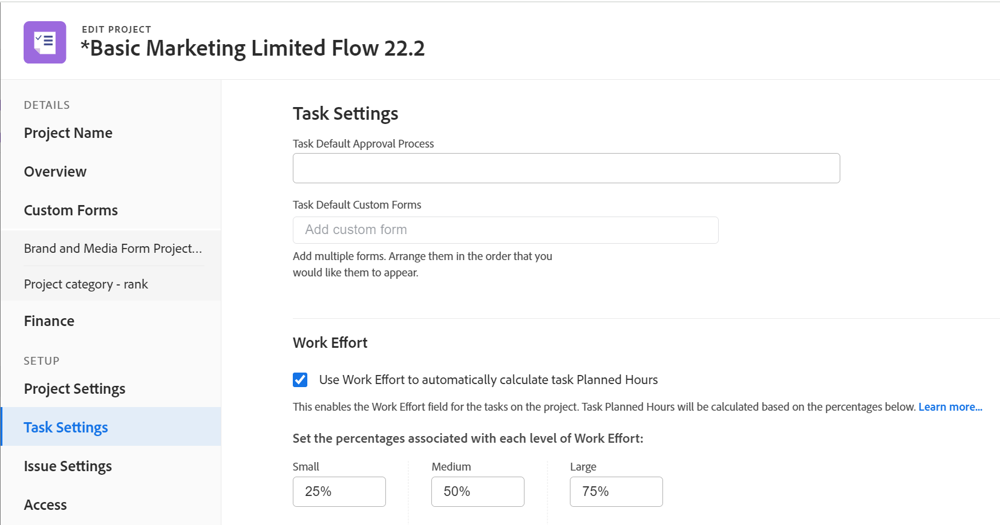

# 프로젝트 편집

<!--drafted for bulk editing projects: 
The highlighted information on this page refers to functionality not yet generally available. It is available only in the Preview environment. -->

<!--

***Linked to many articles,

The Resource Pools part also duplicates in the "Working with Resource Pools" article -

The Update Type section is also documented in Selecting the Project Update Type article

Keep the reference link to the other article that also documents the Update Type) 

(NOTE 2: information described here also exists in these articles:

** Project Overview area

**Manage project Finance area

If you need to update just one field, check to see if that field is also listed there and update in both places.)

-->

필요에 따라 Adobe Workfront에서 프로젝트를 편집할 수 있습니다. 프로젝트 상태가 [현재]로 변경된 후에 프로젝트를 최소한으로 편집하는 것이 좋습니다. 따라서 전체 프로젝트 팀에 변경 사항에 대한 알림을 보내어 혼동을 방지할 수 있습니다. 가장 좋은 방법은 프로젝트가 계획 상태에 있을 때 프로젝트를 편집해야 합니다. 프로젝트 팀에 대한 자세한 내용은 [프로젝트 팀 개요](../../../manage-work/projects/planning-a-project/project-team-overview.md).

## 액세스 요구 사항

<!--drafted - replace table at P&P:

<table style="table-layout:auto"> 
 <col> 
 <col> 
 <tbody> 
  <tr> 
   <td role="rowheader">Adobe Workfront plan*</td> 
   <td> 
Any
 </td> 
  </tr> 
  <tr> 
   <td role="rowheader">Adobe Workfront license*</td> 
   <td>
Current license: Standard 
 
   Or
   
Legacy license: Plan 
 </td> 
  </tr> 
  <tr> 
   <td role="rowheader">Access level configurations*</td> 
   <td> 
Edit access to Projects
 
If you still don't have access, ask your Workfront administrator if they set additional restrictions in your access level. For information about access to projects, see <a href="../../../administration-and-setup/add-users/configure-and-grant-access/grant-access-projects.md" class="MCXref xref">Grant access to projects</a>. For information on how a Workfront administrator can change your access level, see <a href="../../../administration-and-setup/add-users/configure-and-grant-access/create-modify-access-levels.md" class="MCXref xref">Create or modify custom access levels</a>. 
 </td> 
  </tr> 
  <tr> 
   <td role="rowheader">Object permissions</td> 
   <td> 
    <ul> 
     <li> 
Contribute permissions to a project to edit it in the Project Details area 
 </li> 
     <li> 
Manage permissions to a project to edit it in the Edit Project box
 </li> 
    </ul> 
 For information about project permissions, see <a href="../../../workfront-basics/grant-and-request-access-to-objects/share-a-project.md" class="MCXref xref">Share a project in Adobe Workfront</a>.
 
For information on requesting additional access, see <a href="../../../workfront-basics/grant-and-request-access-to-objects/request-access.md" class="MCXref xref">Request access to objects </a>.
 </td> 
  </tr> 
 </tbody> 
</table>
-->
이 문서의 절차를 수행하려면 다음 액세스 권한이 있어야 합니다.

<table style="table-layout:auto"> 
 <col> 
 <col> 
 <tbody> 
  <tr> 
   <td role="rowheader">Adobe Workfront 플랜*</td> 
   <td> 
모든
 </td> 
  </tr> 
  <tr> 
   <td role="rowheader">Adobe Workfront 라이선스*</td> 
   <td> 
플랜 
 </td> 
  </tr> 
  <tr> 
   <td role="rowheader">액세스 수준 구성*</td> 
   <td> 
프로젝트에 대한 액세스 편집
 
여전히 액세스 권한이 없는 경우 Workfront 관리자에게 액세스 수준에서 추가 제한 사항을 설정하는지 문의하십시오. 프로젝트 액세스에 대한 자세한 내용은 <a href="../../../administration-and-setup/add-users/configure-and-grant-access/grant-access-projects.md" class="MCXref xref">프로젝트에 대한 액세스 권한 부여</a>. Workfront 관리자가 액세스 수준을 변경하는 방법에 대한 자세한 내용은 <a href="../../../administration-and-setup/add-users/configure-and-grant-access/create-modify-access-levels.md" class="MCXref xref">사용자 정의 액세스 수준 만들기 또는 수정</a>. 
 </td> 
  </tr> 
  <tr> 
   <td role="rowheader">개체 권한</td> 
   <td> 
    <ul> 
     <li> 
[프로젝트 세부 정보] 영역에서 편집할 수 있는 프로젝트 권한 제공 
 </li> 
     <li> 
프로젝트 편집 상자에서 편집할 프로젝트에 대한 권한을 관리합니다
 </li> 
    </ul> 
 프로젝트 권한에 대한 자세한 내용은 <a href="../../../workfront-basics/grant-and-request-access-to-objects/share-a-project.md" class="MCXref xref">Adobe Workfront에서 프로젝트 공유</a>.
 
추가 액세스 요청에 대한 자세한 내용은 <a href="../../../workfront-basics/grant-and-request-access-to-objects/request-access.md" class="MCXref xref">개체에 대한 액세스 요청 </a>.
 </td> 
  </tr> 
 </tbody> 
</table>

*보유하고 있는 플랜, 라이선스 유형 또는 액세스를 알아보려면 Workfront 관리자에게 문의하십시오.

## 프로젝트 편집 제한 사항

프로젝트를 편집할 수 없는 몇 가지 제한 사항이 있습니다.

프로젝트를 편집할 때는 다음 사항을 고려하십시오.

* 승인 프로세스에 있는 프로젝트는 로깅 시간을 제외하고 편집할 수 없습니다.
* Workfront 관리자 또는 그룹 관리자가 [프로젝트 환경 설정] 영역에서 이 기능을 활성화한 경우에만 상태가 완료, 사용 중지 또는 승인 보류 중인 프로젝트에 문서 또는 템플릿을 첨부할 수 있습니다. 프로젝트 환경 설정 설정에 대한 자세한 내용은 [시스템 전체 프로젝트 환경 설정 구성](../../../administration-and-setup/set-up-workfront/configure-system-defaults/set-project-preferences.md).
* 이전 또는 완료 상태에서만 프로젝트에 대한 다음 정보를 편집할 수 있습니다.

   * 기존 비용을 수정합니다.
   * 사용자 지정 양식을 추가, 제거 또는 편집합니다.

## 프로젝트 편집

프로젝트를 편집하면 프로젝트에 대한 정보 및 설정과 프로젝트 관련 작업 및 문제를 수정할 수 있습니다.

이 문서에 언급된 일부 설정은 프로젝트를 만든 템플릿의 상태에 따라 기본 상태에서 수정될 수 있습니다. 템플릿 편집에 대한 자세한 내용은 [프로젝트 템플릿 편집](../../../manage-work/projects/create-and-manage-templates/edit-templates.md).

1. 을(를) 클릭합니다. **기본 메뉴** 아이콘  Adobe Workfront의 오른쪽 위 모서리에서 을(를) 클릭하고 **프로젝트**.
1. (선택 사항) **프로젝트 설정** 또는 **프로젝트 소유** 오른쪽 상단 모서리에서 사용자가 프로젝트 팀의 일부인 소유자 또는 프로젝트의 위치를 표시할 수 있습니다.

   

1. 편집할 프로젝트의 이름을 클릭하여 프로젝트 페이지를 엽니다.

   >[!NOTE]
   >
   >그룹 관리자인 경우 그룹 영역뿐만 아니라 프로젝트 영역에서도 그룹의 프로젝트를 보고 편집할 수 있습니다. 자세한 내용은 [그룹의 프로젝트 만들기 및 수정](../../../administration-and-setup/manage-groups/work-with-group-objects/create-and-modify-a-groups-projects.md).

1. (선택 사항) 프로젝트에 대한 제한된 정보를 편집하려면 **프로젝트 세부 사항** 왼쪽 패널에 표시됩니다.

   

   >[!NOTE]
   >
   >Workfront 관리자 또는 그룹 관리자가 레이아웃 템플릿을 수정한 방법에 따라 프로젝트 세부 사항 영역의 필드가 재배열되거나 표시되지 않을 수 있습니다. 자세한 내용은 [레이아웃 템플릿을 사용하여 세부 사항 보기 사용자 지정](../../../administration-and-setup/customize-workfront/use-layout-templates/customize-details-view-layout-template.md).

   세부 정보 섹션에서 정보를 편집하려면 다음을 수행합니다.

   1. (선택 사항) **모두 축소** 오른쪽 위 모서리의 아이콘을 클릭하여 모든 영역을 축소합니다.
   1. (선택 사항 및 조건부) 영역이 축소되면 **오른쪽 화살표**  각 영역 옆에 있으면 편집할 영역을 확장합니다.
   1. 프로젝트 세부 사항 탭에서 정보를 편집하는 방법에 대한 자세한 내용은 다음 문서를 참조하십시오.

      * [프로젝트 개요 영역의 정보 관리](../../../manage-work/projects/manage-projects/understand-project-overview-area.md)
      * [프로젝트 재무 영역의 정보 관리](../../../manage-work/projects/project-finances/manage-project-finance-area.md)
   1. (선택 사항) 사용자 지정 양식을 첨부하려면 **사용자 지정 양식 추가** 필드를 선택한 다음 목록에 표시될 때 선택한 다음 **변경 내용 저장**.
   1. (선택 사항) **내보내기** 아이콘  개요 및 사용자 지정 양식 정보를 PDF 파일로 내보내려면 **내보내기**. 다음 중에서 선택합니다.

      * 모두 선택(하나 이상의 사용자 지정 양식이 첨부된 경우에만 표시)
      * 개요
      * 하나 이상의 사용자 지정 양식의 이름

      PDF 파일이 컴퓨터에 다운로드됩니다.

      

      자세한 내용은 [사용자 지정 양식 및 개체 세부 정보 내보내기](../../../workfront-basics/work-with-custom-forms/export-custom-forms-details.md).
   프로젝트 세부 사항 섹션에 표시되는 필드에 대한 자세한 내용은 아래 설명된 대로 프로젝트 편집 상자에서 프로젝트를 계속 편집합니다.
1. 프로젝트에 대한 모든 정보를 편집하려면 **자세히** 메뉴  프로젝트 이름 옆에 있는 를 클릭하고 **편집**.

   또는

   프로젝트 목록에서 프로젝트를 선택한 다음 **편집** 아이콘  를 클릭합니다.

   다음 **프로젝트 편집** 상자가 열립니다.

   >[!IMPORTANT]
   >
   >편집 옵션을 보려면 프로젝트에 대한 관리 권한이 있어야 합니다.

   모든 프로젝트 필드는 프로젝트 편집 상자에서 사용할 수 있으며 왼쪽 패널에 나열된 영역별로 그룹화됩니다.

   >[!NOTE]
   >
   >Workfront 관리자 또는 그룹 관리자가 레이아웃 템플릿을 수정한 방법에 따라 프로젝트 편집 상자의 왼쪽 패널에 있는 영역이나 이러한 영역에 나열된 필드가 재배열되거나 표시되지 않을 수 있습니다. 자세한 내용은 [레이아웃 템플릿을 사용하여 세부 사항 보기 사용자 지정](../../../administration-and-setup/customize-workfront/use-layout-templates/customize-details-view-layout-template.md).

1. (조건부) **자세히** 메뉴 및 **편집**&#x200B;왼쪽 패널에 나열된 다음 영역에서 정보를 업데이트하는 것이 좋습니다.

   * [프로젝트 이름](#project-name)
   * [개요](#overview)
   * [사용자 정의 양식](#custom-forms)
   * [재무](#finance)
   * [프로젝트 설정](#project-settings)
   * [작업 설정](#task-settings)
   * [문제 설정](#issue-settings)
   * [액세스](#access)

   >[!NOTE]
   >
   >Workfront 관리자가 프로젝트의 세부 정보 영역에 대해 레이아웃 템플릿을 설정하는 방법에 따라 프로젝트 편집 상자의 섹션과 필드가 사용자 환경에서 다를 수 있습니다. 자세한 내용은 [레이아웃 템플릿을 사용하여 세부 사항 보기 사용자 지정](../../../administration-and-setup/customize-workfront/use-layout-templates/customize-details-view-layout-template.md).

### 프로젝트 이름 {#project-name}

1. 위에 설명된 대로 프로젝트 편집을 시작합니다.
1. 클릭 **프로젝트 이름** 왼쪽 패널에 표시됩니다.

   

1. 프로젝트 이름을 업데이트합니다.

   프로젝트를 일괄적으로 편집할 때는 프로젝트 이름을 편집할 수 없습니다.

### 개요 {#overview}

1. 위에 설명된 대로 프로젝트 편집을 시작합니다.
1. 클릭 **개요** 왼쪽 패널에 표시됩니다.

   

1. 프로젝트에 대한 다음 정보를 업데이트합니다.

   <table style="table-layout:auto"> 
    <col> 
    <col> 
    <tbody> 
     <tr> 
      <td role="rowheader"><strong>설명</strong> </td> 
      <td> 
프로젝트에 대한 추가 정보를 추가합니다.
 </td> 
     </tr> 
     <tr> 
      <td role="rowheader"><strong>상태</strong> </td> 
      <td> 
프로젝트의 상태를 선택합니다. 모든 작업 및 문제가 완료되기 전에 프로젝트 완료 를 표시할 수 없습니다. 프로젝트 상태에 대한 자세한 내용은 <a href="../../../administration-and-setup/customize-workfront/creating-custom-status-and-priority-labels/project-statuses.md" class="MCXref xref">시스템 프로젝트 상태 목록에 액세스합니다</a>
 </td> 
     </tr> 
     <tr> 
      <td role="rowheader"><strong>우선 순위</strong> </td> 
      <td> 
 
프로젝트의 우선 순위를 지정할 수 있는 시각적 플래그입니다.
 
Workfront 관리자가 선택한 프로젝트 환경 설정에 따라 우선순위 이름이 다를 수 있습니다. 우선순위 편집에 대한 자세한 내용은 <a href="../../../administration-and-setup/customize-workfront/creating-custom-status-and-priority-labels/create-customize-priorities.md" class="MCXref xref">우선순위 만들기 및 사용자 지정</a>
 
 </td> 
     </tr> 
     <tr> 
      <td role="rowheader"><strong>URL</strong> </td> 
      <td> 
이 프로젝트에 대한 정보와 관련된 웹 링크를 지정합니다.
 </td> 
     </tr> 
     <tr> 
      <td role="rowheader"><strong>상태 유형</strong> </td> 
      <td> 
다음 조건 유형 중에서 선택합니다. 
        <ul> 
         <li><strong>수동:</strong> 프로젝트 소유자는 프로젝트에 대한 조건을 수동으로 설정합니다.</li> 
         <li><strong>진행 상태:</strong> Workfront은 중요 경로에 있는 작업의 진행 상태에 따라 조건을 자동으로 설정합니다. 진행 상태 이해에 대한 자세한 내용은 <a href="../../../manage-work/tasks/task-information/task-progress-status.md" class="MCXref xref">작업 진행 상태 개요</a>.</li> 
        </ul>
Workfront 관리자 또는 그룹 관리자 시스템에 대해 프로젝트 조건이 계산되는 방식에 대한 기본값을 선택합니다. 또는 그룹. 프로젝트 기본값 설정에 대한 자세한 내용은 <a href="../../../administration-and-setup/set-up-workfront/configure-system-defaults/set-project-preferences.md" class="MCXref xref">시스템 전체 프로젝트 환경 설정 구성</a>. 

 </td> 
     </tr> 
     <tr> 
      <td role="rowheader"><strong>상황</strong> </td> 
      <td> 
 
(을(를) 선택한 후에만 나타납니다 <strong>수동</strong> 대상 <strong>조건 유형</strong>): 프로젝트 진행 방식을 나타내려면 조건 을 선택합니다. 
 
프로젝트 조건을 자동으로 또는 수동으로 설정하는 방법에 대한 자세한 내용은 <a href="../../../manage-work/projects/manage-projects/project-condition-and-condition-type.md" class="MCXref xref">프로젝트 조건 및 조건 유형 개요</a>
 
 </td> 
     </tr> 
     <tr> 
      <td role="rowheader"><strong>일정 모드</strong> </td> 
      <td> 
프로젝트를 시작 날짜로부터 예약할지 또는 완료 날짜에서 예약할지 지정합니다. 이 선택 사항은 프로젝트에 있는 작업의 계획 날짜를 결정합니다. 
        <ul> 
         <li><strong>시작 날짜</strong>: 프로젝트의 첫 번째 태스크에는 기본적으로 프로젝트와 동일한 계획 시작 일자가 있습니다. 계획 시작 날짜에 대한 작업에 대한 자세한 내용은 <a href="../../../manage-work/tasks/task-information/task-planned-start-date.md" class="MCXref xref">작업 계획 시작 일자 개요</a>. 프로젝트 타임라인은 시작 날짜부터 계산되며 프로젝트의 완료 날짜는 모든 작업의 지속 시간을 기준으로 시스템에 의해 계산됩니다. </li> 
         <li><strong>완료 날짜</strong>: 프로젝트의 마지막 태스크는 프로젝트와 계획 완료 일자가 동일합니다. 프로젝트 타임라인은 완료 날짜에서 계산되며 프로젝트의 시작 날짜는 프로젝트의 완료 날짜에서 모든 작업의 기간을 뺀 값으로 시스템에 의해 계산됩니다. </li> 
        </ul>
Workfront 관리자 또는 그룹 관리자 시스템 또는 그룹에 대한 기본 예약 모드 설정을 선택합니다. 프로젝트 기본값 설정에 대한 자세한 내용은 <a href="../../../administration-and-setup/set-up-workfront/configure-system-defaults/set-project-preferences.md" class="MCXref xref">시스템 전체 프로젝트 환경 설정 구성</a>.

 </td> 
     </tr> 
     <tr> 
      <td role="rowheader"><strong>계획 시작 날짜 및 시간</strong> </td> 
      <td> 
 
선택할 날짜를 지정합니다 <strong>시작 날짜로부터 예약</strong>.  
 
선택한 경우 읽기 전용 필드입니다 <strong>완료 날짜로부터 스케줄</strong>. 
 
 </td> 
     </tr> 
     <tr> 
      <td role="rowheader"><strong>계획 완료 날짜 및 시간</strong> </td> 
      <td> 
선택할 날짜를 지정합니다 <strong>완료 날짜로부터 스케줄</strong>. 
 
선택한 경우 읽기 전용 필드입니다 <strong>시작 날짜의 스케줄</strong>. 
 </td> 
     </tr> 
     <tr> 
      <td role="rowheader"><strong>포트폴리오</strong></td> 
      <td>프로젝트가 속한 Portfolio을 나타냅니다. Portfolio이 드롭다운 목록에 표시되기 전에 먼저 페이지를 만들어야 합니다. 활성 포트폴리오만 프로젝트와 연결할 수 있습니다. 포트폴리오 만들기에 대한 자세한 내용은 <a href="../../../manage-work/portfolios/create-and-manage-portfolios/create-portfolios.md" class="MCXref xref">포트폴리오 만들기 </a>.</td> 
     </tr> 
     <tr> 
      <td role="rowheader"><strong>프로그램</strong></td> 
      <td> 
프로젝트에 대한 Portfolio을 선택한 경우 프로젝트에 대한 프로그램을 지정합니다. 일부 Portfolio에 프로그램이 없을 수 있습니다. 이 드롭다운 목록에 프로그램이 표시되기 전에 먼저 프로그램을 만들어야 합니다. 활성 프로그램만 프로젝트와 연결할 수 있습니다. 
 
프로그램 만들기에 대한 자세한 내용은 <a href="../../../manage-work/portfolios/create-and-manage-programs/create-program.md" class="MCXref xref">프로그램 만들기</a>.
 </td> 
     </tr> 
     <tr> 
      <td role="rowheader"><strong>그룹</strong></td> 
      <td> 
 
프로젝트와 연결된 그룹의 이름을 지정합니다. 
필수 필드입니다. 그룹과 연결되지 않은 프로젝트는 가질 수 없습니다. 
 
마우스로 가리키고 정보 아이콘을 클릭하여 올바른 그룹을 선택할 수 있습니다  옆에 표시됩니다. 그룹 위에 있는 그룹 계층 및 해당 관리자와 같은 그룹에 대한 정보를 나열하는 도구 설명이 표시됩니다.
 다른 그룹을 지정하지 않는 한 기본적으로 다음 그룹 중 하나가 프로젝트를 만들 때 자동으로 연결됩니다.
 
        <ul> 
         <li> 
[프로젝트] 영역에서 프로젝트가 생성되면 프로젝트 생성자의 홈 그룹이 프로젝트와 연결됩니다. 
 
프로젝트가 포트폴리오 또는 프로그램의 프로젝트 섹션에서 만들어지는 경우에도 마찬가지입니다.
 </li> 
         <li> 
프로젝트가 설정 영역의 그룹 기본 페이지에서 생성되면 해당 그룹이 프로젝트와 연결됩니다.
 </li> 
        </ul> 
 
  
 
프로젝트 또는 해당 작업 또는 문제가 이미 그룹 수준 사용자 지정 상태를 사용하는 그룹 수준 승인 프로세스와 연관된 경우 그룹을 변경하면 이전 그룹의 승인 상태와 시스템 수준의 기존 승인 상태가 충돌할 수 있습니다. 그룹을 업데이트하기 전에 프로젝트에서 그룹 수준의 승인 프로세스 또는 해당 작업 또는 문제를 제거하는 것이 좋습니다. 그룹 수준 승인 프로세스 생성에 대한 자세한 내용은 <a href="../../../administration-and-setup/manage-groups/work-with-group-objects/create-and-modify-groups-approval-processes.md" class="MCXref xref">그룹 수준 승인 프로세스</a>. 그룹 수준 사용자 지정 상태 만들기에 대한 자세한 내용은 <a href="../../../administration-and-setup/manage-groups/manage-group-statuses/create-or-edit-a-group-status.md" class="MCXref xref">그룹 상태 만들기 또는 편집</a>
 </td> 
     </tr> 
     <tr> 
      <td role="rowheader"><strong>회사</strong> </td> 
      <td> 
프로젝트와 연결된 회사를 지정합니다. 회사와 프로젝트에 연결하려면 먼저 회사를 만들어야 합니다. 활성 회사만 프로젝트와 연결할 수 있습니다. 회사 만들기에 대한 내용은 <a href="../../../administration-and-setup/set-up-workfront/organizational-setup/create-and-edit-companies.md" class="MCXref xref">회사 만들기 및 편집</a>.
 </td> 
     </tr> 
     <tr> 
      <td role="rowheader"><strong>프로젝트 소유자</strong> </td> 
      <td> 
사용자 이름을 입력하여 프로젝트에 추가한 다음 목록에 표시될 때 선택합니다. 사용자는 프로젝트 팀에 추가되고 프로젝트에 대한 관리 권한이 자동으로 제공됩니다. 프로젝트 소유자로 지정된 사용자는 Workfront 활성 사용자여야 합니다.

      </td> 
     </tr> 
     <tr> 
      <td role="rowheader"><strong>프로젝트 스폰서</strong> </td> 
      <td> 
사용자 이름을 입력하여 프로젝트에 추가한 다음 목록에 표시될 때 선택합니다. 사용자는 프로젝트 팀에 추가되고 프로젝트에 대한 보기 권한이 자동으로 제공됩니다. 프로젝트 스폰서로 지정된 사용자는 Workfront 활성 사용자여야 합니다. 
 </td> 
     </tr> 
     <tr> 
      <td role="rowheader"><strong>리소스 관리자</strong> </td> 
      <td> 
 사용자 이름을 입력하여 프로젝트에 추가한 다음 목록에 표시할 때 선택합니다. 사용자는 프로젝트 팀에 추가되고 프로젝트에 대한 관리 권한이 자동으로 부여되며 프로젝트의 작업 및 문제에 리소스를 할당할 수 있습니다. 사용자는 리소스 관리자 필드에서 제거되더라도 프로젝트에 대한 관리 권한을 유지합니다. 둘 이상의 리소스 관리자를 지정할 수 있습니다. 
 </td> 
     </tr> 
    </tbody> 
   </table>

   >[!TIP]
   >
   >   프로젝트 소유자, 프로젝트 스폰서 및 리소스 관리자 필드를 업데이트할 때 아바타, 사용자의 기본 역할 또는 이메일 주소를 확인하여 동일한 이름의 사용자를 구별하십시오. 사용자를 추가할 때 해당 역할을 보려면 사용자를 하나 이상의 작업 역할과 연결해야 합니다.

1. (선택 사항) 수정할 정보에 따라 다음 섹션을 계속 편집합니다.

   또는

   **저장**&#x200B;을 클릭합니다.

### 사용자 정의 양식 {#custom-forms}

1. 위에 설명된 대로 프로젝트 편집을 시작합니다.
1. 클릭 **사용자 지정 Forms** 왼쪽 패널에 표시됩니다.

   

1. 을(를) 클릭합니다. **사용자 지정 양식 추가** 상자를 열고 목록에서 양식을 선택하여 프로젝트에 첨부합니다.

   이 필드에서 사용자 지정 양식을 선택하려면 먼저 사용자 지정 양식을 작성해야 합니다. 활성 사용자 지정 양식만 목록에 나타납니다. 사용자 지정 양식 작성에 대한 자세한 내용은 [사용자 지정 양식 만들기 또는 편집](../../../administration-and-setup/customize-workfront/create-manage-custom-forms/create-or-edit-a-custom-form.md). 프로젝트에 최대 10개의 사용자 지정 양식을 추가할 수 있습니다.

1. (조건부) 프로젝트에 사용자 지정 양식을 첨부한 경우 양식의 필드를 편집합니다. 프로젝트를 저장하려면 먼저 모든 필수 필드를 지정해야 합니다.

   >[!NOTE]
   >
   >Workfront 관리자가 사용자 지정 양식의 섹션에 대한 권한을 설정하는 방법에 따라 모든 사람이 주어진 사용자 지정 양식에서 동일한 필드를 보거나 편집할 수 있는 것은 아닙니다. 사용자 지정 양식의 섹션 내에서 필드를 편집할 수 있는 권한은 프로젝트 자체에 대한 권한에 따라 다릅니다. 사용자 지정 양식의 섹션에 대한 권한 설정에 대한 자세한 내용은 [사용자 지정 양식 만들기 또는 편집](../../../administration-and-setup/customize-workfront/create-manage-custom-forms/create-or-edit-a-custom-form.md). 프로젝트에 대한 권한 설정에 대한 자세한 내용은 [Adobe Workfront에서 프로젝트 공유](../../../workfront-basics/grant-and-request-access-to-objects/share-a-project.md).

1. (선택 사항) **X 아이콘** 사용자 지정 양식 이름의 오른쪽에 있는 를 클릭하여 제거한 다음 **제거**.
1. (선택 사항) 수정할 정보에 따라 다음 섹션을 계속 편집합니다

   또는

   **저장**&#x200B;을 클릭합니다.

### 재무 {#finance}

1. 위에 설명된 대로 프로젝트 편집을 시작합니다.
1. 클릭 **재무** 왼쪽 패널에 표시됩니다.

   

1. 프로젝트에 대한 다음 재무 정보를 갱신합니다.

   <table style="table-layout:auto"> 
    <col> 
    <col> 
    <tbody> 
     <tr data-mc-conditions=""> 
      <td role="rowheader"><strong>통화</strong> </td> 
      <td> 
 
시스템의 기본 통화와 다른 경우 프로젝트의 통화를 지정합니다. 프로젝트에 대한 재무 정보가 이미 있는 경우 프로젝트의 통화를 변경할 수 없습니다. 시스템에 기본 통화만 있는 경우에는 이 필드가 표시되지 않습니다. 
 
통화에 대한 자세한 내용은 <a href="../../../administration-and-setup/manage-workfront/exchange-rates/set-up-exchange-rates.md" class="MCXref xref">환율 설정</a>. 
 
 </td> 
     </tr> 
     <tr> 
      <td role="rowheader"><strong>예산</strong> </td> 
      <td> 
프로젝트에 대한 예산을 지정합니다. 
 </td> 
     </tr> 
     <tr> 
      <td role="rowheader"><strong>성과 지수 방법</strong> </td> 
      <td> 
선택 <b>시간 기반</b>, 또는 <b>비용 기반</b> 프로젝트(예: 원가 성과 지수 또는 예상 실제 원가)의 획득값 측정 단위가 시간 또는 원가를 사용하여 계산되는지 여부를 나타냅니다. 
 
성능 인덱스 메서드에 대한 자세한 내용은 <a href="../../../manage-work/projects/project-finances/set-pim.md" class="MCXref xref">PIM(성능 인덱스 메서드) 설정</a>. 
 
Workfront 관리자 또는 그룹 관리자 시스템 또는 그룹에 대한 기본 성능 인덱스 방법 설정을 선택합니다. 프로젝트 기본값 설정에 대한 자세한 내용은 <a href="../../../administration-and-setup/set-up-workfront/configure-system-defaults/set-project-preferences.md" class="MCXref xref">시스템 전체 프로젝트 환경 설정 구성</a>.
 </td> 
     </tr> 
     <tr> 
      <td role="rowheader"><strong>완료 시점 예측</strong> </td> 
      <td> 
 
Workfront에서 EAC(완료 시 예상)를 계산하는 방법을 지정합니다. 

      다음 옵션 중에서 선택합니다. 
      <ul><li><b>프로젝트 수준에서 계산</b></li>
      <li><b>작업/하위 작업에서 롤업</b></li> </ul>
      
완료 시 예상 계산 방법에 대한 자세한 내용은 <a href="../../../manage-work/projects/project-finances/calculate-eac.md" class="MCXref xref">완료 시 예상 계산(EAC)</a>.
 
Workfront 또는 그룹 관리자가 시스템 또는 그룹에 대한 기본 완료 시 예상 설정을 선택합니다. 프로젝트 기본값 설정에 대한 자세한 내용은 <a href="../../../administration-and-setup/set-up-workfront/configure-system-defaults/set-project-preferences.md" class="MCXref xref">시스템 전체 프로젝트 환경 설정 구성</a>.
 
 </td> 
     </tr> 
     <tr> 
      <td role="rowheader"><strong>계획된 이익</strong> </td> 
      <td> 
프로젝트의 계획된 이익을 예측합니다. 프로젝트의 비즈니스 사례 및 Portfolio 최적기에서 사용됩니다. 프로젝트의 계획된 혜택에 대한 자세한 내용은 <a href="../../../manage-work/projects/project-finances/project-planned-benefit.md" class="MCXref xref">프로젝트 계획 이익 개요</a>. 프로젝트의 순 값이 계산될 때 프로젝트의 계획 이익이 고려됩니다. 
 
자세한 내용은 <a href="../../../manage-work/portfolios/portfolio-optimizer/manage-projects-in-portfolio-optimizer.md" class="MCXref xref">Portfolio 최적기에서 프로젝트 관리</a> . 
 </td> 
     </tr> 
     <tr> 
      <td role="rowheader"><strong>실제 이익</strong> </td> 
      <td> 
프로젝트의 실제 이익을 예측합니다. 이 금액은 프로젝트가 완료된 후 회사 또는 부서가 얻을 수 있는 이점을 나타내는 통화 금액입니다. 
 </td> 
     </tr> 
      <tr> 
      <td role="rowheader"><strong>고정 비용</strong> </td> 
      <td> 
프로젝트에 대한 고정 비용을 지정합니다. 프로젝트의 시간 및 프로젝트의 비용 금액에서 발생하는 비용 비용과는 다릅니다. 프로젝트의 순 값을 계산할 때 프로젝트의 고정 비용이 고려되며, 예산책정된 원가의 일부입니다. 
 </td> 
     </tr> 
     <tr> 
      <td role="rowheader"><strong>고정 수입</strong> </td> 
      <td> 
프로젝트에 대한 고정 수익 을 지정합니다. 
 </td> 
     </tr> 
    </tbody> 
   </table>

1. (선택 사항) 수정할 정보에 따라 다음 섹션을 계속 편집합니다.

   또는

   **저장**&#x200B;을 클릭합니다.

### 프로젝트 설정 {#project-settings}

1. 위에 설명된 대로 프로젝트 편집을 시작합니다.
1. 클릭 **프로젝트 설정** 왼쪽 패널에 표시됩니다.

   

1. 다음 정보를 업데이트합니다.

   <table style="table-layout:auto"> 
      <col> 
      <col> 
      <tbody> 
      <tr> 
      <td role="rowheader"><strong>마일스톤 경로</strong> </td> 
       <td> 
프로젝트의 이정표 경로를 선택합니다. 활성 이정표 경로만 목록에 표시됩니다.
 
이정표 경로에 대한 자세한 내용은 <a href="../../../administration-and-setup/customize-workfront/configure-approval-milestone-processes/create-milestone-path.md" class="MCXref xref">이정표 경로 만들기</a>.
 </td> 
      </tr> 
      <tr> 
      <td role="rowheader"><strong>완료 모드</strong> </td> 
      <td> 
프로젝트가 완료로 표시되는 방식을 제어합니다. 다음 옵션 중에서 선택합니다. 
       <ul> 
       <li>
<strong>자동</strong>: 모든 작업 및 문제가 완료되면 프로젝트가 완료됨으로 표시됩니다.

작업이 완료될 때 프로젝트 상태가 현재인 경우에만 프로젝트 상태가 완료 로 자동 변경됩니다. 
</li> 
       <li><strong>수동</strong>: 모든 작업 및 문제가 완료되면 프로젝트에 대한 완료 상태를 수동으로 선택해야 합니다.</li> 
       </ul>
 </td> 
       </tr> 
       <tr> 
       <td role="rowheader"><strong>요약 완료 모드</strong></td> 
       <td> 
상위 작업이 완료로 표시되는 방식을 제어합니다. 다음 옵션 중에서 선택합니다. 
       <ul> 
       <li><strong>자동</strong>: 상위 작업은 완료됨으로 표시되고 하위 작업이 완료되고 하위 작업의 완료율이 업데이트되므로 완료율을 자동으로 업데이트합니다. </li> 
       <li><strong>수동</strong>: 하위 작업에 대한 변경 사항과 관계없이 완료 비율 및 상위 작업의 상태를 수동으로 업데이트해야 합니다.</li> 
       </ul>
 </td> 
       </tr> 
       <tr> 
       <td role="rowheader"><strong>업데이트 유형</strong></td> 
       <td> 
프로젝트 타임라인에 대한 변경 내용이 프로젝트 또는 상위 작업에 저장될 시기를 제어합니다. 예를 들어, 프로젝트에 대한 다음 변경 사항은 프로젝트의 타임라인에 대한 업데이트를 트리거하는 것입니다. 
       <ul> 
       <li>작업 날짜 업데이트</li> 
       <li>작업의 이전 관계 변경</li> 
       <li>
작업 제약 조건 또는 기간 유형을 변경할 뿐만 아니라 상위-하위 관계를 변경하거나 할당을 추가 또는 제거합니다.

작업이 업데이트되면 업데이트 유형이 나타내는 시간에 상위 객체(상위 작업 또는 프로젝트)가 업데이트됩니다. 

"자동 및 변경 시" 또는 "변경만" 업데이트 유형을 선택할 때 변경 후 상위 개체가 즉시 업데이트되지 않으면 페이지를 새로 고칩니다

다음 옵션 중에서 선택합니다. 

- <strong>자동 및 변경 시</strong> (기본 설정): 프로젝트 타임라인은 프로젝트 또는 프로젝트가 종속되는 다른 프로젝트에서 변경(변경 시)이 발생할 때마다 업데이트됩니다. 프로젝트 타임라인은 매일 밤(자동) 업데이트됩니다.

이 설정은 프로젝트가 항상 최신 상태가 되도록 하기 때문에 이 필드에 권장되는 설정입니다.

타임라인 재계산을 트리거하는 작업 또는 프로젝트에 대해 작업을 수행하면 사용 가능한 모든 날짜가 즉시 표시되므로 작업을 계속할 수 있습니다. 100개 이상의 작업이 있는 프로젝트의 경우 더 긴 다시 계산이 필요한 날짜가 물음표(1초와 5초 사이 또는 큰 프로젝트의 경우 최대 1분)로 잠깐 표시됩니다. 이것은 재계산이 아직 완료되지 않았으며 날짜가 변경될 수 있음을 나타냅니다.

- <strong>변경만</strong>: 프로젝트 타임라인은 프로젝트 또는 프로젝트가 종속된 다른 프로젝트에서 변경 사항이 발생할 때마다 업데이트됩니다. 프로젝트 또는 타임라인이 종속된 다른 프로젝트에서 변경 사항이 거의 발생하지 않는 경우 이 옵션을 선택할 수 있습니다.

- <strong>자동 전용</strong>: 프로젝트 타임라인은 매일 밤 업데이트됩니다. 타임라인은 변경한 직후에 업데이트되지 않습니다.

프로젝트 또는 타임라인이 종속된 다른 프로젝트에서 매일 많은 변경 사항이 발생하는 경우 이 옵션을 선택할 수 있습니다. 그러나 이 설정은 프로젝트가 변경되더라도 동시에 업데이트되지 않으므로 반드시 선택하시기 바랍니다.

- <strong>수동 전용</strong>: 프로젝트 타임라인은 타임라인 재계산 옵션을 선택한 경우에만 업데이트됩니다. 프로젝트 타임라인 수동 재계산에 대한 자세한 내용은 <a href="../../../manage-work/projects/manage-projects/recalculate-project-timeline.md" class="MCXref xref">프로젝트 타임라인 다시 계산</a>. 

한 번에 여러 개의 프로젝트를 변경하고 모든 변경 사항이 수행된 후(각 개별 변경 후보다) 타임라인 재계산을 수행하려는 경우 이 옵션을 선택할 수 있습니다.
</li> 
       </ul>
 </td> 
       </tr> 
       <tr> 
       <td role="rowheader"><strong>일정</strong> </td> 
       <td> 
프로젝트 일정을 선택합니다. 프로젝트에서 작업 중인 대부분의 사용자에게 할당된 일정과 같아야 합니다. 프로젝트 또는 사용자에게 할당하려면 먼저 일정을 만들어야 합니다. 시스템에 사용자 지정 일정을 만들지 않은 경우 기본 일정이 선택됩니다.
 
예약 작성에 대한 자세한 내용은 <a href="../../../administration-and-setup/set-up-workfront/configure-timesheets-schedules/create-schedules.md" class="MCXref xref">예약 만들기</a>. 
 </td> 
       </tr> 
       <tr> 
       <td role="rowheader"><strong>사용자 휴무</strong> </td> 
       <td> 
태스크의 기본 담당자 시간이 프로젝트에서 작업 계획 날짜를 조정하는지 여부를 결정합니다. 

Workfront 관리자 또는 그룹 관리자 시스템에 대해 이 설정에 대한 기본값을 선택합니다. 또는 그룹. 프로젝트 기본값 설정에 대한 자세한 내용은 <a href="../../../administration-and-setup/set-up-workfront/configure-system-defaults/set-project-preferences.md" class="MCXref xref">시스템 전체 프로젝트 환경 설정 구성</a>. 

다음 옵션 중에서 선택합니다. - <strong>작업 기간의 사용자 시간 비우기 고려</strong>: 이 옵션을 선택하면 작업의 계획 날짜가 작업 기간 동안 시간 초과가 발생하는 경우 작업의 기본 할당자의 시간 초과에 따라 조정됩니다. 

예를 들어, 가능한 한 빨리 라는 제약 조건이 있는 작업이 6월 1일에 시작하여 6월 3일에 완료되도록 예약되어 있고, 기본 할당자가 6월 2일을 시간 단축으로 표시한 경우, 이 선택 사항이 활성화되면 6월 1일부터 6월 4일까지 작업 계획 날짜가 표시됩니다. 작업 제약 조건에 따라 다음과 같은 시나리오가 있습니다. 
 
       <ul> 
       <li>시작 일자(가능한 한 빨리, 가능한 한 빨리, 가능한 한 빠른 시간, 가장 이른 시작 시간, 다음으로 시작 일자, 다음으로 시작 시기, 시작 시기)에서 계획되는 시작 일자가 변경되지 않지만 계획 완료 일자가 변경됩니다.</li> 
       <li>완료 일자부터 계획과 관련된 태스크 제한조건(가능한 한 늦게, 사용 가능한 최근 시간, 완료 이전부터, 완료 후, 완료 시점까지)에 대해서는 계획 완료 일자가 변경되지 않지만 계획 시작 일자가 변경됩니다.</li> 
       <li>고정 일자 제약 조건이 있는 작업의 경우 계획 시작 또는 완료 일자가 변경되지 않습니다. </li> 
       </ul>
이 설정을 선택하면 작업 기간이 변경되지 않습니다. 작업 제약 조건에 따라 계획된 날짜만 변경됩니다. 작업 제한에 대한 자세한 내용은 <a href="../../../manage-work/tasks/task-constraints/task-constraint-overview.md" class="MCXref xref">작업 제한 개요</a>. 

- <strong>작업 기간의 사용자 시간 초과 무시</strong>: 이 옵션을 선택하면, 작업의 기본 담당자가 작업 기간 동안 휴가가 되어도 프로젝트에서 작업중인 작업의 계획된 날짜가 원래 계획되어 유지됩니다. 

이 설정에 대한 옵션을 선택할 때는 다음 사항을 고려하십시오.
 
       <ul> 
       <li>
새 프로젝트에 대한 이 설정의 기본 옵션은 시스템 수준 프로젝트 기본 설정과 동일합니다. 

시스템 수준의 프로젝트 환경 설정에 대한 자세한 내용은 <a href="../../../administration-and-setup/set-up-workfront/configure-system-defaults/set-project-preferences.md" class="MCXref xref">시스템 전체 프로젝트 환경 설정 구성</a>. 
</li> 
       <li>템플릿을 기존 프로젝트에 첨부하면 프로젝트의 설정이 템플릿 중 하나와 일치하도록 업데이트됩니다. </li> 
       <li>
Workfront에서는 작업의 작업 제한 값에 따라 조정할 계획 작업 날짜를 결정합니다. 계획 시작 또는 계획 완료 일자에 따라, 또는 둘 다 영향을 받거나, 동일하게 유지될 수 있습니다. 예를 들어, 작업에 고정 날짜 제한이 있는 경우, 기본 할당자가 시간 초과인 경우에도 날짜가 조정되지 않습니다 <strong>작업 기간의 사용자 시간 비우기 고려</strong> 이 선택되어 있습니다. 
</li> 
       </ul></td> 
      </tr> 
      <tr> 
       <td role="rowheader"><strong>리소스 레벨링 모드</strong> </td> 
       <td> 
 
다음 옵션 중에서 선택합니다.
 
- <strong>수동</strong>: 수동으로 리소스 수준 지정(기본 설정)
 
- <strong>자동</strong>: Workfront은 리소스를 표시합니다.
 
리소스 평준화에 대한 자세한 내용은 <a href="../../../manage-work/gantt-chart/use-the-gantt-chart/level-resources-in-gantt.md" class="MCXref xref">간트 차트의 레벨 리소스 </a>.
 
 </td> 
      </tr> 
      <tr> 
       <td role="rowheader"><strong>위험</strong> </td> 
       <td> 
 
프로젝트의 위험 수준을 정의합니다. 위험은 얼마나 위험한 사업이 될 수 있는지를 나타내는 지표일 뿐이다. 위험 수준에 따라 프로젝트 실행에 우선 순위를 지정할 수 있습니다.
 
 
다음 위험 수준 중에서 선택하는 것이 좋습니다.
 
- 매우 낮음
 
- 낮음
 
- 중간
 
- 높음
 
- 매우 높음
 
여기에서 표시하는 위험 수준은 사용자 지정할 수 없습니다.
 
이는 프로젝트 수명 동안 발생할 수 있고 프로젝트의 위험 탭 또는 비즈니스 사례에 기록해야 하는 잠재적 위험 요소와 관련이 없습니다. 잠재적 프로젝트 위험에 대한 자세한 내용은 <a href="../../../administration-and-setup/set-up-workfront/configure-system-defaults/edit-create-risk-types.md" class="MCXref xref">위험 유형 편집 및 생성</a>. 
 
 
 </td> 
      </tr> 
      <tr> 
       <td role="rowheader"><strong>리소스 풀</strong> </td> 
       <td> 
 
프로젝트와 연결된 리소스 풀을 지정합니다. 자원 풀은 프로젝트 완료에 동시에 필요한 사용자의 모음이며 Resource Planner에서 프로젝트 예산책정을 허용합니다. 리소스 풀에 대한 자세한 내용은 <a href="../../../resource-mgmt/resource-planning/resource-pools/work-with-resource-pools.md" class="MCXref xref"> 리소스 풀 개요 </a>. 
 
프로젝트를 일괄적으로 편집하면 선택한 모든 프로젝트에 공통인 리소스 풀만 이 필드에 나타납니다. 선택한 프로젝트에 공유 리소스 풀이 없으면 이 필드는 비어 있습니다. 여기서 지정하는 리소스 풀은 프로젝트의 개별 리소스 풀을 덮어씁니다.
 
 </td> 
      </tr> 
      <tr> 
       <td role="rowheader"> <strong>회사 수준의 청구 요금이 프로젝트 수준의 청구 요금을 재정의할 수 있도록 허용</strong></td> 
       <td>해당 비율이 청구됨으로 표시되지 않는 경우 회사 수준 청구 비율이 과거 작업 역할 비율을 대체하도록 하려면 이 옵션을 선택합니다. 이 옵션을 활성화하면 청구로 표시되지 않는 한 이전 작업 역할 비율을 무시합니다.  자세한 내용은 <a href="../../../manage-work/projects/project-finances/override-project-level-with-company-level-billing-rates.md" class="MCXref xref">회사 수준 청구 단가로 프로젝트 레벨 청구 비율 대체</a>.</td> 
      </tr> 
      <tr> 
       <td role="rowheader"><strong>이 프로젝트를 승인할 시간 필요</strong></td> 
       <td> 
 프로젝트 소유자가 프로젝트에 로그온한 시간을 승인하도록 하려면 이 옵션을 선택합니다. 청구 레코드를 사용하고 이 옵션을 선택하면 프로젝트의 승인된 시간만 청구 레코드에 대해 사용 가능한 청구 가능 시간으로 나타납니다. 프로젝트의 시간 승인은 작업표 승인과는 별개입니다. 
 
프로젝트에 대한 승인 시간을 요구하는 방법에 대한 자세한 내용은 <a href="../../../manage-work/projects/manage-projects/require-time-approval-for-projects.md" class="MCXref xref">프로젝트 승인 시간 필요</a>.
 </td> 
      </tr> 
      <tr> 
       <td role="rowheader"><strong>필터 시간 유형</strong> 및 <strong>시간 유형</strong></td> 
       <td> 
 
다음 옵션 중에서 선택합니다.
 
       <ul> 
       <li> 
선택 <strong>아니요</strong> 을 눌러 프로젝트에서 모든 프로젝트별 시간 유형을 사용할 수 있도록 합니다. (기본 선택 사항입니다)
 
또는
 </li> 
       <li>선택 <strong>예</strong> 프로젝트별 시간 유형의 하위 집합만 프로젝트에서 사용할 수 있게 하려면, 사용할 수 있게 하려는 시간 유형을 선택합니다. (Shift 키를 누른 상태로 여러 시간 유형을 선택합니다.)</li> 
       
이 옵션을 선택하면 선택한 시간 유형만 프로젝트에 대해 시간을 로깅할 때(또는 프로젝트 내의 작업 및 문제) 선택할 수 있습니다. 적어도 1시간 유형을 선택해야 합니다. 이 옵션을 선택하고 시간 유형을 선택하지 않으면 프로젝트에서 모든 시간 유형을 사용할 수 있습니다.
 </ul>

   
사용자가 프로젝트에서 이러한 시간 유형 옵션을 보려면 개별 사용자 수준에서 동일한 시간 유형을 선택해야 합니다. 사용자 수준에서 시간 유형 정의에 대한 자세한 내용은 <a href="../../../timesheets/create-and-manage-timesheets/log-time.md" class="MCXref xref">로그 시간</a>. 
 
 </td> 
      </tr> 
      <tr data-mc-conditions=""> 
       <td role="rowheader"><strong>미리 알림</strong> </td> 
       <td> 
 
프로젝트와 연결할 미리 알림 을 선택합니다. 프로젝트를 편집하는 동안 이 필드가 나타나도록 프로젝트에 대한 미리 알림 알림을 구성해야 합니다. 미리 알림 구성에 대한 자세한 내용은 <a href="../../../administration-and-setup/manage-workfront/emails/set-up-reminder-notifications.md"><a href="../../../administration-and-setup/manage-workfront/emails/set-up-reminder-notifications.md" class="MCXref xref">미리 알림 설정</a> .</a>
 
 </td> 
      </tr> 
      <tr data-mc-conditions=""> 
       <td role="rowheader"><strong>승인 진행</strong></td> 
       <td> 
프로젝트와 연결할 승인 프로세스를 선택합니다. 프로젝트에 연결하려면 먼저 Workfront 관리자가 시스템 수준 승인 프로세스를 정의해야 합니다. 승인 프로세스에 대한 관리자 액세스 권한이 있는 사용자도 그룹별 승인 프로세스를 만들 수 있습니다. 승인 프로세스 만들기에 대한 자세한 내용은 <a href="../../../administration-and-setup/customize-workfront/configure-approval-milestone-processes/create-approval-processes.md" class="MCXref xref">작업 항목에 대한 승인 프로세스 생성</a>.
 
승인 프로세스를 추가할 때 다음 사항을 고려하십시오. 
 
       <ul> 
       <li>활성 승인 프로세스만 목록에 표시됩니다. </li> 
       <li> 
시스템 전체 및 그룹별 승인 프로세스가 목록에 표시됩니다. 프로젝트 이외의 그룹과 연관된 승인 프로세스가 목록에 표시되지 않습니다.
 
프로젝트와 연관된 그룹이 변경되면 그룹별 승인 프로세스는 단일 사용 승인 프로세스가 됩니다. 프로젝트 그룹의 변경 사항이나 승인 프로세스의 변경 사항이 승인 설정에 미치는 영향에 대한 자세한 내용은 <a href="../../../administration-and-setup/customize-workfront/configure-approval-milestone-processes/how-changes-affect-group-approvals.md" class="MCXref xref">그룹 및 승인 프로세스 변경이 지정된 승인 프로세스에 미치는 영향</a>. 
 </li>

   <!--(NOTE: this bullet stays here although the sections it might appear in are QS only, so we can use the snippet for both Qs and classic)-->

   
프로젝트를 벌크 편집할 때 다음 시나리오가 있습니다.

   <ul> 
   <li> 
동일한 그룹에서 프로젝트를 선택하면 시스템 수준 및 그룹 수준 승인 프로세스가 모두 이 필드에 표시됩니다.
 </li> 
   <li> 
다른 그룹에서 프로젝트를 선택하면 시스템 수준 승인 프로세스만 이 필드에 표시됩니다.
 </li> 
   <li> 
프로젝트에 단일 사용 승인 프로세스가 첨부된 경우 선택한 시스템 레벨 또는 그룹 레벨 승인 프로세스로 대체됩니다. 
 </li> 
   </ul> 
      </ul> </td> 
      </tr> 
      <tr> 
      </tr> 
      </tbody> 
      </table>

1. (선택 사항) 수정할 정보에 따라 다음 섹션을 계속 편집합니다.

   또는

   **저장**&#x200B;을 클릭합니다.

### 작업 설정 {#task-settings}

프로젝트에 추가할 때 모든 새 작업과 연결할 기본값을 정의할 수 있습니다.

이러한 설정이 새 작업 만들기에 미치는 영향에 대한 자세한 내용은 섹션을 참조하십시오 [프로젝트에 작업을 추가할 때 작업 기본값이 설정됩니다](../../../manage-work/tasks/create-tasks/create-tasks-overview.md#understa) 기사 [작업 만들기 개요](../../../manage-work/tasks/create-tasks/create-tasks-overview.md).

1. 위에 설명된 대로 프로젝트 편집을 시작합니다.
1. 클릭 **작업 설정** 왼쪽 패널에 표시됩니다.

   

1. 에서 **작업 기본 승인 프로세스** 상자에 새 작업을 프로젝트에 추가할 때 새 작업과 연결할 승인 프로세스 작업을 선택합니다.

   프로젝트에 연결하려면 먼저 Workfront 관리자(또는 승인 프로세스에 대한 관리자 액세스 권한이 있는 사용자)가 작업에 대한 시스템 수준 승인 프로세스를 만들어야 합니다. 활성 승인 프로세스만 목록에 표시됩니다. 승인 프로세스 생성에 대한 자세한 내용은 [작업 항목에 대한 승인 프로세스 생성](../../../administration-and-setup/customize-workfront/configure-approval-milestone-processes/create-approval-processes.md). 프로젝트 그룹의 변경 사항이나 승인 프로세스의 변경 사항이 승인 설정에 미치는 영향에 대한 자세한 내용은 [그룹 및 승인 프로세스 변경이 지정된 승인 프로세스에 미치는 영향](../../../administration-and-setup/customize-workfront/configure-approval-milestone-processes/how-changes-affect-group-approvals.md).

   프로젝트를 벌크 편집할 때 다음 시나리오가 있습니다.

   * 동일한 그룹에서 여러 프로젝트를 선택하면 시스템 레벨과 그룹별 작업 승인 프로세스가 모두 이 필드에 표시됩니다.
   * 여러 그룹에서 여러 프로젝트를 선택하면 시스템 수준 작업 승인 프로세스만 이 필드에 표시됩니다.

1. 에서 **작업 기본 사용자 지정 Forms** 상자에서 프로젝트에 추가할 때 모든 새 작업과 연결할 사용자 지정 양식이나 양식을 선택합니다. 이 필드에서 사용자 지정 양식을 선택하려면 먼저 사용자 지정 양식을 작성해야 합니다. 활성 사용자 지정 양식만 목록에 표시됩니다. 사용자 지정 양식 작성에 대한 자세한 내용은 [사용자 지정 양식 만들기 또는 편집](../../../administration-and-setup/customize-workfront/create-manage-custom-forms/create-or-edit-a-custom-form.md). 최대 10개의 사용자 지정 양식을 작업에 연결할 수 있습니다.
1. (선택 사항) 선택 **작업 노력을 사용하여 작업 계획 시간 자동 계산** 계획 시간 대신 작업 노력을 사용하여 작업 노력을 관리하려는 경우

   

1. (조건부 및 선택 사항) 작업 노력 사용을 선택하여 작업 계획 시간을 자동으로 계산하는 경우 각 투입 레벨에 대한 드롭다운 메뉴를 누르고 각 레벨에 대한 퍼센트를 선택합니다. 다음 백분율 값은 기본값입니다.

   | 크기 | 백분율 |
   |---|---|
   | 소형 | 25% |
   | 중간 | 50% |
   | 대형 | 75% |

   >[!TIP]
   >
   >프로젝트 갱신 유형이 자동으로 설정되어 있고 이 설정을 선택하면 태스크의 계획 시간이 태스크 지속 기간 및 작업 투입 비율에 따라 갱신됩니다(0으로 설정된 경우). 작업 노력을 사용하여 작업에 대한 노력을 계획하는 방법에 대한 자세한 내용은 [작업 시간 개요](../../../manage-work/tasks/task-information/work-effort.md).

1. (선택 사항) 수정할 정보에 따라 다음 섹션을 계속 편집합니다.

   또는

   **저장**&#x200B;을 클릭합니다.

### 문제 설정 {#issue-settings}

1. 위에 설명된 대로 프로젝트 편집을 시작합니다.
1. 클릭 **문제 설정** 왼쪽 패널에 표시됩니다.

   

1. (선택 사항) **사용자가 인라인 문제를 추가할 수 있도록 허용** 선택 사항입니다. 기본적으로 선택됩니다.

   이 옵션을 선택 취소하면 프로젝트 또는 문제 섹션의 작업에 인라인 문제를 추가할 수 없습니다.

   >[!TIP]
   >
   >새 문제 필드나 새 문제와 연관된 사용자 정의 양식을 사용자가 완료하도록 하려면 이 옵션을 선택 취소합니다. 사용자가 인라인 방식으로 문제를 입력할 수 있도록 하면 문제를 만들 때 새 문제 필드와 사용자 지정 양식을 무시하게 됩니다. 새 문제에 대한 필드 및 사용자 지정 양식 설정에 대한 자세한 내용은 [요청 큐 만들기](../../../manage-work/requests/create-and-manage-request-queues/create-request-queue.md).

   이 옵션을 선택 해제할 때 프로젝트나 작업에 문제를 추가할 수 있는 권한이 있는 사용자는 다음과 같은 방법으로 선택할 수 있습니다.

   * 프로젝트 또는 작업의 문제 섹션에 있는 문제 목록 맨 위에서 새 문제 를 클릭합니다.
   * 프로젝트가 요청 큐로 구성되면 요청 영역에 새 요청을 입력할 수 있습니다.

   >[!NOTE]
   >
   >프로젝트를 일괄적으로 편집할 때 하나 이상의 프로젝트에 활성화되어 있고 선택한 모든 프로젝트에 비활성화되어 있으면 이 설정이 활성화됩니다.

   <!--drafted for bulk edit projects: the statement above needs to be corrected when the new UI for bulk edit projects is updated; not sure if we'll need to describe this at all or we can cover this in  a "Considerations" mini section inside the Editing in bulk section below- ??? -->

1. (선택 사항) 수정할 정보에 따라 다음 섹션을 계속 편집합니다.

   또는

   **저장**&#x200B;을 클릭합니다.

### 액세스 {#access}

1. 위에 설명된 대로 프로젝트 편집을 시작합니다.
1. 클릭 **액세스** 왼쪽 패널에 표시됩니다.

   

1. 다음을 지정합니다 **액세스** 프로젝트 정보:

   <table style="table-layout:auto"> 
    <col> 
    <col> 
    <tbody> 
     <tr data-mc-conditions=""> 
      <td role="rowheader"><strong>작업이 할당되면</strong></td> 
      <td>
선택 위치 <strong>보기</strong>, <strong>Contribute,</strong> 또는 <strong>관리</strong> 작업에 대한 액세스 권한. 작업에 지정된 사용자에게 작업에 대한 이 액세스 권한이 자동으로 부여됩니다.
</td> 
     </tr> 
     <tr data-mc-conditions=""> 
      <td role="rowheader"><strong>프로젝트에 대한 액세스 권한도 부여합니다</strong></td> 
      <td>
선택 위치 <strong>보기</strong>, <strong>Contribute</strong>, 또는 <strong>관리</strong> 프로젝트에 대한 액세스 권한. 작업에 지정된 사용자에게도 프로젝트에 대한 이 액세스 권한도 자동으로 부여됩니다. 
</td> 
     </tr> 
     <tr data-mc-conditions=""> 
      <td role="rowheader"><strong>문제에 다른 사람이 할당되면</strong></td> 
      <td>
선택 위치 <strong>보기</strong>, <strong>Contribute,</strong> 또는 <strong>관리</strong> 문제에 대한 액세스 권한. 문제에 지정된 사용자에게 해당 문제에 대한 액세스 권한이 자동으로 부여됩니다. 자세한 내용은 <a href="../../../workfront-basics/grant-and-request-access-to-objects/share-an-issue.md" class="MCXref xref">문제 공유 </a>. 
</td> 
     </tr> 
     <tr data-mc-conditions=""> 
      <td role="rowheader"><strong>프로젝트에 대한 액세스 권한도 부여합니다</strong></td> 
      <td>
선택 위치 <strong>보기</strong>, <strong>Contribute</strong>, 또는 <strong>관리</strong> 프로젝트에 대한 액세스 권한. 문제에 지정된 사용자에게도 프로젝트에 대한 이 액세스 권한이 자동으로 부여됩니다. 
</td> 
     </tr> 
     <tr data-mc-conditions=""> 
      <td role="rowheader"><strong>누군가 요청을 제출할 때: 액세스 권한 부여</strong></td> 
      <td>
선택 위치 <strong>보기</strong>, <strong>Contribute</strong>, 또는 <strong>관리</strong> 요청에 액세스합니다. 프로젝트가 요청 큐이기도 하고 사용자가 프로젝트에 요청을 제출하면, 프로젝트에 제출한 요청에 대해 이 액세스 권한이 부여됩니다. 프로젝트를 요청 큐로 설정하는 방법에 대한 자세한 내용은 다음을 참조하십시오 <a href="../../../manage-work/requests/create-and-manage-request-queues/create-request-queue.md" class="MCXref xref">요청 큐 만들기</a>. 
</td> 
     </tr> 
     <tr data-mc-conditions=""> 
      <td role="rowheader"><strong>같은 회사의 직원들은 모든 요청에 대해 동일한 권한을 상속합니다</strong></td> 
      <td>
동일한 회사의 직원이 프로젝트 내의 모든 요청에 대해 동일한 액세스 권한을 갖도록 하려면, 해당 요청을 제출했는지 여부를 이 필드를 선택합니다. 
</td> 
     </tr> 
     <tr> 
      <td role="rowheader"><strong>이 프로젝트에 대한 액세스 권한이 부여된 경우: 액세스 권한 부여..</strong></td> 
      <td>
프로젝트가 공유되는 경우 프로젝트에서 사용자에게 제공할 액세스 옵션을 선택합니다. 액세스 옵션을 로 지정한 경우 해당 액세스 옵션을 선택합니다 <strong>뷰어</strong>, <strong>기여자</strong>, 또는 <strong>관리자</strong> 프로젝트를 공유할 때 

다음 <strong>삭제</strong> 에서 액세스 <strong>관리</strong> 권한 수준은 사용자가 프로젝트 자체를 삭제할 수 있는지 여부를 결정합니다. 사용 중인 사용자 <strong>관리</strong> 프로젝트에 대한 액세스 권한이 있는 경우 이 옵션을 선택했는지 여부에 관계없이 프로젝트 내의 작업 및 문제를 삭제할 수 있습니다 <strong>관리</strong> 작업 및 문제에 대한 권한. 
</td> 
     </tr> 
    </tbody> 
   </table>

1. **저장**&#x200B;을 클릭합니다.

## 프로젝트 헤더에서 프로젝트 편집(제한됨)

프로젝트 헤더에서 제한된 양의 정보를 편집할 수 있습니다.

시스템 또는 그룹 관리자는 프로젝트 헤더에 표시되는 필드를 사용자 지정할 수 있습니다.

기본적으로 다음 필드가 프로젝트 헤더에 포함되어 있습니다.

* 프로젝트 이름
* 프로젝트 소유자
* 계획 완료 날짜 및 시간

   >[!NOTE]
   >
   >프로젝트가 완료 날짜에서 예약된 경우에만 이 필드를 편집할 수 있습니다. 프로젝트가 시작 날짜부터 예약되면 Workfront은 작업 기간을 기준으로 계획 완료 날짜 및 시간을 계산합니다.

* 상황

   >[!NOTE]
   >
   >프로젝트의 조건 유형이 수동인 경우에만 이 필드를 편집할 수 있습니다. 조건 유형이 진행 상태로 설정되면 Workfront은 작업의 진행 상태를 기반으로 조건을 계산합니다. 자세한 내용은 [프로젝트 조건 및 조건 유형 개요](../../../manage-work/projects/manage-projects/project-condition-and-condition-type.md).

* 상태
* 현재 승인 프로세스에서 승인자로 설정된 경우 승인 결정을 수행합니다

## 프로젝트를 일괄적으로 편집

프로젝트를 일괄적으로 편집하고 모든 정보를 동시에 업데이트할 수 있습니다.

프로젝트를 일괄적으로 편집하려면

1. 을(를) 클릭합니다. **기본 메뉴** 아이콘  Adobe Workfront의 오른쪽 상단 모서리에서

1. 클릭 **프로젝트**.
1. 목록에서 여러 프로젝트를 선택합니다.
1. 클릭 **편집**.

   다음 **프로젝트 편집** 대화 상자가 열립니다.

   

1. 다음 섹션에서 선택한 모든 프로젝트에 대한 정보를 지정합니다.

   * **개요**

      자세한 내용은 [개요](#overview) 섹션에 자세히 설명되어 있습니다.

   * **재무**

      자세한 내용은 [재무](#finance) 섹션에 자세히 설명되어 있습니다.

   * **포트폴리오**

      자세한 내용은 [개요](#overview) 섹션에 자세히 설명되어 있습니다.

   * **설정**

      자세한 내용은 [프로젝트 설정](#project-settings) 섹션에 자세히 설명되어 있습니다.

   * **액세스**

      자세한 내용은 [액세스](#access) 섹션에 자세히 설명되어 있습니다.

   * **사용자 정의 양식**

      자세한 내용은 아래의 7단계를 계속 참조하십시오.

      <!--   
     
(NOTE:&nbsp;make sure this stays accurate)
   
     -->

   * **작업**

      자세한 내용은 [작업 설정](#task-settings) 섹션에 자세히 설명되어 있습니다.

   * **문제**

      자세한 내용은   [문제 설정](#issue-settings) 섹션에 자세히 설명되어 있습니다.

   * **댓글**

      자세한 내용은 아래의 9단계를 계속 참조하십시오.

      <!--   
     
(NOTE: ensure this step stays accurate)
   
     -->
   >[!NOTE]
   >
   >선택한 모든 프로젝트에서 변경하는 정보는 을 제외하고 개별 프로젝트에 대한 기존 정보를 덮어씁니다 **리소스 관리자** 필드. 일괄 편집에서 새 리소스 관리자를 추가하면 해당 관리자가 선택한 모든 프로젝트에 추가됩니다. 다른 리소스 관리자가 선택한 프로젝트와 연결된 경우 벌크 편집을 통해 추가된 프로젝트 이외에 프로젝트에 남아 있습니다.

1. (선택 사항) 설정 영역에서 다음 옵션 중 하나를 선택합니다.

   * **원가 및 수익 재계산**: 선택한 모든 프로젝트에서 원가 및 수익을 재계산하려면 이 옵션을 선택합니다.
   * **타임라인 다시 계산**: 선택한 모든 프로젝트의 타임라인을 다시 계산하려면 이 옵션을 선택합니다.
   * **스코어카드 재계산**: 선택한 모든 프로젝트에 대한 스코어카드 값을 다시 계산하려면 이 옵션을 선택합니다.

   

1. 클릭 **사용자 지정 Forms** 을 클릭하여 선택한 모든 프로젝트에 첨부된 사용자 지정 양식을 편집합니다.

   선택한 프로젝트에 일반적인 사용자 지정 양식이 없으면 이 섹션에 양식이 나열되지 않습니다.

   선택한 모든 프로젝트에 연결되어 있고 편집할 수 있는 권한이 있는 양식의 필드만 편집할 수 있습니다.

1. (선택 사항) 사용자 지정 Forms 섹션에서 **사용자 지정 표현식 다시 계산** 선택한 프로젝트에 첨부된 사용자 지정 Forms에 있는 모든 계산된 사용자 지정 필드가 최신 상태인지 확인하는 옵션입니다.

   >[!IMPORTANT]
   >
   >사용자 지정 표현식을 다시 계산할 때에는 한 번에 500개 이상의 프로젝트를 선택하지 않는 것이 좋습니다.

1. (선택 사항) **댓글**&#x200B;그런 다음 각 프로젝트에 업데이트 게시 상자를 선택하고 사용 가능한 필드의 프로젝트 업데이트 스트림에 표시할 주석을 지정하고 다음 중 하나를 수행합니다.

   * 을(를) 클릭합니다. **사람** 아이콘  댓글에 대한 알림을 받을 사용자에게 태그를 지정합니다.
   * 을(를) 클릭합니다. **잠금** 아이콘  을 추가하여 회사 내 사람에게만 설명을 제한합니다.

   이 주석은 프로젝트에 대한 보기 액세스 권한과 메모 보기에 대한 액세스 권한이 있는 모든 사용자에게 표시됩니다.

1. 클릭 **변경 내용 저장**.

   이제 선택한 모든 프로젝트에 변경한 사항이 표시됩니다.