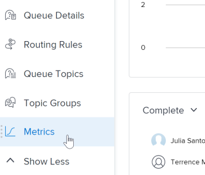

# 프로젝트 지표 개요

프로젝트 지표는 프로젝트의 수행 방식에 대한 일반적인 보기를 차트 형식으로 제공합니다.

## 액세스 요구 사항

+++ 을 확장하여 이 문서의 기능에 대한 액세스 요구 사항을 봅니다.

<table style="table-layout:auto"> 
 <col> 
 <col> 
 <tbody> 
  <tr> 
   <td role="rowheader">Workfront 플랜</td> 
   <td> 
임의
 </td> 
  </tr> 
  <tr> 
   <td role="rowheader">Workfront 라이센스*</td> 
   <td> 
새로운 기능: 밝게 또는 높음 

   
현재: 검토 이상 
 </td> 
  </tr> 
  <tr> 
   <td role="rowheader">액세스 수준 구성</td> 
   <td> 
프로젝트에 대한 액세스 보기
  </td> 
  </tr> 
  <tr> 
   <td role="rowheader">개체 권한</td> 
   <td> 
프로젝트에 대한 권한 보기
 </td> 
  </tr> 
 </tbody> 
</table>

*자세한 내용은 [Workfront 설명서의 액세스 요구 사항](/help/quicksilver/administration-and-setup/add-users/access-levels-and-object-permissions/access-level-requirements-in-documentation.md)을 참조하십시오.

+++

## 전제 조건

프로젝트의 왼쪽 패널에서 지표 영역에 액세스하려면 다음을 수행해야 합니다.

* 레이아웃 템플릿의 프로젝트 영역에서 왼쪽 패널 옵션 지표 를 활성화합니다.

  Workfront 관리자 또는 그룹 관리자가 레이아웃 템플릿으로 왼쪽 패널을 사용자 지정하는 방법에 대한 자세한 내용은 [레이아웃 템플릿을 사용하여 왼쪽 패널 사용자 지정](../../../administration-and-setup/customize-workfront/use-layout-templates/customize-left-panel.md)을 참조하십시오.

## 프로젝트 지표 영역 개요

프로젝트 지표는 프로젝트에서 발생하는 작업을 시각화하므로 프로젝트의 요구 사항과 상태를 신속하게 평가할 수 있습니다.

지표 영역에서 프로젝트의 전체 상태와 다음 상태를 확인할 수 있습니다.

* 작업이 활성 상태이거나 정지된 경우
* 진행 중인 작업 항목이 할당된 사람
* 기한이 지났거나 계획된 완료 일자에 근접한 작업 또는 문제에 대한 세부 정보

각 차트로 드릴인하여 특정 범주의 작업 또는 문제를 보다 자세히 살펴볼 수도 있습니다.

이러한 작업 또는 문제를 확인하는 방법에 대한 자세한 내용은 [지표 세부 정보 보기](#view-metrics-details)를 참조하세요.

<!--this was deprecated: 
>[!TIP]
>
>To see metrics at a higher level for a group of projects within a program, portfolio, etc., navigate to the Enhanced analytics area.  
>To learn more about Enhanced analytics, see [Enhanced analytics overview](../../../enhanced-analytics/enhanced-analytics-overview.md).-->

## 프로젝트 KPI

주요 성과 지표(KPI)는 지표 영역 맨 위에 표시됩니다.

이러한 KPI는 다음 카테고리로 나뉩니다.

| 완료된 작업 | **완료된 작업**&#x200B;은(는) 완료 상태의 작업 수를 표시합니다. 이 숫자에는 완료 와 동일한 사용자 지정 상태를 갖는 작업도 포함됩니다. |
|---|---|
| 미완료 작업 | **미완료 작업**&#x200B;은(는) 완료 또는 닫힘 상태 또는 완료와 같은 상태가 아닌 작업 수를 표시합니다. |
| 기한 초과 작업 | **기한 초과 작업**&#x200B;은(는) 계획된 완료 일자가 지났고 완료 또는 마감 상태이거나 완료 또는 마감과 동일한 상태가 아닌 작업 수를 표시합니다. |
| 총 작업 | **총 작업**&#x200B;은(는) 프로젝트의 총 작업 수를 표시합니다. |

>[!TIP]
>
>특정 KPI에 대한 작업 항목 목록을 표시하려면 해당 KPI를 클릭합니다. 해당 목록에서 특정 작업 항목을 클릭하여 새 탭에서 자세한 내용을 볼 수 있습니다.\
>\
>자세한 내용은 [지표 세부 정보 보기](#view-metrics-details)를 참조하십시오.

## 작업 또는 문제 막대 차트

프로젝트 KPI 아래에 나타나는 막대 차트에서 프로젝트 내 작업 항목의 상태 또는 우선 순위를 볼 수 있습니다. 기본적으로 작업 보기가 선택되어 있습니다.

이 차트에서 상태를 선택하면 프로젝트의 작업 또는 문제의 모든 상태를 볼 수 있습니다. 각 상태는 차트에서 막대로 그룹화됩니다. 모든 기본 시스템 상태 및 사용자 정의 상태가 이 차트에 표시됩니다.

이 차트에서 우선 순위를 선택하면 프로젝트에 있는 작업 또는 문제의 모든 우선 순위를 볼 수 있습니다.

>[!TIP]
>
>특정 상태 또는 우선 순위를 가진 작업 항목 목록을 표시하려면 차트에서 막대를 클릭합니다. 해당 목록에서 특정 작업 항목을 클릭하여 새 탭에서 자세한 내용을 볼 수 있습니다.\
>\
>자세한 내용은 [지표 세부 정보 보기](#view-metrics-details)를 참조하십시오.

## 도넛 차트

프로젝트 KPI 아래에 있는 도넛 차트를 통해 프로젝트에서 완료된 작업 항목과 완료되지 않은 작업 항목의 비율을 확인할 수 있습니다.

차트 위의 드롭다운 메뉴에서 다음을 선택할 수 있습니다.

| 모든 작업 | **작업**&#x200B;을(를) 선택하면 프로젝트의 총 작업 수와 완료된 작업과 완료되지 않은 작업 간의 비율이 표시됩니다. |
|---|---|
| 모든 문제 | **문제**&#x200B;을(를) 선택하면 프로젝트의 총 문제 수와 완료된 문제와 완료되지 않은 문제 간의 비율이 표시됩니다. |

>[!TIP]
>
>완료되거나 완료되지 않은 작업 항목 목록을 표시하려면 도넛 차트에서 해당 섹션을 클릭합니다. 해당 목록에서 특정 작업 항목을 클릭하여 새 탭에서 자세한 내용을 볼 수 있습니다.\
>\
>자세한 내용은 [지표 세부 정보 보기](#view-metrics-details)를 참조하십시오.

## 할당자 막대 차트

할당자 막대 차트는 프로젝트의 각 사용자에게 할당된 작업 수를 보여 줍니다. 이 숫자는 드롭다운 메뉴에서 선택한 범주에 따라 달라집니다.

다음 범주에서 프로젝트에 대한 태스크 지정을 확인하도록 선택할 수 있습니다.

| 완료 | **완료**&#x200B;를 선택하면 완료된 각 사용자에게 할당된 작업 수가 표시됩니다. |
|---|---|
| 완료 안 됨 | **완료 안 됨**&#x200B;을(를) 선택하면 아직 완료되지 않은 각 사용자에게 할당된 작업 수가 표시됩니다. |
| 예정 | **예정됨**&#x200B;을(를) 선택하면 아직 계획된 시작 날짜에 도달하지 않은 각 사용자에게 할당된 작업 수가 표시됩니다. |
| 기한 초과 | **기한 초과**&#x200B;를 선택하면 각 사용자에게 할당된 작업 수가 계획된 완료 일자 이후이며 아직 완료되지 않은 상태로 표시됩니다. |

>[!TIP]
>
>선택한 범주에서 특정 사용자에게 할당된 작업 항목 목록을 표시하려면 차트에서 사용자 이름 옆에 있는 막대를 클릭합니다. 해당 목록에서 특정 작업 항목을 클릭하여 새 탭에서 자세한 내용을 볼 수 있습니다.\
>\
>자세한 내용은 [지표 세부 정보 보기](#view-metrics-details)를 참조하십시오.

## 지표 세부 사항 보기 {#view-metrics-details}

지표 영역의 차트와 상호 작용하여 차트의 다양한 측면을 살펴보거나 차트 내의 작업 및 문제를 더 자세히 살펴볼 수 있습니다.

1. 지표를 보려는 프로젝트로 이동합니다.
1. 왼쪽 패널에서 **지표**&#x200B;를 클릭합니다.\
   지표 영역의 차트에는 기본적으로 작업에 대한 정보가 표시됩니다.\
   

1. (조건부) 차트에 드롭다운 화살표가 표시되면 차트에서 **드롭다운 화살표** 아이콘 을(를) 클릭하고 메뉴에서 원하는 옵션을 선택합니다.\
   각 차트의 메뉴에 나타나는 옵션에 대한 자세한 내용은 위의 관련 섹션을 참조하십시오.

1. (선택 사항) 페이지의 모든 지표에 대한 작업 또는 문제를 자세히 살펴보려면 다음을 수행하십시오.

   1. 세부 정보를 보려는 요소(예: 특정 사용자에게 할당된 작업, 우선 순위가 높은 문제 또는 모든 지연 작업)를 클릭합니다.

      작업 또는 문제 목록이 표시됩니다.

      

   1. 목록 하단의 화살표를 사용하여 보려는 작업 또는 문제를 찾습니다.

      또는

      특정 숫자를 선택하여 특정 페이지에 작업 또는 문제를 표시합니다.

      

   1. 자세한 내용을 보려면 작업 또는 문제를 선택하십시오.

      작업 또는 문제가 새 탭에서 열립니다.

1. (선택 사항) 프로젝트 지표 대시보드를 .png 파일로 내보내려면 **내보내기** 아이콘 을(를) 클릭한 다음 드롭다운 메뉴에서 **PNG로 내보내기**&#x200B;를 선택합니다.

   >[!TIP]
   >
   >대시보드를 내보낼 때 내보낸 파일에는 뷰포트에 현재 표시되는 항목만 포함됩니다. 내보낸 파일에 특정 항목을 포함하려면 페이지에서 위 또는 아래로 스크롤하거나 브라우저의 확대/축소 설정을 조정해야 할 수 있습니다.
