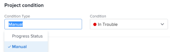

# 프로젝트의 조건 유형 설정

프로젝트 관리자는 프로젝트의 조건 유형을 업데이트하여 프로젝트 조건을 계산하는 방법을 결정할 수 있습니다. 프로젝트 조건 은 프로젝트가 진행되는 방식을 시각적으로 나타냅니다.

## 액세스 요구 사항

이 문서의 절차를 수행하려면 다음 액세스 권한이 있어야 합니다.

<table style="table-layout:auto"> 
 <col> 
 <col> 
 <tbody> 
  <tr> 
   <td role="rowheader">Adobe Workfront 플랜*</td> 
   <td> 
모든
 </td> 
  </tr> 
  <tr> 
   <td role="rowheader">Adobe Workfront 라이선스*</td> 
   <td> 
플랜 
 </td> 
  </tr> 
  <tr> 
   <td role="rowheader">액세스 수준 구성*</td> 
   <td> 
프로젝트에 대한 액세스 편집
 
참고: 여전히 액세스 권한이 없는 경우 Workfront 관리자에게 액세스 수준에서 추가 제한 사항을 설정하는지 문의하십시오. 프로젝트 액세스에 대한 자세한 내용은 <a href="../../../administration-and-setup/add-users/configure-and-grant-access/grant-access-projects.md" class="MCXref xref">프로젝트에 대한 액세스 권한 부여</a>. Workfront 관리자가 액세스 수준을 변경하는 방법에 대한 자세한 내용은 <a href="../../../administration-and-setup/add-users/configure-and-grant-access/create-modify-access-levels.md" class="MCXref xref">사용자 정의 액세스 수준 만들기 또는 수정</a>. 
 </td> 
  </tr> 
  <tr> 
   <td role="rowheader">개체 권한</td> 
   <td> 
    <ul> 
     <li> 
[프로젝트 세부 정보] 영역에서 [조건 유형]을 편집할 수 있는 프로젝트 권한 부여 
 </li> 
     <li> 
프로젝트 편집 상자에서 조건 유형을 편집할 프로젝트에 대한 권한 관리
 </li> 
    </ul> 
 프로젝트 권한에 대한 자세한 내용은 <a href="../../../workfront-basics/grant-and-request-access-to-objects/share-a-project.md" class="MCXref xref">Adobe Workfront에서 프로젝트 공유</a>.
 
추가 액세스 요청에 대한 자세한 내용은 <a href="../../../workfront-basics/grant-and-request-access-to-objects/request-access.md" class="MCXref xref">개체에 대한 액세스 요청 </a>.
 </td> 
  </tr> 
 </tbody> 
</table>

&#42;어떤 계획, 라이선스 유형 또는 액세스 권한을 보유하고 있는지 알아보려면 Workfront 관리자에게 문의하십시오.

## 프로젝트에 대한 조건 유형 설정

1. 조건 유형을 업데이트할 프로젝트로 이동합니다.
1. 다음 중 하나를 수행합니다. 

   * 을(를) 클릭합니다. **자세히** 메뉴  프로젝트 이름의 오른쪽에 있는 를 클릭한 다음 **편집**.
   * 클릭 **프로젝트 세부 사항** 왼쪽 패널에 표시됩니다.

   

1. 에서 **조건 유형** 필드에서 다음 중 하나를 선택합니다.

   * **수동:** 프로젝트 소유자는 프로젝트에 대한 조건을 수동으로 설정합니다.

      이 경우 프로젝트 소유자는 프로젝트 헤더나 프로젝트 세부 사항 섹션에서 프로젝트 조건을 업데이트할 수 있습니다.

   * **진행 상태:** Workfront은 프로젝트의 진행 상태에 따라 조건을 설정합니다. 진행 상태 계산 방법에 대한 자세한 내용은 [프로젝트 진행 상태 개요](../../../manage-work/projects/planning-a-project/project-progress-status.md).

1. 클릭 **저장** 프로젝트 편집 상자에서 조건 유형을 수정할 때

   클릭 **변경 내용 저장** 프로젝트 세부 사항 섹션에서 조건 유형을 수정하는 경우.

 
