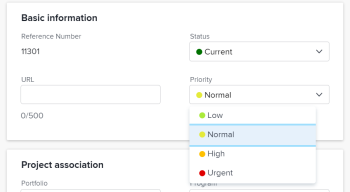

# 프로젝트 우선순위 이해 및 업데이트

프로젝트에 우선순위를 사용하는 방법에는 몇 가지가 있으며 서로 통신하지 않습니다. 필요에 맞는 프로젝트의 우선순위 중 하나를 선택하고 프로젝트의 중요성을 분류할 때 이를 참조하는 것이 좋습니다. 

## 액세스 요구 사항

<!--drafted for P&P:

<table style="table-layout:auto"> 
 <col> 
 <col> 
 <tbody> 
  <tr> 
   <td role="rowheader">Adobe Workfront plan*</td> 
   <td> 
Any
 </td> 
  </tr> 
  <tr> 
   <td role="rowheader">Adobe Workfront license*</td> 
   <td> 
Current license: Standard 

   Or
   
Legacy license: Plan 
 </td> 
  </tr> 
  <tr> 
   <td role="rowheader">Access level configurations*</td> 
   <td> 
Edit access to Projects
 
<b>NOTE</b> 
   
   If you still don't have access, ask your Workfront administrator if they set additional restrictions in your access level. For information on how a Workfront administrator can modify your access level, see <a href="../../../administration-and-setup/add-users/configure-and-grant-access/create-modify-access-levels.md" class="MCXref xref">Create or modify custom access levels</a>.
 </td> 
  </tr> 
  <tr> 
   <td role="rowheader">Object permissions</td> 
   <td> 
Manage permissions to the project
 
For information on requesting additional access, see <a href="../../../workfront-basics/grant-and-request-access-to-objects/request-access.md" class="MCXref xref">Request access to objects </a>.
 </td> 
  </tr> 
 </tbody> 
</table>
-->
이 문서의 절차를 수행하려면 다음 액세스 권한이 있어야 합니다.

<table style="table-layout:auto"> 
 <col> 
 <col> 
 <tbody> 
  <tr> 
   <td role="rowheader">Adobe Workfront 플랜*</td> 
   <td> 
모든
 </td> 
  </tr> 
  <tr> 
   <td role="rowheader">Adobe Workfront 라이선스*</td> 
   <td> 
플랜 
 </td> 
  </tr> 
  <tr> 
   <td role="rowheader">액세스 수준 구성*</td> 
   <td> 
프로젝트에 대한 액세스 편집
 
<b>메모</b>

여전히 액세스 권한이 없는 경우 Workfront 관리자에게 액세스 수준에서 추가 제한 사항을 설정하는지 문의하십시오. Workfront 관리자가 액세스 수준을 수정하는 방법에 대한 자세한 내용은 <a href="../../../administration-and-setup/add-users/configure-and-grant-access/create-modify-access-levels.md" class="MCXref xref">사용자 정의 액세스 수준 만들기 또는 수정</a>.
 </td>
</tr> 
  <tr> 
   <td role="rowheader">개체 권한</td> 
   <td> 
프로젝트에 대한 권한 관리
 
추가 액세스 요청에 대한 자세한 내용은 <a href="../../../workfront-basics/grant-and-request-access-to-objects/request-access.md" class="MCXref xref">개체에 대한 액세스 요청 </a>.
 </td> 
  </tr> 
 </tbody> 
</table>

&#42;어떤 계획, 라이선스 유형 또는 액세스 권한을 보유하고 있는지 알아보려면 Workfront 관리자에게 문의하십시오.

## Adobe Workfront의 프로젝트 우선 순위 유형

다음은 Adobe Workfront에서 프로젝트의 등급을 지정하는 데 사용할 수 있는 우선순위 유형입니다.

* **프로젝트 우선 순위 필드**: 프로젝트에 수동으로 우선순위를 지정할 수 있습니다.

   프로젝트 우선 순위 필드에 대한 자세한 내용은 섹션을 참조하십시오 [프로젝트 우선 순위에 대한 고려 사항](#considerations-about-project-priority) 참조하십시오.

* **Portfolio 최적화 프로그램에서 프로젝트의 우선 순위입니다**&#x200B;로 설정되면, 프로젝트가 포트폴리오와 연결된 경우: 

   Optimizer에서 프로젝트의 우선 순위에 대한 자세한 내용은 문서에서 를 참조하십시오 [Portfolio 최적기에서 프로젝트 우선 순위 지정](../../../manage-work/portfolios/portfolio-optimizer/prioritize-projects-in-portfolio-optimizer.md).

* **리소스 플래너에 있는 프로젝트의 우선순위**: 자원 계획자에서 프로젝트에 수동으로 우선순위를 설정하여 자원을 먼저 받아야 하는 프로젝트를 표시할 수 있습니다. 

   리소스 계획자에서 프로젝트 우선 순위 지정에 대한 자세한 내용은 문서의 &quot;프로젝트 계획 우선 순위&quot; 섹션을 참조하십시오 [리소스 플래너 탐색 개요](../../../resource-mgmt/resource-planning/resource-planner-navigation.md).

## 프로젝트 우선 순위에 대한 고려 사항 {#considerations-about-project-priority}

Workfront의 프로젝트와 우선순위 를 연결할 수 있습니다. 작업 및 문제에는 우선순위도 있습니다. 프로젝트의 우선 순위를 나타내는 것은 프로젝트의 중요성이 시스템의 모든 사람과 통신합니다.

프로젝트에 대한 우선순위 를 선택할 때는 다음 사항을 고려하십시오.

* Workfront 관리자는 Workfront에서 사용할 수 있는 우선순위 를 정의합니다. 이를 설정한 후에는 우선순위 필드에서 프로젝트와 연결할 수 있습니다. 

   Workfront에서 우선순위 생성에 대한 자세한 내용은 문서를 참조하십시오 [우선순위 만들기 및 사용자 지정](../../../administration-and-setup/customize-workfront/creating-custom-status-and-priority-labels/create-customize-priorities.md).

* 프로젝트의 우선순위 필드를 갱신할 때 이 우선순위는 Portfolio 최적기 또는 리소스 계획자로 전송되지 않습니다. 
* 프로젝트의 우선순위 값은 주로 보고 목적으로 사용됩니다.

   예를 들어 프로젝트 필터에서 이 필드를 사용할 때 우선 순위 값이 긴급 인 모든 프로젝트를 검색할 수 있습니다. 

* Workfront의 다음 영역에서 프로젝트의 우선 순위를 업데이트할 수 있습니다.

   * 에서 **프로젝트 편집** 대화 상자
   * 에서 **프로젝트 세부 사항** 탭의 프로젝트에 표시됩니다.
   * 프로젝트 목록 또는 보고서입니다.

## 프로젝트 우선 순위 필드 업데이트

1. 우선 순위를 업데이트할 프로젝트로 이동합니다.
1. 클릭 **프로젝트 세부 사항** 왼쪽 패널에 표시됩니다.
1. 을(를) 클릭합니다. **편집** 아이콘  프로젝트 세부 사항 영역의 오른쪽 위 모서리에서 **개요**.

1. 에서 **우선순위** 필드에서 다음 옵션 중에서 선택합니다.

   * 없음
   * 낮음
   * 기본

      기본 우선 순위입니다.

   * 높음
   * 긴급

   

1. 클릭 **변경 내용 저장**.

   다른 사용자와 통신하고 프로젝트에 대해 각 우선 순위 수준이 의미하는 것을 이해해야 합니다.
