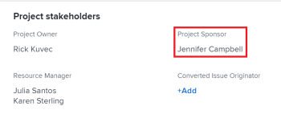

# 프로젝트 소유자 및 스폰서 업데이트

<!--Audited: 07/2024-->

Adobe Workfront에서 프로젝트를 만들면 프로젝트의 프로젝트 소유자로 자동 설정됩니다. 다른 사용자로 이 필드를 업데이트할 수 있습니다. 프로젝트의 프로젝트 스폰서 필드도 업데이트할 수 있습니다.

프로젝트 소유자 및 스폰서에 대한 자세한 내용은 [프로젝트 소유자 및 스폰서 개요](../../../manage-work/projects/planning-a-project/project-owners-and-sponsors.md)를 참조하십시오.

>[!TIP]
>
>템플릿에 대한 소유자와 스폰서를 식별할 수 있습니다. 해당 템플릿에서 프로젝트를 만들면 템플릿 소유자 가 프로젝트 소유자 가 되고 템플릿 스폰서 가 프로젝트 스폰서 가 됩니다.
>
>템플릿에 소유자가 없으면 팀플레이트에서 프로젝트를 만드는 사용자가 프로젝트 소유자가 됩니다.
>
>템플릿 편집에 대한 자세한 내용은 [프로젝트 템플릿 편집](../../../manage-work/projects/create-and-manage-templates/edit-templates.md)을 참조하십시오.

## 액세스 요구 사항

<!--drafted for P&P:

<table style="table-layout:auto"> 
 <col> 
 <col> 
 <tbody> 
  <tr> 
   <td role="rowheader">Adobe Workfront plan*</td> 
   <td> 
Any
 
  
 </td> 
  </tr> 
  <tr> 
   <td role="rowheader">Adobe Workfront license*</td> 
   <td> 
Current license: Standard 
 
   Or
   
Legacy license: Plan 
 
   </td> 
  </tr> 
  <tr> 
   <td role="rowheader">Access level configurations*</td> 
   <td> 
Edit access to Projects
 
<b>NOTE</b>
   
   If you still don't have access, ask your Workfront administrator if they set additional restrictions in your access level. For information on how a Workfront administrator can modify your access level, see <a href="../../../administration-and-setup/add-users/configure-and-grant-access/create-modify-access-levels.md" class="MCXref xref">Create or modify custom access levels</a>.
 </td> 
  </tr> 
  <tr> 
   <td role="rowheader">Object permissions</td> 
   <td> 
Edit permissions to a project
 
For information on requesting additional access, see <a href="../../../workfront-basics/grant-and-request-access-to-objects/request-access.md" class="MCXref xref">Request access to objects </a>.
 </td> 
  </tr> 
 </tbody> 
</table>
-->

+++ 을 확장하여 이 문서의 기능에 대한 액세스 요구 사항을 봅니다.

<table style="table-layout:auto"> 
 <col> 
 <col> 
 <tbody> 
  <tr> 
   <td role="rowheader">Adobe Workfront 플랜</td> 
   <td> 
임의
 
  
 </td> 
  </tr> 
  <tr> 
   <td role="rowheader">Adobe Workfront 라이센스*</td> 
   <td>
새로운 기능: 표준
 
   
현재: 플랜 
 </td> 
  </tr> 
  <tr> 
   <td role="rowheader">액세스 수준 구성*</td> 
   <td> 
프로젝트에 대한 액세스 편집
 </td> 
  </tr> 
  <tr> 
   <td role="rowheader">개체 권한</td> 
   <td> 
프로젝트에 대한 권한 편집
 </td> 
  </tr> 
 </tbody> 
</table>

*자세한 내용은 [Workfront 설명서의 액세스 요구 사항](/help/quicksilver/administration-and-setup/add-users/access-levels-and-object-permissions/access-level-requirements-in-documentation.md)을 참조하십시오.

+++

## 프로젝트의 프로젝트 소유자 업데이트

사용자를 프로젝트의 프로젝트 소유자로 추가하면 Workfront에서 자동으로 사용자에게 프로젝트를 볼 수 있는 권한을 부여합니다.

1. 업데이트할 프로젝트로 이동합니다.
1. 왼쪽 패널에서 **프로젝트 세부 정보**&#x200B;를 클릭합니다.
1. 프로젝트 세부 정보 영역의 오른쪽 상단에 있는 **편집** 아이콘 을(를) 클릭한 다음 **개요**&#x200B;를 클릭합니다.

1. **프로젝트 소유자** 필드에 대한 사용자 이름을 지정하십시오.

   활성 사용자만 프로젝트 소유자로 지정할 수 있습니다.

1. **변경 내용 저장**&#x200B;을 클릭합니다.

   프로젝트 소유자 는 프로젝트 헤더 및 프로젝트 세부 정보 영역에서 업데이트됩니다.

   

## 프로젝트의 프로젝트 스폰서 업데이트

사용자를 프로젝트의 프로젝트 스폰서로 추가하면 Workfront에서 자동으로 사용자에게 프로젝트를 볼 수 있는 권한을 부여합니다.

>[!TIP]
>
>프로젝트 스폰서로 추가하는 사용자가 시스템 관리자인 경우 프로젝트의 공유 목록에 추가되지 않습니다.

1. 업데이트할 프로젝트로 이동합니다.
1. 왼쪽 패널에서 **프로젝트 세부 정보**&#x200B;를 클릭합니다.
1. 프로젝트 세부 정보 영역의 오른쪽 상단에 있는 **편집** 아이콘 을(를) 클릭한 다음 **개요**&#x200B;를 클릭합니다.

1. **프로젝트 스폰서** 필드에 대한 사용자 이름을 지정하십시오.

   활성 사용자만 프로젝트 스폰서로 지정할 수 있습니다.

1. **변경 내용 저장**&#x200B;을 클릭합니다.

   프로젝트 스폰서는 프로젝트 세부 정보 영역에서 업데이트됩니다.

   
