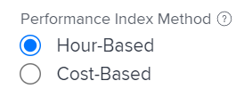

# 수행된 작업의 예산 비용 계산(BCWP)

## 수행된 작업의 예산 비용 개요(BCWP)

성과 값이라고도 하는 BCWP(수행된 작업의 예산 비용)는 이 지표가 계산되는 시점에 실제로 완료된 작업의 양을 나타내는 프로젝트 성과 지표입니다.

Adobe Workfront은 프로젝트 및 작업 모두에 대해 BCWP(수행된 작업의 예산 비용)를 계산합니다.

작업 또는 프로젝트에서 BCWP에 대한 값을 검토할 때 다음 사항을 고려하십시오.

* Workfront은 프로젝트의 PMI(성과 지표 방법)에 대한 구성을 기반으로 작업에 대한 BCWP를 계산합니다.

  시간이나 비용을 사용하여 PMI를 계산하도록 프로젝트를 구성할 수 있으며 BCWP도 동일한 값을 사용하여 계산됩니다.

  BCWP 계산 방법 구성에 대한 자세한 내용은 이 문서의 [BCWP 계산 방법 구성](#configure-how-bcwp-is-calculated) 섹션을 참조하십시오.

* Workfront은 프로젝트의 모든 상위 작업 및 개별 작업에서 모든 BCWP 값을 추가하여 프로젝트에 대한 BCWP를 계산합니다.

  하위 작업의 값이 프로젝트의 BCWP에 추가되지 않습니다.

## 액세스 요구 사항

+++ 을 확장하여 이 문서의 기능에 대한 액세스 요구 사항을 봅니다.

<table style="table-layout:auto"> 
 <col> 
 <col> 
 <tbody> 
  <tr> 
   <td>Adobe Workfront 패키지</td> 
   <td>임의</td> 
  </tr> 
  <tr> 
   <td>Adobe Workfront 라이선스</td> 
   <td>
   <p>표준</p>
   <p>플랜</p></td> 
  </tr> 
  <tr> 
   <td>액세스 수준 구성</td> 
   <td>프로젝트에 대한 액세스 편집</td> 
  </tr> 
  <tr> 
   <td>개체 권한</td> 
   <td>프로젝트에 대한 권한 관리</td> 
  </tr> 
 </tbody> 
</table>

자세한 내용은 [Workfront 설명서의 액세스 요구 사항](/help/quicksilver/administration-and-setup/add-users/access-levels-and-object-permissions/access-level-requirements-in-documentation.md)을 참조하십시오.

+++

## BCWP 계산 방법 구성 {#configure-how-bcwp-is-calculated}

프로젝트의 PIM(Performance Index Method) 계산 방법을 구성하여 BCWP를 시간 단위로 계산할지 비용 단위로 계산할지 여부를 구성할 수 있습니다.

1. 프로젝트로 이동하여 왼쪽 패널에서 **프로젝트 세부 정보**&#x200B;를 확장합니다.
1. **재무** 영역에서 **성과 지표 메서드** 필드를 찾아 더블 클릭하여 편집합니다.

   

1. 다음 옵션 중에서 선택합니다.

   | 옵션 | 계산 수행 방법 |
   |---|---|
   | 시간 기반 | Workfront은 작업의 계획된 시간을 사용하여 BCWP를 계산합니다. |
   | 비용 기반 | Workfront은 작업의 계획된 비용을 사용하여 BCWP를 계산합니다. |

1. **변경 내용 저장**&#x200B;을 클릭합니다.

   프로젝트의 작업에 대한 BCWP는 시간 또는 비용을 사용하여 계산됩니다.

## BCWP 계산

Workfront은 다음 공식을 사용하여 작업 또는 프로젝트에 대한 BCWP(수행된 작업의 예산 비용)를 계산합니다.

```
Task BCWP = Actual Percent Complete x Task Budget
```

```
Project BCWP = SUM(BCWP values of all parent and individual tasks)
```

다음 값이 이 계산에 사용됩니다.

| 값 사용됨 | 사용된 값에 대한 설명 |
|---|---|
| 실제 완료율 | Workfront에 표시되는 작업의 실제 완료율입니다. |
| 작업 예산 | 작업의 계획된 시간 또는 계획된 비용에 대한 값입니다. |

예를 들어 작업의 실제 완료율이 25%이고 작업 예산 또는 계획된 비용이 $10,000인 경우 작업의 BCWP는 다음과 같습니다.

```
BCWP = 25% x $10,000 = $2,500
```

## 프로젝트 또는 작업에 대한 BCWP 찾기

BCWP 열을 보기에 추가하여 보고서나 목록에서 수행된 작업의 예산 비용 값을 볼 수 있습니다.

1. 작업 또는 프로젝트 목록으로 이동합니다.
1. **보기** 메뉴를 확장하고 **새 보기** 또는 **보기 사용자 지정**&#x200B;을 선택합니다.

1. **열 추가**&#x200B;를 클릭합니다.
1. **이 열에 표시:** 필드에서 **BCWP**&#x200B;을(를) 입력하고 목록에 표시될 때 클릭하여 선택합니다.

   프로젝트 보기의 

1. **보기 저장**&#x200B;을 클릭합니다.
1. BCWP 필드가 보기에 표시됩니다.
