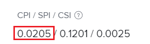

# 원가 성과 지수 계산(CPI)

<!--
<p data-mc-conditions="QuicksilverOrClassic.Draft mode">(NOTE: Linked to the product. Do not change link.)</p>
-->

원가 성과 지수(CPI)는 계획 원가와 실제 원가 사이의 프로젝트 또는 태스크 레벨의 관계를 설명합니다. 프로젝트 관리자는 이 지표를 검토하여 주어진 시점에서 또는 그 이상 비용에서 현재 추적하는 작업 또는 프로젝트를 식별합니다. PIM(Performance Index Method)에 따라 비용을 시간 또는 달러로 측정할 수 있습니다. 성능 인덱스 방법 설정에 대한 자세한 내용은 [PIM(성능 인덱스 메서드) 설정](../../../manage-work/projects/project-finances/set-pim.md).

시간 입력이 필요한 조직만 CPI를 사용할 수 있습니다. 또한 비용 기반 PIM 값은 작업 담당자(작업 역할 또는 사용자)에 대한 비용 비율을 정의한 조직에서만 정확합니다.

## 액세스 요구 사항

이 문서의 절차를 수행하려면 다음 액세스 권한이 있어야 합니다.

<table style="table-layout:auto"> 
 <col> 
 <col> 
 <tbody> 
  <tr> 
   <td role="rowheader">Adobe Workfront 플랜*</td> 
   <td> <p>모든</p> </td> 
  </tr> 
  <tr> 
   <td role="rowheader">Adobe Workfront 라이선스*</td> 
   <td> <p>검토 이상</p> </td> 
  </tr> 
  <tr> 
   <td role="rowheader">액세스 수준 구성*</td> 
   <td> <p>프로젝트 및 재무 데이터에 대한 액세스 보기</p> <p> 여전히 액세스 권한이 없는 경우 Workfront 관리자에게 액세스 수준에서 추가 제한 사항을 설정하는지 문의하십시오. Workfront 관리자가 액세스 수준을 수정하는 방법에 대한 자세한 내용은 <a href="../../../administration-and-setup/add-users/configure-and-grant-access/create-modify-access-levels.md" class="MCXref xref">사용자 정의 액세스 수준 만들기 또는 수정</a>.</p> </td> 
  </tr> 
  <tr> 
   <td role="rowheader">개체 권한</td> 
   <td> <p>재무 보기에 대한 권한이 있는 프로젝트에 대한 더 높은 권한 보기</p> <p>추가 액세스 요청에 대한 자세한 내용은 <a href="../../../workfront-basics/grant-and-request-access-to-objects/request-access.md" class="MCXref xref">개체에 대한 액세스 요청 </a>.</p> </td> 
  </tr> 
 </tbody> 
</table>

&#42;어떤 계획, 라이선스 유형 또는 액세스 권한을 보유하고 있는지 알아보려면 Workfront 관리자에게 문의하십시오.

## CPI(비용 성과 인덱스) 개요

* [CPI 값](#the-cpi-value)
* [CPI 계산 방법](#how-cpi-is-calculated)

### CPI 값 {#the-cpi-value}

프로젝트 관리자는 CPI 값이 1이면 프로젝트의 예산이 정확하게 책정된다는 것을 알고 있습니다. 1보다 큰 값은 프로젝트가 예산(원래 계획보다 적은 시간 또는 비용이 기록됨)에 속하고, 1보다 작은 값은 프로젝트가 예산을 초과했음을 의미합니다(원래 계획보다 많은 시간 또는 비용이 기록됨). 1에서 더 나아가, 그 계획으로부터 더 큰 편차.

| **CPI 값** | **예산에 대한 표시** |
|---|---|
| 1 | 계획 또는 예산 |
| > 1(1보다 큼) | 예산에서 |
| &lt; 1(1 미만) | 초과 예산 |


### CPI 계산 방법 {#how-cpi-is-calculated}

Adobe Workfront에서 CPI에 대한 계산은 프로젝트에 대해 선택한 성능 색인 방법에 따라 달라집니다. 성능 인덱스 방법 설정에 대한 자세한 내용은 [PIM(성능 인덱스 메서드) 설정](../../../manage-work/projects/project-finances/set-pim.md).

* [시간 기반 PIM을 사용할 때 CPI 계산](#cpi-calculations-when-using-hour-based-pim)
* [비용 기반 PIM을 사용할 때 CPI 계산](#cpi-calculations-when-using-cost-based-pim)

#### 시간 기반 PIM을 사용할 때 CPI 계산 {#cpi-calculations-when-using-hour-based-pim}

만약

```
Actual Hours > 0 THEN CPI = Total Budgeted Cost Work Performed / Actual Hours
```

그렇지 않은 경우

```
CPI = 1
```

* **비상위 작업의 경우:**

   ```
   Total Budgeted Cost Work Performed = Planned Hours * (Percent Complete / 100)
   ```

* **상위 작업의 경우:**
수행된 총 예산책정된 원가 작업 시간 = 모든 직접 하위 태스크에 대한 총 예산책정된 원가 작업 수행 필드의 합계입니다.

* **프로젝트의 경우:**
수행된 총 예산책정된 원가 작업 시간 = 모든 최상위 레벨 태스크에 대한 총 예산책정된 원가 작업 수행 필드의 합계(상위 및 독립형 태스크).

수행된 총 예산책정된 비용 작업 시간(BCWP)에 대한 자세한 내용은 [수행된 예산 원가 작업 계산(BCWP)](../../../manage-work/projects/project-finances/calculate-bcwp.md).

#### 비용 기반 PIM을 사용할 때 CPI 계산 {#cpi-calculations-when-using-cost-based-pim}

<!--
<p data-mc-conditions="QuicksilverOrClassic.Draft mode"><code>CPI = (Planned Cost of Work Performed + Planned Cost of Incurred Expenses) / (Total Actual Cost + Actual Cost of Incurred Expenses) </code> </p>
-->

<!--
<p data-mc-conditions="QuicksilverOrClassic.Draft mode"><code>NOTE: this used to be here before - above - but Anna sent me the one below. I kept the other one, although she is still researching its validity - see this issue: https://hub.workfront.com/issue/5fc7b1cf00012aeebf9e822db8ea2513/overview)</code> </p>
-->

만약

```
Actual Labor Cost + Incurred Actual Expense Cost <> 0 THEN CPI = (Total Budgeted Cost Work Performed + Incurred Planned Expense Cost) / (Actual Labor Cost + Incurred Actual Expense Cost)
```


그렇지 않은 경우

```
CPI = 1
```

<!--
<p data-mc-conditions="QuicksilverOrClassic.Draft mode"><code>(NOTE: above: this used to say: CPI = CPI Labor, but Anna had me fix it on July 21, 2021)</code> </p>
-->

이 계산의 필드는 다음과 같습니다.

```
Total Actual Cost = Actual (logged) Hours * Hourly Rate of assignees
```

```
Incurred Actual Expense Cost = Actual Cost
```

비용 발생은 실제 비용 > 0

```
Planned Cost of Incurred Expenses = Total of Planned Cost of all incurred expenses
```


<!--
  <p data-mc-conditions="QuicksilverOrClassic.Draft mode">(NOTE: Old calculation - taken out by Lilit and replaced below: Planned Cost of Work Performed= (planned labor cost) * (percent complete) / 100 where planned labor cost is the planned hours allocated to assignees * their rates.)</p>
  -->

* 수행된 계획 작업 비용은 다음 공식으로 계산됩니다.

   ```
   Planned Cost of Work Performed = Planned cost * Percent Complete / 100
   ```

수행된 총 예산책정된 원가 WIP는 다음 항목에 대해 계산됩니다.

* **비상위 작업의 경우:**

   ```
   Total Budgeted Cost Work Performed = Planned Labor Cost * Percent Complete / 100
   ```

* **상위 작업의 경우:**

   ```
   Total Budgeted Cost Work Performed = SUM(Total Budgeted Cost Work Performed field from all direct child tasks)
   ```

* **프로젝트의 경우:**

   ```
   Total Budgeted Cost Work Performed = SUM(Total Budgeted Cost Work Performed field for all top level tasks)
   ```


## 프로젝트 또는 작업에서 CPI 찾기

프로젝트 또는 작업의 CPI를 프로젝트 또는 작업 목록이나 보고서에 표시할 수 있습니다. 또한 프로젝트 또는 작업 수준에서 볼 수 있습니다.

1. CPI를 보려는 프로젝트 또는 작업으로 이동합니다.
1. 확장 **프로젝트 세부 사항** 또는 **작업 세부 사항** 왼쪽 패널에서 프로젝트 또는 작업에 대한 CPI를 보고 있는지 여부에 따라

1. 클릭 **재무**.

   CPI는 **CPI/SPI/CSI** 필드.

   
