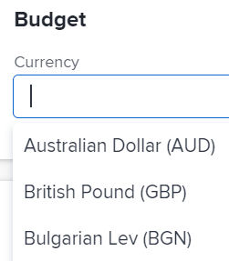

# 프로젝트 통화 변경

프로젝트 관리자는 Adobe Workfront 시스템에 대해 기본 통화 이외의 통화를 사용하도록 프로젝트를 구성할 수 있습니다. 이를 통해 인건비 및 수익을 계산할 때 프로젝트에 대한 재무 정보를 원하는 통화로 표시할 수 있습니다.

이 섹션에 설명된 대로 대체 통화를 사용하려면 먼저 Workfront 관리자가 문서 [환율 설정](../../../administration-and-setup/manage-workfront/exchange-rates/set-up-exchange-rates.md)에 설명된 대로 여러 통화를 활성화하고 구성해야 합니다.

## 액세스 요구 사항

+++ 을 확장하여 이 문서의 기능에 대한 액세스 요구 사항을 봅니다.

이 문서의 단계를 수행하려면 다음 액세스 권한이 있어야 합니다.

<table style="table-layout:auto"> 
 <col> 
 <col> 
 <tbody> 
  <tr> 
   <td role="rowheader">Adobe Workfront 플랜</td> 
   <td>임의</td> 
  </tr> 
  <tr> 
   <td role="rowheader">Adobe Workfront 라이선스</td> 
   <td>
   
새로운 기능: 표준

   
또는

   
현재: 플랜
</td> 
  </tr> 
  <tr> 
   <td role="rowheader">액세스 수준 구성</td> 
   <td>프로젝트에 대한 액세스 편집</td> 
  </tr> 
  <tr> 
   <td role="rowheader">개체 권한</td> 
   <td>프로젝트에 대한 권한 관리</td> 
  </tr> 
 </tbody> 
</table>

이 표의 정보에 대한 자세한 내용은 [Workfront 설명서의 액세스 요구 사항](/help/quicksilver/administration-and-setup/add-users/access-levels-and-object-permissions/access-level-requirements-in-documentation.md)을 참조하십시오.

+++

## Workfront에서 프로젝트 통화 변경 시 고려 사항

* 프로젝트에 재무 정보가 있는 경우 프로젝트의 통화를 변경할 수 없습니다.
* 요금은 인건비, 수익 계산에 사용되며 보고 목적으로 향후 사용됩니다.
* 프로젝트에 대해 다른 통화를 지정하지 않으면 Workfront은 프로젝트의 통화가 시스템의 기본 통화라고 가정합니다. 시스템 수준 기본 통화에 대한 자세한 내용은 [환율 설정](../../../administration-and-setup/manage-workfront/exchange-rates/set-up-exchange-rates.md)을 참조하십시오.
* 기본적으로 모든 전체 라이선스 사용자는 통화 및 환율을 볼 수 있는 액세스 권한을 갖습니다. Workfront 관리자는 사용자가 프로젝트에 대한 특정 요금을 설정할 수 있도록 **환율**&#x200B;에 대한 추가 관리 액세스 권한을 부여해야 합니다.
* Workfront의 환율은 동적이지 않습니다. 이 값은 관리자가 설정하며 환율이 변경될 때 업데이트해야 합니다.
* 프로젝트에 통화를 반영하도록 보고서를 만들 때 기본적으로 모든 보고서는 프로젝트의 기본 통화로 그룹화됩니다. 환율이 다른 여러 프로젝트의 보고서를 만드는 경우 프로젝트에 적용된 모든 그룹화는 시스템 수준의 기본 환율을 반영합니다. 자세한 내용은 문서 [고유한 환율로 재무 데이터 보고서 만들기](../../../reports-and-dashboards/reports/creating-and-managing-reports/create-financial-data-reports-unique-exchange-rates.md)를 참조하십시오.

## 프로젝트에 대한 통화 구성

1. 기본 통화를 변경할 프로젝트로 이동합니다.

   >[!TIP]
   >
   >프로젝트에 재무 정보가 없는지 확인합니다. 예를 들어 프로젝트와 연관된 계획된 비용 또는 실제 비용이 없는지 확인합니다.

1. 왼쪽 패널에서 **프로젝트 세부 정보**&#x200B;를 클릭한 다음 **재무** 영역으로 이동합니다.
1. **통화** 필드에서 **추가**&#x200B;를 클릭하고 프로젝트의 기본 통화로 사용할 통화를 선택합니다. Workfront 관리자가 Workfront 인스턴스에 대해 설정한 모든 통화가 표시됩니다.

   

1. (조건부) Workfront 시스템에 대해 설정된 기본 통화 이외의 통화를 선택하는 경우, 시스템에서 기본 통화로 설정된 통화와 관련되므로 선택한 통화에 대한 환율을 지정합니다.
1. **변경 내용 저장**&#x200B;을 클릭합니다.
