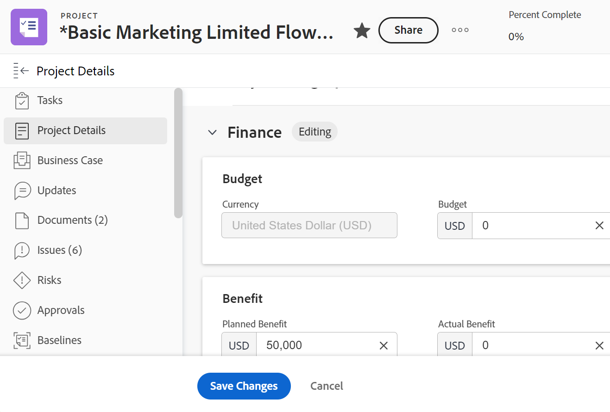

# 프로젝트 재무 영역에서 정보 관리

<!--

(NOTE: some information in here is duplicated in Edit projects. If you need to update one of the fields in this area, do it in both places.)

-->

프로젝트 세부 정보 섹션의 재무 영역에 액세스하여 프로젝트의 재무 정보를 보거나 편집할 수 있습니다. 이 영역에서 보거나 편집할 수 있는 필드의 수는 제한되어 있습니다. 프로젝트의 모든 정보를 편집하는 방법에 대한 자세한 내용은 [프로젝트 편집](../../../manage-work/projects/manage-projects/edit-projects.md)을 참조하세요.

## 액세스 요구 사항

+++ 을 확장하여 이 문서의 기능에 대한 액세스 요구 사항을 봅니다.

<table style="table-layout:auto"> 
 <col> 
 <col> 
 <tbody> 
  <tr> 
   <td>Adobe Workfront 패키지</td> 
   <td>임의</td> 
  </tr> 
  <tr> 
   <td role="rowheader">Adobe Workfront 라이선스</td>
   <td>
   
밝거나 높음

   
검토 이상
</td> 
  </tr> 
  <tr> 
   <td role="rowheader">액세스 수준 구성</td> 
   <td> 
프로젝트 및 재무 데이터 보기 또는 상위 액세스
 
프로젝트 및 재무 데이터에 대한 액세스 권한을 편집하여 프로젝트의 재무 정보 편집
</td> 
  </tr> 
  <tr> 
   <td role="rowheader">개체 권한</td> 
   <td> 
재무 보기 권한이 포함된 프로젝트 이상의 권한 보기
 
프로젝트에 대한 재무 정보를 편집할 수 있도록 재무 관리를 포함하는 프로젝트 권한 관리
 </td> 
  </tr> 
 </tbody> 
</table>

자세한 내용은 [Workfront 설명서의 액세스 요구 사항](/help/quicksilver/administration-and-setup/add-users/access-levels-and-object-permissions/access-level-requirements-in-documentation.md)을 참조하십시오.

+++

## 재무 영역 개요

재무 영역에서 정보를 보거나 편집할 때 다음 사항을 고려하십시오.

* 프로젝트 세부 정보의 재무 영역에서 찾을 수 있는 재무 정보는 프로젝트에서 프로젝트 레벨로 롤업되는 값과 프로젝트에 직접 입력한 정보를 나타냅니다. 일부 재무 정보는 프로젝트 뿐만 아니라 작업 수준에서도 관리할 수 있습니다.
* 프로젝트의 재무 영역을 보려면 프로젝트에 대한 보기 권한과 액세스 수준에서 재무 데이터에 대한 액세스 권한이 있어야 합니다.
* 재무 영역 의 정보를 편집하려면 프로젝트에 대한 관리 권한과 액세스 수준에서 재무 데이터에 대한 액세스 권한이 있어야 합니다. 단, 프로젝트 소유자만 이 영역에 대한 정보를 편집하는 것이 좋습니다.

## 프로젝트에 대한 재무 정보 보기

1. 프로젝트로 이동합니다.
1. 왼쪽 패널에서 **프로젝트 세부 정보**&#x200B;를 클릭합니다.
1. 세부 정보 섹션의 오른쪽 상단에 있는 **편집** 아이콘 을 클릭한 다음 **재무**&#x200B;을 클릭합니다.

   

   >[!NOTE]
   >
   >Workfront 관리자가 레이아웃 템플릿을 구성한 방식에 따라 개요 섹션이 먼저 나열되지 않을 수 있으며 이 경우 축소됩니다. 자세한 내용은 [레이아웃 템플릿을 사용하여 세부 정보 보기 사용자 지정](../../../administration-and-setup/customize-workfront/use-layout-templates/customize-details-view-layout-template.md)을 참조하십시오.

1. 프로젝트의 재무 영역에서 다음 필드를 봅니다.

   <table style="table-layout:auto"> 
    <col> 
    <col> 
    <tbody> 
     <tr> 
      <td role="rowheader">성과 지수 방법</td> 
      <td> Workfront이 획득가치 지표를 계산하는 데 사용하는 방법을 제어합니다. 이는 시간 기반이거나 비용 기반일 수 있습니다.  PIM에 대한 자세한 내용은 문서 <a href="../../../manage-work/projects/project-finances/set-pim.md" class="MCXref xref">PIM(성능 인덱스 메서드) 설정</a>을 참조하십시오.</td> 
     </tr> 
     <tr> 
      <td role="rowheader">CPI/SPI/CSI</td> 
      <td> 
지정된 시간에 프로젝트의 수행 방식을 보여 주는 프로젝트 성능 지표입니다. 이 값은 성과 지수 방법을 기반으로 계산됩니다. 자세한 내용은 다음 문서를 참조하십시오. 
 
       <ul> 
        <li> 
<a href="../../../manage-work/projects/project-finances/calculate-cpi.md" class="MCXref xref">CPI(비용 성과 지표) 계산</a> 
 </li> 
        <li> 
<a href="../../../manage-work/projects/project-finances/calculate-spi.md" class="MCXref xref">SPI(일정 성과 지수) 계산 </a> 
 </li> 
        <li> 
<a href="../../../manage-work/projects/project-finances/calculate-csi.md" class="MCXref xref">CSI(비용 일정 성과 지표) 계산</a> 
 </li> 
       </ul> </td> 
     </tr> 
     <tr> 
      <td role="rowheader">완료 시점 예측</td> 
      <td> PIM(성과 지수 방법)이 시간 기반인 경우 시간 단위로 표시되고, PIM(성과 지수 방법)이 비용 기반인 경우 통화 값으로 표시되는 프로젝트의 예상 총 비용입니다. 완료 시 예상 값 계산에 대한 자세한 내용은 <a href="../../../manage-work/projects/project-finances/calculate-eac.md" class="MCXref xref">EAC(완료 시 예상 값 계산)</a> 문서를 참조하십시오.</td> 
     </tr> 
     <tr> 
      <td role="rowheader">예산</td> 
      <td>이것은 그 프로젝트에 책정된 예산입니다. 이는 프로젝트 소유자가 수동으로 지정합니다.</td> 
     </tr> 
     <tr> 
      <td role="rowheader">고정 비용</td> 
      <td>이는 프로젝트의 다른 활동과는 별개로 프로젝트의 고정 비용입니다. 프로젝트 소유자가 수동으로 입력합니다.</td> 
     </tr> 
     <tr> 
      <td role="rowheader">계획된 비용</td> 
      <td>계획된 시간 및 작업 할당자(작업 역할 또는 사용자)와 연결된 비율을 기반으로 한 예상 프로젝트 비용입니다.</td> 
     </tr> 
     <tr> 
      <td role="rowheader">실제 비용</td> 
      <td>프로젝트에서 발생하는 모든 비용. 실제 원가는 모든 실제 원가의 합계입니다. 인건비(실제 시간과 작업 역할 또는 작업 역할 또는 작업 역할 로그인과 연관된 비율 기준), 경비 및 고정 원가는 프로젝트나 작업과 연관될 수 있습니다.</td> 
     </tr> 
     <tr> 
      <td role="rowheader">고정 수입</td> 
      <td>프로젝트 일정에 따라 예상되는 수입을 설정합니다. 고정 수익은 프로젝트 소유자가 수동으로 지정합니다.</td> 
     </tr> 
     <tr> 
      <td role="rowheader">계획된 수익</td> 
      <td>계획된 시간 및 작업 할당자(작업 역할 또는 사용자)와 연결된 비율을 기반으로 예상 수입입니다.</td> 
     </tr> 
     <tr> 
      <td role="rowheader">실제 수익</td> 
      <td>실제 근로시간 및 작업 담당자(작업 역할 또는 사용자)와 연계된 비율을 기반으로 한 프로젝트의 실제 소득.</td> 
     </tr> 
     <tr> 
      <td role="rowheader">청구된 수익</td> 
      <td> 
청구 기록에 캡처된 고객 또는 기타 당사자에게 청구된 수익. 청구 기록에 대한 자세한 내용은 문서 <a href="../../../manage-work/projects/project-finances/create-billing-records.md" class="MCXref xref">청구 기록 만들기</a>를 참조하십시오. 
 </td> 
     </tr> 
     <tr> 
      <td role="rowheader"> </td> 
      <td> </td> 
     </tr> 
     <tr> 
      <td role="rowheader"> </td> 
      <td> </td> 
     </tr> 
    </tbody> 
   </table>

## 프로젝트의 재무 정보 편집

프로젝트 소유자는 프로젝트의 재무 하위 탭에 있는 정보를 편집할 수 있습니다.

Project Finance 하위 탭의 정보를 편집하려면

1. 자신이 소유자인 프로젝트로 이동합니다.

   >[!NOTE]
   >
   >다음 단계를 수행하려면 프로젝트에 대한 관리 권한이 필요합니다. 또한 프로젝트 소유자만 프로젝트의 재무 하위 탭을 변경하는 것이 좋습니다.

1. 왼쪽 패널에서 **프로젝트 세부 정보**&#x200B;를 클릭합니다.
1. 세부 정보 섹션의 오른쪽 상단에 있는 **편집** 아이콘 을 클릭한 다음 **재무** 을 클릭합니다. 편집을 위해 재무 영역이 열립니다.
1. 필드를 한 번 클릭하여 편집할 수 있는 필드를 편집하거나 **+추가**&#x200B;를 클릭하여 빈 필드에 정보를 추가하십시오.

   >[!TIP]
   >
   >Workfront에서 필드를 자동으로 계산하거나 편집 권한이 없는 경우 편집할 수 없습니다.

   

1. 아래 필드를 업데이트합니다.

   >[!NOTE]
   >
   >Workfront 관리자가 레이아웃 템플릿을 설정하는 방법에 따라 프로젝트 세부 정보 섹션의 필드가 사용자 환경에서 다를 수 있습니다. 자세한 내용은 [레이아웃 템플릿을 사용하여 세부 정보 보기 사용자 지정](../../../administration-and-setup/customize-workfront/use-layout-templates/customize-details-view-layout-template.md)을 참조하십시오.

   <table style="table-layout:auto"> 
    <col> 
    <col> 
    <tbody> 
     <tr> 
      <td role="rowheader">성과 지수 방법</td> 
      <td> 
Workfront이 프로젝트 성능 지표를 계산하는 데 사용하는 방법을 제어합니다. 관리자가 시스템 수준에서 설정하지만 프로젝트 수준에서 편집할 수도 있습니다. 다음 옵션 중 하나를 선택하는 것이 좋습니다.
 
       <ul> 
        <li><strong>시간 기반:</strong>Workfront은 프로젝트의 CPI와 EAC를 계산할 때 계획된 시간을 사용하며 프로젝트의 EAC가 시간 단위로 숫자로 표시됩니다. </li> 
        <li><strong>비용 기반:</strong>Workfront은 프로젝트의 CPI와 EAC를 계산할 때 계획된 인건비를 사용하며 EAC는 통화 값으로 표시됩니다. 이 옵션을 선택하는 경우 작업 담당자(작업 역할 또는 사용자)가 비용 비율과 연결되어 있는지 확인합니다.</li> 
       </ul> </td> 
     </tr> 
     <tr> 
      <td role="rowheader">완료 시점 예측</td> 
      <td> 
프로젝트 또는 작업이 완료될 때의 예상 총 비용을 나타냅니다. 관리자가 시스템 수준에서 설정하지만 프로젝트 수준에서 편집할 수도 있습니다. 다음 옵션 중 하나를 선택하는 것이 좋습니다.
 
       <ul> 
        <li><strong>프로젝트 수준에서 계산</strong>: 상위 작업 및 프로젝트에 대한 EAC는 EAC 수식에 실제 시간/실제 인건비를 입력하여 결정됩니다. 이 계산에는 상위 작업 또는 프로젝트에 직접 추가된 실제 시간/비용 및 비용이 포함됩니다.</li> 
        <li><strong>작업/하위 작업에서 롤업</strong>: 상위 작업 및 프로젝트에 대한 EAC는 각 하위 작업에 대한 EAC를 합하여 결정됩니다. 이 계산에는 상위 작업 또는 프로젝트에 직접 추가된 실제 시간/비용 및 경비가 제외됩니다.</li> 
       </ul> </td> 
     </tr> 
     <tr> 
      <td role="rowheader">예산</td> 
      <td>이 프로젝트에 대한 예산을 지정하십시오.</td> 
     </tr> 
     <tr> 
      <td role="rowheader">고정 비용</td> 
      <td>이 프로젝트에 대한 고정 비용을 지정하십시오. 여기에는 인건비나 경비 비용이 포함되지 않아야 합니다.</td> 
     </tr> 
     <tr> 
      <td role="rowheader">고정 수입</td> 
      <td> 
이 프로젝트의 고정 수익을 지정합니다. 여기에는 파트너 또는 서드파티에게 청구된 청구 기록에서 발생한 수익이 포함되지 않아야 합니다.
 </td> 
     </tr> 
     <tr> 
      <td role="rowheader">프로젝트 통화</td> 
      <td> 
시스템의 기본 통화와 다른 경우 이 프로젝트에 대한 통화를 지정합니다. 시스템의 기본 통화는 Workfront 관리자가 정의합니다. Workfront에서 환율을 설정하는 방법에 대한 자세한 내용은 문서 <a href="../../../administration-and-setup/manage-workfront/exchange-rates/set-up-exchange-rates.md" class="MCXref xref">환율 설정</a>을 참조하십시오.
 </td> 
     </tr>
    </tbody> 
   </table>

1. **변경 내용 저장**&#x200B;을 클릭합니다.
