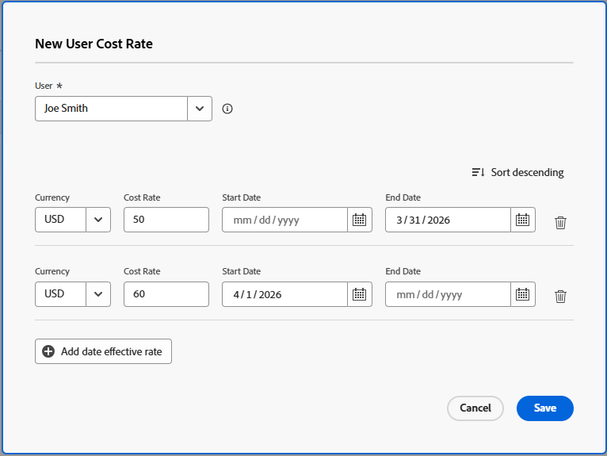

# 프로젝트 수준에서 사용자 비용 비율 재정의

{{highlighted-preview-article-level}}

특정 프로젝트의 사용자에 대한 비용 비율을 지정할 수 있습니다. 이 프로젝트 수준의 원가율은 이 사용자의 시스템 수준의 원가율을 재정의합니다. Workfront은 시스템 수준 원가율을 사용하는 대신 작업 역할의 프로젝트 수준 원가율을 사용하여 비용을 계산합니다.

이 문서에서는 프로젝트에 대한 시스템 사용자 비용 비율을 대체할 수 있는 방법에 대해 설명합니다.

프로젝트의 비용 계산에 대한 자세한 내용은 [수익 및 비용 계층 구조 개요](/help/quicksilver/manage-work/projects/project-finances/overview-revenue-cost-hierarchy.md) 및 [비용 추적](/help/quicksilver/manage-work/projects/project-finances/track-costs.md)을 참조하세요.

## 액세스 요구 사항

+++ 이 문서의 기능에 대한 액세스 요구 사항을 보려면 확장하십시오.

<table style="table-layout:auto"> 
 <col> 
 <col> 
 <tbody> 
  <tr> 
   <td>Adobe Workfront 패키지</td> 
   <td>워크플로 얼티밋</td> 
  </tr> 
  <tr> 
   <td>Adobe Workfront 라이선스</td> 
   <td>표준</td> 
  </tr> 
  <tr> 
   <td>액세스 수준 구성</td> 
   <td> 
프로젝트 및 재무 데이터에 대한 액세스 편집

       

또한 다음 중 하나가 있어야 합니다.
 
        <ul> 
          <li> 
시스템 관리자 액세스 수준입니다. </li> 
          <li> 
액세스 수준의 <b>사용자</b> 설정이 <b>편집</b> 액세스로 구성되었으며, <b>만들기</b>와 <b>설정을 미세 조정</b> <b>에서 두 개의 </b>사용자 관리 옵션 중 하나 이상을 사용할 수 있습니다. 
 
이 두 옵션 중 <b>사용자 관리자(그룹 사용자)</b>를 사용하도록 설정한 경우 사용자가 구성원인 그룹의 그룹 관리자여야 합니다.
 </li> 
    </ul></td> 
  </tr> 
  <tr> 
   <td>개체 권한</td> 
   <td>재무 데이터 편집이 포함된 프로젝트에 대한 권한 관리 </td> 
  </tr> 
 </tbody> 
</table>

자세한 내용은 [Workfront 설명서의 액세스 요구 사항](/help/quicksilver/administration-and-setup/add-users/access-levels-and-object-permissions/access-level-requirements-in-documentation.md)을 참조하십시오.

+++

## 전제 조건

사용자는 사용자 프로필에서 **비용 비율 재정의가 허용됨** 필드를 활성화해야 합니다. 사용자에게 원가 대체 필드가 사용으로 설정되어 있지 않으면 프로젝트의 해당 사용자에 대해 원가 대체가 허용되지 않으며 시스템에서 사용자 프로필의 비율을 사용하여 원가를 계산합니다.

자세한 내용은 [사용자 프로필 편집](/help/quicksilver/administration-and-setup/add-users/create-and-manage-users/edit-a-users-profile.md)을 참조하세요.

## 프로젝트 수준에서 사용자 비용 비율 재정의

1. 원가율을 대체할 프로젝트로 이동합니다.
1. 왼쪽 패널에서 **속도**&#x200B;를 클릭합니다. 먼저 **자세히 표시**&#x200B;를 클릭해야 할 수 있습니다.
1. 아직 선택하지 않은 경우 **비용** 탭을 클릭합니다.
1. **비용 요금 추가** > **새 사용자 비용 요금**&#x200B;을 클릭합니다.

   신규 사용자 원가 비율 상자가 열립니다.

1. **사용자** 필드에서 요금을 변경할 사용자를 선택합니다.
1. 원가율 재정의에 사용할 **통화**&#x200B;를 선택하십시오.
1. **비용 비율** 필드에 첫 번째 비용 비율 재정의를 입력합니다.
1. (선택 사항) 더 많은 비용 비율 재정의를 추가하려면 **날짜 유효 비율 추가**&#x200B;를 클릭합니다.

   >[!NOTE]
   >
   >단일 비율 재정의를 입력하면 프로젝트의 전체 수명에 적용됩니다.
   >시간 경과에 따라 비율을 다르게 설정하려면 여러 날짜 유효 대체를 추가할 수 있습니다.

1. (조건부) 복수 원가율 대체를 추가하는 경우 각 행에 대해 다음 정보를 지정합니다.

   * **비용 비율**: 지정된 기간 동안의 비용 비율 값입니다.
   * **시작 날짜**: 비용 요금 재정의가 시작되는 날짜입니다.
   * **종료 날짜**: 원가율 재정의가 종료되는 날짜입니다.

   

   Workfront은 프로젝트의 비용을 계산할 때 이러한 기간 동안 발생하는 시간에 무시 작업 역할 비율을 적용합니다.

   두 재정의 비율의 시간대 사이에 간격이 없어야 합니다. 재정의 비율의 **시작 날짜**&#x200B;는 이전 재정의 날짜의 **종료 날짜** 바로 다음 날이어야 합니다.

   첫 번째 대체 비율에 대해 시작 일자를 지정하거나 마지막 대체 비율에 대해 종료 일자를 지정하지 않아도 됩니다.

   첫 번째 재정의 비율에 기본 비율을 사용하는 것이 좋습니다.

   Workfront에서는 첫 번째 재정의의 종료 날짜보다 오래된 날짜가 있는 모든 시간에 대해 첫 번째 재정의 비율이 적용되고, 마지막 재정의 시작 날짜보다 오래된 날짜가 있는 모든 시간에 대해 마지막 재정의 비율이 적용된다고 가정합니다.

   프로젝트의 계획된 시작 일자 전에 시간이 기록되는 경우 첫 번째 비용 비율이 사용됩니다.

   프로젝트의 계획된 완료 일자 이후 시간이 기록되는 경우 마지막 비용 비율이 사용됩니다.

1. **저장**&#x200B;을 클릭합니다.

