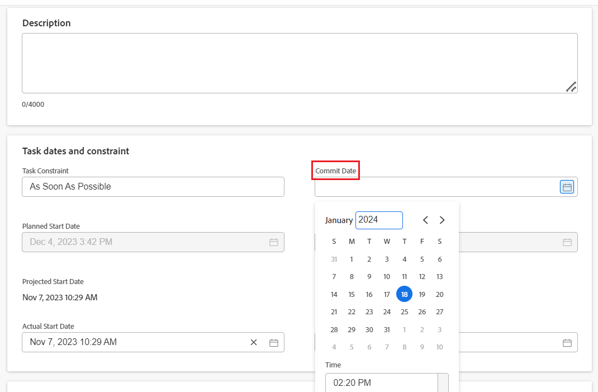

# 작업 및 문제에 대한 커밋 일자 업데이트

할당된 작업 또는 문제의 커밋 일자를 수동으로 업데이트할 수 있습니다. Adobe Workfront의 커밋 일자에 대한 자세한 내용은 다음을 참조하십시오. [커밋 일자 개요](../../../manage-work/projects/updating-work-in-a-project/overview-of-commit-dates.md).

## 액세스 요구 사항

<!--Audited: 01/2024-->

이 문서의 단계를 수행하려면 다음 액세스 권한이 있어야 합니다.

<table style="table-layout:auto"> 
 <col> 
 <col> 
 <tbody> 
  <tr> 
   <td role="rowheader">Adobe Workfront 플랜*</td> 
   <td> 
임의
 </td> 
  </tr> 
  <tr> 
   <td role="rowheader">Adobe Workfront 라이센스*</td> 
   <td> 
   새 라이센스의 경우:
   <ul>
   <li>
작업 표준
 </li>
   <li>
문제에 대한 기여자 이상
</li>
   </ul>
   현재 라이센스의 경우:
<ul>
   <li>
작업 이상
</li> 
   <li>
문제에 대한 요청 이상
</li>
</ul>

</td> 
  </tr> 
  <tr> 
   <td role="rowheader">액세스 수준 구성</td> 
   <td> 
작업 및 문제에 대한 액세스 편집
 </td> 
  </tr> 
  <tr> 
   <td role="rowheader">개체 권한</td> 
   <td> 
작업 또는 문제에 대한 권한 관리
 </td> 
  </tr> 
 </tbody> 
</table>

*보유 중인 플랜, 라이선스 유형 또는 액세스 권한을 확인하려면 Workfront 관리자에게 문의하십시오. 자세한 내용은 [Workfront 설명서의 액세스 요구 사항](/help/quicksilver/administration-and-setup/add-users/access-levels-and-object-permissions/access-level-requirements-in-documentation.md).

## 전제 조건

시작하기 전에 작업 또는 문제에 할당되어 있어야 하며 의 커밋 일자를 업데이트해야 합니다.

## 작업 및 문제에 대한 커밋 일자 업데이트

커밋 일자 업데이트는 작업 및 문제와 동일합니다.

1. (으)로 할당된 작업 또는 문제로 이동 **소유자**.

   문제 또는 작업에 대한 작업 소유자 확인에 대한 자세한 내용은 섹션을 참조하십시오 [작업 편집](../../../manage-work/tasks/manage-tasks/edit-tasks.md#assignments) 이 문서에서 [작업 편집](../../../manage-work/tasks/manage-tasks/edit-tasks.md).

1. 클릭 **작업 세부 정보** 또는 **문제 세부 정보** 왼쪽 패널에서
1. 클릭 **개요** 확장하기 위해
1. 업데이트 **커밋 일자** 필드.

   

1. **변경 내용 저장**&#x200B;을 클릭합니다.

   이 변경 작업을 수행한 후 다음 작업이 수행됩니다. 

   * 작업 또는 문제의 커밋 일자와 계획된 완료 일자가 더 이상 동일하지 않습니다.

     대신 작업 또는 문제의 커밋 일자와 예상 완료 일자가 같아집니다.

     

   * 작업 또는 문제에 대한 새 커밋 일자를 제안했다는 알림이 인앱 알림을 통해 프로젝트 소유자에게 표시됩니다.
   * 업데이트 섹션에서 프로젝트 소유자에게 새 커밋 일자를 제안했다는 알림이 표시되며 사용자는 이때 제안한 커밋 일자와 일치하도록 작업 또는 문제의 계획된 완료 일자를 업데이트할 수 있습니다. 이 기능은 새 댓글 달기 환경에서 지원되지 않습니다. 자세한 내용은 [새로운 댓글 달기 환경](/help/quicksilver/product-announcements/betas/new-commenting-experience-beta/unified-commenting-experience.md).

     

     이 변경으로 인해 트리거되는 알림 및 업데이트에 대한 자세한 내용은 문서의 &quot;커밋 일자 변경으로 인해 트리거되는 알림 및 업데이트&quot; 섹션을 참조하십시오 [커밋 일자 개요](/help/quicksilver/manage-work/projects/updating-work-in-a-project/overview-of-commit-dates.md).

<!--at the Production update stream when removing legacy - replace the last bullet with: The Project Owner is notified in the Systems Activity and the All tabs of the Updates section that you have suggested a new Commit Date. They can then update the Planned Completion Date accordingly by editing the task or the issue.-->