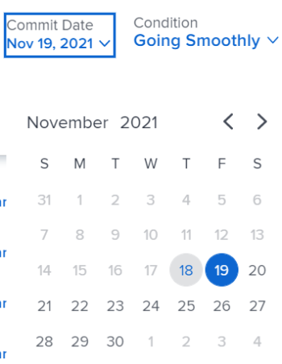

# 작업 및 문제에 대한 커밋 날짜 업데이트

작업의 커밋 날짜 또는 지정된 문제를 수동으로 업데이트할 수 있습니다. Adobe Workfront의 커밋 날짜에 대한 자세한 내용은 [커밋 날짜 개요](../../../manage-work/projects/updating-work-in-a-project/overview-of-commit-dates.md).

## 액세스 요구 사항

<!--drafted for P&P

<table style="table-layout:auto"> 
 <col> 
 <col> 
 <tbody> 
  <tr> 
   <td role="rowheader">Adobe Workfront plan*</td> 
   <td> 
Any
 </td> 
  </tr> 
  <tr> 
   <td role="rowheader">Adobe Workfront license*</td> 
   <td> 
   For the current licenses:
   <ul>
   <li>
Standard for tasks
 </li>
   <li>
Contributor or higher for issues
</li>
   </ul>
   For legacy licenses:
<ul>
   <li>
Work or higher for tasks
</li> 
   <li>
Request or higher for issues
</li>
</ul>

   </td> 
  </tr> 
  <tr> 
   <td role="rowheader">Access level configurations*</td> 
   <td> 
Edit access to Tasks and Issues
 
<b>NOTE</b>
   
   If you still don't have access, ask your Workfront administrator if they set additional restrictions in your access level. For information on how a Workfront administrator can modify your access level, see <a href="../../../administration-and-setup/add-users/configure-and-grant-access/create-modify-access-levels.md" class="MCXref xref">Create or modify custom access levels</a>.
 </td> 
  </tr> 
  <tr> 
   <td role="rowheader">Object permissions</td> 
   <td> 
Manage permissions on the task or issue
 
For information on requesting additional access, see <a href="../../../workfront-basics/grant-and-request-access-to-objects/request-access.md" class="MCXref xref">Request access to objects </a>.
 </td> 
  </tr> 
 </tbody> 
</table>
-->

이 문서의 절차를 수행하려면 다음 액세스 권한이 있어야 합니다.

<table style="table-layout:auto"> 
 <col> 
 <col> 
 <tbody> 
  <tr> 
   <td role="rowheader">Adobe Workfront 플랜*</td> 
   <td> 
모든
 </td> 
  </tr> 
  <tr> 
   <td role="rowheader">Adobe Workfront 라이선스*</td> 
   <td> 
작업의 경우 작업 이상
 
   
문제에 대한 요청 이상

   </td> 
  </tr> 
  <tr> 
   <td role="rowheader">액세스 수준 구성*</td> 
   <td> 
작업 및 문제에 대한 액세스 편집
 
<b>메모</b>

여전히 액세스 권한이 없는 경우 Workfront 관리자에게 액세스 수준에서 추가 제한 사항을 설정하는지 문의하십시오. Workfront 관리자가 액세스 수준을 수정하는 방법에 대한 자세한 내용은 <a href="../../../administration-and-setup/add-users/configure-and-grant-access/create-modify-access-levels.md" class="MCXref xref">사용자 정의 액세스 수준 만들기 또는 수정</a>.
 </td>
</tr> 
  <tr> 
   <td role="rowheader">개체 권한</td> 
   <td> 
작업 또는 문제에 대한 권한 관리
 
추가 액세스 요청에 대한 자세한 내용은 <a href="../../../workfront-basics/grant-and-request-access-to-objects/request-access.md" class="MCXref xref">개체에 대한 액세스 요청 </a>.
 </td> 
  </tr> 
 </tbody> 
</table>

&#42;어떤 계획, 라이선스 유형 또는 액세스 권한을 보유하고 있는지 알아보려면 Workfront 관리자에게 문의하십시오.

## 전제 조건

시작하기 전에, 작업 또는 문제에 할당되어야 하는 경우 커밋 날짜를 업데이트해야 합니다.

## 작업 및 문제에 대한 커밋 날짜 업데이트

커밋 날짜 업데이트는 작업 및 문제와 동일합니다.

1. 으로 지정된 작업 또는 문제로 이동합니다. **작업 소유자**.

   문제 또는 작업의 작업 소유자가 누구인지 확인하는 방법에 대한 자세한 내용은 섹션을 참조하십시오 [작업 편집](../../../manage-work/tasks/manage-tasks/edit-tasks.md#assignments) 기사 [작업 편집](../../../manage-work/tasks/manage-tasks/edit-tasks.md).

1. 작업 또는 문제 헤더에서 작업 을 클릭합니다

   또는

   클릭 **작업 시작** 또는 **시작 문제** 작업 버튼이 환경에서 사용자 지정되어 작업 항목에 대해 작업 중임을 나타냅니다.

   현재 작업 또는 문제의 커밋 일자와 계획 완료 날짜가 동일합니다.

1. (선택 사항) 작업 시작 또는 시작 문제를 클릭한 경우 **실행 취소** 화면 왼쪽 아래 모서리에 있습니다. 커밋 날짜가 제거됩니다.

   Work On It 단추를 시작 단추로 대체하는 방법에 대한 자세한 내용은  [Work On It 단추를 시작 단추로 바꿉니다.](../../../people-teams-and-groups/create-and-manage-teams/work-on-it-button-to-start-button.md).

   >[!TIP]
   >
   >작업을 시작하기 위한 선택 사항을 실행 취소하기 위한 옵션은 **작업**.

1. 클릭 **업데이트** 왼쪽 패널에서 **새 업데이트 시작** >**커밋 날짜**

   또는

   클릭 **작업 세부 사항** 또는 **문제 세부 정보** 왼쪽 패널에서 을 두 번 클릭합니다 **커밋 날짜** 달력에서 새 날짜를 선택한 다음 **변경 내용 저장**.
   

   이 변경 후에 다음의 상황이 발생합니다. 

   * 커밋 일자와 계획 완료 일자가 더 이상 동일하지 않습니다.

      대신 작업 또는 문제의 커밋 날짜와 예상 완료 날짜가 동일합니다.

      

   * 업데이트 영역에서 새 날짜를 선택하면 변경 내용이 자동으로 저장됩니다.
   * 작업 또는 문제에 대해 새 커밋 날짜를 제안했다는 알림을 프로젝트 소유자는 이 시점에서 작업 또는 문제의 계획 완료 일자를 제안된 커밋 일자와 일치하도록 업데이트할 수 있습니다.

      

      이 변경으로 트리거되는 알림 및 업데이트에 대한 자세한 내용은 섹션을 참조하십시오 [커밋 날짜를 변경하여 트리거된 알림 및 업데이트](../../../manage-work/projects/updating-work-in-a-project/overview-of-commit-dates.md#notifica) 기사 [커밋 날짜 개요](../../../manage-work/projects/updating-work-in-a-project/overview-of-commit-dates.md).
