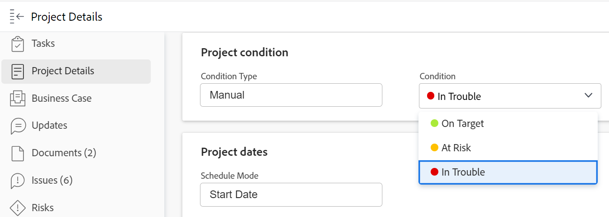

# 프로젝트에 대한 조건 업데이트

프로젝트 조건은 해당 프로젝트와 관련된 작업이 원활하게 진행되는지 또는 장애물이 발생했는지 여부를 나타내는 플래그입니다. 이 상태는 프로젝트 상태와 다릅니다. 이는 프로젝트에서 활발히 작업 중인지 여부를 나타냅니다.

프로젝트의 조건을 자동 또는 수동으로 설정할 수 있습니다. 프로젝트의 조건을 수동으로 변경하려면 프로젝트 소유자나 프로젝트 소유자에 대한 관리 권한이 있어야 합니다.

Adobe Workfront 관리자는 [사용자 지정 조건 만들기 또는 편집](../../../administration-and-setup/customize-workfront/create-manage-custom-conditions/create-edit-custom-conditions.md).

## 액세스 요구 사항

<!--drafted for P&P:

<table style="table-layout:auto"> 
 <col> 
 <col> 
 <tbody> 
  <tr> 
   <td role="rowheader">Adobe Workfront plan*</td> 
   <td>
Any
 </td> 
  </tr> 
  <tr> 
   <td role="rowheader">Adobe Workfront license*</td> 
   <td> 
   
   For the current licenses:
  
Standard

   
   For legacy licenses:
   <ul><li>
Plan

    </td> 
  </tr> 
  <tr> 
   <td role="rowheader">Access level configurations*</td> 
   <td> 
View or higher access to projects
 
Edit access to tasks and issues 
 
<b>NOTE</b> 
   
   If you still don't have access, ask your Workfront administrator if they set additional restrictions in your access level. For information on how a Workfront administrator can change your access level, see <a href="../../../administration-and-setup/add-users/configure-and-grant-access/create-modify-access-levels.md" class="MCXref xref">Create or modify custom access levels</a>.
 </td> 
  </tr> 
  <tr> 
   <td role="rowheader">Object permissions</td> 
   <td> 
View or higher permissions on tasks and issues to view their Condition

   
Manage permissions on tasks and issues to update the Condition

    
For information on requesting additional access, see <a href="../../../workfront-basics/grant-and-request-access-to-objects/request-access.md" class="MCXref xref">Request access to objects </a>.
 </td> 
  </tr> 
 </tbody> 
</table>
-->

이 문서의 절차를 수행하려면 다음 액세스 권한이 있어야 합니다.

<table style="table-layout:auto"> 
 <col> 
 <col> 
 <tbody> 
  <tr> 
   <td role="rowheader">Adobe Workfront 플랜*</td> 
   <td> 
모든
 </td> 
  </tr> 
  <tr> 
   <td role="rowheader">Adobe Workfront 라이선스*</td> 
   <td> 
플랜 
 </td> 
  </tr> 
  <tr> 
   <td role="rowheader">액세스 수준 구성*</td> 
   <td> 
프로젝트에 대한 액세스 편집
 
<b>메모</b>

여전히 액세스 권한이 없는 경우 Workfront 관리자에게 액세스 수준에서 추가 제한 사항을 설정하는지 문의하십시오. Workfront 관리자가 액세스 수준을 수정하는 방법에 대한 자세한 내용은 <a href="../../../administration-and-setup/add-users/configure-and-grant-access/create-modify-access-levels.md" class="MCXref xref">사용자 정의 액세스 수준 만들기 또는 수정</a>.
 </td>
</tr> 
  <tr> 
   <td role="rowheader">개체 권한</td> 
   <td> 
프로젝트에 대한 권한 관리
 
추가 액세스 요청에 대한 자세한 내용은 <a href="../../../workfront-basics/grant-and-request-access-to-objects/request-access.md" class="MCXref xref">개체에 대한 액세스 요청 </a>.
 </td> 
  </tr> 
 </tbody> 
</table>

&#42;어떤 계획, 라이선스 유형 또는 액세스 권한을 보유하고 있는지 알아보려면 Workfront 관리자에게 문의하십시오.

## 조건 자동 설정

프로젝트의 조건 자동 설정은 프로젝트의 조건 유형에 의해 결정됩니다. 프로젝트의 조건을 자동으로 설정하려면 Workfront에서 조건 유형을 진행 상태로 설정해야 합니다.

Workfront 또는 그룹 관리자는 설정 영역에서 프로젝트 환경 설정을 설정할 때 시스템의 새 프로젝트에 대한 조건 유형 필드의 기본값을 결정합니다. 자세한 내용은 [시스템 전체 프로젝트 환경 설정 구성](../../../administration-and-setup/set-up-workfront/configure-system-defaults/set-project-preferences.md).

프로젝트를 만들 때 프로젝트의 조건이 해당 시간에 프로젝트의 진행 상태와 일치하도록 자동으로 설정됩니다. 프로젝트의 진행 상태는 프로젝트의 작업 진행 상태를 기반으로 합니다.

프로젝트 조건 및 진행 상태를 기반으로 프로젝트 조건을 계산하는 방법에 대한 자세한 내용은 [프로젝트 진행 상태 개요](../../../manage-work/projects/planning-a-project/project-progress-status.md).

## 프로젝트에 대한 조건 수동으로 업데이트

프로젝트의 조건 유형을 진행 상태 대신 수동으로 설정하는 경우 프로젝트의 조건을 수동으로 업데이트할 수 있습니다.

1. 조건을 업데이트할 프로젝트로 이동합니다.
1. 을(를) 클릭합니다. **프로젝트 세부 사항** 섹션을 참조하십시오.

   

1. 다음을 확인합니다. **조건 유형** 필드가 **수동**.

1. 에서 **조건** 필드에서 다음 옵션 중에서 해당 작업과 관련된 작업이 원활하게 진행되는지 또는 지연이 있는지 여부를 이해하는 것과 일치하는 옵션을 선택합니다.

   * **대상**
   * **위험 상태**
   * **문제 발생**

   프로젝트 조건에 대한 자세한 내용은 [프로젝트 조건 및 조건 유형 개요](../../../manage-work/projects/manage-projects/project-condition-and-condition-type.md).

   >[!NOTE]
   >
   >환경에 맞게 조건을 사용자 지정할 수 있으므로 환경에서 조건에 대한 옵션을 세 개 이상 찾을 수 있습니다. 조건 이름은 위에 나열된 이름과 다를 수 있습니다. Workfront의 조건 사용자 지정에 대한 자세한 내용은 [사용자 지정 조건 만들기 또는 편집](../../../administration-and-setup/customize-workfront/create-manage-custom-conditions/create-edit-custom-conditions.md).

1. 클릭 **저장**.Click **변경 내용 저장**.
