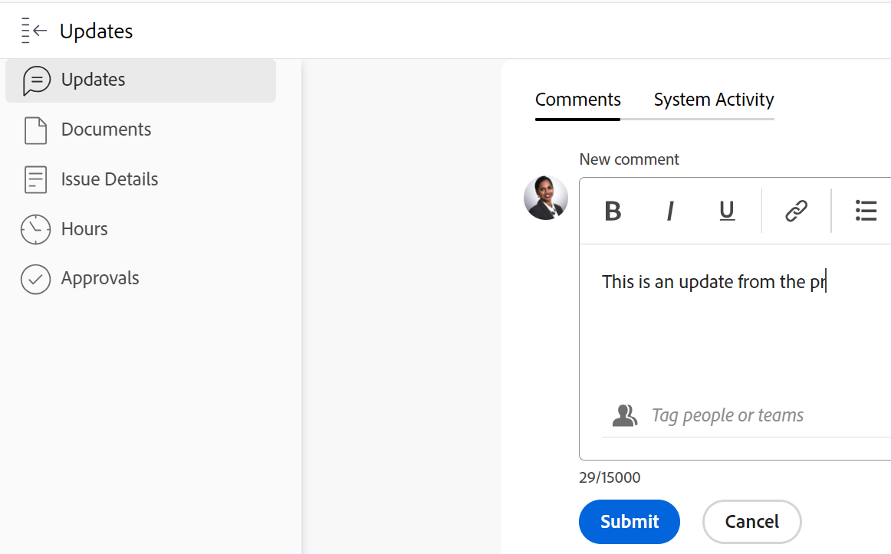

# 문제 상태 업데이트

<!--Audited: 01/2024-->

문제 상태를 업데이트하여 문제의 위치와 진행 방법을 다른 사용자에게 알릴 수 있습니다.

## 액세스 요구 사항

이 문서의 단계를 수행하려면 다음 액세스 권한이 있어야 합니다.

<table style="table-layout:auto"> 
 <col> 
 <col> 
 <tbody> 
  <tr> 
   <td role="rowheader">Adobe Workfront 플랜</td> 
   <td> 
임의
 </td> 
  </tr> 
  <tr> 
   <td role="rowheader">Adobe Workfront 라이센스*</td> 
   <td> 
새 라이선스: 기여자 이상

   또는
   
현재 라이선스: 요청 이상

   </td> 
  </tr> 
  <tr> 
   <td role="rowheader">액세스 수준 구성</td> 
   <td> 
문제에 대한 액세스 편집
 </td> 
  </tr> 
  <tr> 
   <td role="rowheader">개체 권한</td> 
   <td> 
문제에 대한 권한 관리
 </td> 
  </tr> 
 </tbody> 
</table>

*보유 중인 플랜, 라이선스 유형 또는 액세스 권한을 확인하려면 Workfront 관리자에게 문의하십시오. 자세한 내용은 [Workfront 설명서의 액세스 요구 사항](/help/quicksilver/administration-and-setup/add-users/access-levels-and-object-permissions/access-level-requirements-in-documentation.md).

## 문제 상태

Workfront의 문제에 대한 기본 상태는 다음과 같습니다.

* 신규
* 진행 중
* 대기 중인 피드백
* 보류 중
* 해결되지 않음
* 다시 열림
* 마감됨
* 해결됨

Adobe Workfront 관리자는 조직의 문제에 대한 사용자 정의 상태를 추가할 수 있습니다. 또한 문제 유형에 따라 상태를 사용할 수 있도록 설정할 수도 있습니다.

사용자 지정 상태 및 문제 유형에 대한 자세한 내용은 다음 문서를 참조하십시오.

* [상태 만들기 또는 편집](../../../administration-and-setup/customize-workfront/creating-custom-status-and-priority-labels/create-or-edit-a-status.md)
* [문제 만들기](../../../manage-work/issues/manage-issues/create-issues.md)

문제 상태를 수동으로 업데이트하거나 특정 작업이 발생할 때 Workfront에서 자동으로 업데이트하도록 할 수 있습니다.

## 문제 상태 수동 업데이트

Workfront의 다음 영역에서 문제 상태를 업데이트할 수 있습니다.

* 작업 페이지의 문제 헤더입니다.
* 문제를 편집할 때 문제 편집 상자
* 문제 페이지의 세부 정보 섹션.
* 문제 목록 또는 보고서에서 상태 필드가 보기에 표시될 때.
* 문제의 요약 패널에서 확인할 수 있습니다.

문제 헤더에서 문제 상태를 수동으로 업데이트하려면:

1. 상태를 업데이트할 문제로 이동합니다.
1. 다음을 클릭합니다. **상태** 문제 헤더의 필드에 새 상태를 선택합니다.
1. 문제 완료를 시각적으로 나타내려면 아래의 버블을 끌거나 두 번 클릭합니다. **완료율** 문제의 헤더에서

   또는

   문제 헤더의 버블 내부를 클릭하여 백분율을 입력합니다.

   

1. (선택 사항) 업데이트에 대한 추가 정보를 제공하려면 다음 중 하나를 수행합니다.

   * 업데이트에 대한 메모를 추가하려면 **업데이트** 섹션 및 클릭 **새 댓글**&#x200B;을 클릭한 다음 메모를 입력합니다.

     

   * 특정 사용자에게 업데이트에 대해 알리려면 **사람 또는 팀에 태그 지정** 댓글을 입력할 때 표시되는 필드입니다. 자세한 내용은 [업데이트에 다른 사용자 태그 지정](../../../workfront-basics/updating-work-items-and-viewing-updates/tag-others-on-updates.md).
   * 문제의 커밋 일자를 업데이트하려면 다음을 클릭하십시오. **문제 세부 정보**&#x200B;를 클릭한 다음 을(를) 편집합니다. **커밋 일자** 필드. 자세한 내용은 [문제 편집](/help/quicksilver/manage-work/issues/manage-issues/edit-issues.md).

   >[!IMPORTANT]
   >
   >  문제 할당자만 커밋 일자를 업데이트할 수 있습니다.

<!--Old instructions, in old commenting: 

When you are updating an issue status, you can also add an explanation about the new status and change other issue information such as the commit date.

1. Go to an issue that you are assigned to for which you want to update the status.
1. Click the **Status** field in the issue header and select a new status.

   

1. To provide a visual indication of issue completion, drag or double-click the bubble under **Percent Complete** in the header of the issue.

   Or

   Click inside the bubble in the header of the issue to enter a percentage.

   

-->

## 문제 상태 자동 업데이트

Workfront은 아래 표에 나열된 작업이 발생하면 문제의 기존 상태를 다른 상태로 자동으로 업데이트합니다.

>[!NOTE]
>
>다음 표의 상태는 기본 시스템 상태입니다. Workfront 관리자 또는 그룹 관리자는 Workfront 인스턴스의 상태를 변경할 수 있습니다. Workfront에서 상태를 만들고 관리하는 방법에 대한 자세한 내용은 [상태 만들기 또는 편집](../../../administration-and-setup/customize-workfront/creating-custom-status-and-priority-labels/create-or-edit-a-status.md).

<table style="table-layout:auto"> 
 <col> 
 <col> 
 <col> 
 <tbody> 
  <tr> 
   <td><b>개 액션</b></td> 
   <td><b>원래 상태</b></td> 
   <td><b>새 상태</b></td> 
  </tr> 
  <tr> 
   <td>문제 완료율을 100%로 업데이트</td> 
   <td>신규 또는 진행 중</td> 
   <td>마감됨</td> 
  </tr> 
  <tr> 
   <td>문제 완료율을 100%에서 더 낮은 숫자로 업데이트</td> 
   <td>마감됨 </td> 
   <td>진행 중</td> 
  </tr> 
  <tr> 
   <td>문제에 연결된 해결 중 오브젝트의 상태 업데이트</td> 
   <td>다양한 상태</td> 
   <td> 
다양한 상태
 
해결 중인 객체와 이것이 문제 상태에 미치는 영향에 대한 자세한 내용은 문서의 "해결 가능한 객체의 상태를 해결 중인 객체의 상태와 동기화" 섹션을 참조하십시오 <a href="../../../manage-work/issues/convert-issues/resolving-and-resolvable-objects.md" class="MCXref xref">해결 및 해결 가능한 객체 개요 </a>.
 </td> 
  </tr> 
  <tr data-mc-conditions=""> 
   <td>할당된 문제에 대한 작업을 수락하려면 문제 시작 단추를 클릭하십시오. </td> 
   <td>신규 </td> 
   <td> 
홈 팀 설정의 문제 시작 단추와 연결된 모든 상태입니다. 
 
처리 중(Work On It) 단추를 문제 시작 단추로 바꾸는 방법에 대한 자세한 내용은 <a href="../../../people-teams-and-groups/create-and-manage-teams/work-on-it-button-to-start-button.md" class="MCXref xref">처리 중 단추를 시작 단추로 바꾸기</a>. 
 
팁: 클릭 실행 취소 단추 문제 시작을 클릭하면 상태가 새로 으로 되돌아갑니다. 
 </td> 
  </tr> 
 </tbody> 
</table>
