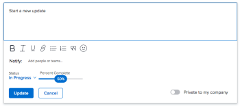

# 작업 상태 업데이트

작업 상태를 업데이트하여 작업의 위치와 전체 프로젝트 진행 상황을 다른 사용자에게 알릴 수 있습니다.

기본 상태는 신규, 진행 중 및 완료입니다. Adobe Workfront 관리자는 조직에 대한 사용자 정의 상태를 추가할 수 있습니다. 자세한 내용은 [상태 만들기 또는 편집](../../../administration-and-setup/customize-workfront/creating-custom-status-and-priority-labels/create-or-edit-a-status.md).

작업 상태를 수동으로 업데이트하거나 특정 작업이 발생할 때 Workfront에서 자동으로 업데이트하도록 할 수 있습니다.

## 액세스 요구 사항

작업을 수동으로 업데이트하려면 다음 액세스 권한이 있어야 합니다.

<table style="table-layout:auto"> 
 <col> 
 <col> 
 <tbody> 
  <tr> 
   <td role="rowheader">Adobe Workfront 플랜</td> 
   <td> 
임의
 </td> 
  </tr> 
  <tr> 
   <td role="rowheader">Adobe Workfront 라이센스*</td> 
   <td> 
새로운 기능: 표준
 
   또는
   
현재: 작업 시간 이상

   </td> 
  </tr> 
  <tr> 
   <td role="rowheader">액세스 수준 구성</td> 
   <td> 
작업에 대한 액세스 편집
  </td> 
  </tr> 
  <tr> 
   <td role="rowheader">개체 권한</td> 
   <td> 
작업에 대한 권한 관리
 </td> 
  </tr> 
 </tbody> 
</table>

*보유 중인 플랜, 라이선스 유형 또는 액세스 권한을 확인하려면 Workfront 관리자에게 문의하십시오. 자세한 내용은 [Workfront 설명서의 액세스 요구 사항](/help/quicksilver/administration-and-setup/add-users/access-levels-and-object-permissions/access-level-requirements-in-documentation.md).

## 작업 상태 업데이트에 대한 고려 사항

* 작업을 완료로 표시하면 작업의 완료율이 100%로 업데이트됩니다.
* 상위 작업에 대해 다음과 같은 시나리오가 있습니다.
   * 프로젝트의 요약 완료 모드가 자동으로 설정되고 하위 작업이 완료되지 않은 경우 상위 작업의 상태를 완료로 업데이트할 수 없습니다.
   * 프로젝트의 요약 완료 모드가 수동으로 설정되고 하위 작업이 완료되거나 완료되지 않은 경우 상위 작업의 상태를 완료로 업데이트할 수 있습니다.

  자세한 내용은 [프로젝트 편집](../manage-projects/edit-projects.md).

## 수동으로 작업 상태 업데이트

Workfront의 다음 영역에서 작업 상태를 업데이트할 수 있습니다.

* 작업 페이지의 작업 헤더입니다.
* 작업을 편집할 때 작업 편집 상자
* 작업 페이지의 작업 세부 정보 섹션.
* 작업 목록 또는 보고서에서 상태 필드가 보기에 표시될 때.
* 작업의 요약 패널에서 다음을 수행합니다.

태스크 헤더에서 태스크 상태를 수동으로 갱신하려면

1. 상태를 업데이트할 작업으로 이동합니다.
1. 다음을 클릭합니다. **상태** 작업 헤더의 필드에 새 상태를 선택합니다.
1. 작업 완료를 시각적으로 표시하려면 아래의 버블을 끌어 놓거나 두 번 클릭합니다. **완료율** 작업 헤더

   또는

   작업 헤더의 버블 내부를 클릭하여 백분율을 입력합니다.

   

1. (선택 사항) 업데이트에 대한 추가 정보를 제공하려면 다음 중 하나를 수행합니다.

   * 업데이트에 대한 메모를 추가하려면 **업데이트** 섹션 및 클릭 **새 댓글**&#x200B;을 클릭한 다음 메모를 입력합니다.

     

   * 특정 사용자에게 업데이트에 대해 알리려면 **사람 또는 팀에 태그 지정** 댓글을 입력할 때 표시되는 필드입니다. 자세한 내용은 [업데이트에 다른 사용자 태그 지정](/help/quicksilver/workfront-basics/updating-work-items-and-viewing-updates/tag-others-on-updates.md).
   * 작업의 커밋 일자를 업데이트하려면 **작업 세부 정보**&#x200B;를 클릭한 다음 을(를) 편집합니다. **커밋 일자** 필드. 자세한 내용은 [작업 편집](/help/quicksilver/manage-work/tasks/manage-tasks/edit-tasks.md).

   >[!IMPORTANT]
   >
   >  작업 할당자만 커밋 일자를 업데이트할 수 있습니다.

<!--old functionality in old commenting: 

1. Go to a task that you are assigned to for which you want to update the status.
1. Click the **Status** field in the task header and select a new status. 
1. (Optional) Do any of the following to provide additional information about the update, then click **Update** or, if the task has the **Complete** status, click **Done:**

   * To add a note about the update, go to the **Updates** area and click **Start a new update**, then type your note.  

   * To notify certain users about the update, type their names in the **Notify** box that appears when you type a note about the update. For more information, see [Tag others on updates](../../../workfront-basics/updating-work-items-and-viewing-updates/tag-others-on-updates.md). 
   * To update the condition of the task, click **Select Condition** to the right of the **Notify** box (these appear when you type a note about the update), then select the condition that best reflects the current condition of the task.
   
   * To update the Commit Date of the task, expand the **Commit Date** drop-down calendar, and select a new Commit Date. 
   * To provide a visual indication of task completion, drag the bubble under Percent Complete or double-click it to enter a percent value.   
     -->

## 작업 상태 자동 업데이트

Workfront은 아래 표에 나열된 작업이 발생할 때 작업의 기존 상태를 다른 상태로 자동으로 업데이트합니다.

>[!NOTE]
>
>다음 표의 상태는 기본 시스템 상태입니다. Workfront 관리자 또는 그룹 관리자는 Workfront 인스턴스의 상태를 변경할 수 있습니다. Workfront에서 상태를 만들고 관리하는 방법에 대한 자세한 내용은 [상태 만들기 또는 편집](../../../administration-and-setup/customize-workfront/creating-custom-status-and-priority-labels/create-or-edit-a-status.md).

<table style="table-layout:auto"> 
 <col> 
 <col> 
 <col> 
 <tbody> 
  <tr> 
   <td><b>개 액션</b></td> 
   <td><b>원래 상태</b></td> 
   <td><b>새 상태</b></td> 
  </tr> 
  <tr> 
   <td>작업 완료율을 100%로 업데이트</td> 
   <td>신규 또는 진행 중</td> 
   <td>완료</td> 
  </tr> 
  <tr> 
   <td>작업 완료율을 100%에서 더 낮은 숫자로 업데이트</td> 
   <td>완료</td> 
   <td>진행 중</td> 
  </tr> 
  <tr data-mc-conditions=""> 
   <td>할당된 작업에 대한 작업을 수락하려면 작업 시작 단추를 클릭하십시오. </td> 
   <td>신규 </td> 
   <td> 
홈 팀 설정의 작업 시작 단추와 연결된 모든 상태입니다.
 
[처리 중] 단추를 [작업 시작] 단추로 바꾸는 방법에 대한 자세한 내용은 <a href="../../../people-teams-and-groups/create-and-manage-teams/work-on-it-button-to-start-button.md" class="MCXref xref">처리 중 단추를 시작 단추로 바꾸기</a>.
 
팁: 클릭 실행 취소 단추작업 시작을 클릭하면 상태가 신규로 되돌아갑니다. 
 </td> 
  </tr> 
 </tbody> 
</table>
