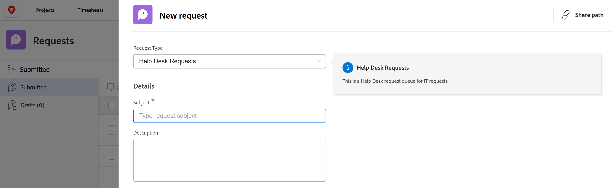

# 요청 대기열 만들기

<!--Audited: 12/2023-->

<!--
<THIS IS CONNECTED TO THE PRODUCT IN BLUEPRINTS. DO NOT MOVE/ CHANGE URL>
-->

<!--remove/ hide the entire "create requests in Production" section and just edit and leave  only the preview section when it releases to Production; also remove the template blurb when the queue details is unshimmed for templates-->

<!--

The highlighted information on this page refers to functionality not yet generally available. It is available only in the Preview environment for all customers. After the monthly releases to Production, the same features are also available in the Production environment for customers who enabled fast releases.    

For information about fast releases, see [Enable or disable fast releases for your organization](/help/quicksilver/administration-and-setup/set-up-workfront/configure-system-defaults/enable-fast-release-process.md).    

-->

사용자가 프로젝트에서 계획된 작업이 아닌 간혹 요청을 입력할 수 있는 요청 대기열을 설정할 수 있습니다. 예를 들어 IT 부서에 접수되는 모든 사용자 요청을 캡처하도록 헬프 데스크 요청 대기열을 설정할 수 있습니다.

요청은 Adobe Workfront에서 문제가 되며 프로젝트에 추가됩니다.

요청 대기열을 설정하면 프로젝트에 추가될 문제에 대한 정보를 공식화하는 데 도움이 됩니다. 프로젝트에 제출된 모든 문제는 동일한 방식으로 제출되고 동일한 완료 경로를 따릅니다.

다음 개체를 Workfront에서 요청 대기열로 설정할 수 있습니다.

* 프로젝트
* 템플릿. 요청 대기열로 설정된 템플릿에서 생성된 프로젝트는 요청 대기열이 됩니다.

프로젝트 또는 템플릿을 요청 대기열로 설정하려면 프로젝트 또는 템플릿의 대기열 세부 정보 영역을 편집해야 합니다.

이 문서에서는 사용자가 요청을 제출할 수 있는 요청 대기열로 프로젝트를 구성하는 방법에 대해 설명합니다. 템플릿에 대한 대기열 세부 정보를 설정하는 것은 프로젝트에서 설정하는 것과 비슷합니다.

요청 대기열에 새 요청을 제출하는 방법에 대한 자세한 내용은 [요청 복사 및 제출](../create-requests/copy-and-submit-requests.md)을 참조하십시오.

## 액세스 요구 사항

+++ 을 확장하여 이 문서의 기능에 대한 액세스 요구 사항을 봅니다.

이 문서의 단계를 수행하려면 다음 액세스 권한이 있어야 합니다.

<table style="table-layout:auto"> 
 <col> 
 <col> 
 <tbody> 
  <tr> 
   <td role="rowheader">Adobe Workfront 플랜</td> 
   <td> 
임의 
 </td> 
  </tr> 
  <tr> 
   <td role="rowheader">Adobe Workfront 라이선스</td> 
   <td> 
   
새 라이선스: Standard 

   또는
   
현재 라이선스: 플랜 
 </td> 
  </tr> 
  <tr> 
   <td role="rowheader">액세스 수준 구성</td> 
   <td> 
프로젝트에 대한 액세스 편집
 </td> 
  </tr> 
  <tr> 
   <td role="rowheader">개체 권한</td> 
   <td> 
 프로젝트에 대한 권한 관리
 </td> 
  </tr> 
 </tbody> 
</table>

이 표의 정보에 대한 자세한 내용은 [Workfront 설명서의 액세스 요구 사항](/help/quicksilver/administration-and-setup/add-users/access-levels-and-object-permissions/access-level-requirements-in-documentation.md)을 참조하십시오.

+++

## 요청 대기열 개요

요청 대기열을 프로젝트로 설정합니다. 프로젝트를 요청 대기열로 지정하면 Adobe Workfront의 요청 영역에서 대기열에 액세스할 수 있습니다. 요청 대기열을 사용자 정의하는 경우 사용자가 요청을 제출할 때 작성하는 양식을 사용자 정의하는 경우도 있습니다.

이 문서에서는 기존 프로젝트에서 요청 대기열을 만드는 방법에 대해 설명합니다. 그러나 요청 접수 프로세스에 대한 일관성을 구축하거나 보고 목적 및 개선된 관리를 위해 요청 접수 프로세스에 여러 계층을 추가하려면 다음 표에 설명된 요청 대기열의 추가 구성 요소를 구성할 수도 있습니다.

<table style="table-layout:auto"> 
 <col> 
 <col> 
 <tbody> 
  <tr> 
   <td role="rowheader">대기열 세부 정보</td> 
   <td> 
대기열 세부 정보 영역에서 프로젝트를 요청 대기열로 설정해야 합니다. 이 단계는 필수입니다. 
 
자세한 내용은 이 문서의 <a href="#create-a-request-queue" class="MCXref xref">요청 큐 만들기</a> 섹션을 참조하십시오.
 </td> 
  </tr> 
  <tr> 
   <td role="rowheader">주제 그룹</td> 
   <td> 
일반적인 기능에 따라 요청을 분류하는 추가 메뉴입니다. 예를 들어 IT 요청 대기열의 경우 "온사이트" 및 "원격" 주제 그룹이 있을 수 있습니다. 
 
자세한 내용은 <a href="../../../manage-work/requests/create-and-manage-request-queues/create-topic-groups.md" class="MCXref xref">주제 그룹 만들기</a>를 참조하십시오. 
 
선택 사항입니다.
 </td> 
  </tr> 
  <tr> 
   <td role="rowheader">대기열 주제</td> 
   <td> 
공통 기능을 기반으로 동일한 주제 그룹에 속하는 요청을 분류하는 추가 메뉴입니다. 주제 그룹에는 여러 개의 대기열 주제가 포함될 수 있습니다. 
 
예를 들어 IT 요청 대기열에 대한 "온사이트" 항목 그룹에는 "하드웨어", "소프트웨어" 및 "네트워크" 대기열 항목이 포함될 수 있습니다. 
 
자세한 내용은 <a href="../../../manage-work/requests/create-and-manage-request-queues/create-queue-topics.md" class="MCXref xref">대기열 주제 만들기</a>를 참조하십시오. 
 
선택 사항입니다.
 </td> 
  </tr> 
  <tr> 
   <td role="rowheader">라우팅 규칙</td> 
   <td> 
이를 통해 각 요청을 사용자, 작업 역할, 팀 또는 프로젝트에 라우팅할 수 있습니다. 
 
자세한 내용은 <a href="../../../manage-work/requests/create-and-manage-request-queues/create-routing-rules.md" class="MCXref xref">라우팅 규칙 만들기</a>를 참조하세요. 
 
선택 사항입니다.
 </td> 
  </tr> 
 </tbody> 
</table>

## 요청 대기열 만들기

<!-- 

Creating a request queue differs depending on what environment you use. 

### Create a Request Queue in the Production environment

This section describes how you can define Queue Details for the following objects:

* A project in the Production environment
* A template in the Production or Preview environment

-->

프로젝트를 요청 대기열로 설정할 때 Workfront의 요청 영역에 표시하려면 프로젝트 상태가 현재여야 합니다.

>[!TIP]
>
>Workfront 또는 그룹 관리자가 다음 단계에 설명된 섹션 중 일부를 포함하지 않을 수 있는 사용자 지정 레이아웃 템플릿에 귀하를 할당할 수 있습니다.

요청 대기열을 만들려면 다음 작업을 수행하십시오.

1. 요청 대기열로 설정할 프로젝트로 이동합니다.
1. (선택 사항) 왼쪽 패널의 **프로젝트 세부 정보**&#x200B;를 클릭하고 **개요** 영역의 프로젝트에 **설명**&#x200B;을(를) 추가합니다. 이 정보는 모든 새 요청에 표시됩니다.
1. 왼쪽 패널에서 **큐 세부 정보**&#x200B;를 클릭합니다. **자세히 표시**&#x200B;를 클릭한 다음 **큐 세부 정보**&#x200B;를 클릭해야 할 수 있습니다.

   그러면 대기열 세부 정보 섹션이 열립니다.

   

1. 다음 정보를 지정합니다.

   * **도움말 요청 대기열로 게시:** 이 프로젝트를 요청 대기열로 식별하려면 이 옵션을 선택하십시오. 모든 수신 문제는 요청으로 간주됩니다.\
     이 옵션을 선택하지 않으면 프로젝트가 Workfront의 표준 프로젝트처럼 작동하고 들어오는 모든 문제가 문제입니다.

   * **이 대기열에 요청을 추가할 수 있는 사용자:** 이 대기열에 요청을 추가할 수 있는 액세스 권한을 가진 사용자를 선택하십시오. 새 요청을 추가할 때 다음 그룹의 사용자가 전역 탐색 막대의 요청 영역에서 요청 대기열을 볼 수 있도록 허용할 수 있습니다.

     | 요청을 입력할 수 있는 사람 | 설명 |
     |---|---|
     | 모든 사용자 | 활성 계정이 있는 모든 Workfront 사용자는 이 요청 대기열을 보고 요청을 추가할 수 있습니다 |
     | 이 프로젝트에 대한 보기 액세스 권한이 있는 사용자 | 프로젝트에 대한 보기 권한이 있는 사용자는 요청을 보고 이 큐에 추가할 수 있습니다. |
     | 이 프로젝트의 회사에 있는 사용자 | 이 프로젝트와 연계된 회사에 속하는 사용자는 요청을 보고 이 큐에 추가할 수 있습니다. 프로젝트와 연결된 회사가 있는 경우 이 설정 뒤에 회사 이름이 괄호 안에 나열됩니다. |
     | 이 프로젝트의 그룹에 있는 사용자 | 이 프로젝트와 연계된 그룹에 속하는 사용자는 요청을 보고 이 큐에 추가할 수 있습니다. 프로젝트와 연결된 그룹이 있는 경우 이 설정 뒤에 그룹 이름이 괄호 안에 회색 글꼴로 나열됩니다. |

     {style="table-layout:auto"}

   * **다음 링크와 공유:** 다음 옵션을 사용하면 Workfront 외부의 사용자 또는 외부 페이지를 사용하는 Workfront 사용자에게 요청 큐 및 이와 관련된 양식에 직접 액세스할 수 있습니다. 대시보드에 외부 페이지로 요청 큐를 포함하는 방법에 대한 자세한 내용은 [대시보드에 요청 큐 포함](../../../reports-and-dashboards/dashboards/creating-and-managing-dashboards/embed-request-queue-dashboard.md)을 참조하십시오.

     직접 액세스 권한을 얻으려면 사용자에게 요청 대기열에 대한 액세스 권한이 있어야 합니다. 여기에 설명된 두 옵션 중 하나를 사용하면 사용자에게 자동으로 액세스 권한이 부여되지 않습니다.

     >[!TIP]
     >
     >사용자는 다른 애플리케이션에서 [요청 대기열] 페이지에 액세스할 때 요청 대기열에 액세스하려면 먼저 Workfront에 로그인해야 합니다.

      * **직접 액세스 URL:** 사용자가 브라우저에서 이 URL에 액세스하면 사용자가 요청 영역의 새 요청 섹션으로 바로 이동하며 이 요청이 기본적으로 선택됩니다.

        

        >[!NOTE]
        >
        >대시보드에 요청 대기열을 외부 페이지로 표시할 수 있습니다. 이 경우 요청 대기열이 미리 선택되지만 요청 유형 필드에서 다른 요청 대기열을 선택할 수 있습니다. 사용자는 요청 유형을 변경할 수 있습니다. 요청의 탐색 구성 요소도 표시됩니다.

      * **포함 코드:** 이 HTML 코드를 사용하여 요청 큐 양식을 HTML 페이지 내에 iframe으로 포함합니다.\
        코드가 포함된 페이지를 볼 때 Workfront에 대해 사용자가 아직 인증되지 않은 경우 Workfront 로그인 대화 상자가 표시됩니다. 사용자가 로그인하면 요청 대기열 양식이 표시됩니다.

        >[!NOTE]
        >
        >iframe에 요청 대기열 을 표시할 때 요청 양식만 표시되고, 요청 이름이 미리 선택되고 흐리게 표시됩니다. 사용자가 요청 유형을 변경할 수 없습니다. 요청 영역의 탐색 구성 요소가 표시되지 않습니다.

        이 포함 코드를 사용할 때 요청 대기열 양식을 표시하려면 시스템 설정에서 &quot;iframe에 Workfront 포함 허용&quot; 설정을 활성화해야 합니다. iframe에서 Workfront 포함을 활성화하는 방법에 대한 자세한 내용은 [시스템 보안 환경 설정 구성](../../../administration-and-setup/manage-workfront/security/configure-security-preferences.md)을 참조하십시오. 이 설정을 활성화하지 않으면 iframe이 공백으로 표시됩니다.

        임베드된 양식 표시 방식의 다양한 측면을 다음과 같이 조정할 수 있습니다.

        <table border="1" cellspacing="15"> 
         <col> 
         <col> 
         <thead> 
          <tr> 
           <th> 
<strong>기능</strong> 
 </th> 
           <th> 
<strong>솔루션</strong> 
 </th> 
          </tr> 
         </thead> 
         <tbody> 
          <tr> 
           <td> 
프레임 크기 조정
 </td> 
           <td> 
"width" 및 "height" 속성을 수정합니다.
 
기본적으로 너비는 "500"이고 높이는 "600"입니다.
 </td> 
          </tr> 
          <tr> 
           <td> 
특정 대기열 주제 또는 주제 그룹으로 사용자 전달
 </td> 
           <td> 
src URL에 "path" 매개 변수를 추가합니다. 경로 매개 변수는 포함되지 않은 양식의 원하는 대기열 주제 또는 주제 그룹으로 이동하여 URL을 검사하여 찾을 수 있습니다.
 </td> 
          </tr> 
          <tr> 
           <td> 
미리 구성된 주제 그룹 드롭다운 목록을 표시하고 사용자가 변경할 수 있도록 허용
 </td> 
           <td> 
<code>src URL</code>에 <code>showPreSelectedOptions=true</code> 매개 변수를 추가하여 "path" 매개 변수를 사용하십시오.
 </td> 
          </tr> 
          <tr> 
           <td> 
양식 제출 시기 감지
 </td> 
           <td> 
웹 페이지의 창에 "메시지" 이벤트 수신기를 추가하고 <code>event.data.type</code>이(가) <code>requestSubmitted</code>인지 확인합니다. <code>event.data.newIssueID</code>이(가) 생성된 문제의 ID로 설정됩니다.
 </td> 
          </tr> 
         </tbody> 
        </table>

   * **요청 유형:** 아래 기본 옵션에서 선택하십시오.

     Workfront 관리자는 기본 요청 유형의 이름을 변경할 수 있습니다. 요청 유형 이름을 바꾸는 방법에 대한 자세한 내용은 [기본 문제 유형 사용자 지정](../../../administration-and-setup/set-up-workfront/configure-system-defaults/customize-default-issue-types.md)을 참조하십시오.

      * 버그 신고
      * 순서 변경
      * 문제
      * 요청

        필수 필드이므로 최소 하나 이상의 옵션을 선택해야 합니다.

     >[!NOTE]
     >
     >요청 유형은 대기열 세부 정보 및 대기열 주제 페이지에서 모두 요청 유형을 선택한 경우에만 요청 영역에 선택 항목으로 표시됩니다. 프로젝트의 대기열 세부 정보 영역 설정에 대한 자세한 내용은 [대기열 주제 만들기](../../../manage-work/requests/create-and-manage-request-queues/create-queue-topics.md)를 참조하십시오.

     여기에서 선택한 각 유형은 양식에서 사용할 수 있습니다(두 개 이상을 선택할 수 있음). 두 개 이상의 유형을 선택하면 들어오는 여러 요청을 구성하는 데 도움이 될 수 있습니다.\
     예를 들어 IT 프로젝트에 대한 요청 대기열에서 양식을 사용하는 경우 하드웨어, 소프트웨어, 버그 수정 및 문제와 같은 요청 유형이 대기열에 들어올 수 있습니다.

   * **기본 기간:** 기본 기간은 일반적으로 문제를 완료하는 데 걸리는 시간입니다. 모든 수신 문제에 대한 기본값이 되며 수동으로 수정할 수 있습니다. 기간은 일반적으로 시간, 일 또는 주 단위로 설정됩니다. 문제의 기본 기간은 문제에 대한 계획된 시간과 동일합니다. 문제의 계획된 완료 일자 는 이 필드를 기반으로 계산됩니다.\
     문제 지속 시간의 기본값은 1일 또는 8시간입니다. Workfront 관리자가 근무일당 일반 시간을 8시간 미만으로 설정한 경우 문제에 대한 기본 기간은 여전히 8시간입니다. 예를 들어, 일반 근무일당 시간을 7시간으로 설정하면 문제에 대한 기본 기간은 1.14일 또는 8시간입니다. 시스템을 설정하는 방법에 대한 자세한 내용은 [시스템 전체 프로젝트 환경 설정 구성](../../../administration-and-setup/set-up-workfront/configure-system-defaults/set-project-preferences.md)의 &quot;타임라인 계산&quot; 섹션을 참조하십시오.

   * **같은 회사의 직원들이 모든 요청에 대해 동일한 권한을 상속합니다.:** 이 옵션을 선택하면 큐에 제출된 모든 요청이 동일한 회사의 사용자에 대해 표시됩니다. 사용자는 요청 영역 내에 있는 모든 요청 섹션에서 이러한 요청을 볼 수 있습니다. 이 설정을 활성화하거나 비활성화할 때 이후의 모든 요청에 영향을 주며 정보에 소급하여 영향을 주지는 않습니다.
   * **다른 사람이 요청을 할 때 자동으로 다음 권한을 부여합니다.** 사용자가 요청 대기열에 요청을 하면 해당 요청에 대해 선택한 권한 수준이 사용자에게 자동으로 부여됩니다. 다음 권한 수준 중에서 선택합니다.

      * **액세스 보기**
      * **액세스 참여**. 이것이 기본 선택입니다.
      * **액세스 관리**

     Workfront 권한 모델에 대한 자세한 내용은 [개체에 대한 공유 권한 개요](../../../workfront-basics/grant-and-request-access-to-objects/sharing-permissions-on-objects-overview.md)를 참조하십시오.\
     여기서 권한을 설정하면 들어오는 각 요청에 대해 권한을 부여할 필요 없이 시간이 절약됩니다. 이 옵션을 선택하면 향후 모든 요청에 영향을 주지만 기존 요청에는 소급하여 영향을 주지 않습니다.

   * **기본 승인**: 승인 프로세스를 이 요청 대기열과 연결합니다. 문제 승인 프로세스만 이 드롭다운 메뉴에 표시됩니다. 이 대기열에 제출된 모든 문제는 이 승인 프로세스와 연결됩니다. 요청 대기열과 연결하려면 Workfront 관리자가 시스템 수준 승인 프로세스를 정의해야 합니다. 승인 프로세스에 대한 관리 액세스 권한이 있는 사용자는 그룹별 승인 프로세스를 만들 수도 있습니다.

     >[!IMPORTANT]
     >
     >프로젝트의 그룹이 변경되면 기존 문제에 첨부된 그룹별 승인 프로세스가 일회성 승인 프로세스가 됩니다. 프로젝트 그룹 변경 또는 승인 프로세스 변경 내용이 승인 설정에 미치는 영향에 대한 자세한 내용은 [그룹 및 승인 프로세스 변경 내용이 할당된 승인 프로세스에 미치는 영향](../../../administration-and-setup/customize-workfront/configure-approval-milestone-processes/how-changes-affect-group-approvals.md)을 참조하십시오.

     요청 대기열과 관련된 대기열 주제가 여러 개 있는 경우 대신 승인 프로세스를 대기열 주제와 연결하는 것이 좋습니다. 대기열 주제 만들기에 대한 자세한 내용은 [대기열 주제 만들기](../../../manage-work/requests/create-and-manage-request-queues/create-queue-topics.md)를 참조하십시오.

     요청 대기열에 승인 프로세스를 추가할 때는 다음 사항을 고려하십시오.

      * 활성 승인 프로세스만 목록에 표시됩니다.
      * 시스템 전체 및 그룹별 승인 프로세스가 목록에 표시됩니다. 프로젝트 그룹 이외의 그룹과 연결된 승인 프로세스가 목록에 표시되지 않습니다.

   * **기본 경로**: 라우팅 규칙을 이 요청 대기열과 연결합니다. 라우팅 규칙을 사용하여 요청 대기열에 제출된 새 문제를 올바른 리소스(사용자, 작업 역할 또는 팀) 및 올바른 프로젝트에 자동으로 할당합니다. 이 큐에 제출된 모든 문제는 이 라우팅 규칙과 연결됩니다. 라우팅 규칙이 [대기열 세부 정보] 섹션에 표시되고 요청 대기열에 연결되기 전에 먼저 라우팅 규칙을 구성해야 합니다.\
     요청 대기열과 관련된 대기열 주제가 여러 개 있는 경우 라우팅 규칙을 대기열 주제와 대신 연결하는 것이 좋습니다. 라우팅 규칙 만들기에 대한 자세한 내용은 [라우팅 규칙 만들기](../../../manage-work/requests/create-and-manage-request-queues/create-routing-rules.md)를 참조하십시오.

   * **새 문제 필드:** **선택한 다음 필드를 모든 사용자에게 표시** 섹션에서 프로젝트에 요청을 제출하거나 프로젝트 또는 작업에 문제를 추가하는 모든 사용자에게 표시할 필드를 선택합니다.

     >[!TIP]
     >
     >[대기열 세부 정보] 섹션에서 선택한 새 문제 필드는 <!--this is confusing: or to the tasks in the Issues section--> 프로젝트에 추가된 새 문제와도 연결되어 있습니다.

     할당 대상, 작업 역할 또는 팀 필드를 활성화하면 항상 요청 양식에서 할당으로 이름이 변경되지만 여기에서 선택한 할당 유형만 지정할 수 있습니다.

     >[!NOTE]
     >
     >대기열 세부 정보 영역에서 할당 대상을 선택한 경우 요청 양식의 할당 필드에 사용자만 입력할 수 있습니다. 이 경우 작업 역할이나 팀을 입력할 수 없습니다.

   * **문서**: 새 요청 양식에 문서 섹션을 표시하도록 선택한 경우 문서 업로드 섹션의 위치를 선택하십시오. 다음 중에서 선택합니다.

     <table style="table-layout:auto"> 
      <col> 
      <col> 
      <tbody> 
       <tr> 
        <td role="rowheader">사용자 정의 양식 후</td> 
        <td>문서 섹션이 요청 양식 하단에 표시됩니다. </td> 
       </tr> 
       <tr> 
        <td role="rowheader">사용자 정의 양식 전</td> 
        <td> 
문서 섹션은 Workfront 필드와 요청 양식의 사용자 지정 필드 사이에 표시됩니다. 
 </td> 
       </tr> 
      </tbody> 
     </table>

     

   * **선택한 필드와 선택 해제된 필드 모두 표시 대상:** 새 요청 양식에 모든 필드를 표시할 사용자를 선택합니다. 다음 옵션은 양식의 필드에 대한 액세스를 제어합니다.

     | 요청 양식에서 모든 필드를 볼 수 있는 사용자 | 설명 |
     |---|---| 
     | 모든 사용자(플랜 라이선스) | 플랜 라이선스가 있는 모든 사용자는 선택한 필드와 선택하지 않은 필드를 볼 수 있습니다. |
     | 이 프로젝트에 대한 보기 액세스 권한이 있는 직원(플랜 라이선스) | 이 프로젝트에 대한 보기 권한도 있는 플랜 라이선스가 있는 사용자는 선택한 필드와 선택하지 않은 필드를 볼 수 있습니다. 이 프로젝트에 요청을 제출할 수 있는 나머지 사용자에게는 선택한 필드만 표시됩니다. |
     | 사용자 없음 | 선택되지 않은 필드는 사용자가 볼 수 없습니다. 이 프로젝트에 요청을 제출할 수 있는 모든 사용자는 선택한 필드만 볼 수 있습니다. |

   * **사용자 지정 Forms**: 요청 대기열과 연결할 사용자 지정 양식을 선택하십시오. 문제 사용자 지정 Forms 만 이 드롭다운 메뉴에서 선택할 수 있습니다. 요청 대기열에 제출된 모든 문제는 선택한 양식과 연결됩니다. 대기열 세부 정보 섹션에 표시되기 전에 문제 사용자 정의 양식을 만들어야 합니다.
요청 대기열과 관련된 대기열 주제가 여러 개 있는 경우 사용자 정의 양식을 대기열 주제와 대신 연결하는 것이 좋습니다. 요청 대기열의 하위 섹션을 만드는 방법에 대한 자세한 내용은 [대기열 주제 만들기](../../../manage-work/requests/create-and-manage-request-queues/create-queue-topics.md)를 참조하십시오.

     

     요청 대기열과 연결된 사용자 정의 양식이 여러 개 있는 경우 양식을 끌어다 놓아 **Forms 순서 바꾸기** 섹션에서 원하는 순서로 정렬하십시오.

     >[!TIP]
     >
     >큐 세부 정보 섹션에 추가된 사용자 정의 양식도 <!--this is confusiong: or the tasks in the Issues  section--> 프로젝트에 추가된 새 문제와 연결되어 있습니다.

1. 사용자가 요청 대기열 프로젝트에 대한 요청을 이메일로 보낼 수 있도록 **이메일 대기열 설정** 영역의 설정에 대한 정보를 계속 선택합니다.

   자세한 내용은 [사용자가 요청 대기열 프로젝트에 문제를 이메일로 보낼 수 있도록 설정](../../../manage-work/requests/create-requests/enable-email-issues-into-projects.md)을 참조하십시오.

1. **저장**&#x200B;을 클릭합니다.\
   이제 프로젝트가 요청 대기열로 구성되었으며 사용자는 여기에 요청을 추가할 수 있습니다.

1. (선택 사항) 요청 대기열 기능을 향상시키려면 대기열에 대한 추가 하위 섹션과 수신 요청을 올바른 팀, 할당자 또는 프로젝트로 라우팅하는 규칙을 빌드합니다.

   * 요청 대기열의 하위 섹션 만들기에 대한 자세한 내용은 문서 [대기열 주제 만들기](../../../manage-work/requests/create-and-manage-request-queues/create-queue-topics.md) 및 [주제 그룹 만들기](../../../manage-work/requests/create-and-manage-request-queues/create-topic-groups.md)를 참조하십시오.
   * 요청을 적절한 담당자, 팀 및 적절한 프로젝트로 라우팅하는 방법에 대한 자세한 내용은 [라우팅 규칙 만들기](../../../manage-work/requests/create-and-manage-request-queues/create-routing-rules.md)를 참조하십시오.

<!--

### Create a Request Queue in the Preview environment

When you set up a project as a Request Queue, the project status must be Current in order to display in the Requests area of Workfront.

>[!TIP]
>
>Your Workfront or group administrator might assign you to a custom Layout Template that might not include some of the sections described in the following steps.

To create a Request Queue:

1. Go to the project that you want to set up as a Request Queue.
1. (Optional) Click **Project Details** in the left panel and add a **Description** to the project in the **Overview** area. This information displays on all new requests.
1. Click **Queue Details** in the left panel. You might need to click **Show More**, then **Queue Details**.

   This opens the Queue Details section.

   

1. Specify the following information:

   * **Publish as Help Request Queue**: Select this option to identify this project as a request queue. All incoming issues are considered Requests.  
     When this option is not selected, the project behaves like a standard project in Workfront and all incoming issues are issues.
   
   * **Who can add requests to this queue?**: Select which users have access to add requests to this queue. You can allow the following groups of people to see the Request Queue in their Requests area of the Global Navigation Bar when they add a new request:

     |Who can enter requests | Description|
     |---|---|
     | Anyone  |Any Workfront user with an active account can view this request queue and add requests to it |
     | People with view access to this project |Users with View permissions to the project can view and add requests to this queue |
     | People in this project's company |Users who belong to the company associated with this project can view and add requests to this queue. If there is a company associated with the project, the name of the company is listed in parentheses after this setting.  |
     | People in this project's group |Users who belong to the group associated with this project can view and add requests to this queue. If there is a group associated with the project, the name of the group is listed in parentheses after this setting, in gray font.  |

     {style="table-layout:auto"}

   * (*************removed: **Share with these links:** - asked Lusine if this stays***********) Use the following options to provide direct access to the Request Queue and the forms associated with it to users outside of Workfront or to Workfront users using an embedded external page. 
   
    For information about embedding a request queue in a dashboard as an external page, see [Embed a request queue in a dashboard](../../../reports-and-dashboards/dashboards/creating-and-managing-dashboards/embed-request-queue-dashboard.md).

     Users must first have permissions to the Request Queue in order to gain direct access. Using either option described here does not automatically grant access to users.

     >[!TIP]
     >
     >Users must first log in to Workfront before gaining access to the request queue when they access the Request Queue page from another application.

      * **Direct Access URL:** When a user accesses this URL from a browser, the user is taken directly to the New Request  section in the Requests area and this request is selected by default for them.

        

        >[!NOTE]
        >
        >You can display a Request Queue in a dashboard as an external page. In this case, the request queue is preselected, but you can select any other request queue from the Request Type field. Users submitting the request can select another Request Type. Topic Groups and Queue Topics also display.

      * **Embed Code:** Use this HTML code to embed the request queue form as an iframe within any HTML page.  
        If users are not already authenticated to Workfront when they view the page where the code is embedded, the Workfront login dialog box is displayed. After users log in, the Request Queue form is displayed.

        >[!NOTE]
        >
        >When displaying a Request Queue in an iframe, only the request form displays, the request name is preselected and dimmed. User cannot change the Request type. Navigation components of the Requests area do not display.

        In order for the request queue form to be displayed when using this embed code, your Workfront administrator must enable the "Allow embedding of Workfront in an iframe" setting in your system Setup area. 
        
        For more information about enabling embedding of Workfront in an iframe, see [Configure system security preferences](../../../administration-and-setup/manage-workfront/security/configure-security-preferences.md). If this setting is not enabled, the iframe is displayed as blank.

        You can adjust various aspects of how the embedded form is displayed, as follows:

        <table border="1" cellspacing="15"> 
         <col> 
         <col> 
         <thead> 
          <tr> 
           <th> 
<strong>Functionality</strong> 
 </th> 
           <th> 
<strong>Solution</strong> 
 </th> 
          </tr> 
         </thead> 
         <tbody> 
          <tr> 
           <td> 
Adjust the size of the frame
 </td> 
           <td> 
Modify the "width" and "height" attributes.
 
By default, the width is "500" and the height is "600"
 </td> 
          </tr> 
          <tr> 
           <td> 
Direct users to a specific Queue Topic or Topic Group
 </td> 
           <td> 
Add the "path" parameter to the src URL. You can find the path parameter by navigating to the desired Queue Topic or Topic Group in the non-embedded form and inspecting the URL.
 </td> 
          </tr> 
          <tr> 
           <td> 
Show and allow users to change the pre-configured Topic Group drop-down list
 </td> 
           <td> 
Use the "path" parameter by adding the <code>showPreSelectedOptions=true</code> parameter to the <code>src URL</code>.
 </td> 
          </tr> 
          <tr> 
           <td> 
Detect when the form has been submitted
 </td> 
           <td> 
Add a "message" event listener to your web page's window and checking if <code>event.data.type</code> is <code>requestSubmitted</code>. <code>event.data.newIssueID</code> will be set to the ID of the created issue.
 </td> 
          </tr> 
         </tbody> 
        </table>

   * **Request Types:** In the **Queue Properties** section, select from the following options: 

      * Bug Report
      * Change Order
      * Issue
      * Request

      This is a required field and you must select at least one option.

      The Workfront administrator can rename the default request types. For more information about renaming the request types, see [Customize default issue types](../../../administration-and-setup/set-up-workfront/configure-system-defaults/customize-default-issue-types.md).     

     >[!NOTE]
     >
     >When users access the request queue from the Requests area, the Request Types display as a selection only if the Request Type is selected in both the Queue Details and the Queue Topic pages. 
     >
     >For information about setting up the Queue Topics area of a project, see [Create Queue Topics](../../../manage-work/requests/create-and-manage-request-queues/create-queue-topics.md).

     Each type selected here will be available on the form (you can select more than one). Selecting more than one type can help organize multiple requests coming in.  
     For example, if you are using the form on a request queue for an IT project, the following request types can come in to the queue: hardware, software, bug fixes, and issues.

   * **Default Duration:** Enter a number for the Duration, then select from the drop-down menu one of the following duration units:

      * Days
      * Hours
      * Minutes
      * Weeks
   
    The default duration is the length of time it typically takes to complete an issue submitted to this request queue. This becomes the default for all incoming issues and can be modified manually. 
    The Default Duration of an issue is the same as the Planned Hours on the issue. The Planned Completion Date of the issue calculates based on this field.  
    If left unchanged, the default for the issue Duration is 1 day or 8 hours. 
    If your Workfront administrator set the Typical Hours per Work Day as less than 8 hours in the Setup area, the Default Duration for issues is still 8 hours. 
    For example, if the Typical Hours per Work Day is set to 7 hours i the Setup area of Workfront, the Default Duration for issues is 1.14 Days or 8 hours. 
    For more information about how to set up the system Typical Hours per Work Day, see the "Timeline Calculations" section in the article [Configure system-wide project preferences](../../../administration-and-setup/set-up-workfront/configure-system-defaults/set-project-preferences.md).
   
   * **People from the same company will inherit the same permissions for all requests.**: When selected, all requests submitted to the queue are visible for users in the same company. Users can view these requests in the All Requests  section , located within the Requests area. At the time that this setting is enabled or disabled, it impacts all future requests; it does not retroactively impact information. 
   * **When someone makes a request, automatically grant...:** When a user makes a request to the request queue, the user is automatically granted the level of permission that you choose to that request. Click the Access button to select from the following permissions levels: 

      * **View Access** 
      * **Contribute Access**. This is the default selection and the name of the Access button.
      * **Manage Access**

     For information about the Workfront permissions model, see [Overview of sharing permissions on objects](../../../workfront-basics/grant-and-request-access-to-objects/sharing-permissions-on-objects-overview.md).   
     Setting permissions here saves time, rather than having to grant permissions individually, for each incoming request. Choosing this option impacts all future requests, but does not retroactively impact existing requests. 
   
   * **Default Approval**: Click the drop-down menu to select an approval process for this request queue. Only Issue Approval Processes are visible in this drop-down menu. All issues submitted to this queue will be associated with this approval process. Your Workfront administrator must define system-level approval processes before you can associate them with request queues. Users with administrative access to Approval processes can also create group-specific approval processes.

     >[!IMPORTANT]
     >
     >If the group of the project changes, the group-specific approval process attached to existing issues becomes a single-use approval process. For more information about how changes to the group of the project or changes in the approval process affect approval settings, see [How group and approval process changes affect assigned approval processes](../../../administration-and-setup/customize-workfront/configure-approval-milestone-processes/how-changes-affect-group-approvals.md).

     If you have multiple queue topics associated with a request queue, we recommend that you associate approval processes with the queue topics instead. 
     
     For more information about creating queue topics, see [Create Queue Topics](../../../manage-work/requests/create-and-manage-request-queues/create-queue-topics.md). 
   
     Consider the following when adding approval processes to request queues:

      * Only active issue approval processes display in the list. 
      * System-wide and group-specific issue approval processes display in the list. An approval process associated with a group other than that of the project does not display in the list.

   * **Default Route**: Click the drop-down menu to select a routing rule for this request queue. Routing rules automatically assign new issues submitted to a request queue to the correct resource (user, job role, or team), and to the correct project. All issues submitted to this queue will be associated with this routing rule. You must configure Routing Rules before they display in the Queue Details section and before you can associate them with request queue.  
     If you have multiple queue topics associated with a request queue, we recommend that you associate routing rules with the queue topics instead. For more information about creating routing rules, see [Create Routing Rules](../../../manage-work/requests/create-and-manage-request-queues/create-routing-rules.md).
   
   * **New Issue Fields:** In the **Show the following selected fields to all users** section, select the fields that you want to be visible to all users who submit a request to the project or add an issue to this project or to the project's tasks.

      >[!NOTE]
      >
      >* When you enable any of the Assigned to, Job Role, or the Team fields, they are always renamed to Assignments in the request form when users submit the request. You can only specify the type of assignment in the Queue Details area. 
      >
      >* If you selected Assigned To in the Queue Details area, you can enter only users in the Assignments field on the request form. In this case, you cannot enter job roles or a team. 
   
   * **Documents**: Select this option to display the Documents section in the new request form, then select where the document uploading section should be positioned. Select from the following:

     <table style="table-layout:auto"> 
      <col> 
      <col> 
      <tbody> 
       <tr> 
        <td role="rowheader">After custom forms</td> 
        <td>The Documents section displays at the bottom of the request form. </td> 
       </tr> 
       <tr> 
        <td role="rowheader">Before custom forms</td> 
        <td> 
The Documents section displays between the Workfront fields and the custom fields of the request form. 
 </td> 
       </tr> 
      </tbody> 
     </table>   
   
     

   * **Show all selected and unselected fields to:** Select which users should see all the fields on the new request form. The following options control the access to the fields on the form.
    
      |Which users can see all fields on the request form | Description|  
      |---|---| 
      | All Users (Plan Licenses) |All users who have a Plan license can see the selected as well as the unselected fields. |
      | People with view access to this project (Plan License) |Those users with a Plan license that also have View rights to this project can see the selected as well as the unselected fields. The rest of the users who can submit requests to this project can see just the selected fields. |
      | No Users |No users can see the unselected fields. All users who can submit requests to this project can only see the fields selected. This is the default selection. |
  
   * **Custom Forms**: Select a custom form to associate with the Request Queue from the drop-down menu. You can select multiple forms, then drag and drop them in the order you would like them to display in the request form. 
   Only issue custom forms are available to select from this drop-down menu. All issues submitted to this request queue, added to the project or to its tasks will have the selected forms associated with them. 
   You must create issue custom forms before you can see them displayed in the Queue Details section. 
   If you have multiple queue topics associated with a request queue, we recommend that you associate custom forms with the queue topics instead. 
   For more information, see [Create Queue Topics](../../../manage-work/requests/create-and-manage-request-queues/create-queue-topics.md).

     

1. Continue selecting information for the settings in the **Email Queue Settings** area, to allow users to email requests to the request queue project. 

    For more information, see [Enable users to email an issue into a Request Queue project](../../../manage-work/requests/create-requests/enable-email-issues-into-projects.md).

1. Click **Save**.  
   Your project has now been configured to be a Request Queue and users can now add requests to it. 

1. (Optional) To enhance the Request Queue functionality, build additional sub-sections for your queue, as well as rules to route the incoming requests to the correct team, assignee or project.

   * For information about creating sub-sections for the Request Queue, see the following articles
    * [Create Queue Topics](../../../manage-work/requests/create-and-manage-request-queues/create-queue-topics.md)  
    * [Create Topic Groups](../../../manage-work/requests/create-and-manage-request-queues/create-topic-groups.md).  
   
      For information about routing the requests to the appropriate assignee, team, and appropriate project, see [Create Routing Rules](../../../manage-work/requests/create-and-manage-request-queues/create-routing-rules.md).

-->