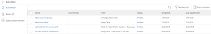
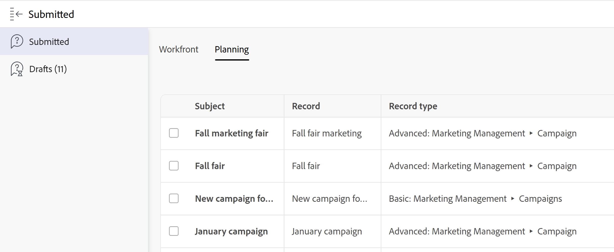

# 제출된 요청 보기

이 페이지에서 강조 표시된 정보는 아직 일반적으로 사용할 수 없는 기능을 참조합니다. 미리 보기 샌드박스 환경에서만 사용할 수 있습니다.

귀하 또는 다른 사람이 제출한 요청 또는 시작했지만 제출하지 않은 요청을 볼 수 있습니다. Adobe Workfront의 다음 영역에서 이러한 요청을 찾을 수 있습니다.

* Workfront에 있는 요청 영역의 **Workfront** 탭: 다음 섹션에서 Workfront 요청 대기열에 제출된 요청을 봅니다.
   * **제출된 섹션**: 귀하 또는 다른 사람이 제출한 모든 요청이며 귀하는 최소한 보기에 액세스할 수 있습니다.
   * **초안 섹션** : 시작했지만 완료하지 않았고 제출한 적이 없는 모든 요청. 초안 요청에 대한 자세한 내용은 [Adobe Workfront 요청 만들기 및 제출](../../../manage-work/requests/create-requests/create-submit-requests.md)을 참조하십시오.

  >[!NOTE]
  >
  >* 자신의 초안 요청만 볼 수 있습니다.
  >* 새 요청 환경에서 제출된 요청 및 초안이 같은 목록에 있습니다. 
  >* 기존 경험에서 만든 초안이 새 요청 경험에 표시되지 않습니다.

* Workfront에 있는 요청 영역의 **계획** 탭: Workfront Planning 요청 양식에 제출된 요청을 봅니다. 조직은 Workfront Planning 패키지를 구매해야 합니다. 자세한 내용은 다음 문서를 참조하십시오.

   * [Adobe Workfront Planning에서 요청 양식 만들기 및 관리](/help/quicksilver/planning/requests/create-request-form.md)
   * [Adobe Workfront Planning 요청을 제출하여 레코드 생성](/help/quicksilver/planning/requests/submit-requests.md)

## 액세스 요구 사항

+++ 이 문서의 기능에 대한 액세스 요구 사항을 보려면 확장하십시오.

<table style="table-layout:auto"> 
 <col> 
 <col> 
 <tbody> 
  <tr> 
   <td role="rowheader">Adobe Workfront 패키지</td> 
   <td> 
임의 
 </td> 
  </tr> 
  <tr> 
   <td role="rowheader">Adobe Workfront 라이선스</td> 
   <td> 
기여자 이상

   
요청 이상

    </td> 
  </tr> 
  <tr> 
   <td role="rowheader">액세스 수준 구성</td> 
   <td>
문제에 대한 액세스 편집
</td> 
  </tr>
  <tr>
   <td role="rowheader">개체 권한</td> 
   <td>
요청에 대한 권한 이상 보기
</td> 
  </tr> 
  <tr> 
   <td role="rowheader"> 제품</td> 
   <td> <ul><li>Adobe Workfront</li><li>Planning 요청 또는 요청 양식을 보려면 Adobe Workfront Planning이 있어야 합니다.</td> 
  </tr> 
 </tbody> 
</table>

자세한 내용은 [Workfront 설명서의 액세스 요구 사항](/help/quicksilver/administration-and-setup/add-users/access-levels-and-object-permissions/access-level-requirements-in-documentation.md)을 참조하십시오.

+++

## 요청 영역에서 제출된 요청 보기

제출된 요청 보기는 새 요청 경험을 사용하는지 아니면 기존 요청 경험을 사용하는지에 따라 다릅니다.

* [새 요청 경험에서 제출된 요청 보기](#view-submitted-requests-in-the-new-requesting-experience)
* [기존 요청 경험에서 제출된 요청 보기](#view-submitted-requests-in-the-legacy-requesting-experience)

### 새 요청 경험에서 제출된 요청 보기

요청 영역 에서 전송된 요청을 볼 수 있습니다. 이 영역에는 해당 요청으로 만들어진 개체에 대한 링크가 포함되어 있습니다.

사용자 또는 다른 사용자가 새 요청 경험에서 제출한 요청을 보려면 다음 작업을 수행하십시오.

{{step1-to-requests}}

1. 화면 오른쪽 상단에서 **새 경험 사용** 토글이 활성화되어 있는지 확인합니다.

   요청 목록이 나타납니다.

1. (선택 사항) 요청을 검색하려면 목록의 오른쪽 상단에 있는 검색 막대에 입력을 시작합니다. 입력하면 검색 결과가 표시됩니다.
1. (선택 사항) **필터**&#x200B;를 클릭하고 표시할 요청에 대한 조건을 추가하기 시작합니다.

   다음 필드를 기준으로 필터링할 수 있습니다.

   * **Workspace**: 요청 양식과 연결된 작업 영역입니다.
   * **레코드 종류**: 요청 양식과 연결된 레코드 종류.
   * **시작 날짜**: 요청이 제출된 날짜입니다.
   * **요청 양식**: 요청을 제출하는 데 사용되는 요청 양식의 이름입니다.
   * **상태**: 요청의 상태입니다.
   * **입력한 사람**: 요청을 추가한 사용자의 이름입니다. Workfront 외부의 사용자가 요청을 추가한 경우 **입력한 사람** 필드에 `N/A`이(가) 표시됩니다.

   **And** 또는 **Or** 중 하나로 여러 필터를 연결할 수 있습니다.
필터 조건을 추가하면 요청 목록이 자동으로 필터링됩니다.
1. (선택 사항) 보기를 사용하여 표시할 요청에 중점을 둡니다.

   지침은 [요청 영역에서 보기 만들기 또는 편집](/help/quicksilver/manage-work/requests/create-requests/create-views-for-requests-list.md)을 참조하십시오.
1. (선택 사항) 상태 열을 선택하여 요청 상태를 확인합니다. 새 요청 경험에서 사용할 수 있는 상태는 다음과 같습니다.

   * 초안: 이 요청은 아직 제출되지 않았습니다.
   * 검토 보류 중
   * 검토 중
   * 거부됨
   * 진행 중
   * 완료

>[!NOTE]
>
>* Workfront Planning이 있는 경우 Workfront 및 Planning 요청이 동일한 목록에 나타납니다. Workfront 요청은 개체 유형 열에 값 `Issue`을(를) 표시합니다.
>* 50개의 요청이 표시된 요청 목록이 나타납니다. 더 많은 요청을 보려면 목록 맨 아래로 스크롤합니다.

### 기존 요청 경험에서 제출된 요청 보기

귀하 또는 다른 사용자가 이전 요청 경험에서 제출한 요청을 보려면 다음을 수행하십시오.

{{step1-to-requests}}

1. (조건부) 조직에서 Workfront Planning 패키지를 구입한 경우 **Workfront** 탭을 클릭하여 Workfront 요청을 봅니다.
1. 제출된 모든 요청을 보려면 왼쪽 패널의 **제출됨**&#x200B;을 클릭합니다.

   최대 2000개의 요청을 볼 수 있으며 여러 페이지에 표시될 수 있습니다.

   >[!TIP]
   >
   >제출된 요청 목록의 열은 사용자 정의할 수 없습니다.

   

1. 기본적으로 다음 열이 표시됩니다.

   <table style="table-layout:auto"> 
      <col> 
      <col> 
      <tbody> 
      <tr> 
         <td role="rowheader">이름</td> 
         <td> 
요청의 이름입니다.
 
요청 이름을 클릭하여 엽니다. 
 
<b>팁</b>

   작업 또는 프로젝트로 전환할 때 문제가 유지되지 않으면 문제의 이름이 흐리게 표시되어 더 이상 클릭할 수 없습니다. 문제 변환에 대한 자세한 내용은 <a href="../../../manage-work/issues/convert-issues/convert-issues.md" class="MCXref xref">Adobe Workfront의 문제 변환 개요</a>를 참조하십시오. 
 </td>
   </tr> 
      <tr> 
         <td role="rowheader">전환 대상:</td> 
         <td> 
요청이 전환된 작업 또는 프로젝트일 수 있는 해결 중 오브젝트의 이름. 
 
작업 또는 프로젝트의 이름을 클릭하여 엽니다. 
 
요청이 전환되지 않은 경우 이 필드는 비어 있습니다. 
 </td> 
      </tr> 
      <tr> 
         <td role="rowheader">경로</td> 
         <td>요청이 원래 제출된 요청 대기열, 주제 그룹 및 대기열 주제의 이름입니다. </td> 
      </tr> 
      <tr> 
         <td role="rowheader">상태</td> 
         <td>요청 또는 해결 중 오브젝트(작업 또는 프로젝트)의 현재 상태</td> 
      </tr> 
      <tr> 
         <td role="rowheader">입력 일자</td> 
         <td>요청이 제출된 날짜 또는 전환 시 요청이 삭제된 경우 해결 중 오브젝트가 생성된 날짜입니다. </td> 
      </tr> 
      <tr> 
         <td role="rowheader">마지막 업데이트 날짜</td> 
         <td> 
요청이 마지막으로 업데이트된 날짜.
 
Submitted 요청 목록은 기본적으로 이 필드별로 정렬됩니다. 
 </td> 
      </tr> 
      </tbody> 
      </table>

1. (선택 사항) 정렬할 열의 헤더를 클릭합니다.

   >[!TIP]
   >
   >제출된 요청 목록에서 멀리 이동하면 선택한 정렬 옵션이 유지됩니다.

1. (선택 사항) 목록에서 요청을 선택한 다음 **요약 열기** 아이콘 을(를) 클릭하여 요약 패널을 열고 요청에 대한 추가 정보를 표시하거나 설명, 문서를 추가하거나 할당합니다. 요약 패널에 대한 자세한 내용은 [요약 개요](../../../workfront-basics/the-new-workfront-experience/summary-overview.md)를 참조하십시오.

   >[!TIP]
   >
   >요약 패널이 이미 열려 있는 경우 요약 열기 아이콘이 요약 닫기로 변경됩니다.

1. (선택 사항 및 조건부) 오른쪽 위의 **X** 아이콘 또는 **요약 닫기** 아이콘 을 클릭하여 요약 패널을 닫습니다.

   문제가 작업 또는 프로젝트로 전환되고 전환 프로세스에서 문제가 삭제된 경우 요약 패널이 비어 있습니다. 문제 변환에 대한 자세한 내용은 [Adobe Workfront의 문제 변환 개요](../../../manage-work/issues/convert-issues/convert-issues.md)를 참조하십시오.

1. 목록의 오른쪽 상단에 있는 **필터 아이콘** 에서 아래 표에 나열된 필터를 선택하십시오.

   >[!TIP]
   >
   >요청 영역의 제출됨 섹션에서 필터를 수정할 수 없습니다.

   <table style="table-layout:auto"> 
    <col> 
    <col> 
    <tbody> 
     <tr> 
      <td role="rowheader">모두</td> 
      <td>상태 또는 제출한 사람에 관계없이 모든 제출된 요청.</td> 
     </tr> 
     <tr> 
      <td role="rowheader">열기</td> 
      <td> 
누가 제출했는지에 상관없이 현재 열려 있는 모든 제출된 요청. 직접 제출하지 않은 경우 적어도 볼 수 있는 권한이 있는 요청만 여기에 표시됩니다. 
 
실제 완료 일자가 없거나 해결 중인 객체에 실제 완료 일자가 없는 요청은 열기 하위 탭에 나열됩니다.
 
<b>팁</b>

   Closed와 동일하지 않은 모든 상태에 있는 요청은 Open으로 간주됩니다.
 </td>
   </tr> 
     <tr> 
      <td role="rowheader">내 요청</td> 
      <td>상태에 관계없이 제출한 요청. </td> 
     </tr> 
     <tr> 
      <td role="rowheader">내 진행 중 요청</td> 
      <td> 
제출한 요청이 아직 열려 있습니다. 
 
실제 완료 일자가 없거나 해결 중인 객체에 실제 완료 일자가 없는 요청은 [내 진행 중인 요청] 하위 탭에 나열됩니다. 
 
<b>팁</b>

   Closed와 동등한 상태가 아닌 요청은 Open으로 간주됩니다.
 </td>
   </tr> 
    </tbody> 
   </table>

1. (선택 사항) 이름 순으로 요청을 검색하려면 목록 맨 위에 있는 **페이지 필터링** 아이콘 을(를) 클릭합니다. 목록이 검색 기준과 일치하는 결과로 업데이트됩니다.

1. (조건부) Workfront 요청 대기열만 표시하려면 `Issue` 개체 형식을 검색하거나 필터링하십시오.

   <!--
   <li value="9" data-mc-conditions="QuicksilverOrClassic.Draft mode"> 
Click the <strong>Complete</strong> subtab to view requests that have been completed.
 
(NOTE: this step will stay drafted even after release. We can't see Completed at this time!)  Requests with an Actual Completion Date or whose resolving object has an Actual Completion Date are listed in the Complete subtab. Once a request receives an Actual Completion Date, it stays in the Recently Completed area for 10 business days. After that, it is moved to the Completed area.  For information about resolving and resolvable objects, see the article <a href="../../../manage-work/issues/convert-issues/resolving-and-resolvable-objects.md" class="MCXref xref">Overview of Resolving and Resolvable Objects </a>.
 </li>
   -->

   <!--
   <li value="10" data-mc-conditions="QuicksilverOrClassic.Draft mode">(Optional) Select an option from the <strong>Sort by</strong> drop-down menu to sort the requests by the following criteria:   (NOTE: this step will stay drafted even after release. We can't see Completed at this time!)  
   <ul>
   <li><strong>Assigned To</strong>: Requests are sorted alphabetically by the name of the assignee using the following criteria: 
   <ul>
   <li>All requests assigned to users are sorted first, in the order of the users' names.</li>
   <li>Requests assigned to job roles are sorted secondly, in the order of the job roles' names and are listed after all the requests assigned to users.</li>
   <li>Requests that are assigned to teams are sorted last, in the order of the teams' names and are listed after all the requests assigned to users and those assigned to job roles.</li>
   <li>All unassigned requests are listed last, in the order of their Entry Date. </li>
   </ul></li>
   <li><strong>Submitted On</strong>: Requests are sorted chronologically by the date when they were submitted.</li>
   <li><strong>Recently Updated</strong> (this is the default): Requests are sorted chronologically by the date of their last update.</li>
   <li><strong>Name</strong>: Requests are sorted alphabetically by name. </li>
   <li><strong>Priority</strong>: Requests are sorted in the order of their priority.</li>
   <li><strong>Queue</strong>: Requests are sorted alphabetically by the name of the requests queue where they were submitted. </li>
   <li><strong>Status</strong>: Requests are sorted alphabetically by their status. </li>
   </ul></li>
   -->

1. 모든 초안 요청을 보려면 **초안**&#x200B;을 클릭하십시오. Workfront은 이 폴더의 각 요청 대기열에 대해 초안을 무제한으로 저장합니다. 이미 초안이 있는 대기열 주제에 대한 새 요청을 입력하면 기존 초안을 사용하라는 메시지가 표시됩니다. 자세한 내용은 [초안에서 요청 만들기](../../../manage-work/requests/create-requests/create-requests-from-drafts.md)를 참조하십시오.

1. (선택 사항 및 조건부) 조직에서 Workfront Planning 패키지를 구입한 경우 **계획** 탭을 클릭한 다음 왼쪽 패널에서 **제출됨**&#x200B;을 클릭하여 Workfront Planning 요청을 봅니다.

   **필터** 및 **열**&#x200B;을(를) 사용하여 Planning 요청 목록의 정보를 업데이트하십시오.

   

   자세한 내용은 [레코드를 만들도록 Adobe Workfront Planning 요청 제출](/help/quicksilver/planning/requests/submit-requests.md)을 참조하십시오.

1. (선택 사항) 상태 열을 선택하여 요청 상태를 확인합니다. 새 요청 경험에서 사용할 수 있는 상태는 다음과 같습니다.

   * 초안: 이 요청은 아직 제출되지 않았습니다.
   * 진행 중
   * 완료

