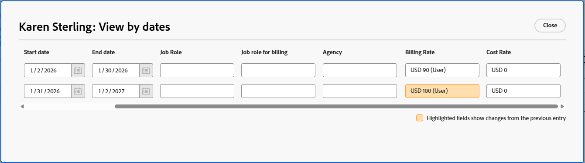

# 고급 할당 만들기

<!-- Audited: 11/2025-->

<!--remove the bullet indicated when we get rid of the new/old experience of editing tasks-->

<!--

 

The highlighted information on this page refers to functionality not yet generally available. It is available only in the Preview environment for all customers. The same features will also be available in the Production environment for all customers starting with  a week from the Preview release.      

For more information, see [Interface modernization](/help/quicksilver/product-announcements/product-releases/interface-modernization/interface-modernization.md).  

-->

고급 할당을 사용하여 작업 또는 문제 할당을 관리할 수 있습니다.

고급 발령을 수행할 때 다음 발령 정보를 조정할 수 있습니다.

* 작업 또는 문제에 사용자를 할당합니다(고급 할당 외부에서 수행할 수 있음).
* 각 할당자가 할당된 시간을 조정하고 재배포합니다.
* 작업 또는 문제의 소유자 또는 기본 피할당자로 지정되어야 하는 사용자를 결정합니다.
* 작업 또는 문제를 작업할 때 각 사용자가 수행할 역할을 지정합니다.
* 지정 레벨에서 청구 및 비용 요금 정보를 추가합니다.
* 각 발령에 대해 계획된 시간, 총 비용 및 총 수익 상세내역을 검토합니다.

>[!NOTE]
>
>작업에 사용자를 할당할 때 예약에 따라 가용성이 작업 및 문제의 계획 및 예상 일자에 영향을 줍니다. 일정에 대한 자세한 내용은 [일정 만들기](../../../administration-and-setup/set-up-workfront/configure-timesheets-schedules/create-schedules.md)를 참조하십시오.

## 고급 할당을 수행할 수 있는 Adobe Workfront 영역

이 문서에서는 작업 또는 문제 헤더의 고급 할당에 액세스하는 방법에 대해 설명합니다.

또한 Workfront의 다음 영역에서 고급 할당을 수행할 수 있습니다.

* 목록 및 보고서에서 할당 필드가 보기에 표시됩니다.
* 작업을 편집할 때 할당 섹션에서 다음을 수행합니다. 자세한 내용은 [작업 편집](../../../manage-work/tasks/manage-tasks/edit-tasks.md)을 참조하십시오. <!--When we remove the old/ new experience: take this bullet out completely; in the new Edit Task experience, this is no longer possible-->
* 작업 또는 문제 헤더의 할당 영역에서 다음을 수행합니다.
* 업무 균형자에서. 자세한 내용은 [업무 균형자를 사용하여 수동으로 작업 할당](../../../resource-mgmt/workload-balancer/assign-work-in-workload-balancer-manually.md)을 참조하십시오.

## 액세스 요구 사항

+++ 이 문서의 기능에 대한 액세스 요구 사항을 보려면 확장하십시오.

<table style="table-layout:auto"> 
 <col> 
 <col> 
 <tbody> 
  <tr> 
   <td>Adobe Workfront 패키지</td> 
   <td> 
작업 할당에 청구 및 비용 요율을 추가하고 고급 검색을 사용하려면: Workflow Ultimate
 
고급 할당을 만들려면: 모든 Workfront 또는 워크플로 패키지
</td> 
  </tr> 
  <tr> 
   <td>Adobe Workfront 라이선스</td> 
   <td> 
표준

   
작업 이상

   </td> 
  </tr> 
  <tr> 
   <td role>액세스 수준 구성</td> 
   <td> 
작업 및 문제에 대한 액세스 편집
  </td> 
  </tr> 
  <tr> 
   <td>개체 권한</td> 
   <td> 
작업 또는 문제에 대한 기여 또는 더 높은 권한
</td> 
  </tr> 
 </tbody> 
</table>

자세한 내용은 [Workfront 설명서의 액세스 요구 사항](/help/quicksilver/administration-and-setup/add-users/access-levels-and-object-permissions/access-level-requirements-in-documentation.md)을 참조하십시오.

+++

## 고급 할당 만들기 - Workflow Ultimate 패키지

이 고급 할당 레이아웃은 작업에만 적용됩니다. 문제에 대해서는 [고급 할당 만들기 - 다른 모든 패키지](#create-advanced-assignments--all-other-packages)를 참조하십시오.

>[!NOTE]
>
>이전의 고급 할당 경험은 기본값입니다. 고급 지정 창의 오른쪽 상단에 있는 버튼을 사용하여 새 경험을 수동으로 켜야 합니다.
>이전 경험에 대한 자세한 내용은 아래의 [고급 할당 만들기 - 기타 모든 패키지](#create-advanced-assignments--all-other-packages)를 참조하십시오.

1. 작업을 할당할 프로젝트로 이동합니다.
1. 왼쪽 패널에서 **작업** 또는 **문제**&#x200B;를 클릭한 다음 목록에서 작업 이름을 클릭합니다.

   >[!TIP]
   >
   >작업 목록에서 직접 고급 할당을 수행할 수 있습니다. 작업과 같은 줄에 있는 **할당** 필드 내부를 클릭한 다음 목록의 맨 아래에 있는 **고급** 또는 할당 상자의 오른쪽 위 모서리에 있는 **사람 아이콘**&#x200B;을 클릭하여 고급 할당 창을 엽니다. 5단계로 건너뛰고 고급 할당을 계속 작성합니다.
   >

1. 작업 헤더의 **할당** 필드에서 **할당 대상**&#x200B;을 클릭합니다

   또는

   작업이 이미 할당된 경우 할당된 이름 중 하나를 클릭합니다.

1. **고급**&#x200B;을 클릭합니다.

   

   고급 지정 창이 나타납니다.

   

1. 필요에 따라 작업 기간 정보를 검토합니다. 이러한 필드는 고급 할당에서 모두 보기 전용이며 작업에서 업데이트할 수 있습니다.

   작업 기간, 기간 유형, 시간 단위 및 계획된 시간에 대한 자세한 내용은 [작업 기간 및 기간 유형 개요](/help/quicksilver/manage-work/tasks/taskdurtn/task-duration-and-duration-type.md)를 참조하십시오.

   >[!NOTE]
   >
   >보려는 데이터 열이 표시되지 않으면 추가할 수 있습니다. 아래의 [고급 할당 목록에서 열을 추가 및 제거](#add-and-remove-columns-on-the-advanced-assignments-list)하십시오.

1. (선택 사항) 할당을 보려면 **시간**, **FTE** 또는 **백분율**&#x200B;을 선택하십시오.

   계획된 시간, 용량 비율로 또는 FTE(Full-Time Equivalent, 0-1 scale)로 할당된 사용자의 양을 확인할 수 있습니다. 기본 설정은 시간입니다.

   FTE에 대한 자세한 내용은 [리소스 관리 환경 설정 구성](/help/quicksilver/administration-and-setup/set-up-workfront/configure-system-defaults/configure-resource-mgmt-preferences.md)을 참조하세요.

1. 작업에 할당을 추가하려면 **새 행**&#x200B;을 클릭하세요.

1. **피할당자** 열을 클릭하여 사용자 또는 팀을 추가합니다. 사용자 또는 팀의 이름을 입력한 다음 드롭다운 목록에 표시될 때 이름을 클릭합니다.

   >[!NOTE]
   >
   >이름에 특수 문자가 포함되어 있으면 검색 필드에 특수 문자를 포함해야 합니다.

   기본 작업 역할이 있는 사용자를 추가하면 **피할당자 역할**&#x200B;이 채워집니다.

   사용자에게 프로필에 할당된 속성이 있는 경우 해당 속성이 작업 할당에 채워집니다.

1. 작업을 수행할 사용자를 모를 때 작업 역할을 추가하려면 **피할당자 역할** 열을 클릭합니다. 작업 역할의 이름을 입력한 다음 드롭다운 목록에 표시될 때 이름을 클릭합니다.

   >[!NOTE]
   >
   >이름에 특수 문자가 포함되어 있으면 검색 필드에 특수 문자를 포함해야 합니다.

   작업 역할에 프로젝트의 비율 카드에서 할당된 속성이 있는 경우 해당 속성이 작업 할당에 채워집니다.

   나중에 할당자 필드를 사용하여 사용자를 할당하면 기본 검색이 다음 알고리즘을 따릅니다.

   * 전체 일치: 작업 역할 및 모든 속성
   * 부분 일치: 작업 역할 및 일부 속성
   * 작업 역할 일치만

   고급 검색에 대한 자세한 내용은 이 문서에서 [고급 검색 사용](#use-the-advanced-search)을 참조하십시오.

1. (선택 사항) 새 행에 피할당자를 계속 추가하여 작업에 여러 리소스를 추가합니다.

   >[!TIP]
   >
   >* 여러 사용자, 작업 역할 또는 팀을 할당할 수 있습니다. 활성 사용자, 작업 역할 및 팀만 할당할 수 있습니다. 작업당 최대 200명의 할당자가 허용됩니다.
   >
   >
   >* 사용자 할당을 추가할 때 아바타, 사용자의 기본 역할 또는 이메일 주소에 따라 이름이 동일한 사용자가 구분되는지 확인합니다.
   >사용자를 추가할 때 이를 보려면 사용자를 하나 이상의 작업 역할과 연결해야 합니다.
   >사용자의 이메일을 보려면 사용자의 액세스 수준에서 연락처 정보 보기 설정을 활성화해야 합니다. 자세한 내용은 [사용자에게 액세스 권한 부여](../../../administration-and-setup/add-users/configure-and-grant-access/grant-access-other-users.md)를 참조하십시오.
   >
   >
   >* 비활성화되기 전에 사용자, 작업 역할 또는 팀이 할당된 경우 작업 항목에 할당된 상태로 유지됩니다. 이 경우 다음 사항을 권장합니다.
   >   
   >   * 작업 항목을 활성 리소스에 재할당합니다.
   >   * 비활성화된 팀의 사용자를 활성 팀과 연결하고 작업 항목을 활성 팀에 재할당합니다.

1. 피할당자를 작업 소유자로 표시하려면 행에 대한 확인란을 선택하고 고급 할당 창 하단의 작업 표시줄에서 **기본 설정**&#x200B;을 클릭합니다.

   기본적으로 Workfront은 작업에 할당한 첫 번째 사용자 또는 작업 역할을 소유자 또는 기본 할당으로 표시합니다. 팀을 작업의 기본 소유자로 지정할 수 없습니다.

   작업의 기본 소유자가 표시되지 않으면 **기본** 열을 테이블에 추가할 수 있습니다.

   >[!IMPORTANT]
   >
   >Workfront 관리자 또는 그룹 관리자가 프로젝트 환경 설정을 설정하는 방법에 따라 Workfront은 작업에 여러 명의 사용자를 할당한 경우 작업 소유자의 일정을 사용하여 작업의 타임라인을 계산할 수 있습니다. 여러 작업 할당자에 대한 자세한 내용은 [작업 할당](/help/quicksilver/manage-work/tasks/assign-tasks/assign-tasks.md#considerations-for-multiple-assignments-to-job-roles-teams-and-users) 문서의 [작업 역할, 팀 및 사용자에 대한 여러 할당 고려 사항](../../../manage-work/tasks/assign-tasks/assign-tasks.md) 섹션을 참조하십시오.

1. **피할당자** 열의 각 사용자에 대해 다음 정보를 지정하십시오.

   * (선택 사항) **대금 청구에 대한 작업 역할**: 이 특정 담당자 및 작업에 대한 대금 청구에 대한 작업 역할을 검색하고 선택합니다.

     청구에 대한 작업 역할은 이 할당에만 사용되며 사용자의 다른 할당에는 자동으로 적용되지 않습니다. 예를 들어 사용자의 기본 작업 역할은 Designer이지만 하나의 작업에서 사용자는 선임 Designer 역할을 하며 청구 요금은 이를 반영해야 합니다. 청구에 대한 작업 역할은 사용자에게만 적용되며 다른 작업 역할에서는 사용할 수 없습니다.

     사용자 지정에 청구용 작업 역할이 적용되면 청구 및 수익 계산에서 사용자 또는 작업 역할 요금 대신 청구용 작업 역할에 첨부된 요금을 사용할 수 있습니다.

     청구에 대한 프로젝트 수준의 작업 역할도 사용자에 대해 설정할 수 있으며 이 값은 해당 프로젝트에 대한 모든 사용자의 할당에 사용됩니다.

     자세한 내용은 [청구에 대한 작업 역할 설정](/help/quicksilver/manage-work/projects/project-finances/set-up-job-role-for-billing.md)을 참조하세요.

   * **할당**: 작업의 기간 유형이 간단한 경우 각 사용자 또는 작업 역할이 작업에 할당되어야 하는 시간을 지정합니다. 각 사용자에 대해 할당된 모든 시간의 합계는 고급 할당 창의 맨 위에 있는 **계획된 시간** 필드의 숫자와 같습니다. 다른 모든 경우에는 피할당자가 작업을 해결하는 데 소비할 시간(또는 할당)의 백분율을 지정합니다.

     >[!TIP]
     >
     >작업에 대한 할당 할당을 수동으로 수정한 후 작업의 계획된 시간이 그에 따라 업데이트될 수 있습니다. 작업에 할당된 팀의 할당은 수동으로 수정할 수 없습니다. 자세한 내용은 문서 [계획된 시간 개요](/help/quicksilver/manage-work/tasks/task-information/planned-hours.md#update-task-planned-hours-when-managing-user-allocations)에서 [사용자 할당을 관리할 때 작업 계획된 시간 업데이트](/help/quicksilver/manage-work/tasks/task-information/planned-hours.md) 섹션을 참조하십시오.

   * **특성**: 사용자가 사용할 수 있는 모든 특성이 특성 필드에 표시됩니다. 관리자가 속성을 설정하고 속성을 사용자 프로필에 추가하거나 비율 카드의 작업 역할과 연관시킵니다. 자세한 내용은 [비율 특성 정의](/help/quicksilver/administration-and-setup/manage-enterprise-operations/define-rate-attributes.md) 및 [사용자 프로필 편집](/help/quicksilver/administration-and-setup/add-users/create-and-manage-users/edit-a-users-profile.md)을 참조하세요.

     속성은 현재 사용자 할당에 대해 읽기 전용입니다. 작업 역할에 대해 편집할 수 있습니다.

   * **환율 통화**: 청구 및 비용 요금에 대한 통화가 프로젝트에서 기본 설정되었지만, 이 할당에 대한 통화를 변경할 수 있습니다.

   * (선택 사항) **청구 요금**: 청구 요금은 요금 카드와 같은 시스템의 다른 영역에서 나올 수 있습니다. 자세한 내용은 [수익 및 비용 계층 구조 개요](/help/quicksilver/manage-work/projects/project-finances/overview-revenue-cost-hierarchy.md)를 참조하십시오. 이 필드에서 이 특정 지정에 대한 청구 요금을 수동으로 대체할 수 있으며 수익 계산에서 사용자에 대한 다른 모든 요금을 무효화합니다.
   * (선택 사항) **비용 비율**: 비용 비율은 시스템의 다른 영역에서 가져올 수 있습니다. 자세한 내용은 [수익 및 비용 계층 구조 개요](/help/quicksilver/manage-work/projects/project-finances/overview-revenue-cost-hierarchy.md)를 참조하십시오. 이 필드에서 이 특정 지정에 대한 원가율을 수동으로 대체할 수 있으며 원가 계산에서 사용자에 대한 다른 모든 원가율을 무효화합니다.
   * **청구 가능**: 재무 계산에 할당을 포함하려면 이 옵션을 선택하십시오. 발령을 재무 계산에서 제외하려면 이 옵션의 선택을 취소합니다.

     이 필드는 작업에 수익 유형이 있는 경우 모든 할당에 대해 기본적으로 설정됩니다.

1. (선택 사항) 사용자 또는 역할에 대한 날짜별 할당 데이터를 보려면 테이블 행을 선택하고 고급 할당 창 하단의 작업 표시줄에서 **날짜별 보기**&#x200B;를 클릭합니다. 자세한 내용은 이 문서에서 [날짜별 할당 데이터 보기](#view-assignment-data-by-dates)를 참조하십시오.
1. (선택 사항) 목록에서 하나 이상의 할당을 삭제하려면 각 행에 대한 확인란을 선택한 다음 고급 할당 창 하단의 작업 표시줄에서 **삭제**&#x200B;를 클릭합니다.
1. 고급 할당 편집을 마치면 **저장** 또는 **저장 후 닫기**&#x200B;를 클릭합니다.

### 고급 할당 목록에서 열 추가 및 제거

목록에 추가하려면 먼저 필드가 있어야 합니다.

1. 목록 오른쪽 상단의 **+**&#x200B;을(를) 클릭하여 **열 관리자**&#x200B;를 엽니다.

   

1. 추가할 필드 형식을 선택하려면 **속성** 탭이나 **KPI** 탭을 선택하십시오.

   위치 또는 비용 센터와 같은 속성을 통해 상황별 정보를 제공합니다. 기간 간 수익 또는 비용 분석 값과 같은 시간 단계별 KPI.

1. **사용 가능** 섹션에서 기존 개체 필드를 검색한 다음 필드 이름 오른쪽의 **+**&#x200B;을(를) 클릭하여 **선택됨** 열에 추가합니다.
1. 목록에서 제거하려면 **선택됨** 섹션의 필드 오른쪽에 있는 **-**&#x200B;을(를) 클릭하십시오.
1. **저장**&#x200B;을 클릭합니다.

   열 관리자에 대한 자세한 내용은 [향상된 목록 사용](/help/quicksilver/workfront-basics/navigate-workfront/use-lists/enhanced-lists.md)을 참조하세요.

### 고급 지정 목록에 보기 적용

보기는 목록에 적용할 수 있는 개인화된 열 배열 세트입니다.

1. **보기** 드롭다운을 클릭하고 목록에 적용할 보기를 선택합니다.

   **시스템 보기**&#x200B;는 시스템 관리자가 추가한 보기이며 변경할 수 없습니다. **내 보기**&#x200B;는 사용자가 만들었거나 사용자와 공유한 보기입니다.

1. **보기** 드롭다운에서 **새 보기**&#x200B;를 클릭하여 보기를 만듭니다.

   열을 추가, 제거 또는 재정렬하면 변경 사항이 뷰에 자동으로 저장됩니다. 다음에 이 보기를 적용할 때는 열이 설정된 방식으로 유지됩니다.

   보기에 대한 자세한 내용은 [고급 목록 사용](/help/quicksilver/workfront-basics/navigate-workfront/use-lists/enhanced-lists.md)을 참조하세요.

### 고급 검색 사용

고급 검색을 사용하면 지정에 추가할 올바른 사용자 또는 작업 역할을 찾을 수 있습니다.

1. 고급 검색 창을 열려면 다음 중 하나를 수행합니다.

   * 고급 할당 창의 오른쪽 상단에 있는 **고급 검색**&#x200B;을 클릭합니다.
   * 할당 행을 선택하고 [고급 할당] 창의 아래쪽에 있는 작업 표시줄에서 **고급 검색**&#x200B;을 클릭합니다. 이렇게 하면 특정 할당에 대해 자동으로 적용된 필터를 사용하여 고급 검색이 열립니다.

1. 고급 검색 창에서 사용자 또는 작업 역할 탭을 선택합니다.
1. 필요에 따라 필터 적용:

   1. 목록 위에 있는 **필터**&#x200B;를 클릭합니다.
   1. 필터 상자에서 **조건 추가**&#x200B;를 클릭합니다.
   1. 필터링 기준으로 사용할 필드를 선택합니다.
   1. &quot;다음 중 하나 이상의 항목 있음&quot;, &quot;다음 중 하나 이상의 항목 없음&quot;, &quot;다음 이전&quot; 또는 &quot;다음 이후&quot;와 같은 필터 수정자를 선택합니다. 수정자 옵션은 필터링 기준으로 사용하는 필드 유형에 따라 다릅니다.
   1. 필드 값 또는 값을 선택합니다. 필터링 기준으로 사용하는 필드 유형에 따라 목록에서 항목을 선택하거나 검색하거나 달력을 사용하여 날짜 범위를 선택하라는 메시지가 표시될 수 있습니다.

   필터가 목록에 자동으로 적용됩니다. 필터에 대한 자세한 내용은 [고급 목록 사용](/help/quicksilver/workfront-basics/navigate-workfront/use-lists/enhanced-lists.md)을 참조하세요.

1. 작업 역할 또는 사용자를 검색합니다.

   작업 역할 할당과 일치하는 사용자를 검색할 때 전체 일치(작업 역할 및 모든 속성)만 표시됩니다.

1. 테이블에 열을 추가하려면 **+**&#x200B;을(를) 클릭하십시오. 자세한 내용은 [고급 할당 목록에서 열 추가 및 제거](#add-and-remove-columns-on-the-advanced-assignments-list)를 참조하십시오.
1. 하나 이상의 사용자 또는 작업 역할을 선택하고 창 하단의 작업 표시줄에서 **사용자 추가** 또는 **역할 추가**&#x200B;를 클릭합니다.

   지정이 고급 지정 창에 추가됩니다.

### 날짜별 할당 데이터 보기

고급 할당에 대한 **날짜별 보기** 창에는 특정 사용자 또는 역할에 대한 할당의 전체 날짜 유효 기록이 표시됩니다. 과거 및 미래 변경 사항이 모두 표시됩니다.

발령 내역에 영향을 미칠 수 있는 일자 유효 항목의 예는 다음과 같습니다.

* 사용자의 기본/기타 작업 역할
* 청구에 대한 프로젝트 수준 작업 역할
* 사용자 프로필 청구/비용 요금
* 프로젝트 대체 청구/비용 요금(사용자 또는 작업 역할)
* 작업 역할/속성별 카드 비율
* 사용자 속성
* 사용자 일정

이 목록은 전체 목록이 아니며 변경된 필드가 반드시 지정 데이터 테이블에 표시되는 것은 아니지만 사용자 또는 작업 역할에 대한 청구 및 비용 요금 또는 속성에 영향을 줍니다.

단일 사용자 또는 역할에 대한 일자별 할당 데이터만 볼 수 있습니다.

1. 사용자 또는 역할에 대한 테이블 행을 선택하고 고급 할당 창 하단의 작업 표시줄에서 **날짜별 보기**&#x200B;를 클릭합니다.

   **날짜별 보기** 창이 나타납니다. 데이터는 읽기 전용입니다.

   테이블의 각 행은 지정에 대한 일자 유효 변경 사항을 나타냅니다. 날짜 유효 변경 사항이 발생하지 않은 경우 테이블에는 현재 데이터를 보여주는 행이 한 개 있습니다. 강조 표시된 필드에는 변경된 내용이 표시되며 각 업데이트의 시작 및 종료 날짜가 나열됩니다. 예를 들어, 8월 20일 202에서 8월 21일 205로 청구 요금이 변경된 경우 요금이 강조 표시됩니다. 괄호로 묶인 텍스트는 비율이 변경된 위치(예: 프로젝트)를 나타냅니다.

   

   데이터 검토를 마쳤으면 왼쪽 상단의 화살표를 눌러 고급 지정 창으로 돌아갑니다.

## 고급 할당 만들기 - 기타 모든 패키지

이 고급 할당 레이아웃은 작업과 문제 모두에 적용됩니다.

1. 작업 또는 문제를 할당할 프로젝트로 이동합니다.
1. 왼쪽 패널에서 **작업** 또는 **문제**&#x200B;를 클릭한 다음 목록에서 작업 또는 문제의 이름을 클릭합니다.

   >[!TIP]
   >
   >작업 또는 문제 목록에서 직접 고급 할당을 수행할 수 있습니다. 작업 또는 문제와 같은 줄에 있는 **할당** 필드 내부를 클릭한 다음, 목록의 맨 아래에 있는 **고급** 또는 할당 상자의 오른쪽 위 모서리에 있는 **사람 아이콘**&#x200B;을 클릭하여 고급 할당 창을 엽니다. 5단계로 건너뛰고 고급 할당을 계속 작성합니다.
   >

1. 작업 또는 문제의 헤더에 있는 **할당** 필드에서 **할당 대상**&#x200B;을 클릭합니다

   또는

   작업 또는 문제가 이미 할당된 경우 할당된 이름 중 하나를 클릭합니다.

1. **고급**&#x200B;을 클릭합니다.

   

1. **사람, 역할 및 팀 검색** 필드에서 사용자, 역할 또는 팀의 이름을 입력한 다음 드롭다운 목록에 나타나면 이름을 클릭합니다.

   >[!NOTE]
   >
   >사용자 이름에 특수 문자가 포함되어 있으면 검색 필드에 특수 문자를 포함해야 합니다.

1. (선택 사항) **사람, 역할 및 팀 검색** 상자에서 피할당자를 계속 추가하여 작업 또는 문제에 여러 리소스를 추가합니다.

   >[!TIP]
   >
   >* 여러 사용자, 작업 역할 또는 팀을 할당할 수 있습니다. 활성 사용자, 작업 역할 및 팀만 할당할 수 있습니다.
   >
   >
   >* 사용자 할당을 추가할 때 아바타, 사용자의 기본 역할 또는 이메일 주소에 따라 이름이 동일한 사용자가 구분되는지 확인합니다.
   >사용자를 추가할 때 이를 보려면 사용자를 하나 이상의 작업 역할과 연결해야 합니다.
   >사용자의 이메일을 보려면 사용자의 액세스 수준에서 연락처 정보 보기 설정을 활성화해야 합니다. 자세한 내용은 [사용자에게 액세스 권한 부여](../../../administration-and-setup/add-users/configure-and-grant-access/grant-access-other-users.md)를 참조하십시오.
   >
   >
   >* 비활성화되기 전에 사용자, 작업 역할 또는 팀이 할당된 경우 작업 항목에 할당된 상태로 유지됩니다. 이 경우 다음 사항을 권장합니다.
   >   
   >   * 작업 항목을 활성 리소스에 재할당합니다.
   >   * 비활성화된 팀의 사용자를 활성 팀과 연결하고 작업 항목을 활성 팀에 재할당합니다.

1. **피할당자** 열의 각 사용자에 대해 다음 정보를 지정하십시오.

   * **소유자**: 피할당자를 작업 또는 문제 소유자로 표시하려면 피할당자의 이름을 마우스로 가리킨 다음 소유자 필드의 **기본 항목으로 설정**&#x200B;을 클릭합니다. 녹색 확인란은 지정된 사용자가 작업 또는 문제의 기본 담당자임을 나타냅니다. Adobe Workfront은 작업 또는 문제에 할당한 첫 번째 사용자 또는 작업 역할을 소유자 또는 기본 할당으로 표시합니다. 팀을 작업 또는 문제의 기본 소유자로 지정할 수 없습니다.

     >[!IMPORTANT]
     >
     >Workfront 관리자 또는 그룹 관리자가 프로젝트 환경 설정을 설정하는 방법에 따라 Workfront은 작업에 여러 명의 사용자를 할당한 경우 작업 소유자의 일정을 사용하여 작업의 타임라인을 계산할 수 있습니다. 여러 작업 할당자에 대한 자세한 내용은 [작업 할당](/help/quicksilver/manage-work/tasks/assign-tasks/assign-tasks.md#considerations-for-multiple-assignments-to-job-roles-teams-and-users) 문서의 [작업 역할, 팀 및 사용자에 대한 여러 할당 고려 사항](../../../manage-work/tasks/assign-tasks/assign-tasks.md) 섹션을 참조하십시오.

   * **할당**: 작업의 기간 유형이 간단한 경우 각 사용자 또는 작업 역할이 작업에 할당되어야 하는 시간을 지정합니다. 각 사용자에 대해 할당된 모든 시간의 합계는 [할당] 열의 맨 아래에 있는 **계획된 시간** 필드의 숫자와 같습니다. 다른 모든 경우에는 할당자가 작업 또는 문제를 해결하는 데 소비할 시간(또는 할당)의 백분율을 지정합니다.

     >[!TIP]
     >   
     >   * 작업에 대한 할당 할당을 수동으로 수정한 후 작업의 계획된 시간이 그에 따라 업데이트될 수 있습니다. 자세한 내용은 문서 [계획된 시간 개요](/help/quicksilver/manage-work/tasks/task-information/planned-hours.md#update-task-planned-hours-when-managing-user-allocations)에서 [사용자 할당을 관리할 때 작업 계획된 시간 업데이트](/help/quicksilver/manage-work/tasks/task-information/planned-hours.md) 섹션을 참조하십시오.
     >   * 문제에 대한 할당 할당을 수동으로 수정할 수 없습니다.
     >   * 작업에 할당된 팀의 할당은 수동으로 수정할 수 없습니다.

   * **피할당자의 역할:** 이 할당을 수행할 때 사용자가 사용해야 하는 역할을 선택합니다.  사용자의 기본 역할 이 기본적으로 표시됩니다. **피할당자의 역할** 상자를 클릭하여 다른 역할을 선택합니다. 먼저 작업 또는 문제를 역할에 할당한 다음 해당 역할을 수행할 수 있는 사용자를 두 번째 할당으로 추가하면 제안된 사용자 목록이 작업 및 문제에 이미 할당된 역할을 수행할 수 있는 사용자에 대해 필터링됩니다.

     

   * **기간 유형**: 작업에만 사용할 수 있습니다. 기간 유형 이름을 클릭하고 드롭다운 메뉴에서 기간 유형 을 선택합니다. 기간 유형에 대한 자세한 내용은 [작업 기간 및 기간 유형 개요](../../../manage-work/tasks/taskdurtn/task-duration-and-duration-type.md)를 참조하십시오.

   * **기간:** 작업에 대한 관리 권한이 있는 경우 작업에 대해 이 필드를 업데이트할 수 있습니다.

     자세한 내용은 [작업 기간 및 기간 유형 개요](../../../manage-work/tasks/taskdurtn/task-duration-and-duration-type.md)를 참조하십시오. 할당 정보를 일괄 편집할 때 사용자, 시간, 할당 및 작업 소유자를 할당하는 유사한 대화 상자가 나타납니다.

   * **계획된 시간**: 기간 유형이 계산된 할당이거나 단순이면 계획된 시간 수를 업데이트하십시오. 결과적으로 각 리소스에 대한 할당 백분율 또는 시간이 균등하게 분배됩니다. Workfront은 기간 유형이 계산된 작업 또는 작업량 고정 시 계획된 시간을 계산합니다. 자세한 내용은 [작업 기간 및 기간 유형 개요](../../../manage-work/tasks/taskdurtn/task-duration-and-duration-type.md)를 참조하십시오.

1. **저장**&#x200B;을 클릭합니다.

